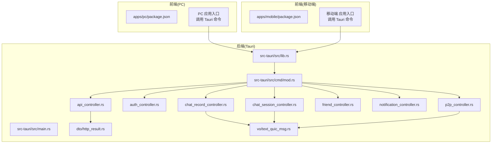
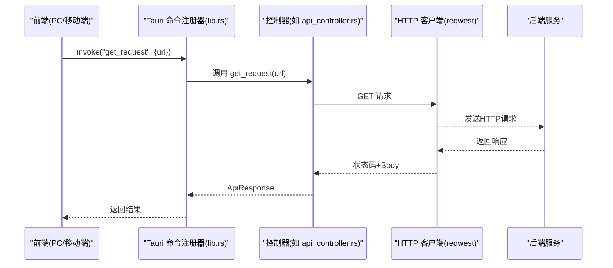
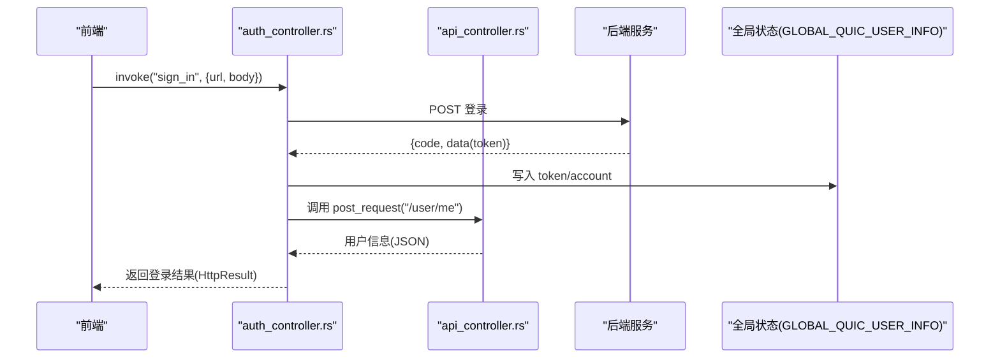
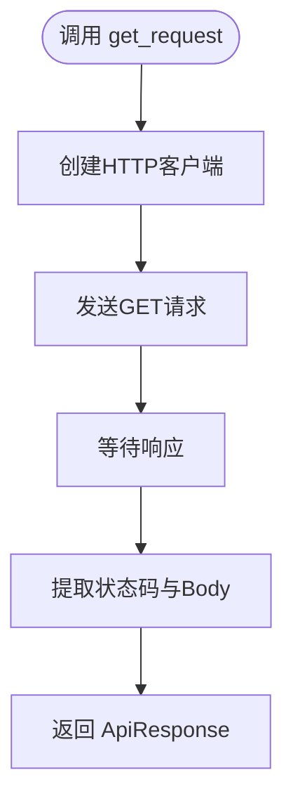
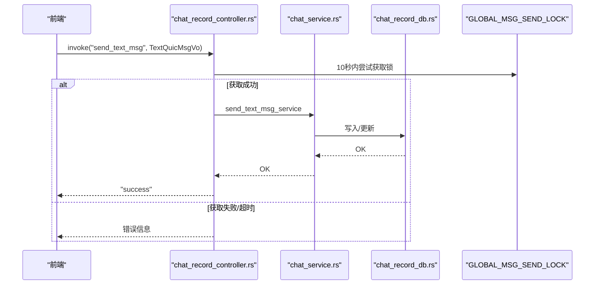
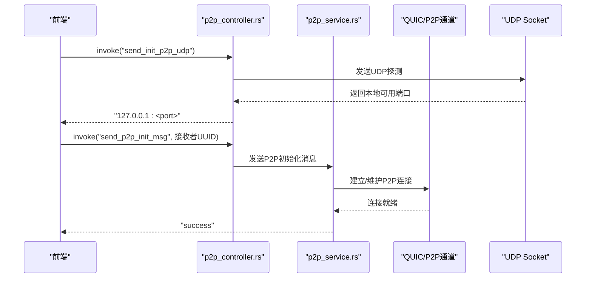
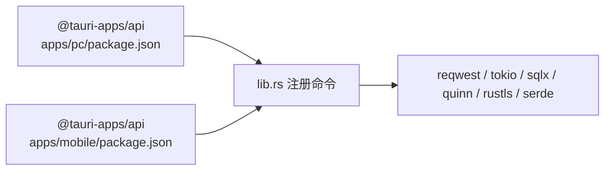

# API参考

<cite>
**本文引用的文件**
- [Cargo.toml](file://src-tauri/Cargo.toml)
- [main.rs](file://src-tauri/src/main.rs)
- [lib.rs](file://src-tauri/src/lib.rs)
- [cmd/mod.rs](file://src-tauri/src/cmd/mod.rs)
- [api_controller.rs](file://src-tauri/src/cmd/api_controller.rs)
- [auth_controller.rs](file://src-tauri/src/cmd/auth_controller.rs)
- [chat_record_controller.rs](file://src-tauri/src/cmd/chat_record_controller.rs)
- [chat_session_controller.rs](file://src-tauri/src/cmd/chat_session_controller.rs)
- [friend_controller.rs](file://src-tauri/src/cmd/friend_controller.rs)
- [notification_controller.rs](file://src-tauri/src/cmd/notification_controller.rs)
- [p2p_controller.rs](file://src-tauri/src/cmd/p2p_controller.rs)
- [http_result.rs](file://src-tauri/src/dto/http_result.rs)
- [text_quic_msg.rs](file://src-tauri/src/vo/text_quic_msg.rs)
- [package.json (PC)](file://apps/pc/package.json)
- [package.json (移动端)](file://apps/mobile/package.json)
</cite>

## 目录
1. [简介](#简介)
2. [项目结构](#项目结构)
3. [核心组件](#核心组件)
4. [架构总览](#架构总览)
5. [详细组件分析](#详细组件分析)
6. [依赖关系分析](#依赖关系分析)
7. [性能与并发特性](#性能与并发特性)
8. [故障排查与错误码](#故障排查与错误码)
9. [结论](#结论)
10. [附录](#附录)

## 简介
本文件为即时通讯应用的API参考文档，覆盖后端REST API与前端Tauri命令接口两大部分。内容包括：
- 后端REST API：HTTP方法、URL模式、请求/响应格式、认证机制
- 前端命令接口：通过Tauri暴露的命令（invoke）能力，统一的调用方式与参数规范
- 即时通信协议：文本消息、图片消息、P2P点对点通信、WebRTC信号与媒体流
- 数据模型与事件：消息VO、系统通知、错误与状态码
- 版本管理与兼容性：版本号、迁移建议与注意事项
- 集成示例与最佳实践：参数、返回值、异常处理策略

## 项目结构
后端采用Rust + Tauri，前端使用Vue3 + TypeScript。Tauri在运行时将Rust命令注册为前端可调用的invoke接口；同时内置HTTP客户端封装常用网络请求。

**图表来源**
- [main.rs:1-8](file://src-tauri/src/main.rs#L1-L8)
- [lib.rs:1-167](file://src-tauri/src/lib.rs#L1-L167)
- [cmd/mod.rs:1-10](file://src-tauri/src/cmd/mod.rs#L1-L10)
- [api_controller.rs:1-151](file://src-tauri/src/cmd/api_controller.rs#L1-L151)
- [auth_controller.rs:1-113](file://src-tauri/src/cmd/auth_controller.rs#L1-L113)
- [chat_record_controller.rs:1-80](file://src-tauri/src/cmd/chat_record_controller.rs#L1-L80)
- [chat_session_controller.rs:1-24](file://src-tauri/src/cmd/chat_session_controller.rs#L1-L24)
- [friend_controller.rs:1-41](file://src-tauri/src/cmd/friend_controller.rs#L1-L41)
- [notification_controller.rs:1-22](file://src-tauri/src/cmd/notification_controller.rs#L1-L22)
- [p2p_controller.rs:1-170](file://src-tauri/src/cmd/p2p_controller.rs#L1-L170)
- [http_result.rs:1-10](file://src-tauri/src/dto/http_result.rs#L1-L10)
- [text_quic_msg.rs:1-47](file://src-tauri/src/vo/text_quic_msg.rs#L1-L47)

**章节来源**
- [main.rs:1-8](file://src-tauri/src/main.rs#L1-L8)
- [lib.rs:1-167](file://src-tauri/src/lib.rs#L1-L167)
- [cmd/mod.rs:1-10](file://src-tauri/src/cmd/mod.rs#L1-L10)

## 核心组件
- Tauri命令注册器：在应用启动时将所有命令注册为前端可调用的invoke接口
- 控制器模块：按功能划分的命令实现，如API、认证、聊天、会话、好友、通知、P2P
- DTO与VO：统一的HTTP响应结构与消息数据载体
- 全局状态：用户信息、QUIC连接、SQL连接池、P2P发送通道等

**章节来源**
- [lib.rs:117-163](file://src-tauri/src/lib.rs#L117-L163)
- [http_result.rs:1-10](file://src-tauri/src/dto/http_result.rs#L1-L10)
- [text_quic_msg.rs:1-47](file://src-tauri/src/vo/text_quic_msg.rs#L1-L47)

## 架构总览
后端以Tauri为桥接，前端通过invoke调用Rust命令；命令内部可进行HTTP请求、数据库操作、P2P通信等。

**图表来源**
- [lib.rs:117-163](file://src-tauri/src/lib.rs#L117-L163)
- [api_controller.rs:24-33](file://src-tauri/src/cmd/api_controller.rs#L24-L33)

## 详细组件分析

### 认证与用户管理
- 登录(sign_in)
  - 方法：POST
  - URL：自定义后端登录地址
  - 请求体：账户凭据键值对
  - 成功后自动设置Authorization头并拉取用户信息
  - 返回：统一HTTP响应结构
- 登出(logout)
  - 清空用户信息、服务器列表、数据库连接
- 清除用户信息(clear_user_info)
  - 仅清理内存中的用户状态

**图表来源**
- [auth_controller.rs:16-64](file://src-tauri/src/cmd/auth_controller.rs#L16-L64)
- [api_controller.rs:35-58](file://src-tauri/src/cmd/api_controller.rs#L35-L58)

**章节来源**
- [auth_controller.rs:16-113](file://src-tauri/src/cmd/auth_controller.rs#L16-L113)

### HTTP请求封装
- get_request(url)
  - 方法：GET
  - 参数：url
  - 返回：ApiResponse(status, body)
- post_request(url, body)
  - 方法：POST
  - 自动注入Authorization头（来自全局token）
  - 返回：ApiResponse(status, body)
- 文件上传
  - upload_file_request / upload_file_with_extra_fields_request
  - upload_multiple_files_request / upload_multiple_files_with_extra_fields_request
  - post_form_data_request(fields)
- 图片压缩
  - compress_image_to_webp_command(input_path)

**图表来源**
- [api_controller.rs:24-33](file://src-tauri/src/cmd/api_controller.rs#L24-L33)

**章节来源**
- [api_controller.rs:1-151](file://src-tauri/src/cmd/api_controller.rs#L1-L151)

### 聊天记录与会话
- 发送文本消息(send_text_msg)
  - 参数：TextQuicMsgVo
  - 行为：带超时的全局互斥锁保护，避免并发写冲突
- 发送图片消息(send_image_msg)
  - 参数：TextQuicMsgVo
- 标记已读(mark_read)
  - 参数：消息ID数组
- 从本地存储查询聊天记录
  - get_chat_record_from_store
  - get_chat_record_by_type
- 会话管理
  - create_chat_session
  - get_chat_session_from_store
  - mark_read_chat_session

**图表来源**
- [chat_record_controller.rs:16-37](file://src-tauri/src/cmd/chat_record_controller.rs#L16-L37)

**章节来源**
- [chat_record_controller.rs:1-80](file://src-tauri/src/cmd/chat_record_controller.rs#L1-L80)
- [chat_session_controller.rs:1-24](file://src-tauri/src/cmd/chat_session_controller.rs#L1-L24)
- [text_quic_msg.rs:1-47](file://src-tauri/src/vo/text_quic_msg.rs#L1-L47)

### 好友与系统通知
- 获取好友列表(get_friend_list)
- 获取好友信息(get_friend_info)
- 更新本地好友列表(update_local_friend_list)
- 删除好友(delete_friend_command)
- 获取系统通知(get_system_notification)
- 批量已读系统通知(batch_read_system_notification)

**章节来源**
- [friend_controller.rs:1-41](file://src-tauri/src/cmd/friend_controller.rs#L1-L41)
- [notification_controller.rs:1-22](file://src-tauri/src/cmd/notification_controller.rs#L1-L22)

### P2P与视频通话
- P2P初始化与UDP打洞
  - send_p2p_init_msg
  - send_init_p2p_udp
  - process_init_p2p_request
- 媒体与控制
  - send_p2p_video_config / send_p2p_media_config
  - send_p2p_media_control
  - send_p2p_video_frame / send_p2p_audio_frame
  - send_video_frame（本地缓存队列）
- 文本消息
  - send_p2p_text_msg
- 视频通话流程
  - send_p2p_video_call_invite
  - send_p2p_video_call_response
  - send_p2p_video_call_end
- 关闭连接
  - close_p2p_connection

**图表来源**
- [p2p_controller.rs:16-55](file://src-tauri/src/cmd/p2p_controller.rs#L16-L55)

**章节来源**
- [p2p_controller.rs:1-170](file://src-tauri/src/cmd/p2p_controller.rs#L1-L170)

## 依赖关系分析
- 前端依赖
  - @tauri-apps/api：调用后端命令
  - 业务包：@workspace/services、@workspace/types
- 后端依赖
  - reqwest：HTTP客户端
  - tokio/sqlx：异步运行时与数据库访问
  - quinn/rustls：QUIC/TLS加密通信
  - dashmap/lazy_static：全局共享状态
  - serde/serde_json：序列化/反序列化

**图表来源**
- [package.json (PC):18-32](file://apps/pc/package.json#L18-L32)
- [package.json (移动端):16-24](file://apps/mobile/package.json#L16-L24)
- [Cargo.toml:24-62](file://src-tauri/Cargo.toml#L24-L62)

**章节来源**
- [Cargo.toml:1-62](file://src-tauri/Cargo.toml#L1-L62)
- [package.json (PC):1-45](file://apps/pc/package.json#L1-L45)
- [package.json (移动端):1-37](file://apps/mobile/package.json#L1-L37)

## 性能与并发特性
- 全局互斥锁：消息发送加锁，避免数据库写入竞争，超时10秒
- 异步运行时：Tokio全栈异步，提升I/O密集型任务吞吐
- 全局连接池：SQLite连接池按环境分离（通用/私有），减少连接开销
- QUIC通道：低延迟、高可靠，适合音视频与消息传输
- 图片压缩：阻塞任务放入线程池，避免阻塞事件循环

**章节来源**
- [lib.rs:74-75](file://src-tauri/src/lib.rs#L74-L75)
- [chat_record_controller.rs:18-37](file://src-tauri/src/cmd/chat_record_controller.rs#L18-L37)

## 故障排查与错误码
- 统一响应结构
  - code：整数状态码
  - data：任意JSON对象或字符串
  - message：描述信息
- 常见错误来源
  - HTTP请求失败：检查URL、网络、证书
  - 认证失败：确认token是否注入、是否过期
  - 数据库写入失败：检查连接池状态与表结构
  - P2P连接失败：检查UDP可达性、防火墙/NAT
- 建议排查步骤
  - 查看后端日志（RUST_BACKTRACE=full）
  - 校验全局状态（token、服务器列表、连接池）
  - 分阶段测试：HTTP -> 数据库 -> P2P

**章节来源**
- [http_result.rs:1-10](file://src-tauri/src/dto/http_result.rs#L1-L10)
- [lib.rs:86-89](file://src-tauri/src/lib.rs#L86-L89)

## 结论
本API参考文档梳理了后端REST API与前端Tauri命令接口，明确了认证、消息、好友、通知与P2P通信的调用方式与数据模型。建议在生产环境中：
- 明确版本号与迁移策略
- 使用HTTPS与安全证书
- 实施重试与降级策略
- 加强日志与监控

## 附录

### API版本管理与兼容性
- 版本号：后端包版本字段
- 建议
  - 语义化版本：主版本号变更表示不兼容升级
  - 迁移指南：在新版本中保留旧接口一段时间，逐步淘汰
  - 兼容性：保持请求/响应字段向后兼容，新增字段默认可选

**章节来源**
- [Cargo.toml:1-10](file://src-tauri/Cargo.toml#L1-L10)

### 前端调用约定
- 统一通过Tauri invoke调用后端命令
- 参数与返回值遵循各命令定义
- 错误处理：捕获字符串错误并提示用户

**章节来源**
- [lib.rs:117-163](file://src-tauri/src/lib.rs#L117-L163)