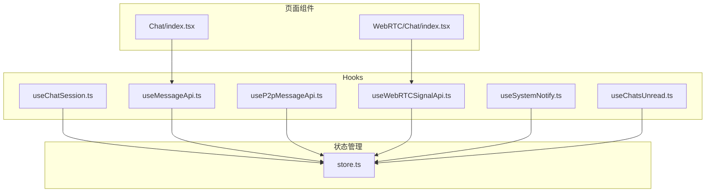
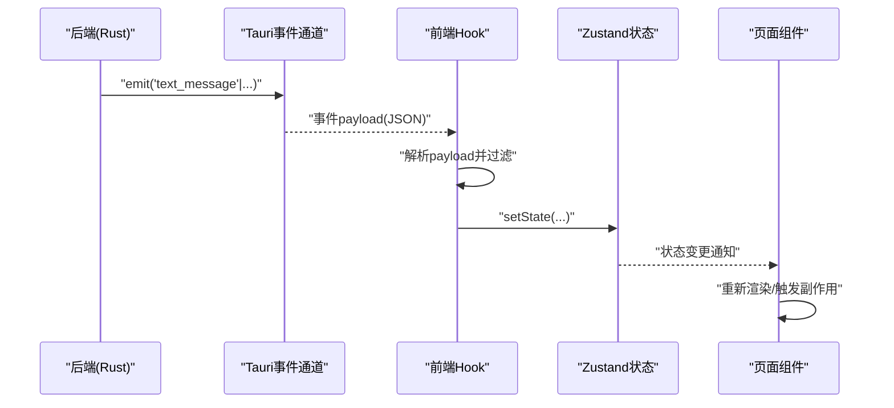
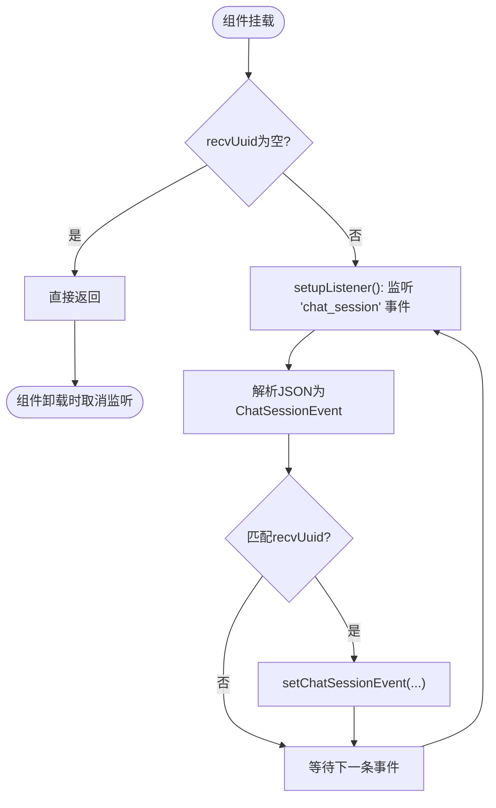
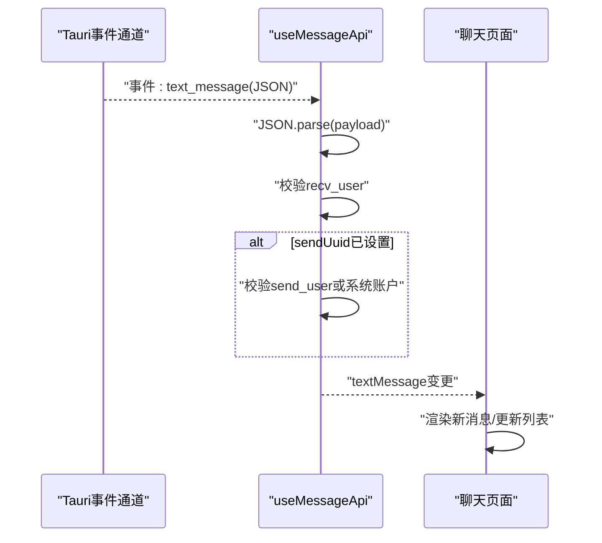
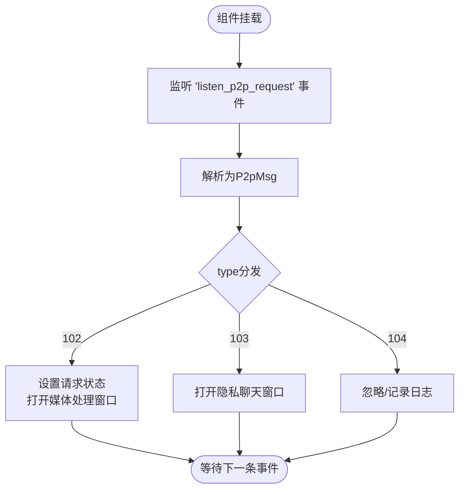
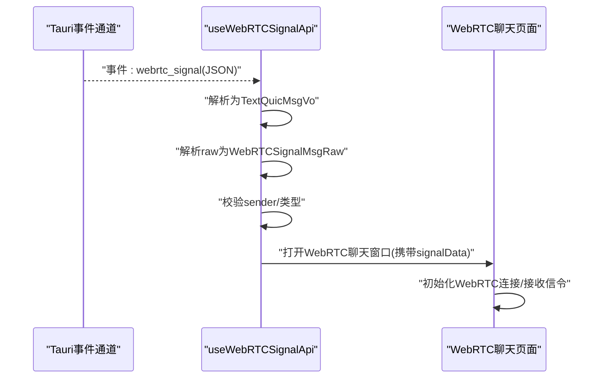
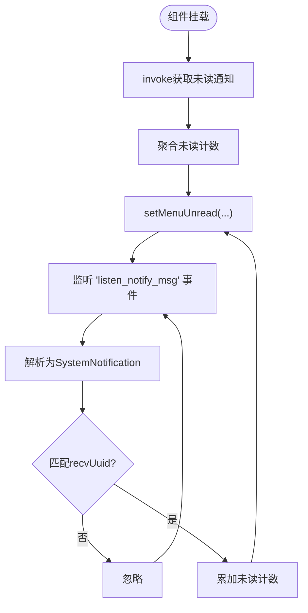
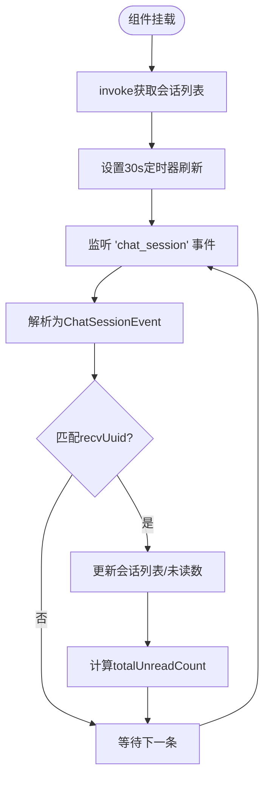
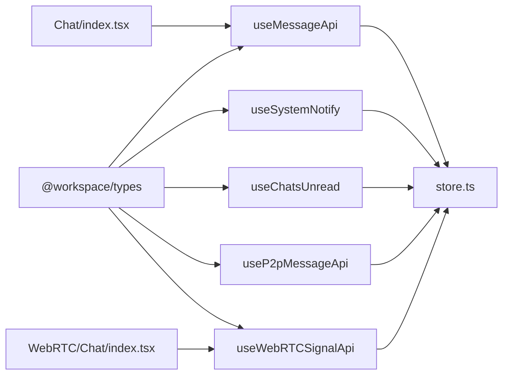

# 前端 Hook 接口

<cite>
**本文档引用的文件**
- [useChatSession.ts](file://apps/pc/src/hooks/useChatSession.ts)
- [useMessageApi.ts](file://apps/pc/src/hooks/useMessageApi.ts)
- [useP2pMessageApi.ts](file://apps/pc/src/hooks/useP2pMessageApi.ts)
- [useWebRTCSignalApi.ts](file://apps/pc/src/hooks/useWebRTCSignalApi.ts)
- [useSystemNotify.ts](file://apps/pc/src/hooks/useSystemNotify.ts)
- [useChatsUnread.ts](file://apps/pc/src/hooks/useChatsUnread.ts)
- [store.ts](file://apps/pc/src/store/store.ts)
- [index.tsx（聊天页面）](file://apps/pc/src/pages/Home/Chats/Chat/index.tsx)
- [index.tsx（WebRTC聊天）](file://apps/pc/src/pages/WebRTC/Chat/index.tsx)
- [index.ts（Hook导出）](file://apps/pc/src/hooks/index.ts)
- [index.d.ts（类型导出）](file://packages/types/dist/index.d.ts)
</cite>

## 目录

1. [简介](#简介)
2. [项目结构](#项目结构)
3. [核心组件](#核心组件)
4. [架构总览](#架构总览)
5. [详细组件分析](#详细组件分析)
6. [依赖关系分析](#依赖关系分析)
7. [性能考量](#性能考量)
8. [故障排查指南](#故障排查指南)
9. [结论](#结论)
10. [附录](#附录)

## 简介

本文件系统性梳理即时通讯应用前端的 React Hooks 接口，覆盖聊天会话、消息 API、P2P 消息、WebRTC 信号、系统通知与未读消息等核心 Hook。文档从架构、数据流、状态管理、错误处理、组合使用与性能优化等维度展开，帮助开发者快速理解与正确使用各 Hook。

## 项目结构

前端 Hook 集中于应用目录下的 hooks 子目录，配合全局状态管理 store 与页面组件共同构成完整的通讯能力闭环。

图表来源

- [useChatSession.ts:1-49](file://apps/pc/src/hooks/useChatSession.ts#L1-L49)
- [useMessageApi.ts:1-45](file://apps/pc/src/hooks/useMessageApi.ts#L1-L45)
- [useP2pMessageApi.ts:1-114](file://apps/pc/src/hooks/useP2pMessageApi.ts#L1-L114)
- [useWebRTCSignalApi.ts:1-100](file://apps/pc/src/hooks/useWebRTCSignalApi.ts#L1-L100)
- [useSystemNotify.ts:1-86](file://apps/pc/src/hooks/useSystemNotify.ts#L1-L86)
- [useChatsUnread.ts:1-107](file://apps/pc/src/hooks/useChatsUnread.ts#L1-L107)
- [store.ts:1-122](file://apps/pc/src/store/store.ts#L1-L122)
- [index.tsx（聊天页面）:1-355](file://apps/pc/src/pages/Home/Chats/Chat/index.tsx#L1-L355)
- [index.tsx（WebRTC 聊天）:1-737](file://apps/pc/src/pages/WebRTC/Chat/index.tsx#L1-L737)

章节来源

- [index.ts（Hook 导出）:1-5](file://apps/pc/src/hooks/index.ts#L1-L5)

## 核心组件

- useChatSession：监听指定用户的会话事件，过滤并更新当前会话状态。
- useMessageApi：监听目标用户的文本消息，支持按发送方过滤与全局监听。
- useP2pMessageApi：监听 P2P 请求消息，处理音视频通话邀请、同意、拒绝等流程，并通过新窗口承载媒体处理。
- useWebRTCSignalApi：监听 WebRTC 信令事件，解析 QUIC 封装的信令，打开 WebRTC 聊天窗口并建立 P2P 连接。
- useSystemNotify：监听系统通知，计算并聚合未读计数，更新菜单徽标。
- useChatsUnread：监听会话事件，维护会话列表与未读总数，定时轮询刷新。

章节来源

- [useChatSession.ts:1-49](file://apps/pc/src/hooks/useChatSession.ts#L1-L49)
- [useMessageApi.ts:1-45](file://apps/pc/src/hooks/useMessageApi.ts#L1-L45)
- [useP2pMessageApi.ts:1-114](file://apps/pc/src/hooks/useP2pMessageApi.ts#L1-L114)
- [useWebRTCSignalApi.ts:1-100](file://apps/pc/src/hooks/useWebRTCSignalApi.ts#L1-L100)
- [useSystemNotify.ts:1-86](file://apps/pc/src/hooks/useSystemNotify.ts#L1-L86)
- [useChatsUnread.ts:1-107](file://apps/pc/src/hooks/useChatsUnread.ts#L1-L107)

## 架构总览

整体采用“事件驱动 + 状态管理”的模式：后端通过 Tauri 事件通道推送消息，前端 Hook 订阅事件并更新 Zustand 状态；页面组件基于 Hook 返回的状态进行渲染与交互。

图表来源

- [useMessageApi.ts:16-31](file://apps/pc/src/hooks/useMessageApi.ts#L16-L31)
- [useSystemNotify.ts:23-42](file://apps/pc/src/hooks/useSystemNotify.ts#L23-L42)
- [store.ts:34-121](file://apps/pc/src/store/store.ts#L34-L121)

## 详细组件分析

### useChatSession（聊天会话 Hook）

- 参数
  - recvUuid: 接收方用户 UUID（字符串），用于过滤属于当前用户的会话事件。
- 返回值
  - chatSessionEvent: 当前匹配的会话事件对象。
- 数据获取策略
  - 通过 Tauri 事件通道监听“chat_session”事件，解析 JSON payload 为会话事件模型。
  - 仅当事件中的发送方或接收方等于 recvUuid 时才更新状态。
- 错误处理
  - JSON 解析失败时打印日志并忽略该条事件。
- 性能与最佳实践
  - 依赖 recvUuid 作为依赖项，确保切换用户时重新订阅。
  - 在 effect 返回中注销监听，避免内存泄漏。
  - 仅在 recvUuid 非空时建立监听，防止无意义订阅。

图表来源

- [useChatSession.ts:9-43](file://apps/pc/src/hooks/useChatSession.ts#L9-L43)

章节来源

- [useChatSession.ts:1-49](file://apps/pc/src/hooks/useChatSession.ts#L1-L49)

### useMessageApi（消息 API Hook）

- 参数
  - sendUuid: 发送方 UUID（可选），用于只监听特定发送方的消息；为 null 时监听全局。
  - recvUuid: 接收方 UUID（必填），用于过滤属于当前用户的文本消息。
- 返回值
  - textMessage: 最新匹配的文本消息对象（通过 memo 稳定引用）。
- 数据获取策略
  - 监听“text_message”事件，解析为 TextQuicMsgVo。
  - 若指定了 sendUuid，则仅接收来自该发送方或系统账户的消息；否则忽略过滤。
- 错误处理
  - JSON 解析失败时打印日志并忽略该条事件。
- 性能与最佳实践
  - 依赖 recvUuid 与 sendUuid，确保切换会话或过滤条件变化时重建监听。
  - 使用 memo 稳定返回值，减少下游组件重渲染。
  - 在 effect 返回中注销监听，避免内存泄漏。

图表来源

- [useMessageApi.ts:16-41](file://apps/pc/src/hooks/useMessageApi.ts#L16-L41)
- [index.tsx（聊天页面）:43-285](file://apps/pc/src/pages/Home/Chats/Chat/index.tsx#L43-L285)

章节来源

- [useMessageApi.ts:1-45](file://apps/pc/src/hooks/useMessageApi.ts#L1-L45)
- [index.tsx（聊天页面）:1-355](file://apps/pc/src/pages/Home/Chats/Chat/index.tsx#L1-L355)

### useP2pMessageApi（P2P 消息 Hook）

- 参数
  - 无显式参数，内部通过全局状态与事件通道协作。
- 返回值
  - state: 布尔状态（当前未直接使用，保留返回以便扩展）。
- 数据获取策略
  - 监听“listen_p2p_request”事件，解析为 P2pMsg。
  - 根据 type 分发处理：
    - 102：P2P 请求（音视频通话邀请），设置全局请求状态并打开媒体处理窗口。
    - 103：P2P 同意，打开隐私聊天窗口。
    - 104：P2P 拒绝，暂不处理。
- 错误处理
  - JSON 解析失败时打印日志并忽略该条事件。
- 性能与最佳实践
  - 仅在组件挂载时建立监听，避免重复订阅。
  - 使用全局 store 设置请求状态，便于其他组件共享 P2P 请求上下文。
  - 打开新窗口时通过 URL 参数传递必要数据，避免跨进程状态耦合。

图表来源

- [useP2pMessageApi.ts:89-108](file://apps/pc/src/hooks/useP2pMessageApi.ts#L89-L108)
- [useP2pMessageApi.ts:65-82](file://apps/pc/src/hooks/useP2pMessageApi.ts#L65-L82)

章节来源

- [useP2pMessageApi.ts:1-114](file://apps/pc/src/hooks/useP2pMessageApi.ts#L1-L114)

### useWebRTCSignalApi（WebRTC 信号 Hook）

- 参数
  - 无显式参数，内部通过全局用户信息与事件通道协作。
- 返回值
  - state: 布尔状态（当前未直接使用，保留返回以便扩展）。
- 数据获取策略
  - 监听“webrtc_signal”事件，解析为 TextQuicMsgVo，再解析其中的 raw 字段为 WebRTCSignalMsgRaw。
  - 当收到 offer 时，打开 WebRTC 聊天窗口并传入初始信令数据。
- 错误处理
  - 事件解析与窗口打开过程中捕获异常并打印日志。
- 性能与最佳实践
  - 依赖 userInfo.uuid 作为依赖项，确保用户信息就绪后再建立监听。
  - 仅处理来自当前用户的信令，避免跨用户干扰。
  - 通过 URL 参数传递信令数据，避免在 JS 层持久化复杂状态。

图表来源

- [useWebRTCSignalApi.ts:62-94](file://apps/pc/src/hooks/useWebRTCSignalApi.ts#L62-L94)
- [index.tsx（WebRTC 聊天）:339-414](file://apps/pc/src/pages/WebRTC/Chat/index.tsx#L339-L414)

章节来源

- [useWebRTCSignalApi.ts:1-100](file://apps/pc/src/hooks/useWebRTCSignalApi.ts#L1-L100)
- [index.tsx（WebRTC 聊天）:1-737](file://apps/pc/src/pages/WebRTC/Chat/index.tsx#L1-L737)

### useSystemNotify（系统通知 Hook）

- 参数
  - recvUuid: 接收方用户 UUID（字符串），用于过滤属于当前用户的系统通知。
- 返回值
  - 无返回值（副作用：更新全局未读计数）。
- 数据获取策略
  - 组件挂载时通过 invoke 调用后端接口获取未读系统通知列表。
  - 监听“listen_notify_msg”事件，解析为 SystemNotification 并按模块聚合未读数。
  - 仅处理来自当前用户的系统通知。
- 错误处理
  - 初始化与事件解析均捕获异常并打印日志。
- 性能与最佳实践
  - 依赖 recvUuid，确保切换用户时重新初始化与订阅。
  - 通过 store.setMenuUnread 统一更新菜单徽标，避免分散更新。

图表来源

- [useSystemNotify.ts:15-50](file://apps/pc/src/hooks/useSystemNotify.ts#L15-L50)
- [useSystemNotify.ts:53-82](file://apps/pc/src/hooks/useSystemNotify.ts#L53-L82)

章节来源

- [useSystemNotify.ts:1-86](file://apps/pc/src/hooks/useSystemNotify.ts#L1-L86)

### useChatsUnread（未读消息 Hook）

- 参数
  - recvUuid: 接收方用户 UUID（字符串），用于过滤属于当前用户的会话。
- 返回值
  - totalUnreadCount: 所有会话未读消息总数。
- 数据获取策略
  - 组件挂载时通过 invoke 获取本地存储的会话列表。
  - 定时器每 30 秒刷新一次会话列表。
  - 监听“chat_session”事件，根据事件类型更新会话未读数：
    - type=0：清零该会话未读。
    - type=1：合并新增未读。
- 错误处理
  - invoke 与事件解析均捕获异常并打印日志。
- 性能与最佳实践
  - 依赖 recvUuid 与 chatSessions，确保用户切换与会话变化时正确计算。
  - 在 effect 返回中清理定时器与事件监听，避免内存泄漏。

图表来源

- [useChatsUnread.ts:25-101](file://apps/pc/src/hooks/useChatsUnread.ts#L25-L101)

章节来源

- [useChatsUnread.ts:1-107](file://apps/pc/src/hooks/useChatsUnread.ts#L1-L107)

## 依赖关系分析

- Hook 与 Zustand 状态
  - 多个 Hook 通过 store 更新全局状态（如菜单未读、请求媒体消息、用户信息等），形成松耦合的状态共享。
- Hook 与页面组件
  - 聊天页面依赖 useMessageApi 获取消息；WebRTC 聊天页面依赖 useWebRTCSignalApi 打开窗口并建立连接。
- 类型与事件
  - 所有 Hook 依赖@workspace/types 中的类型定义（如 ChatSessionEvent、TextQuicMsgVo、P2pMsg 等），并通过 Tauri 事件通道与后端交互。

图表来源

- [store.ts:1-122](file://apps/pc/src/store/store.ts#L1-L122)
- [index.tsx（聊天页面）:1-355](file://apps/pc/src/pages/Home/Chats/Chat/index.tsx#L1-L355)
- [index.tsx（WebRTC 聊天）:1-737](file://apps/pc/src/pages/WebRTC/Chat/index.tsx#L1-L737)
- [index.d.ts（类型导出）:1-9](file://packages/types/dist/index.d.ts#L1-L9)

章节来源

- [store.ts:1-122](file://apps/pc/src/store/store.ts#L1-L122)
- [index.d.ts（类型导出）:1-9](file://packages/types/dist/index.d.ts#L1-L9)

## 性能考量

- 事件监听与清理
  - 所有 Hook 均在 effect 返回中注销监听，避免重复订阅与内存泄漏。
- 依赖项优化
  - 仅将必要依赖项放入依赖数组（如 recvUuid、sendUuid、userInfo.uuid），减少不必要的重订阅。
- 稳定返回值
  - 使用 useMemo 稳定返回值（如 textMessage），降低下游组件重渲染频率。
- 轮询与节流
  - useChatsUnread 采用定时器轮询，建议结合业务场景评估轮询间隔，避免频繁 IO。
- 异步错误隔离
  - 每个异步流程均 try/catch，避免单点异常影响整体流程。

## 故障排查指南

- 事件未触发
  - 检查 recvUuid 是否为空或错误；确认后端事件通道名称与 payload 格式一致。
- JSON 解析失败
  - 检查事件 payload 是否为合法 JSON；确认类型定义与后端一致。
- 状态未更新
  - 确认 store 的 setter 方法调用路径正确；检查依赖项是否导致 effect 未重建。
- 页面未打开
  - 检查窗口打开逻辑与 URL 参数拼接；确认新窗口配置与权限。
- 未读计数异常
  - 检查会话事件类型与更新逻辑；确认定时器与监听是否同时生效。

章节来源

- [useMessageApi.ts:16-41](file://apps/pc/src/hooks/useMessageApi.ts#L16-L41)
- [useSystemNotify.ts:53-82](file://apps/pc/src/hooks/useSystemNotify.ts#L53-L82)
- [useChatsUnread.ts:25-101](file://apps/pc/src/hooks/useChatsUnread.ts#L25-L101)

## 结论

上述 Hook 围绕事件驱动与状态管理构建，具备清晰的职责边界与良好的可组合性。通过合理使用依赖项、稳定返回值与错误隔离，可在保证性能的同时提升开发效率与用户体验。建议在实际集成中遵循最佳实践，并结合业务场景对轮询与事件监听策略进行动态调整。

## 附录

- Hook 组合使用建议
  - 聊天页面：useMessageApi + useChatSession + useChatsUnread，实现消息展示、会话联动与未读统计。
  - P2P/音视频：useP2pMessageApi + store（请求状态）+ 新窗口承载媒体处理。
  - WebRTC：useWebRTCSignalApi + WebRTC 聊天页面，实现信令透传与连接建立。
- 类型参考
  - ChatSessionEvent、TextQuicMsgVo、P2pMsg、WebRTCSignalMsgRaw、SystemNotification 等类型定义位于@workspace/types。
