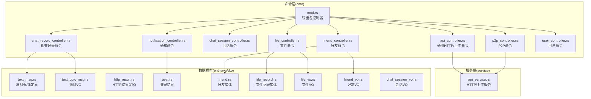
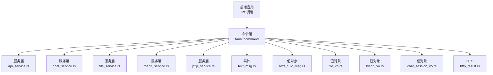
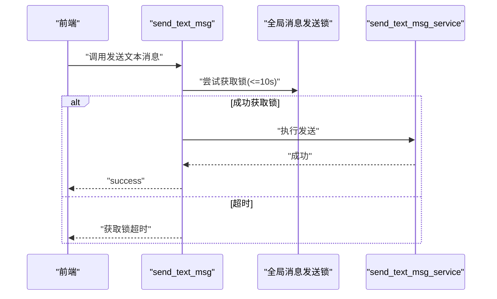
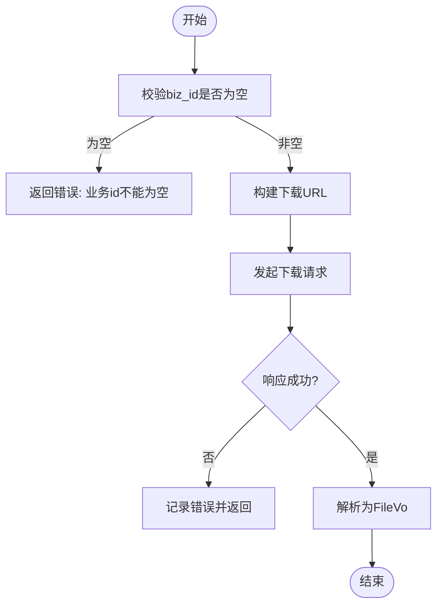
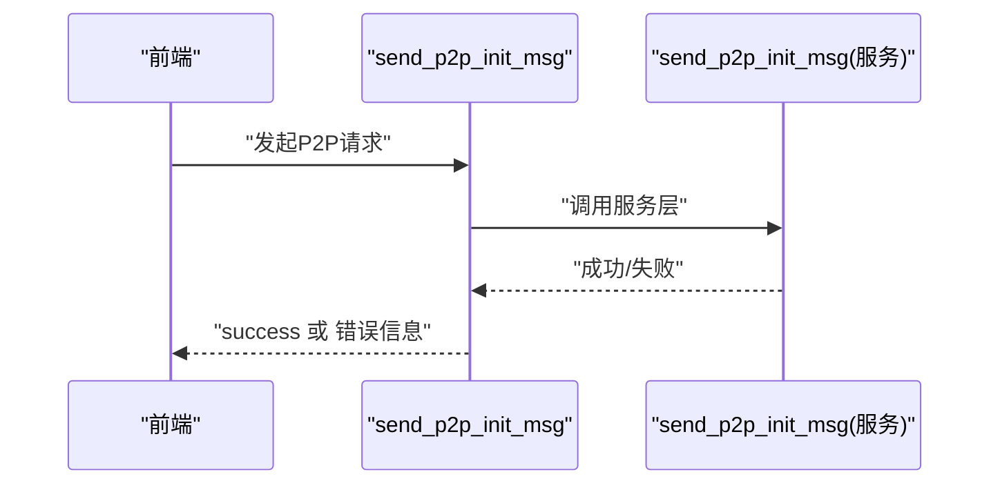
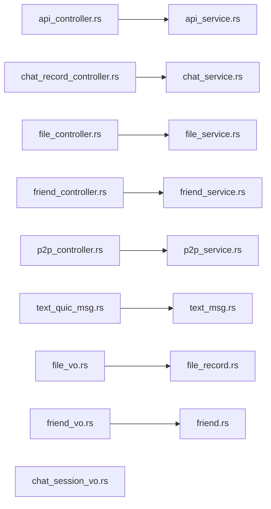

# 后端 API 接口

<cite>
**本文引用的文件**
- [src-tauri/src/cmd/mod.rs](file://src-tauri/src/cmd/mod.rs)
- [src-tauri/src/cmd/api_controller.rs](file://src-tauri/src/cmd/api_controller.rs)
- [src-tauri/src/cmd/chat_record_controller.rs](file://src-tauri/src/cmd/chat_record_controller.rs)
- [src-tauri/src/cmd/chat_session_controller.rs](file://src-tauri/src/cmd/chat_session_controller.rs)
- [src-tauri/src/cmd/file_controller.rs](file://src-tauri/src/cmd/file_controller.rs)
- [src-tauri/src/cmd/friend_controller.rs](file://src-tauri/src/cmd/friend_controller.rs)
- [src-tauri/src/cmd/p2p_controller.rs](file://src-tauri/src/cmd/p2p_controller.rs)
- [src-tauri/src/cmd/notification_controller.rs](file://src-tauri/src/cmd/notification_controller.rs)
- [src-tauri/src/cmd/user_controller.rs](file://src-tauri/src/cmd/user_controller.rs)
- [src-tauri/src/service/api_service.rs](file://src-tauri/src/service/api_service.rs)
- [src-tauri/src/entity/text_msg.rs](file://src-tauri/src/entity/text_msg.rs)
- [src-tauri/src/vo/text_quic_msg.rs](file://src-tauri/src/vo/text_quic_msg.rs)
- [src-tauri/src/dto/http_result.rs](file://src-tauri/src/dto/http_result.rs)
- [src-tauri/src/entity/user.rs](file://src-tauri/src/entity/user.rs)
- [src-tauri/src/entity/friend.rs](file://src-tauri/src/entity/friend.rs)
- [src-tauri/src/entity/file_record.rs](file://src-tauri/src/entity/file_record.rs)
- [src-tauri/src/vo/file_vo.rs](file://src-tauri/src/vo/file_vo.rs)
- [src-tauri/src/vo/friend_vo.rs](file://src-tauri/src/vo/friend_vo.rs)
- [src-tauri/src/vo/chat_session_vo.rs](file://src-tauri/src/vo/chat_session_vo.rs)
</cite>

## 目录

1. [简介](#简介)
2. [项目结构](#项目结构)
3. [核心组件](#核心组件)
4. [架构总览](#架构总览)
5. [详细组件分析](#详细组件分析)
6. [依赖分析](#依赖分析)
7. [性能考量](#性能考量)
8. [故障排查指南](#故障排查指南)
9. [结论](#结论)
10. [附录](#附录)

## 简介

本文件面向后端 API 接口的使用者与维护者，系统性梳理基于 Tauri 命令（tauri::command）封装的“类 REST”接口能力，覆盖以下核心领域：

- 聊天记录 API：消息发送、接收、查询、已读标记
- 用户管理 API：用户信息持久化读写（用于认证上下文）
- 好友关系 API：好友列表查询、好友信息查询、本地好友列表同步、删除好友
- 文件传输 API：本地资源读取、公开/聊天文件下载、上传（表单/多文件/带额外字段）
- P2P 通信 API：连接建立、媒体配置、音视频帧传输、文本消息、视频通话邀请/响应/结束、连接关闭
- 通知 API：系统通知查询与批量已读

说明：

- 该代码库以 Tauri 命令形式暴露接口，前端通过 Tauri IPC 调用；并非传统 HTTP REST 服务，但本文仍按 API 文档规范进行描述，便于理解与对接。

## 项目结构

后端 API 主要由“命令模块 + 实体/值对象 + 服务层 + DTO/VO”构成，命令模块位于 src-tauri/src/cmd，负责对外暴露 tauri::command 接口；服务层在 src-tauri/src/service，封装业务逻辑；实体与值对象在 src-tauri/src/entity 与 src-tauri/src/vo，承载数据结构与序列化。

图表来源

- [src-tauri/src/cmd/mod.rs:1-10](file://src-tauri/src/cmd/mod.rs#L1-L10)
- [src-tauri/src/cmd/api_controller.rs:1-151](file://src-tauri/src/cmd/api_controller.rs#L1-L151)
- [src-tauri/src/cmd/chat_record_controller.rs:1-80](file://src-tauri/src/cmd/chat_record_controller.rs#L1-L80)
- [src-tauri/src/cmd/chat_session_controller.rs:1-24](file://src-tauri/src/cmd/chat_session_controller.rs#L1-L24)
- [src-tauri/src/cmd/file_controller.rs:1-258](file://src-tauri/src/cmd/file_controller.rs#L1-L258)
- [src-tauri/src/cmd/friend_controller.rs:1-41](file://src-tauri/src/cmd/friend_controller.rs#L1-L41)
- [src-tauri/src/cmd/p2p_controller.rs:1-170](file://src-tauri/src/cmd/p2p_controller.rs#L1-L170)
- [src-tauri/src/cmd/notification_controller.rs:1-22](file://src-tauri/src/cmd/notification_controller.rs#L1-L22)
- [src-tauri/src/cmd/user_controller.rs:1-17](file://src-tauri/src/cmd/user_controller.rs#L1-L17)
- [src-tauri/src/service/api_service.rs:1-187](file://src-tauri/src/service/api_service.rs#L1-L187)
- [src-tauri/src/entity/text_msg.rs:1-38](file://src-tauri/src/entity/text_msg.rs#L1-L38)
- [src-tauri/src/vo/text_quic_msg.rs:1-47](file://src-tauri/src/vo/text_quic_msg.rs#L1-L47)
- [src-tauri/src/dto/http_result.rs:1-10](file://src-tauri/src/dto/http_result.rs#L1-L10)
- [src-tauri/src/entity/user.rs:1-9](file://src-tauri/src/entity/user.rs#L1-L9)
- [src-tauri/src/entity/friend.rs:1-63](file://src-tauri/src/entity/friend.rs#L1-L63)
- [src-tauri/src/entity/file_record.rs:1-83](file://src-tauri/src/entity/file_record.rs#L1-L83)
- [src-tauri/src/vo/file_vo.rs:1-22](file://src-tauri/src/vo/file_vo.rs#L1-L22)
- [src-tauri/src/vo/friend_vo.rs:1-50](file://src-tauri/src/vo/friend_vo.rs#L1-L50)
- [src-tauri/src/vo/chat_session_vo.rs:1-46](file://src-tauri/src/vo/chat_session_vo.rs#L1-L46)

章节来源

- [src-tauri/src/cmd/mod.rs:1-10](file://src-tauri/src/cmd/mod.rs#L1-L10)

## 核心组件

- 命令模块：集中导出各功能域的 tauri::command，作为前端 IPC 调用入口
- 服务层：封装 HTTP 请求、文件上传、P2P 消息发送等业务逻辑
- 数据模型：消息头/体、文件记录、好友信息、会话信息等
- 值对象：消息 VO、文件 VO、好友 VO、会话 VO，用于跨层传递与序列化

章节来源

- [src-tauri/src/cmd/api_controller.rs:1-151](file://src-tauri/src/cmd/api_controller.rs#L1-L151)
- [src-tauri/src/cmd/chat_record_controller.rs:1-80](file://src-tauri/src/cmd/chat_record_controller.rs#L1-L80)
- [src-tauri/src/cmd/chat_session_controller.rs:1-24](file://src-tauri/src/cmd/chat_session_controller.rs#L1-L24)
- [src-tauri/src/cmd/file_controller.rs:1-258](file://src-tauri/src/cmd/file_controller.rs#L1-L258)
- [src-tauri/src/cmd/friend_controller.rs:1-41](file://src-tauri/src/cmd/friend_controller.rs#L1-L41)
- [src-tauri/src/cmd/p2p_controller.rs:1-170](file://src-tauri/src/cmd/p2p_controller.rs#L1-L170)
- [src-tauri/src/cmd/notification_controller.rs:1-22](file://src-tauri/src/cmd/notification_controller.rs#L1-L22)
- [src-tauri/src/cmd/user_controller.rs:1-17](file://src-tauri/src/cmd/user_controller.rs#L1-L17)
- [src-tauri/src/service/api_service.rs:1-187](file://src-tauri/src/service/api_service.rs#L1-L187)
- [src-tauri/src/entity/text_msg.rs:1-38](file://src-tauri/src/entity/text_msg.rs#L1-L38)
- [src-tauri/src/vo/text_quic_msg.rs:1-47](file://src-tauri/src/vo/text_quic_msg.rs#L1-L47)
- [src-tauri/src/dto/http_result.rs:1-10](file://src-tauri/src/dto/http_result.rs#L1-L10)
- [src-tauri/src/entity/user.rs:1-9](file://src-tauri/src/entity/user.rs#L1-L9)
- [src-tauri/src/entity/friend.rs:1-63](file://src-tauri/src/entity/friend.rs#L1-L63)
- [src-tauri/src/entity/file_record.rs:1-83](file://src-tauri/src/entity/file_record.rs#L1-L83)
- [src-tauri/src/vo/file_vo.rs:1-22](file://src-tauri/src/vo/file_vo.rs#L1-L22)
- [src-tauri/src/vo/friend_vo.rs:1-50](file://src-tauri/src/vo/friend_vo.rs#L1-L50)
- [src-tauri/src/vo/chat_session_vo.rs:1-46](file://src-tauri/src/vo/chat_session_vo.rs#L1-L46)

## 架构总览

下图展示命令层如何组织与调用服务层及数据模型：

图表来源

- [src-tauri/src/cmd/api_controller.rs:1-151](file://src-tauri/src/cmd/api_controller.rs#L1-L151)
- [src-tauri/src/cmd/chat_record_controller.rs:1-80](file://src-tauri/src/cmd/chat_record_controller.rs#L1-L80)
- [src-tauri/src/cmd/file_controller.rs:1-258](file://src-tauri/src/cmd/file_controller.rs#L1-L258)
- [src-tauri/src/cmd/friend_controller.rs:1-41](file://src-tauri/src/cmd/friend_controller.rs#L1-L41)
- [src-tauri/src/cmd/p2p_controller.rs:1-170](file://src-tauri/src/cmd/p2p_controller.rs#L1-L170)
- [src-tauri/src/service/api_service.rs:1-187](file://src-tauri/src/service/api_service.rs#L1-L187)
- [src-tauri/src/entity/text_msg.rs:1-38](file://src-tauri/src/entity/text_msg.rs#L1-L38)
- [src-tauri/src/vo/text_quic_msg.rs:1-47](file://src-tauri/src/vo/text_quic_msg.rs#L1-L47)
- [src-tauri/src/vo/file_vo.rs:1-22](file://src-tauri/src/vo/file_vo.rs#L1-L22)
- [src-tauri/src/vo/friend_vo.rs:1-50](file://src-tauri/src/vo/friend_vo.rs#L1-L50)
- [src-tauri/src/vo/chat_session_vo.rs:1-46](file://src-tauri/src/vo/chat_session_vo.rs#L1-L46)
- [src-tauri/src/dto/http_result.rs:1-10](file://src-tauri/src/dto/http_result.rs#L1-L10)

## 详细组件分析

### 聊天记录 API

- 功能概述
  - 文本消息发送：通过 P2P 通道发送文本消息，内部使用全局锁确保并发安全
  - 图片消息发送：通过 P2P 通道发送图片数据
  - 已读标记：对指定消息 ID 集合执行“最后已读”更新
  - 本地聊天记录查询：支持分页与按消息类型过滤
- 关键命令与参数
  - send_text_msg
    - 参数：TextQuicMsgVo（包含 nano_id、text_type、raw、recv_user、send_user、timestamp）
    - 返回：字符串“success”或错误信息
    - 并发：10 秒内获取全局锁，否则报错
  - send_image_msg
    - 参数：TextQuicMsgVo（raw 为图片二进制）
    - 返回：空或错误信息
  - mark_read
    - 参数：消息 ID 数组（字符串）
    - 返回：空或错误信息
  - get_chat_record_from_store
    - 参数：TextQuicMsgVo、Page
    - 返回：消息列表（TextQuicMsgVo 数组）
  - get_chat_record_by_type
    - 参数：TextQuicMsgVo、text_type、Page
    - 返回：消息列表（TextQuicMsgVo 数组）
- 错误处理
  - 超时：获取锁超时返回“获取锁超时”
  - 数据库/服务异常：捕获并转换为字符串错误
- 性能建议
  - 文本消息发送建议批量合并，减少锁竞争
  - 分页查询建议限制每页数量，避免一次性加载过多

图表来源

- [src-tauri/src/cmd/chat_record_controller.rs:17-37](file://src-tauri/src/cmd/chat_record_controller.rs#L17-L37)

章节来源

- [src-tauri/src/cmd/chat_record_controller.rs:1-80](file://src-tauri/src/cmd/chat_record_controller.rs#L1-L80)
- [src-tauri/src/entity/text_msg.rs:1-38](file://src-tauri/src/entity/text_msg.rs#L1-L38)
- [src-tauri/src/vo/text_quic_msg.rs:1-47](file://src-tauri/src/vo/text_quic_msg.rs#L1-L47)

### 会话管理 API

- 功能概述
  - 会话已读：将目标好友的最后已读位置更新为最新
  - 创建会话：为指定好友创建聊天会话
  - 获取会话列表：返回本地会话视图（ChatSessionVo）
- 关键命令与参数
  - mark_read_chat_session
    - 参数：friend_uuid
    - 返回：空或错误信息
  - create_chat_session
    - 参数：friend_uuid
    - 返回：空或错误信息
  - get_chat_session_from_store
    - 返回：会话列表（ChatSessionVo 数组）

章节来源

- [src-tauri/src/cmd/chat_session_controller.rs:1-24](file://src-tauri/src/cmd/chat_session_controller.rs#L1-L24)
- [src-tauri/src/vo/chat_session_vo.rs:1-46](file://src-tauri/src/vo/chat_session_vo.rs#L1-L46)

### 用户管理 API

- 功能概述
  - 用户信息持久化：将键值对写入全局用户信息映射
  - 用户信息读取：根据键读取对应值
- 关键命令与参数
  - add_user_map
    - 参数：HashMap<String, String>
    - 返回：字符串“success”或错误信息
  - get_user_map
    - 参数：key（字符串）
    - 返回：value（字符串）或“not found”错误

章节来源

- [src-tauri/src/cmd/user_controller.rs:1-17](file://src-tauri/src/cmd/user_controller.rs#L1-L17)

### 好友关系 API

- 功能概述
  - 获取好友列表：查询当前用户的全部好友
  - 获取好友信息：按好友 UUID 查询详情
  - 更新本地好友列表：拉取远端列表并更新本地
  - 删除好友：软删除（标记删除）
- 关键命令与参数
  - get_friend_list
    - 返回：FriendVo 数组
  - get_friend_info
    - 参数：friend_uuid
    - 返回：FriendVo
  - update_local_friend_list
    - 返回：空或错误信息
  - delete_friend_command
    - 参数：friend_uuid
    - 返回：空或错误信息

章节来源

- [src-tauri/src/cmd/friend_controller.rs:1-41](file://src-tauri/src/cmd/friend_controller.rs#L1-L41)
- [src-tauri/src/entity/friend.rs:1-63](file://src-tauri/src/entity/friend.rs#L1-L63)
- [src-tauri/src/vo/friend_vo.rs:1-50](file://src-tauri/src/vo/friend_vo.rs#L1-L50)

### 文件传输 API

- 功能概述
  - 本地资源文件读取：优先应用目录，其次打包资源，最后回退占位图
  - 公开文件下载：通过业务 ID 获取公开文件链接并下载
  - 聊天文件下载：通过业务 ID 获取聊天文件链接并下载
  - 上传文件：支持单文件、多文件、带额外字段的表单上传
- 关键命令与参数
  - get_local_file
    - 返回：FileVo（包含原始字节、MIME、扩展名等）
  - get_file_by_biz_id
    - 参数：biz_id（字符串）
    - 返回：FileVo 数组
  - get_chat_file_by_biz_id
    - 参数：biz_id（字符串）
    - 返回：FileVo 数组
  - upload_file_request
    - 参数：url、file_path、field_name
    - 返回：HTTP 响应包装（状态码+Body）
  - upload_file_with_extra_fields_request
    - 参数：url、file_path、field_name、extra_fields（HashMap）
    - 返回：HTTP 响应包装
  - upload_multiple_files_request
    - 参数：url、file_paths（Vec）、field_name
    - 返回：HTTP 响应包装
  - upload_multiple_files_with_extra_fields_request
    - 参数：url、file_paths（Vec）、field_name、extra_fields（HashMap）
    - 返回：HTTP 响应包装
  - post_form_data_request
    - 参数：url、fields（HashMap）
    - 返回：HTTP 响应包装
- 错误处理
  - 文件不存在：返回明确错误
  - 路径解析失败：回退占位图并记录日志
  - 下载失败：记录错误并返回错误信息
- 安全与性能
  - 上传超时：单文件 120 秒，多文件 300 秒，避免长时间占用
  - 上传字段校验：空列表直接报错
  - 本地资源优先级：应用目录 > 打包资源 > 占位图

图表来源

- [src-tauri/src/cmd/file_controller.rs:155-191](file://src-tauri/src/cmd/file_controller.rs#L155-L191)

章节来源

- [src-tauri/src/cmd/file_controller.rs:1-258](file://src-tauri/src/cmd/file_controller.rs#L1-L258)
- [src-tauri/src/service/api_service.rs:1-187](file://src-tauri/src/service/api_service.rs#L1-L187)
- [src-tauri/src/entity/file_record.rs:1-83](file://src-tauri/src/entity/file_record.rs#L1-L83)
- [src-tauri/src/vo/file_vo.rs:1-22](file://src-tauri/src/vo/file_vo.rs#L1-L22)

### P2P 通信 API

- 功能概述
  - 连接建立：发送 P2P 初始化消息，触发 UDP 打洞与握手
  - 媒体配置：发送视频/音频配置参数
  - 媒体控制：开启/关闭摄像头、麦克风等
  - 音视频帧传输：发送视频帧与音频帧
  - 文本消息：隐私聊天中的文本传输
  - 视频通话：邀请、响应（接受/拒绝）、结束
  - 连接关闭：清理 P2P 连接资源
- 关键命令与参数
  - send_p2p_init_msg
    - 参数：accept_user（目标用户 UUID）
    - 返回：字符串“success”或错误信息
  - send_init_p2p_udp
    - 返回：本地可用 UDP 地址（127.0.0.1:port）
  - process_init_p2p_request
    - 参数：p2p_init_msg（JSON 字符串）
    - 返回：字符串“success”或错误信息
  - send_p2p_video_frame
    - 参数：frame_data（字节数组）、target_uuid
    - 返回：空或错误信息
  - send_p2p_audio_frame
    - 参数：audio_data（字节数组）、target_uuid
    - 返回：空或错误信息
  - send_p2p_video_config
    - 参数：video_config（JSON 字符串）、uuid
    - 返回：空或错误信息
  - send_p2p_media_config
    - 参数：media_config（JSON 字符串）、uuid
    - 返回：空或错误信息
  - send_p2p_media_control
    - 参数：control_type（字符串）、enabled（布尔）、target_uuid
    - 返回：空或错误信息
  - send_p2p_text_msg
    - 参数：text（字符串）、target_uuid
    - 返回：空或错误信息
  - send_p2p_video_call_invite
    - 参数：target_uuid、from_name（可选）
    - 返回：空或错误信息
  - send_p2p_video_call_response
    - 参数：target_uuid、accept（布尔）、media_config（可选）、reject_reason（可选）
    - 返回：空或错误信息
  - send_p2p_video_call_end
    - 参数：target_uuid
    - 返回：空或错误信息
  - close_p2p_connection
    - 参数：target_uuid
    - 返回：空或错误信息
- 错误处理
  - UDP 端口：无可用端口时返回错误
  - JSON 解析：失败返回错误
  - 服务调用：捕获并转换为字符串错误

图表来源

- [src-tauri/src/cmd/p2p_controller.rs:14-21](file://src-tauri/src/cmd/p2p_controller.rs#L14-L21)

章节来源

- [src-tauri/src/cmd/p2p_controller.rs:1-170](file://src-tauri/src/cmd/p2p_controller.rs#L1-L170)

### 通知 API

- 功能概述
  - 获取系统通知：按是否已读筛选
  - 批量已读：对多个通知 ID 执行已读更新
- 关键命令与参数
  - get_system_notification
    - 参数：is_read（可选）
    - 返回：SystemNotification 数组
  - batch_read_system_notification
    - 参数：read_ids（字符串数组）
    - 返回：已更新数量（i32）或错误信息

章节来源

- [src-tauri/src/cmd/notification_controller.rs:1-22](file://src-tauri/src/cmd/notification_controller.rs#L1-L22)

### 通用 HTTP 与上传 API

- 功能概述
  - GET/POST 请求转发：自动注入 Authorization 头（来自全局用户信息）
  - 表单上传：单文件、多文件、带额外字段
- 关键命令与参数
  - get_request
    - 参数：url（字符串）
    - 返回：包含 status 与 body 的响应对象
  - post_request
    - 参数：url、body（JSON 字符串）
    - 返回：包含 status 与 body 的响应对象
  - post_form_data_request
    - 参数：url、fields（HashMap）
    - 返回：包含 status 与 body 的响应对象
  - upload_file_request
    - 参数：url、file_path、field_name
    - 返回：包含 status 与 body 的响应对象
  - upload_file_with_extra_fields_request
    - 参数：url、file_path、field_name、extra_fields（HashMap）
    - 返回：包含 status 与 body 的响应对象
  - upload_multiple_files_request
    - 参数：url、file_paths（Vec）、field_name
    - 返回：包含 status 与 body 的响应对象
  - upload_multiple_files_with_extra_fields_request
    - 参数：url、file_paths（Vec）、field_name、extra_fields（HashMap）
    - 返回：包含 status 与 body 的响应对象
- 认证机制
  - Authorization 头：从全局用户信息中读取 token 并注入
- 错误处理
  - 请求失败：捕获并转换为字符串错误
  - 文件/路径不存在：返回明确错误
- 性能建议
  - 单文件上传超时 120 秒，多文件上传超时 300 秒
  - 字段数量较多时建议分批上传

章节来源

- [src-tauri/src/cmd/api_controller.rs:1-151](file://src-tauri/src/cmd/api_controller.rs#L1-L151)
- [src-tauri/src/service/api_service.rs:1-187](file://src-tauri/src/service/api_service.rs#L1-L187)
- [src-tauri/src/dto/http_result.rs:1-10](file://src-tauri/src/dto/http_result.rs#L1-L10)

## 依赖分析

- 命令层依赖
  - chat_record_controller 依赖服务层聊天服务与全局锁
  - file_controller 依赖服务层文件服务与配置常量
  - friend_controller 依赖服务层好友服务与 DAO
  - p2p_controller 依赖服务层 P2P 服务与 UDP 工具
  - api_controller 依赖服务层 HTTP/上传服务
- 数据模型依赖
  - 文本消息 VO 依赖实体消息结构
  - 文件/好友/会话 VO 依赖各自实体
- 服务层依赖
  - api_service 封装 reqwest 客户端与认证头注入

图表来源

- [src-tauri/src/cmd/api_controller.rs:1-151](file://src-tauri/src/cmd/api_controller.rs#L1-L151)
- [src-tauri/src/cmd/chat_record_controller.rs:1-80](file://src-tauri/src/cmd/chat_record_controller.rs#L1-L80)
- [src-tauri/src/cmd/file_controller.rs:1-258](file://src-tauri/src/cmd/file_controller.rs#L1-L258)
- [src-tauri/src/cmd/friend_controller.rs:1-41](file://src-tauri/src/cmd/friend_controller.rs#L1-L41)
- [src-tauri/src/cmd/p2p_controller.rs:1-170](file://src-tauri/src/cmd/p2p_controller.rs#L1-L170)
- [src-tauri/src/service/api_service.rs:1-187](file://src-tauri/src/service/api_service.rs#L1-L187)
- [src-tauri/src/entity/text_msg.rs:1-38](file://src-tauri/src/entity/text_msg.rs#L1-L38)
- [src-tauri/src/vo/text_quic_msg.rs:1-47](file://src-tauri/src/vo/text_quic_msg.rs#L1-L47)
- [src-tauri/src/entity/file_record.rs:1-83](file://src-tauri/src/entity/file_record.rs#L1-L83)
- [src-tauri/src/vo/file_vo.rs:1-22](file://src-tauri/src/vo/file_vo.rs#L1-L22)
- [src-tauri/src/entity/friend.rs:1-63](file://src-tauri/src/entity/friend.rs#L1-L63)
- [src-tauri/src/vo/friend_vo.rs:1-50](file://src-tauri/src/vo/friend_vo.rs#L1-L50)
- [src-tauri/src/vo/chat_session_vo.rs:1-46](file://src-tauri/src/vo/chat_session_vo.rs#L1-L46)

## 性能考量

- 并发控制
  - 聊天消息发送使用全局锁，建议前端合并短消息，降低锁竞争
- 上传优化
  - 多文件上传采用分块字段命名，避免覆盖；合理设置超时
- I/O 与资源
  - 本地资源读取优先应用目录，减少 IO；打包资源读取失败回退占位图
- 网络请求
  - 通用 HTTP 请求统一注入 Authorization 头，避免重复鉴权

## 故障排查指南

- 获取锁超时
  - 现象：发送消息时报“获取锁超时”
  - 处理：检查是否有长时间持有锁的任务，适当拆分或缩短事务
- 文件上传失败
  - 现象：返回“文件不存在”或网络超时
  - 处理：确认文件路径有效、网络稳定；必要时启用重试
- 下载失败
  - 现象：业务 ID 为空或下载响应失败
  - 处理：校验 biz_id；查看日志定位具体错误
- P2P 连接问题
  - 现象：UDP 端口不可用或 JSON 解析失败
  - 处理：更换端口范围；确保传入 JSON 格式正确
- 通用 HTTP 请求失败
  - 现象：GET/POST 返回错误
  - 处理：检查 Authorization 头注入与目标 URL 可达性

章节来源

- [src-tauri/src/cmd/chat_record_controller.rs:26-36](file://src-tauri/src/cmd/chat_record_controller.rs#L26-L36)
- [src-tauri/src/cmd/file_controller.rs:159-171](file://src-tauri/src/cmd/file_controller.rs#L159-L171)
- [src-tauri/src/cmd/p2p_controller.rs:27](file://src-tauri/src/cmd/p2p_controller.rs#L27)
- [src-tauri/src/cmd/api_controller.rs:25-58](file://src-tauri/src/cmd/api_controller.rs#L25-L58)

## 结论

本后端 API 以 Tauri 命令为核心，围绕聊天、文件、好友、P2P 与通知五大领域提供统一的 IPC 接口。通过服务层抽象与数据模型标准化，实现了清晰的职责分离与良好的可维护性。建议在生产环境中结合前端侧的重试与降级策略，进一步提升稳定性与用户体验。

## 附录

- 认证机制说明
  - 通过 add_user_map 写入全局用户信息（如 token），后续 HTTP 请求自动注入 Authorization 头
- 安全考虑
  - 仅在本地内存中保存敏感令牌，避免明文落盘
  - 上传与下载均进行路径与文件存在性校验
- 请求响应示例（示意）
  - GET /file/download_link/pub_biz/{biz_id}
    - 请求：Authorization: Bearer <token>
    - 响应：200 OK + 文件二进制
  - POST /upload
    - 请求：multipart/form-data（含 file 字段与可选额外字段）
    - 响应：200 OK + JSON（包含状态码、数据、消息）
- 数据验证规则
  - 必填字段：biz_id、file_path、field_name 等
  - 类型约束：UUID、时间戳、布尔值等
- 性能优化建议
  - 合理分页与批量处理
  - 上传前压缩图片（已有压缩命令）
  - 上传超时与断点续传策略（按需扩展）
