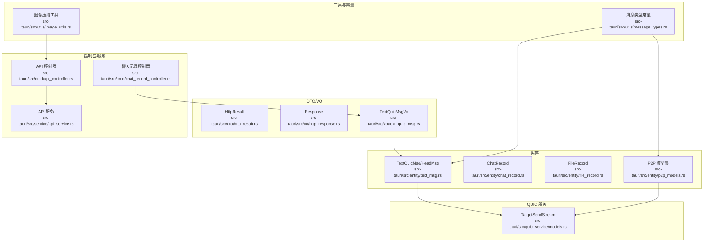
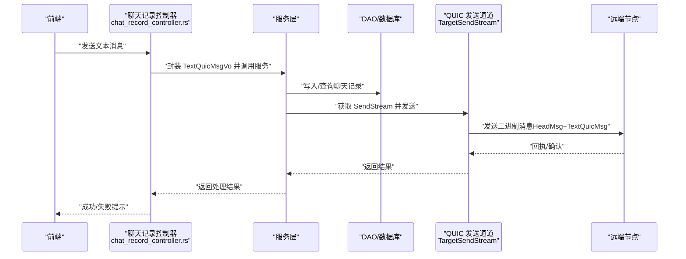
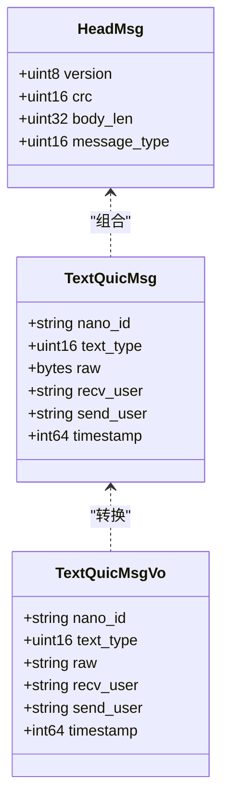
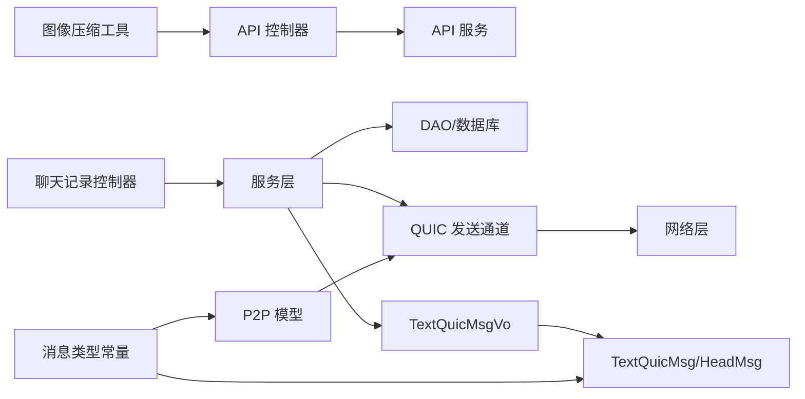

# 数据传输格式

<cite>
**本文引用的文件**
- [http_result.rs](file://src-tauri/src/dto/http_result.rs)
- [http_response.rs](file://src-tauri/src/vo/http_response.rs)
- [text_msg.rs](file://src-tauri/src/entity/text_msg.rs)
- [text_quic_msg.rs](file://src-tauri/src/vo/text_quic_msg.rs)
- [chat_record.rs](file://src-tauri/src/entity/chat_record.rs)
- [file_record.rs](file://src-tauri/src/entity/file_record.rs)
- [p2p_models.rs](file://src-tauri/src/entity/p2p_models.rs)
- [models.rs](file://src-tauri/src/quic_service/models.rs)
- [message_types.rs](file://src-tauri/src/utils/message_types.rs)
- [api_controller.rs](file://src-tauri/src/cmd/api_controller.rs)
- [chat_record_controller.rs](file://src-tauri/src/cmd/chat_record_controller.rs)
- [api_service.rs](file://src-tauri/src/service/api_service.rs)
- [image_utils.rs](file://src-tauri/src/utils/image_utils.rs)
</cite>

## 目录

1. [简介](#简介)
2. [项目结构](#项目结构)
3. [核心组件](#核心组件)
4. [架构总览](#架构总览)
5. [详细组件分析](#详细组件分析)
6. [依赖关系分析](#依赖关系分析)
7. [性能与可靠性](#性能与可靠性)
8. [故障排查指南](#故障排查指南)
9. [结论](#结论)
10. [附录](#附录)

## 简介

本文件系统化梳理即时通讯应用中的数据传输格式与消息协议规范，覆盖以下方面：

- HTTP 响应统一格式（HttpResult、Response）
- 文本消息与二进制消息格式（HeadMsg、TextQuicMsg、TextQuicMsgVo）
- 聊天记录与文件记录的数据模型
- P2P 视频通话相关配置与数据包格式
- 消息类型常量与版本/兼容性策略
- JSON 序列化与二进制编解码要点
- 数据压缩与图像处理流程
- 安全传输与鉴权头规范

## 项目结构

围绕数据传输格式的关键模块分布如下：

- DTO/VO 层：统一 HTTP 响应结构与消息载体
- 实体层：聊天记录、文件记录、P2P 模型等持久化结构
- QUIC 服务层：面向 P2P 流的发送通道封装
- 工具与常量：消息类型定义、图像压缩工具
- 控制器与服务：对外暴露命令接口与上传/下载流程

图表来源

- [http_result.rs:1-10](file://src-tauri/src/dto/http_result.rs#L1-L10)
- [http_response.rs:1-10](file://src-tauri/src/vo/http_response.rs#L1-L10)
- [text_quic_msg.rs:1-47](file://src-tauri/src/vo/text_quic_msg.rs#L1-L47)
- [text_msg.rs:1-38](file://src-tauri/src/entity/text_msg.rs#L1-L38)
- [chat_record.rs:1-61](file://src-tauri/src/entity/chat_record.rs#L1-L61)
- [file_record.rs:1-83](file://src-tauri/src/entity/file_record.rs#L1-L83)
- [p2p_models.rs:1-283](file://src-tauri/src/entity/p2p_models.rs#L1-L283)
- [models.rs:1-11](file://src-tauri/src/quic_service/models.rs#L1-L11)
- [message_types.rs:1-108](file://src-tauri/src/utils/message_types.rs#L1-L108)
- [api_controller.rs:1-151](file://src-tauri/src/cmd/api_controller.rs#L1-L151)
- [chat_record_controller.rs:1-80](file://src-tauri/src/cmd/chat_record_controller.rs#L1-L80)
- [api_service.rs:1-187](file://src-tauri/src/service/api_service.rs#L1-L187)
- [image_utils.rs:1-212](file://src-tauri/src/utils/image_utils.rs#L1-L212)

章节来源

- [http_result.rs:1-10](file://src-tauri/src/dto/http_result.rs#L1-L10)
- [http_response.rs:1-10](file://src-tauri/src/vo/http_response.rs#L1-L10)
- [text_msg.rs:1-38](file://src-tauri/src/entity/text_msg.rs#L1-L38)
- [text_quic_msg.rs:1-47](file://src-tauri/src/vo/text_quic_msg.rs#L1-L47)
- [chat_record.rs:1-61](file://src-tauri/src/entity/chat_record.rs#L1-L61)
- [file_record.rs:1-83](file://src-tauri/src/entity/file_record.rs#L1-L83)
- [p2p_models.rs:1-283](file://src-tauri/src/entity/p2p_models.rs#L1-L283)
- [models.rs:1-11](file://src-tauri/src/quic_service/models.rs#L1-L11)
- [message_types.rs:1-108](file://src-tauri/src/utils/message_types.rs#L1-L108)
- [api_controller.rs:1-151](file://src-tauri/src/cmd/api_controller.rs#L1-L151)
- [chat_record_controller.rs:1-80](file://src-tauri/src/cmd/chat_record_controller.rs#L1-L80)
- [api_service.rs:1-187](file://src-tauri/src/service/api_service.rs#L1-L187)
- [image_utils.rs:1-212](file://src-tauri/src/utils/image_utils.rs#L1-L212)

## 核心组件

本节对关键数据结构进行字段级说明，包括数据类型、取值范围、必填性与业务含义，并给出序列化与校验建议。

- HTTP 响应统一格式

  - HttpResult
    - 字段
      - code: 整型，HTTP 状态码或业务码
      - data: 动态 JSON 值，承载任意结构
      - message: 字符串，描述性信息
    - 必填性：三者均为必填
    - 业务含义：通用响应载体，便于前端统一处理
    - 序列化：JSON；data 可为对象/数组/字符串/null
  - Response
    - 字段
      - code: 整型，状态码
      - message: 字符串，描述
      - data: 可选动态 JSON 值
    - 必填性：code、message 必填；data 可空
    - 业务含义：面向 VO 的响应包装
    - 序列化：JSON；data 为空时省略或为 null

- 文本消息与二进制消息

  - HeadMsg（二进制头部）
    - 字段
      - version: 无符号 8 位整型，协议版本
      - crc: 无符号 16 位整型，校验和
      - body_len: 无符号 32 位整型，消息体长度
      - message_type: 无符号 16 位整型，消息类型编号
    - 必填性：全部必填
    - 业务含义：QUIC 文本消息的二进制头部，用于快速解析与校验
    - 序列化：二进制（bincode）；字段顺序严格按定义
  - TextQuicMsg（文本消息体）
    - 字段
      - nano_id: 字符串，消息唯一 ID
      - text_type: 无符号 16 位整型，消息类型
      - raw: 字节数组，原始二进制数据
      - recv_user: 字符串，接收方用户 ID
      - send_user: 字符串，发送方用户 ID
      - timestamp: 有符号 64 位整型，Unix 纳秒/毫秒时间戳
    - 必填性：全部必填
    - 业务含义：跨网络传输的文本消息载体
    - 序列化：二进制（bincode）；raw 通常为 UTF-8 文本或 JSON
  - TextQuicMsgVo（数据库/展示用）
    - 字段
      - nano_id: 字符串
      - text_type: 无符号 16 位整型
      - raw: 字符串，从 raw 解码得到
      - recv_user: 字符串
      - send_user: 字符串
      - timestamp: 有符号 64 位整型
    - 必填性：全部必填
    - 业务含义：面向前端展示与数据库存储的视图对象
    - 序列化：JSON；raw 为字符串

- 聊天记录

  - ChatRecord
    - 字段
      - id: 自增主键
      - nano_id: 唯一标识
      - text_type: 无符号 16 位整型，消息类型
      - raw: 字符串，原始数据（JSON 或文本）
      - recv_user: 字符串，接收方
      - send_user: 字符串，发送方
      - timestamp: 有符号 64 位整型
    - 必填性：除 id 外其余字段必填
    - 业务含义：本地 SQLite 存储的聊天记录
    - 序列化：SQL 行；查询时可映射为 JSON

- 文件记录

  - FileRecord
    - 字段
      - id: 可选自增主键
      - biz_id: 可选业务 ID
      - uuid: 可选文件唯一标识
      - file_name: 可选文件名
      - file_path: 可选文件路径
      - file_size: 可选字节数
      - mime_type: 可选 MIME 类型
      - file_hash: 可选哈希值
      - status: 可选状态（0-正常，1-已删除，2-临时）
      - created_at/updated_at: 可选时间戳
    - 必填性：可空字段允许为空
    - 业务含义：本地文件索引与元数据
    - 序列化：SQL 行；查询时可映射为 JSON

- P2P 视频通话配置与数据包
  - P2pInitMsg：P2P 初始化握手
  - UserAddressInfo：地址交换
  - P2pVideoData/P2pAudioData：媒体数据包
  - P2pVideoConfig/P2pAudioConfig/P2pMediaConfig/P2pBufferConfig：媒体参数
  - P2pMediaControl/P2pMediaControlType：媒体控制命令
  - P2pVideoCallInvite/Response：视频通话邀请/响应
  - P2pVideoCallState：通话状态枚举
  - P2pMsg：前端事件通知载体
  - TargetSendStream：QUIC 发送通道封装
  - 以上结构均以 JSON 序列化为主，部分二进制字段明确标注

章节来源

- [http_result.rs:1-10](file://src-tauri/src/dto/http_result.rs#L1-L10)
- [http_response.rs:1-10](file://src-tauri/src/vo/http_response.rs#L1-L10)
- [text_msg.rs:1-38](file://src-tauri/src/entity/text_msg.rs#L1-L38)
- [text_quic_msg.rs:1-47](file://src-tauri/src/vo/text_quic_msg.rs#L1-L47)
- [chat_record.rs:1-61](file://src-tauri/src/entity/chat_record.rs#L1-L61)
- [file_record.rs:1-83](file://src-tauri/src/entity/file_record.rs#L1-L83)
- [p2p_models.rs:1-283](file://src-tauri/src/entity/p2p_models.rs#L1-L283)
- [models.rs:1-11](file://src-tauri/src/quic_service/models.rs#L1-L11)

## 架构总览

下图展示消息从应用层到网络层的流转路径，以及与数据库/文件系统的交互。

图表来源

- [chat_record_controller.rs:16-37](file://src-tauri/src/cmd/chat_record_controller.rs#L16-L37)
- [text_quic_msg.rs:17-28](file://src-tauri/src/vo/text_quic_msg.rs#L17-L28)
- [models.rs:6-10](file://src-tauri/src/quic_service/models.rs#L6-L10)
- [text_msg.rs:27-37](file://src-tauri/src/entity/text_msg.rs#L27-L37)

## 详细组件分析

### HTTP 响应格式

- HttpResult
  - 用途：统一后端响应结构，便于前端一致处理
  - 字段约束：code 与 message 必填；data 可为任意 JSON 结构
  - 示例（示意）：{"code":200,"data":{...},"message":"成功"}
- Response
  - 用途：面向 VO 的响应包装，data 可空
  - 字段约束：code、message 必填；data 可空
  - 示例（示意）：{"code":200,"message":"OK","data":null}

章节来源

- [http_result.rs:4-9](file://src-tauri/src/dto/http_result.rs#L4-L9)
- [http_response.rs:4-9](file://src-tauri/src/vo/http_response.rs#L4-L9)

### 文本消息与二进制消息

- HeadMsg（二进制头部）
  - 字段与取值范围
    - version: 无符号 8 位整型，建议 0-255
    - crc: 无符号 16 位整型，建议 0-65535
    - body_len: 无符号 32 位整型，建议 0-4294967295
    - message_type: 无符号 16 位整型，建议 0-65535
  - 序列化：二进制（bincode），字段顺序固定
  - 校验：crc 建议基于 body_len 与后续消息体计算
- TextQuicMsg（文本消息体）
  - 字段与取值范围
    - nano_id: 字符串，建议 UUID 格式
    - text_type: 无符号 16 位整型，建议 0-65535
    - raw: 字节数组，UTF-8 文本或 JSON
    - recv_user/send_user: 字符串，用户 ID
    - timestamp: 有符号 64 位整型，建议 Unix 时间戳
  - 序列化：二进制（bincode）
  - 校验：nano_id 唯一性；text_type 与 raw 内容一致性
- TextQuicMsgVo（视图对象）
  - 字段与取值范围
    - nano_id: 字符串
    - text_type: 无符号 16 位整型
    - raw: 字符串，由二进制 raw 解码而来
    - recv_user/send_user: 字符串
    - timestamp: 有符号 64 位整型
  - 序列化：JSON；raw 为字符串

图表来源

- [text_msg.rs:8-25](file://src-tauri/src/entity/text_msg.rs#L8-L25)
- [text_quic_msg.rs:7-15](file://src-tauri/src/vo/text_quic_msg.rs#L7-L15)

章节来源

- [text_msg.rs:1-38](file://src-tauri/src/entity/text_msg.rs#L1-L38)
- [text_quic_msg.rs:1-47](file://src-tauri/src/vo/text_quic_msg.rs#L1-L47)

### 聊天记录与文件记录

- ChatRecord
  - 字段与取值范围
    - text_type: 无符号 16 位整型，建议 0-65535
    - raw: 字符串，建议 UTF-8
    - recv_user/send_user: 字符串，用户 ID
    - timestamp: 有符号 64 位整型
  - 存储：SQLite，唯一约束 nano_id
  - 查询：按双方用户 ID 组合统计消息数量
- FileRecord
  - 字段与取值范围
    - file_size: 有符号 64 位整型，建议非负
    - status: 有符号 32 位整型，建议 0/1/2
    - created_at/updated_at: 有符号 64 位整型
  - 存储：SQLite，支持状态过滤

章节来源

- [chat_record.rs:8-61](file://src-tauri/src/entity/chat_record.rs#L8-L61)
- [file_record.rs:9-83](file://src-tauri/src/entity/file_record.rs#L9-L83)

### P2P 视频配置与数据包

- P2pVideoConfig
  - 字段与取值范围
    - width/height: 无符号 16 位整型，建议常见分辨率
    - fps: 无符号 8 位整型，建议 15-60
    - bitrate: 无符号 32 位整型，建议 100k-8Mbps
    - encode: 字符串，MIME 子类型
    - video/audio: 布尔值
- P2pAudioConfig
  - 字段与取值范围
    - sample_rate: 无符号 32 位整型，常见 44100/48000
    - channels: 无符号 8 位整型，1/2
    - bitrate: 无符号 32 位整型，常见 16k-128k
    - echo_cancellation/noise_suppression/auto_gain_control: 布尔值
- P2pMediaConfig/P2pBufferConfig
  - 字段与取值范围
    - buffer_size: 无符号 8 位整型，建议 1-30
    - adaptive_buffer: 布尔值
    - max_latency_ms: 无符号 16 位整型，建议 100-500
- P2pVideoData/P2pAudioData
  - 字段与取值范围
    - uuid: 字符串，用户 ID
    - video_data: 字节数组（编码后视频帧）
    - audio_data: 字节数组（Opus 编码）
    - timestamp/sequence: 时间戳与序列号
- P2pVideoCallInvite/Response/State
  - 字段与取值范围
    - from_uuid/to_uuid: 字符串
    - timestamp: 无符号 64 位整型
    - media_config: 可选媒体配置
    - accept/reject_reason: 布尔与可选字符串

章节来源

- [p2p_models.rs:76-141](file://src-tauri/src/entity/p2p_models.rs#L76-L141)
- [p2p_models.rs:170-203](file://src-tauri/src/entity/p2p_models.rs#L170-L203)
- [p2p_models.rs:221-229](file://src-tauri/src/entity/p2p_models.rs#L221-L229)

### 消息类型与版本管理

- 消息类型常量
  - 基础消息：文本、图片、文件、JSON
  - P2P 消息：P2P 初始化、视频通话、媒体数据、配置、控制、邀请/接受/拒绝/结束
  - 请求响应：接受/拒绝
  - 控制消息：心跳、WebRTC 信令、回执、服务端/客户端标识
  - 通知与系统消息：通知、系统消息
- 版本与兼容
  - HeadMsg.version 用于协议版本识别
  - 建议新增字段采用可选/默认值策略，保持向后兼容
  - 扩展机制：预留高位或新增消息类型常量，避免冲突

章节来源

- [message_types.rs:1-108](file://src-tauri/src/utils/message_types.rs#L1-L108)
- [text_msg.rs:8-14](file://src-tauri/src/entity/text_msg.rs#L8-L14)

### 上传与文件传输

- API 控制器
  - 提供 GET/POST/多文件上传等命令
  - 统一封装响应结构（状态码与正文）
- API 服务
  - 支持带 Token 的请求头注入
  - 支持单/多文件上传与表单字段附加
- 图像压缩
  - 输入限制：最大 100MB；输出不超过 200KB
  - 尺寸限制：最大边长 800px
  - 编码：WebP，质量约 80
  - 输出路径：按配置生成带时间戳的文件名

章节来源

- [api_controller.rs:18-58](file://src-tauri/src/cmd/api_controller.rs#L18-L58)
- [api_controller.rs:60-138](file://src-tauri/src/cmd/api_controller.rs#L60-L138)
- [api_service.rs:12-187](file://src-tauri/src/service/api_service.rs#L12-L187)
- [image_utils.rs:15-93](file://src-tauri/src/utils/image_utils.rs#L15-L93)

## 依赖关系分析

- 控制器依赖服务层，服务层依赖 DAO/数据库与 QUIC 发送通道
- 文本消息在 VO 与实体之间转换，确保数据库与网络层的格式一致
- P2P 模型与消息类型常量共同定义了媒体协商与控制流程
- 图像压缩工具服务于图片消息的预处理

图表来源

- [api_controller.rs:1-151](file://src-tauri/src/cmd/api_controller.rs#L1-L151)
- [chat_record_controller.rs:1-80](file://src-tauri/src/cmd/chat_record_controller.rs#L1-L80)
- [api_service.rs:1-187](file://src-tauri/src/service/api_service.rs#L1-L187)
- [models.rs:1-11](file://src-tauri/src/quic_service/models.rs#L1-L11)
- [text_quic_msg.rs:1-47](file://src-tauri/src/vo/text_quic_msg.rs#L1-L47)
- [text_msg.rs:1-38](file://src-tauri/src/entity/text_msg.rs#L1-L38)
- [p2p_models.rs:1-283](file://src-tauri/src/entity/p2p_models.rs#L1-L283)
- [message_types.rs:1-108](file://src-tauri/src/utils/message_types.rs#L1-L108)
- [image_utils.rs:1-212](file://src-tauri/src/utils/image_utils.rs#L1-L212)

## 性能与可靠性

- 序列化性能
  - 二进制（bincode）优于 JSON，适合高频文本消息
  - 建议对大文本消息进行压缩后再传输
- 压缩与编码
  - 图片优先转 WebP，控制输出大小与尺寸
  - 音视频采用标准编码（如 Opus/Vorbis、VP8/VP9），降低带宽占用
- 可靠性
  - HeadMsg.crc 用于完整性校验
  - 文本消息 nano_id 唯一性保障去重与回执
  - QUIC 流控制与重传机制减少丢包影响
- 可扩展性
  - 新增消息类型常量，避免与现有范围冲突
  - 采用可选字段与默认值，保证旧客户端兼容

[本节为通用指导，无需列出具体文件来源]

## 故障排查指南

- HTTP 响应异常
  - 检查 code 与 message 是否符合预期
  - 若 data 为空，确认是否遗漏填充或序列化错误
- 文本消息发送失败
  - 校验 HeadMsg 字段顺序与 bincode 序列化
  - 确认 nano_id 唯一性与 text_type 合法范围
- 文件上传失败
  - 检查文件存在性与大小限制
  - 确认 Authorization 头是否正确注入
- 图片压缩失败
  - 检查输入文件是否超过 100MB
  - 确认输出目录权限与磁盘空间

章节来源

- [api_service.rs:47-89](file://src-tauri/src/service/api_service.rs#L47-L89)
- [image_utils.rs:20-93](file://src-tauri/src/utils/image_utils.rs#L20-L93)

## 结论

本文件建立了从 HTTP 响应到文本消息、聊天记录、文件记录与 P2P 视频通话配置的完整数据传输规范。通过统一的 DTO/VO、严格的字段定义与序列化策略，结合消息类型常量与版本管理机制，确保了协议的可维护性与可扩展性。配合压缩与安全传输规范，可在保证性能的同时提升用户体验与系统稳定性。

[本节为总结性内容，无需列出具体文件来源]

## 附录

- JSON 序列化示例（示意）
  - HTTP 响应：{"code":200,"data":{...},"message":"成功"}
  - 文本消息（VO）：{"nano_id":"...","text_type":1,"raw":"...","recv_user":"...","send_user":"...","timestamp":...}
  - P2P 配置：包含视频/音频参数与缓冲策略
- 二进制格式说明
  - HeadMsg：固定长度二进制头部，字段顺序严格
  - TextQuicMsg：二进制消息体，raw 为 UTF-8 文本或 JSON
- 数据验证规则
  - 必填性：各结构的核心字段必须填写
  - 取值范围：数值字段应在合理范围内
  - 唯一性：nano_id、文件 uuid 等需唯一
  - 编码一致性：raw 与 text_type 应匹配

[本节为补充说明，无需列出具体文件来源]
