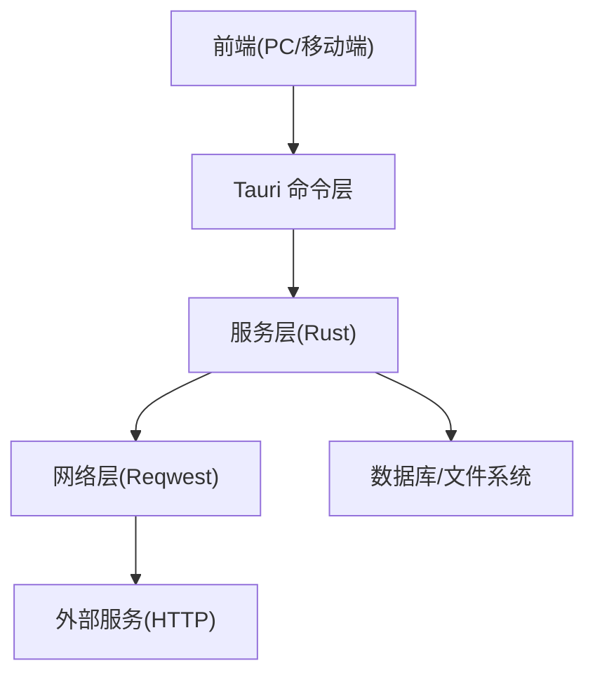
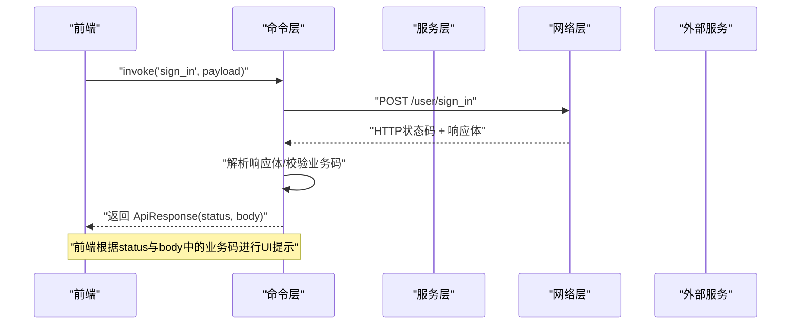
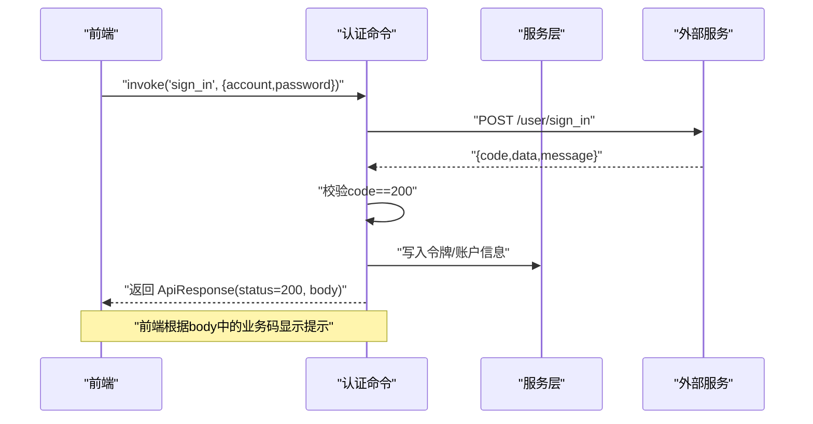
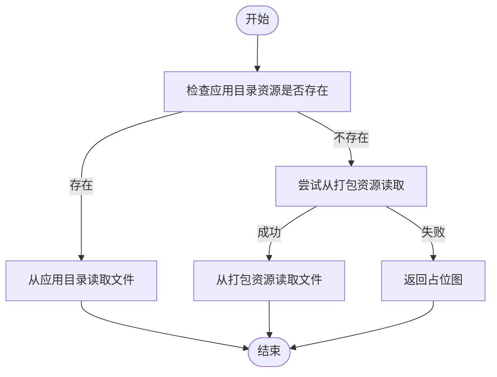
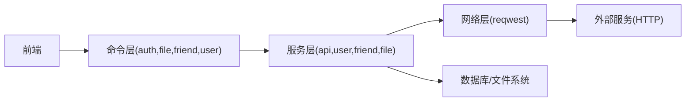

# 错误码规范

<cite>
**本文引用的文件**
- [src-tauri/src/dto/http_result.rs](file://src-tauri/src/dto/http_result.rs)
- [src-tauri/src/vo/http_response.rs](file://src-tauri/src/vo/http_response.rs)
- [src-tauri/src/cmd/api_controller.rs](file://src-tauri/src/cmd/api_controller.rs)
- [src-tauri/src/service/api_service.rs](file://src-tauri/src/service/api_service.rs)
- [src-tauri/src/cmd/auth_controller.rs](file://src-tauri/src/cmd/auth_controller.rs)
- [src-tauri/src/entity/user.rs](file://src-tauri/src/entity/user.rs)
- [src-tauri/src/cmd/user_controller.rs](file://src-tauri/src/cmd/user_controller.rs)
- [src-tauri/src/cmd/friend_controller.rs](file://src-tauri/src/cmd/friend_controller.rs)
- [src-tauri/src/cmd/file_controller.rs](file://src-tauri/src/cmd/file_controller.rs)
- [src-tauri/src/service/user_service.rs](file://src-tauri/src/service/user_service.rs)
- [src-tauri/src/utils/message_types.rs](file://src-tauri/src/utils/message_types.rs)
- [apps/pc/src/pages/Sign/SignIn/index.tsx](file://apps/pc/src/pages/Sign/SignIn/index.tsx)
</cite>

## 目录

1. [引言](#引言)
2. [项目结构](#项目结构)
3. [核心组件](#核心组件)
4. [架构总览](#架构总览)
5. [详细组件分析](#详细组件分析)
6. [依赖关系分析](#依赖关系分析)
7. [性能考量](#性能考量)
8. [故障排查指南](#故障排查指南)
9. [结论](#结论)
10. [附录](#附录)

## 引言

本规范旨在为即时通讯应用提供统一的错误码体系，覆盖 HTTP 状态码、业务逻辑错误码、网络通信错误码、文件操作错误码与用户认证错误码等类别。文档为每类错误提供错误描述、触发条件、解决方案与调试建议，并明确错误码的命名规范、分类规则与版本管理策略；同时给出常见错误场景的诊断方法、预防措施以及错误日志记录与监控告警机制。

## 项目结构

本项目采用前后端分离与跨端集成的架构：

- 前端（PC/移动端）负责用户交互与调用后端命令；
- 后端（Rust/Tauri）负责命令实现、网络请求封装、业务服务与数据持久化；
- 错误码在后端以统一的数据结构承载，并在前端进行展示与处理。

[本图为概念性结构示意，无需图表来源]

## 核心组件

- 统一响应模型

  - 后端统一返回结构包含业务码、消息与数据体，便于前端一致化处理。
  - 参考路径：[响应模型定义:1-10](file://src-tauri/src/dto/http_result.rs#L1-L10)、[响应模型定义:1-10](file://src-tauri/src/vo/http_response.rs#L1-L10)

- 网络请求封装

  - 提供通用的 GET/POST/上传等请求封装，自动注入鉴权头与超时控制。
  - 参考路径：[网络请求封装:1-187](file://src-tauri/src/service/api_service.rs#L1-L187)、[命令层 HTTP 封装:1-151](file://src-tauri/src/cmd/api_controller.rs#L1-L151)

- 认证流程

  - 登录成功后写入全局用户信息与令牌，后续请求自动携带令牌。
  - 参考路径：[认证命令:1-113](file://src-tauri/src/cmd/auth_controller.rs#L1-L113)、[用户信息模型:1-9](file://src-tauri/src/entity/user.rs#L1-L9)

- 文件读取与占位图

  - 应用内资源文件读取与异常占位图生成，确保 UI 稳定。
  - 参考路径：[文件控制器:1-258](file://src-tauri/src/cmd/file_controller.rs#L1-L258)

- 用户与好友服务
  - 用户登录初始化、未读消息与通知拉取、定时任务等。
  - 参考路径：[用户服务:1-284](file://src-tauri/src/service/user_service.rs#L1-L284)、[好友命令:1-41](file://src-tauri/src/cmd/friend_controller.rs#L1-L41)

**章节来源**

- [src-tauri/src/dto/http_result.rs:1-10](file://src-tauri/src/dto/http_result.rs#L1-L10)
- [src-tauri/src/vo/http_response.rs:1-10](file://src-tauri/src/vo/http_response.rs#L1-L10)
- [src-tauri/src/service/api_service.rs:1-187](file://src-tauri/src/service/api_service.rs#L1-L187)
- [src-tauri/src/cmd/api_controller.rs:1-151](file://src-tauri/src/cmd/api_controller.rs#L1-L151)
- [src-tauri/src/cmd/auth_controller.rs:1-113](file://src-tauri/src/cmd/auth_controller.rs#L1-L113)
- [src-tauri/src/entity/user.rs:1-9](file://src-tauri/src/entity/user.rs#L1-L9)
- [src-tauri/src/cmd/file_controller.rs:1-258](file://src-tauri/src/cmd/file_controller.rs#L1-L258)
- [src-tauri/src/service/user_service.rs:1-284](file://src-tauri/src/service/user_service.rs#L1-L284)
- [src-tauri/src/cmd/friend_controller.rs:1-41](file://src-tauri/src/cmd/friend_controller.rs#L1-L41)

## 架构总览

下图展示了从前端到后端命令、服务与网络层的调用链路，以及错误在各层的传播与处理方式。

**图表来源**

- [src-tauri/src/cmd/auth_controller.rs:16-64](file://src-tauri/src/cmd/auth_controller.rs#L16-L64)
- [src-tauri/src/cmd/api_controller.rs:24-58](file://src-tauri/src/cmd/api_controller.rs#L24-L58)
- [src-tauri/src/service/api_service.rs:12-37](file://src-tauri/src/service/api_service.rs#L12-L37)

**章节来源**

- [src-tauri/src/cmd/auth_controller.rs:16-64](file://src-tauri/src/cmd/auth_controller.rs#L16-L64)
- [src-tauri/src/cmd/api_controller.rs:24-58](file://src-tauri/src/cmd/api_controller.rs#L24-L58)
- [src-tauri/src/service/api_service.rs:12-37](file://src-tauri/src/service/api_service.rs#L12-L37)

## 详细组件分析

### 统一响应模型与业务码

- 数据结构
  - 后端统一返回结构包含业务码、消息与数据体，便于前端一致化处理。
  - 参考路径：[响应模型定义:1-10](file://src-tauri/src/dto/http_result.rs#L1-L10)、[响应模型定义:1-10](file://src-tauri/src/vo/http_response.rs#L1-L10)
- 使用场景
  - 服务层在处理外部接口返回时，将 HTTP 状态码映射为内部业务码，保证前后端契约稳定。
  - 参考路径：[用户服务对未读消息的处理:70-139](file://src-tauri/src/service/user_service.rs#L70-L139)

**章节来源**

- [src-tauri/src/dto/http_result.rs:1-10](file://src-tauri/src/dto/http_result.rs#L1-L10)
- [src-tauri/src/vo/http_response.rs:1-10](file://src-tauri/src/vo/http_response.rs#L1-L10)
- [src-tauri/src/service/user_service.rs:70-139](file://src-tauri/src/service/user_service.rs#L70-L139)

### 网络通信错误码

- HTTP 状态码
  - GET/POST/上传等请求直接返回 HTTP 状态码，前端据此判断是否成功。
  - 参考路径：[命令层 HTTP 封装:24-58](file://src-tauri/src/cmd/api_controller.rs#L24-L58)、[网络请求封装:12-37](file://src-tauri/src/service/api_service.rs#L12-L37)
- 业务码映射
  - 登录接口返回的业务码用于前端判定登录是否成功。
  - 参考路径：[认证命令:27-37](file://src-tauri/src/cmd/auth_controller.rs#L27-L37)、[登录结果模型:1-9](file://src-tauri/src/entity/user.rs#L1-L9)
- 超时与鉴权
  - 统一设置超时时间与鉴权头，避免因网络波动导致的不可预期行为。
  - 参考路径：[网络请求封装:16-24](file://src-tauri/src/service/api_service.rs#L16-L24)

**章节来源**

- [src-tauri/src/cmd/api_controller.rs:24-58](file://src-tauri/src/cmd/api_controller.rs#L24-L58)
- [src-tauri/src/service/api_service.rs:12-37](file://src-tauri/src/service/api_service.rs#L12-L37)
- [src-tauri/src/cmd/auth_controller.rs:27-37](file://src-tauri/src/cmd/auth_controller.rs#L27-L37)
- [src-tauri/src/entity/user.rs:1-9](file://src-tauri/src/entity/user.rs#L1-L9)

### 用户认证错误码

- 登录流程
  - 成功：写入令牌与账户信息，随后拉取用户信息并初始化本地数据。
  - 失败：返回业务码非 200 或解析失败，前端提示“无效凭证”。
  - 参考路径：[认证命令:16-64](file://src-tauri/src/cmd/auth_controller.rs#L16-L64)
- 登出与清理
  - 清空用户信息、服务器列表与数据库连接，确保安全退出。
  - 参考路径：[登出命令:66-92](file://src-tauri/src/cmd/auth_controller.rs#L66-L92)
- 前端处理
  - 前端解析后端返回的业务码，当为特定错误码时提示“无效凭证”，否则提示“网络错误”。
  - 参考路径：[前端登录处理:100-159](file://apps/pc/src/pages/Sign/SignIn/index.tsx#L100-L159)

**图表来源**

- [src-tauri/src/cmd/auth_controller.rs:16-64](file://src-tauri/src/cmd/auth_controller.rs#L16-L64)
- [src-tauri/src/entity/user.rs:1-9](file://src-tauri/src/entity/user.rs#L1-L9)
- [apps/pc/src/pages/Sign/SignIn/index.tsx:100-159](file://apps/pc/src/pages/Sign/SignIn/index.tsx#L100-L159)

**章节来源**

- [src-tauri/src/cmd/auth_controller.rs:16-64](file://src-tauri/src/cmd/auth_controller.rs#L16-L64)
- [src-tauri/src/entity/user.rs:1-9](file://src-tauri/src/entity/user.rs#L1-L9)
- [apps/pc/src/pages/Sign/SignIn/index.tsx:100-159](file://apps/pc/src/pages/Sign/SignIn/index.tsx#L100-L159)

### 文件操作错误码

- 资源读取
  - 优先从应用目录读取资源文件，若不存在则尝试打包资源目录；若仍不存在则返回占位图。
  - 参考路径：[文件控制器:13-67](file://src-tauri/src/cmd/file_controller.rs#L13-L67)
- 异常处理
  - 读取元数据失败、读取内容失败均记录错误日志并返回占位图，保证 UI 稳定性。
  - 参考路径：[文件读取辅助函数:111-153](file://src-tauri/src/cmd/file_controller.rs#L111-L153)
- 占位图
  - 返回固定格式的占位图，便于前端统一渲染。
  - 参考路径：[占位图生成:69-109](file://src-tauri/src/cmd/file_controller.rs#L69-L109)

**图表来源**

- [src-tauri/src/cmd/file_controller.rs:13-67](file://src-tauri/src/cmd/file_controller.rs#L13-L67)
- [src-tauri/src/cmd/file_controller.rs:111-153](file://src-tauri/src/cmd/file_controller.rs#L111-L153)
- [src-tauri/src/cmd/file_controller.rs:69-109](file://src-tauri/src/cmd/file_controller.rs#L69-L109)

**章节来源**

- [src-tauri/src/cmd/file_controller.rs:13-67](file://src-tauri/src/cmd/file_controller.rs#L13-L67)
- [src-tauri/src/cmd/file_controller.rs:111-153](file://src-tauri/src/cmd/file_controller.rs#L111-L153)
- [src-tauri/src/cmd/file_controller.rs:69-109](file://src-tauri/src/cmd/file_controller.rs#L69-L109)

### 业务逻辑错误码

- 未读消息与通知
  - 服务层在拉取未读消息与通知时，对 HTTP 状态码与业务码进行判断，非 200 或 204 视为异常。
  - 参考路径：[未读消息处理:70-139](file://src-tauri/src/service/user_service.rs#L70-L139)、[未读通知处理:247-274](file://src-tauri/src/service/user_service.rs#L247-L274)
- 好友列表与本地同步
  - 好友查询与本地列表更新命令在 DAO 与服务层出现异常时返回错误字符串，前端统一提示。
  - 参考路径：[好友命令:6-41](file://src-tauri/src/cmd/friend_controller.rs#L6-L41)

**章节来源**

- [src-tauri/src/service/user_service.rs:70-139](file://src-tauri/src/service/user_service.rs#L70-L139)
- [src-tauri/src/service/user_service.rs:247-274](file://src-tauri/src/service/user_service.rs#L247-L274)
- [src-tauri/src/cmd/friend_controller.rs:6-41](file://src-tauri/src/cmd/friend_controller.rs#L6-L41)

### 消息类型与系统消息

- 消息类型分类
  - 定义了基础消息、P2P 消息、心跳与控制消息、通知与系统消息等类型，便于消息路由与处理。
  - 参考路径：[消息类型定义:1-108](file://src-tauri/src/utils/message_types.rs#L1-L108)

**章节来源**

- [src-tauri/src/utils/message_types.rs:1-108](file://src-tauri/src/utils/message_types.rs#L1-L108)

## 依赖关系分析

- 命令层依赖服务层，服务层依赖网络层与数据层；
- 前端通过 Tauri 命令调用命令层，命令层负责与外部服务交互；
- 统一响应模型贯穿服务层与命令层，保证前后端契约一致。

[本图为概念性依赖示意，无需图表来源]

**章节来源**

- [src-tauri/src/cmd/auth_controller.rs:1-113](file://src-tauri/src/cmd/auth_controller.rs#L1-L113)
- [src-tauri/src/service/api_service.rs:1-187](file://src-tauri/src/service/api_service.rs#L1-L187)
- [src-tauri/src/cmd/file_controller.rs:1-258](file://src-tauri/src/cmd/file_controller.rs#L1-L258)
- [src-tauri/src/service/user_service.rs:1-284](file://src-tauri/src/service/user_service.rs#L1-L284)

## 性能考量

- 超时控制
  - 网络请求统一设置超时，避免长时间阻塞影响用户体验。
  - 参考路径：[超时设置:16-24](file://src-tauri/src/service/api_service.rs#L16-L24)
- 并发与锁
  - 定时任务与消息发送使用锁与超时包装，防止阻塞与资源竞争。
  - 参考路径：[定时任务与锁:141-181](file://src-tauri/src/service/user_service.rs#L141-L181)

**章节来源**

- [src-tauri/src/service/api_service.rs:16-24](file://src-tauri/src/service/api_service.rs#L16-L24)
- [src-tauri/src/service/user_service.rs:141-181](file://src-tauri/src/service/user_service.rs#L141-L181)

## 故障排查指南

- 登录失败
  - 现象：前端提示“无效凭证”。
  - 排查：确认后端登录接口返回的业务码是否为 200；检查令牌写入与后续用户信息拉取是否成功。
  - 参考路径：[认证命令:16-64](file://src-tauri/src/cmd/auth_controller.rs#L16-L64)、[前端处理:100-159](file://apps/pc/src/pages/Sign/SignIn/index.tsx#L100-L159)
- 网络错误
  - 现象：前端提示“网络错误”。
  - 排查：检查 HTTP 状态码与超时设置；确认鉴权头是否正确注入。
  - 参考路径：[命令层 HTTP 封装:24-58](file://src-tauri/src/cmd/api_controller.rs#L24-L58)、[网络请求封装:12-37](file://src-tauri/src/service/api_service.rs#L12-L37)
- 文件读取失败
  - 现象：UI 显示占位图。
  - 排查：确认资源路径配置与打包资源路径；查看日志中“读取文件元数据失败/读取文件内容失败”的错误。
  - 参考路径：[文件控制器:111-153](file://src-tauri/src/cmd/file_controller.rs#L111-L153)
- 未读消息/通知异常
  - 现象：未读计数不更新或通知未显示。
  - 排查：检查 HTTP 状态码与业务码；确认定时任务与锁机制正常运行。
  - 参考路径：[未读消息处理:70-139](file://src-tauri/src/service/user_service.rs#L70-L139)、[未读通知处理:247-274](file://src-tauri/src/service/user_service.rs#L247-L274)

**章节来源**

- [src-tauri/src/cmd/auth_controller.rs:16-64](file://src-tauri/src/cmd/auth_controller.rs#L16-L64)
- [apps/pc/src/pages/Sign/SignIn/index.tsx:100-159](file://apps/pc/src/pages/Sign/SignIn/index.tsx#L100-L159)
- [src-tauri/src/cmd/api_controller.rs:24-58](file://src-tauri/src/cmd/api_controller.rs#L24-L58)
- [src-tauri/src/service/api_service.rs:12-37](file://src-tauri/src/service/api_service.rs#L12-L37)
- [src-tauri/src/cmd/file_controller.rs:111-153](file://src-tauri/src/cmd/file_controller.rs#L111-L153)
- [src-tauri/src/service/user_service.rs:70-139](file://src-tauri/src/service/user_service.rs#L70-L139)
- [src-tauri/src/service/user_service.rs:247-274](file://src-tauri/src/service/user_service.rs#L247-L274)

## 结论

本规范基于现有代码实现了统一的错误码与错误处理机制，明确了 HTTP 状态码、业务码、网络通信、文件操作与认证相关的错误场景与处理策略。建议在后续迭代中进一步完善错误码的版本化管理与监控告警，提升系统的可观测性与可维护性。

## 附录

### 错误码分类与命名规范

- 分类
  - HTTP 状态码：由外部服务返回，命令层直接透传。
  - 业务逻辑错误码：服务层对 HTTP 状态码与业务体进行二次判定，统一返回业务码。
- 命名规范
  - 业务码使用整型，语义清晰，避免使用魔法数字。
  - 建议按功能域划分范围，如认证(1xx)、消息(2xx)、文件(3xx)等。
- 版本管理策略
  - 错误码变更需在版本发布说明中标注；旧版客户端需兼容历史业务码。

[本节为规范性建议，无需章节来源]

### 日志记录与监控告警

- 日志记录
  - 关键路径使用 info/warn/error 记录上下文信息，便于定位问题。
  - 参考路径：[文件控制器日志:115-128](file://src-tauri/src/cmd/file_controller.rs#L115-L128)、[用户服务日志:70-139](file://src-tauri/src/service/user_service.rs#L70-L139)
- 监控告警
  - 建议对高频错误码与异常 HTTP 状态码建立阈值告警，结合日志聚合进行根因分析。

[本节为通用建议，无需章节来源]
