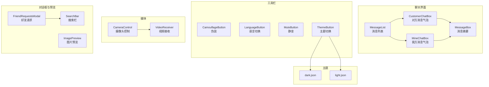
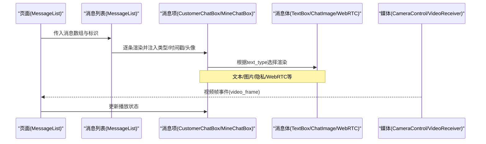
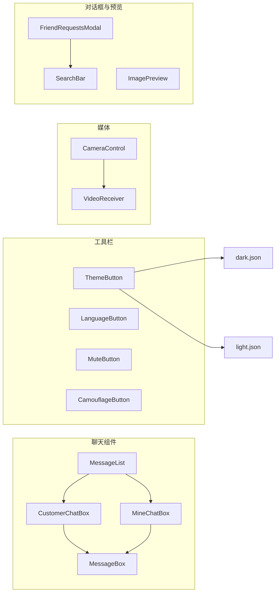

# UI组件库

<cite>
**本文引用的文件**
- [LayoutBtn.tsx](file://apps/pc/src/components/Button/LayoutBtn.tsx)
- [CameraControl.tsx](file://apps/pc/src/components/Media/CameraControl.tsx)
- [VideoReceiver.tsx](file://apps/pc/src/components/Media/VideoReceiver.tsx)
- [CamouflageButton.tsx](file://apps/pc/src/components/ToolButtons/CamouflageButton.tsx)
- [LanguageButton.tsx](file://apps/pc/src/components/ToolButtons/LanguageButton.tsx)
- [MuteButton.tsx](file://apps/pc/src/components/ToolButtons/MuteButton.tsx)
- [ThemeButton.tsx](file://apps/pc/src/components/ToolButtons/ThemeButton.tsx)
- [index.ts](file://apps/pc/src/components/ToolButtons/index.ts)
- [MessageBox.tsx](file://apps/pc/src/pages/Home/Chats/components/MessageBox.tsx)
- [MessageList.tsx](file://apps/pc/src/pages/Home/Chats/components/MessageList.tsx)
- [CustomerChatBox.tsx](file://apps/pc/src/pages/Home/Chats/components/CustomerChatBox.tsx)
- [MineChatBox.tsx](file://apps/pc/src/pages/Home/Chats/components/MineChatBox.tsx)
- [FriendRequestsModal.tsx](file://apps/pc/src/components/FriendRequestsModal/index.tsx)
- [ImagePreview.tsx](file://apps/pc/src/components/ImagePreview/index.tsx)
- [SearchBar.tsx](file://apps/pc/src/components/SearchBar/index.tsx)
- [dark.json](file://apps/pc/src/theme/dark.json)
- [light.json](file://apps/pc/src/theme/light.json)
- [index.ts](file://packages/types/src/index.ts)
</cite>

## 目录
1. [简介](#简介)
2. [项目结构](#项目结构)
3. [核心组件](#核心组件)
4. [架构总览](#架构总览)
5. [组件详解](#组件详解)
6. [依赖关系分析](#依赖关系分析)
7. [性能与可访问性](#性能与可访问性)
8. [故障排查](#故障排查)
9. [结论](#结论)
10. [附录：使用示例与最佳实践](#附录使用示例与最佳实践)

## 简介
本文件面向即时通讯应用的UI组件库，系统化梳理聊天界面组件、媒体组件、工具栏组件与对话框组件的设计理念、属性配置、事件处理、样式定制、响应式与主题切换、无障碍支持、组合模式、状态管理与性能优化策略。文档以“从上层页面到具体组件”的方式逐层展开，辅以可视化图示帮助开发者快速理解与高效集成。

## 项目结构
组件库主要分布在PC端应用中，按功能域组织：
- 布局与基础按钮：Button
- 工具栏按钮：ToolButtons
- 媒体交互：Media（摄像头控制、视频接收）
- 聊天界面：Home/Chats/components（消息列表、消息项、消息体等）
- 对话框与预览：FriendRequestsModal、ImagePreview、SearchBar
- 主题与样式：theme（dark/light JSON）

图表来源
- [MessageList.tsx:18-93](file://apps/pc/src/pages/Home/Chats/components/MessageList.tsx#L18-L93)
- [MessageBox.tsx:11-133](file://apps/pc/src/pages/Home/Chats/components/MessageBox.tsx#L11-L133)
- [CustomerChatBox.tsx:19-168](file://apps/pc/src/pages/Home/Chats/components/CustomerChatBox.tsx#L19-L168)
- [MineChatBox.tsx:33-225](file://apps/pc/src/pages/Home/Chats/components/MineChatBox.tsx#L33-L225)
- [ThemeButton.tsx:6-46](file://apps/pc/src/components/ToolButtons/ThemeButton.tsx#L6-L46)
- [CameraControl.tsx:14-268](file://apps/pc/src/components/Media/CameraControl.tsx#L14-L268)
- [VideoReceiver.tsx:5-153](file://apps/pc/src/components/Media/VideoReceiver.tsx#L5-L153)
- [FriendRequestsModal.tsx:20-292](file://apps/pc/src/components/FriendRequestsModal/index.tsx#L20-L292)
- [ImagePreview.tsx:12-164](file://apps/pc/src/components/ImagePreview/index.tsx#L12-L164)
- [SearchBar.tsx:15-84](file://apps/pc/src/components/SearchBar/index.tsx#L15-L84)
- [dark.json:1-51](file://apps/pc/src/theme/dark.json#L1-L51)
- [light.json:1-51](file://apps/pc/src/theme/light.json#L1-L51)

章节来源
- [MessageList.tsx:18-122](file://apps/pc/src/pages/Home/Chats/components/MessageList.tsx#L18-L122)
- [MessageBox.tsx:11-133](file://apps/pc/src/pages/Home/Chats/components/MessageBox.tsx#L11-L133)
- [CustomerChatBox.tsx:19-168](file://apps/pc/src/pages/Home/Chats/components/CustomerChatBox.tsx#L19-L168)
- [MineChatBox.tsx:33-225](file://apps/pc/src/pages/Home/Chats/components/MineChatBox.tsx#L33-L225)
- [ThemeButton.tsx:6-46](file://apps/pc/src/components/ToolButtons/ThemeButton.tsx#L6-L46)
- [CameraControl.tsx:14-268](file://apps/pc/src/components/Media/CameraControl.tsx#L14-L268)
- [VideoReceiver.tsx:5-153](file://apps/pc/src/components/Media/VideoReceiver.tsx#L5-L153)
- [FriendRequestsModal.tsx:20-292](file://apps/pc/src/components/FriendRequestsModal/index.tsx#L20-L292)
- [ImagePreview.tsx:12-164](file://apps/pc/src/components/ImagePreview/index.tsx#L12-L164)
- [SearchBar.tsx:15-84](file://apps/pc/src/components/SearchBar/index.tsx#L15-L84)
- [dark.json:1-51](file://apps/pc/src/theme/dark.json#L1-L51)
- [light.json:1-51](file://apps/pc/src/theme/light.json#L1-L51)

## 核心组件
- 聊天界面组件
  - MessageList：渲染消息列表，按时间戳分段显示时间戳，支持新消息与已加载消息的动画区分。
  - MessageBox：消息摘要卡片，支持多类型消息文本映射与头像缓存。
  - CustomerChatBox / MineChatBox：分别渲染对方与我方消息气泡，支持文本、图片、隐私模式、WebRTC消息等类型。
- 媒体组件
  - CameraControl：本地摄像头采集、设备枚举、切换、录制与向后端发送视频帧。
  - VideoReceiver：通过MediaSource接收来自后端的视频帧并播放。
- 工具栏组件
  - CamouflageButton、LanguageButton、MuteButton、ThemeButton：提供伪装、语言切换、静音、主题切换能力。
- 对话框与预览
  - FriendRequestsModal：好友请求弹窗，支持“我发起的”和“收到的”两个标签页，操作接受/拒绝。
  - ImagePreview：图片预览与缩放、左右切换、键盘快捷键支持。
  - SearchBar：搜索输入、添加好友、通知徽章与弹窗联动。

章节来源
- [MessageList.tsx:18-122](file://apps/pc/src/pages/Home/Chats/components/MessageList.tsx#L18-L122)
- [MessageBox.tsx:11-133](file://apps/pc/src/pages/Home/Chats/components/MessageBox.tsx#L11-L133)
- [CustomerChatBox.tsx:19-168](file://apps/pc/src/pages/Home/Chats/components/CustomerChatBox.tsx#L19-L168)
- [MineChatBox.tsx:33-225](file://apps/pc/src/pages/Home/Chats/components/MineChatBox.tsx#L33-L225)
- [CameraControl.tsx:14-268](file://apps/pc/src/components/Media/CameraControl.tsx#L14-L268)
- [VideoReceiver.tsx:5-153](file://apps/pc/src/components/Media/VideoReceiver.tsx#L5-L153)
- [CamouflageButton.tsx:6-28](file://apps/pc/src/components/ToolButtons/CamouflageButton.tsx#L6-L28)
- [LanguageButton.tsx:6-34](file://apps/pc/src/components/ToolButtons/LanguageButton.tsx#L6-L34)
- [MuteButton.tsx:6-26](file://apps/pc/src/components/ToolButtons/MuteButton.tsx#L6-L26)
- [ThemeButton.tsx:6-46](file://apps/pc/src/components/ToolButtons/ThemeButton.tsx#L6-L46)
- [FriendRequestsModal.tsx:20-292](file://apps/pc/src/components/FriendRequestsModal/index.tsx#L20-L292)
- [ImagePreview.tsx:12-164](file://apps/pc/src/components/ImagePreview/index.tsx#L12-L164)
- [SearchBar.tsx:15-84](file://apps/pc/src/components/SearchBar/index.tsx#L15-L84)

## 架构总览
组件间协作关系如下：
- 页面层（MessageList）负责聚合消息并选择渲染对应的消息气泡组件。
- 消息气泡组件根据消息类型动态渲染内容（文本、图片、特殊消息），并维护自身缓存与异步资源加载。
- 工具栏组件通过状态持久化（localStorage）与全局CSS变量实现主题切换与语言切换。
- 媒体组件通过Tauri后端进行视频帧收发，前端负责UI控制与播放。

图表来源
- [MessageList.tsx:18-93](file://apps/pc/src/pages/Home/Chats/components/MessageList.tsx#L18-L93)
- [CustomerChatBox.tsx:112-138](file://apps/pc/src/pages/Home/Chats/components/CustomerChatBox.tsx#L112-L138)
- [MineChatBox.tsx:152-178](file://apps/pc/src/pages/Home/Chats/components/MineChatBox.tsx#L152-L178)
- [VideoReceiver.tsx:34-97](file://apps/pc/src/components/Media/VideoReceiver.tsx#L34-L97)

## 组件详解

### 聊天界面组件

#### MessageList（消息列表）
- 职责：遍历消息数组，按时间间隔显示时间戳；根据新消息/已加载集合为消息项添加动画类名；对特定类型消息进行过滤。
- 关键点：
  - 时间戳阈值：相邻消息时间差超过固定阈值才显示时间戳。
  - 动画类名：基于新消息/已加载集合决定是否应用入场动画。
  - 性能：使用浅比较记忆化，避免不必要的重渲染。
- 属性与事件：
  - 输入：messages、friendIcon、friendUuid、newMessageIds、loadedMessageIds。
  - 输出：无直接事件，通过外部状态驱动重渲染。
- 样式定制：通过类名与样式模块控制动画与布局。

章节来源
- [MessageList.tsx:18-122](file://apps/pc/src/pages/Home/Chats/components/MessageList.tsx#L18-L122)

#### MessageBox（消息摘要）
- 职责：展示标题、消息摘要、时间与头像徽章；对多种text_type进行友好文案映射；头像采用缓存减少重复请求。
- 关键点：
  - 文本映射：对图片、隐私模式、视频通话、WebRTC信令等类型进行占位或解析。
  - 缓存：图片URL使用Map缓存，避免重复网络请求。
  - 异步加载：头像与文件路径通过服务接口获取。
- 属性与事件：
  - 输入：message、title、time、img、count、text_type。
  - 输出：无直接事件。
- 样式定制：容器、左列头像、中心区域、右列时间的布局与间距。

章节来源
- [MessageBox.tsx:11-133](file://apps/pc/src/pages/Home/Chats/components/MessageBox.tsx#L11-L133)

#### CustomerChatBox（对方消息气泡）
- 职责：渲染对方头像、消息内容与时间提示；根据消息类型渲染文本、图片、隐私模式或WebRTC消息。
- 关键点：
  - 图片加载：对biz_id进行缓存，避免重复查询；支持本地路径与业务文件两种来源。
  - 类型分支：text_type决定渲染组件与样式类名。
  - 加载态：图片与头像加载时降低透明度，提升体验。
- 属性与事件：
  - 输入：text_msg_raw（raw、text_type、timestamp）、img、friendUuid、currentBizId。
  - 输出：无直接事件。
- 样式定制：气泡容器、图片消息样式、特殊消息样式。

章节来源
- [CustomerChatBox.tsx:19-168](file://apps/pc/src/pages/Home/Chats/components/CustomerChatBox.tsx#L19-L168)

#### MineChatBox（我方消息气泡）
- 职责：渲染我方头像、消息内容与时间提示；支持发送状态反馈（未读/失败）；根据消息类型渲染不同内容。
- 关键点：
  - 发送状态：未读消息定时器触发状态变更，10秒后标记失败态。
  - 图片加载：优先本地路径转Tauri URL，否则按biz_id查询业务文件。
  - 类型分支：与对方消息一致，但渲染为我方样式。
- 属性与事件：
  - 输入：msg（含text_msg_raw）、isAck、icon、friendUuid、currentBizId。
  - 输出：无直接事件。
- 样式定制：消息容器、图片消息样式、特殊消息样式、发送状态提示。

章节来源
- [MineChatBox.tsx:33-225](file://apps/pc/src/pages/Home/Chats/components/MineChatBox.tsx#L33-L225)

### 媒体组件

#### CameraControl（摄像头控制）
- 职责：本地摄像头采集、设备枚举与切换、录制与发送视频帧至后端；暴露方法供父组件调用。
- 关键点：
  - 设备枚举：通过媒体设备API列出videoinput设备，支持切换。
  - 录制：使用MediaRecorder捕获视频帧，按固定间隔发送至后端。
  - 生命周期：组件卸载时停止所有轨道与录制器。
- 属性与事件：
  - 输入：onStreamReady、isReceiver、uuid、callType、remoteStream。
  - 方法：startCamera、stopCamera、switchCamera、isCameraOn。
- 样式定制：视频预览区、控制按钮、设备选择下拉。

章节来源
- [CameraControl.tsx:14-268](file://apps/pc/src/components/Media/CameraControl.tsx#L14-L268)

#### VideoReceiver（视频接收）
- 职责：通过MediaSource接收后端推送的视频帧并播放；监听开始/结束信号，控制接收状态。
- 关键点：
  - MediaSource：创建并打开，添加VP8解码的SourceBuffer。
  - 事件监听：监听video_frame事件，按payload长度判断开始/结束信号。
  - 安全追加：检测SourceBuffer更新状态，避免并发追加。
- 属性与事件：
  - 输入：无。
  - 输出：无直接事件，通过内部状态与DOM更新呈现。
- 样式定制：视频容器、覆盖层与等待提示。

章节来源
- [VideoReceiver.tsx:5-153](file://apps/pc/src/components/Media/VideoReceiver.tsx#L5-L153)

### 工具栏组件

#### ThemeButton（主题切换）
- 职责：切换深/浅主题，持久化到localStorage，并将JSON变量写入documentElement CSS变量。
- 关键点：
  - 主题持久化：读取/设置localStorage中的theme键。
  - CSS变量注入：读取dark.json或light.json，批量设置根节点CSS变量。
- 属性与事件：
  - 输入：无。
  - 输出：无直接事件。
- 样式定制：按钮图标与容器样式。

章节来源
- [ThemeButton.tsx:6-46](file://apps/pc/src/components/ToolButtons/ThemeButton.tsx#L6-L46)
- [dark.json:1-51](file://apps/pc/src/theme/dark.json#L1-L51)
- [light.json:1-51](file://apps/pc/src/theme/light.json#L1-L51)

#### LanguageButton（语言切换）
- 职责：切换中/英语言，持久化到localStorage并调用框架国际化API。
- 关键点：
  - 语言持久化：读取/设置localStorage中的language键。
  - 国际化：调用setLocale切换语言包。
- 属性与事件：
  - 输入：无。
  - 输出：无直接事件。
- 样式定制：按钮文本与容器样式。

章节来源
- [LanguageButton.tsx:6-34](file://apps/pc/src/components/ToolButtons/LanguageButton.tsx#L6-L34)

#### MuteButton（静音）
- 职责：切换静音状态，用于音视频场景。
- 关键点：
  - 状态切换：点击切换isMuted。
- 属性与事件：
  - 输入：无。
  - 输出：无直接事件。
- 样式定制：图标与容器样式。

章节来源
- [MuteButton.tsx:6-26](file://apps/pc/src/components/ToolButtons/MuteButton.tsx#L6-L26)

#### CamouflageButton（伪装）
- 职责：隐藏/显示界面元素，用于隐私场景。
- 关键点：
  - 状态切换：点击切换isCamouflaged。
- 属性与事件：
  - 输入：无。
  - 输出：无直接事件。
- 样式定制：图标与容器样式。

章节来源
- [CamouflageButton.tsx:6-28](file://apps/pc/src/components/ToolButtons/CamouflageButton.tsx#L6-L28)

### 对话框与预览组件

#### FriendRequestsModal（好友请求）
- 职责：展示“我发起的”和“收到的”好友请求，支持接受/拒绝操作；读取未读通知并标记已读。
- 关键点：
  - 并发获取：同时请求两类请求列表。
  - 状态映射：根据accept_status映射为不同状态文本与样式。
  - 通知处理：读取通知后更新本地联系人状态。
- 属性与事件：
  - 输入：visible、onClose。
  - 输出：无直接事件。
- 样式定制：模态框、标签页、请求项、状态徽标等。

章节来源
- [FriendRequestsModal.tsx:20-292](file://apps/pc/src/components/FriendRequestsModal/index.tsx#L20-L292)

#### ImagePreview（图片预览）
- 职责：多图预览、缩放、左右切换、键盘快捷键、缩略图导航。
- 关键点：
  - 缩放：限制最小/最大倍数，实时更新transform。
  - 导航：支持循环切换与点击缩略图跳转。
  - 快捷键：方向键、ESC、+/-。
- 属性与事件：
  - 输入：imagePaths、currentIndex、onClose。
  - 输出：无直接事件。
- 样式定制：背景模糊、遮罩、头部操作区、图片容器与缩略图区。

章节来源
- [ImagePreview.tsx:12-164](file://apps/pc/src/components/ImagePreview/index.tsx#L12-L164)

#### SearchBar（搜索栏）
- 职责：搜索输入、添加好友窗口、通知徽章与弹窗联动。
- 关键点：
  - 通知徽章：汇总菜单未读数，溢出显示上限。
  - 新窗口：通过Tauri打开搜索好友子窗口。
- 属性与事件：
  - 输入：无。
  - 输出：无直接事件。
- 样式定制：容器、搜索输入、动作区与分割线。

章节来源
- [SearchBar.tsx:15-84](file://apps/pc/src/components/SearchBar/index.tsx#L15-L84)

## 依赖关系分析

图表来源
- [ThemeButton.tsx:24-30](file://apps/pc/src/components/ToolButtons/ThemeButton.tsx#L24-L30)
- [dark.json:1-51](file://apps/pc/src/theme/dark.json#L1-L51)
- [light.json:1-51](file://apps/pc/src/theme/light.json#L1-L51)
- [CameraControl.tsx:14-268](file://apps/pc/src/components/Media/CameraControl.tsx#L14-L268)
- [VideoReceiver.tsx:5-153](file://apps/pc/src/components/Media/VideoReceiver.tsx#L5-L153)
- [FriendRequestsModal.tsx:20-292](file://apps/pc/src/components/FriendRequestsModal/index.tsx#L20-L292)
- [SearchBar.tsx:15-84](file://apps/pc/src/components/SearchBar/index.tsx#L15-L84)
- [MessageList.tsx:18-93](file://apps/pc/src/pages/Home/Chats/components/MessageList.tsx#L18-L93)
- [CustomerChatBox.tsx:19-168](file://apps/pc/src/pages/Home/Chats/components/CustomerChatBox.tsx#L19-L168)
- [MineChatBox.tsx:33-225](file://apps/pc/src/pages/Home/Chats/components/MineChatBox.tsx#L33-L225)
- [MessageBox.tsx:11-133](file://apps/pc/src/pages/Home/Chats/components/MessageBox.tsx#L11-L133)

章节来源
- [ThemeButton.tsx:24-30](file://apps/pc/src/components/ToolButtons/ThemeButton.tsx#L24-L30)
- [CameraControl.tsx:14-268](file://apps/pc/src/components/Media/CameraControl.tsx#L14-L268)
- [VideoReceiver.tsx:5-153](file://apps/pc/src/components/Media/VideoReceiver.tsx#L5-L153)
- [FriendRequestsModal.tsx:20-292](file://apps/pc/src/components/FriendRequestsModal/index.tsx#L20-L292)
- [SearchBar.tsx:15-84](file://apps/pc/src/components/SearchBar/index.tsx#L15-L84)
- [MessageList.tsx:18-93](file://apps/pc/src/pages/Home/Chats/components/MessageList.tsx#L18-L93)
- [CustomerChatBox.tsx:19-168](file://apps/pc/src/pages/Home/Chats/components/CustomerChatBox.tsx#L19-L168)
- [MineChatBox.tsx:33-225](file://apps/pc/src/pages/Home/Chats/components/MineChatBox.tsx#L33-L225)
- [MessageBox.tsx:11-133](file://apps/pc/src/pages/Home/Chats/components/MessageBox.tsx#L11-L133)

## 性能与可访问性

### 性能优化策略
- 记忆化与浅比较
  - MessageList使用React.memo并自定义比较函数，仅当消息ID、时间戳或集合大小变化时重渲染，显著降低列表滚动抖动。
- 缓存与去重
  - MessageBox与消息气泡组件均使用Map缓存图片URL，避免重复请求；头像加载时降低透明度，减少闪烁。
- 异步加载与并发
  - 通过Promise.all并发获取好友请求列表；图片与文件路径查询在useEffect中按需触发，避免阻塞主线程。
- 媒体资源管理
  - CameraControl在组件卸载时停止所有轨道与录制器；VideoReceiver在清理阶段移除SourceBuffer并释放对象URL。
- 事件与状态
  - MineChatBox对未读消息设置定时器，超时后标记失败态，避免长期占用内存。

章节来源
- [MessageList.tsx:95-121](file://apps/pc/src/pages/Home/Chats/components/MessageList.tsx#L95-L121)
- [MessageBox.tsx:63-81](file://apps/pc/src/pages/Home/Chats/components/MessageBox.tsx#L63-L81)
- [CustomerChatBox.tsx:34-51](file://apps/pc/src/pages/Home/Chats/components/CustomerChatBox.tsx#L34-L51)
- [MineChatBox.tsx:74-101](file://apps/pc/src/pages/Home/Chats/components/MineChatBox.tsx#L74-L101)
- [FriendRequestsModal.tsx:41-44](file://apps/pc/src/components/FriendRequestsModal/index.tsx#L41-L44)
- [CameraControl.tsx:159-182](file://apps/pc/src/components/Media/CameraControl.tsx#L159-L182)
- [VideoReceiver.tsx:105-131](file://apps/pc/src/components/Media/VideoReceiver.tsx#L105-L131)

### 响应式与主题
- 响应式设计
  - 组件普遍采用flex布局与相对单位，配合Ant Design组件的栅格系统实现自适应。
- 主题切换
  - ThemeButton读取localStorage中的theme键，动态注入dark.json或light.json中的CSS变量到documentElement，实现全局主题切换。
- 无障碍支持
  - 工具栏按钮均包裹Tooltip，提供悬浮提示；ImagePreview支持键盘快捷键，提升可访问性。

章节来源
- [ThemeButton.tsx:11-31](file://apps/pc/src/components/ToolButtons/ThemeButton.tsx#L11-L31)
- [dark.json:1-51](file://apps/pc/src/theme/dark.json#L1-L51)
- [light.json:1-51](file://apps/pc/src/theme/light.json#L1-L51)
- [ImagePreview.tsx:43-55](file://apps/pc/src/components/ImagePreview/index.tsx#L43-L55)

## 故障排查
- 摄像头权限与设备不可用
  - 现象：启动摄像头报错或无法获取设备列表。
  - 排查：确认浏览器权限与HTTPS环境；检查设备枚举与选择逻辑。
- 视频录制格式不支持
  - 现象：浏览器提示不支持VP8编码。
  - 排查：检查MediaRecorder支持类型与配置；必要时更换编码或浏览器。
- 视频播放卡顿
  - 现象：MediaSource追加缓冲导致卡顿。
  - 排查：确保SourceBuffer未处于updating状态再追加；合理设置录制间隔。
- 好友请求状态异常
  - 现象：状态未正确更新或通知未读。
  - 排查：确认accept_status映射与通知读取流程；检查后端返回数据结构。
- 图片预览空白
  - 现象：缩放或切换后图片不显示。
  - 排查：检查transform缩放范围与路径有效性；确认预览关闭时的资源释放。

章节来源
- [CameraControl.tsx:55-70](file://apps/pc/src/components/Media/CameraControl.tsx#L55-L70)
- [VideoReceiver.tsx:24-31](file://apps/pc/src/components/Media/VideoReceiver.tsx#L24-L31)
- [FriendRequestsModal.tsx:85-108](file://apps/pc/src/components/FriendRequestsModal/index.tsx#L85-L108)
- [ImagePreview.tsx:35-41](file://apps/pc/src/components/ImagePreview/index.tsx#L35-L41)

## 结论
该组件库围绕即时通讯场景构建了完善的UI体系：消息渲染与交互、媒体采集与播放、工具栏主题与语言切换、对话框与预览等模块协同工作。通过缓存、记忆化、并发与资源管理等策略，兼顾性能与体验；通过主题JSON变量与Tooltip等手段增强可访问性与可定制性。建议在实际项目中结合业务需求扩展消息类型与媒体能力，并持续优化事件与状态管理。

## 附录：使用示例与最佳实践

### 使用示例
- 渲染消息列表
  - 在页面中引入MessageList，传入messages、friendIcon、friendUuid与新消息/已加载集合，即可获得带时间戳与动画的消息列表。
- 切换主题
  - 在顶部工具栏放置ThemeButton，点击后自动切换深/浅主题并持久化到localStorage。
- 预览图片
  - 在消息中触发ImagePreview，传入图片路径数组与当前索引，支持缩放、切换与键盘操作。
- 处理好友请求
  - 在搜索栏或侧边栏触发FriendRequestsModal，自动拉取两类请求并支持接受/拒绝。

章节来源
- [MessageList.tsx:18-93](file://apps/pc/src/pages/Home/Chats/components/MessageList.tsx#L18-L93)
- [ThemeButton.tsx:6-46](file://apps/pc/src/components/ToolButtons/ThemeButton.tsx#L6-L46)
- [ImagePreview.tsx:12-164](file://apps/pc/src/components/ImagePreview/index.tsx#L12-L164)
- [FriendRequestsModal.tsx:20-292](file://apps/pc/src/components/FriendRequestsModal/index.tsx#L20-L292)

### 最佳实践
- 组件职责单一：消息渲染、媒体控制、对话框与预览各司其职，避免耦合。
- 状态外置：主题、语言、未读数等跨组件共享状态统一由store或localStorage管理。
- 性能优先：对长列表使用memo与浅比较；对图片与文件路径使用缓存；对并发请求使用Promise.all。
- 可访问性：为按钮提供Tooltip与键盘快捷键；确保颜色对比度满足主题要求。
- 扩展指南：新增消息类型时，在消息气泡组件中增加text_type分支与对应渲染组件；新增媒体能力时在CameraControl中扩展配置与事件。