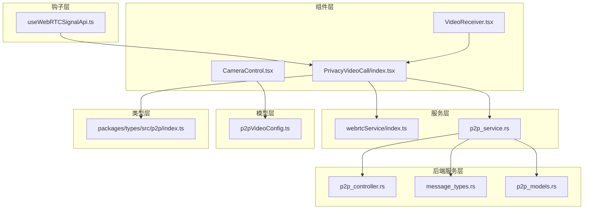
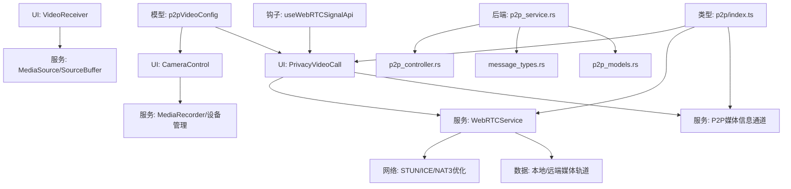
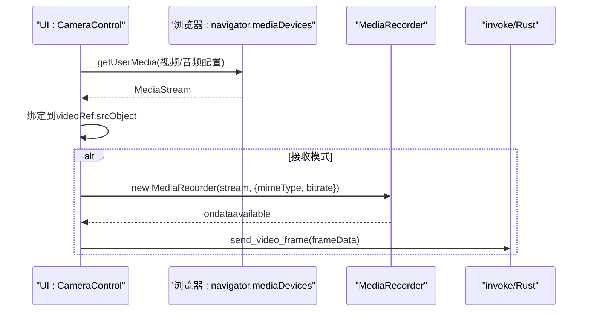
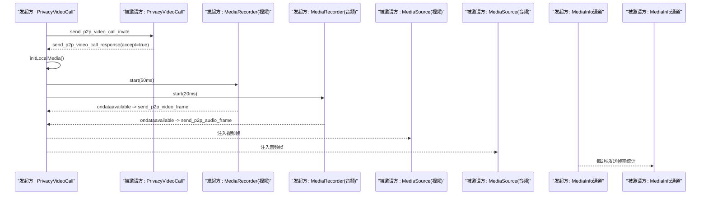
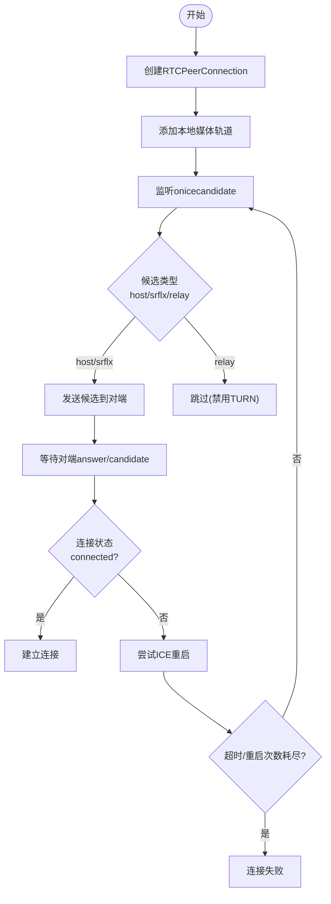
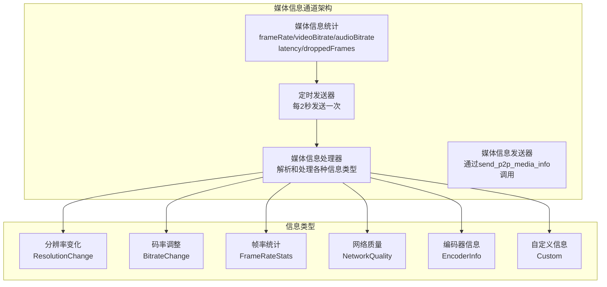
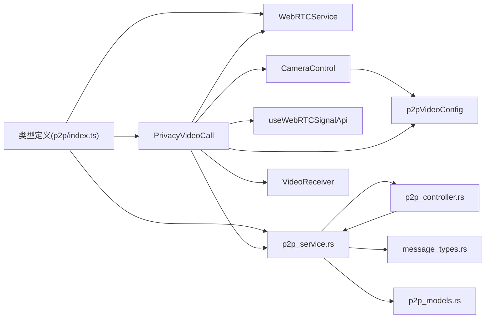

# 媒体组件

<cite>
**本文档引用的文件**
- [CameraControl.tsx](file://apps/pc/src/components/Media/CameraControl.tsx)
- [VideoReceiver.tsx](file://apps/pc/src/components/Media/VideoReceiver.tsx)
- [PrivacyVideoCall/index.tsx](file://apps/pc/src/components/Media/PrivacyVideoCall/index.tsx)
- [webrtcService/index.ts](file://apps/pc/src/services/webrtcService/index.ts)
- [useWebRTCSignalApi.ts](file://apps/pc/src/hooks/useWebRTCSignalApi.ts)
- [p2pVideoConfig.ts](file://apps/pc/src/models/p2pVideoConfig.ts)
- [CameraControl.module.css](file://apps/pc/src/components/Media/style/CameraControl.module.css)
- [VideoReceiver.module.css](file://apps/pc/src/components/Media/style/VideoReceiver.module.css)
- [PrivacyVideoCall/index.module.less](file://apps/pc/src/components/Media/PrivacyVideoCall/index.module.less)
- [packages/types/src/p2p/index.ts](file://packages/types/src/p2p/index.ts)
- [packages/types/src/index.ts](file://packages/types/src/index.ts)
- [p2p_service.rs](file://src-tauri/src/service/p2p_service.rs)
- [p2p_controller.rs](file://src-tauri/src/cmd/p2p_controller.rs)
- [message_types.rs](file://src-tauri/src/utils/message_types.rs)
- [p2p_models.rs](file://src-tauri/src/entity/p2p_models.rs)
</cite>

## 更新摘要
**变更内容**
- PrivacyVideoCall 组件错误处理和资源管理优化
- 增强 MediaSource 生命周期管理、缓冲队列处理和状态同步机制
- 优化组件卸载时的资源清理流程
- 改进 SourceBuffer 更新状态管理和并发控制
- 增强媒体信息通道的错误处理和状态同步

## 目录
1. [简介](#简介)
2. [项目结构](#项目结构)
3. [核心组件](#核心组件)
4. [架构总览](#架构总览)
5. [详细组件分析](#详细组件分析)
6. [媒体信息通道详解](#媒体信息通道详解)
7. [依赖关系分析](#依赖关系分析)
8. [性能考虑](#性能考虑)
9. [故障排除指南](#故障排除指南)
10. [结论](#结论)
11. [附录](#附录)

## 简介
本文件系统性梳理并说明音视频通话与媒体处理相关的UI组件，包括：
- 摄像头控制组件：负责本地摄像头设备管理、权限申请、流捕获与录制、设备切换与错误处理。
- 视频接收组件：负责接收远端媒体流并通过MediaSource/SourceBuffer进行解码播放。
- 隐私视频通话组件：提供完整的P2P视频通话能力，包含邀请/响应、媒体流发送与接收、媒体控制、状态同步与资源清理。
- **新增媒体信息通道**：独立的媒体状态传输通道，用于传输分辨率变化、码率调整、帧率统计、网络质量等控制信令。
- WebRTC服务：封装RTCPeerConnection、信令交换、NAT3穿透优化、ICE重启与超时处理。
- 类型定义：统一的媒体配置、控制命令、通话状态等类型。

目标是帮助开发者快速理解组件实现原理、正确配置与使用，并掌握媒体质量控制、网络适配与性能优化策略。

## 项目结构
媒体组件主要位于PC端前端应用中，采用按功能分层组织：
- 组件层：CameraControl、VideoReceiver、PrivacyVideoCall
- 服务层：webrtcService（WebRTC封装）、p2p_service（P2P通信服务）
- 钩子层：useWebRTCSignalApi（信令监听与窗口打开）
- 模型层：p2pVideoConfig（P2P视频配置）
- 样式层：各组件对应的CSS/LESS样式文件
- 类型层：packages/types/src/p2p/index.ts（媒体配置与控制类型）
- 后端服务层：Rust后端提供媒体信息通道和P2P通信支持



**图表来源**
- [PrivacyVideoCall/index.tsx:1-1120](file://apps/pc/src/components/Media/PrivacyVideoCall/index.tsx#L1-L1120)
- [webrtcService/index.ts:1-1662](file://apps/pc/src/services/webrtcService/index.ts#L1-L1662)
- [p2p_service.rs:1-893](file://src-tauri/src/service/p2p_service.rs#L1-L893)
- [p2p_controller.rs:1-227](file://src-tauri/src/cmd/p2p_controller.rs#L1-L227)
- [message_types.rs:1-124](file://src-tauri/src/utils/message_types.rs#L1-L124)
- [p2p_models.rs:1-484](file://src-tauri/src/entity/p2p_models.rs#L1-L484)

**章节来源**
- [CameraControl.tsx:1-268](file://apps/pc/src/components/Media/CameraControl.tsx#L1-L268)
- [VideoReceiver.tsx:1-153](file://apps/pc/src/components/Media/VideoReceiver.tsx#L1-L153)
- [PrivacyVideoCall/index.tsx:1-1120](file://apps/pc/src/components/Media/PrivacyVideoCall/index.tsx#L1-L1120)
- [webrtcService/index.ts:1-1662](file://apps/pc/src/services/webrtcService/index.ts#L1-L1662)
- [useWebRTCSignalApi.ts:1-100](file://apps/pc/src/hooks/useWebRTCSignalApi.ts#L1-L100)
- [p2pVideoConfig.ts:1-21](file://apps/pc/src/models/p2pVideoConfig.ts#L1-L21)
- [packages/types/src/p2p/index.ts:1-276](file://packages/types/src/p2p/index.ts#L1-L276)

## 核心组件
- 摄像头控制组件（CameraControl）
  - 功能：本地摄像头启动/停止、设备切换、MediaRecorder录制、错误处理、与后端Rust模块交互。
  - 关键点：通过navigator.mediaDevices.getUserMedia获取流；根据配置项设置分辨率、帧率、编码与码率；在接收模式下使用MediaRecorder捕获并发送视频帧。
- 视频接收组件（VideoReceiver）
  - 功能：接收远端视频帧并通过事件监听器注入到MediaSource/SourceBuffer进行播放。
  - 关键点：监听video_frame事件，解析数组缓冲，按需等待SourceBuffer更新完成后再追加数据。
- 隐私视频通话组件（PrivacyVideoCall）
  - 功能：发起/接受视频通话邀请、本地媒体初始化、录制并发送音视频帧、接收远端媒体、媒体控制（音视频开关、暂停/恢复、结束）、状态同步与资源清理。
  - 关键点：使用MediaRecorder分别录制视频与音频轨道，通过invoke发送帧数据；初始化两个MediaSource分别处理视频与音频；维护缓冲队列与并发更新状态，防止SourceBuffer冲突。
  - **新增媒体信息通道**：独立的媒体状态传输通道，每2秒自动发送帧率统计信息，避免与媒体数据通道竞争带宽。
- WebRTC服务（WebRTCService）
  - 功能：封装RTCPeerConnection生命周期、ICE候选收集与发送、信令交换、连接状态监控、ICE重启与超时处理、本地/远程媒体轨道管理。
  - 关键点：NAT3穿透优化配置，保留host/srflx候选，禁用relay；合理超时与重启策略，提升连接成功率。
- 类型定义（packages/types/src/p2p/index.ts）
  - 功能：统一的媒体配置（VideoConfig/AudioConfig/BufferConfig/MediaConfig）、媒体控制命令（MediaControl）、通话状态（VideoCallState）、**媒体信息类型（MediaInfoType）**等。

**章节来源**
- [CameraControl.tsx:1-268](file://apps/pc/src/components/Media/CameraControl.tsx#L1-L268)
- [VideoReceiver.tsx:1-153](file://apps/pc/src/components/Media/VideoReceiver.tsx#L1-L153)
- [PrivacyVideoCall/index.tsx:1-1120](file://apps/pc/src/components/Media/PrivacyVideoCall/index.tsx#L1-L1120)
- [webrtcService/index.ts:1-1662](file://apps/pc/src/services/webrtcService/index.ts#L1-L1662)
- [packages/types/src/p2p/index.ts:1-276](file://packages/types/src/p2p/index.ts#L1-L276)

## 架构总览
整体架构分为三层：
- UI层：CameraControl、VideoReceiver、PrivacyVideoCall负责用户交互与媒体展示。
- 服务层：webrtcService封装WebRTC连接与信令；useWebRTCSignalApi负责主窗口信令监听与WebRTC聊天窗口打开；**p2p_service提供媒体信息通道支持**。
- 数据层：类型定义与配置模型（p2pVideoConfig）确保前后端一致的媒体参数。



**图表来源**
- [PrivacyVideoCall/index.tsx:1-1120](file://apps/pc/src/components/Media/PrivacyVideoCall/index.tsx#L1-L1120)
- [webrtcService/index.ts:1-1662](file://apps/pc/src/services/webrtcService/index.ts#L1-L1662)
- [useWebRTCSignalApi.ts:1-100](file://apps/pc/src/hooks/useWebRTCSignalApi.ts#L1-L100)
- [p2pVideoConfig.ts:1-21](file://apps/pc/src/models/p2pVideoConfig.ts#L1-L21)
- [packages/types/src/p2p/index.ts:1-276](file://packages/types/src/p2p/index.ts#L1-L276)
- [p2p_service.rs:1-893](file://src-tauri/src/service/p2p_service.rs#L1-L893)
- [p2p_controller.rs:1-227](file://src-tauri/src/cmd/p2p_controller.rs#L1-L227)
- [message_types.rs:1-124](file://src-tauri/src/utils/message_types.rs#L1-L124)
- [p2p_models.rs:1-484](file://src-tauri/src/entity/p2p_models.rs#L1-L484)

## 详细组件分析

### 摄像头控制组件（CameraControl）
- 职责
  - 设备枚举与选择：通过enumerateDevices获取摄像头列表，支持多设备切换。
  - 媒体流获取：getUserMedia按配置请求视频与音频轨道。
  - 录制与发送：在接收模式下使用MediaRecorder捕获视频帧并通过invoke发送至后端。
  - 生命周期管理：组件卸载时停止所有轨道与MediaRecorder。
- 关键流程（启动摄像头）


**图表来源**
- [CameraControl.tsx:72-156](file://apps/pc/src/components/Media/CameraControl.tsx#L72-L156)

**章节来源**
- [CameraControl.tsx:1-268](file://apps/pc/src/components/Media/CameraControl.tsx#L1-L268)
- [CameraControl.module.css:1-75](file://apps/pc/src/components/Media/style/CameraControl.module.css#L1-L75)

### 视频接收组件（VideoReceiver）
- 职责
  - 创建MediaSource并监听video_frame事件。
  - 解析事件负载为ArrayBuffer并追加到SourceBuffer。
  - 状态管理：开始/停止信号识别、等待提示、资源清理。
- 关键流程（接收与播放）
```mermaid
sequenceDiagram
participant EVT as "事件 : video_frame"
participant MS as "MediaSource"
participant SB as "SourceBuffer"
participant DOM as "video元素"
EVT-->>MS : sourceopen
MS->>SB : addSourceBuffer("video/webm;codecs=vp8")
loop 数据到达
EVT-->>SB : appendBuffer(ArrayBuffer)
SB-->>DOM : 触发播放
end
```

**图表来源**
- [VideoReceiver.tsx:14-101](file://apps/pc/src/components/Media/VideoReceiver.tsx#L14-L101)

**章节来源**
- [VideoReceiver.tsx:1-153](file://apps/pc/src/components/Media/VideoReceiver.tsx#L1-L153)
- [VideoReceiver.module.css:1-69](file://apps/pc/src/components/Media/style/VideoReceiver.module.css#L1-L69)

### 隐私视频通话组件（PrivacyVideoCall）
- 职责
  - 邀请/响应：发起方发送邀请，被邀请方接受或拒绝。
  - 本地媒体：初始化本地媒体流，分别录制视频与音频轨道并通过invoke发送。
  - 远端媒体：初始化两个MediaSource分别处理视频与音频，使用缓冲队列与并发控制避免SourceBuffer冲突。
  - 媒体控制：音视频开关、暂停/恢复、结束通话。
  - 资源清理：停止录制器、停止轨道、关闭MediaSource、发送结束通知。
  - **媒体信息通道**：独立的媒体状态传输，每2秒自动发送帧率统计信息。
- 关键流程（通话建立与媒体传输）


**图表来源**
- [PrivacyVideoCall/index.tsx:758-849](file://apps/pc/src/components/Media/PrivacyVideoCall/index.tsx#L758-L849)

**章节来源**
- [PrivacyVideoCall/index.tsx:1-1120](file://apps/pc/src/components/Media/PrivacyVideoCall/index.tsx#L1-L1120)
- [PrivacyVideoCall/index.module.less:1-148](file://apps/pc/src/components/Media/PrivacyVideoCall/index.module.less#L1-L148)

### WebRTC服务（WebRTCService）
- 职责
  - RTCPeerConnection生命周期管理：创建、关闭、添加本地轨道、监听远端轨道。
  - ICE候选处理：收集并发送所有候选（host/srflx），保留所有候选类型以支持NAT3穿透。
  - 信令交换：封装offer/answer/candidate消息结构，通过invoke发送。
  - 连接状态监控：连接状态变化、ICE连接状态变化、候选对统计。
  - ICE重启与超时：失败/断开时自动重启，设置超时与重启间隔，避免长时间等待。
- 关键流程（ICE候选与连接建立）


**图表来源**
- [webrtcService/index.ts:373-549](file://apps/pc/src/services/webrtcService/index.ts#L373-L549)
- [webrtcService/index.ts:659-738](file://apps/pc/src/services/webrtcService/index.ts#L659-L738)

**章节来源**
- [webrtcService/index.ts:1-1662](file://apps/pc/src/services/webrtcService/index.ts#L1-L1662)

### 类型定义（packages/types/src/p2p/index.ts）
- 职责
  - 统一媒体配置（VideoConfig、AudioConfig、BufferConfig、MediaConfig）。
  - 媒体控制命令（MediaControl）与状态（MediaControlState）。
  - 视频通话邀请/响应（VideoCallInvite/VideoCallResponse）与状态（VideoCallState）。
  - **媒体信息类型（MediaInfoType）**：分辨率变化、码率调整、帧率统计、网络质量、编码器信息等。
- 作用
  - 保证前端与后端（Rust）对媒体参数与控制命令的一致性。
  - 便于组件间传递与校验。

**章节来源**
- [packages/types/src/p2p/index.ts:1-276](file://packages/types/src/p2p/index.ts#L1-L276)
- [packages/types/src/index.ts:1-10](file://packages/types/src/index.ts#L1-L10)

## 媒体信息通道详解

### 媒体信息通道架构
媒体信息通道是一个独立的通信通道，专门用于传输媒体状态信息和控制命令，避免与媒体数据通道竞争带宽。



**图表来源**
- [PrivacyVideoCall/index.tsx:120-141](file://apps/pc/src/components/Media/PrivacyVideoCall/index.tsx#L120-L141)
- [PrivacyVideoCall/index.tsx:648-676](file://apps/pc/src/components/Media/PrivacyVideoCall/index.tsx#L648-L676)
- [PrivacyVideoCall/index.tsx:688-720](file://apps/pc/src/components/Media/PrivacyVideoCall/index.tsx#L688-L720)

### 媒体信息统计与监控
组件内部维护了一个媒体信息统计对象，用于跟踪关键的媒体指标：

- **帧率统计**：实时监控视频帧率，用于质量评估和自适应调整
- **码率监控**：跟踪视频和音频的实时码率，用于带宽管理和质量控制
- **网络延迟**：测量媒体传输的端到端延迟
- **丢帧统计**：记录传输过程中的丢帧数量，用于网络质量评估

### 媒体信息类型详解
媒体信息通道支持多种信息类型，每种类型都有特定的数据格式和用途：

#### 分辨率变化通知（ResolutionChange）
当视频分辨率发生变化时发送，包含新的分辨率信息。

#### 码率调整通知（BitrateChange）
当码率发生调整时发送，包含新的码率设置。

#### 帧率统计信息（FrameRateStats）
定期发送的帧率统计信息，包含当前的帧率、码率、延迟和丢帧数。

#### 网络质量信息（NetworkQuality）
反映当前网络状况的质量评估信息。

#### 编码器信息（EncoderInfo）
包含编码器的详细信息，如编码格式、版本等。

### 后端实现支持
后端Rust服务提供了完整的媒体信息通道支持：

- **消息类型定义**：通过`MSG_TYPE_P2P_MEDIA_INFO`标识媒体信息消息
- **通道类型**：使用`P2pChannelType::MediaInfo`指定媒体信息通道
- **数据模型**：`P2pMediaInfo`和`P2pMediaInfoType`定义了媒体信息的数据结构
- **服务实现**：`send_p2p_media_info_service`提供媒体信息发送功能

**章节来源**
- [PrivacyVideoCall/index.tsx:120-141](file://apps/pc/src/components/Media/PrivacyVideoCall/index.tsx#L120-L141)
- [PrivacyVideoCall/index.tsx:648-676](file://apps/pc/src/components/Media/PrivacyVideoCall/index.tsx#L648-L676)
- [PrivacyVideoCall/index.tsx:688-720](file://apps/pc/src/components/Media/PrivacyVideoCall/index.tsx#L688-L720)
- [p2p_service.rs:540-562](file://src-tauri/src/service/p2p_service.rs#L540-L562)
- [message_types.rs:72-75](file://src-tauri/src/utils/message_types.rs#L72-L75)
- [p2p_models.rs:164-192](file://src-tauri/src/entity/p2p_models.rs#L164-L192)

## 依赖关系分析
- 组件依赖
  - CameraControl依赖p2pVideoConfig与后端invoke接口。
  - VideoReceiver依赖事件系统与MediaSource API。
  - PrivacyVideoCall依赖WebRTCService、类型定义、invoke接口与窗口管理。
  - **PrivacyVideoCall依赖媒体信息通道服务**，通过send_p2p_media_info命令与后端通信。
  - useWebRTCSignalApi依赖事件系统与窗口打开逻辑。
- 服务与类型
  - WebRTCService依赖WebRTC原生API与类型定义。
  - **p2p_service提供媒体信息通道的后端支持**。
  - 类型定义作为跨模块契约，被多个组件和服务引用。
- 后端服务层
  - **p2p_controller注册send_p2p_media_info命令**，提供前端调用接口。
  - **message_types定义媒体信息消息类型常量**。
  - **p2p_models定义媒体信息数据结构**。



**图表来源**
- [PrivacyVideoCall/index.tsx:1-1120](file://apps/pc/src/components/Media/PrivacyVideoCall/index.tsx#L1-L1120)
- [webrtcService/index.ts:1-1662](file://apps/pc/src/services/webrtcService/index.ts#L1-L1662)
- [useWebRTCSignalApi.ts:1-100](file://apps/pc/src/hooks/useWebRTCSignalApi.ts#L1-L100)
- [p2pVideoConfig.ts:1-21](file://apps/pc/src/models/p2pVideoConfig.ts#L1-L21)
- [packages/types/src/p2p/index.ts:1-276](file://packages/types/src/p2p/index.ts#L1-L276)
- [p2p_service.rs:1-893](file://src-tauri/src/service/p2p_service.rs#L1-L893)
- [p2p_controller.rs:1-227](file://src-tauri/src/cmd/p2p_controller.rs#L1-L227)
- [message_types.rs:1-124](file://src-tauri/src/utils/message_types.rs#L1-L124)
- [p2p_models.rs:1-484](file://src-tauri/src/entity/p2p_models.rs#L1-L484)

**章节来源**
- [PrivacyVideoCall/index.tsx:1-1120](file://apps/pc/src/components/Media/PrivacyVideoCall/index.tsx#L1-L1120)
- [webrtcService/index.ts:1-1662](file://apps/pc/src/services/webrtcService/index.ts#L1-L1662)
- [useWebRTCSignalApi.ts:1-100](file://apps/pc/src/hooks/useWebRTCSignalApi.ts#L1-L100)
- [p2pVideoConfig.ts:1-21](file://apps/pc/src/models/p2pVideoConfig.ts#L1-L21)
- [packages/types/src/p2p/index.ts:1-276](file://packages/types/src/p2p/index.ts#L1-L276)

## 性能考虑
- 媒体质量控制
  - 通过VideoConfig与AudioConfig控制分辨率、帧率、采样率、编码与码率，平衡清晰度与带宽占用。
  - BufferConfig控制缓冲大小与最大延迟，降低抖动与卡顿风险。
- 网络适配与NAT穿透
  - WebRTCService配置大量STUN服务器与多端口探测，预收集ICE候选，提升NAT3穿透成功率。
  - 保留host/srflx候选，避免人为过滤导致失败。
- 并发与缓冲
  - PrivacyVideoCall使用独立的视频/音频MediaSource与SourceBuffer，分别维护缓冲队列与更新状态，避免并发写入冲突。
- 资源管理
  - 组件卸载与通话结束时及时停止轨道、停止MediaRecorder、关闭MediaSource、清理事件监听器，防止内存泄漏。
- **媒体信息通道优化**
  - **独立通道设计**：媒体信息通道与媒体数据通道分离，避免大数据帧阻塞控制信息传输。
  - **定时发送策略**：每2秒发送一次帧率统计信息，频率适中且不会造成网络拥塞。
  - **轻量级数据格式**：媒体信息采用JSON格式，数据量小，传输效率高。

**章节来源**
- [PrivacyVideoCall/index.tsx:704-720](file://apps/pc/src/components/Media/PrivacyVideoCall/index.tsx#L704-L720)
- [p2p_service.rs:540-562](file://src-tauri/src/service/p2p_service.rs#L540-L562)

## 故障排除指南
- 摄像头/麦克风权限问题
  - 症状：启动摄像头失败、权限弹窗未出现。
  - 排查：确认HTTPS环境、检查浏览器权限设置、确认设备存在且未被占用。
  - 参考：CameraControl中错误处理与日志输出。
- 浏览器兼容性
  - 症状：不支持VP8/Opus或MediaRecorder异常。
  - 排查：检查编码类型与浏览器支持情况，必要时调整编码或降级方案。
  - 参考：PrivacyVideoCall与CameraControl中的编码与录制逻辑。
- 连接不稳定/无法建立
  - 症状：ICE连接失败、频繁断开。
  - 排查：检查STUN服务器可达性、网络环境（NAT类型）、是否禁用TURN导致候选受限。
  - 参考：WebRTCService的ICE重启与超时策略。
- 媒体播放卡顿
  - 症状：视频/音频播放不流畅。
  - 排查：调整缓冲大小、降低分辨率/帧率、检查网络带宽与丢包率。
  - 参考：BufferConfig与PrivacyVideoCall的缓冲队列处理。
- **媒体信息通道问题**
  - **症状**：媒体信息无法正常传输或接收。
  - **排查**：检查send_p2p_media_info命令是否正确注册、确认媒体信息通道类型、验证JSON数据格式。
  - **参考**：PrivacyVideoCall中的媒体信息处理逻辑、后端p2p_service的实现。

**章节来源**
- [CameraControl.tsx:66-155](file://apps/pc/src/components/Media/CameraControl.tsx#L66-L155)
- [VideoReceiver.tsx:98-130](file://apps/pc/src/components/Media/VideoReceiver.tsx#L98-L130)
- [PrivacyVideoCall/index.tsx:472-566](file://apps/pc/src/components/Media/PrivacyVideoCall/index.tsx#L472-L566)
- [webrtcService/index.ts:593-614](file://apps/pc/src/services/webrtcService/index.ts#L593-L614)

## 结论
该媒体组件体系通过清晰的职责划分与完善的错误处理机制，实现了从本地媒体采集、远端媒体接收、到P2P连接与信令的全链路能力。**新增的媒体信息通道进一步增强了系统的监控和控制能力，通过独立的通道设计和定时统计机制，提供了实时的媒体状态反馈和质量监控。**结合NAT3穿透优化与缓冲策略，能够在复杂网络环境中保持较好的稳定性与性能。建议在实际部署中根据网络条件动态调整媒体配置，并持续监控连接状态与缓冲表现。

## 附录

### 组件配置选项与事件监听
- 摄像头控制组件（CameraControl）
  - 配置项：width、height、fps、audio、encode、bitrate、facingMode等。
  - 事件：onStreamReady（流就绪回调）、设备切换、错误提示。
  - 参考：[CameraControl.tsx:72-156](file://apps/pc/src/components/Media/CameraControl.tsx#L72-L156)
- 视频接收组件（VideoReceiver）
  - 配置项：编码类型（video/webm;codecs=vp8）。
  - 事件：video_frame（远端帧数据）、开始/停止信号处理。
  - 参考：[VideoReceiver.tsx:34-97](file://apps/pc/src/components/Media/VideoReceiver.tsx#L34-L97)
- 隐私视频通话组件（PrivacyVideoCall）
  - 配置项：MediaConfig（视频/音频/缓冲）、默认配置（低画质/低码率）。
  - 事件：video_frame、audio_frame、media_control、video_call_accept/reject/end、**media_info**。
  - **媒体信息事件**：接收和处理各种媒体信息类型，包括帧率统计、网络质量等。
  - 参考：[PrivacyVideoCall/index.tsx:472-566](file://apps/pc/src/components/Media/PrivacyVideoCall/index.tsx#L472-L566)
- WebRTC服务（WebRTCService）
  - 配置项：STUN服务器列表、ICE候选池大小、bundle/rtcpMux策略、超时与重启策略。
  - 事件：onicecandidate、onconnectionstatechange、oniceconnectionstatechange、ontrack、ondatachannel。
  - 参考：[webrtcService/index.ts:35-101](file://apps/pc/src/services/webrtcService/index.ts#L35-L101)

**章节来源**
- [CameraControl.tsx:72-156](file://apps/pc/src/components/Media/CameraControl.tsx#L72-L156)
- [VideoReceiver.tsx:34-97](file://apps/pc/src/components/Media/VideoReceiver.tsx#L34-L97)
- [PrivacyVideoCall/index.tsx:472-566](file://apps/pc/src/components/Media/PrivacyVideoCall/index.tsx#L472-L566)
- [webrtcService/index.ts:35-101](file://apps/pc/src/services/webrtcService/index.ts#L35-L101)

### 状态同步与生命周期
- PrivacyVideoCall
  - 状态：isLoading、isConnected、isWaitingResponse、mediaState（videoEnabled/audioEnabled/isPaused/isInCall）。
  - 生命周期：初始化远程媒体接收器、发送/接受邀请、开始录制、事件监听、结束通话与资源清理。
  - **媒体信息状态**：mediaInfoStatsRef跟踪媒体统计信息，mediaInfoIntervalRef管理定时发送器。
  - 参考：[PrivacyVideoCall/index.tsx:117-134](file://apps/pc/src/components/Media/PrivacyVideoCall/index.tsx#L117-L134)
- WebRTCService
  - 状态：connections、dataChannels、remoteStreams、isVideoEnabled/isAudioEnabled。
  - 生命周期：创建连接、添加本地轨道、监听远端轨道、处理ICE候选、连接状态变化、关闭连接。
  - 参考：[webrtcService/index.ts:131-190](file://apps/pc/src/services/webrtcService/index.ts#L131-L190)

**章节来源**
- [PrivacyVideoCall/index.tsx:117-134](file://apps/pc/src/components/Media/PrivacyVideoCall/index.tsx#L117-L134)
- [webrtcService/index.ts:131-190](file://apps/pc/src/services/webrtcService/index.ts#L131-L190)

### WebRTC集成与NAT穿越
- NAT3穿透策略
  - 保留host/srflx候选，禁用relay；大量STUN服务器与多端口探测；预收集候选池；合理超时与重启。
  - 参考：[webrtcService/index.ts:5-34](file://apps/pc/src/services/webrtcService/index.ts#L5-L34)
- 媒体协商流程
  - 发起方：createOffer -> sendSignal(offer) -> handleAnswer -> handleCandidate -> 建立连接。
  - 响应方：handleOffer -> sendSignal(answer) -> handleCandidate -> 建立连接。
  - 参考：[webrtcService/index.ts:127-129](file://apps/pc/src/services/webrtcService/index.ts#L127-L129)

**章节来源**
- [webrtcService/index.ts:5-34](file://apps/pc/src/services/webrtcService/index.ts#L5-L34)
- [webrtcService/index.ts:127-129](file://apps/pc/src/services/webrtcService/index.ts#L127-L129)

### 媒体信息通道配置与使用
- **媒体信息统计配置**
  - 帧率统计：实时监控视频帧率
  - 码率监控：跟踪视频和音频的实时码率
  - 网络延迟：测量媒体传输的端到端延迟
  - 丢帧统计：记录传输过程中的丢帧数量
- **媒体信息类型**
  - ResolutionChange：分辨率变化通知
  - BitrateChange：码率调整通知
  - FrameRateStats：帧率统计信息
  - NetworkQuality：网络质量信息
  - EncoderInfo：编码器信息
  - Custom：自定义媒体信息
- **后端服务支持**
  - send_p2p_media_info_service：媒体信息发送服务
  - P2pChannelType::MediaInfo：媒体信息通道类型
  - MSG_TYPE_P2P_MEDIA_INFO：媒体信息消息类型常量

**章节来源**
- [PrivacyVideoCall/index.tsx:120-141](file://apps/pc/src/components/Media/PrivacyVideoCall/index.tsx#L120-L141)
- [PrivacyVideoCall/index.tsx:648-676](file://apps/pc/src/components/Media/PrivacyVideoCall/index.tsx#L648-L676)
- [PrivacyVideoCall/index.tsx:688-720](file://apps/pc/src/components/Media/PrivacyVideoCall/index.tsx#L688-L720)
- [p2p_service.rs:540-562](file://src-tauri/src/service/p2p_service.rs#L540-L562)
- [message_types.rs:72-75](file://src-tauri/src/utils/message_types.rs#L72-L75)
- [p2p_models.rs:164-192](file://src-tauri/src/entity/p2p_models.rs#L164-L192)