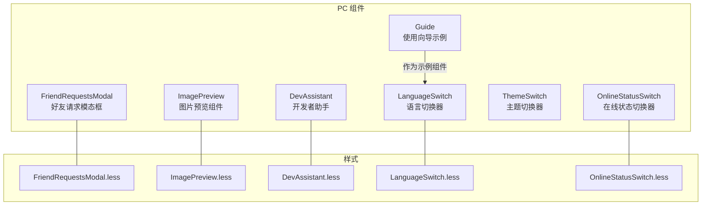
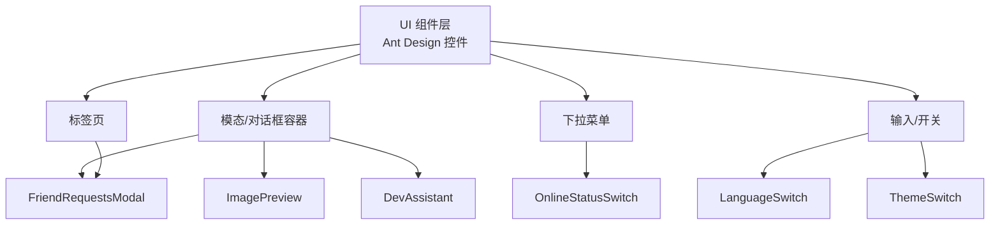
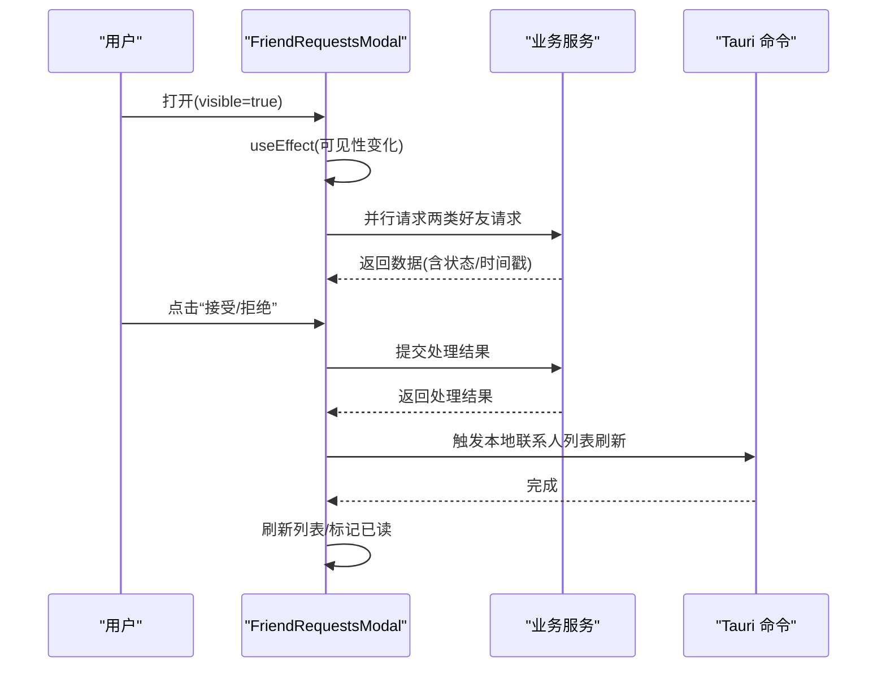
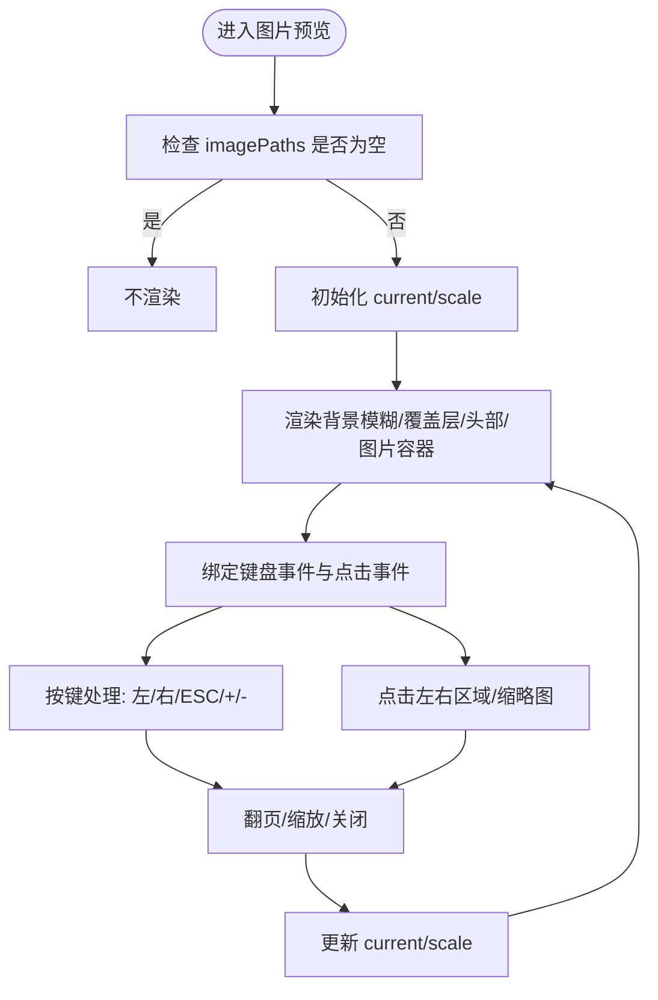
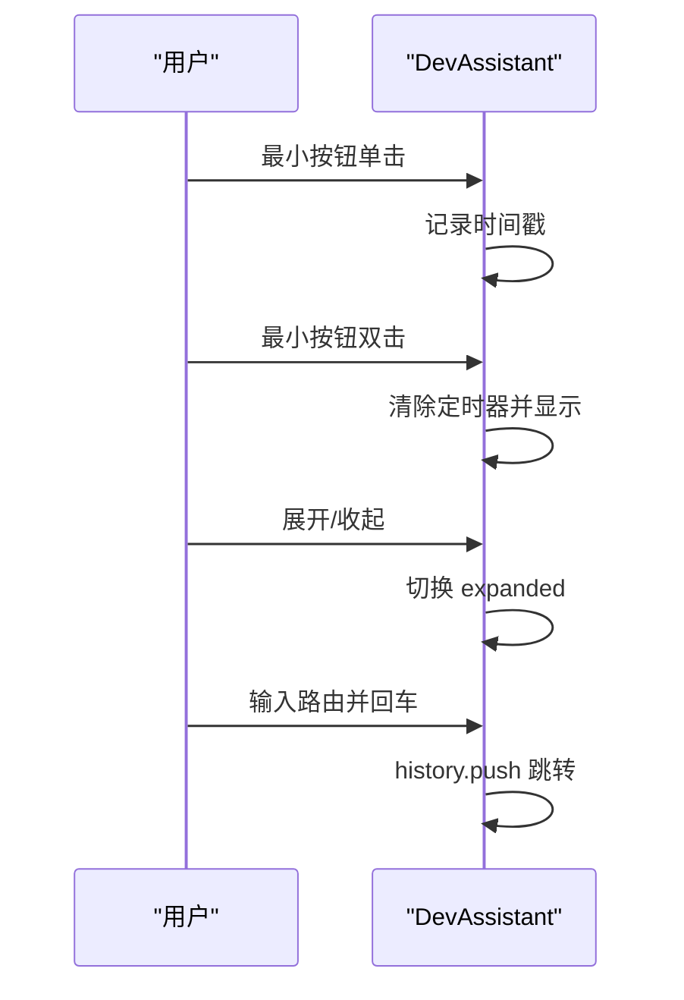
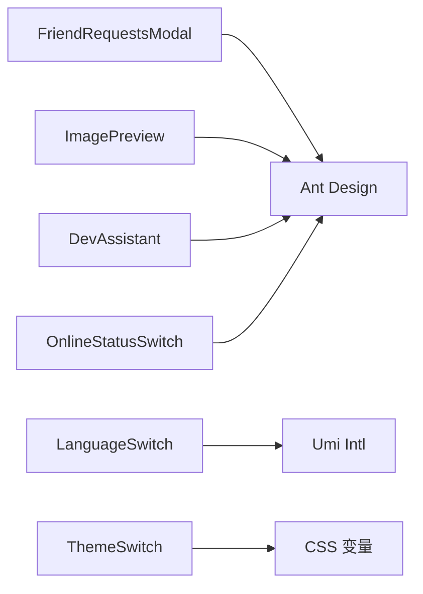

# 对话框组件

<cite>
**本文引用的文件**
- [apps/pc/src/components/FriendRequestsModal/index.tsx](file://apps/pc/src/components/FriendRequestsModal/index.tsx)
- [apps/pc/src/components/FriendRequestsModal/index.less](file://apps/pc/src/components/FriendRequestsModal/index.less)
- [apps/pc/src/components/ImagePreview/index.tsx](file://apps/pc/src/components/ImagePreview/index.tsx)
- [apps/pc/src/components/ImagePreview/index.less](file://apps/pc/src/components/ImagePreview/index.less)
- [apps/pc/src/components/DevAssistant/index.tsx](file://apps/pc/src/components/DevAssistant/index.tsx)
- [apps/pc/src/components/DevAssistant/index.less](file://apps/pc/src/components/DevAssistant/index.less)
- [apps/pc/src/components/Guide/Guide.tsx](file://apps/pc/src/components/Guide/Guide.tsx)
- [apps/pc/src/components/LanguageSwitch/index.tsx](file://apps/pc/src/components/LanguageSwitch/index.tsx)
- [apps/pc/src/components/LanguageSwitch/index.less](file://apps/pc/src/components/LanguageSwitch/index.less)
- [apps/pc/src/components/ThemeSwitch/index.tsx](file://apps/pc/src/components/ThemeSwitch/index.tsx)
- [apps/pc/src/components/OnlineStatusSwitch/index.tsx](file://apps/pc/src/components/OnlineStatusSwitch/index.tsx)
- [apps/pc/src/components/OnlineStatusSwitch/index.less](file://apps/pc/src/components/OnlineStatusSwitch/index.less)
</cite>

## 目录

1. [简介](#简介)
2. [项目结构](#项目结构)
3. [核心组件](#核心组件)
4. [架构总览](#架构总览)
5. [详细组件分析](#详细组件分析)
6. [依赖关系分析](#依赖关系分析)
7. [性能考虑](#性能考虑)
8. [故障排查指南](#故障排查指南)
9. [结论](#结论)
10. [附录](#附录)

## 简介

本文件系统性梳理应用中的“对话框与模态”相关组件，包括好友请求模态框、图片预览组件、开发者助手、使用向导、语言切换器、主题切换器与在线状态切换器。内容涵盖组件功能特性、显示/隐藏机制、遮罩层与焦点管理、配置参数、事件回调、动画效果、响应式设计、无障碍访问与用户体验优化策略，并给出组件间通信、状态同步与数据传递方法，以及开发者使用指南与自定义模态框的开发建议。

## 项目结构

本项目采用按功能分层的组织方式，PC 端页面与组件位于 apps/pc 下，其中与“对话框与模态”直接相关的组件集中在 components 子目录中；图片预览组件在 pages/ImagePreview 下也有独立入口。各组件均以独立的 TSX 文件与 LESS 样式文件组织，便于复用与维护。

图表来源

- [apps/pc/src/components/FriendRequestsModal/index.tsx:1-292](file://apps/pc/src/components/FriendRequestsModal/index.tsx#L1-L292)
- [apps/pc/src/components/ImagePreview/index.tsx:1-164](file://apps/pc/src/components/ImagePreview/index.tsx#L1-L164)
- [apps/pc/src/components/DevAssistant/index.tsx:1-174](file://apps/pc/src/components/DevAssistant/index.tsx#L1-L174)
- [apps/pc/src/components/LanguageSwitch/index.tsx:1-34](file://apps/pc/src/components/LanguageSwitch/index.tsx#L1-L34)
- [apps/pc/src/components/ThemeSwitch/index.tsx:1-24](file://apps/pc/src/components/ThemeSwitch/index.tsx#L1-L24)
- [apps/pc/src/components/OnlineStatusSwitch/index.tsx:1-87](file://apps/pc/src/components/OnlineStatusSwitch/index.tsx#L1-L87)
- [apps/pc/src/components/FriendRequestsModal/index.less:1-242](file://apps/pc/src/components/FriendRequestsModal/index.less#L1-L242)
- [apps/pc/src/components/ImagePreview/index.less:1-223](file://apps/pc/src/components/ImagePreview/index.less#L1-L223)
- [apps/pc/src/components/DevAssistant/index.less:1-86](file://apps/pc/src/components/DevAssistant/index.less#L1-L86)
- [apps/pc/src/components/LanguageSwitch/index.less:1-33](file://apps/pc/src/components/LanguageSwitch/index.less#L1-L33)
- [apps/pc/src/components/OnlineStatusSwitch/index.less:1-47](file://apps/pc/src/components/OnlineStatusSwitch/index.less#L1-L47)

章节来源

- [apps/pc/src/components/FriendRequestsModal/index.tsx:1-292](file://apps/pc/src/components/FriendRequestsModal/index.tsx#L1-L292)
- [apps/pc/src/components/ImagePreview/index.tsx:1-164](file://apps/pc/src/components/ImagePreview/index.tsx#L1-L164)
- [apps/pc/src/components/DevAssistant/index.tsx:1-174](file://apps/pc/src/components/DevAssistant/index.tsx#L1-L174)
- [apps/pc/src/components/LanguageSwitch/index.tsx:1-34](file://apps/pc/src/components/LanguageSwitch/index.tsx#L1-L34)
- [apps/pc/src/components/ThemeSwitch/index.tsx:1-24](file://apps/pc/src/components/ThemeSwitch/index.tsx#L1-L24)
- [apps/pc/src/components/OnlineStatusSwitch/index.tsx:1-87](file://apps/pc/src/components/OnlineStatusSwitch/index.tsx#L1-L87)

## 核心组件

- 好友请求模态框：用于展示与处理好友请求（接收/发送），支持标签页切换、状态徽标、操作按钮与本地状态更新。
- 图片预览组件：全屏背景模糊+覆盖层，支持缩放、翻页、键盘快捷键与缩略图导航。
- 开发者助手：可拖拽悬浮窗，支持展开/收起、快速跳转路由、双击唤醒等交互。
- 使用向导：脚手架示例组件，演示标题渲染与布局。
- 语言切换器：在本地存储中切换语言并调用框架国际化接口。
- 主题切换器：在深浅主题 JSON 中切换 CSS 变量。
- 在线状态切换器：下拉菜单切换在线状态（在线/忙碌/离开/隐身）。

章节来源

- [apps/pc/src/components/FriendRequestsModal/index.tsx:20-292](file://apps/pc/src/components/FriendRequestsModal/index.tsx#L20-L292)
- [apps/pc/src/components/ImagePreview/index.tsx:6-164](file://apps/pc/src/components/ImagePreview/index.tsx#L6-L164)
- [apps/pc/src/components/DevAssistant/index.tsx:6-174](file://apps/pc/src/components/DevAssistant/index.tsx#L6-L174)
- [apps/pc/src/components/Guide/Guide.tsx:5-24](file://apps/pc/src/components/Guide/Guide.tsx#L5-L24)
- [apps/pc/src/components/LanguageSwitch/index.tsx:5-34](file://apps/pc/src/components/LanguageSwitch/index.tsx#L5-L34)
- [apps/pc/src/components/ThemeSwitch/index.tsx:4-24](file://apps/pc/src/components/ThemeSwitch/index.tsx#L4-L24)
- [apps/pc/src/components/OnlineStatusSwitch/index.tsx:45-87](file://apps/pc/src/components/OnlineStatusSwitch/index.tsx#L45-L87)

## 架构总览

这些组件在 UI 层通过 Ant Design 的 Modal/Tabs/Dropdown 等基础控件组合实现；状态管理主要依赖 React 本地状态与浏览器本地存储；部分组件通过 Tauri invoke 或业务服务接口进行后端交互。整体呈现“轻量、可拖拽、可聚焦”的模态体验。

图表来源

- [apps/pc/src/components/FriendRequestsModal/index.tsx:277-288](file://apps/pc/src/components/FriendRequestsModal/index.tsx#L277-L288)
- [apps/pc/src/components/ImagePreview/index.tsx:61-160](file://apps/pc/src/components/ImagePreview/index.tsx#L61-L160)
- [apps/pc/src/components/DevAssistant/index.tsx:134-170](file://apps/pc/src/components/DevAssistant/index.tsx#L134-L170)
- [apps/pc/src/components/OnlineStatusSwitch/index.tsx:69-83](file://apps/pc/src/components/OnlineStatusSwitch/index.tsx#L69-L83)
- [apps/pc/src/components/LanguageSwitch/index.tsx:15-31](file://apps/pc/src/components/LanguageSwitch/index.tsx#L15-L31)
- [apps/pc/src/components/ThemeSwitch/index.tsx:4-21](file://apps/pc/src/components/ThemeSwitch/index.tsx#L4-L21)

## 详细组件分析

### 好友请求模态框

- 功能概述
  - 展示两类请求列表：我发起的、收到的；支持状态徽章与时间格式化；对“收到的且待处理”请求提供接受/拒绝操作。
  - 打开时自动拉取数据并标记通知为已读；操作成功后刷新本地列表。
- 显示/隐藏机制
  - 外部传入 visible/onClose 控制显示与关闭；内部在可见性变化时触发数据拉取。
- 遮罩层与焦点管理
  - 使用 Ant Design Modal 的默认遮罩与居中布局；footer 置空避免多余按钮；Tab 容器内滚动条与交互保持焦点在组件内。
- 配置参数
  - visible: boolean；onClose: () => void。
- 事件回调
  - onOk/onCancel 由外部传入；内部处理 accept/reject 后刷新数据。
- 动画与交互
  - Ant Design Modal 默认动画；Tab 切换与按钮 hover 效果由样式控制。
- 数据流
  - 并行请求两类请求列表；根据返回数据更新本地状态；必要时调用本地命令刷新联系人列表。
- 无障碍与响应式
  - 使用语义化标签与图标；Tab 内容区域设置最大高度并提供滚动条；移动端建议在宽度受限时调整宽度或禁用 Tab。

图表来源

- [apps/pc/src/components/FriendRequestsModal/index.tsx:32-147](file://apps/pc/src/components/FriendRequestsModal/index.tsx#L32-L147)
- [apps/pc/src/components/FriendRequestsModal/index.tsx:277-288](file://apps/pc/src/components/FriendRequestsModal/index.tsx#L277-L288)

章节来源

- [apps/pc/src/components/FriendRequestsModal/index.tsx:20-292](file://apps/pc/src/components/FriendRequestsModal/index.tsx#L20-L292)
- [apps/pc/src/components/FriendRequestsModal/index.less:1-242](file://apps/pc/src/components/FriendRequestsModal/index.less#L1-L242)

### 图片预览组件

- 功能概述
  - 支持多图浏览、缩放、左右翻页、键盘快捷键（方向键/ESC/+/-）、缩略图导航与当前计数提示。
- 显示/隐藏机制
  - 通过属性 imagePaths 控制是否渲染；当数组为空时不渲染；支持外部 onClose 回调。
- 遮罩层与焦点管理
  - 固定定位全屏容器，背景模糊与覆盖层形成遮罩；容器设置 tabIndex=0 以便接收键盘事件。
- 配置参数
  - imagePaths: string[]；currentIndex?: number；onClose?: () => void。
- 事件回调
  - onClose：关闭时回调；内部处理缩放与索引重置。
- 动画与交互
  - 缩放平滑过渡；导航按钮悬停放大、按下微缩放；缩略图高亮当前项。
- 性能与可用性
  - 使用对象模式填充以避免抖动；限制缩放范围；大图场景建议懒加载与尺寸控制。

图表来源

- [apps/pc/src/components/ImagePreview/index.tsx:43-55](file://apps/pc/src/components/ImagePreview/index.tsx#L43-L55)
- [apps/pc/src/components/ImagePreview/index.tsx:25-41](file://apps/pc/src/components/ImagePreview/index.tsx#L25-L41)
- [apps/pc/src/components/ImagePreview/index.tsx:61-160](file://apps/pc/src/components/ImagePreview/index.tsx#L61-L160)

章节来源

- [apps/pc/src/components/ImagePreview/index.tsx:6-164](file://apps/pc/src/components/ImagePreview/index.tsx#L6-L164)
- [apps/pc/src/components/ImagePreview/index.less:1-223](file://apps/pc/src/components/ImagePreview/index.less#L1-L223)

### 开发者助手

- 功能概述
  - 可拖拽悬浮窗，支持最小化/展开/收起；展开后可输入路由并回车跳转；双击最小按钮快速打开。
- 显示/隐藏机制
  - visible 控制显示/隐藏；expanded 控制展开/收起；最小按钮双击快速打开。
- 遮罩层与焦点管理
  - 固定定位，z-index 较高；容器可拖拽，避免误触输入区域。
- 配置参数
  - 无外部 props；内部通过状态控制可见性与展开状态。
- 事件回调
  - 无外部回调；内部处理键盘事件与鼠标事件。
- 交互细节
  - 拖拽节流与阈值判断；双击节流；输入框 Enter 跳转路由；最小按钮双击唤醒。

图表来源

- [apps/pc/src/components/DevAssistant/index.tsx:90-109](file://apps/pc/src/components/DevAssistant/index.tsx#L90-L109)
- [apps/pc/src/components/DevAssistant/index.tsx:156-167](file://apps/pc/src/components/DevAssistant/index.tsx#L156-L167)

章节来源

- [apps/pc/src/components/DevAssistant/index.tsx:6-174](file://apps/pc/src/components/DevAssistant/index.tsx#L6-L174)
- [apps/pc/src/components/DevAssistant/index.less:1-86](file://apps/pc/src/components/DevAssistant/index.less#L1-L86)

### 使用向导

- 功能概述
  - 示例组件，展示标题渲染与布局，适合作为新组件的脚手架模板。
- 无障碍与响应式
  - 使用语义化标题与布局组件，适配不同屏幕尺寸。

章节来源

- [apps/pc/src/components/Guide/Guide.tsx:5-24](file://apps/pc/src/components/Guide/Guide.tsx#L5-L24)

### 语言切换器

- 功能概述
  - 点击切换语言（中文/英文），写入本地存储并调用框架国际化接口。
- 无障碍与响应式
  - 文本与图标清晰，hover 有反馈；建议在移动端提供更大点击区域。

章节来源

- [apps/pc/src/components/LanguageSwitch/index.tsx:5-34](file://apps/pc/src/components/LanguageSwitch/index.tsx#L5-L34)
- [apps/pc/src/components/LanguageSwitch/index.less:1-33](file://apps/pc/src/components/LanguageSwitch/index.less#L1-L33)

### 主题切换器

- 功能概述
  - 在深浅主题 JSON 中切换 CSS 变量，实现全局主题切换。
- 无障碍与响应式
  - 点击切换，建议配合系统级暗色模式偏好检测。

章节来源

- [apps/pc/src/components/ThemeSwitch/index.tsx:4-24](file://apps/pc/src/components/ThemeSwitch/index.tsx#L4-L24)

### 在线状态切换器

- 功能概述
  - 下拉菜单切换在线状态（在线/忙碌/离开/隐身），支持图标与颜色区分。
- 无障碍与响应式
  - Tooltip 提示与下拉菜单交互良好；建议在移动端提供更宽的点击区域。

章节来源

- [apps/pc/src/components/OnlineStatusSwitch/index.tsx:45-87](file://apps/pc/src/components/OnlineStatusSwitch/index.tsx#L45-L87)
- [apps/pc/src/components/OnlineStatusSwitch/index.less:1-47](file://apps/pc/src/components/OnlineStatusSwitch/index.less#L1-L47)

## 依赖关系分析

- 组件间耦合
  - 好友请求模态框与图片预览组件均为独立 UI 组件，彼此无直接依赖。
  - 开发者助手、语言切换器、主题切换器、在线状态切换器均为工具型组件，可独立使用。
- 外部依赖
  - Ant Design Modal/Tabs/Dropdown/Input/Switch/Tooltip 等基础 UI 组件。
  - @umijs/max 国际化与历史路由能力。
  - @tauri-apps/api 用于调用本地命令（如联系人列表刷新）。
- 样式依赖
  - 各组件样式文件独立，通过变量与类名组织，避免相互污染。

图表来源

- [apps/pc/src/components/FriendRequestsModal/index.tsx:16-18](file://apps/pc/src/components/FriendRequestsModal/index.tsx#L16-L18)
- [apps/pc/src/components/ImagePreview/index.tsx:1-4](file://apps/pc/src/components/ImagePreview/index.tsx#L1-L4)
- [apps/pc/src/components/DevAssistant/index.tsx:1-4](file://apps/pc/src/components/DevAssistant/index.tsx#L1-L4)
- [apps/pc/src/components/OnlineStatusSwitch/index.tsx:7-9](file://apps/pc/src/components/OnlineStatusSwitch/index.tsx#L7-L9)
- [apps/pc/src/components/LanguageSwitch/index.tsx:1-2](file://apps/pc/src/components/LanguageSwitch/index.tsx#L1-L2)
- [apps/pc/src/components/ThemeSwitch/index.tsx:1-2](file://apps/pc/src/components/ThemeSwitch/index.tsx#L1-L2)

## 性能考虑

- 列表渲染
  - 好友请求列表使用虚拟滚动或分页可进一步优化长列表性能。
- 图片加载
  - 图片预览组件建议结合懒加载与尺寸裁剪，避免大图导致的内存压力。
- 动画与过渡
  - 控制 transform 与 opacity 的动画频率，减少主线程压力。
- 事件监听
  - 拖拽与键盘事件需在组件卸载时清理，避免内存泄漏。

## 故障排查指南

- 好友请求模态框
  - 若请求列表为空，确认网络请求与返回数据结构；检查通知标记逻辑与本地命令调用。
- 图片预览组件
  - ESC 无法关闭：检查容器是否获得焦点；键盘事件是否被其他元素拦截。
  - 缩放无效：确认 scale 状态更新与 transform 样式生效。
- 开发者助手
  - 无法拖拽：检查鼠标事件绑定与 isDragging 状态；确保未在输入区域启用拖拽。
  - 双击无效：检查节流与时间戳逻辑。
- 语言/主题切换
  - 切换后未生效：确认本地存储键值与国际化/主题注入流程。

章节来源

- [apps/pc/src/components/FriendRequestsModal/index.tsx:38-83](file://apps/pc/src/components/FriendRequestsModal/index.tsx#L38-L83)
- [apps/pc/src/components/ImagePreview/index.tsx:43-55](file://apps/pc/src/components/ImagePreview/index.tsx#L43-L55)
- [apps/pc/src/components/DevAssistant/index.tsx:36-66](file://apps/pc/src/components/DevAssistant/index.tsx#L36-L66)
- [apps/pc/src/components/LanguageSwitch/index.tsx:8-13](file://apps/pc/src/components/LanguageSwitch/index.tsx#L8-L13)
- [apps/pc/src/components/ThemeSwitch/index.tsx:5-18](file://apps/pc/src/components/ThemeSwitch/index.tsx#L5-L18)

## 结论

本项目在 PC 端提供了完善的“对话框与模态”组件体系，覆盖社交、媒体、开发辅助与系统设置等场景。组件设计遵循 Ant Design 的通用交互范式，结合本地存储与 Tauri 能力实现状态持久化与系统集成。建议在后续迭代中增强无障碍支持、统一动画时序与引入更细粒度的状态管理方案。

## 附录

- 组件使用建议
  - 对于需要外部控制显示/隐藏的场景，优先使用 visible/onClose 模式；对于工具栏组件，可采用最小化/展开的交互。
  - 模态框内嵌复杂表单时，建议拆分步骤或使用抽屉组件，降低视觉负担。
  - 为关键按钮提供明确的 ARIA 标签与键盘可达性。
- 自定义模态框开发建议
  - 明确生命周期钩子：打开时初始化数据、关闭时清理事件与缓存。
  - 统一动画时长与缓动曲线，保证视觉一致性。
  - 将样式变量集中管理，便于主题扩展与维护。
