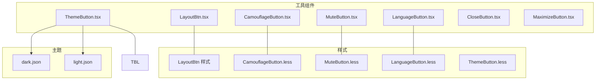
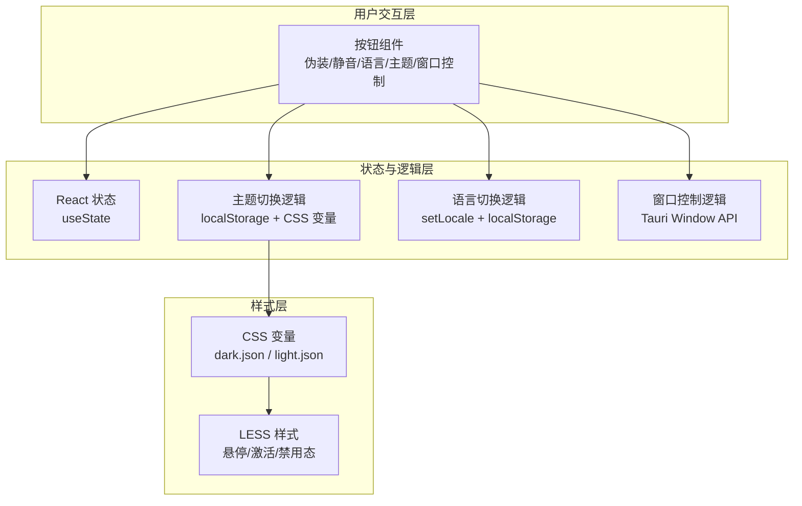
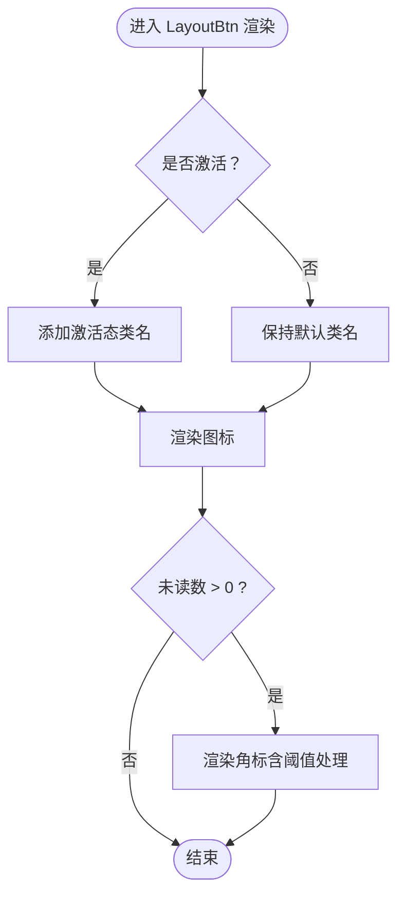
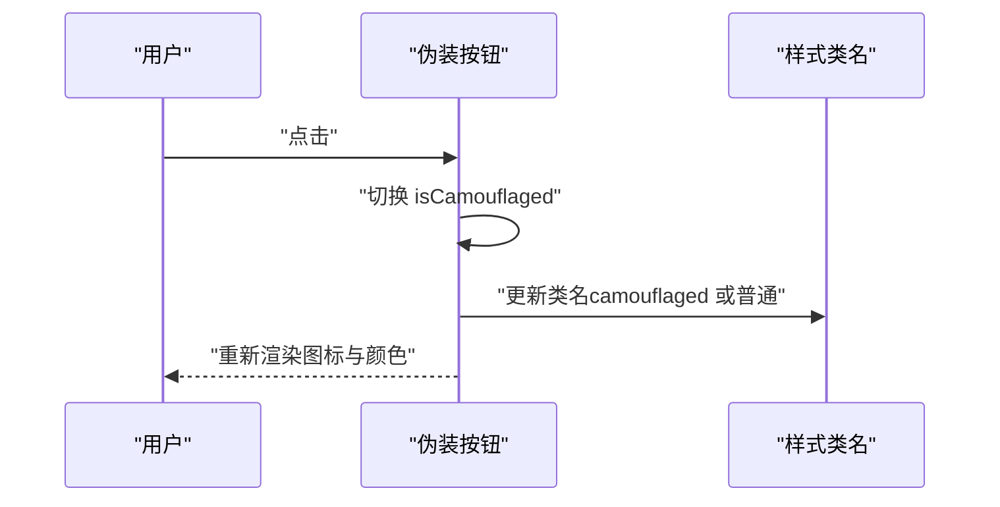
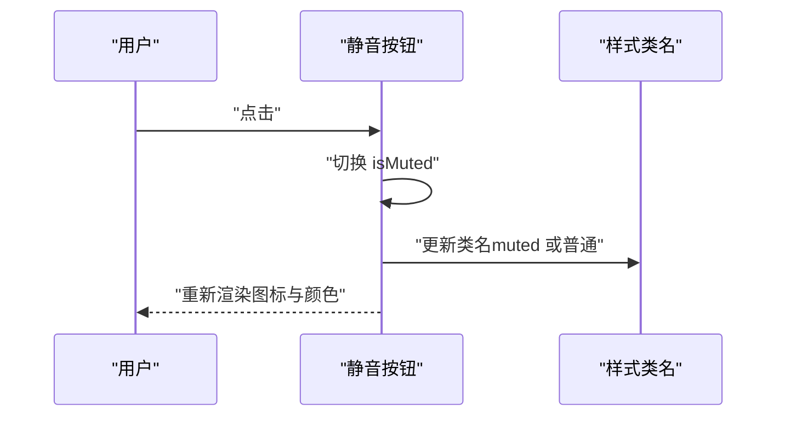
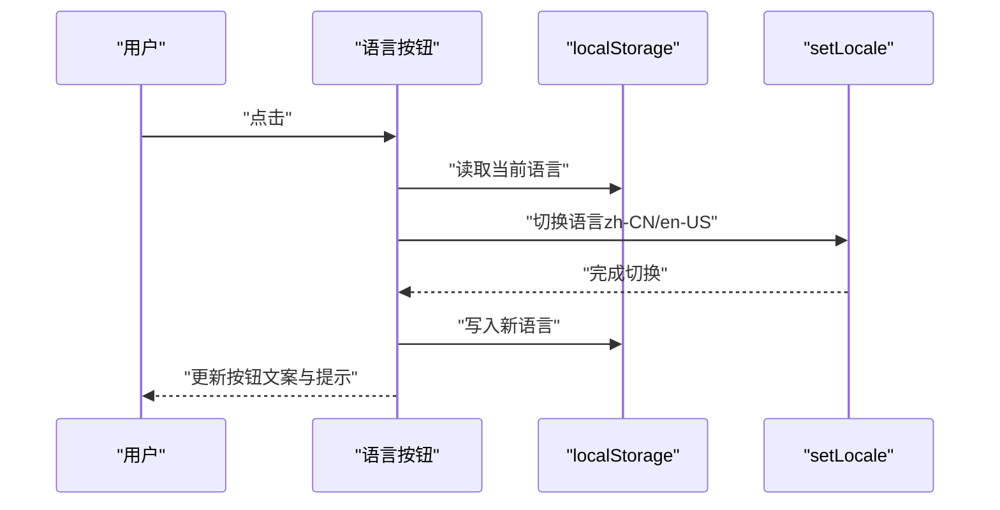
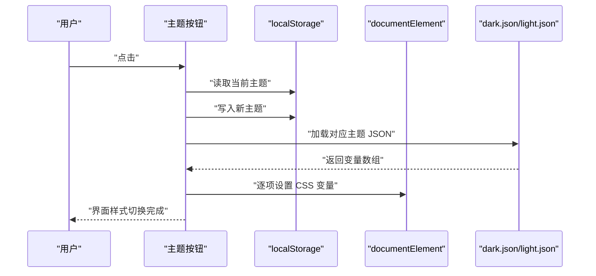
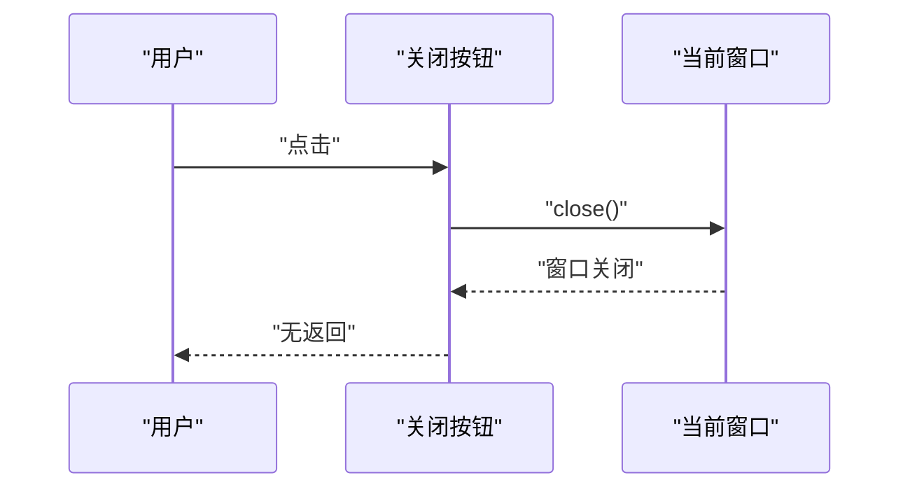
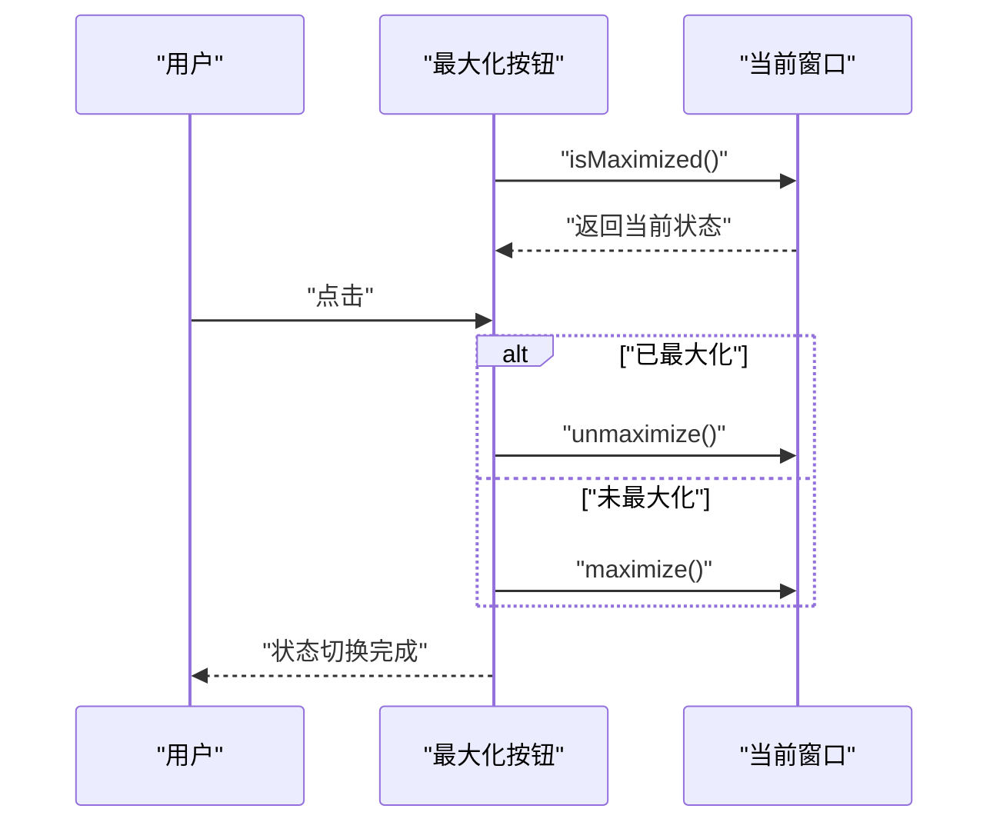
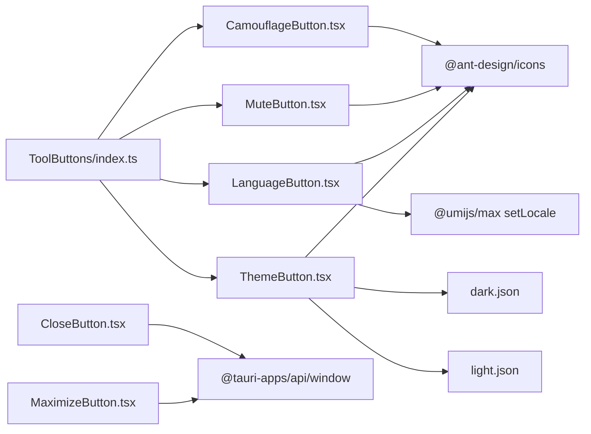

# 工具组件

<cite>
**本文引用的文件**
- [LayoutBtn.tsx](file://apps/pc/src/components/Button/LayoutBtn.tsx)
- [CamouflageButton.tsx](file://apps/pc/src/components/ToolButtons/CamouflageButton.tsx)
- [MuteButton.tsx](file://apps/pc/src/components/ToolButtons/MuteButton.tsx)
- [LanguageButton.tsx](file://apps/pc/src/components/ToolButtons/LanguageButton.tsx)
- [ThemeButton.tsx](file://apps/pc/src/components/ToolButtons/ThemeButton.tsx)
- [CloseButton.tsx](file://apps/pc/src/components/TopBar/Buttons/CloseButton.tsx)
- [MaximizeButton.tsx](file://apps/pc/src/components/TopBar/Buttons/MaximizeButton.tsx)
- [index.ts（工具按钮导出）](file://apps/pc/src/components/ToolButtons/index.ts)
- [index.less（布局按钮样式）](file://apps/pc/src/components/Button/style/index.less)
- [CamouflageButton.less](file://apps/pc/src/components/ToolButtons/CamouflageButton.less)
- [MuteButton.less](file://apps/pc/src/components/ToolButtons/MuteButton.less)
- [LanguageButton.less](file://apps/pc/src/components/ToolButtons/LanguageButton.less)
- [ThemeButton.less](file://apps/pc/src/components/ToolButtons/ThemeButton.less)
- [dark.json](file://apps/pc/src/theme/dark.json)
- [light.json](file://apps/pc/src/theme/light.json)
</cite>

## 目录

1. [简介](#简介)
2. [项目结构](#项目结构)
3. [核心组件](#核心组件)
4. [架构总览](#架构总览)
5. [详细组件分析](#详细组件分析)
6. [依赖关系分析](#依赖关系分析)
7. [性能考量](#性能考量)
8. [故障排查指南](#故障排查指南)
9. [结论](#结论)
10. [附录](#附录)

## 简介

本文件系统性梳理应用中的工具组件，重点覆盖以下方面：

- 按钮组件：布局按钮、伪装按钮、静音按钮、语言按钮、主题按钮
- 窗口控制按钮：关闭、最大化/还原
- 工具栏布局设计、交互逻辑与状态管理
- 样式定制、图标配置与响应式适配
- 主题切换机制、国际化支持与无障碍访问
- 组件组合模式、事件处理与性能优化策略
- 使用指南与扩展开发建议

## 项目结构

工具组件主要位于 PC 端前端工程 apps/pc/src/components 下，按功能域划分：

- Button：通用按钮基元与布局按钮
- ToolButtons：工具栏按钮集合（伪装、静音、语言、主题）
- TopBar/Buttons：窗口控制按钮（关闭、最大化/还原）
- theme：主题变量 JSON 文件
- 各组件均配套 LESS 样式文件

图表来源

- [LayoutBtn.tsx:1-19](file://apps/pc/src/components/Button/LayoutBtn.tsx#L1-L19)
- [CamouflageButton.tsx:1-28](file://apps/pc/src/components/ToolButtons/CamouflageButton.tsx#L1-L28)
- [MuteButton.tsx:1-26](file://apps/pc/src/components/ToolButtons/MuteButton.tsx#L1-L26)
- [LanguageButton.tsx:1-34](file://apps/pc/src/components/ToolButtons/LanguageButton.tsx#L1-L34)
- [ThemeButton.tsx:1-46](file://apps/pc/src/components/ToolButtons/ThemeButton.tsx#L1-L46)
- [CloseButton.tsx:1-22](file://apps/pc/src/components/TopBar/Buttons/CloseButton.tsx#L1-L22)
- [MaximizeButton.tsx:1-42](file://apps/pc/src/components/TopBar/Buttons/MaximizeButton.tsx#L1-L42)
- [index.less（布局按钮样式）:1-48](file://apps/pc/src/components/Button/style/index.less#L1-L48)
- [CamouflageButton.less:1-28](file://apps/pc/src/components/ToolButtons/CamouflageButton.less#L1-L28)
- [MuteButton.less:1-28](file://apps/pc/src/components/ToolButtons/MuteButton.less#L1-L28)
- [LanguageButton.less:1-20](file://apps/pc/src/components/ToolButtons/LanguageButton.less#L1-L20)
- [ThemeButton.less:1-19](file://apps/pc/src/components/ToolButtons/ThemeButton.less#L1-L19)
- [dark.json:1-51](file://apps/pc/src/theme/dark.json#L1-L51)
- [light.json:1-51](file://apps/pc/src/theme/light.json#L1-L51)

章节来源

- [LayoutBtn.tsx:1-19](file://apps/pc/src/components/Button/LayoutBtn.tsx#L1-L19)
- [CamouflageButton.tsx:1-28](file://apps/pc/src/components/ToolButtons/CamouflageButton.tsx#L1-L28)
- [MuteButton.tsx:1-26](file://apps/pc/src/components/ToolButtons/MuteButton.tsx#L1-L26)
- [LanguageButton.tsx:1-34](file://apps/pc/src/components/ToolButtons/LanguageButton.tsx#L1-L34)
- [ThemeButton.tsx:1-46](file://apps/pc/src/components/ToolButtons/ThemeButton.tsx#L1-L46)
- [CloseButton.tsx:1-22](file://apps/pc/src/components/TopBar/Buttons/CloseButton.tsx#L1-L22)
- [MaximizeButton.tsx:1-42](file://apps/pc/src/components/TopBar/Buttons/MaximizeButton.tsx#L1-L42)
- [index.ts（工具按钮导出）:1-5](file://apps/pc/src/components/ToolButtons/index.ts#L1-L5)
- [index.less（布局按钮样式）:1-48](file://apps/pc/src/components/Button/style/index.less#L1-L48)
- [CamouflageButton.less:1-28](file://apps/pc/src/components/ToolButtons/CamouflageButton.less#L1-L28)
- [MuteButton.less:1-28](file://apps/pc/src/components/ToolButtons/MuteButton.less#L1-L28)
- [LanguageButton.less:1-20](file://apps/pc/src/components/ToolButtons/LanguageButton.less#L1-L20)
- [ThemeButton.less:1-19](file://apps/pc/src/components/ToolButtons/ThemeButton.less#L1-L19)
- [dark.json:1-51](file://apps/pc/src/theme/dark.json#L1-L51)
- [light.json:1-51](file://apps/pc/src/theme/light.json#L1-L51)

## 核心组件

- 布局按钮（LayoutBtn）：用于导航或模块入口，支持“激活态”视觉反馈与未读角标展示。
- 伪装按钮（CamouflageButton）：在“伪装模式”下隐藏界面元素，切换时更新状态与样式。
- 静音按钮（MuteButton）：控制音频静音状态，切换时更新样式与提示。
- 语言按钮（LanguageButton）：在中英文之间切换，持久化到本地存储并更新 UI 文案。
- 主题按钮（ThemeButton）：在明暗主题间切换，动态写入 CSS 变量以驱动全局样式。
- 窗口控制按钮：关闭按钮（CloseButton）、最大化/还原按钮（MaximizeButton），通过 Tauri API 控制窗口行为。

章节来源

- [LayoutBtn.tsx:1-19](file://apps/pc/src/components/Button/LayoutBtn.tsx#L1-L19)
- [CamouflageButton.tsx:1-28](file://apps/pc/src/components/ToolButtons/CamouflageButton.tsx#L1-L28)
- [MuteButton.tsx:1-26](file://apps/pc/src/components/ToolButtons/MuteButton.tsx#L1-L26)
- [LanguageButton.tsx:1-34](file://apps/pc/src/components/ToolButtons/LanguageButton.tsx#L1-L34)
- [ThemeButton.tsx:1-46](file://apps/pc/src/components/ToolButtons/ThemeButton.tsx#L1-L46)
- [CloseButton.tsx:1-22](file://apps/pc/src/components/TopBar/Buttons/CloseButton.tsx#L1-L22)
- [MaximizeButton.tsx:1-42](file://apps/pc/src/components/TopBar/Buttons/MaximizeButton.tsx#L1-L42)

## 架构总览

工具组件采用“轻状态、高复用”的设计原则：

- 状态集中于组件内部，通过 useState 管理布尔值或当前语言/主题标识。
- 通过 Tooltip 提供无障碍提示；点击事件触发副作用（如切换主题、设置语言、调用 Tauri 窗口 API）。
- 主题切换通过读取主题 JSON 并向 documentElement 写入 CSS 变量，实现全局样式变更。
- 国际化切换通过 @umijs/max 的 setLocale 与 localStorage 协同工作。

图表来源

- [ThemeButton.tsx:1-46](file://apps/pc/src/components/ToolButtons/ThemeButton.tsx#L1-L46)
- [LanguageButton.tsx:1-34](file://apps/pc/src/components/ToolButtons/LanguageButton.tsx#L1-L34)
- [CloseButton.tsx:1-22](file://apps/pc/src/components/TopBar/Buttons/CloseButton.tsx#L1-L22)
- [MaximizeButton.tsx:1-42](file://apps/pc/src/components/TopBar/Buttons/MaximizeButton.tsx#L1-L42)
- [dark.json:1-51](file://apps/pc/src/theme/dark.json#L1-L51)
- [light.json:1-51](file://apps/pc/src/theme/light.json#L1-L51)

## 详细组件分析

### 布局按钮（LayoutBtn）

- 功能要点
  - 接收图标、激活态与未读数参数，渲染容器与角标。
  - 未读数大于 0 时显示角标，超过阈值显示聚合值。
- 样式与可定制性
  - 支持激活态高亮与悬停效果，角标位置绝对定位，适配不同尺寸。
- 适用场景
  - 导航项、模块入口、通知入口等。

图表来源

- [LayoutBtn.tsx:1-19](file://apps/pc/src/components/Button/LayoutBtn.tsx#L1-L19)
- [index.less（布局按钮样式）:1-48](file://apps/pc/src/components/Button/style/index.less#L1-L48)

章节来源

- [LayoutBtn.tsx:1-19](file://apps/pc/src/components/Button/LayoutBtn.tsx#L1-L19)
- [index.less（布局按钮样式）:1-48](file://apps/pc/src/components/Button/style/index.less#L1-L48)

### 伪装按钮（CamouflageButton）

- 功能要点
  - 切换“伪装模式”，根据状态改变图标与颜色。
  - Tooltip 提示文案随状态变化。
- 状态管理
  - 内部状态 isCamouflaged 控制样式与图标。
- 可访问性
  - 使用 Tooltip 提供提示文本，便于键盘与屏幕阅读器识别。

图表来源

- [CamouflageButton.tsx:1-28](file://apps/pc/src/components/ToolButtons/CamouflageButton.tsx#L1-L28)
- [CamouflageButton.less:1-28](file://apps/pc/src/components/ToolButtons/CamouflageButton.less#L1-L28)

章节来源

- [CamouflageButton.tsx:1-28](file://apps/pc/src/components/ToolButtons/CamouflageButton.tsx#L1-L28)
- [CamouflageButton.less:1-28](file://apps/pc/src/components/ToolButtons/CamouflageButton.less#L1-L28)

### 静音按钮（MuteButton）

- 功能要点
  - 切换静音状态，更新图标与颜色。
  - Tooltip 提示文案随状态变化。
- 状态管理
  - 内部状态 isMuted 控制样式与图标。

图表来源

- [MuteButton.tsx:1-26](file://apps/pc/src/components/ToolButtons/MuteButton.tsx#L1-L26)
- [MuteButton.less:1-28](file://apps/pc/src/components/ToolButtons/MuteButton.less#L1-L28)

章节来源

- [MuteButton.tsx:1-26](file://apps/pc/src/components/ToolButtons/MuteButton.tsx#L1-L26)
- [MuteButton.less:1-28](file://apps/pc/src/components/ToolButtons/MuteButton.less#L1-L28)

### 语言按钮（LanguageButton）

- 功能要点
  - 在中英文之间切换，使用 setLocale 更新应用语言，同时写入 localStorage。
  - Tooltip 提示文案随当前语言变化。
- 状态管理
  - 从 localStorage 初始化当前语言，内部状态 isEnglish 控制 UI 文案。
- 国际化集成
  - 依赖 @umijs/max 的 setLocale；语言键值与应用路由语言包一致。

图表来源

- [LanguageButton.tsx:1-34](file://apps/pc/src/components/ToolButtons/LanguageButton.tsx#L1-L34)
- [LanguageButton.less:1-20](file://apps/pc/src/components/ToolButtons/LanguageButton.less#L1-L20)

章节来源

- [LanguageButton.tsx:1-34](file://apps/pc/src/components/ToolButtons/LanguageButton.tsx#L1-L34)
- [LanguageButton.less:1-20](file://apps/pc/src/components/ToolButtons/LanguageButton.less#L1-L20)

### 主题按钮（ThemeButton）

- 功能要点
  - 在明/暗主题间切换，持久化到 localStorage，并向 documentElement 写入 CSS 变量。
  - Tooltip 提示文案随当前主题变化。
- 主题机制
  - 读取 dark.json 或 light.json，遍历键值对写入 CSS 变量，驱动全局样式。
- 可扩展性
  - 新增主题只需新增 JSON 并在切换逻辑中选择对应对象。

图表来源

- [ThemeButton.tsx:1-46](file://apps/pc/src/components/ToolButtons/ThemeButton.tsx#L1-L46)
- [dark.json:1-51](file://apps/pc/src/theme/dark.json#L1-L51)
- [light.json:1-51](file://apps/pc/src/theme/light.json#L1-L51)
- [ThemeButton.less:1-19](file://apps/pc/src/components/ToolButtons/ThemeButton.less#L1-L19)

章节来源

- [ThemeButton.tsx:1-46](file://apps/pc/src/components/ToolButtons/ThemeButton.tsx#L1-L46)
- [dark.json:1-51](file://apps/pc/src/theme/dark.json#L1-L51)
- [light.json:1-51](file://apps/pc/src/theme/light.json#L1-L51)
- [ThemeButton.less:1-19](file://apps/pc/src/components/ToolButtons/ThemeButton.less#L1-L19)

### 窗口控制按钮（关闭/最大化）

- 关闭按钮（CloseButton）
  - 调用 Tauri Window API 关闭当前窗口。
- 最大化按钮（MaximizeButton）
  - 首次渲染时检查窗口是否已最大化；点击时在最大化与还原之间切换。
  - 使用 Tooltip 提示当前状态。

图表来源

- [CloseButton.tsx:1-22](file://apps/pc/src/components/TopBar/Buttons/CloseButton.tsx#L1-L22)

图表来源

- [MaximizeButton.tsx:1-42](file://apps/pc/src/components/TopBar/Buttons/MaximizeButton.tsx#L1-L42)

章节来源

- [CloseButton.tsx:1-22](file://apps/pc/src/components/TopBar/Buttons/CloseButton.tsx#L1-L22)
- [MaximizeButton.tsx:1-42](file://apps/pc/src/components/TopBar/Buttons/MaximizeButton.tsx#L1-L42)

## 依赖关系分析

- 组件导出
  - 工具按钮统一通过 ToolButtons/index.ts 导出，便于上层按需引入。
- 外部依赖
  - Ant Design 图标库提供图标资源。
  - Ant Design Tooltip 提供无障碍提示。
  - @umijs/max 提供国际化切换能力。
  - @tauri-apps/api/window 提供窗口控制能力。
- 主题依赖
  - ThemeButton 依赖 dark.json 与 light.json 中的 CSS 变量清单。

图表来源

- [index.ts（工具按钮导出）:1-5](file://apps/pc/src/components/ToolButtons/index.ts#L1-L5)
- [ThemeButton.tsx:1-46](file://apps/pc/src/components/ToolButtons/ThemeButton.tsx#L1-L46)
- [LanguageButton.tsx:1-34](file://apps/pc/src/components/ToolButtons/LanguageButton.tsx#L1-L34)
- [CloseButton.tsx:1-22](file://apps/pc/src/components/TopBar/Buttons/CloseButton.tsx#L1-L22)
- [MaximizeButton.tsx:1-42](file://apps/pc/src/components/TopBar/Buttons/MaximizeButton.tsx#L1-L42)

章节来源

- [index.ts（工具按钮导出）:1-5](file://apps/pc/src/components/ToolButtons/index.ts#L1-L5)
- [ThemeButton.tsx:1-46](file://apps/pc/src/components/ToolButtons/ThemeButton.tsx#L1-L46)
- [LanguageButton.tsx:1-34](file://apps/pc/src/components/ToolButtons/LanguageButton.tsx#L1-L34)
- [CloseButton.tsx:1-22](file://apps/pc/src/components/TopBar/Buttons/CloseButton.tsx#L1-L22)
- [MaximizeButton.tsx:1-42](file://apps/pc/src/components/TopBar/Buttons/MaximizeButton.tsx#L1-L42)

## 性能考量

- 状态粒度
  - 工具按钮普遍采用单点状态（布尔值/字符串），避免深层嵌套状态，降低重渲染成本。
- 样式切换
  - 主题切换通过一次性写入 CSS 变量，避免频繁 DOM 重排；建议仅在主题切换时触发，减少不必要刷新。
- 事件绑定
  - 图标按钮事件绑定在容器上，避免重复绑定与内存泄漏；Tooltip 作为轻量提示，不影响主流程。
- 国际化与本地存储
  - 语言切换与主题切换均使用 localStorage 缓存，避免每次启动都进行复杂计算。
- 建议
  - 对高频切换的按钮（如静音/伪装）可考虑节流或防抖，减少状态抖动。
  - 将样式变量集中管理，避免散落的内联样式影响缓存命中。

## 故障排查指南

- 主题切换无效
  - 检查 localStorage 中的主题键值是否正确写入。
  - 确认 dark.json/light.json 的键名与 CSS 变量一致。
  - 确保 documentElement 上存在对应的 CSS 变量。
- 语言切换未生效
  - 检查 setLocale 是否被调用且语言键值正确。
  - 确认 localStorage 中的语言键值与 setLocale 传参一致。
- 窗口控制按钮无响应
  - 检查 Tauri 权限与窗口 API 可用性。
  - 确认按钮点击事件绑定正常。
- 角标显示异常
  - 检查未读数传入逻辑与阈值处理。
  - 确认样式定位与层级关系。

章节来源

- [ThemeButton.tsx:1-46](file://apps/pc/src/components/ToolButtons/ThemeButton.tsx#L1-L46)
- [LanguageButton.tsx:1-34](file://apps/pc/src/components/ToolButtons/LanguageButton.tsx#L1-L34)
- [CloseButton.tsx:1-22](file://apps/pc/src/components/TopBar/Buttons/CloseButton.tsx#L1-L22)
- [MaximizeButton.tsx:1-42](file://apps/pc/src/components/TopBar/Buttons/MaximizeButton.tsx#L1-L42)
- [LayoutBtn.tsx:1-19](file://apps/pc/src/components/Button/LayoutBtn.tsx#L1-L19)

## 结论

工具组件以简洁的状态管理与明确的职责边界实现了高复用与易维护性。通过 CSS 变量与 JSON 主题清单，主题切换具备良好的可扩展性；国际化与窗口控制分别对接 Umi 与 Tauri，形成完整的桌面端体验闭环。建议在后续迭代中进一步完善事件节流、样式缓存与可访问性标签，持续提升性能与可用性。

## 附录

- 使用指南
  - 引入工具按钮：通过 ToolButtons/index.ts 导出统一引入。
  - 自定义图标：替换 Ant Design 图标或使用自定义 SVG。
  - 定制样式：修改对应 less 文件或覆盖 CSS 变量。
  - 响应式适配：结合容器宽度与布局，调整按钮尺寸与间距。
- 扩展开发建议
  - 新增按钮：遵循现有状态与样式模式，确保 Tooltip 提示完整。
  - 新增主题：新增 JSON 并在切换逻辑中选择，保证键名一致。
  - 国际化扩展：在语言包中补充文案，保持语言按钮文案与实际语言一致。
  - 无障碍增强：为按钮添加 aria-label 或 role，提升可访问性。
