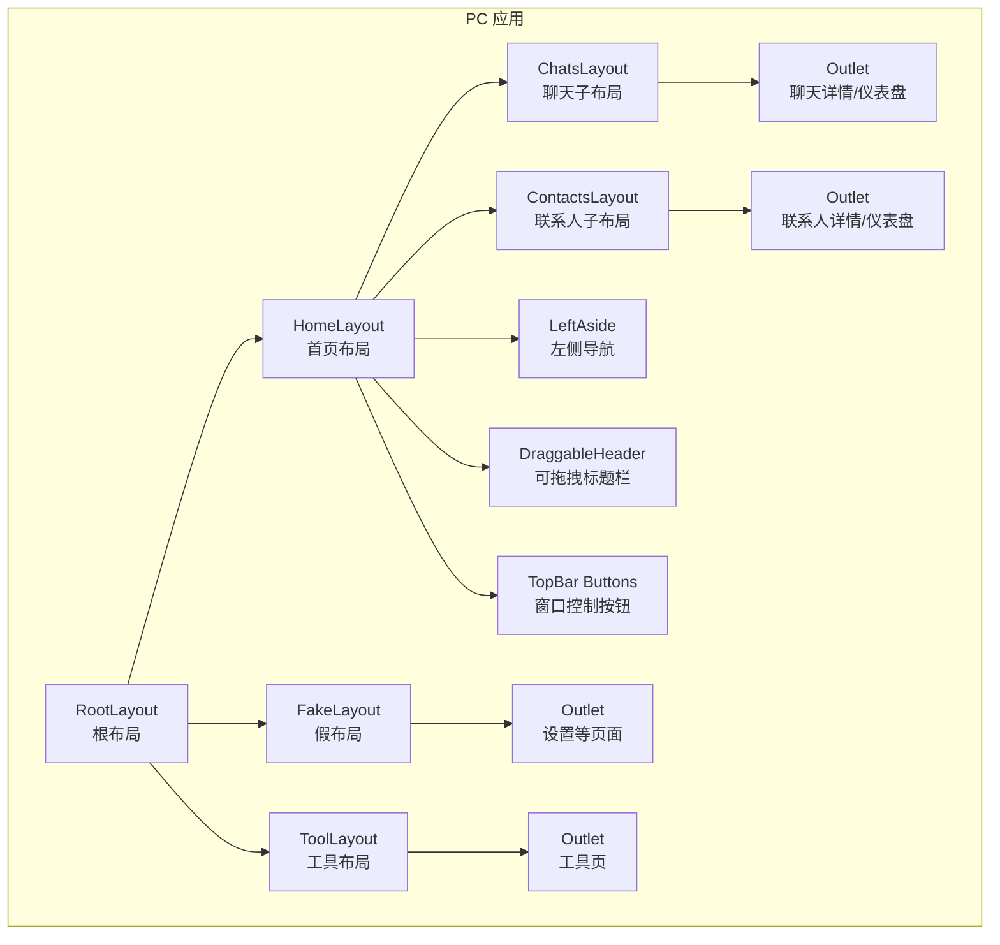
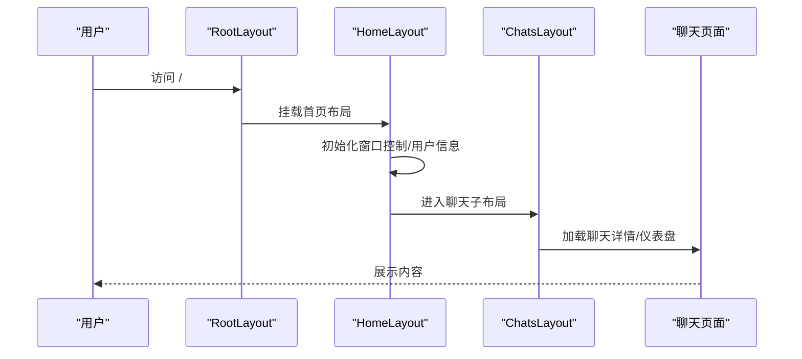
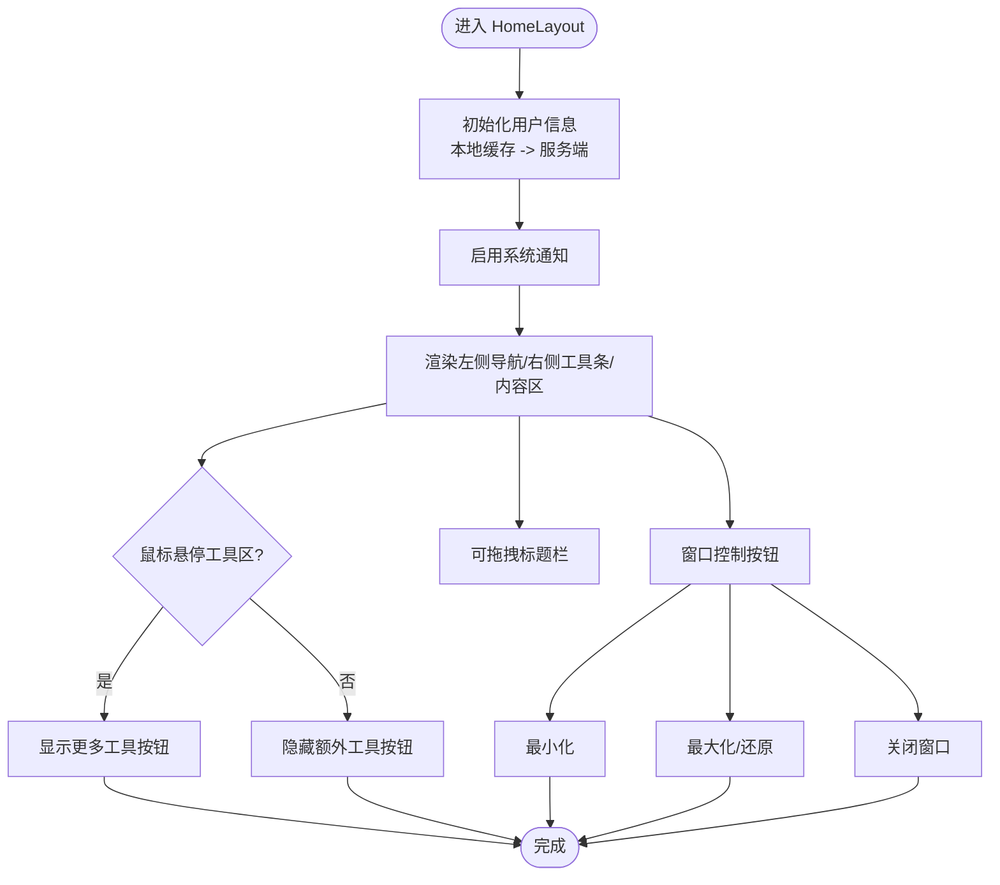
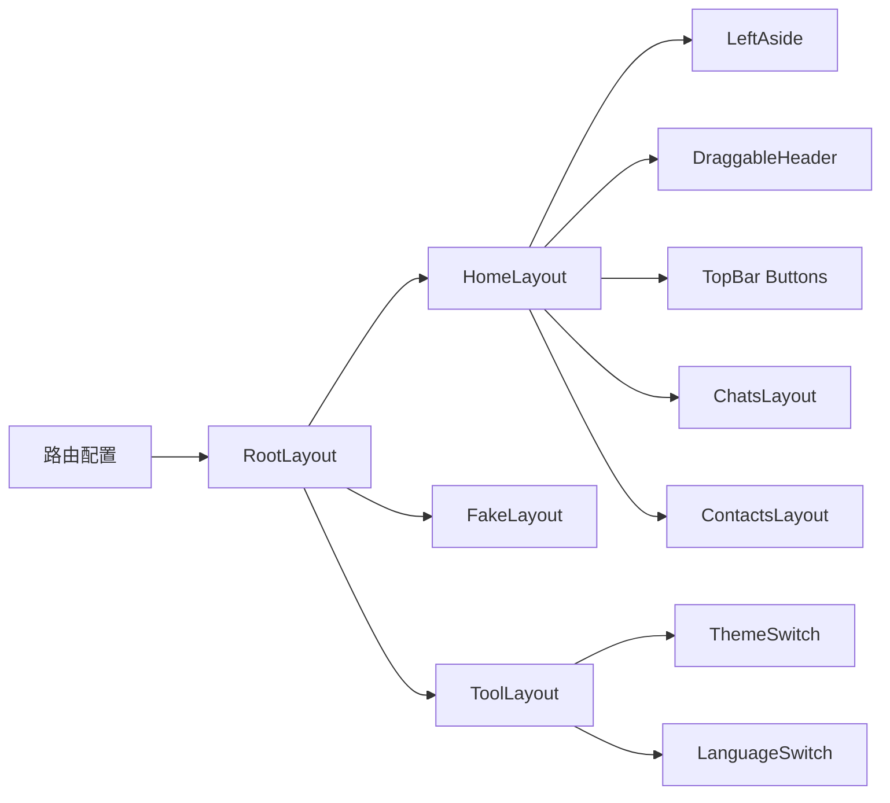

# 布局组件

<cite>
**本文引用的文件**
- [RootLayout.tsx](file://apps/pc/src/layouts/RootLayout.tsx)
- [RootLayout.less](file://apps/pc/src/layouts/styles/RootLayout.less)
- [HomeLayout/index.tsx](file://apps/pc/src/layouts/HomeLayout/index.tsx)
- [HomeLayout/index.less](file://apps/pc/src/layouts/HomeLayout/index.less)
- [FakeLayout/index.tsx](file://apps/pc/src/layouts/FakeLayout/index.tsx)
- [FakeLayout/index.less](file://apps/pc/src/layouts/FakeLayout/index.less)
- [ToolLayout.tsx](file://apps/pc/src/layouts/ToolLayout.tsx)
- [ChatsLayout/index.tsx](file://apps/pc/src/layouts/HomeLayout/ChatsLayout/index.tsx)
- [ContactsLayout/index.tsx](file://apps/pc/src/layouts/HomeLayout/ContactsLayout/index.tsx)
- [LeftAside/index.tsx](file://apps/pc/src/components/LeftAside/index.tsx)
- [DraggableHeader/index.tsx](file://apps/pc/src/components/DraggableHeader/index.tsx)
- [TopBar/Buttons/CloseButton.tsx](file://apps/pc/src/components/TopBar/Buttons/CloseButton.tsx)
- [route/index.ts](file://apps/pc/src/route/index.ts)
- [ThemeSwitch/index.tsx](file://apps/pc/src/components/ThemeSwitch/index.tsx)
- [LanguageSwitch/index.tsx](file://apps/pc/src/components/LanguageSwitch/index.tsx)
- [dark.json](file://apps/pc/src/theme/dark.json)
- [light.json](file://apps/pc/src/theme/light.json)
</cite>

## 目录
1. [简介](#简介)
2. [项目结构](#项目结构)
3. [核心组件](#核心组件)
4. [架构总览](#架构总览)
5. [详细组件分析](#详细组件分析)
6. [依赖分析](#依赖分析)
7. [性能考虑](#性能考虑)
8. [故障排查指南](#故障排查指南)
9. [结论](#结论)
10. [附录](#附录)

## 简介
本文件系统性梳理应用的布局体系，覆盖根布局、首页布局、假布局与工具布局的设计理念与实现方式；解释布局容器的嵌套关系、响应式与屏幕适配策略；给出布局配置选项、区域划分与内容管理要点；详述导航栏、侧边栏、主内容区与状态栏的布局设计；并提供布局切换机制、状态保持与性能优化建议，帮助开发者快速上手与定制扩展。

## 项目结构
- 布局层位于 PC 应用的布局目录，采用“根布局 + 主布局 + 子布局 + 页面”的分层组织。
- 根布局负责全局出口与辅助组件挂载；主布局承载窗口控制、侧栏与主内容区；子布局在主布局内进一步拆分左右区域；页面作为 Outlet 内容呈现具体业务。
- 路由配置集中于路由文件，明确各布局的挂载点与嵌套层级。

图表来源
- [route/index.ts:1-137](file://apps/pc/src/route/index.ts#L1-L137)
- [RootLayout.tsx:1-19](file://apps/pc/src/layouts/RootLayout.tsx#L1-L19)
- [HomeLayout/index.tsx:1-214](file://apps/pc/src/layouts/HomeLayout/index.tsx#L1-L214)
- [FakeLayout/index.tsx:1-147](file://apps/pc/src/layouts/FakeLayout/index.tsx#L1-L147)
- [ToolLayout.tsx:1-23](file://apps/pc/src/layouts/ToolLayout.tsx#L1-L23)
- [ChatsLayout/index.tsx:1-155](file://apps/pc/src/layouts/HomeLayout/ChatsLayout/index.tsx#L1-L155)
- [ContactsLayout/index.tsx:1-31](file://apps/pc/src/layouts/HomeLayout/ContactsLayout/index.tsx#L1-L31)

章节来源
- [route/index.ts:1-137](file://apps/pc/src/route/index.ts#L1-L137)

## 核心组件
- 根布局 RootLayout：统一容器与全局 Outlet，注入开发助手等全局能力。
- 首页布局 HomeLayout：窗口控制（最小化/最大化/关闭）、左侧导航、右侧工具条与主内容区。
- 假布局 FakeLayout：用于演示或特定场景下的简化布局，保留窗口控制与可拖拽标题栏。
- 工具布局 ToolLayout：提供主题与语言切换入口，便于在工具页中快速切换。
- 子布局 ChatsLayout/ContactsLayout：在主布局内以分割面板形式组织左侧列表与右侧 Outlet。
- 左侧导航 LeftAside：聚合菜单、未读计数、用户信息弹窗与路由联动。
- 可拖拽标题栏 DraggableHeader：跨平台窗口拖拽支持。
- 窗口控制按钮 TopBar Buttons：最小化、最大化/还原、关闭等。

章节来源
- [RootLayout.tsx:1-19](file://apps/pc/src/layouts/RootLayout.tsx#L1-L19)
- [HomeLayout/index.tsx:1-214](file://apps/pc/src/layouts/HomeLayout/index.tsx#L1-L214)
- [FakeLayout/index.tsx:1-147](file://apps/pc/src/layouts/FakeLayout/index.tsx#L1-L147)
- [ToolLayout.tsx:1-23](file://apps/pc/src/layouts/ToolLayout.tsx#L1-L23)
- [ChatsLayout/index.tsx:1-155](file://apps/pc/src/layouts/HomeLayout/ChatsLayout/index.tsx#L1-L155)
- [ContactsLayout/index.tsx:1-31](file://apps/pc/src/layouts/HomeLayout/ContactsLayout/index.tsx#L1-L31)
- [LeftAside/index.tsx:1-197](file://apps/pc/src/components/LeftAside/index.tsx#L1-L197)
- [DraggableHeader/index.tsx:1-30](file://apps/pc/src/components/DraggableHeader/index.tsx#L1-L30)
- [TopBar/Buttons/CloseButton.tsx:1-22](file://apps/pc/src/components/TopBar/Buttons/CloseButton.tsx#L1-L22)

## 架构总览
- 布局嵌套遵循“根 -> 首页/假 -> 子布局 -> 页面”的层次，通过 Outlet 实现逐层下钻。
- 首页布局内部采用左右分区：左侧固定宽度导航，右侧为工具条+内容区；子布局进一步在右侧区域内以分割面板组织列表与详情。
- 窗口控制与可拖拽标题栏贯穿首页与假布局，保证一致的桌面端交互体验。

图表来源
- [route/index.ts:1-137](file://apps/pc/src/route/index.ts#L1-L137)
- [RootLayout.tsx:1-19](file://apps/pc/src/layouts/RootLayout.tsx#L1-L19)
- [HomeLayout/index.tsx:1-214](file://apps/pc/src/layouts/HomeLayout/index.tsx#L1-L214)
- [ChatsLayout/index.tsx:1-155](file://apps/pc/src/layouts/HomeLayout/ChatsLayout/index.tsx#L1-L155)

## 详细组件分析

### 根布局 RootLayout
- 设计理念：作为全局容器，承载 Outlet 与全局辅助组件，确保顶层一致的渲染结构。
- 实现要点：
  - 使用 Outlet 渲染下层布局。
  - 引入开发助手组件，便于调试与提示。
  - 容器样式保证全屏占位。
- 适用场景：所有需要统一根容器的页面或布局。

章节来源
- [RootLayout.tsx:1-19](file://apps/pc/src/layouts/RootLayout.tsx#L1-L19)
- [RootLayout.less:1-7](file://apps/pc/src/layouts/styles/RootLayout.less#L1-L7)

### 首页布局 HomeLayout
- 设计理念：提供桌面端窗口控制、左侧导航与右侧工具条+内容区的完整工作区。
- 区域划分：
  - 左侧固定宽度导航：承载菜单与用户信息。
  - 右侧工具条：在线状态、静音、伪装模式、语言、主题等工具按钮；悬停显示更多工具。
  - 右侧内容区：Outlet 承载子布局与页面。
  - 顶部可拖拽区域：支持窗口拖拽。
  - 窗口控制按钮：最小化、最大化/还原、关闭。
- 用户信息初始化：优先从本地缓存读取，失败则请求服务端接口，并写入缓存。
- 系统通知：基于用户标识启用系统通知。
- 响应式与屏幕适配：右侧工具条采用 Flex 布局，工具按钮根据悬停状态动态显示；内容区高度通过计算属性自适应。

图表来源
- [HomeLayout/index.tsx:1-214](file://apps/pc/src/layouts/HomeLayout/index.tsx#L1-L214)
- [HomeLayout/index.less:1-84](file://apps/pc/src/layouts/HomeLayout/index.less#L1-L84)
- [LeftAside/index.tsx:1-197](file://apps/pc/src/components/LeftAside/index.tsx#L1-L197)
- [DraggableHeader/index.tsx:1-30](file://apps/pc/src/components/DraggableHeader/index.tsx#L1-L30)
- [TopBar/Buttons/CloseButton.tsx:1-22](file://apps/pc/src/components/TopBar/Buttons/CloseButton.tsx#L1-L22)

章节来源
- [HomeLayout/index.tsx:1-214](file://apps/pc/src/layouts/HomeLayout/index.tsx#L1-L214)
- [HomeLayout/index.less:1-84](file://apps/pc/src/layouts/HomeLayout/index.less#L1-L84)

### 假布局 FakeLayout
- 设计理念：简化版首页布局，适合演示或特定场景，保留窗口控制与可拖拽标题栏。
- 区域划分：左侧工具区（包含伪装按钮等），右侧内容区承载 Outlet。
- 与首页布局差异：无左侧导航，工具区更精简；适合非主工作区页面。

章节来源
- [FakeLayout/index.tsx:1-147](file://apps/pc/src/layouts/FakeLayout/index.tsx#L1-L147)
- [FakeLayout/index.less:1-78](file://apps/pc/src/layouts/FakeLayout/index.less#L1-L78)

### 工具布局 ToolLayout
- 设计理念：在工具页中提供主题与语言切换入口，便于快速切换。
- 实现要点：顶部放置主题与语言切换按钮，下方为 Outlet。

章节来源
- [ToolLayout.tsx:1-23](file://apps/pc/src/layouts/ToolLayout.tsx#L1-L23)

### 子布局：ChatsLayout
- 设计理念：在首页布局右侧区域，以分割面板组织左侧聊天会话列表与右侧 Outlet。
- 功能要点：
  - 左侧面板：搜索框 + 会话列表项，点击跳转至聊天详情。
  - 右侧面板：Outlet 承载聊天详情/仪表盘。
  - 数据流：通过消息会话事件更新列表，支持未读计数累加与排序。
- 性能：列表更新采用不可变更新策略，避免不必要的重渲染。

章节来源
- [ChatsLayout/index.tsx:1-155](file://apps/pc/src/layouts/HomeLayout/ChatsLayout/index.tsx#L1-L155)

### 子布局：ContactsLayout
- 设计理念：与聊天子布局类似，左侧为搜索框与好友列表，右侧为 Outlet。
- 适用场景：联系人管理、好友详情等页面。

章节来源
- [ContactsLayout/index.tsx:1-31](file://apps/pc/src/layouts/HomeLayout/ContactsLayout/index.tsx#L1-L31)

### 左侧导航 LeftAside
- 设计理念：聚合菜单、未读计数与用户信息，支持路由联动与弹窗展示。
- 功能要点：
  - 顶部菜单：会话列表、朋友列表，带未读计数。
  - 底部菜单：设置。
  - 用户信息：点击头像打开用户信息弹窗。
  - 路由联动：监听路由变化，自动更新激活态。
  - 资源清理：组件卸载时回收临时 URL。
- 与 Store 的集成：通过全局状态管理维护菜单未读与用户信息。

章节来源
- [LeftAside/index.tsx:1-197](file://apps/pc/src/components/LeftAside/index.tsx#L1-L197)

### 可拖拽标题栏 DraggableHeader
- 设计理念：提供跨平台窗口拖拽能力，提升用户体验。
- 实现要点：在标题栏区域绑定鼠标按下事件，触发窗口拖拽。

章节来源
- [DraggableHeader/index.tsx:1-30](file://apps/pc/src/components/DraggableHeader/index.tsx#L1-L30)

### 窗口控制按钮 TopBar Buttons
- 设计理念：提供最小化、最大化/还原、关闭等窗口控制操作。
- 实现要点：调用窗口 API 执行对应操作。

章节来源
- [TopBar/Buttons/CloseButton.tsx:1-22](file://apps/pc/src/components/TopBar/Buttons/CloseButton.tsx#L1-L22)

## 依赖分析
- 路由到布局的映射：路由文件定义了根布局与各子布局的挂载点与嵌套关系。
- 布局到组件的依赖：首页布局依赖左侧导航、可拖拽标题栏与窗口控制按钮；子布局依赖分割面板与 Outlet。
- 主题与语言：工具布局依赖主题与语言切换组件；主题切换通过 JSON 配置动态设置 CSS 变量。

图表来源
- [route/index.ts:1-137](file://apps/pc/src/route/index.ts#L1-L137)
- [ToolLayout.tsx:1-23](file://apps/pc/src/layouts/ToolLayout.tsx#L1-L23)
- [ThemeSwitch/index.tsx:1-24](file://apps/pc/src/components/ThemeSwitch/index.tsx#L1-L24)
- [LanguageSwitch/index.tsx:1-34](file://apps/pc/src/components/LanguageSwitch/index.tsx#L1-L34)

章节来源
- [route/index.ts:1-137](file://apps/pc/src/route/index.ts#L1-L137)

## 性能考虑
- 不可变更新：子布局对列表数据采用不可变更新策略，减少重复渲染。
- 资源清理：左侧导航在组件卸载时回收临时 URL，避免内存泄漏。
- 事件监听：路由联动仅在必要时注册与清理，降低副作用。
- 样式变量：主题切换通过 CSS 变量批量更新，避免重排与重绘抖动。
- 窗口控制：最小化/最大化/关闭等操作直接调用窗口 API，避免复杂逻辑开销。

## 故障排查指南
- 用户信息未加载：
  - 检查本地缓存键值是否存在与匹配；若失败，确认服务端接口可用性与网络状态。
  - 参考路径：[HomeLayout/index.tsx:80-115](file://apps/pc/src/layouts/HomeLayout/index.tsx#L80-L115)
- 窗口无法拖拽：
  - 确认可拖拽标题栏是否正确挂载且未被遮挡；检查鼠标事件绑定。
  - 参考路径：[DraggableHeader/index.tsx:1-30](file://apps/pc/src/components/DraggableHeader/index.tsx#L1-L30)
- 工具按钮不显示：
  - 悬停状态需满足鼠标进入/离开事件；检查样式与事件处理。
  - 参考路径：[HomeLayout/index.tsx:128-138](file://apps/pc/src/layouts/HomeLayout/index.tsx#L128-L138)
- 主题切换无效：
  - 检查本地存储键值与 CSS 变量配置；确认 JSON 配置正确。
  - 参考路径：[ThemeSwitch/index.tsx:1-24](file://apps/pc/src/components/ThemeSwitch/index.tsx#L1-L24)，[dark.json:1-51](file://apps/pc/src/theme/dark.json#L1-L51)，[light.json:1-51](file://apps/pc/src/theme/light.json#L1-L51)
- 语言切换异常：
  - 检查本地存储键值与国际化 API 调用。
  - 参考路径：[LanguageSwitch/index.tsx:1-34](file://apps/pc/src/components/LanguageSwitch/index.tsx#L1-L34)

章节来源
- [HomeLayout/index.tsx:80-115](file://apps/pc/src/layouts/HomeLayout/index.tsx#L80-L115)
- [DraggableHeader/index.tsx:1-30](file://apps/pc/src/components/DraggableHeader/index.tsx#L1-L30)
- [HomeLayout/index.tsx:128-138](file://apps/pc/src/layouts/HomeLayout/index.tsx#L128-L138)
- [ThemeSwitch/index.tsx:1-24](file://apps/pc/src/components/ThemeSwitch/index.tsx#L1-L24)
- [LanguageSwitch/index.tsx:1-34](file://apps/pc/src/components/LanguageSwitch/index.tsx#L1-L34)

## 结论
该布局体系以清晰的分层与职责划分，实现了桌面端窗口控制、导航与内容区的高效组织。通过子布局与分割面板，进一步细化了列表与详情的协作关系；借助主题与语言切换，提升了个性化体验。整体设计兼顾一致性与灵活性，便于扩展与维护。

## 附录
- 布局配置选项建议：
  - 左侧导航宽度与图标尺寸可通过样式变量统一调整。
  - 工具条按钮数量与显示逻辑可根据业务需求扩展。
  - 分割面板默认比例与最小/最大尺寸可在子布局中按需配置。
- 区域划分与内容管理：
  - 将通用工具置于工具布局，页面级工具置于首页布局右侧工具条。
  - 列表与详情分离，利用 Outlet 与分割面板实现解耦。
- 自定义布局开发建议：
  - 新增布局时，遵循“根 -> 主 -> 子 -> 页面”的嵌套约定。
  - 在路由中声明挂载点与重定向规则，确保访问路径一致。
  - 复用窗口控制与可拖拽标题栏组件，保持交互一致性。
  - 使用主题与语言切换组件，统一风格与国际化策略。