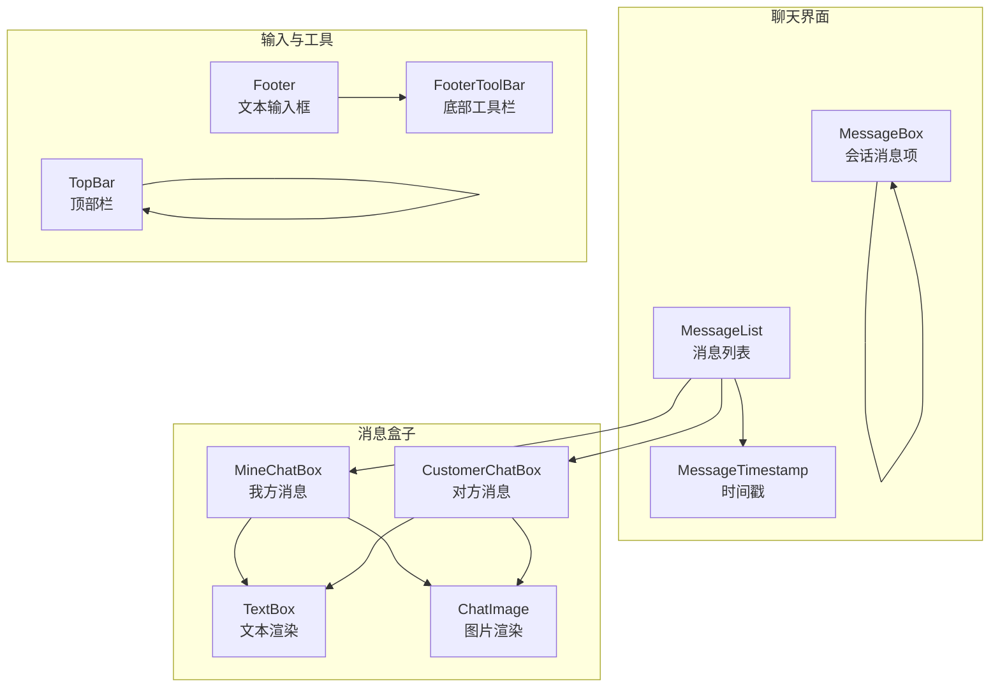
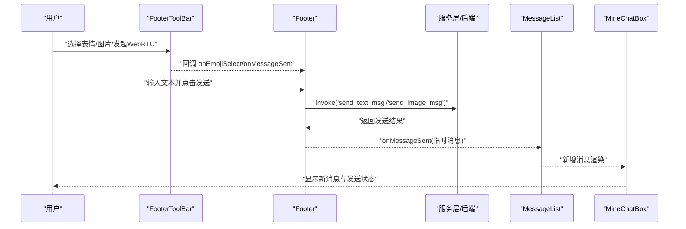
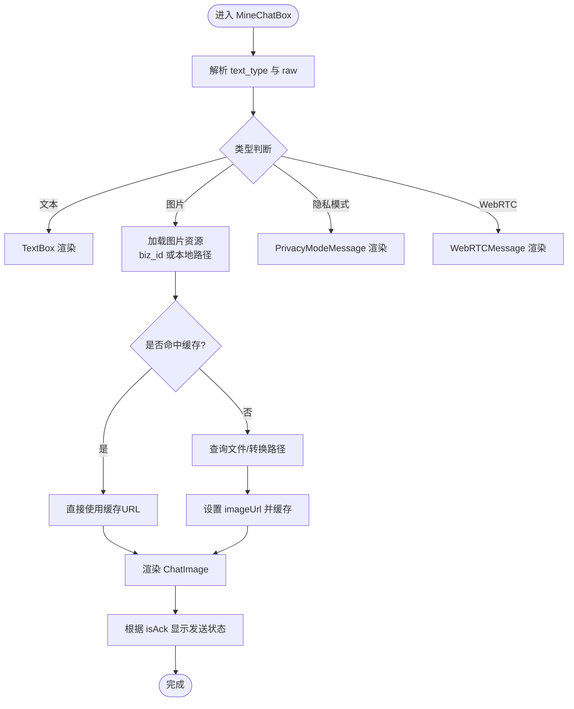
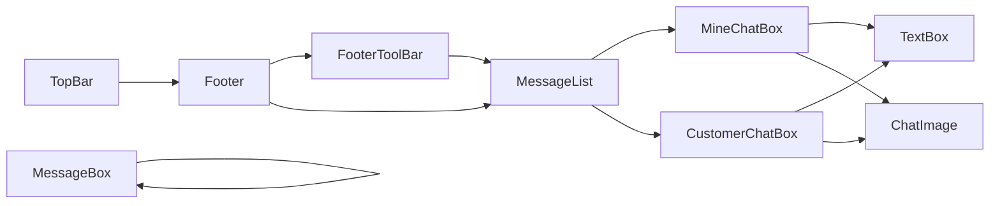

# 聊天组件

<cite>
**本文引用的文件**
- [MineChatBox.tsx](file://apps/pc/src/pages/Home/Chats/components/MineChatBox.tsx)
- [CustomerChatBox.tsx](file://apps/pc/src/pages/Home/Chats/components/CustomerChatBox.tsx)
- [MessageList.tsx](file://apps/pc/src/pages/Home/Chats/components/MessageList.tsx)
- [MessageBox.tsx](file://apps/pc/src/pages/Home/Chats/components/MessageBox.tsx)
- [TextBox.tsx](file://apps/pc/src/pages/Home/Chats/components/TextBox.tsx)
- [TopBar.tsx](file://apps/pc/src/pages/Home/Chats/components/TopBar.tsx)
- [Footer.tsx](file://apps/pc/src/pages/Home/Chats/components/Footer.tsx)
- [FooterToolBar.tsx](file://apps/pc/src/pages/Home/Chats/components/FooterToolBar.tsx)
- [MessageTimestamp.tsx](file://apps/pc/src/pages/Home/Chats/components/MessageTimestamp.tsx)
- [ChatImage.tsx](file://apps/pc/src/pages/Home/Chats/components/ChatImage.tsx)
- [MineChatBox.less](file://apps/pc/src/pages/Home/Chats/components/styles/MineChatBox.less)
- [CustomerChatBox.less](file://apps/pc/src/pages/Home/Chats/components/styles/CustomerChatBox.less)
- [MessageBox.less](file://apps/pc/src/pages/Home/Chats/components/styles/MessageBox.less)
- [TextBox.less](file://apps/pc/src/pages/Home/Chats/components/styles/TextBox.less)
</cite>

## 目录
1. [简介](#简介)
2. [项目结构](#项目结构)
3. [核心组件](#核心组件)
4. [架构总览](#架构总览)
5. [详细组件分析](#详细组件分析)
6. [依赖关系分析](#依赖关系分析)
7. [性能考量](#性能考量)
8. [故障排查指南](#故障排查指南)
9. [结论](#结论)
10. [附录](#附录)

## 简介
本文件面向即时通讯应用中的聊天界面，系统性梳理并说明消息盒子组件（MineChatBox、CustomerChatBox）、消息列表组件、文本输入框组件、顶部栏组件与底部工具栏组件的设计理念、功能特性与实现细节。重点覆盖消息渲染机制、用户交互处理、状态管理与样式定制；提供组件属性配置、事件处理回调与生命周期管理说明；并给出消息类型处理、实时更新机制与性能优化策略，帮助开发者快速上手与扩展。

## 项目结构
聊天组件位于 PC 端页面的“会话”模块下，采用按功能分层组织：消息展示（消息盒子、消息列表、时间戳）、输入与工具（底部工具栏、文本输入）、顶部控制（顶部栏）以及通用子组件（文本渲染、图片渲染）。样式通过独立 less 文件管理，便于主题化与定制。



图表来源
- [MessageList.tsx:18-93](file://apps/pc/src/pages/Home/Chats/components/MessageList.tsx#L18-L93)
- [MineChatBox.tsx:33-224](file://apps/pc/src/pages/Home/Chats/components/MineChatBox.tsx#L33-L224)
- [CustomerChatBox.tsx:19-167](file://apps/pc/src/pages/Home/Chats/components/CustomerChatBox.tsx#L19-L167)
- [TextBox.tsx:5-8](file://apps/pc/src/pages/Home/Chats/components/TextBox.tsx#L5-L8)
- [ChatImage.tsx:21-122](file://apps/pc/src/pages/Home/Chats/components/ChatImage.tsx#L21-L122)
- [Footer.tsx:22-93](file://apps/pc/src/pages/Home/Chats/components/Footer.tsx#L22-L93)
- [FooterToolBar.tsx:91-227](file://apps/pc/src/pages/Home/Chats/components/FooterToolBar.tsx#L91-L227)
- [TopBar.tsx:21-120](file://apps/pc/src/pages/Home/Chats/components/TopBar.tsx#L21-L120)
- [MessageBox.tsx:11-132](file://apps/pc/src/pages/Home/Chats/components/MessageBox.tsx#L11-L132)

章节来源
- [MessageList.tsx:18-93](file://apps/pc/src/pages/Home/Chats/components/MessageList.tsx#L18-L93)
- [MineChatBox.tsx:33-224](file://apps/pc/src/pages/Home/Chats/components/MineChatBox.tsx#L33-L224)
- [CustomerChatBox.tsx:19-167](file://apps/pc/src/pages/Home/Chats/components/CustomerChatBox.tsx#L19-L167)
- [Footer.tsx:22-93](file://apps/pc/src/pages/Home/Chats/components/Footer.tsx#L22-L93)
- [FooterToolBar.tsx:91-227](file://apps/pc/src/pages/Home/Chats/components/FooterToolBar.tsx#L91-L227)
- [TopBar.tsx:21-120](file://apps/pc/src/pages/Home/Chats/components/TopBar.tsx#L21-L120)
- [MessageBox.tsx:11-132](file://apps/pc/src/pages/Home/Chats/components/MessageBox.tsx#L11-L132)

## 核心组件
- MineChatBox：渲染我方发出的消息，支持文本、图片、隐私模式与 WebRTC 特殊消息类型；内置发送状态提示与头像懒加载缓存。
- CustomerChatBox：渲染对方发来的消息，逻辑与 MineChatBox 类似，样式区分我方/对方气泡与头像位置。
- MessageList：聚合消息列表，负责时间戳分段、新消息动画、消息 ID 对比与浅比较优化。
- TextBox：将原始文本消息解析为可渲染的文本容器。
- ChatImage：封装图片消息的渲染、点击预览与加载占位。
- Footer：文本输入框与发送按钮，负责构造文本消息并触发发送。
- FooterToolBar：底部工具栏，提供表情选择、图片发送、P2P 初始化与 WebRTC 聊天入口。
- TopBar：顶部栏，提供菜单操作（查看资料、免打扰、屏蔽、删除好友等）。
- MessageBox：会话列表项，用于最近联系人或会话概览展示。
- MessageTimestamp：时间戳组件，统一格式化显示。

章节来源
- [MineChatBox.tsx:33-224](file://apps/pc/src/pages/Home/Chats/components/MineChatBox.tsx#L33-L224)
- [CustomerChatBox.tsx:19-167](file://apps/pc/src/pages/Home/Chats/components/CustomerChatBox.tsx#L19-L167)
- [MessageList.tsx:18-93](file://apps/pc/src/pages/Home/Chats/components/MessageList.tsx#L18-L93)
- [TextBox.tsx:5-8](file://apps/pc/src/pages/Home/Chats/components/TextBox.tsx#L5-L8)
- [ChatImage.tsx:21-122](file://apps/pc/src/pages/Home/Chats/components/ChatImage.tsx#L21-L122)
- [Footer.tsx:22-93](file://apps/pc/src/pages/Home/Chats/components/Footer.tsx#L22-L93)
- [FooterToolBar.tsx:91-227](file://apps/pc/src/pages/Home/Chats/components/FooterToolBar.tsx#L91-L227)
- [TopBar.tsx:21-120](file://apps/pc/src/pages/Home/Chats/components/TopBar.tsx#L21-L120)
- [MessageBox.tsx:11-132](file://apps/pc/src/pages/Home/Chats/components/MessageBox.tsx#L11-L132)
- [MessageTimestamp.tsx:11-25](file://apps/pc/src/pages/Home/Chats/components/MessageTimestamp.tsx#L11-L25)

## 架构总览
聊天界面由“数据驱动渲染 + 事件驱动交互”构成。消息列表根据 ChatMessage 列表渲染，每条消息根据发送方与消息类型选择对应的消息盒子组件；输入侧通过 Footer 与 FooterToolBar 组合完成文本与多媒体消息的构造与发送；顶部栏提供会话级操作；样式通过独立 less 文件实现主题化与动画效果。



图表来源
- [FooterToolBar.tsx:113-177](file://apps/pc/src/pages/Home/Chats/components/FooterToolBar.tsx#L113-L177)
- [Footer.tsx:29-60](file://apps/pc/src/pages/Home/Chats/components/Footer.tsx#L29-L60)
- [MessageList.tsx:63-90](file://apps/pc/src/pages/Home/Chats/components/MessageList.tsx#L63-L90)
- [MineChatBox.tsx:152-178](file://apps/pc/src/pages/Home/Chats/components/MineChatBox.tsx#L152-L178)

## 详细组件分析

### MineChatBox 组件
- 设计理念：区分我方消息样式与对端消息样式，支持多种消息类型渲染；通过本地缓存提升图片与头像加载性能；提供发送状态反馈。
- 关键点
  - 属性：msg（ChatMessage）、isAck（发送状态）、icon（头像标识）、friendUuid、currentBizId。
  - 渲染：根据 text_type 分派到 TextBox、ChatImage、PrivacyModeMessage 或 WebRTCMessage。
  - 头像与图片：使用 imageCache 缓存；头像通过 getFiles 获取 Tauri 路径；图片通过 biz_id 查询文件路径。
  - 发送状态：基于 isAck 延迟标记，超时自动提示发送失败。
- 生命周期与状态
  - useEffect 监听 isAck 变化，设置定时器以更新发送状态标志。
  - 头像与图片加载均带 loading 状态与错误兜底。
- 样式定制：通过 less 文件自定义气泡形状、阴影、动画与特殊消息样式。



图表来源
- [MineChatBox.tsx:103-150](file://apps/pc/src/pages/Home/Chats/components/MineChatBox.tsx#L103-L150)
- [MineChatBox.tsx:152-178](file://apps/pc/src/pages/Home/Chats/components/MineChatBox.tsx#L152-L178)
- [MineChatBox.less:145-243](file://apps/pc/src/pages/Home/Chats/components/styles/MineChatBox.less#L145-L243)

章节来源
- [MineChatBox.tsx:33-224](file://apps/pc/src/pages/Home/Chats/components/MineChatBox.tsx#L33-L224)
- [MineChatBox.less:1-244](file://apps/pc/src/pages/Home/Chats/components/styles/MineChatBox.less#L1-L244)

### CustomerChatBox 组件
- 设计理念：与 MineChatBox 对称实现，左侧头像、右侧消息气泡，适配不同消息类型的渲染。
- 关键点
  - 属性：继承 ChatMessage，额外传入 friendUuid、currentBizId。
  - 头像加载：同 MineChatBox 的缓存策略。
  - 图片渲染：同 MineChatBox 的图片加载与预览流程。
- 样式定制：less 文件定义对称的气泡形状与阴影，强调左右布局差异。

章节来源
- [CustomerChatBox.tsx:19-167](file://apps/pc/src/pages/Home/Chats/components/CustomerChatBox.tsx#L19-L167)
- [CustomerChatBox.less:1-188](file://apps/pc/src/pages/Home/Chats/components/styles/CustomerChatBox.less#L1-L188)

### MessageList 组件
- 设计理念：集中管理消息列表渲染，按时间戳分段显示时间戳，支持新消息与已加载消息的差异化动画。
- 关键点
  - 时间戳：超过固定阈值才显示，避免密集时间戳刷屏。
  - 动画：根据 newMessageIds/loadedMessageIds 设置不同动画类名。
  - 性能：使用 React.memo 自定义对比函数，仅当消息数组长度、nano_id 或时间戳发生变化时重渲染。
  - 过滤：过滤掉特定 text_type 的占位消息。
- 与子组件协作：根据 from 字段选择 MineChatBox 或 CustomerChatBox；图片消息提取 biz_id 传递给子组件。

```mermaid
sequenceDiagram
participant ML as "MessageList"
participant Prev as "前一条消息"
participant Cur as "当前消息"
participant TS as "MessageTimestamp"
participant Box as "Mine/CustomerChatBox"
ML->>Cur : "遍历消息"
ML->>Prev : "获取上一条消息"
ML->>ML : "计算时间差并决定是否显示时间戳"
ML->>TS : "需要时渲染时间戳"
ML->>Box : "根据 from 选择盒子组件"
Box-->>ML : "渲染完成"
```

图表来源
- [MessageList.tsx:47-89](file://apps/pc/src/pages/Home/Chats/components/MessageList.tsx#L47-L89)

章节来源
- [MessageList.tsx:18-121](file://apps/pc/src/pages/Home/Chats/components/MessageList.tsx#L18-L121)

### TextBox 组件
- 设计理念：将原始文本消息解析为结构化对象并渲染为可读文本。
- 关键点
  - 输入：字符串 raw（JSON 序列化后的 TextMsgRaw）。
  - 输出：渲染文本内容，样式由 TextBox.less 提供。

章节来源
- [TextBox.tsx:5-8](file://apps/pc/src/pages/Home/Chats/components/TextBox.tsx#L5-L8)
- [TextBox.less:1-4](file://apps/pc/src/pages/Home/Chats/components/styles/TextBox.less#L1-L4)

### ChatImage 组件
- 设计理念：封装图片消息的渲染、点击预览与加载占位，支持尺寸与圆角等样式定制。
- 关键点
  - 点击预览：调用服务层接口获取图片序列与索引，打开预览窗口。
  - 加载策略：先显示占位文案，再切换为真实图片；失败时显示错误提示。
  - 参数：支持最大宽高、圆角、类名与内联样式透传。

章节来源
- [ChatImage.tsx:21-122](file://apps/pc/src/pages/Home/Chats/components/ChatImage.tsx#L21-L122)

### Footer 组件（文本输入框）
- 设计理念：提供基础文本输入与发送能力，构造标准消息体并触发发送。
- 关键点
  - 输入：受控组件，支持回车发送。
  - 发送：构造 TextQuicMsgVo 与临时 ChatMessage，调用后端接口；成功后回调通知父组件刷新。
  - 回调：onMessageSent 接收临时消息 JSON 字符串，便于父组件立即渲染。

章节来源
- [Footer.tsx:22-93](file://apps/pc/src/pages/Home/Chats/components/Footer.tsx#L22-L93)

### FooterToolBar 组件（底部工具栏）
- 设计理念：提供表情选择、图片发送、P2P 初始化与 WebRTC 聊天入口，统一交互体验。
- 关键点
  - 表情选择：内置表情列表，点击回调 onEmojiSelect；点击外部区域关闭面板。
  - 图片发送：选择本地图片文件，构造图片消息并发送。
  - P2P/WebRTC：调用后端初始化与服务层打开 WebRTC 聊天。
  - 回调：onEmojiSelect/onMessageSent 与父组件联动。

章节来源
- [FooterToolBar.tsx:91-227](file://apps/pc/src/pages/Home/Chats/components/FooterToolBar.tsx#L91-L227)

### TopBar 组件（顶部栏）
- 设计理念：提供会话级操作入口，如查看资料、免打扰、屏蔽与删除好友。
- 关键点
  - 下拉菜单：通过 Ant Design Dropdown 实现。
  - 删除好友：二次确认弹窗，成功后刷新列表并跳转。
  - 其他：消息免打扰与屏蔽为占位功能，便于后续扩展。

章节来源
- [TopBar.tsx:21-120](file://apps/pc/src/pages/Home/Chats/components/TopBar.tsx#L21-L120)

### MessageBox 组件（会话列表项）
- 设计理念：用于最近联系人或会话概览，展示标题、最近消息摘要、时间与头像。
- 关键点
  - 文本摘要：根据 text_type 返回对应占位文本（如图片、隐私模式、WebRTC 等）。
  - 头像：缓存 + 异步加载，支持 Badge 计数。

章节来源
- [MessageBox.tsx:11-132](file://apps/pc/src/pages/Home/Chats/components/MessageBox.tsx#L11-L132)
- [MessageBox.less:1-152](file://apps/pc/src/pages/Home/Chats/components/styles/MessageBox.less#L1-L152)

### MessageTimestamp 组件
- 设计理念：统一时间戳格式化与展示，支持自定义类名与样式。
- 关键点
  - 格式化：调用统一格式化工具。
  - 交互：配合消息盒子的 tooltip 展示。

章节来源
- [MessageTimestamp.tsx:11-25](file://apps/pc/src/pages/Home/Chats/components/MessageTimestamp.tsx#L11-L25)

## 依赖关系分析
- 组件耦合
  - MessageList 作为中枢，依赖 MineChatBox/CustomerChatBox 与 MessageTimestamp。
  - MineChatBox/CustomerChatBox 依赖 TextBox/ChatImage/WebRTCMessage/PrivacyModeMessage。
  - Footer 与 FooterToolBar 通过回调与父组件通信，不直接依赖具体业务数据。
- 数据流
  - 输入：ChatMessage 数组、头像标识、friendUuid、currentBizId。
  - 输出：onMessageSent 回调、UI 更新（动画与状态）。
- 外部依赖
  - 服务层：文件查询、图片预览、WebRTC 服务初始化与打开。
  - 工具：时间格式化、nanoid、Tauri 路径转换。



图表来源
- [MessageList.tsx:3-6](file://apps/pc/src/pages/Home/Chats/components/MessageList.tsx#L3-L6)
- [MineChatBox.tsx:10-15](file://apps/pc/src/pages/Home/Chats/components/MineChatBox.tsx#L10-L15)
- [CustomerChatBox.tsx:6-10](file://apps/pc/src/pages/Home/Chats/components/CustomerChatBox.tsx#L6-L10)
- [Footer.tsx:12-13](file://apps/pc/src/pages/Home/Chats/components/Footer.tsx#L12-L13)
- [FooterToolBar.tsx:1-16](file://apps/pc/src/pages/Home/Chats/components/FooterToolBar.tsx#L1-L16)
- [TopBar.tsx:1-14](file://apps/pc/src/pages/Home/Chats/components/TopBar.tsx#L1-L14)
- [MessageBox.tsx:1-6](file://apps/pc/src/pages/Home/Chats/components/MessageBox.tsx#L1-L6)

## 性能考量
- 渲染优化
  - 使用 React.memo 与自定义对比函数，减少不必要的重渲染（MessageList）。
  - 图片与头像采用 Map 缓存，避免重复请求与重复渲染。
- 交互优化
  - 发送状态延迟提示，避免频繁闪烁；图片加载采用占位与渐显策略。
- 数据处理
  - 时间戳分段显示，降低 UI 压力；消息 ID 对比确保增量更新。
- 样式与动画
  - 使用 CSS 动画与过渡，避免 JavaScript 控制动画带来的卡顿。

[本节为通用性能建议，无需列出章节来源]

## 故障排查指南
- 图片加载失败
  - 现象：图片区域显示“加载失败”或空白。
  - 排查：确认 biz_id 是否正确、文件服务是否返回有效路径、Tauri 路径转换是否成功。
  - 参考：图片加载与错误处理逻辑。
- 发送失败提示
  - 现象：我方消息出现“发送失败”状态。
  - 排查：检查 isAck 状态与定时器逻辑；确认后端返回与前端状态同步。
  - 参考：发送状态渲染与定时器清理。
- WebRTC/WebRTC 信令
  - 现象：发起 WebRTC 失败或无响应。
  - 排查：确认用户 UUID 获取、服务初始化、信令通道建立；查看控制台错误日志。
  - 参考：WebRTC 打开流程与错误提示。
- 表情选择面板不消失
  - 现象：点击外部未关闭表情面板。
  - 排查：确认点击外部监听是否绑定与解绑；检查面板层级与事件冒泡。
  - 参考：表情面板外部点击监听与状态切换。

章节来源
- [MineChatBox.tsx:142-148](file://apps/pc/src/pages/Home/Chats/components/MineChatBox.tsx#L142-L148)
- [FooterToolBar.tsx:100-111](file://apps/pc/src/pages/Home/Chats/components/FooterToolBar.tsx#L100-L111)
- [FooterToolBar.tsx:172-176](file://apps/pc/src/pages/Home/Chats/components/FooterToolBar.tsx#L172-L176)

## 结论
本聊天组件体系以“消息盒子 + 列表 + 输入工具 + 顶部控制”的分层设计实现高内聚低耦合；通过缓存、动画与统一格式化工具提升用户体验与性能；通过回调与状态管理实现前后端协同与实时更新。开发者可在现有基础上扩展消息类型、增强富媒体能力与完善会话管理。

[本节为总结性内容，无需列出章节来源]

## 附录

### 组件属性与回调清单
- MineChatBox
  - 属性：msg、isAck、icon、friendUuid、currentBizId
  - 渲染：根据 text_type 分派
- CustomerChatBox
  - 属性：继承 ChatMessage，friendUuid、currentBizId
- MessageList
  - 属性：messages、friendIcon、friendUuid、newMessageIds、loadedMessageIds
  - 行为：时间戳分段、动画、过滤占位消息
- Footer
  - 属性：friendUuid、onMessageSent
  - 行为：文本输入、构造消息、调用发送
- FooterToolBar
  - 属性：friendUuid、onEmojiSelect、onMessageSent
  - 行为：表情选择、图片发送、P2P/WebRTC
- TopBar
  - 属性：title、friendInfo
  - 行为：菜单项点击、删除好友确认
- MessageBox
  - 属性：message、title、time、img、count、text_type
  - 行为：摘要生成、头像加载
- MessageTimestamp
  - 属性：timestamp、className、style
  - 行为：时间格式化

章节来源
- [MineChatBox.tsx:19-42](file://apps/pc/src/pages/Home/Chats/components/MineChatBox.tsx#L19-L42)
- [CustomerChatBox.tsx:14-27](file://apps/pc/src/pages/Home/Chats/components/CustomerChatBox.tsx#L14-L27)
- [MessageList.tsx:8-24](file://apps/pc/src/pages/Home/Chats/components/MessageList.tsx#L8-L24)
- [Footer.tsx:17-25](file://apps/pc/src/pages/Home/Chats/components/Footer.tsx#L17-L25)
- [FooterToolBar.tsx:18-22](file://apps/pc/src/pages/Home/Chats/components/FooterToolBar.tsx#L18-L22)
- [TopBar.tsx:16-19](file://apps/pc/src/pages/Home/Chats/components/TopBar.tsx#L16-L19)
- [MessageBox.tsx:11-12](file://apps/pc/src/pages/Home/Chats/components/MessageBox.tsx#L11-L12)
- [MessageTimestamp.tsx:5-9](file://apps/pc/src/pages/Home/Chats/components/MessageTimestamp.tsx#L5-L9)