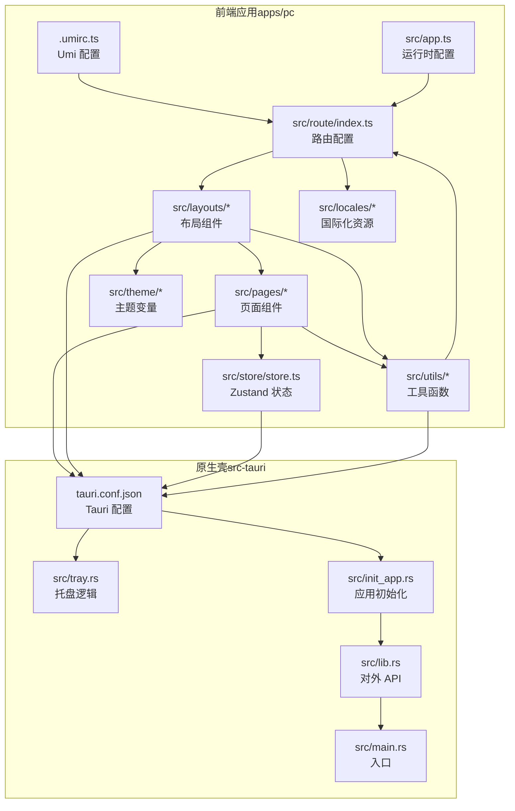
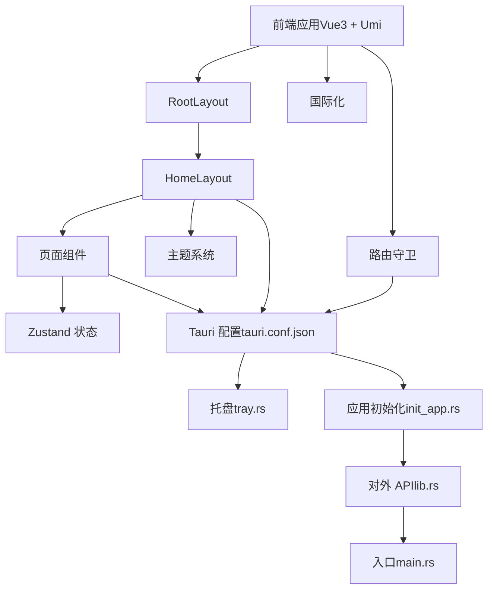
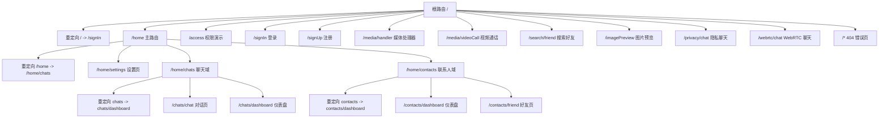
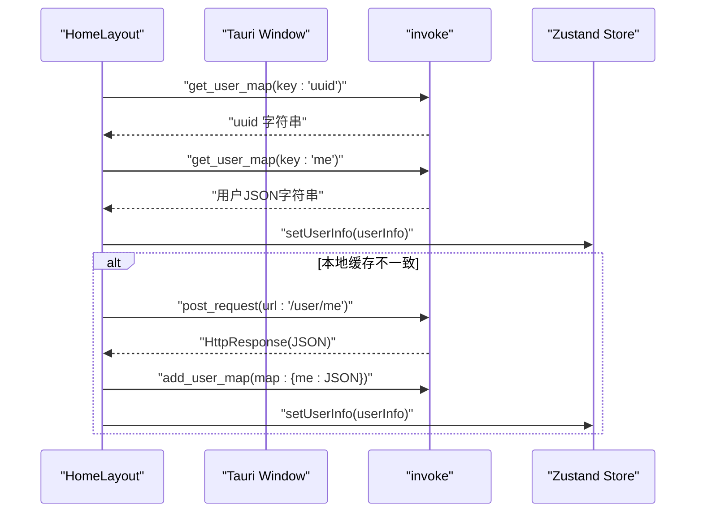
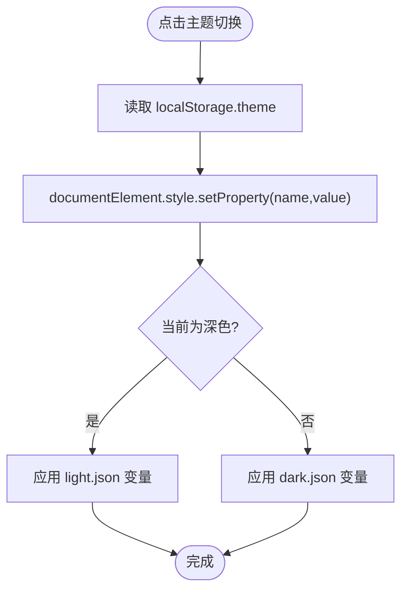
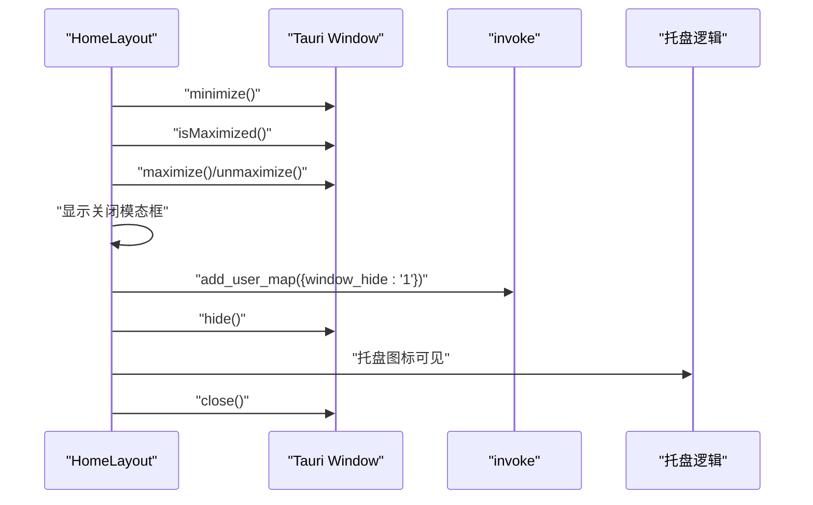
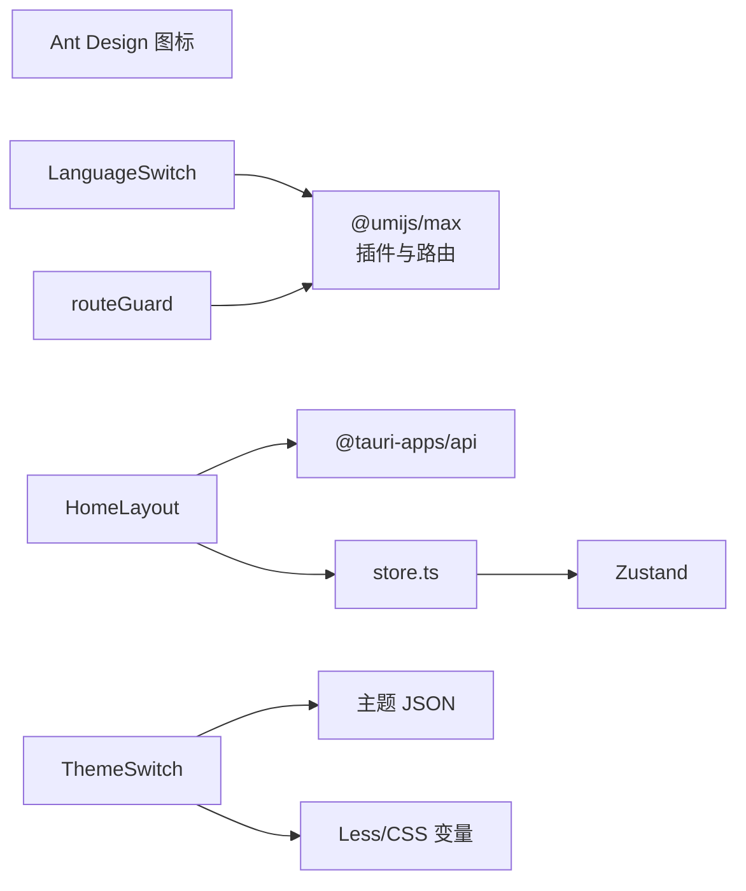

# PC 端应用

<cite>
**本文引用的文件**
- [.umirc.ts](file://apps/pc/.umirc.ts)
- [app.ts](file://apps/pc/src/app.ts)
- [RootLayout.tsx](file://apps/pc/src/layouts/RootLayout.tsx)
- [HomeLayout/index.tsx](file://apps/pc/src/layouts/HomeLayout/index.tsx)
- [route/index.ts](file://apps/pc/src/route/index.ts)
- [light.json](file://apps/pc/src/theme/light.json)
- [dark.json](file://apps/pc/src/theme/dark.json)
- [ThemeSwitch/index.tsx](file://apps/pc/src/components/ThemeSwitch/index.tsx)
- [LanguageSwitch/index.tsx](file://apps/pc/src/components/LanguageSwitch/index.tsx)
- [zh-CN.ts](file://apps/pc/src/locales/zh-CN.ts)
- [en-US.ts](file://apps/pc/src/locales/en-US.ts)
- [store.ts](file://apps/pc/src/store/store.ts)
- [global.ts](file://apps/pc/src/models/global.ts)
- [routeGuard.ts](file://apps/pc/src/utils/routeGuard.ts)
- [Dashboard/index.tsx](file://apps/pc/src/pages/Home/Chats/Dashboard/index.tsx)
- [tauri.conf.json](file://src-tauri/tauri.conf.json)
- [tray.rs](file://src-tauri/src/tray.rs)
- [init_app.rs](file://src-tauri/src/init_app.rs)
- [lib.rs](file://src-tauri/src/lib.rs)
- [main.rs](file://src-tauri/src/main.rs)
</cite>

## 目录

1. [简介](#简介)
2. [项目结构](#项目结构)
3. [核心组件](#核心组件)
4. [架构总览](#架构总览)
5. [详细组件分析](#详细组件分析)
6. [依赖关系分析](#依赖关系分析)
7. [性能考虑](#性能考虑)
8. [故障排查指南](#故障排查指南)
9. [结论](#结论)
10. [附录](#附录)

## 简介

本文件面向 PC 端开发者，系统性梳理基于 UmiJS 与 Vue3（通过 @umijs/max）构建的桌面应用架构，覆盖应用初始化配置、路由系统设计、布局组件实现、主题与国际化、状态管理策略，以及桌面端特有的窗口管理、系统托盘集成与原生能力调用。文档同时提供组件开发指南、样式系统说明与性能优化建议，帮助读者快速上手并高质量交付 PC 端应用。

## 项目结构

应用采用“前端工程（apps/pc）+ 原生壳（src-tauri）”双层架构：

- 前端工程（apps/pc）：基于 UmiJS 的 Vue3 应用，负责页面与交互；通过 @umijs/max 提供路由、国际化、模型、请求等能力。
- 原生壳（src-tauri）：基于 Tauri 的 Rust 后端，负责窗口、菜单、托盘、系统通知、文件系统等系统级能力，并向前端暴露安全的命令接口。

图表来源

- [.umirc.ts:1-22](file://apps/pc/.umirc.ts#L1-L22)
- [app.ts:1-23](file://apps/pc/src/app.ts#L1-L23)
- [route/index.ts:1-137](file://apps/pc/src/route/index.ts#L1-L137)
- [RootLayout.tsx:1-19](file://apps/pc/src/layouts/RootLayout.tsx#L1-L19)
- [HomeLayout/index.tsx:1-214](file://apps/pc/src/layouts/HomeLayout/index.tsx#L1-L214)
- [store.ts:1-122](file://apps/pc/src/store/store.ts#L1-L122)
- [tauri.conf.json](file://src-tauri/tauri.conf.json)

章节来源

- [.umirc.ts:1-22](file://apps/pc/.umirc.ts#L1-L22)
- [app.ts:1-23](file://apps/pc/src/app.ts#L1-L23)
- [route/index.ts:1-137](file://apps/pc/src/route/index.ts#L1-L137)

## 核心组件

- 应用初始化与运行时配置：通过 app.ts 的运行时钩子与 onRouteChange、getInitialState 等函数，统一处理路由变更与全局初始化。
- 路由系统：集中于 route/index.ts，采用嵌套路由组织页面层级，支持重定向、子路由与独立页面。
- 布局体系：RootLayout 作为顶层容器，HomeLayout 提供 PC 端主界面骨架（侧栏、工具条、内容区、窗口控制按钮），并集成窗口管理与托盘行为。
- 主题系统：通过 light.json/dark.json 定义 CSS 变量，ThemeSwitch 切换主题并将变量注入到 documentElement。
- 国际化：.umirc.ts 启用 locale 功能，zh-CN.ts 与 en-US.ts 提供文案，LanguageSwitch 切换语言并持久化。
- 状态管理：store.ts 使用 Zustand 管理用户信息、媒体请求、视频配置、未读计数等全局状态；models/global.ts 提供轻量全局数据示例。
- 工具与守卫：routeGuard.ts 提供路由变更日志与权限校验框架，便于扩展登录态与权限控制。

章节来源

- [app.ts:15-23](file://apps/pc/src/app.ts#L15-L23)
- [route/index.ts:1-137](file://apps/pc/src/route/index.ts#L1-L137)
- [RootLayout.tsx:1-19](file://apps/pc/src/layouts/RootLayout.tsx#L1-L19)
- [HomeLayout/index.tsx:1-214](file://apps/pc/src/layouts/HomeLayout/index.tsx#L1-L214)
- [ThemeSwitch/index.tsx:1-24](file://apps/pc/src/components/ThemeSwitch/index.tsx#L1-L24)
- [light.json:1-51](file://apps/pc/src/theme/light.json#L1-L51)
- [dark.json:1-51](file://apps/pc/src/theme/dark.json#L1-L51)
- [LanguageSwitch/index.tsx:1-34](file://apps/pc/src/components/LanguageSwitch/index.tsx#L1-L34)
- [zh-CN.ts:1-60](file://apps/pc/src/locales/zh-CN.ts#L1-L60)
- [en-US.ts:1-61](file://apps/pc/src/locales/en-US.ts#L1-L61)
- [store.ts:1-122](file://apps/pc/src/store/store.ts#L1-L122)
- [global.ts:1-14](file://apps/pc/src/models/global.ts#L1-L14)
- [routeGuard.ts:1-116](file://apps/pc/src/utils/routeGuard.ts#L1-L116)

## 架构总览

下图展示前端与原生壳之间的交互关系，以及桌面端窗口、托盘与系统能力的集成点。

图表来源

- [RootLayout.tsx:1-19](file://apps/pc/src/layouts/RootLayout.tsx#L1-L19)
- [HomeLayout/index.tsx:1-214](file://apps/pc/src/layouts/HomeLayout/index.tsx#L1-L214)
- [store.ts:1-122](file://apps/pc/src/store/store.ts#L1-L122)
- [ThemeSwitch/index.tsx:1-24](file://apps/pc/src/components/ThemeSwitch/index.tsx#L1-L24)
- [LanguageSwitch/index.tsx:1-34](file://apps/pc/src/components/LanguageSwitch/index.tsx#L1-L34)
- [routeGuard.ts:1-116](file://apps/pc/src/utils/routeGuard.ts#L1-L116)
- [tauri.conf.json](file://src-tauri/tauri.conf.json)
- [tray.rs](file://src-tauri/src/tray.rs)
- [init_app.rs](file://src-tauri/src/init_app.rs)
- [lib.rs](file://src-tauri/src/lib.rs)
- [main.rs](file://src-tauri/src/main.rs)

## 详细组件分析

### 应用初始化与运行时配置

- onRouteChange：在每次路由跳转时触发，统一记录日志与可扩展权限校验。
- getInitialState：可用于初始化全局状态（如用户信息、权限等），配合布局与页面使用。
- .umirc.ts：启用国际化、模型、请求、访问控制等插件，设置默认语言、浏览器导航语言检测、本地存储语言偏好等。

章节来源

- [app.ts:9-22](file://apps/pc/src/app.ts#L9-L22)
- [.umirc.ts:11-17](file://apps/pc/.umirc.ts#L11-L17)

### 路由系统设计

- 顶层路由：/ 重定向至 /signIn；/home 下进一步拆分聊天与联系人两个子域。
- 子路由：聊天域包含 dashboard 与 chat 子页面；联系人域包含 dashboard 与 friend 子页面。
- 独立页面：权限演示、登录、注册、媒体处理、视频通话、图片预览、隐私聊天、WebRTC 聊天、错误页等。
- 嵌套路由：通过 component 引用布局与页面，形成清晰的层次结构。

图表来源

- [route/index.ts:1-137](file://apps/pc/src/route/index.ts#L1-L137)

章节来源

- [route/index.ts:1-137](file://apps/pc/src/route/index.ts#L1-L137)

### 布局组件实现：RootLayout 与 HomeLayout

- RootLayout：顶层容器，挂载 Outlet 与开发助手组件，负责全局副作用（如 P2P 信号监听）。
- HomeLayout：PC 端主布局，包含左侧边栏、右侧工具栏（在线状态、静音、伪装模式、语言、主题切换）、拖拽标题栏、窗口控制按钮（最小化、最大化/还原、关闭）。
- 窗口管理：通过 @tauri-apps/api/window 与 invoke 调用原生能力，实现最小化、最大化/还原、隐藏到托盘、直接关闭。
- 用户信息初始化：优先从本地映射获取，失败则调用后端接口拉取并缓存。

图表来源

- [HomeLayout/index.tsx:80-115](file://apps/pc/src/layouts/HomeLayout/index.tsx#L80-L115)
- [store.ts:34-43](file://apps/pc/src/store/store.ts#L34-L43)

章节来源

- [RootLayout.tsx:1-19](file://apps/pc/src/layouts/RootLayout.tsx#L1-L19)
- [HomeLayout/index.tsx:1-214](file://apps/pc/src/layouts/HomeLayout/index.tsx#L1-L214)

### 页面组件功能划分

- 聊天仪表盘：展示占位图与提示文本，引导用户选择对话开始聊天。
- 设置页：位于 /home/settings，承载通用设置组件（如通用设置、通知设置、账号隐私等）。
- 联系人仪表盘与好友页：分别承担联系人概览与好友管理。
- 独立页面：权限演示、登录、注册、媒体处理、视频通话、图片预览、隐私聊天、WebRTC 聊天、错误页等。

章节来源

- [Dashboard/index.tsx:1-15](file://apps/pc/src/pages/Home/Chats/Dashboard/index.tsx#L1-L15)

### 主题系统

- 主题变量：light.json 与 dark.json 定义一组 CSS 自定义属性，覆盖背景、文字、玻璃态、Markdown、视频背景等。
- 切换机制：ThemeSwitch 读取 localStorage 中的当前主题，切换后将对应主题的 CSS 变量写入 documentElement，实现即时主题切换。

图表来源

- [ThemeSwitch/index.tsx:4-18](file://apps/pc/src/components/ThemeSwitch/index.tsx#L4-L18)
- [light.json:1-51](file://apps/pc/src/theme/light.json#L1-L51)
- [dark.json:1-51](file://apps/pc/src/theme/dark.json#L1-L51)

章节来源

- [ThemeSwitch/index.tsx:1-24](file://apps/pc/src/components/ThemeSwitch/index.tsx#L1-L24)
- [light.json:1-51](file://apps/pc/src/theme/light.json#L1-L51)
- [dark.json:1-51](file://apps/pc/src/theme/dark.json#L1-L51)

### 国际化配置

- Umi 国际化：.umirc.ts 启用 locale 插件，默认语言 zh-CN，开启浏览器语言检测与本地存储语言偏好。
- 文案资源：zh-CN.ts 与 en-US.ts 提供键值对与嵌套结构，满足登录、注册、搜索好友等场景。
- 切换逻辑：LanguageSwitch 通过 setLocale 切换语言并持久化到 localStorage，实时生效。

章节来源

- [.umirc.ts:11-17](file://apps/pc/.umirc.ts#L11-L17)
- [LanguageSwitch/index.tsx:1-34](file://apps/pc/src/components/LanguageSwitch/index.tsx#L1-L34)
- [zh-CN.ts:1-60](file://apps/pc/src/locales/zh-CN.ts#L1-L60)
- [en-US.ts:1-61](file://apps/pc/src/locales/en-US.ts#L1-L61)

### 状态管理策略

- Zustand：store.ts 定义用户信息、头像、媒体请求、视频配置、未读计数、登录态、刷新标志等状态，并提供原子更新方法。
- 全局模型：models/global.ts 提供轻量全局数据示例（如用户名），适合跨页面共享简单状态。
- 使用建议：将复杂业务状态下沉到页面或模块 store，避免全局 store 过度膨胀；对频繁更新的状态使用 selector 选择器减少重渲染。

章节来源

- [store.ts:1-122](file://apps/pc/src/store/store.ts#L1-L122)
- [global.ts:1-14](file://apps/pc/src/models/global.ts#L1-L14)

### 组件开发指南

- 布局组件：遵循 HomeLayout 的结构（左栏、右栏工具、内容区、窗口控制），确保一致的交互体验。
- 主题适配：使用 CSS 变量命名规范（如 --bg-color、--text-color），在 less/css 中通过 var(--name) 引用。
- 国际化：所有文案统一从 locales 中读取，避免硬编码；使用嵌套键名组织模块化文案。
- 状态管理：优先使用 Zustand 的原子更新，避免不必要的全局订阅；对复杂状态拆分为多个 store 或局部状态。
- 路由守卫：在 app.ts 的 onRouteChange 中统一处理日志与权限校验，必要时结合全局状态判断登录态。

章节来源

- [HomeLayout/index.tsx:117-211](file://apps/pc/src/layouts/HomeLayout/index.tsx#L117-L211)
- [ThemeSwitch/index.tsx:4-18](file://apps/pc/src/components/ThemeSwitch/index.tsx#L4-L18)
- [LanguageSwitch/index.tsx:8-13](file://apps/pc/src/components/LanguageSwitch/index.tsx#L8-L13)
- [store.ts:34-121](file://apps/pc/src/store/store.ts#L34-L121)
- [routeGuard.ts:45-82](file://apps/pc/src/utils/routeGuard.ts#L45-L82)

### 样式系统说明

- CSS 变量：通过主题 JSON 文件集中管理，ThemeSwitch 动态注入，实现主题切换。
- Less 模块化：组件样式按需引入 less 文件，避免全局污染；工具类与布局样式分离。
- 响应式与可访问性：为按钮、输入框、模态框等提供焦点态与悬停态样式，保证可用性。

章节来源

- [light.json:1-51](file://apps/pc/src/theme/light.json#L1-L51)
- [dark.json:1-51](file://apps/pc/src/theme/dark.json#L1-L51)
- [ThemeSwitch/index.tsx:4-18](file://apps/pc/src/components/ThemeSwitch/index.tsx#L4-L18)

### 性能优化技巧

- 路由懒加载：将大型页面组件按需加载，减少首屏体积。
- 状态分片：使用 Zustand 的 selector 选择器，仅订阅所需字段，降低渲染成本。
- 图片与资源：使用合适的图片格式与尺寸，启用压缩与懒加载；媒体资源按需初始化。
- 事件节流：窗口尺寸变化、滚动等高频事件使用节流/防抖。
- 开发与生产差异：在开发环境保留日志，在生产环境关闭冗余日志输出。

章节来源

- [app.ts:45-57](file://apps/pc/src/utils/routeGuard.ts#L45-L57)

### 桌面应用特性：窗口管理、系统托盘与原生功能

- 窗口管理：HomeLayout 通过 @tauri-apps/api/window 控制最小化、最大化/还原、关闭；关闭时弹出模态框，支持最小化到托盘或直接退出。
- 系统托盘：通过 src-tauri/src/tray.rs 实现托盘图标与菜单；隐藏窗口时调用原生隐藏接口。
- 原生能力调用：通过 invoke 调用后端命令（如获取/设置用户映射、发起 HTTP 请求），在前端以声明式方式使用。
- 配置与入口：src-tauri/tauri.conf.json 定义窗口、菜单、权限与能力；init_app.rs 负责初始化流程；lib.rs 暴露对外 API；main.rs 作为程序入口。

图表来源

- [HomeLayout/index.tsx:38-78](file://apps/pc/src/layouts/HomeLayout/index.tsx#L38-L78)
- [tray.rs](file://src-tauri/src/tray.rs)
- [tauri.conf.json](file://src-tauri/tauri.conf.json)

章节来源

- [HomeLayout/index.tsx:38-78](file://apps/pc/src/layouts/HomeLayout/index.tsx#L38-L78)
- [tray.rs](file://src-tauri/src/tray.rs)
- [tauri.conf.json](file://src-tauri/tauri.conf.json)

## 依赖关系分析

- 前端依赖：UmiJS 插件（model、request、access、locale）、Ant Design 图标、@tauri-apps/api、Zustand、Less。
- 原生依赖：Tauri 框架、Rust 生态（serde、tokio 等，由 Tauri 间接提供）。
- 组件耦合：HomeLayout 与 Window、invoke 紧密耦合；ThemeSwitch 与主题 JSON 解耦；LanguageSwitch 与 Umi 国际化解耦；store 与页面组件通过 hooks 解耦。

图表来源

- [HomeLayout/index.tsx:1-214](file://apps/pc/src/layouts/HomeLayout/index.tsx#L1-L214)
- [ThemeSwitch/index.tsx:1-24](file://apps/pc/src/components/ThemeSwitch/index.tsx#L1-L24)
- [LanguageSwitch/index.tsx:1-34](file://apps/pc/src/components/LanguageSwitch/index.tsx#L1-L34)
- [routeGuard.ts:1-116](file://apps/pc/src/utils/routeGuard.ts#L1-L116)
- [store.ts:1-122](file://apps/pc/src/store/store.ts#L1-L122)

章节来源

- [HomeLayout/index.tsx:1-214](file://apps/pc/src/layouts/HomeLayout/index.tsx#L1-L214)
- [store.ts:1-122](file://apps/pc/src/store/store.ts#L1-L122)

## 性能考虑

- 路由与组件：使用路由懒加载与按需加载页面组件，减少初始包体。
- 状态：使用 Zustand 的 selector 与原子更新，避免全局状态引发的全量重渲染。
- 样式：CSS 变量与模块化样式减少重复计算与全局冲突。
- 窗口与托盘：仅在需要时初始化与更新托盘图标，避免频繁创建销毁。
- 日志：开发与生产区分日志级别，生产关闭冗余日志。

## 故障排查指南

- 路由跳转无日志：检查 app.ts 的 onRouteChange 是否正确注册，确认 NODE_ENV 与 action 条件。
- 主题切换无效：确认 ThemeSwitch 正确读取 localStorage 并写入 documentElement 的 CSS 变量。
- 语言切换不生效：确认 LanguageSwitch 调用了 setLocale 并持久化到 localStorage。
- 窗口控制异常：检查 @tauri-apps/api 的导入与版本兼容，确认 tauri.conf.json 中窗口配置正确。
- 托盘不可见：确认 tray.rs 中托盘图标与菜单配置，以及隐藏窗口后是否正确触发托盘显示。

章节来源

- [routeGuard.ts:45-57](file://apps/pc/src/utils/routeGuard.ts#L45-L57)
- [ThemeSwitch/index.tsx:4-18](file://apps/pc/src/components/ThemeSwitch/index.tsx#L4-L18)
- [LanguageSwitch/index.tsx:8-13](file://apps/pc/src/components/LanguageSwitch/index.tsx#L8-L13)
- [HomeLayout/index.tsx:38-78](file://apps/pc/src/layouts/HomeLayout/index.tsx#L38-L78)
- [tray.rs](file://src-tauri/src/tray.rs)

## 结论

本项目以 UmiJS 与 Vue3 为基础，结合 Tauri 实现了完整的 PC 端桌面应用架构。通过清晰的路由与布局设计、完善的主题与国际化方案、轻量而强大的状态管理，以及桌面端特有的窗口与托盘能力，为开发者提供了可扩展、易维护的工程化范式。建议在后续迭代中持续完善权限体系、监控与埋点、自动化测试与打包优化，以提升稳定性与可运维性。

## 附录

- 开发与构建：使用 pnpm 作为包管理器，.umirc.ts 中已启用 esbuildMinifyIIFE 以优化 IIFE 输出。
- 能力与权限：通过 tauri.conf.json 的 capabilities 与 window-default 等配置文件管理权限范围。
- 原生入口：lib.rs 暴露对外 API，main.rs 作为程序入口，init_app.rs 负责初始化流程。

章节来源

- [.umirc.ts:19-21](file://apps/pc/.umirc.ts#L19-L21)
- [tauri.conf.json](file://src-tauri/tauri.conf.json)
- [lib.rs](file://src-tauri/src/lib.rs)
- [main.rs](file://src-tauri/src/main.rs)
- [init_app.rs](file://src-tauri/src/init_app.rs)
