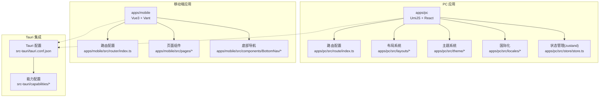
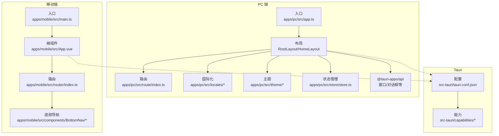
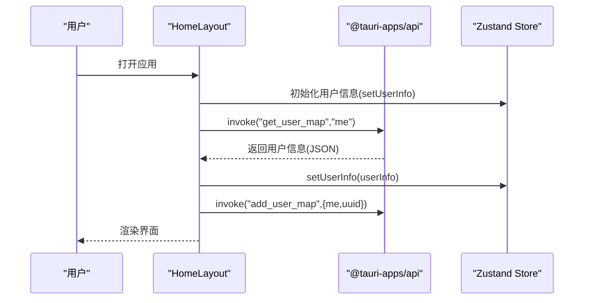
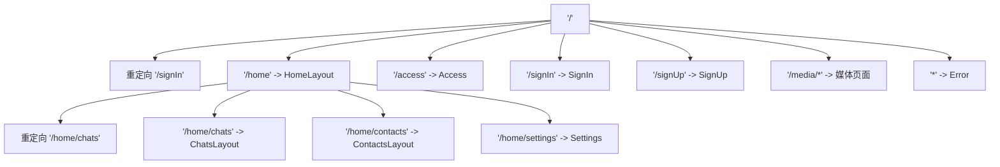
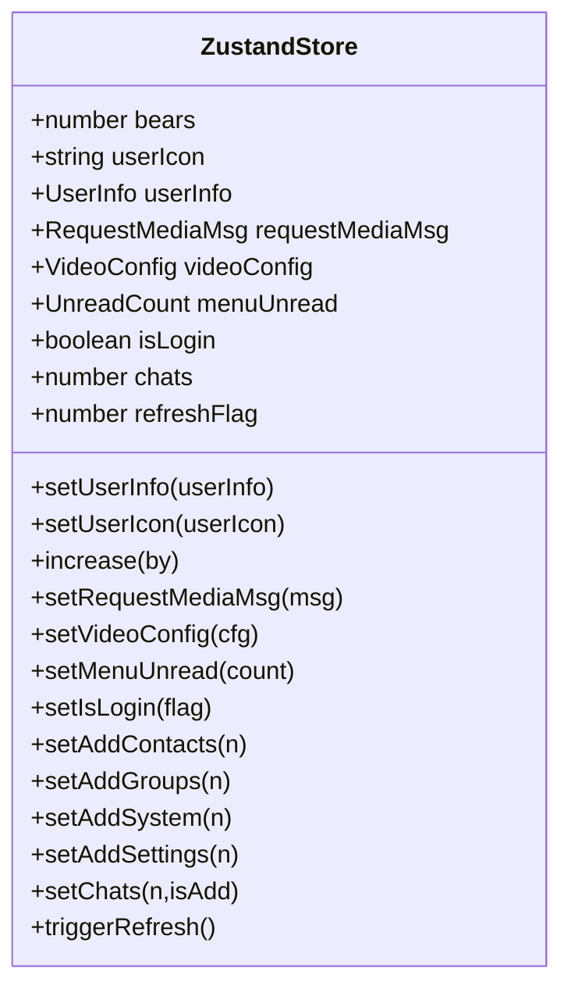
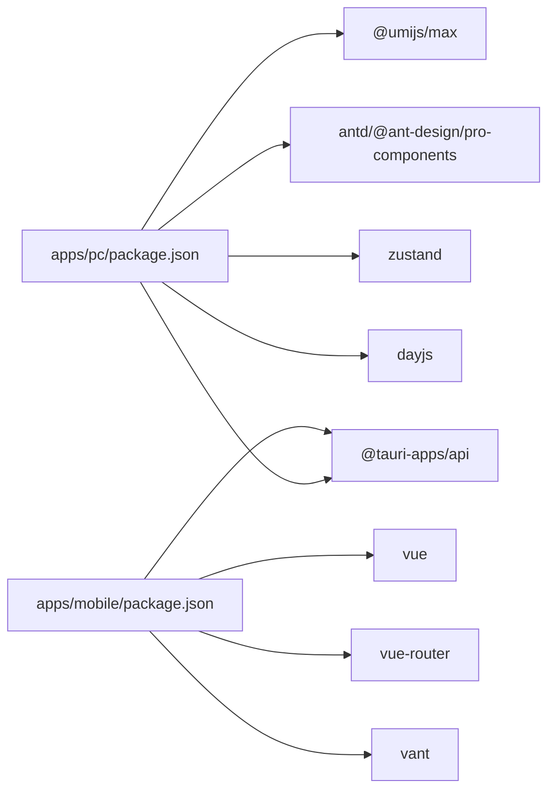

# 前端应用

<cite>
**本文引用的文件**
- [apps/pc/.umirc.ts](file://apps/pc/.umirc.ts)
- [apps/pc/package.json](file://apps/pc/package.json)
- [apps/pc/src/app.ts](file://apps/pc/src/app.ts)
- [apps/pc/src/layouts/RootLayout.tsx](file://apps/pc/src/layouts/RootLayout.tsx)
- [apps/pc/src/route/index.ts](file://apps/pc/src/route/index.ts)
- [apps/pc/src/theme/light.json](file://apps/pc/src/theme/light.json)
- [apps/pc/src/theme/dark.json](file://apps/pc/src/theme/dark.json)
- [apps/pc/src/locales/en-US.ts](file://apps/pc/src/locales/en-US.ts)
- [apps/pc/src/locales/zh-CN.ts](file://apps/pc/src/locales/zh-CN.ts)
- [apps/pc/src/layouts/HomeLayout/index.tsx](file://apps/pc/src/layouts/HomeLayout/index.tsx)
- [apps/pc/src/components/ThemeSwitch/index.tsx](file://apps/pc/src/components/ThemeSwitch/index.tsx)
- [apps/pc/src/components/LanguageSwitch/index.tsx](file://apps/pc/src/components/LanguageSwitch/index.tsx)
- [apps/pc/src/models/global.ts](file://apps/pc/src/models/global.ts)
- [apps/pc/src/store/store.ts](file://apps/pc/src/store/store.ts)
- [apps/mobile/package.json](file://apps/mobile/package.json)
- [apps/mobile/src/main.ts](file://apps/mobile/src/main.ts)
- [apps/mobile/src/App.vue](file://apps/mobile/src/App.vue)
- [apps/mobile/src/router/index.ts](file://apps/mobile/src/router/index.ts)
- [apps/mobile/src/components/BottomNav/index.vue](file://apps/mobile/src/components/BottomNav/index.vue)
- [apps/mobile/src/pages/Home/index.vue](file://apps/mobile/src/pages/Home/index.vue)
- [apps/mobile/src/pages/Discover/index.vue](file://apps/mobile/src/pages/Discover/index.vue)
- [apps/mobile/src/pages/Recommend/index.vue](file://apps/mobile/src/pages/Recommend/index.vue)
- [apps/mobile/src/pages/Profile/index.vue](file://apps/mobile/src/pages/Profile/index.vue)
</cite>

## 目录
1. [简介](#简介)
2. [项目结构](#项目结构)
3. [核心组件](#核心组件)
4. [架构总览](#架构总览)
5. [详细组件分析](#详细组件分析)
6. [依赖关系分析](#依赖关系分析)
7. [性能考虑](#性能考虑)
8. [故障排查指南](#故障排查指南)
9. [结论](#结论)
10. [附录](#附录)

## 简介
本文件面向前端开发者，系统性梳理该 UmiJS + Vue3 + Tauri 前后端一体化应用的架构与实现细节，覆盖 PC 端与移动端两套前端工程。内容包括：
- UmiJS 应用配置与构建流程
- Vue3 组件体系与响应式设计
- 布局系统、路由配置与状态管理模式
- 主题系统、国际化支持与组件库使用
- 移动端适配、触摸交互与原生能力集成最佳实践
- 组件开发指南、样式系统说明与性能优化策略

## 项目结构
该仓库采用多包工作区（pnpm workspaces）组织，包含 PC 端与移动端两个独立前端应用，以及 Rust 后端与 Tauri 集成层。

图表来源
- [apps/pc/src/route/index.ts:1-137](file://apps/pc/src/route/index.ts#L1-L137)
- [apps/pc/src/layouts/RootLayout.tsx:1-19](file://apps/pc/src/layouts/RootLayout.tsx#L1-L19)
- [apps/pc/src/theme/light.json:1-51](file://apps/pc/src/theme/light.json#L1-L51)
- [apps/pc/src/locales/zh-CN.ts:1-60](file://apps/pc/src/locales/zh-CN.ts#L1-L60)
- [apps/pc/src/store/store.ts:1-122](file://apps/pc/src/store/store.ts#L1-L122)
- [apps/mobile/src/router/index.ts](file://apps/mobile/src/router/index.ts)
- [apps/mobile/src/pages/Home/index.vue](file://apps/mobile/src/pages/Home/index.vue)
- [apps/mobile/src/components/BottomNav/index.vue](file://apps/mobile/src/components/BottomNav/index.vue)
- [src-tauri/tauri.conf.json](file://src-tauri/tauri.conf.json)

章节来源
- [apps/pc/.umirc.ts:1-22](file://apps/pc/.umirc.ts#L1-L22)
- [apps/pc/package.json:1-45](file://apps/pc/package.json#L1-L45)
- [apps/mobile/package.json:1-37](file://apps/mobile/package.json#L1-L37)

## 核心组件
- 应用入口与运行时配置
  - PC 端通过运行时钩子处理路由变更与全局初始化，便于集中接入权限、埋点与用户态初始化。
  - 参考路径：[apps/pc/src/app.ts:1-23](file://apps/pc/src/app.ts#L1-L23)
- 布局系统
  - RootLayout 作为顶层出口容器，承载 Outlet 与开发辅助组件；HomeLayout 提供 PC 端侧栏、工具条与窗口控制能力，并集成 Tauri 窗口操作。
  - 参考路径：
    - [apps/pc/src/layouts/RootLayout.tsx:1-19](file://apps/pc/src/layouts/RootLayout.tsx#L1-L19)
    - [apps/pc/src/layouts/HomeLayout/index.tsx:1-214](file://apps/pc/src/layouts/HomeLayout/index.tsx#L1-L214)
- 路由系统
  - PC 端采用嵌套路由，以 RootLayout 为根，HomeLayout 作为主区域布局，内部再细分 Chats/Contacts 等子路由。
  - 参考路径：[apps/pc/src/route/index.ts:1-137](file://apps/pc/src/route/index.ts#L1-L137)
- 国际化与主题
  - 国际化通过 Umi 的 locale 插件与本地语言包实现；主题通过 CSS 变量与本地 JSON 定义，切换时批量设置到 :root。
  - 参考路径：
    - [apps/pc/.umirc.ts:11-17](file://apps/pc/.umirc.ts#L11-L17)
    - [apps/pc/src/locales/zh-CN.ts:1-60](file://apps/pc/src/locales/zh-CN.ts#L1-L60)
    - [apps/pc/src/locales/en-US.ts:1-61](file://apps/pc/src/locales/en-US.ts#L1-L61)
    - [apps/pc/src/components/ThemeSwitch/index.tsx:1-24](file://apps/pc/src/components/ThemeSwitch/index.tsx#L1-L24)
    - [apps/pc/src/theme/light.json:1-51](file://apps/pc/src/theme/light.json#L1-L51)
    - [apps/pc/src/theme/dark.json:1-51](file://apps/pc/src/theme/dark.json#L1-L51)
- 状态管理
  - PC 端采用 Zustand 管理用户信息、媒体请求、视频配置、未读计数等全局状态；同时保留 Umi 的 model/initialState 能力。
  - 参考路径：
    - [apps/pc/src/store/store.ts:1-122](file://apps/pc/src/store/store.ts#L1-L122)
    - [apps/pc/src/models/global.ts:1-14](file://apps/pc/src/models/global.ts#L1-L14)
- 移动端基础
  - 移动端采用 Vue3 + Vant，提供底部导航与页面级路由；入口与 App.vue 作为根组件。
  - 参考路径：
    - [apps/mobile/package.json:1-37](file://apps/mobile/package.json#L1-L37)
    - [apps/mobile/src/main.ts](file://apps/mobile/src/main.ts)
    - [apps/mobile/src/App.vue](file://apps/mobile/src/App.vue)
    - [apps/mobile/src/router/index.ts](file://apps/mobile/src/router/index.ts)
    - [apps/mobile/src/components/BottomNav/index.vue](file://apps/mobile/src/components/BottomNav/index.vue)

章节来源
- [apps/pc/src/app.ts:1-23](file://apps/pc/src/app.ts#L1-L23)
- [apps/pc/src/layouts/RootLayout.tsx:1-19](file://apps/pc/src/layouts/RootLayout.tsx#L1-L19)
- [apps/pc/src/layouts/HomeLayout/index.tsx:1-214](file://apps/pc/src/layouts/HomeLayout/index.tsx#L1-L214)
- [apps/pc/src/route/index.ts:1-137](file://apps/pc/src/route/index.ts#L1-L137)
- [apps/pc/.umirc.ts:11-17](file://apps/pc/.umirc.ts#L11-L17)
- [apps/pc/src/locales/zh-CN.ts:1-60](file://apps/pc/src/locales/zh-CN.ts#L1-L60)
- [apps/pc/src/locales/en-US.ts:1-61](file://apps/pc/src/locales/en-US.ts#L1-L61)
- [apps/pc/src/components/ThemeSwitch/index.tsx:1-24](file://apps/pc/src/components/ThemeSwitch/index.tsx#L1-L24)
- [apps/pc/src/theme/light.json:1-51](file://apps/pc/src/theme/light.json#L1-L51)
- [apps/pc/src/theme/dark.json:1-51](file://apps/pc/src/theme/dark.json#L1-L51)
- [apps/pc/src/store/store.ts:1-122](file://apps/pc/src/store/store.ts#L1-L122)
- [apps/pc/src/models/global.ts:1-14](file://apps/pc/src/models/global.ts#L1-L14)
- [apps/mobile/package.json:1-37](file://apps/mobile/package.json#L1-L37)
- [apps/mobile/src/main.ts](file://apps/mobile/src/main.ts)
- [apps/mobile/src/App.vue](file://apps/mobile/src/App.vue)
- [apps/mobile/src/router/index.ts](file://apps/mobile/src/router/index.ts)
- [apps/mobile/src/components/BottomNav/index.vue](file://apps/mobile/src/components/BottomNav/index.vue)

## 架构总览
整体架构围绕“多端同源、原生能力集成”展开：PC 端通过 UmiJS + React 实现桌面窗口控制与复杂布局；移动端通过 Vue3 + Vant 实现轻量化界面与触控体验；二者均通过 Tauri 暴露系统能力（窗口、对话框、文件系统等），并与 Rust 后端服务通信。

图表来源
- [apps/pc/src/app.ts:1-23](file://apps/pc/src/app.ts#L1-L23)
- [apps/pc/src/layouts/RootLayout.tsx:1-19](file://apps/pc/src/layouts/RootLayout.tsx#L1-L19)
- [apps/pc/src/layouts/HomeLayout/index.tsx:1-214](file://apps/pc/src/layouts/HomeLayout/index.tsx#L1-L214)
- [apps/pc/src/route/index.ts:1-137](file://apps/pc/src/route/index.ts#L1-L137)
- [apps/pc/src/locales/zh-CN.ts:1-60](file://apps/pc/src/locales/zh-CN.ts#L1-L60)
- [apps/pc/src/theme/light.json:1-51](file://apps/pc/src/theme/light.json#L1-L51)
- [apps/pc/src/store/store.ts:1-122](file://apps/pc/src/store/store.ts#L1-L122)
- [apps/mobile/src/main.ts](file://apps/mobile/src/main.ts)
- [apps/mobile/src/App.vue](file://apps/mobile/src/App.vue)
- [apps/mobile/src/router/index.ts](file://apps/mobile/src/router/index.ts)
- [apps/mobile/src/components/BottomNav/index.vue](file://apps/mobile/src/components/BottomNav/index.vue)
- [src-tauri/tauri.conf.json](file://src-tauri/tauri.conf.json)

## 详细组件分析

### PC 端布局与窗口控制
- RootLayout 作为顶层出口容器，承载 Outlet 与开发助手组件，统一注入全局副作用（如 P2P 信令与消息监听）。
- HomeLayout 提供左侧边栏、右侧工具条与窗口控制按钮，支持最小化、最大化/还原、关闭窗口，并可选择隐藏至系统托盘。
- 通过 @tauri-apps/api 与后端能力交互，实现用户信息初始化与本地缓存同步。

图表来源
- [apps/pc/src/layouts/HomeLayout/index.tsx:80-115](file://apps/pc/src/layouts/HomeLayout/index.tsx#L80-L115)
- [apps/pc/src/store/store.ts:41-42](file://apps/pc/src/store/store.ts#L41-L42)

章节来源
- [apps/pc/src/layouts/RootLayout.tsx:1-19](file://apps/pc/src/layouts/RootLayout.tsx#L1-L19)
- [apps/pc/src/layouts/HomeLayout/index.tsx:1-214](file://apps/pc/src/layouts/HomeLayout/index.tsx#L1-L214)
- [apps/pc/src/store/store.ts:1-122](file://apps/pc/src/store/store.ts#L1-L122)

### 路由与嵌套路由
- PC 端采用嵌套路由：RootLayout -> HomeLayout -> 子路由（Chats/Contacts/Settings 等），支持重定向与命名路由，便于权限与面包屑管理。
- 顶层错误页与媒体相关页面（视频通话、图片预览）独立挂载。

图表来源
- [apps/pc/src/route/index.ts:1-137](file://apps/pc/src/route/index.ts#L1-L137)

章节来源
- [apps/pc/src/route/index.ts:1-137](file://apps/pc/src/route/index.ts#L1-L137)

### 国际化与主题系统
- 国际化
  - Umi 配置启用 locale 插件，默认语言、浏览器语言检测、本地存储记忆等；语言包按模块拆分，支持嵌套键值。
  - 参考路径：
    - [apps/pc/.umirc.ts:11-17](file://apps/pc/.umirc.ts#L11-L17)
    - [apps/pc/src/locales/zh-CN.ts:1-60](file://apps/pc/src/locales/zh-CN.ts#L1-L60)
    - [apps/pc/src/locales/en-US.ts:1-61](file://apps/pc/src/locales/en-US.ts#L1-L61)
- 主题系统
  - 通过 JSON 定义 CSS 变量键值对，切换主题时批量写入 documentElement.style，实现全站主题切换。
  - 参考路径：
    - [apps/pc/src/components/ThemeSwitch/index.tsx:1-24](file://apps/pc/src/components/ThemeSwitch/index.tsx#L1-L24)
    - [apps/pc/src/theme/light.json:1-51](file://apps/pc/src/theme/light.json#L1-L51)
    - [apps/pc/src/theme/dark.json:1-51](file://apps/pc/src/theme/dark.json#L1-L51)

章节来源
- [apps/pc/.umirc.ts:11-17](file://apps/pc/.umirc.ts#L11-L17)
- [apps/pc/src/locales/zh-CN.ts:1-60](file://apps/pc/src/locales/zh-CN.ts#L1-L60)
- [apps/pc/src/locales/en-US.ts:1-61](file://apps/pc/src/locales/en-US.ts#L1-L61)
- [apps/pc/src/components/ThemeSwitch/index.tsx:1-24](file://apps/pc/src/components/ThemeSwitch/index.tsx#L1-L24)
- [apps/pc/src/theme/light.json:1-51](file://apps/pc/src/theme/light.json#L1-L51)
- [apps/pc/src/theme/dark.json:1-51](file://apps/pc/src/theme/dark.json#L1-L51)

### 状态管理模式
- Zustand Store
  - 管理用户信息、头像、媒体请求、视频配置、菜单未读计数、登录态、聊天数量与刷新标志等。
  - 提供原子化 setter 与派生计算（如未读计数加减、聊天数量加减）。
- Umi Model 与 InitialState
  - 保留 Umi 的 model 与 initialState 能力，适合与布局、权限、用户态初始化结合使用。
  - 参考路径：
    - [apps/pc/src/store/store.ts:1-122](file://apps/pc/src/store/store.ts#L1-L122)
    - [apps/pc/src/models/global.ts:1-14](file://apps/pc/src/models/global.ts#L1-L14)
    - [apps/pc/src/app.ts:15-22](file://apps/pc/src/app.ts#L15-L22)

图表来源
- [apps/pc/src/store/store.ts:9-32](file://apps/pc/src/store/store.ts#L9-L32)

章节来源
- [apps/pc/src/store/store.ts:1-122](file://apps/pc/src/store/store.ts#L1-L122)
- [apps/pc/src/models/global.ts:1-14](file://apps/pc/src/models/global.ts#L1-L14)
- [apps/pc/src/app.ts:15-22](file://apps/pc/src/app.ts#L15-L22)

### 移动端应用与底部导航
- 入口与根组件
  - Vue3 应用入口与 App.vue 根组件，配合 Vite/Vue Router 构建。
  - 参考路径：
    - [apps/mobile/src/main.ts](file://apps/mobile/src/main.ts)
    - [apps/mobile/src/App.vue](file://apps/mobile/src/App.vue)
- 路由与页面
  - 采用 Vue Router 管理页面级路由，包含 Home/Discover/Recommend/Profile 等页面。
  - 参考路径：
    - [apps/mobile/src/router/index.ts](file://apps/mobile/src/router/index.ts)
    - [apps/mobile/src/pages/Home/index.vue](file://apps/mobile/src/pages/Home/index.vue)
    - [apps/mobile/src/pages/Discover/index.vue](file://apps/mobile/src/pages/Discover/index.vue)
    - [apps/mobile/src/pages/Recommend/index.vue](file://apps/mobile/src/pages/Recommend/index.vue)
    - [apps/mobile/src/pages/Profile/index.vue](file://apps/mobile/src/pages/Profile/index.vue)
- 底部导航
  - BottomNav 提供移动端常用导航入口，建议与路由保持一致，避免重复渲染。
  - 参考路径：
    - [apps/mobile/src/components/BottomNav/index.vue](file://apps/mobile/src/components/BottomNav/index.vue)

章节来源
- [apps/mobile/src/main.ts](file://apps/mobile/src/main.ts)
- [apps/mobile/src/App.vue](file://apps/mobile/src/App.vue)
- [apps/mobile/src/router/index.ts](file://apps/mobile/src/router/index.ts)
- [apps/mobile/src/pages/Home/index.vue](file://apps/mobile/src/pages/Home/index.vue)
- [apps/mobile/src/pages/Discover/index.vue](file://apps/mobile/src/pages/Discover/index.vue)
- [apps/mobile/src/pages/Recommend/index.vue](file://apps/mobile/src/pages/Recommend/index.vue)
- [apps/mobile/src/pages/Profile/index.vue](file://apps/mobile/src/pages/Profile/index.vue)
- [apps/mobile/src/components/BottomNav/index.vue](file://apps/mobile/src/components/BottomNav/index.vue)

### 组件开发指南（PC 端）
- 布局与容器
  - 使用 RootLayout 包裹页面，HomeLayout 提供侧栏与工具条，确保 Outlet 正常渲染。
  - 参考路径：
    - [apps/pc/src/layouts/RootLayout.tsx:1-19](file://apps/pc/src/layouts/RootLayout.tsx#L1-L19)
    - [apps/pc/src/layouts/HomeLayout/index.tsx:1-214](file://apps/pc/src/layouts/HomeLayout/index.tsx#L1-L214)
- 状态与副作用
  - 将用户态初始化、系统通知、P2P/WebRTC 相关 Hook 放置在 RootLayout 或 HomeLayout 中，避免分散。
  - 参考路径：
    - [apps/pc/src/layouts/RootLayout.tsx:1-19](file://apps/pc/src/layouts/RootLayout.tsx#L1-L19)
    - [apps/pc/src/layouts/HomeLayout/index.tsx:1-214](file://apps/pc/src/layouts/HomeLayout/index.tsx#L1-L214)
- 主题与国际化
  - 主题切换组件通过 JSON 与 CSS 变量联动；国际化通过 setLocale 切换语言并持久化。
  - 参考路径：
    - [apps/pc/src/components/ThemeSwitch/index.tsx:1-24](file://apps/pc/src/components/ThemeSwitch/index.tsx#L1-L24)
    - [apps/pc/src/components/LanguageSwitch/index.tsx:1-34](file://apps/pc/src/components/LanguageSwitch/index.tsx#L1-L34)
    - [apps/pc/.umirc.ts:11-17](file://apps/pc/.umirc.ts#L11-L17)

章节来源
- [apps/pc/src/layouts/RootLayout.tsx:1-19](file://apps/pc/src/layouts/RootLayout.tsx#L1-L19)
- [apps/pc/src/layouts/HomeLayout/index.tsx:1-214](file://apps/pc/src/layouts/HomeLayout/index.tsx#L1-L214)
- [apps/pc/src/components/ThemeSwitch/index.tsx:1-24](file://apps/pc/src/components/ThemeSwitch/index.tsx#L1-L24)
- [apps/pc/src/components/LanguageSwitch/index.tsx:1-34](file://apps/pc/src/components/LanguageSwitch/index.tsx#L1-L34)
- [apps/pc/.umirc.ts:11-17](file://apps/pc/.umirc.ts#L11-L17)

### 样式系统说明
- CSS 变量主题
  - 通过 JSON 定义 CSS 变量键值，切换主题时批量设置到 :root，实现全局颜色、背景、透明度等统一切换。
  - 参考路径：
    - [apps/pc/src/theme/light.json:1-51](file://apps/pc/src/theme/light.json#L1-L51)
    - [apps/pc/src/theme/dark.json:1-51](file://apps/pc/src/theme/dark.json#L1-L51)
    - [apps/pc/src/components/ThemeSwitch/index.tsx:5-18](file://apps/pc/src/components/ThemeSwitch/index.tsx#L5-L18)
- Less/CSS 模块
  - 大量组件采用 Less 文件组织样式，部分模块化样式（如媒体组件）使用 CSS Modules，避免命名冲突。
  - 参考路径：
    - [apps/pc/src/layouts/HomeLayout/index.less](file://apps/pc/src/layouts/HomeLayout/index.less)
    - [apps/pc/src/components/Media/PrivacyVideoCall/index.module.less](file://apps/pc/src/components/Media/PrivacyVideoCall/index.module.less)

章节来源
- [apps/pc/src/theme/light.json:1-51](file://apps/pc/src/theme/light.json#L1-L51)
- [apps/pc/src/theme/dark.json:1-51](file://apps/pc/src/theme/dark.json#L1-L51)
- [apps/pc/src/components/ThemeSwitch/index.tsx:5-18](file://apps/pc/src/components/ThemeSwitch/index.tsx#L5-L18)

### 性能优化策略
- 构建与打包
  - 使用 Umi Max 的 esbuildMinifyIIFE 优化 IIFE 输出，减少体积与加载时间。
  - 参考路径：[apps/pc/.umirc.ts:20-21](file://apps/pc/.umirc.ts#L20-L21)
- 状态与渲染
  - 使用 Zustand 原子化状态更新，避免不必要的重渲染；将副作用集中在布局组件中，减少页面组件负担。
  - 参考路径：
    - [apps/pc/src/store/store.ts:1-122](file://apps/pc/src/store/store.ts#L1-L122)
    - [apps/pc/src/layouts/RootLayout.tsx:1-19](file://apps/pc/src/layouts/RootLayout.tsx#L1-L19)
- 资源与懒加载
  - 页面级路由天然具备按需加载能力；建议对重型组件（如媒体、Markdown 渲染）进行动态导入。
  - 参考路径：[apps/pc/src/route/index.ts:1-137](file://apps/pc/src/route/index.ts#L1-L137)

章节来源
- [apps/pc/.umirc.ts:20-21](file://apps/pc/.umirc.ts#L20-L21)
- [apps/pc/src/store/store.ts:1-122](file://apps/pc/src/store/store.ts#L1-L122)
- [apps/pc/src/layouts/RootLayout.tsx:1-19](file://apps/pc/src/layouts/RootLayout.tsx#L1-L19)
- [apps/pc/src/route/index.ts:1-137](file://apps/pc/src/route/index.ts#L1-L137)

## 依赖关系分析
- PC 端依赖
  - Umi Max、Ant Design、@tauri-apps/api、Zustand、dayjs、React 生态等。
  - 参考路径：[apps/pc/package.json:18-43](file://apps/pc/package.json#L18-L43)
- 移动端依赖
  - Vue3、Vue Router、Vant、@tauri-apps/api 等。
  - 参考路径：[apps/mobile/package.json:16-35](file://apps/mobile/package.json#L16-L35)

图表来源
- [apps/pc/package.json:18-43](file://apps/pc/package.json#L18-L43)
- [apps/mobile/package.json:16-35](file://apps/mobile/package.json#L16-L35)

章节来源
- [apps/pc/package.json:18-43](file://apps/pc/package.json#L18-L43)
- [apps/mobile/package.json:16-35](file://apps/mobile/package.json#L16-L35)

## 性能考虑
- 构建优化
  - 启用 IIFE 压缩与现代打包器，缩短首屏加载时间。
  - 参考路径：[apps/pc/.umirc.ts:20-21](file://apps/pc/.umirc.ts#L20-L21)
- 运行时优化
  - 使用 Zustand 精细化状态更新，避免全局风暴；将窗口与系统能力调用收敛到布局层，减少页面组件副作用。
  - 参考路径：
    - [apps/pc/src/store/store.ts:1-122](file://apps/pc/src/store/store.ts#L1-L122)
    - [apps/pc/src/layouts/HomeLayout/index.tsx:1-214](file://apps/pc/src/layouts/HomeLayout/index.tsx#L1-L214)
- 资源加载
  - 对重型页面与组件采用动态导入；合理拆分路由，利用浏览器缓存与 CDN。
  - 参考路径：[apps/pc/src/route/index.ts:1-137](file://apps/pc/src/route/index.ts#L1-L137)

[本节为通用指导，无需特定文件引用]

## 故障排查指南
- 国际化不生效
  - 检查 Umi locale 配置与 setLocale 调用是否正确；确认语言包键名与使用处一致。
  - 参考路径：
    - [apps/pc/.umirc.ts:11-17](file://apps/pc/.umirc.ts#L11-L17)
    - [apps/pc/src/components/LanguageSwitch/index.tsx:8-13](file://apps/pc/src/components/LanguageSwitch/index.tsx#L8-L13)
- 主题切换无效
  - 确认 JSON 中变量名与组件读取一致；检查 localStorage 与 :root 设置顺序。
  - 参考路径：
    - [apps/pc/src/components/ThemeSwitch/index.tsx:5-18](file://apps/pc/src/components/ThemeSwitch/index.tsx#L5-L18)
    - [apps/pc/src/theme/light.json:1-51](file://apps/pc/src/theme/light.json#L1-L51)
- 状态异常
  - 检查 Zustand setter 是否被正确调用；避免在渲染期间直接修改状态。
  - 参考路径：[apps/pc/src/store/store.ts:41-42](file://apps/pc/src/store/store.ts#L41-L42)
- 路由跳转问题
  - 检查路由表嵌套层级与重定向配置；确认 Outlet 是否位于正确位置。
  - 参考路径：[apps/pc/src/route/index.ts:1-137](file://apps/pc/src/route/index.ts#L1-L137)

章节来源
- [apps/pc/.umirc.ts:11-17](file://apps/pc/.umirc.ts#L11-L17)
- [apps/pc/src/components/LanguageSwitch/index.tsx:8-13](file://apps/pc/src/components/LanguageSwitch/index.tsx#L8-L13)
- [apps/pc/src/components/ThemeSwitch/index.tsx:5-18](file://apps/pc/src/components/ThemeSwitch/index.tsx#L5-L18)
- [apps/pc/src/theme/light.json:1-51](file://apps/pc/src/theme/light.json#L1-L51)
- [apps/pc/src/store/store.ts:41-42](file://apps/pc/src/store/store.ts#L41-L42)
- [apps/pc/src/route/index.ts:1-137](file://apps/pc/src/route/index.ts#L1-L137)

## 结论
该应用以 UmiJS + Vue3 为双端基础，结合 Tauri 实现原生能力集成与跨平台部署。PC 端通过布局与状态管理实现复杂桌面体验，移动端通过简洁路由与组件体系提供流畅触控体验。国际化与主题系统完善，具备良好的可扩展性与维护性。建议后续在重型页面引入动态导入、完善自动化测试与性能监控，持续提升用户体验与稳定性。

[本节为总结性内容，无需特定文件引用]

## 附录
- 开发与构建命令
  - PC 端：dev/build/setup 等脚本由 Umi Max 提供。
  - 移动端：dev/build/preview/tauri 相关脚本由 Vite/Vue CLI 提供。
  - 参考路径：
    - [apps/pc/package.json:8-16](file://apps/pc/package.json#L8-L16)
    - [apps/mobile/package.json:7-15](file://apps/mobile/package.json#L7-L15)

章节来源
- [apps/pc/package.json:8-16](file://apps/pc/package.json#L8-L16)
- [apps/mobile/package.json:7-15](file://apps/mobile/package.json#L7-L15)