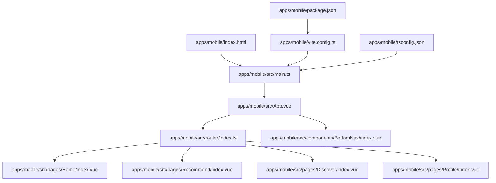
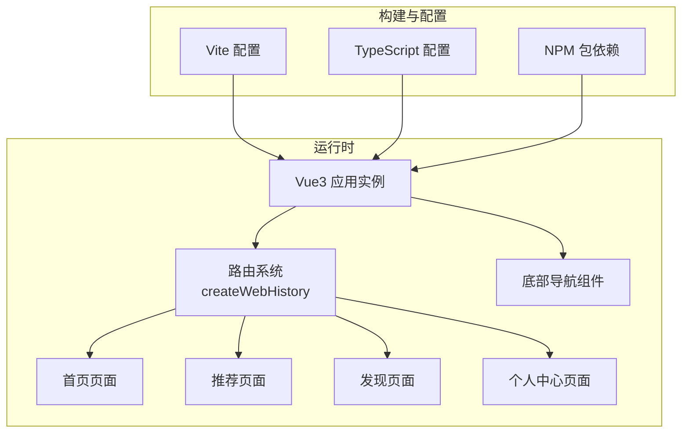
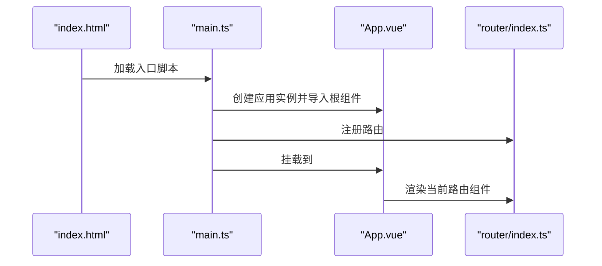
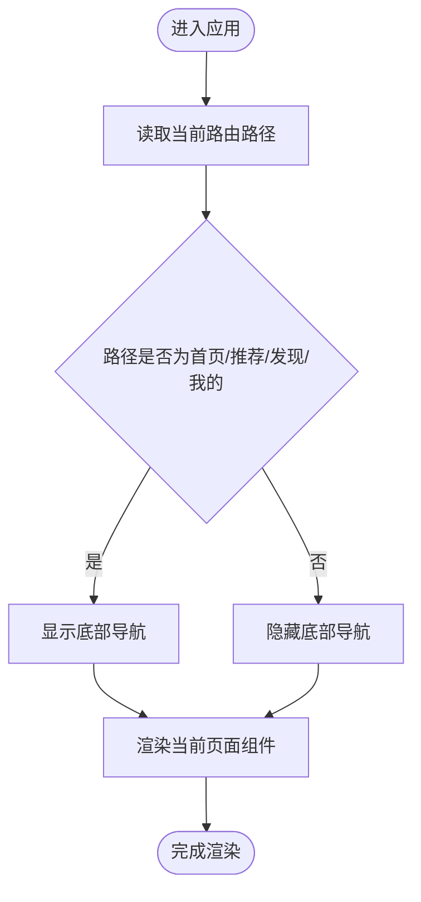
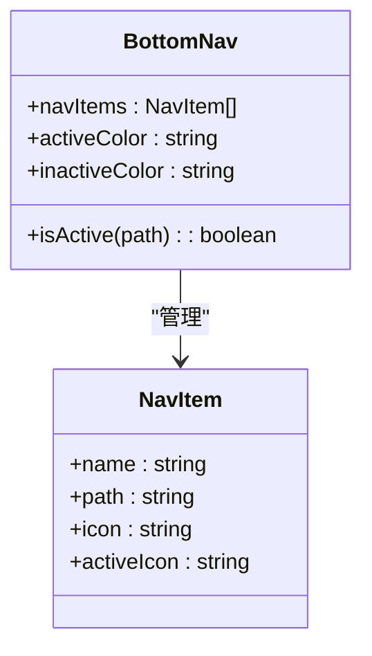
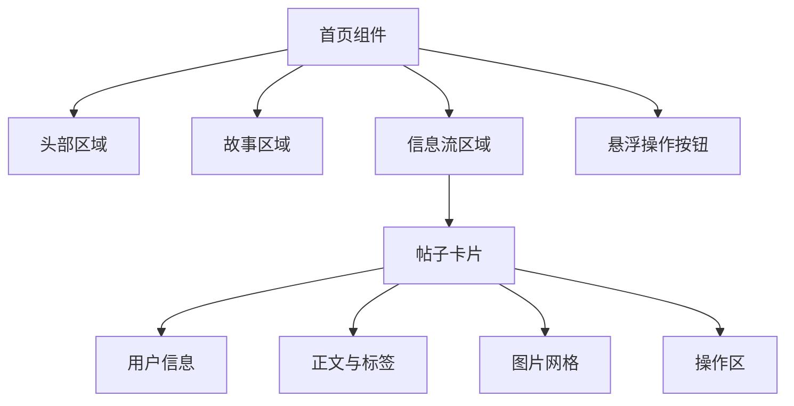
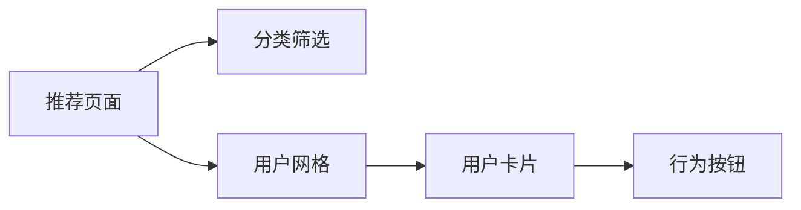
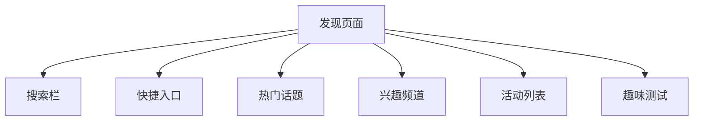
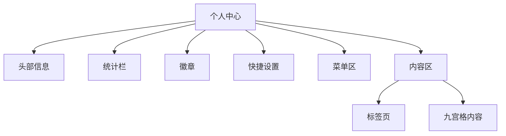
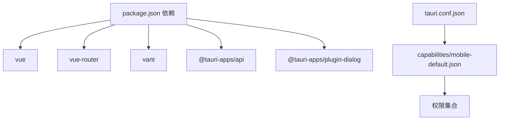

# 移动端应用

<cite>
**本文引用的文件**
- [apps/mobile/package.json](file://apps/mobile/package.json)
- [apps/mobile/vite.config.ts](file://apps/mobile/vite.config.ts)
- [apps/mobile/src/main.ts](file://apps/mobile/src/main.ts)
- [apps/mobile/src/App.vue](file://apps/mobile/src/App.vue)
- [apps/mobile/src/router/index.ts](file://apps/mobile/src/router/index.ts)
- [apps/mobile/src/components/BottomNav/index.vue](file://apps/mobile/src/components/BottomNav/index.vue)
- [apps/mobile/src/pages/Home/index.vue](file://apps/mobile/src/pages/Home/index.vue)
- [apps/mobile/src/pages/Recommend/index.vue](file://apps/mobile/src/pages/Recommend/index.vue)
- [apps/mobile/src/pages/Discover/index.vue](file://apps/mobile/src/pages/Discover/index.vue)
- [apps/mobile/src/pages/Profile/index.vue](file://apps/mobile/src/pages/Profile/index.vue)
- [apps/mobile/tsconfig.json](file://apps/mobile/tsconfig.json)
- [apps/mobile/tsconfig.node.json](file://apps/mobile/tsconfig.node.json)
- [apps/mobile/index.html](file://apps/mobile/index.html)
- [src-tauri/tauri.conf.json](file://src-tauri/tauri.conf.json)
- [src-tauri/capabilities/mobile-default.json](file://src-tauri/capabilities/mobile-default.json)
</cite>

## 目录

1. [简介](#简介)
2. [项目结构](#项目结构)
3. [核心组件](#核心组件)
4. [架构总览](#架构总览)
5. [详细组件分析](#详细组件分析)
6. [依赖关系分析](#依赖关系分析)
7. [性能考虑](#性能考虑)
8. [故障排查指南](#故障排查指南)
9. [结论](#结论)
10. [附录](#附录)

## 简介

本文件面向移动端应用开发者，系统性梳理基于 Vue3 + Vite 的移动端应用架构与实现要点。内容覆盖应用初始化配置、路由导航系统、页面组件设计、响应式布局与触摸交互、手势处理、组件库与导航栏、页面状态管理、移动端开发指南、性能优化策略以及原生功能集成方案。文档同时提供可操作的调试技巧与最佳实践，帮助快速落地高质量的移动端体验。

## 项目结构

移动端应用位于 apps/mobile 目录，采用单页应用（SPA）架构，结合 Vue Router 实现前端路由，使用 Vant 作为移动端组件库基础样式与交互规范。应用通过 Vite 构建，支持 TypeScript 与 Less 预处理，路径别名统一指向 src 及工作区包目录。

**图表来源**

- [apps/mobile/index.html:1-14](file://apps/mobile/index.html#L1-L14)
- [apps/mobile/src/main.ts:1-9](file://apps/mobile/src/main.ts#L1-L9)
- [apps/mobile/src/App.vue:1-62](file://apps/mobile/src/App.vue#L1-L62)
- [apps/mobile/src/router/index.ts:1-33](file://apps/mobile/src/router/index.ts#L1-L33)
- [apps/mobile/src/components/BottomNav/index.vue:1-145](file://apps/mobile/src/components/BottomNav/index.vue#L1-L145)
- [apps/mobile/src/pages/Home/index.vue:1-600](file://apps/mobile/src/pages/Home/index.vue#L1-L600)
- [apps/mobile/src/pages/Recommend/index.vue:1-459](file://apps/mobile/src/pages/Recommend/index.vue#L1-L459)
- [apps/mobile/src/pages/Discover/index.vue:1-529](file://apps/mobile/src/pages/Discover/index.vue#L1-L529)
- [apps/mobile/src/pages/Profile/index.vue:1-626](file://apps/mobile/src/pages/Profile/index.vue#L1-L626)
- [apps/mobile/vite.config.ts:1-31](file://apps/mobile/vite.config.ts#L1-L31)
- [apps/mobile/tsconfig.json:1-28](file://apps/mobile/tsconfig.json#L1-L28)
- [apps/mobile/package.json:1-37](file://apps/mobile/package.json#L1-L37)

**章节来源**

- [apps/mobile/package.json:1-37](file://apps/mobile/package.json#L1-L37)
- [apps/mobile/vite.config.ts:1-31](file://apps/mobile/vite.config.ts#L1-L31)
- [apps/mobile/src/main.ts:1-9](file://apps/mobile/src/main.ts#L1-L9)
- [apps/mobile/src/App.vue:1-62](file://apps/mobile/src/App.vue#L1-L62)
- [apps/mobile/src/router/index.ts:1-33](file://apps/mobile/src/router/index.ts#L1-L33)
- [apps/mobile/index.html:1-14](file://apps/mobile/index.html#L1-L14)

## 核心组件

- 应用入口与挂载：在入口文件中创建 Vue 应用实例，注册路由并挂载到 DOM。
- 根组件与过渡：根组件负责页面切换过渡与底部导航的条件渲染。
- 路由系统：基于 Vue Router 的前端历史模式，按需加载页面组件。
- 底部导航：固定定位的导航栏，支持图标与文字、激活态样式与点击反馈。
- 页面组件：Home、Recommend、Discover、Profile 四个主要页面，分别承载信息流、匹配推荐、发现与社交、个人中心等场景。

**章节来源**

- [apps/mobile/src/main.ts:1-9](file://apps/mobile/src/main.ts#L1-L9)
- [apps/mobile/src/App.vue:1-62](file://apps/mobile/src/App.vue#L1-L62)
- [apps/mobile/src/router/index.ts:1-33](file://apps/mobile/src/router/index.ts#L1-L33)
- [apps/mobile/src/components/BottomNav/index.vue:1-145](file://apps/mobile/src/components/BottomNav/index.vue#L1-L145)
- [apps/mobile/src/pages/Home/index.vue:1-600](file://apps/mobile/src/pages/Home/index.vue#L1-L600)
- [apps/mobile/src/pages/Recommend/index.vue:1-459](file://apps/mobile/src/pages/Recommend/index.vue#L1-L459)
- [apps/mobile/src/pages/Discover/index.vue:1-529](file://apps/mobile/src/pages/Discover/index.vue#L1-L529)
- [apps/mobile/src/pages/Profile/index.vue:1-626](file://apps/mobile/src/pages/Profile/index.vue#L1-L626)

## 架构总览

移动端应用采用“单页应用 + 前端路由”的轻量架构，页面组件通过路由懒加载按需加载，减少首屏体积。底部导航统一管理四个核心页面的切换；根组件控制页面切换动画与导航栏显示范围。构建层使用 Vite，开发服务器支持热更新与跨平台预览；TypeScript 提供类型安全；Less 支持变量与嵌套样式组织。

**图表来源**

- [apps/mobile/src/main.ts:1-9](file://apps/mobile/src/main.ts#L1-L9)
- [apps/mobile/src/App.vue:1-62](file://apps/mobile/src/App.vue#L1-L62)
- [apps/mobile/src/router/index.ts:1-33](file://apps/mobile/src/router/index.ts#L1-L33)
- [apps/mobile/src/components/BottomNav/index.vue:1-145](file://apps/mobile/src/components/BottomNav/index.vue#L1-L145)
- [apps/mobile/vite.config.ts:1-31](file://apps/mobile/vite.config.ts#L1-L31)
- [apps/mobile/tsconfig.json:1-28](file://apps/mobile/tsconfig.json#L1-L28)
- [apps/mobile/package.json:1-37](file://apps/mobile/package.json#L1-L37)

## 详细组件分析

### 应用初始化与挂载流程

- 初始化：创建 Vue 应用实例，注册路由插件。
- 挂载：将应用挂载到 #app 容器，完成渲染。
- 全局样式：引入 Vant 样式以统一移动端交互基线。

**图表来源**

- [apps/mobile/index.html:1-14](file://apps/mobile/index.html#L1-L14)
- [apps/mobile/src/main.ts:1-9](file://apps/mobile/src/main.ts#L1-L9)
- [apps/mobile/src/App.vue:1-62](file://apps/mobile/src/App.vue#L1-L62)
- [apps/mobile/src/router/index.ts:1-33](file://apps/mobile/src/router/index.ts#L1-L33)

**章节来源**

- [apps/mobile/index.html:1-14](file://apps/mobile/index.html#L1-L14)
- [apps/mobile/src/main.ts:1-9](file://apps/mobile/src/main.ts#L1-L9)
- [apps/mobile/src/App.vue:1-62](file://apps/mobile/src/App.vue#L1-L62)

### 路由导航系统

- 路由定义：四条主路由，均采用动态导入实现懒加载。
- 导航方式：底部导航使用 router-link 进行跳转，根组件根据当前路径决定是否展示导航栏。
- 历史模式：使用 createWebHistory，适合移动端浏览器环境。

**图表来源**

- [apps/mobile/src/App.vue:1-62](file://apps/mobile/src/App.vue#L1-L62)
- [apps/mobile/src/router/index.ts:1-33](file://apps/mobile/src/router/index.ts#L1-L33)

**章节来源**

- [apps/mobile/src/router/index.ts:1-33](file://apps/mobile/src/router/index.ts#L1-L33)
- [apps/mobile/src/App.vue:1-62](file://apps/mobile/src/App.vue#L1-L62)

### 底部导航组件

- 数据结构：导航项包含名称、路径、普通图标与激活图标。
- 激活判断：首页特殊处理精确匹配，其他页面使用前缀匹配。
- 视觉反馈：激活态颜色与图标缩放，按钮按下态缩放，提升触控反馈。
- 响应式：固定定位于底部，适配安全区域，支持点击与悬停交互。

**图表来源**

- [apps/mobile/src/components/BottomNav/index.vue:1-145](file://apps/mobile/src/components/BottomNav/index.vue#L1-L145)

**章节来源**

- [apps/mobile/src/components/BottomNav/index.vue:1-145](file://apps/mobile/src/components/BottomNav/index.vue#L1-L145)

### 主要页面组件设计

#### 首页（信息流）

- 头部：用户头像、在线状态徽标、搜索与消息图标。
- 动态故事：横向滚动展示好友故事，支持在线状态指示。
- 信息流：卡片式内容，支持点赞、评论、分享，图片网格布局。
- 浮层按钮：悬浮操作按钮，增强可用性。

**图表来源**

- [apps/mobile/src/pages/Home/index.vue:1-600](file://apps/mobile/src/pages/Home/index.vue#L1-L600)

**章节来源**

- [apps/mobile/src/pages/Home/index.vue:1-600](file://apps/mobile/src/pages/Home/index.vue#L1-L600)

#### 推荐（匹配与社交）

- 分类筛选：横向滚动分类按钮，支持选中态。
- 用户卡片：头像、在线状态、匹配度徽章、标签、距离与性别信息。
- 行为按钮：拒绝与喜欢双键，视觉引导明确。

**图表来源**

- [apps/mobile/src/pages/Recommend/index.vue:1-459](file://apps/mobile/src/pages/Recommend/index.vue#L1-L459)

**章节来源**

- [apps/mobile/src/pages/Recommend/index.vue:1-459](file://apps/mobile/src/pages/Recommend/index.vue#L1-L459)

#### 发现（兴趣与活动）

- 搜索栏：聚焦态边框与阴影，提升输入体验。
- 快捷入口：四宫格快捷动作，色彩变量化。
- 热门话题：带主题色的卡片，参与人数展示。
- 兴趣频道：三宫格频道卡片，描述信息。
- 活动列表：图文卡片，参与人数与时间信息。
- 趣味测试：横幅样式，引导参与。

**图表来源**

- [apps/mobile/src/pages/Discover/index.vue:1-529](file://apps/mobile/src/pages/Discover/index.vue#L1-L529)

**章节来源**

- [apps/mobile/src/pages/Discover/index.vue:1-529](file://apps/mobile/src/pages/Discover/index.vue#L1-L529)

#### 个人中心（资料与设置）

- 头部信息：头像、等级徽章、姓名年龄、个人简介、位置与入会时间。
- 统计栏：发布、粉丝、关注、获赞等指标。
- 徽章展示：活跃达人、摄影大师等标签。
- 快捷设置：夜间模式、勿扰模式、省流模式等开关。
- 菜单区：消息、好友、通知、钱包、数据、个性设置、隐私与安全、帮助与反馈等。
- 内容区：瞬间/相册/收藏三标签页，九宫格内容展示与点赞遮罩。

**图表来源**

- [apps/mobile/src/pages/Profile/index.vue:1-626](file://apps/mobile/src/pages/Profile/index.vue#L1-L626)

**章节来源**

- [apps/mobile/src/pages/Profile/index.vue:1-626](file://apps/mobile/src/pages/Profile/index.vue#L1-L626)

### 响应式布局与触摸交互

- 视口配置：index.html 中设置 viewport，确保移动端正确缩放。
- 样式组织：Less 支持变量与嵌套，便于主题化与模块化维护。
- 交互反馈：导航与按钮提供 hover/active 缩放与阴影变化，提升触控反馈。
- 安全区域：底部导航使用安全区域变量，避免刘海屏遮挡。
- 滚动体验：横向滚动容器禁用默认滚动条，提供自定义滚动条样式。

**章节来源**

- [apps/mobile/index.html:1-14](file://apps/mobile/index.html#L1-L14)
- [apps/mobile/src/components/BottomNav/index.vue:1-145](file://apps/mobile/src/components/BottomNav/index.vue#L1-L145)
- [apps/mobile/src/pages/Home/index.vue:1-600](file://apps/mobile/src/pages/Home/index.vue#L1-L600)
- [apps/mobile/src/pages/Recommend/index.vue:1-459](file://apps/mobile/src/pages/Recommend/index.vue#L1-L459)
- [apps/mobile/src/pages/Discover/index.vue:1-529](file://apps/mobile/src/pages/Discover/index.vue#L1-L529)
- [apps/mobile/src/pages/Profile/index.vue:1-626](file://apps/mobile/src/pages/Profile/index.vue#L1-L626)

### 手势处理与动画

- 页面切换：根组件使用过渡效果实现页面进出动画。
- 按钮反馈：导航与按钮提供缩放与阴影动画，增强触控感知。
- 图片与卡片：悬停缩放与遮罩渐变，提升浏览体验。

**章节来源**

- [apps/mobile/src/App.vue:1-62](file://apps/mobile/src/App.vue#L1-L62)
- [apps/mobile/src/components/BottomNav/index.vue:1-145](file://apps/mobile/src/components/BottomNav/index.vue#L1-L145)
- [apps/mobile/src/pages/Home/index.vue:1-600](file://apps/mobile/src/pages/Home/index.vue#L1-L600)
- [apps/mobile/src/pages/Recommend/index.vue:1-459](file://apps/mobile/src/pages/Recommend/index.vue#L1-L459)
- [apps/mobile/src/pages/Discover/index.vue:1-529](file://apps/mobile/src/pages/Discover/index.vue#L1-L529)
- [apps/mobile/src/pages/Profile/index.vue:1-626](file://apps/mobile/src/pages/Profile/index.vue#L1-L626)

### 组件库与导航栏

- 组件库：Vant 样式已全局引入，提供移动端通用交互基线。
- 导航栏：底部固定导航，支持激活态与点击反馈，图标与文字组合，适配移动端触控。

**章节来源**

- [apps/mobile/package.json:16-24](file://apps/mobile/package.json#L16-L24)
- [apps/mobile/src/main.ts:4-4](file://apps/mobile/src/main.ts#L4-L4)
- [apps/mobile/src/components/BottomNav/index.vue:1-145](file://apps/mobile/src/components/BottomNav/index.vue#L1-L145)

### 页面状态管理

- 当前路由状态：通过路由守卫或计算属性控制导航栏显示与页面切换。
- 页面内状态：各页面内部使用响应式数据管理 UI 状态（如推荐分类、搜索输入、标签页切换等）。
- 建议：对于跨页面共享的状态，可在后续扩展中引入轻量状态管理方案（如 Pinia）以降低耦合。

**章节来源**

- [apps/mobile/src/App.vue:1-62](file://apps/mobile/src/App.vue#L1-L62)
- [apps/mobile/src/router/index.ts:1-33](file://apps/mobile/src/router/index.ts#L1-L33)
- [apps/mobile/src/pages/Recommend/index.vue:1-459](file://apps/mobile/src/pages/Recommend/index.vue#L1-L459)
- [apps/mobile/src/pages/Profile/index.vue:1-626](file://apps/mobile/src/pages/Profile/index.vue#L1-L626)

## 依赖关系分析

- 构建工具链：Vite、TypeScript、Less。
- 前端框架：Vue3、Vue Router。
- 移动端组件：Vant。
- 原生能力：Tauri（窗口、对话框、事件监听等），移动端能力通过 capabilities 配置启用。

**图表来源**

- [apps/mobile/package.json:16-24](file://apps/mobile/package.json#L16-L24)
- [src-tauri/tauri.conf.json:1-58](file://src-tauri/tauri.conf.json#L1-L58)
- [src-tauri/capabilities/mobile-default.json:1-19](file://src-tauri/capabilities/mobile-default.json#L1-L19)

**章节来源**

- [apps/mobile/package.json:1-37](file://apps/mobile/package.json#L1-L37)
- [src-tauri/tauri.conf.json:1-58](file://src-tauri/tauri.conf.json#L1-L58)
- [src-tauri/capabilities/mobile-default.json:1-19](file://src-tauri/capabilities/mobile-default.json#L1-L19)

## 性能考虑

- 路由懒加载：页面组件采用动态导入，减少首屏资源体积。
- 样式体积：合理拆分 Less 文件，避免重复样式，利用变量统一主题。
- 图片与网格：信息流与内容网格使用对象填充与网格布局，注意图片懒加载与尺寸优化。
- 动画与过渡：过渡与按钮反馈使用 CSS 动画，避免复杂 JS 动画造成掉帧。
- 构建优化：Vite 默认开启生产构建优化，建议配合产物分析工具进行进一步优化。

[本节为通用指导，无需特定文件引用]

## 故障排查指南

- 路由不生效：检查路由定义与路径是否一致，确认路由实例已注册。
- 导航栏不显示：确认根组件对路径的判断逻辑与实际路由一致。
- 样式异常：检查 Less 预处理器配置与路径别名，确保样式编译通过。
- 构建失败：核对 TypeScript 配置与 Vite 插件版本兼容性。
- Tauri 权限问题：核对 capabilities 配置与所需权限，确保移动端能力已启用。

**章节来源**

- [apps/mobile/src/router/index.ts:1-33](file://apps/mobile/src/router/index.ts#L1-L33)
- [apps/mobile/src/App.vue:1-62](file://apps/mobile/src/App.vue#L1-L62)
- [apps/mobile/vite.config.ts:1-31](file://apps/mobile/vite.config.ts#L1-L31)
- [apps/mobile/tsconfig.json:1-28](file://apps/mobile/tsconfig.json#L1-L28)
- [apps/mobile/tsconfig.node.json:1-11](file://apps/mobile/tsconfig.node.json#L1-L11)
- [src-tauri/capabilities/mobile-default.json:1-19](file://src-tauri/capabilities/mobile-default.json#L1-L19)

## 结论

该移动端应用以 Vue3 + Vite 为基础，结合 Vant 提供的移动端交互基线，构建了简洁清晰的导航与页面体系。通过路由懒加载、过渡动画与底部导航，实现了良好的移动端用户体验。后续可在状态管理、原生能力集成与性能优化方面持续演进，以满足更复杂的业务需求。

[本节为总结，无需特定文件引用]

## 附录

### 开发与构建指南

- 启动开发服务器：执行应用脚本启动 Vite 开发服务。
- 预览与打包：支持本地预览与生产构建。
- 类型检查：通过 vue-tsc 与 TypeScript 配置保障类型安全。

**章节来源**

- [apps/mobile/package.json:7-15](file://apps/mobile/package.json#L7-L15)
- [apps/mobile/tsconfig.json:1-28](file://apps/mobile/tsconfig.json#L1-L28)
- [apps/mobile/tsconfig.node.json:1-11](file://apps/mobile/tsconfig.node.json#L1-L11)

### 原生功能集成方案

- 对话框与窗口：通过 Tauri 插件与能力配置启用对话框与窗口相关权限。
- 能力管理：移动端能力通过 capabilities 配置集中管理，按需启用。

**章节来源**

- [apps/mobile/package.json:20-23](file://apps/mobile/package.json#L20-L23)
- [src-tauri/tauri.conf.json:38-38](file://src-tauri/tauri.conf.json#L38-L38)
- [src-tauri/capabilities/mobile-default.json:1-19](file://src-tauri/capabilities/mobile-default.json#L1-L19)
