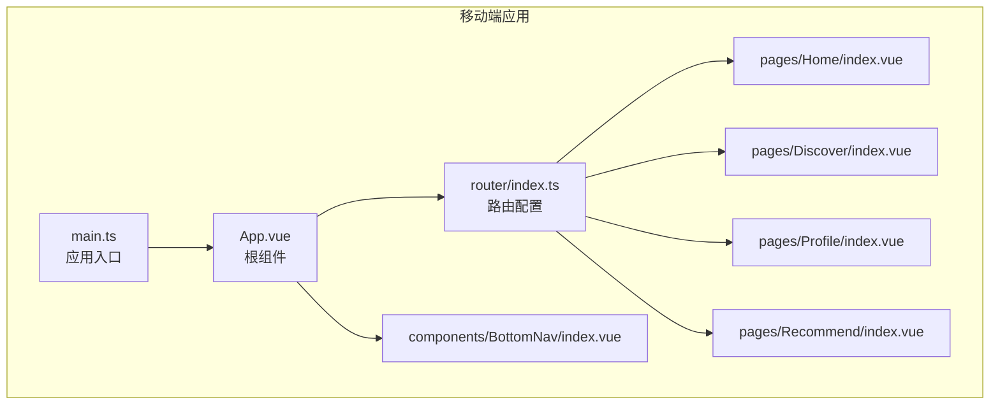
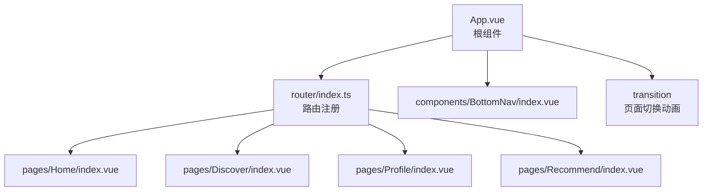
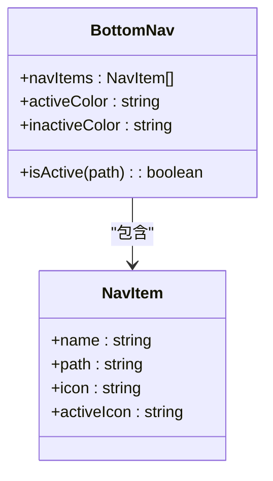
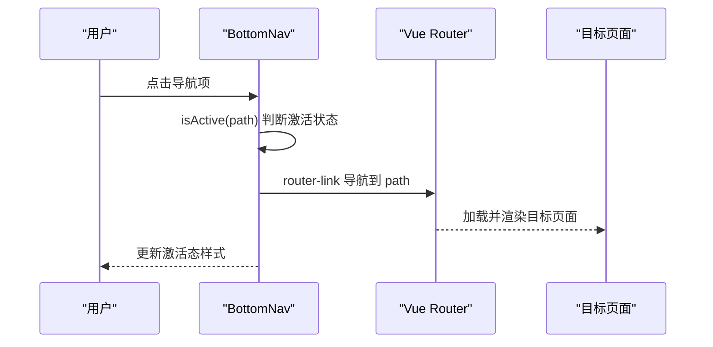
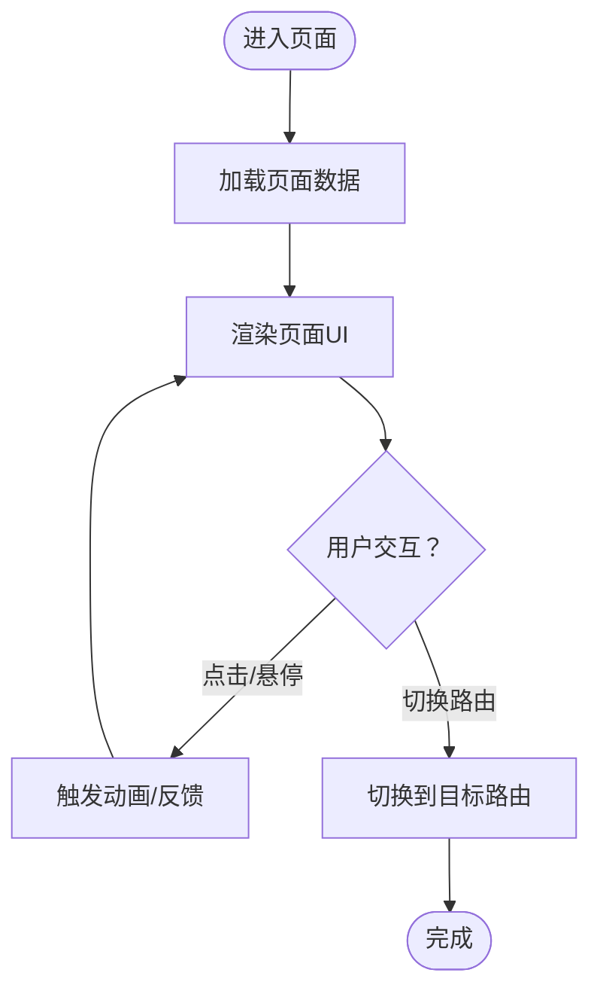
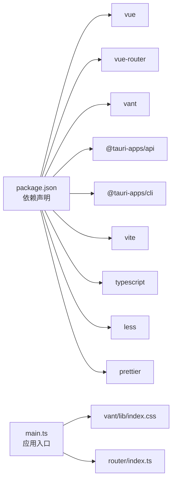

# 移动端组件库

<cite>
**本文引用的文件**
- [apps/mobile/src/components/BottomNav/index.vue](file://apps/mobile/src/components/BottomNav/index.vue)
- [apps/mobile/src/App.vue](file://apps/mobile/src/App.vue)
- [apps/mobile/src/main.ts](file://apps/mobile/src/main.ts)
- [apps/mobile/src/router/index.ts](file://apps/mobile/src/router/index.ts)
- [apps/mobile/package.json](file://apps/mobile/package.json)
- [apps/mobile/vite.config.ts](file://apps/mobile/vite.config.ts)
- [apps/mobile/tsconfig.json](file://apps/mobile/tsconfig.json)
- [apps/mobile/src/pages/Home/index.vue](file://apps/mobile/src/pages/Home/index.vue)
- [apps/mobile/src/pages/Discover/index.vue](file://apps/mobile/src/pages/Discover/index.vue)
- [apps/mobile/src/pages/Profile/index.vue](file://apps/mobile/src/pages/Profile/index.vue)
- [apps/mobile/src/pages/Recommend/index.vue](file://apps/mobile/src/pages/Recommend/index.vue)
</cite>

## 目录
1. [简介](#简介)
2. [项目结构](#项目结构)
3. [核心组件](#核心组件)
4. [架构总览](#架构总览)
5. [详细组件分析](#详细组件分析)
6. [依赖关系分析](#依赖关系分析)
7. [性能考虑](#性能考虑)
8. [故障排查指南](#故障排查指南)
9. [结论](#结论)
10. [附录](#附录)

## 简介
本项目是一个基于 Vue3 + Vant + TypeScript + Less 的移动端应用，采用 Vite 构建工具，结合 Vant UI 组件库实现移动端组件库的集成与自定义组件开发。项目以路由驱动页面切换，并通过全局底部导航组件提供统一的导航体验。本文档围绕以下目标展开：移动端组件库的集成与自定义、底部导航组件的实现原理与样式定制、交互逻辑与触摸反馈、设计规范与响应式布局、安装配置与主题定制、按需引入策略、性能优化与兼容性处理、以及用户体验提升的技术细节。

## 项目结构
移动端应用位于 apps/mobile 目录，主要由以下层次构成：
- 应用入口与全局样式：main.ts、App.vue
- 路由配置：router/index.ts
- 页面组件：Home、Discover、Profile、Recommend
- 自定义组件：BottomNav（底部导航）
- 构建与配置：package.json、vite.config.ts、tsconfig.json

**图表来源**
- [apps/mobile/src/main.ts:1-9](file://apps/mobile/src/main.ts#L1-L9)
- [apps/mobile/src/App.vue:1-62](file://apps/mobile/src/App.vue#L1-L62)
- [apps/mobile/src/router/index.ts:1-33](file://apps/mobile/src/router/index.ts#L1-L33)
- [apps/mobile/src/pages/Home/index.vue:1-600](file://apps/mobile/src/pages/Home/index.vue#L1-L600)
- [apps/mobile/src/pages/Discover/index.vue:1-529](file://apps/mobile/src/pages/Discover/index.vue#L1-L529)
- [apps/mobile/src/pages/Profile/index.vue:1-626](file://apps/mobile/src/pages/Profile/index.vue#L1-L626)
- [apps/mobile/src/pages/Recommend/index.vue:1-459](file://apps/mobile/src/pages/Recommend/index.vue#L1-L459)
- [apps/mobile/src/components/BottomNav/index.vue:1-145](file://apps/mobile/src/components/BottomNav/index.vue#L1-L145)

**章节来源**
- [apps/mobile/src/main.ts:1-9](file://apps/mobile/src/main.ts#L1-L9)
- [apps/mobile/src/App.vue:1-62](file://apps/mobile/src/App.vue#L1-L62)
- [apps/mobile/src/router/index.ts:1-33](file://apps/mobile/src/router/index.ts#L1-L33)
- [apps/mobile/package.json:1-37](file://apps/mobile/package.json#L1-L37)
- [apps/mobile/vite.config.ts:1-31](file://apps/mobile/vite.config.ts#L1-L31)
- [apps/mobile/tsconfig.json:1-28](file://apps/mobile/tsconfig.json#L1-L28)

## 核心组件
- 底部导航组件 BottomNav：基于 Vue Router 的导航项集合，支持图标与文字展示、激活态样式、悬停与按下反馈、安全区域适配等。
- 页面组件：Home（信息流）、Discover（发现）、Profile（个人中心）、Recommend（匹配推荐），均采用暗色主题与渐变背景，强调卡片化布局与触摸反馈。
- 全局应用容器 App.vue：根据当前路由动态决定是否渲染底部导航，提供页面切换过渡动画。

**章节来源**
- [apps/mobile/src/components/BottomNav/index.vue:1-145](file://apps/mobile/src/components/BottomNav/index.vue#L1-L145)
- [apps/mobile/src/App.vue:1-62](file://apps/mobile/src/App.vue#L1-L62)
- [apps/mobile/src/pages/Home/index.vue:1-600](file://apps/mobile/src/pages/Home/index.vue#L1-L600)
- [apps/mobile/src/pages/Discover/index.vue:1-529](file://apps/mobile/src/pages/Discover/index.vue#L1-L529)
- [apps/mobile/src/pages/Profile/index.vue:1-626](file://apps/mobile/src/pages/Profile/index.vue#L1-L626)
- [apps/mobile/src/pages/Recommend/index.vue:1-459](file://apps/mobile/src/pages/Recommend/index.vue#L1-L459)

## 架构总览
移动端应用采用“路由驱动 + 组件化”的架构模式：
- 路由层：集中管理页面路径与懒加载组件
- 视图层：各页面组件负责内容与交互
- 导航层：底部导航组件在特定路由下显示，提供统一的导航体验
- 样式层：全局基础样式 + 页面级 scoped 样式，配合 Less 预处理器

**图表来源**
- [apps/mobile/src/router/index.ts:1-33](file://apps/mobile/src/router/index.ts#L1-L33)
- [apps/mobile/src/App.vue:1-62](file://apps/mobile/src/App.vue#L1-L62)
- [apps/mobile/src/components/BottomNav/index.vue:1-145](file://apps/mobile/src/components/BottomNav/index.vue#L1-L145)
- [apps/mobile/src/pages/Home/index.vue:1-600](file://apps/mobile/src/pages/Home/index.vue#L1-L600)
- [apps/mobile/src/pages/Discover/index.vue:1-529](file://apps/mobile/src/pages/Discover/index.vue#L1-L529)
- [apps/mobile/src/pages/Profile/index.vue:1-626](file://apps/mobile/src/pages/Profile/index.vue#L1-L626)
- [apps/mobile/src/pages/Recommend/index.vue:1-459](file://apps/mobile/src/pages/Recommend/index.vue#L1-L459)

## 详细组件分析

### 底部导航组件 BottomNav
- 数据结构：NavItem 接口包含名称、路径、普通图标与激活图标；通过 navItems 数组维护导航项列表。
- 激活判断：isActive 方法根据当前路由路径判断激活状态，首页使用精确匹配，其他路径使用前缀匹配。
- 图标与颜色：使用 SVG 路径绘制图标，通过填充色区分激活与非激活状态；支持 hover 缩放与 active 按下缩放反馈。
- 布局与样式：固定定位于底部，使用 Flex 布局均分空间，背景模糊与阴影增强视觉层次，适配安全区域。
- 交互逻辑：点击导航项通过 router-link 切换路由，同时根据激活状态更新图标与文字颜色。

**图表来源**
- [apps/mobile/src/components/BottomNav/index.vue:1-145](file://apps/mobile/src/components/BottomNav/index.vue#L1-L145)

**图表来源**
- [apps/mobile/src/components/BottomNav/index.vue:44-49](file://apps/mobile/src/components/BottomNav/index.vue#L44-L49)
- [apps/mobile/src/router/index.ts:1-33](file://apps/mobile/src/router/index.ts#L1-L33)

**章节来源**
- [apps/mobile/src/components/BottomNav/index.vue:1-145](file://apps/mobile/src/components/BottomNav/index.vue#L1-L145)
- [apps/mobile/src/router/index.ts:1-33](file://apps/mobile/src/router/index.ts#L1-L33)

### 页面组件设计与交互
- Home（信息流）：采用暗色主题与渐变背景，头部支持搜索与消息徽标，故事栏横向滚动，信息流卡片支持点赞动画与悬停反馈。
- Discover（发现）：搜索框聚焦态高亮，网格布局的兴趣话题与频道卡片，活动卡片支持参与按钮与徽标。
- Profile（个人中心）：用户信息卡片、统计栏、快捷设置开关、菜单项与内容网格，支持标签页切换与内容悬停遮罩。
- Recommend（匹配推荐）：分类筛选、用户卡片、在线状态点、匹配度徽章、左右滑动操作按钮。

**图表来源**
- [apps/mobile/src/pages/Home/index.vue:1-600](file://apps/mobile/src/pages/Home/index.vue#L1-L600)
- [apps/mobile/src/pages/Discover/index.vue:1-529](file://apps/mobile/src/pages/Discover/index.vue#L1-L529)
- [apps/mobile/src/pages/Profile/index.vue:1-626](file://apps/mobile/src/pages/Profile/index.vue#L1-L626)
- [apps/mobile/src/pages/Recommend/index.vue:1-459](file://apps/mobile/src/pages/Recommend/index.vue#L1-L459)

**章节来源**
- [apps/mobile/src/pages/Home/index.vue:1-600](file://apps/mobile/src/pages/Home/index.vue#L1-L600)
- [apps/mobile/src/pages/Discover/index.vue:1-529](file://apps/mobile/src/pages/Discover/index.vue#L1-L529)
- [apps/mobile/src/pages/Profile/index.vue:1-626](file://apps/mobile/src/pages/Profile/index.vue#L1-L626)
- [apps/mobile/src/pages/Recommend/index.vue:1-459](file://apps/mobile/src/pages/Recommend/index.vue#L1-L459)

## 依赖关系分析
- 运行时依赖：Vue3、Vue Router、Vant UI、@tauri-apps/api 等
- 构建与开发：Vite、TypeScript、Less、Prettier 等
- 样式与主题：全局基础样式 + 页面 scoped 样式，Vant 样式按需引入

**图表来源**
- [apps/mobile/package.json:1-37](file://apps/mobile/package.json#L1-L37)
- [apps/mobile/src/main.ts:1-9](file://apps/mobile/src/main.ts#L1-L9)
- [apps/mobile/src/router/index.ts:1-33](file://apps/mobile/src/router/index.ts#L1-L33)

**章节来源**
- [apps/mobile/package.json:1-37](file://apps/mobile/package.json#L1-L37)
- [apps/mobile/src/main.ts:1-9](file://apps/mobile/src/main.ts#L1-L9)

## 性能考虑
- 路由懒加载：页面组件通过动态导入实现按需加载，减少首屏体积。
- 动画与过渡：使用 CSS 动画与过渡，避免 JavaScript 驱动的复杂动画，降低主线程压力。
- 图片与网格：卡片网格采用 object-fit 与 hover 缩放，注意图片尺寸与缓存策略。
- 样式优化：scoped 样式减少全局污染，Less 变量与混合提升复用性。
- 构建优化：Vite 提供快速冷启动与热更新，tsconfig 严格模式减少运行时错误。

[本节为通用性能建议，不直接分析具体文件]

## 故障排查指南
- 路由不生效或导航异常：检查路由配置与路径是否一致，确认 BottomNav 的 isActive 判断逻辑。
- 样式未生效：确认 vant 样式已正确引入，scoped 样式作用域是否覆盖目标元素。
- 构建失败：检查 tsconfig 与 vite.config 中的路径别名与预处理器配置。
- 主题与颜色：如需自定义主题，可在页面样式中覆盖变量或引入主题文件。

**章节来源**
- [apps/mobile/src/router/index.ts:1-33](file://apps/mobile/src/router/index.ts#L1-L33)
- [apps/mobile/src/main.ts:1-9](file://apps/mobile/src/main.ts#L1-L9)
- [apps/mobile/tsconfig.json:1-28](file://apps/mobile/tsconfig.json#L1-L28)
- [apps/mobile/vite.config.ts:1-31](file://apps/mobile/vite.config.ts#L1-L31)

## 结论
本项目以 Vant UI 为基础，结合 Vue Router 实现了移动端组件库的集成与自定义组件开发。底部导航组件通过简洁的数据结构与路由联动，提供了稳定的导航体验；页面组件采用统一的暗色主题与卡片化布局，强调交互反馈与视觉层次。通过路由懒加载、CSS 动画与构建优化，整体具备良好的性能与可维护性。后续可在主题定制、按需引入与组件扩展方面进一步完善。

[本节为总结性内容，不直接分析具体文件]

## 附录

### 安装与配置
- 安装依赖：使用包管理器安装项目依赖
- 启动开发：运行开发服务器，访问本地端口
- 构建产物：生成生产环境静态资源
- Tauri 集成：可通过脚本调用 Tauri CLI 进行桌面端打包

**章节来源**
- [apps/mobile/package.json:1-37](file://apps/mobile/package.json#L1-L37)
- [apps/mobile/src/main.ts:1-9](file://apps/mobile/src/main.ts#L1-L9)

### 主题定制与按需引入
- Vant 样式：在应用入口引入 Vant 样式文件，确保组件样式生效
- 页面样式：通过 Less 变量与混合实现主题定制，避免全局污染
- 按需引入：可结合构建工具进行按需引入，减少打包体积

**章节来源**
- [apps/mobile/src/main.ts:1-9](file://apps/mobile/src/main.ts#L1-L9)
- [apps/mobile/src/pages/Home/index.vue:258-600](file://apps/mobile/src/pages/Home/index.vue#L258-L600)
- [apps/mobile/src/pages/Discover/index.vue:219-529](file://apps/mobile/src/pages/Discover/index.vue#L219-L529)
- [apps/mobile/src/pages/Profile/index.vue:197-626](file://apps/mobile/src/pages/Profile/index.vue#L197-L626)
- [apps/mobile/src/pages/Recommend/index.vue:199-459](file://apps/mobile/src/pages/Recommend/index.vue#L199-L459)

### 设计规范与响应式布局
- 布局：Flex 布局与 Grid 布局结合，满足不同场景的响应式需求
- 触摸反馈：通过 hover、active 状态与动画提升交互体验
- 安全区域：底部导航适配安全区域，避免被系统栏遮挡

**章节来源**
- [apps/mobile/src/components/BottomNav/index.vue:83-145](file://apps/mobile/src/components/BottomNav/index.vue#L83-L145)
- [apps/mobile/src/pages/Home/index.vue:258-600](file://apps/mobile/src/pages/Home/index.vue#L258-L600)
- [apps/mobile/src/pages/Discover/index.vue:219-529](file://apps/mobile/src/pages/Discover/index.vue#L219-L529)
- [apps/mobile/src/pages/Profile/index.vue:197-626](file://apps/mobile/src/pages/Profile/index.vue#L197-L626)
- [apps/mobile/src/pages/Recommend/index.vue:199-459](file://apps/mobile/src/pages/Recommend/index.vue#L199-L459)