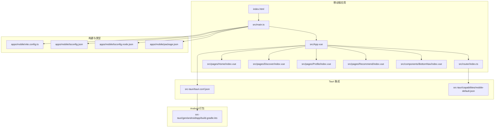
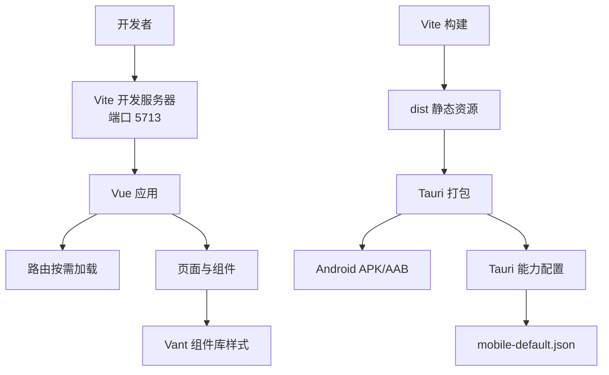
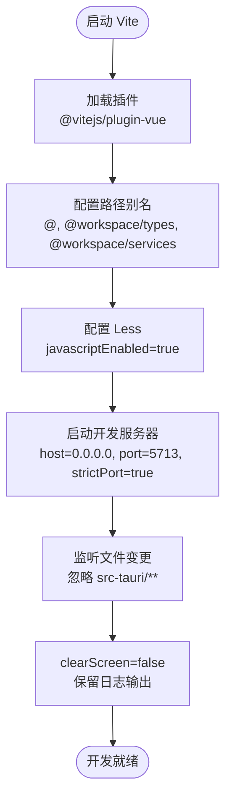
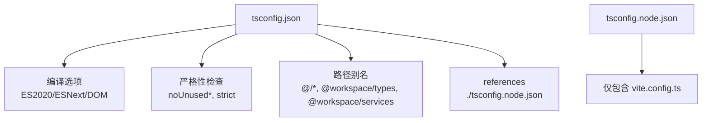
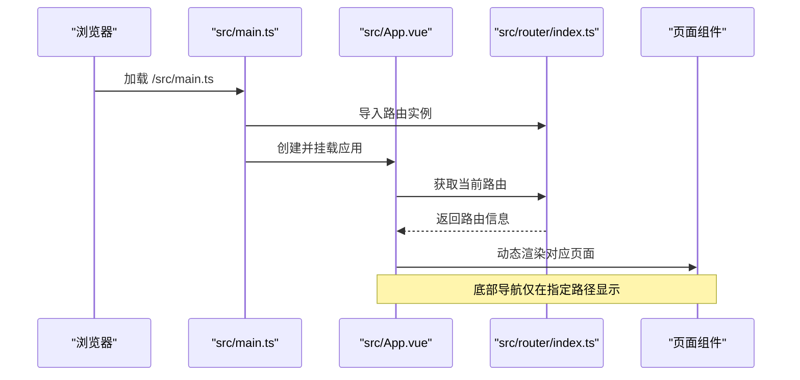
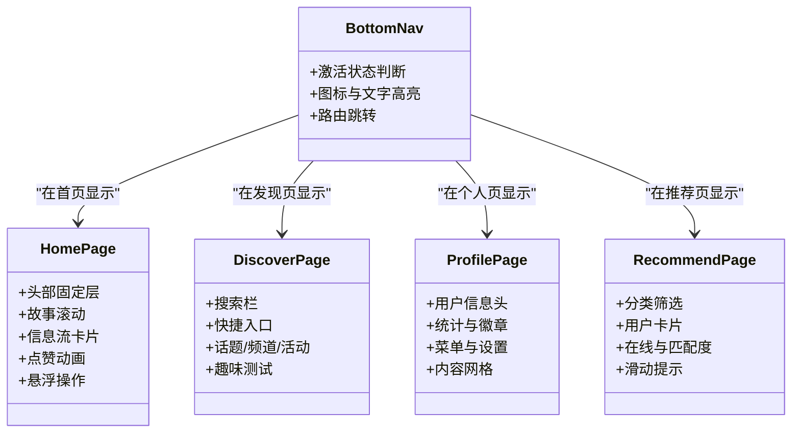
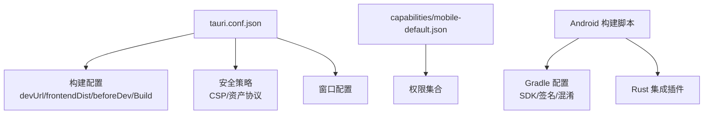
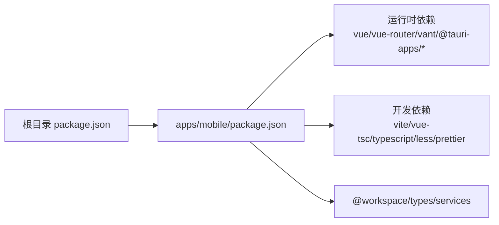

# 移动端配置

<cite>
**本文引用的文件**
- [apps/mobile/vite.config.ts](file://apps/mobile/vite.config.ts)
- [apps/mobile/tsconfig.json](file://apps/mobile/tsconfig.json)
- [apps/mobile/tsconfig.node.json](file://apps/mobile/tsconfig.node.json)
- [apps/mobile/package.json](file://apps/mobile/package.json)
- [apps/mobile/src/main.ts](file://apps/mobile/src/main.ts)
- [apps/mobile/src/App.vue](file://apps/mobile/src/App.vue)
- [apps/mobile/index.html](file://apps/mobile/index.html)
- [apps/mobile/src/router/index.ts](file://apps/mobile/src/router/index.ts)
- [apps/mobile/src/components/BottomNav/index.vue](file://apps/mobile/src/components/BottomNav/index.vue)
- [apps/mobile/src/pages/Home/index.vue](file://apps/mobile/src/pages/Home/index.vue)
- [apps/mobile/src/pages/Discover/index.vue](file://apps/mobile/src/pages/Discover/index.vue)
- [apps/mobile/src/pages/Profile/index.vue](file://apps/mobile/src/pages/Profile/index.vue)
- [apps/mobile/src/pages/Recommend/index.vue](file://apps/mobile/src/pages/Recommend/index.vue)
- [src-tauri/tauri.conf.json](file://src-tauri/tauri.conf.json)
- [src-tauri/capabilities/mobile-default.json](file://src-tauri/capabilities/mobile-default.json)
- [src-tauri/gen/android/app/build.gradle.kts](file://src-tauri/gen/android/app/build.gradle.kts)
- [package.json](file://package.json)
</cite>

## 目录

1. [简介](#简介)
2. [项目结构](#项目结构)
3. [核心组件](#核心组件)
4. [架构总览](#架构总览)
5. [详细组件分析](#详细组件分析)
6. [依赖关系分析](#依赖关系分析)
7. [性能考虑](#性能考虑)
8. [故障排查指南](#故障排查指南)
9. [结论](#结论)
10. [附录](#附录)

## 简介

本文件面向移动端应用的配置与工程化实践，围绕 Vite 构建配置、TypeScript 类型系统与路径别名、包依赖与脚本、移动端特有构建优化与资源处理、开发服务器与热重载、性能优化与代码分割、调试与错误处理、以及开发与生产环境的完整配置指南进行系统化梳理。内容以 apps/mobile 子应用为核心，结合 Tauri 能力与 Android 打包配置，给出可操作的配置说明与最佳实践。

## 项目结构

移动端应用位于 apps/mobile，采用 Vue3 + TypeScript + Vite 的前端技术栈，并通过 Tauri 将 Web 内容嵌入原生壳体（Android）。整体结构要点：

- 应用入口与路由：index.html、src/main.ts、src/App.vue、src/router/index.ts
- 页面与组件：src/pages/_、src/components/_
- 构建与类型：vite.config.ts、tsconfig.json、tsconfig.node.json、package.json
- Tauri 集成：src-tauri/tauri.conf.json、capabilities/mobile-default.json
- Android 打包：src-tauri/gen/android/app/build.gradle.kts

**图表来源**

- [apps/mobile/index.html](file://apps/mobile/index.html)
- [apps/mobile/src/main.ts](file://apps/mobile/src/main.ts)
- [apps/mobile/src/App.vue](file://apps/mobile/src/App.vue)
- [apps/mobile/src/router/index.ts](file://apps/mobile/src/router/index.ts)
- [apps/mobile/src/pages/Home/index.vue](file://apps/mobile/src/pages/Home/index.vue)
- [apps/mobile/src/pages/Discover/index.vue](file://apps/mobile/src/pages/Discover/index.vue)
- [apps/mobile/src/pages/Profile/index.vue](file://apps/mobile/src/pages/Profile/index.vue)
- [apps/mobile/src/pages/Recommend/index.vue](file://apps/mobile/src/pages/Recommend/index.vue)
- [apps/mobile/src/components/BottomNav/index.vue](file://apps/mobile/src/components/BottomNav/index.vue)
- [apps/mobile/vite.config.ts](file://apps/mobile/vite.config.ts)
- [apps/mobile/tsconfig.json](file://apps/mobile/tsconfig.json)
- [apps/mobile/tsconfig.node.json](file://apps/mobile/tsconfig.node.json)
- [apps/mobile/package.json](file://apps/mobile/package.json)
- [src-tauri/tauri.conf.json](file://src-tauri/tauri.conf.json)
- [src-tauri/capabilities/mobile-default.json](file://src-tauri/capabilities/mobile-default.json)
- [src-tauri/gen/android/app/build.gradle.kts](file://src-tauri/gen/android/app/build.gradle.kts)

**章节来源**

- [apps/mobile/index.html](file://apps/mobile/index.html)
- [apps/mobile/src/main.ts](file://apps/mobile/src/main.ts)
- [apps/mobile/src/App.vue](file://apps/mobile/src/App.vue)
- [apps/mobile/src/router/index.ts](file://apps/mobile/src/router/index.ts)
- [apps/mobile/vite.config.ts](file://apps/mobile/vite.config.ts)
- [apps/mobile/tsconfig.json](file://apps/mobile/tsconfig.json)
- [apps/mobile/tsconfig.node.json](file://apps/mobile/tsconfig.node.json)
- [apps/mobile/package.json](file://apps/mobile/package.json)
- [src-tauri/tauri.conf.json](file://src-tauri/tauri.conf.json)
- [src-tauri/capabilities/mobile-default.json](file://src-tauri/capabilities/mobile-default.json)
- [src-tauri/gen/android/app/build.gradle.kts](file://src-tauri/gen/android/app/build.gradle.kts)

## 核心组件

- Vite 构建配置
  - 插件与解析：启用 Vue 插件，配置路径别名（@、@workspace/types、@workspace/services），Less 预处理器开启 JavaScript 支持。
  - 开发服务器：端口 5713、host 绑定 0.0.0.0、严格端口、忽略 src-tauri 目录监听。
  - 屏幕清理：关闭默认清屏行为，便于在终端中保留日志。
- TypeScript 配置
  - 编译目标与模块：ES2020、ESNext 模块、DOM/DOM.Iterable 库。
  - 路径别名：与 Vite 一致，支持 TS 与 Vite 共享别名。
  - 严格性：严格模式、未使用变量/参数检查、switch 不穷举检查。
  - 双 tsconfig：tsconfig.json（应用）与 tsconfig.node.json（Vite 配置）。
- 包与脚本
  - 依赖：Vue3、Vue Router、Vant、@tauri-apps/api、工作区包 @workspace/types 与 @workspace/services。
  - 脚本：dev、build、preview、tauri、tauri:dev、tauri:build、format。
- 应用入口与路由
  - 入口：创建 Vue 应用、挂载路由、引入 Vant 样式。
  - 路由：history 创建、动态导入页面组件、底部导航仅在特定路径显示。

**章节来源**

- [apps/mobile/vite.config.ts](file://apps/mobile/vite.config.ts)
- [apps/mobile/tsconfig.json](file://apps/mobile/tsconfig.json)
- [apps/mobile/tsconfig.node.json](file://apps/mobile/tsconfig.node.json)
- [apps/mobile/package.json](file://apps/mobile/package.json)
- [apps/mobile/src/main.ts](file://apps/mobile/src/main.ts)
- [apps/mobile/src/router/index.ts](file://apps/mobile/src/router/index.ts)

## 架构总览

移动端应用通过 Vite 提供开发与构建能力，TypeScript 提供类型安全，路由按需加载页面组件；Tauri 将 Web 内容嵌入原生壳体，Android 打包配置定义 SDK、签名与混淆策略。开发时，Vite 监听前端变更并热更新；生产时，Vite 输出静态资源，Tauri 打包为原生应用。

**图表来源**

- [apps/mobile/vite.config.ts](file://apps/mobile/vite.config.ts)
- [apps/mobile/src/main.ts](file://apps/mobile/src/main.ts)
- [apps/mobile/src/router/index.ts](file://apps/mobile/src/router/index.ts)
- [src-tauri/tauri.conf.json](file://src-tauri/tauri.conf.json)
- [src-tauri/capabilities/mobile-default.json](file://src-tauri/capabilities/mobile-default.json)
- [src-tauri/gen/android/app/build.gradle.kts](file://src-tauri/gen/android/app/build.gradle.kts)

## 详细组件分析

### Vite 构建配置分析

- 插件体系
  - @vitejs/plugin-vue：支持 .vue 单文件组件编译与热重载。
- 路径别名
  - @ -> src，@workspace/types 与 @workspace/services 指向工作区包，便于跨应用共享类型与服务。
- CSS 预处理
  - Less 启用 javascriptEnabled，允许在样式中使用 JS 表达式。
- 开发服务器
  - host: "0.0.0.0" 使宿主机外可访问；strictPort: true 防止端口冲突；watch.ignored 忽略 Tauri 目录避免误触发。
- 屏幕清理
  - clearScreen: false 保持终端输出连续，便于同时观察 Vite 与 Tauri 日志。

**图表来源**

- [apps/mobile/vite.config.ts](file://apps/mobile/vite.config.ts)

**章节来源**

- [apps/mobile/vite.config.ts](file://apps/mobile/vite.config.ts)

### TypeScript 配置分析

- 编译选项
  - 目标与模块：ES2020 + ESNext，利于现代浏览器特性与 Tree-shaking。
  - 库：DOM 与 DOM.Iterable，满足前端运行时 API。
  - 解析器：bundler，与 Vite/VitePress 等现代工具链兼容。
  - JSX：preserve，配合 Vue SFC 与 TS。
- 严格性与检查
  - 严格模式、未使用检查、switch 穷举，提升代码质量。
- 路径映射
  - 与 Vite 一致，确保 TS 与 Vite 使用相同别名。
- 双 tsconfig
  - tsconfig.json 面向应用，tsconfig.node.json 仅包含 vite.config.ts，避免类型污染。

**图表来源**

- [apps/mobile/tsconfig.json](file://apps/mobile/tsconfig.json)
- [apps/mobile/tsconfig.node.json](file://apps/mobile/tsconfig.node.json)

**章节来源**

- [apps/mobile/tsconfig.json](file://apps/mobile/tsconfig.json)
- [apps/mobile/tsconfig.node.json](file://apps/mobile/tsconfig.node.json)

### 应用入口与路由分析

- 入口
  - 创建 Vue 应用、注册路由、挂载到 #app；引入 Vant 样式以保证移动端 UI 基础样式可用。
- 路由
  - 使用 createWebHistory；页面组件通过动态导入实现按需加载；底部导航仅在首页、推荐、发现、个人页显示。

**图表来源**

- [apps/mobile/src/main.ts](file://apps/mobile/src/main.ts)
- [apps/mobile/src/App.vue](file://apps/mobile/src/App.vue)
- [apps/mobile/src/router/index.ts](file://apps/mobile/src/router/index.ts)

**章节来源**

- [apps/mobile/src/main.ts](file://apps/mobile/src/main.ts)
- [apps/mobile/src/App.vue](file://apps/mobile/src/App.vue)
- [apps/mobile/src/router/index.ts](file://apps/mobile/src/router/index.ts)

### 移动端页面与组件分析

- 底部导航
  - 固定定位、毛玻璃背景、安全区域适配；根据当前路由高亮图标与文字；点击切换路由。
- 主页 Feed
  - 头部固定层、故事栏横向滚动、信息流卡片、点赞动画、悬浮操作按钮等移动端常用交互。
- 发现页
  - 搜索栏、快捷入口网格、话题卡片、兴趣频道网格、活动列表、趣味测试横幅。
- 个人页
  - 用户信息头、统计栏、徽章、菜单项、设置开关、内容网格（瞬间/相册/收藏）。
- 推荐页
  - 分类筛选、用户卡片网格、在线状态、匹配度徽章、左右滑动交互提示。

**图表来源**

- [apps/mobile/src/components/BottomNav/index.vue](file://apps/mobile/src/components/BottomNav/index.vue)
- [apps/mobile/src/pages/Home/index.vue](file://apps/mobile/src/pages/Home/index.vue)
- [apps/mobile/src/pages/Discover/index.vue](file://apps/mobile/src/pages/Discover/index.vue)
- [apps/mobile/src/pages/Profile/index.vue](file://apps/mobile/src/pages/Profile/index.vue)
- [apps/mobile/src/pages/Recommend/index.vue](file://apps/mobile/src/pages/Recommend/index.vue)

**章节来源**

- [apps/mobile/src/components/BottomNav/index.vue](file://apps/mobile/src/components/BottomNav/index.vue)
- [apps/mobile/src/pages/Home/index.vue](file://apps/mobile/src/pages/Home/index.vue)
- [apps/mobile/src/pages/Discover/index.vue](file://apps/mobile/src/pages/Discover/index.vue)
- [apps/mobile/src/pages/Profile/index.vue](file://apps/mobile/src/pages/Profile/index.vue)
- [apps/mobile/src/pages/Recommend/index.vue](file://apps/mobile/src/pages/Recommend/index.vue)

### Tauri 集成与 Android 打包

- Tauri 配置
  - 产品名称、版本、标识符、构建前后端 URL、安全策略（CSP）、资产协议作用域、窗口配置。
- 能力配置
  - mobile-default.json 定义移动端窗口、事件监听、对话框权限集合。
- Android 打包
  - compileSdk/targetSdk/minSdk、签名配置、构建类型（debug/release）、混淆与压缩、Kotlin 目标版本、Rust 集成插件。

**图表来源**

- [src-tauri/tauri.conf.json](file://src-tauri/tauri.conf.json)
- [src-tauri/capabilities/mobile-default.json](file://src-tauri/capabilities/mobile-default.json)
- [src-tauri/gen/android/app/build.gradle.kts](file://src-tauri/gen/android/app/build.gradle.kts)

**章节来源**

- [src-tauri/tauri.conf.json](file://src-tauri/tauri.conf.json)
- [src-tauri/capabilities/mobile-default.json](file://src-tauri/capabilities/mobile-default.json)
- [src-tauri/gen/android/app/build.gradle.kts](file://src-tauri/gen/android/app/build.gradle.kts)

## 依赖关系分析

- 工作区脚本
  - 顶层 package.json 提供统一开发与构建命令，包括移动端应用的 dev:mobile、build:mobile。
- 移动端依赖
  - 运行时：vue、vue-router、vant、@tauri-apps/api、工作区 types/services。
  - 开发时：@vitejs/plugin-vue、vite、vue-tsc、typescript、less、prettier 生态。
- 跨应用共享
  - 通过 @workspace/types 与 @workspace/services 的 workspace:\* 引用，实现类型与服务共享。

**图表来源**

- [package.json](file://package.json)
- [apps/mobile/package.json](file://apps/mobile/package.json)

**章节来源**

- [package.json](file://package.json)
- [apps/mobile/package.json](file://apps/mobile/package.json)

## 性能考虑

- 代码分割与懒加载
  - 路由级动态导入已实现页面级别的按需加载，建议继续对大型组件或第三方库进行细粒度拆分。
- 构建优化
  - Vite 默认启用 Tree-shaking；可在生产构建中结合 Tauri 打包的资源裁剪进一步减少体积。
- 资源处理
  - 图片与媒体建议使用响应式尺寸与格式（如 WebP），并在 Android 打包阶段启用压缩与混淆。
- CSS 与 UI
  - Vant 样式按需引入可减少体积；Less 中的 javascriptEnabled 仅在必要时启用，避免复杂计算影响构建速度。
- 开发体验
  - clearScreen: false 便于同时观察 Vite 与 Tauri 日志；host: "0.0.0.0" 便于多设备联调。

[本节为通用性能建议，不直接分析具体文件，故无“章节来源”]

## 故障排查指南

- 端口占用
  - 若端口 5713 被占用，调整 vite.config.ts 中的 port 或关闭占用进程。
- 热重载失效
  - 检查 ignored 规则是否误排除了需要监听的目录；确认 host 与网络访问权限。
- 路由跳转异常
  - 确认路由 history 与动态导入路径正确；检查 App.vue 中的底部导航显示逻辑。
- Tauri 权限问题
  - 检查 capabilities/mobile-default.json 的权限声明与实际调用 API 是否匹配。
- Android 打包失败
  - 检查签名配置、minSdk/targetSdk 与构建类型；确认 Rust 插件与 Kotlin 版本兼容。

**章节来源**

- [apps/mobile/vite.config.ts](file://apps/mobile/vite.config.ts)
- [apps/mobile/src/App.vue](file://apps/mobile/src/App.vue)
- [apps/mobile/src/router/index.ts](file://apps/mobile/src/router/index.ts)
- [src-tauri/capabilities/mobile-default.json](file://src-tauri/capabilities/mobile-default.json)
- [src-tauri/gen/android/app/build.gradle.kts](file://src-tauri/gen/android/app/build.gradle.kts)

## 结论

移动端应用在本仓库中采用现代化前端工程化方案：Vite 提供高效开发与构建，TypeScript 确保类型安全，路由按需加载优化首屏性能，Tauri 实现跨平台原生集成。通过合理的别名、严格的 TS 配置、清晰的依赖与脚本组织，以及 Android 打包策略，可稳定支撑移动端应用的开发与交付。建议持续优化代码分割、资源压缩与缓存策略，以获得更佳的用户体验。

[本节为总结性内容，不直接分析具体文件，故无“章节来源”]

## 附录

- 开发环境搭建
  - 安装 Node.js 与 pnpm（版本要求见根目录 package.json）。
  - 在根目录执行安装后，使用 pnpm dev:mobile 启动移动端开发服务器。
- 生产构建
  - 使用 pnpm build:mobile 生成 dist 静态资源；随后通过 Tauri CLI 打包为原生应用。
- 调试与日志
  - Vite 清屏关闭便于同时观察控制台输出；Android 打包时可启用 debuggable 与 JNI 符号保留以便调试。

**章节来源**

- [package.json](file://package.json)
- [apps/mobile/package.json](file://apps/mobile/package.json)
