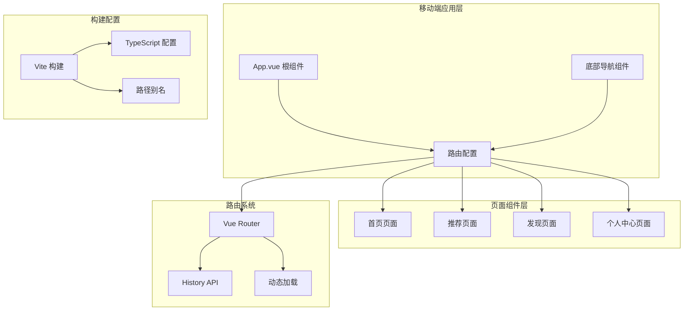
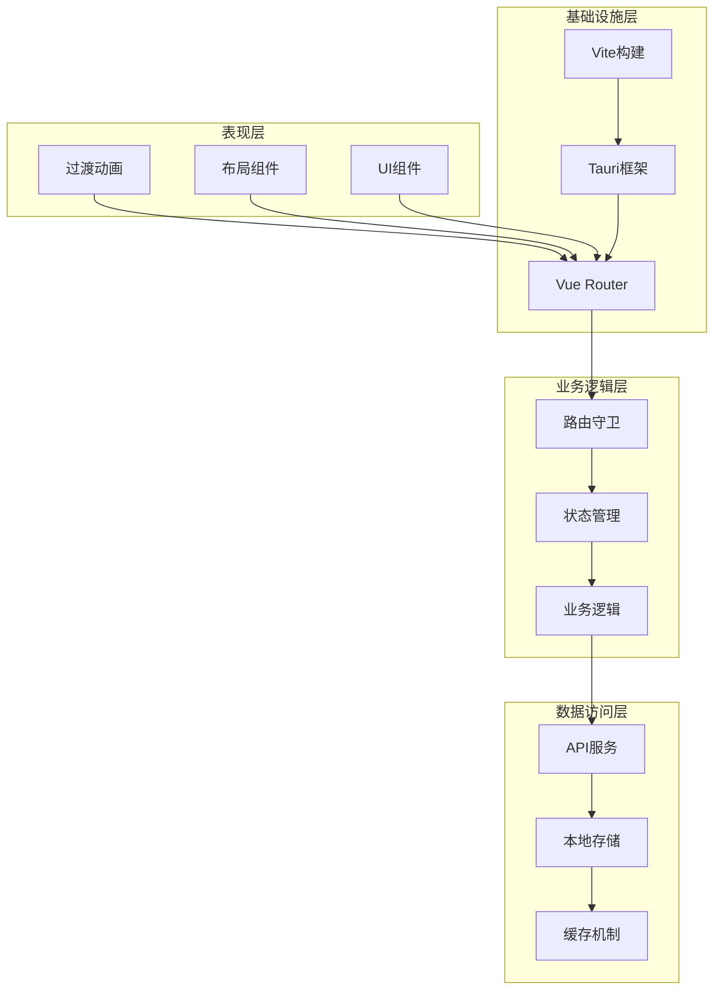
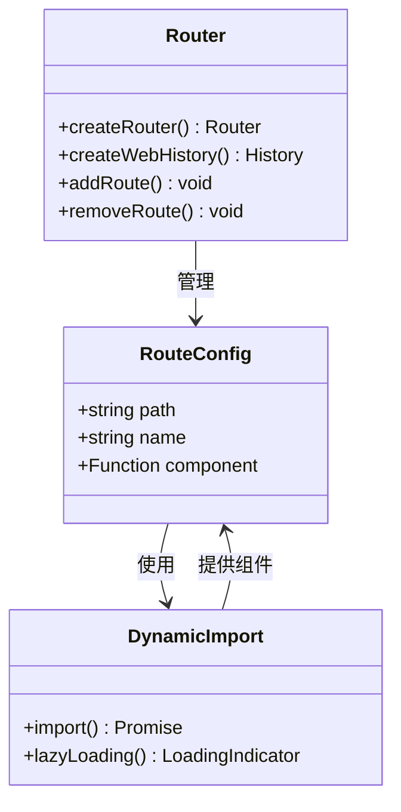
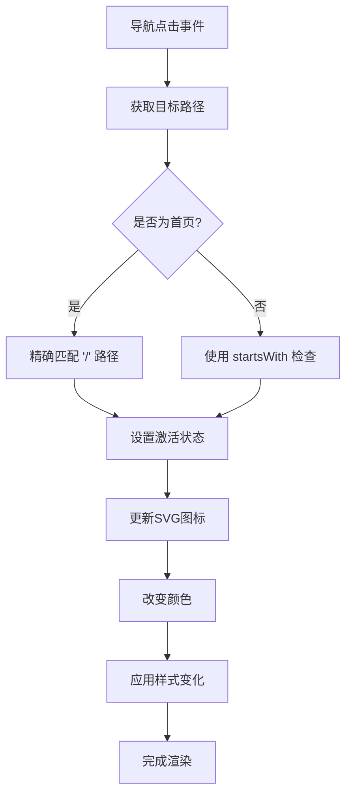
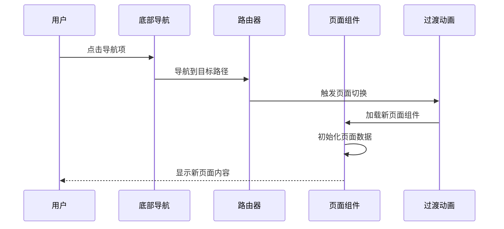

# 路由导航系统

<cite>
**本文档引用的文件**
- [apps/mobile/src/router/index.ts](file://apps/mobile/src/router/index.ts)
- [apps/mobile/src/App.vue](file://apps/mobile/src/App.vue)
- [apps/mobile/src/main.ts](file://apps/mobile/src/main.ts)
- [apps/mobile/src/components/BottomNav/index.vue](file://apps/mobile/src/components/BottomNav/index.vue)
- [apps/mobile/src/pages/Home/index.vue](file://apps/mobile/src/pages/Home/index.vue)
- [apps/mobile/src/pages/Recommend/index.vue](file://apps/mobile/src/pages/Recommend/index.vue)
- [apps/mobile/src/pages/Discover/index.vue](file://apps/mobile/src/pages/Discover/index.vue)
- [apps/mobile/src/pages/Profile/index.vue](file://apps/mobile/src/pages/Profile/index.vue)
- [apps/mobile/vite.config.ts](file://apps/mobile/vite.config.ts)
- [apps/mobile/package.json](file://apps/mobile/package.json)
- [apps/mobile/tsconfig.json](file://apps/mobile/tsconfig.json)
- [apps/pc/src/utils/routeGuard.ts](file://apps/pc/src/utils/routeGuard.ts)
- [apps/pc/src/app.ts](file://apps/pc/src/app.ts)
- [src-tauri/tauri.conf.json](file://src-tauri/tauri.conf.json)
</cite>

## 目录
1. [简介](#简介)
2. [项目结构](#项目结构)
3. [核心组件](#核心组件)
4. [架构概览](#架构概览)
5. [详细组件分析](#详细组件分析)
6. [依赖关系分析](#依赖关系分析)
7. [性能考虑](#性能考虑)
8. [故障排除指南](#故障排除指南)
9. [结论](#结论)

## 简介

本项目是一个基于 Vue Router 的移动端路由导航系统，采用现代化的前端技术栈构建。系统集成了 Vue 3、TypeScript、Vant UI 组件库和 Tauri 框架，为移动设备提供了流畅的路由导航体验。

该路由系统具有以下特点：
- 基于 Vue Router 4 的现代路由配置
- 移动端专用的底部导航栏设计
- 动态路由加载和懒加载机制
- 响应式页面布局和过渡动画
- 与 Tauri 框架的无缝集成

## 项目结构

移动端路由导航系统的整体架构采用模块化设计，主要分为以下几个核心部分：



**图表来源**
- [apps/mobile/src/router/index.ts:1-33](file://apps/mobile/src/router/index.ts#L1-L33)
- [apps/mobile/src/App.vue:1-62](file://apps/mobile/src/App.vue#L1-L62)
- [apps/mobile/src/main.ts:1-9](file://apps/mobile/src/main.ts#L1-L9)

**章节来源**
- [apps/mobile/src/router/index.ts:1-33](file://apps/mobile/src/router/index.ts#L1-L33)
- [apps/mobile/src/App.vue:1-62](file://apps/mobile/src/App.vue#L1-L62)
- [apps/mobile/src/main.ts:1-9](file://apps/mobile/src/main.ts#L1-L9)

## 核心组件

### 路由配置系统

路由系统采用 Vue Router 4 的现代配置方式，支持动态导入和懒加载机制。路由配置简洁明了，每个路由都指向对应的页面组件。

### 应用根组件

App.vue 作为整个应用的根组件，负责：
- 管理全局样式和主题
- 控制底部导航栏的显示和隐藏
- 实现页面切换的过渡动画
- 管理应用容器的布局结构

### 底部导航组件

底部导航组件是移动端路由系统的核心交互元素，提供四个主要页面的快速导航：
- 首页 (/)
- 推荐 (/recommend)
- 发现 (/discover)
- 我的 (/profile)

**章节来源**
- [apps/mobile/src/router/index.ts:4-25](file://apps/mobile/src/router/index.ts#L4-L25)
- [apps/mobile/src/App.vue:8-21](file://apps/mobile/src/App.vue#L8-L21)
- [apps/mobile/src/components/BottomNav/index.vue:13-42](file://apps/mobile/src/components/BottomNav/index.vue#L13-L42)

## 架构概览

移动端路由导航系统采用分层架构设计，确保了良好的可维护性和扩展性：



**图表来源**
- [apps/mobile/src/App.vue:15-19](file://apps/mobile/src/App.vue#L15-L19)
- [apps/mobile/src/components/BottomNav/index.vue:57-79](file://apps/mobile/src/components/BottomNav/index.vue#L57-L79)
- [apps/mobile/src/main.ts:6-8](file://apps/mobile/src/main.ts#L6-L8)

## 详细组件分析

### 路由配置组件分析

路由配置采用模块化的设计，每个路由都包含路径、名称和组件定义。系统使用动态导入来实现懒加载，提高应用启动性能。



**图表来源**
- [apps/mobile/src/router/index.ts:4-25](file://apps/mobile/src/router/index.ts#L4-L25)

**章节来源**
- [apps/mobile/src/router/index.ts:1-33](file://apps/mobile/src/router/index.ts#L1-L33)

### 底部导航组件深度分析

底部导航组件实现了移动端特有的导航模式，具有以下特性：

#### 导航项配置
- 四个主要导航项：首页、推荐、发现、我的
- 每个导航项包含图标、激活状态图标和显示名称
- 支持 SVG 图标的动态切换

#### 激活状态管理
- 基于路由路径的激活状态判断
- 首页路径的特殊处理逻辑
- 支持嵌套路径的激活状态检测

#### 视觉反馈系统
- 激活状态的颜色变化（紫色激活，灰色未激活）
- 图标和文字的统一视觉风格
- 移动端友好的触摸反馈效果



**图表来源**
- [apps/mobile/src/components/BottomNav/index.vue:44-49](file://apps/mobile/src/components/BottomNav/index.vue#L44-L49)

**章节来源**
- [apps/mobile/src/components/BottomNav/index.vue:1-145](file://apps/mobile/src/components/BottomNav/index.vue#L1-L145)

### 页面组件架构分析

#### 首页页面 (Home)
首页页面实现了复杂的信息流展示，包含故事卡片和动态内容区域。

##### 数据结构设计
- Story 接口：用户故事数据模型
- Post 接口：动态内容数据模型
- 响应式数据管理

##### 交互功能
- 点赞功能的实时状态更新
- 动态内容的响应式布局
- 用户头像的在线状态显示

#### 推荐页面 (Recommend)
推荐页面专注于用户匹配和社交功能。

##### 用户数据模型
- RecommendUser 接口：推荐用户的完整信息
- 支持多种用户标签和属性
- 匹配度计算和可视化

##### 分类筛选系统
- 多种用户分类：全部、附近、新入驻、高匹配、有趣
- 动态分类切换状态
- 实时数据过滤

#### 发现页面 (Discover)
发现页面提供内容探索和社区功能。

##### 内容组织结构
- 热门话题网格布局
- 兴趣频道卡片系统
- 即时活动列表展示

##### 快速操作功能
- 语音匹配功能
- 灵魂测试入口
- 兴趣星球探索
- 万人广场参与

#### 个人中心页面 (Profile)
个人中心页面整合了用户信息和设置功能。

##### 用户信息展示
- 详细的个人信息面板
- 统计数据的可视化展示
- 徽章系统的实现

##### 设置和菜单系统
- 快速设置开关
- 功能菜单的组织
- 退出登录的安全机制



**图表来源**
- [apps/mobile/src/components/BottomNav/index.vue:57-79](file://apps/mobile/src/components/BottomNav/index.vue#L57-L79)
- [apps/mobile/src/App.vue:15-19](file://apps/mobile/src/App.vue#L15-L19)

**章节来源**
- [apps/mobile/src/pages/Home/index.vue:1-600](file://apps/mobile/src/pages/Home/index.vue#L1-L600)
- [apps/mobile/src/pages/Recommend/index.vue:1-459](file://apps/mobile/src/pages/Recommend/index.vue#L1-L459)
- [apps/mobile/src/pages/Discover/index.vue:1-529](file://apps/mobile/src/pages/Discover/index.vue#L1-L529)
- [apps/mobile/src/pages/Profile/index.vue:1-626](file://apps/mobile/src/pages/Profile/index.vue#L1-L626)

### 构建配置系统

#### Vite 构建配置
- 别名配置：@ 指向 src 目录，@workspace/types 和 @workspace/services 指向工作区包
- TypeScript 支持：完整的类型检查和智能提示
- CSS 预处理器：Less 支持和 JavaScript 启用
- 开发服务器：热重载和远程访问支持

#### 依赖管理
- Vue 3.4.0：最新版本的 Vue 框架
- Vue Router 4.2.5：现代化的路由解决方案
- Vant 4.8.0：移动端 UI 组件库
- @tauri-apps/api：桌面应用集成

**章节来源**
- [apps/mobile/vite.config.ts:5-30](file://apps/mobile/vite.config.ts#L5-L30)
- [apps/mobile/package.json:16-35](file://apps/mobile/package.json#L16-L35)
- [apps/mobile/tsconfig.json:19-23](file://apps/mobile/tsconfig.json#L19-L23)

## 依赖关系分析

移动端路由导航系统的依赖关系清晰明确，各组件之间的耦合度适中：

```mermaid
graph LR
subgraph "外部依赖"
Vue[Vue 3.4.0]
Router[Vue Router 4.2.5]
Vant[Vant 4.8.0]
Tauri[@tauri-apps/api]
end
subgraph "内部模块"
RouterIndex[router/index.ts]
AppMain[main.ts]
AppRoot[App.vue]
BottomNav[BottomNav/index.vue]
HomePage[Home/index.vue]
RecommendPage[Recommend/index.vue]
DiscoverPage[Discover/index.vue]
ProfilePage[Profile/index.vue]
end
Vue --> RouterIndex
Router --> RouterIndex
Vant --> BottomNav
Tauri --> AppMain
RouterIndex --> AppRoot
AppRoot --> BottomNav
RouterIndex --> HomePage
RouterIndex --> RecommendPage
RouterIndex --> DiscoverPage
RouterIndex --> ProfilePage
AppMain --> AppRoot
AppMain --> RouterIndex
```

**图表来源**
- [apps/mobile/package.json:16-24](file://apps/mobile/package.json#L16-L24)
- [apps/mobile/src/main.ts:1-9](file://apps/mobile/src/main.ts#L1-L9)
- [apps/mobile/src/router/index.ts:1-3](file://apps/mobile/src/router/index.ts#L1-L3)

**章节来源**
- [apps/mobile/package.json:1-37](file://apps/mobile/package.json#L1-L37)
- [apps/mobile/src/main.ts:1-9](file://apps/mobile/src/main.ts#L1-L9)

## 性能考虑

### 动态加载优化
系统采用动态导入实现懒加载，减少初始包体积：
- 路由级别的代码分割
- 按需加载页面组件
- 减少首屏加载时间

### 渲染性能优化
- Vue 3 的 Composition API 提供更好的性能
- 响应式数据的高效更新机制
- 组件级别的渲染优化

### 内存管理策略
- 组件卸载时的资源清理
- 图片和媒体资源的及时释放
- 事件监听器的正确移除

### 移动端优化
- 触摸友好的交互设计
- 移动设备的性能适配
- 网络请求的优化处理

## 故障排除指南

### 路由导航问题
1. **页面无法正常导航**
   - 检查路由配置中的路径和组件映射
   - 确认组件的默认导出
   - 验证路径参数的正确性

2. **底部导航状态异常**
   - 检查 isActive 函数的路径匹配逻辑
   - 验证路由路径的一致性
   - 确认 SVG 图标的正确加载

### 性能问题
1. **页面加载缓慢**
   - 检查图片资源的大小和格式
   - 优化 CSS 和 JavaScript 文件
   - 考虑启用代码压缩和 Tree Shaking

2. **内存泄漏**
   - 检查组件生命周期钩子中的资源清理
   - 确认事件监听器的正确移除
   - 验证定时器和异步操作的清理

### 构建问题
1. **开发服务器无法启动**
   - 检查端口占用情况
   - 验证网络连接
   - 确认防火墙设置

2. **生产构建失败**
   - 检查 TypeScript 类型错误
   - 验证路径别名的正确性
   - 确认依赖包的完整性

**章节来源**
- [apps/mobile/src/components/BottomNav/index.vue:44-49](file://apps/mobile/src/components/BottomNav/index.vue#L44-L49)
- [apps/mobile/src/router/index.ts:1-33](file://apps/mobile/src/router/index.ts#L1-L33)

## 结论

本移动端路由导航系统展现了现代前端开发的最佳实践，通过合理的架构设计和优化策略，为用户提供了流畅的移动端浏览体验。

### 主要优势
- **模块化设计**：清晰的组件分离和职责划分
- **性能优化**：动态加载和懒加载机制
- **用户体验**：移动端友好的界面设计和交互
- **技术先进**：采用最新的 Vue 3 和 TypeScript 技术栈

### 扩展建议
- 集成路由守卫机制，实现权限控制
- 添加页面缓存策略，提升导航性能
- 实现离线缓存，支持弱网环境
- 增加路由统计和分析功能

该系统为移动端应用的路由导航提供了一个坚实的基础，可以根据具体需求进一步扩展和完善。