# 页面组件

<cite>
**本文档引用的文件**
- [apps/mobile/src/App.vue](file://apps/mobile/src/App.vue)
- [apps/mobile/src/main.ts](file://apps/mobile/src/main.ts)
- [apps/mobile/src/router/index.ts](file://apps/mobile/src/router/index.ts)
- [apps/mobile/src/components/BottomNav/index.vue](file://apps/mobile/src/components/BottomNav/index.vue)
- [apps/mobile/src/pages/Home/index.vue](file://apps/mobile/src/pages/Home/index.vue)
- [apps/mobile/src/pages/Discover/index.vue](file://apps/mobile/src/pages/Discover/index.vue)
- [apps/mobile/src/pages/Profile/index.vue](file://apps/mobile/src/pages/Profile/index.vue)
- [apps/mobile/src/pages/Recommend/index.vue](file://apps/mobile/src/pages/Recommend/index.vue)
- [apps/mobile/package.json](file://apps/mobile/package.json)
- [apps/mobile/tsconfig.json](file://apps/mobile/tsconfig.json)
- [apps/mobile/vite.config.ts](file://apps/mobile/vite.config.ts)
</cite>

## 目录
1. [简介](#简介)
2. [项目结构](#项目结构)
3. [核心组件](#核心组件)
4. [架构概览](#架构概览)
5. [详细组件分析](#详细组件分析)
6. [依赖关系分析](#依赖关系分析)
7. [性能考虑](#性能考虑)
8. [故障排除指南](#故障排除指南)
9. [结论](#结论)

## 简介

这是一个基于 Vue 3 + Vant + Tauri 的移动端社交应用，采用现代化的前端技术栈构建。该应用提供了完整的移动端页面组件体系，包括首页动态流、发现页兴趣社区、推荐页匹配系统和个人主页等核心功能模块。

应用采用单页应用(SPA)架构，通过 Vue Router 实现页面路由管理，使用 Vant 移动端 UI 组件库提供丰富的交互体验。整体设计遵循移动端响应式原则，支持触摸交互和手势操作。

## 项目结构

移动端应用采用清晰的分层架构，主要目录结构如下：

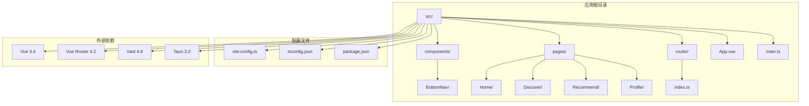

**图表来源**
- [apps/mobile/src/App.vue:1-62](file://apps/mobile/src/App.vue#L1-L62)
- [apps/mobile/src/main.ts:1-9](file://apps/mobile/src/main.ts#L1-L9)
- [apps/mobile/src/router/index.ts:1-33](file://apps/mobile/src/router/index.ts#L1-L33)

**章节来源**
- [apps/mobile/src/App.vue:1-62](file://apps/mobile/src/App.vue#L1-L62)
- [apps/mobile/src/main.ts:1-9](file://apps/mobile/src/main.ts#L1-L9)
- [apps/mobile/src/router/index.ts:1-33](file://apps/mobile/src/router/index.ts#L1-L33)

## 核心组件

### 应用入口组件

应用入口组件负责全局配置和路由管理，采用 Composition API 和 TypeScript 进行类型安全的开发。

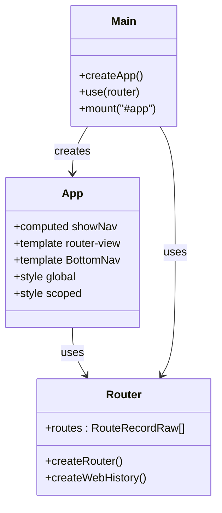

**图表来源**
- [apps/mobile/src/App.vue:1-62](file://apps/mobile/src/App.vue#L1-L62)
- [apps/mobile/src/main.ts:1-9](file://apps/mobile/src/main.ts#L1-L9)
- [apps/mobile/src/router/index.ts:1-33](file://apps/mobile/src/router/index.ts#L1-L33)

### 底部导航组件

底部导航组件提供四个主要页面的快速切换功能，支持图标状态切换和活跃状态指示。

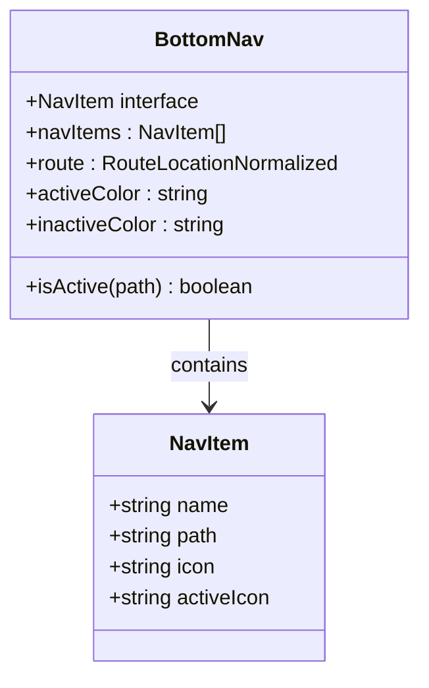

**图表来源**
- [apps/mobile/src/components/BottomNav/index.vue:1-145](file://apps/mobile/src/components/BottomNav/index.vue#L1-L145)

**章节来源**
- [apps/mobile/src/App.vue:1-62](file://apps/mobile/src/App.vue#L1-L62)
- [apps/mobile/src/main.ts:1-9](file://apps/mobile/src/main.ts#L1-L9)
- [apps/mobile/src/router/index.ts:1-33](file://apps/mobile/src/router/index.ts#L1-L33)
- [apps/mobile/src/components/BottomNav/index.vue:1-145](file://apps/mobile/src/components/BottomNav/index.vue#L1-L145)

## 架构概览

应用采用 MVVM 架构模式，结合 Vue 3 的响应式系统和组合式 API：

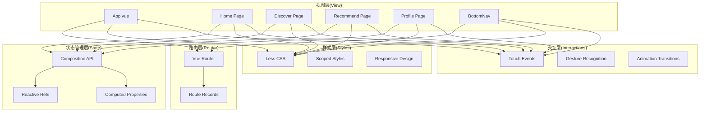

**图表来源**
- [apps/mobile/src/App.vue:1-62](file://apps/mobile/src/App.vue#L1-L62)
- [apps/mobile/src/router/index.ts:1-33](file://apps/mobile/src/router/index.ts#L1-L33)
- [apps/mobile/src/pages/Home/index.vue:1-600](file://apps/mobile/src/pages/Home/index.vue#L1-L600)
- [apps/mobile/src/pages/Discover/index.vue:1-529](file://apps/mobile/src/pages/Discover/index.vue#L1-L529)
- [apps/mobile/src/pages/Recommend/index.vue:1-459](file://apps/mobile/src/pages/Recommend/index.vue#L1-L459)
- [apps/mobile/src/pages/Profile/index.vue:1-626](file://apps/mobile/src/pages/Profile/index.vue#L1-L626)

## 详细组件分析

### 首页组件 (Home)

首页是应用的核心动态流页面，采用瀑布流布局展示用户内容：

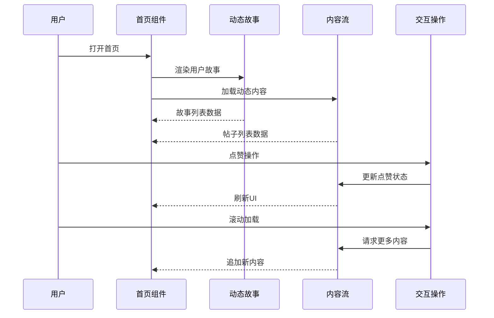

**图表来源**
- [apps/mobile/src/pages/Home/index.vue:1-600](file://apps/mobile/src/pages/Home/index.vue#L1-L600)

#### 数据结构设计

首页使用结构化的数据模型来管理不同类型的内容：

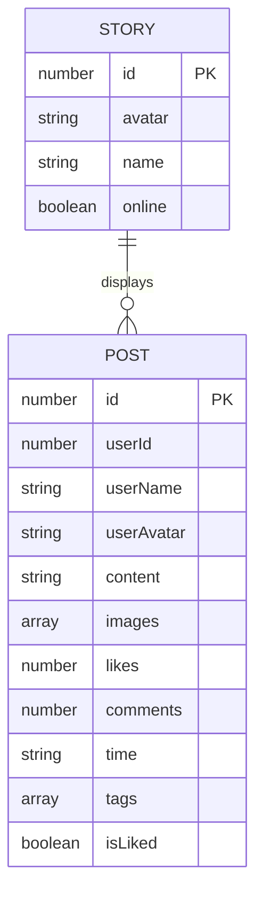

**图表来源**
- [apps/mobile/src/pages/Home/index.vue:4-23](file://apps/mobile/src/pages/Home/index.vue#L4-L23)

#### 交互功能实现

首页实现了多种用户交互功能：

1. **故事浏览**: 水平滚动的故事卡片，显示用户头像和在线状态
2. **内容点赞**: 支持实时点赞状态切换和计数更新
3. **内容分享**: 提供分享按钮和菜单选项
4. **用户关注**: 关注其他用户的便捷操作

**章节来源**
- [apps/mobile/src/pages/Home/index.vue:1-600](file://apps/mobile/src/pages/Home/index.vue#L1-L600)

### 发现页组件 (Discover)

发现页专注于兴趣社区和活动发现：

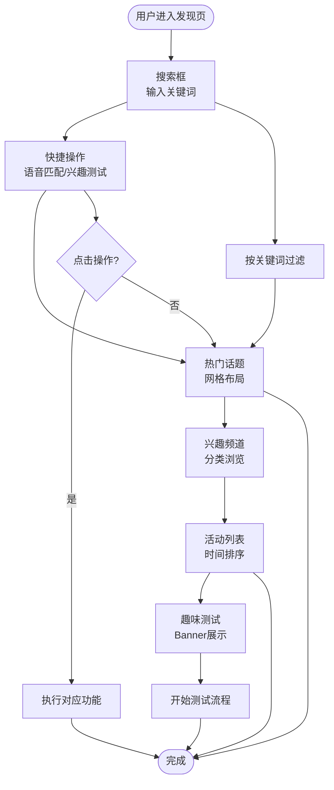

**图表来源**
- [apps/mobile/src/pages/Discover/index.vue:1-529](file://apps/mobile/src/pages/Discover/index.vue#L1-L529)

#### 功能特性

发现页包含以下核心功能模块：

1. **智能搜索**: 实时搜索框，支持关键词过滤
2. **快捷入口**: 四宫格快捷操作，快速访问不同功能
3. **话题发现**: 热门话题网格，支持颜色主题
4. **频道分类**: 兴趣频道列表，按类别组织
5. **活动中心**: 正在进行的活动列表
6. **趣味测试**: Banner形式的互动测试入口

**章节来源**
- [apps/mobile/src/pages/Discover/index.vue:1-529](file://apps/mobile/src/pages/Discover/index.vue#L1-L529)

### 推荐页组件 (Recommend)

推荐页采用卡片式设计，专注于用户匹配和社交发现：

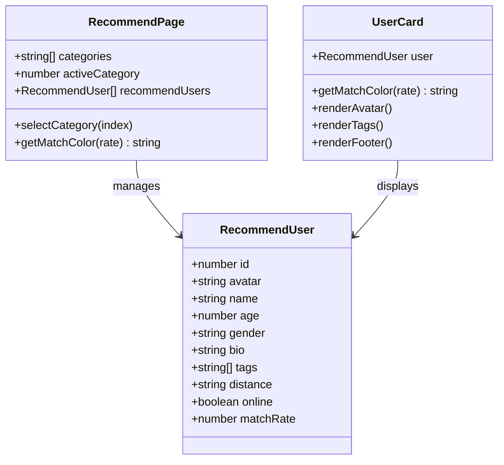

**图表来源**
- [apps/mobile/src/pages/Recommend/index.vue:1-459](file://apps/mobile/src/pages/Recommend/index.vue#L1-L459)

#### 匹配算法集成

推荐页实现了智能匹配系统：

1. **分类筛选**: 支持"全部、附近、新入驻、高匹配、有趣"等筛选条件
2. **匹配评分**: 基于共同兴趣和相似度计算匹配百分比
3. **实时更新**: 动态更新用户状态和匹配结果
4. **卡片交互**: 左右滑动或点击按钮进行选择

**章节来源**
- [apps/mobile/src/pages/Recommend/index.vue:1-459](file://apps/mobile/src/pages/Recommend/index.vue#L1-L459)

### 个人页组件 (Profile)

个人页提供用户资料管理和设置功能：

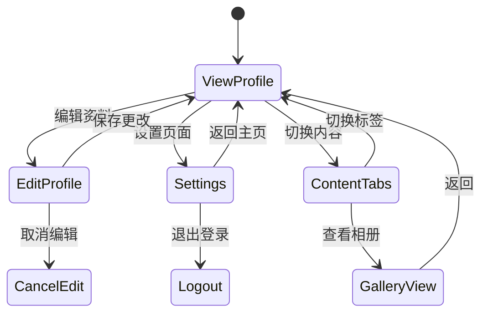

**图表来源**
- [apps/mobile/src/pages/Profile/index.vue:1-626](file://apps/mobile/src/pages/Profile/index.vue#L1-L626)

#### 用户界面设计

个人页采用分层设计结构：

1. **头部信息**: 用户头像、等级徽章、基本信息展示
2. **统计数据**: 发布数量、粉丝数、关注数、获赞数
3. **徽章系统**: 用户成就和荣誉展示
4. **快速设置**: 常用功能开关和快捷入口
5. **菜单系统**: 完整的功能菜单和通知管理
6. **内容展示**: 三种标签页展示用户内容

**章节来源**
- [apps/mobile/src/pages/Profile/index.vue:1-626](file://apps/mobile/src/pages/Profile/index.vue#L1-L626)

## 依赖关系分析

应用的依赖关系体现了清晰的模块化架构：

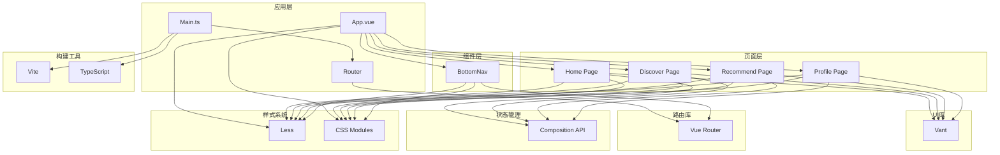

**图表来源**
- [apps/mobile/src/App.vue:1-62](file://apps/mobile/src/App.vue#L1-L62)
- [apps/mobile/src/main.ts:1-9](file://apps/mobile/src/main.ts#L1-L9)
- [apps/mobile/src/router/index.ts:1-33](file://apps/mobile/src/router/index.ts#L1-L33)
- [apps/mobile/package.json:1-37](file://apps/mobile/package.json#L1-L37)

**章节来源**
- [apps/mobile/package.json:1-37](file://apps/mobile/package.json#L1-L37)
- [apps/mobile/tsconfig.json:1-28](file://apps/mobile/tsconfig.json#L1-L28)
- [apps/mobile/vite.config.ts:1-31](file://apps/mobile/vite.config.ts#L1-L31)

## 性能考虑

### 响应式设计优化

应用采用了多层次的响应式设计策略：

1. **移动端优先**: 所有组件都针对移动设备进行了优化
2. **弹性布局**: 使用 CSS Grid 和 Flexbox 实现自适应布局
3. **触摸友好**: 按钮和交互元素尺寸适合手指操作
4. **性能优化**: 避免不必要的重绘和回流

### 图片和媒体优化

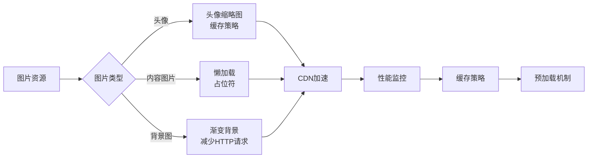

### 内存管理策略

应用实施了多项内存管理措施：

1. **组件卸载**: 路由切换时自动清理组件实例
2. **事件监听**: 在组件销毁时移除所有事件监听器
3. **定时器清理**: 及时清除定时器和动画帧
4. **图片资源**: 及时释放不再使用的图片资源

### 状态管理优化

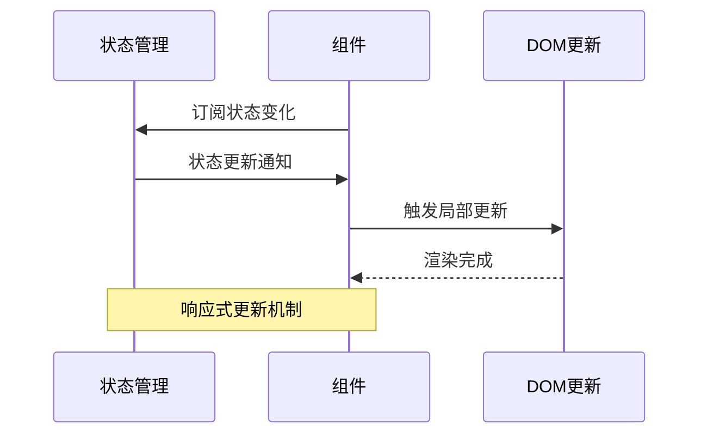

## 故障排除指南

### 常见问题诊断

1. **路由跳转问题**
   - 检查路由配置是否正确
   - 验证组件导入路径
   - 确认路由守卫逻辑

2. **样式渲染异常**
   - 检查 scoped 样式的作用域
   - 验证 Less 预处理器配置
   - 确认 CSS 变量定义

3. **组件交互失效**
   - 检查事件绑定语法
   - 验证响应式数据更新
   - 确认生命周期钩子调用

### 性能问题排查

1. **页面加载缓慢**
   - 分析网络请求时间
   - 检查图片资源大小
   - 优化组件渲染频率

2. **内存泄漏检测**
   - 使用浏览器开发者工具
   - 监控组件实例数量
   - 检查事件监听器注册

3. **触摸事件冲突**
   - 检查事件冒泡处理
   - 验证触摸手势识别
   - 确认 CSS 交互属性

**章节来源**
- [apps/mobile/src/App.vue:1-62](file://apps/mobile/src/App.vue#L1-L62)
- [apps/mobile/src/components/BottomNav/index.vue:1-145](file://apps/mobile/src/components/BottomNav/index.vue#L1-L145)

## 结论

该移动端页面组件系统展现了现代前端开发的最佳实践：

### 技术优势

1. **架构清晰**: 采用 MVVM 架构，层次分明
2. **组件化设计**: 模块化组件便于维护和复用
3. **响应式优化**: 针对移动端的专门优化
4. **类型安全**: TypeScript 提供编译时类型检查

### 设计特色

1. **用户体验**: 流畅的动画过渡和交互反馈
2. **视觉设计**: 深色主题配合渐变色彩
3. **功能完整**: 覆盖社交应用的核心功能
4. **可扩展性**: 良好的架构支持功能扩展

### 最佳实践

1. **代码组织**: 清晰的目录结构和命名规范
2. **性能优化**: 多层次的性能优化策略
3. **错误处理**: 完善的错误处理和调试机制
4. **文档完善**: 详细的组件说明和使用指南

该系统为移动端社交应用开发提供了完整的参考模板，具有很高的实用价值和学习意义。