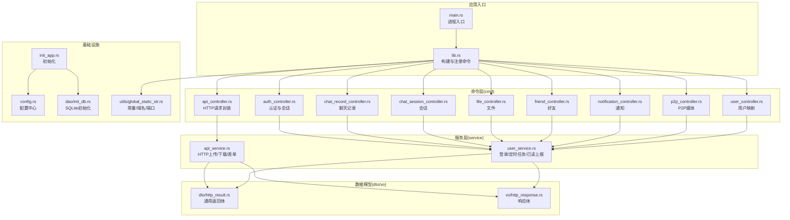
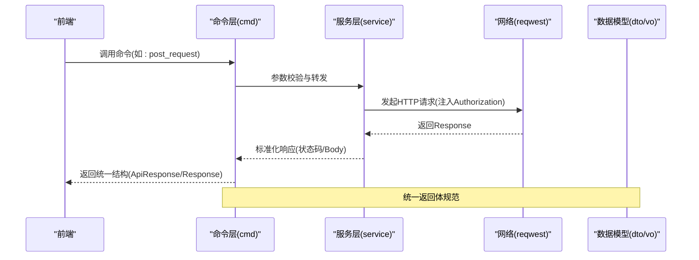
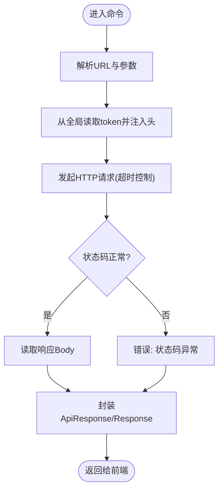
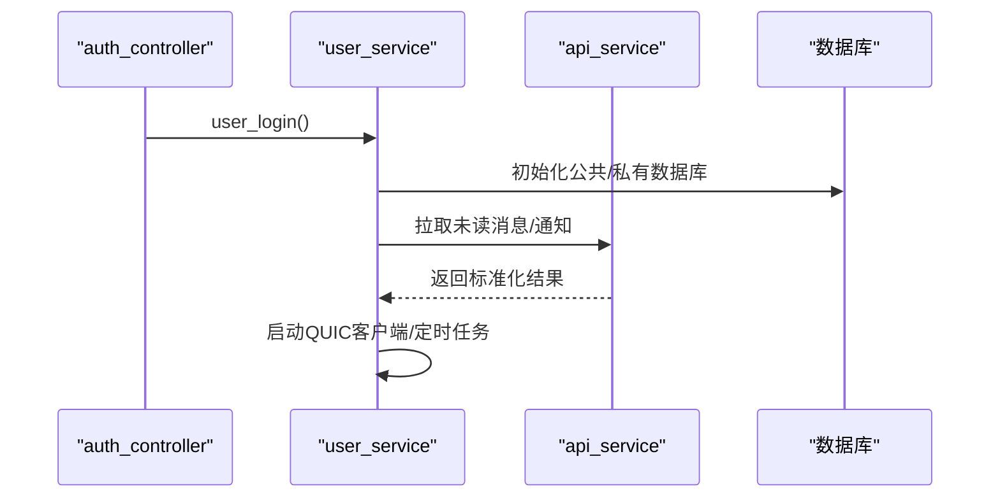
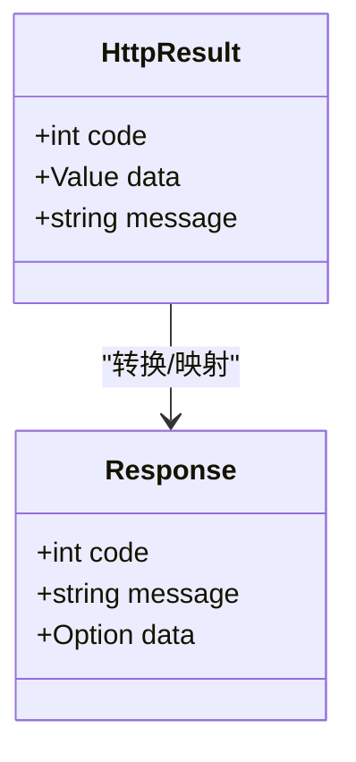
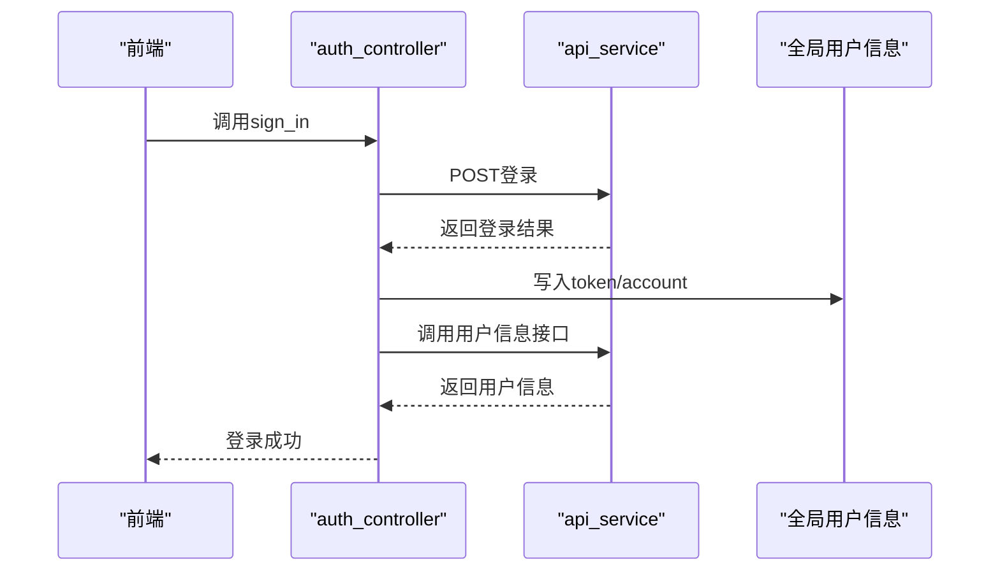
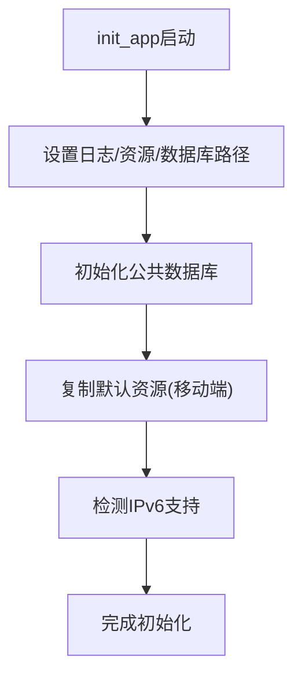
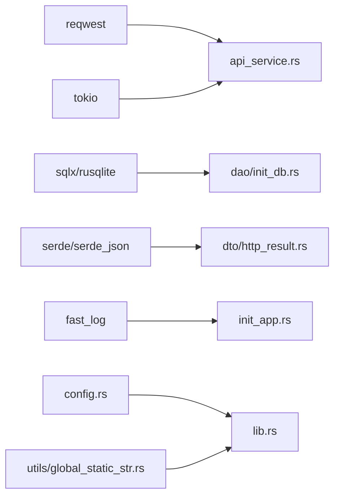

# API服务

<cite>
**本文引用的文件**
- [Cargo.toml](file://src-tauri/Cargo.toml)
- [main.rs](file://src-tauri/src/main.rs)
- [lib.rs](file://src-tauri/src/lib.rs)
- [cmd/mod.rs](file://src-tauri/src/cmd/mod.rs)
- [cmd/api_controller.rs](file://src-tauri/src/cmd/api_controller.rs)
- [service/api_service.rs](file://src-tauri/src/service/api_service.rs)
- [dto/http_result.rs](file://src-tauri/src/dto/http_result.rs)
- [vo/http_response.rs](file://src-tauri/src/vo/http_response.rs)
- [cmd/auth_controller.rs](file://src-tauri/src/cmd/auth_controller.rs)
- [service/user_service.rs](file://src-tauri/src/service/user_service.rs)
- [utils/global_static_str.rs](file://src-tauri/src/utils/global_static_str.rs)
- [config.rs](file://src-tauri/src/config.rs)
- [init_app.rs](file://src-tauri/src/init_app.rs)
- [dao/init_db.rs](file://src-tauri/src/dao/init_db.rs)
</cite>

## 目录
1. [简介](#简介)
2. [项目结构](#项目结构)
3. [核心组件](#核心组件)
4. [架构总览](#架构总览)
5. [详细组件分析](#详细组件分析)
6. [依赖关系分析](#依赖关系分析)
7. [性能考量](#性能考量)
8. [故障排查指南](#故障排查指南)
9. [结论](#结论)
10. [附录](#附录)

## 简介
本文件面向 Rust + Tauri + Umi 的即时通讯应用，聚焦于“API 服务”的设计与实现，系统阐述以下主题：
- RESTful API 的调用封装与统一返回格式
- HTTP 请求处理流程、响应标准化与错误处理机制
- 中间件设计思路（基于 Tauri 命令层）、请求验证与安全防护
- API 版本管理、文档生成与测试策略
- 架构设计原则、性能优化技巧与扩展性考虑
- 提供具体代码示例路径，帮助开发者快速掌握接口实现模式与最佳实践

## 项目结构
该 API 服务位于 Tauri 应用的后端 Rust 侧，通过 Tauri 的命令系统暴露给前端调用。整体采用模块化分层：
- cmd 层：对外暴露的命令函数，作为 API 的入口
- service 层：业务逻辑与网络请求封装
- dto/vo：数据传输对象与视图对象，统一返回格式
- dao/config/utils：数据持久化、配置中心、工具类
- init_app：应用初始化流程，含日志、资源、数据库等

图表来源
- [main.rs:1-8](file://src-tauri/src/main.rs#L1-L8)
- [lib.rs:117-166](file://src-tauri/src/lib.rs#L117-L166)
- [cmd/mod.rs:1-10](file://src-tauri/src/cmd/mod.rs#L1-L10)
- [service/api_service.rs:1-187](file://src-tauri/src/service/api_service.rs#L1-L187)
- [service/user_service.rs:1-284](file://src-tauri/src/service/user_service.rs#L1-L284)
- [dto/http_result.rs:1-10](file://src-tauri/src/dto/http_result.rs#L1-L10)
- [vo/http_response.rs:1-10](file://src-tauri/src/vo/http_response.rs#L1-L10)
- [init_app.rs:19-91](file://src-tauri/src/init_app.rs#L19-L91)
- [config.rs:7-81](file://src-tauri/src/config.rs#L7-L81)
- [dao/init_db.rs:17-75](file://src-tauri/src/dao/init_db.rs#L17-L75)
- [utils/global_static_str.rs:1-59](file://src-tauri/src/utils/global_static_str.rs#L1-L59)

章节来源
- [main.rs:1-8](file://src-tauri/src/main.rs#L1-L8)
- [lib.rs:117-166](file://src-tauri/src/lib.rs#L117-L166)
- [cmd/mod.rs:1-10](file://src-tauri/src/cmd/mod.rs#L1-L10)

## 核心组件
- 命令注册与入口
  - 进程入口在 main.rs，调用 lib.rs 的 run 函数
  - lib.rs 使用 Tauri Builder 注册大量命令，形成统一的 API 暴露面
- API 控制器
  - api_controller.rs 提供 GET/POST/上传/压缩等命令，内部委托 service 层实现
- 服务层
  - api_service.rs 统一封装 HTTP 请求、上传、表单提交与超时控制
  - user_service.rs 实现登录流程、未读消息拉取、定时任务与已读上报
- 数据模型
  - dto/http_result.rs 定义通用返回体字段（code/data/message）
  - vo/http_response.rs 定义响应体字段（code/message/data?）
- 配置与初始化
  - config.rs 提供全局配置中心
  - init_app.rs 负责日志、资源、数据库初始化
  - utils/global_static_str.rs 提供域名、端口、路径等常量

章节来源
- [lib.rs:117-166](file://src-tauri/src/lib.rs#L117-L166)
- [cmd/api_controller.rs:24-58](file://src-tauri/src/cmd/api_controller.rs#L24-L58)
- [service/api_service.rs:12-37](file://src-tauri/src/service/api_service.rs#L12-L37)
- [dto/http_result.rs:4-9](file://src-tauri/src/dto/http_result.rs#L4-L9)
- [vo/http_response.rs:4-9](file://src-tauri/src/vo/http_response.rs#L4-L9)
- [config.rs:7-81](file://src-tauri/src/config.rs#L7-L81)
- [init_app.rs:19-91](file://src-tauri/src/init_app.rs#L19-L91)
- [utils/global_static_str.rs:10-18](file://src-tauri/src/utils/global_static_str.rs#L10-L18)

## 架构总览
API 服务采用“命令驱动 + 服务封装”的分层架构：
- 前端通过 Tauri 命令调用后端 API
- 命令层负责参数校验与错误透传
- 服务层负责网络请求、鉴权头注入、超时与重试策略
- 返回体统一由 dto/vo 规范化，便于前端消费

图表来源
- [cmd/api_controller.rs:24-58](file://src-tauri/src/cmd/api_controller.rs#L24-L58)
- [service/api_service.rs:12-37](file://src-tauri/src/service/api_service.rs#L12-L37)
- [dto/http_result.rs:4-9](file://src-tauri/src/dto/http_result.rs#L4-L9)
- [vo/http_response.rs:4-9](file://src-tauri/src/vo/http_response.rs#L4-L9)

## 详细组件分析

### 命令层：HTTP 请求封装
- GET/POST/上传/表单提交
  - get_request/post_request：基础 HTTP 请求，post_request 自动从全局用户信息中读取 token 并注入 Authorization 头
  - upload_file_* / post_form_data_*：封装 multipart 上传与表单提交，支持额外字段与多文件上传
- 返回体
  - 命令层返回 ApiResponse 结构，包含 status 与 body；部分业务使用统一的 Response 结构

图表来源
- [cmd/api_controller.rs:24-58](file://src-tauri/src/cmd/api_controller.rs#L24-L58)
- [service/api_service.rs:12-37](file://src-tauri/src/service/api_service.rs#L12-L37)

章节来源
- [cmd/api_controller.rs:24-151](file://src-tauri/src/cmd/api_controller.rs#L24-L151)
- [service/api_service.rs:39-186](file://src-tauri/src/service/api_service.rs#L39-L186)

### 服务层：网络与业务编排
- 超时与鉴权
  - 服务层统一设置请求超时，按需注入 Authorization 头
- 上传与表单
  - 单文件/多文件上传，支持额外字段；多文件场景为每个 Part 生成唯一字段名避免覆盖
- 业务编排
  - user_service 在登录后初始化数据库、拉取好友列表、未读消息与通知，并启动 QUIC 客户端与定时任务

图表来源
- [cmd/auth_controller.rs:16-64](file://src-tauri/src/cmd/auth_controller.rs#L16-L64)
- [service/user_service.rs:28-53](file://src-tauri/src/service/user_service.rs#L28-L53)
- [service/api_service.rs:12-37](file://src-tauri/src/service/api_service.rs#L12-L37)
- [dao/init_db.rs:17-41](file://src-tauri/src/dao/init_db.rs#L17-L41)

章节来源
- [service/user_service.rs:28-284](file://src-tauri/src/service/user_service.rs#L28-L284)
- [dao/init_db.rs:17-75](file://src-tauri/src/dao/init_db.rs#L17-L75)

### 数据模型与返回体规范
- 通用返回体
  - dto/http_result.rs：code/data/message，用于服务层内部解析与传递
  - vo/http_response.rs：code/message/data?，用于对外统一响应
- 建议
  - 前端统一以 Response 为准；若需兼容旧接口，可保留 ApiResponse 作为过渡

图表来源
- [dto/http_result.rs:4-9](file://src-tauri/src/dto/http_result.rs#L4-L9)
- [vo/http_response.rs:4-9](file://src-tauri/src/vo/http_response.rs#L4-L9)

章节来源
- [dto/http_result.rs:1-10](file://src-tauri/src/dto/http_result.rs#L1-L10)
- [vo/http_response.rs:1-10](file://src-tauri/src/vo/http_response.rs#L1-L10)

### 认证与会话
- 登录流程
  - sign_in：向认证接口发起登录，成功后写入全局用户信息(token/account)，并调用用户信息接口完善本地映射
  - logout/clear_user_info：清理全局用户信息、服务器列表与数据库连接
- 安全要点
  - Authorization 头从全局变量读取，避免硬编码
  - 登出时清空敏感信息与连接池

图表来源
- [cmd/auth_controller.rs:16-64](file://src-tauri/src/cmd/auth_controller.rs#L16-L64)
- [service/api_service.rs:12-37](file://src-tauri/src/service/api_service.rs#L12-L37)

章节来源
- [cmd/auth_controller.rs:16-113](file://src-tauri/src/cmd/auth_controller.rs#L16-L113)

### 初始化与配置
- 初始化流程
  - init_app：设置日志、资源目录、SQLite 目录，复制默认资源，检测 IPv6 支持
- 配置中心
  - config.rs：提供键值配置、JSON 序列化/反序列化、批量设置与导出
- 常量与路径
  - utils/global_static_str.rs：域名、端口、路径、平台标识等

图表来源
- [init_app.rs:19-91](file://src-tauri/src/init_app.rs#L19-L91)
- [config.rs:7-81](file://src-tauri/src/config.rs#L7-L81)
- [utils/global_static_str.rs:10-59](file://src-tauri/src/utils/global_static_str.rs#L10-L59)

章节来源
- [init_app.rs:19-186](file://src-tauri/src/init_app.rs#L19-L186)
- [config.rs:7-155](file://src-tauri/src/config.rs#L7-L155)
- [utils/global_static_str.rs:1-59](file://src-tauri/src/utils/global_static_str.rs#L1-59)

## 依赖关系分析
- 关键依赖
  - reqwest：HTTP 客户端，支持 JSON、multipart、rustls TLS
  - tokio：异步运行时
  - sqlx/rusqlite：SQLite 连接池与加密
  - serde/serde_json：序列化/反序列化
  - fast_log：异步日志
- 模块耦合
  - 命令层仅依赖服务层与工具模块，保持低耦合
  - 服务层依赖全局配置与工具常量，便于集中管理

图表来源
- [Cargo.toml:24-62](file://src-tauri/Cargo.toml#L24-L62)
- [service/api_service.rs:12-37](file://src-tauri/src/service/api_service.rs#L12-L37)
- [dao/init_db.rs:17-41](file://src-tauri/src/dao/init_db.rs#L17-L41)
- [dto/http_result.rs:1-10](file://src-tauri/src/dto/http_result.rs#L1-L10)
- [init_app.rs:169-185](file://src-tauri/src/init_app.rs#L169-L185)
- [lib.rs:117-166](file://src-tauri/src/lib.rs#L117-L166)
- [utils/global_static_str.rs:10-18](file://src-tauri/src/utils/global_static_str.rs#L10-L18)

章节来源
- [Cargo.toml:1-62](file://src-tauri/Cargo.toml#L1-L62)

## 性能考量
- 异步与并发
  - 使用 tokio::main 与 async/await，提升 I/O 密集型请求吞吐
- 连接与超时
  - 服务层对不同场景设置合理超时（如上传 120s、多文件 300s），避免阻塞
- 数据库连接池
  - SQLite 连接池最大连接数为 5，建议根据设备性能与并发需求调整
- 日志与资源
  - 分割式日志与资源复制策略减少 I/O 抖动
- 图片压缩
  - 提供压缩到 webp 的命令，降低传输体积

章节来源
- [lib.rs:4-75](file://src-tauri/src/lib.rs#L4-L75)
- [service/api_service.rs:16,115,166](file://src-tauri/src/service/api_service.rs#L16,L115,L166)
- [dao/init_db.rs:23-32](file://src-tauri/src/dao/init_db.rs#L23-L32)
- [init_app.rs:169-185](file://src-tauri/src/init_app.rs#L169-L185)
- [cmd/api_controller.rs:141-150](file://src-tauri/src/cmd/api_controller.rs#L141-L150)

## 故障排查指南
- 常见问题定位
  - 网络请求失败：检查域名与端口常量、IPv6 支持、超时设置
  - 鉴权失败：确认全局用户信息中 token 是否正确写入与读取
  - 上传失败：确认文件存在、字段名唯一、multipart 表单构造
  - 数据库初始化失败：确认应用路径、账户目录、数据库文件存在
- 日志与调试
  - init_app 初始化日志，开启 RUST_BACKTRACE=full 便于堆栈追踪
  - fast_log 输出到按日滚动的日志文件

章节来源
- [cmd/auth_controller.rs:44-58](file://src-tauri/src/cmd/auth_controller.rs#L44-L58)
- [service/api_service.rs:54-113](file://src-tauri/src/service/api_service.rs#L54-L113)
- [dao/init_db.rs:44-74](file://src-tauri/src/dao/init_db.rs#L44-L74)
- [init_app.rs:169-185](file://src-tauri/src/init_app.rs#L169-L185)
- [lib.rs:87-89](file://src-tauri/src/lib.rs#L87-L89)

## 结论
本 API 服务通过命令层与服务层的清晰分层，实现了：
- 统一的 HTTP 请求封装与鉴权头注入
- 标准化的返回体与错误传播
- 初步的认证、会话与定时任务编排
- 可扩展的配置中心与初始化流程

建议后续增强：
- 明确 API 版本号与路由前缀，逐步引入中间件（如速率限制、CORS）
- 增加请求参数校验与统一错误码体系
- 完善文档生成与自动化测试策略
- 优化数据库连接池与缓存策略

## 附录

### API 设计与实现最佳实践
- 命令命名规范
  - 使用语义化动词+名词组合，如 upload_file_request、post_form_data_request
- 参数校验
  - 在命令层进行基础校验（如 URL、文件路径、必填字段），失败即早返回
- 鉴权与安全
  - 从全局变量读取 token，避免硬编码；登出时清理敏感信息
- 超时与重试
  - 为上传与长耗时请求设置合理超时；必要时引入指数退避重试
- 返回体一致性
  - 统一使用 Response 结构，data 字段可选，message 提供人类可读信息
- 日志与可观测性
  - 记录关键路径与错误堆栈，便于问题定位

章节来源
- [cmd/api_controller.rs:24-151](file://src-tauri/src/cmd/api_controller.rs#L24-L151)
- [service/api_service.rs:12-186](file://src-tauri/src/service/api_service.rs#L12-L186)
- [vo/http_response.rs:4-9](file://src-tauri/src/vo/http_response.rs#L4-L9)
- [cmd/auth_controller.rs:66-113](file://src-tauri/src/cmd/auth_controller.rs#L66-L113)