# P2P服务

<cite>
**本文引用的文件**
- [p2p_quic_service.rs](file://src-tauri/src/quic_service/p2p_service/p2p_quic_service.rs)
- [p2p_stream_quic_client.rs](file://src-tauri/src/quic_service/p2p_service/p2p_stream_quic_client.rs)
- [p2p_stream_quic_server.rs](file://src-tauri/src/quic_service/p2p_service/p2p_stream_quic_server.rs)
- [mod.rs](file://src-tauri/src/quic_service/p2p_service/mod.rs)
- [models.rs](file://src-tauri/src/quic_service/models.rs)
- [p2p_models.rs](file://src-tauri/src/entity/p2p_models.rs)
- [quic_connection.rs](file://src-tauri/src/entity/quic_connection.rs)
- [message_types.rs](file://src-tauri/src/utils/message_types.rs)
- [p2p_controller.rs](file://src-tauri/src/cmd/p2p_controller.rs)
- [p2p_service.rs](file://src-tauri/src/service/p2p_service.rs)
- [dangerous_configuration.rs](file://src-tauri/src/quic_service/dangerous_configuration.rs)
- [safe_configuration.rs](file://src-tauri/src/quic_service/safe_configuration.rs)
- [global_static_str.rs](file://src-tauri/src/utils/global_static_str.rs)
- [udp_utils.rs](file://src-tauri/src/quic_service/udp_utils.rs)
- [InitP2pMsg.tsx](file://apps/pc/src/components/P2p/InitP2pMsg.tsx)
- [ProcessQuicP2pStream.tsx](file://apps/pc/src/components/P2p/ProcessQuicP2pStream.tsx)
- [index.tsx](file://apps/pc/src/components/Media/PrivacyVideoCall/index.tsx)
- [useP2pMessageApi.ts](file://apps/pc/src/hooks/useP2pMessageApi.ts)
- [FileSelectorTest.tsx](file://apps/pc/src/pages/TestComponent/components/FileSelectorTest.tsx)
- [NAT3_WEBRTC_FIX.md](file://NAT3_WEBRTC_FIX.md)
</cite>

## 更新摘要
**所做更改**
- 新增P2P文件传输功能章节，详细介绍文件传输通道类型和协议
- 更新双通道架构部分，添加File通道的详细说明
- 新增文件传输协议和数据模型章节
- 更新消息类型定义，添加文件传输相关常量
- 新增文件传输事件监听和处理章节
- 更新故障排查指南，添加文件传输相关问题诊断

## 目录
1. [简介](#简介)
2. [项目结构](#项目结构)
3. [核心组件](#核心组件)
4. [架构总览](#架构总览)
5. [详细组件分析](#详细组件分析)
6. [文件传输功能](#文件传输功能)
7. [依赖关系分析](#依赖关系分析)
8. [性能考量](#性能考量)
9. [故障排查指南](#故障排查指南)
10. [结论](#结论)
11. [附录](#附录)

## 简介
本文件系统性梳理 Rust + Tauri 项目中的 P2P 服务实现，重点覆盖：
- P2P 连接建立与管理
- 媒体流传输（视频/音频）与信令交换
- QUIC 协议在 P2P 通信中的应用
- NAT 穿越与 UDP 端口探测策略
- 数据模型设计与前后端差异
- **新增** 双通道 QUIC 架构支持媒体信息通道，包括 Default 通道和专用的 MediaInfo 通道
- **新增** 完整的媒体统计跟踪系统，支持分辨率变化、码率调整、帧率统计、网络质量等实时监控
- **新增** P2P 文件传输功能，支持文件分片传输和握手协议
- 完整流程、错误处理与性能优化建议
- 代码级流程图与序列图，帮助开发者扩展与调试

## 项目结构
P2P 服务主要分布在以下模块：
- 服务端/客户端 QUIC 层：负责底层连接与双向流读写，现已支持四通道架构
- 业务服务层：封装 P2P 初始化、NAT 穿越、媒体配置与控制命令，新增媒体信息服务和文件传输服务
- 控制器层：暴露 Tauri 命令给前端调用，新增文件传输相关命令
- 实体与消息类型：定义 P2P 数据模型与消息类型常量，新增通道类型、媒体信息和文件传输模型
- 前端组件：演示如何发起 P2P 请求、监听 P2P 事件、实现媒体统计跟踪和文件传输

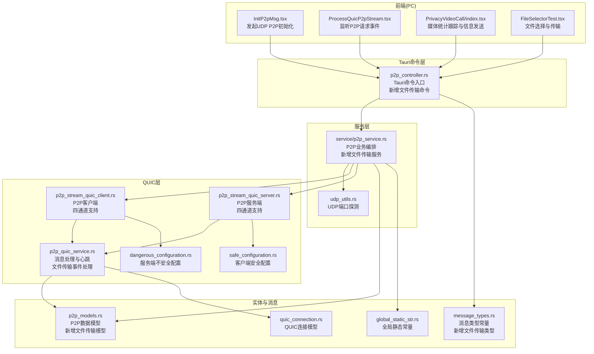

**图表来源**
- [p2p_controller.rs:186-226](file://src-tauri/src/cmd/p2p_controller.rs#L186-L226)
- [p2p_service.rs:775-913](file://src-tauri/src/service/p2p_service.rs#L775-L913)
- [p2p_stream_quic_client.rs:55-135](file://src-tauri/src/quic_service/p2p_service/p2p_stream_quic_client.rs#L55-L135)
- [p2p_stream_quic_server.rs:129-198](file://src-tauri/src/quic_service/p2p_service/p2p_stream_quic_server.rs#L129-L198)
- [p2p_quic_service.rs:245-273](file://src-tauri/src/quic_service/p2p_service/p2p_quic_service.rs#L245-L273)
- [p2p_models.rs:121-171](file://src-tauri/src/entity/p2p_models.rs#L121-L171)
- [message_types.rs:77-86](file://src-tauri/src/utils/message_types.rs#L77-L86)

**章节来源**
- [p2p_controller.rs:186-226](file://src-tauri/src/cmd/p2p_controller.rs#L186-L226)
- [p2p_service.rs:775-913](file://src-tauri/src/service/p2p_service.rs#L775-L913)
- [p2p_stream_quic_client.rs:55-135](file://src-tauri/src/quic_service/p2p_service/p2p_stream_quic_client.rs#L55-L135)
- [p2p_stream_quic_server.rs:129-198](file://src-tauri/src/quic_service/p2p_service/p2p_stream_quic_server.rs#L129-L198)
- [p2p_quic_service.rs:245-273](file://src-tauri/src/quic_service/p2p_service/p2p_quic_service.rs#L245-L273)
- [p2p_models.rs:121-171](file://src-tauri/src/entity/p2p_models.rs#L121-L171)
- [message_types.rs:77-86](file://src-tauri/src/utils/message_types.rs#L77-L86)

## 核心组件
- **双通道 QUIC 架构**
  - Default 通道：用于信令、文本消息、控制命令等传统 P2P 业务
  - MediaInfo 通道：专用的媒体信息通道，传输分辨率变化、码率调整、帧率统计等控制信令
  - MediaData 通道：专门用于视频帧和音频帧的传输
  - File 通道：专门用于文件传输，支持大文件分片传输和握手协议
- **媒体统计跟踪系统**
  - 实时帧率统计、码率监控、网络延迟测量、丢帧计数
  - 每2秒自动上报媒体状态信息到对端
  - 支持分辨率变化通知、编码器信息、网络质量评估
- **文件传输系统**
  - 文件分片传输：大文件自动切分为多个分片，每个分片独立传输
  - 握手协议：传输前先发送请求，等待接收方确认
  - 传输ID：每个文件传输分配唯一ID，关联所有分片
  - MIME类型：支持文件类型识别和处理
- **QUIC P2P 服务核心**
  - 发送通道与心跳：通过异步通道将视频帧转为文本消息并通过 QUIC 发送；周期性发送心跳维持连接活性。
  - 消息分发：根据消息类型分发到视频/音频数据、媒体配置、媒体控制、媒体信息、文件传输、文本消息、信令等处理分支。
- **P2P 客户端/服务端**
  - 客户端：建立到服务器的 QUIC 连接，开启四个双向流，发送验证消息，注册发送通道，循环读取并处理消息。
  - 服务端：接受来自客户端的连接，为每个连接创建发送通道，循环读取并处理消息。
- **业务服务**
  - P2P 初始化：构造初始化消息，通过文本通道发送至服务器，由服务器转发给目标用户。
  - NAT 穿越：探测本机 IPv4/IPv6 可用端口，向服务器发送地址信息，再通过 UDP "ping" 试探对端可达性。
  - 媒体配置与控制：发送媒体配置、媒体控制命令（如开关视频/音频、暂停/恢复、结束通话）。
  - **新增** 媒体信息服务：通过 MediaInfo 通道发送媒体状态信息，支持多种媒体统计类型。
  - **新增** 文件传输服务：发送文件分片、文件传输请求和响应，实现完整的文件传输协议。
  - 视频通话邀请/响应/结束：发送邀请、接受/拒绝、结束通话通知。
- **控制器与前端**
  - Tauri 命令：封装发送视频帧、音频帧、文本消息、关闭连接、发送媒体配置/控制、视频通话邀请/响应/结束、**新增** 发送媒体信息、**新增** 文件传输等。
  - 前端组件：演示如何发起 UDP P2P 初始化与监听 P2P 请求事件，实现媒体统计跟踪，**新增** 文件选择和传输功能。

**章节来源**
- [p2p_models.rs:52-80](file://src-tauri/src/entity/p2p_models.rs#L52-L80)
- [p2p_models.rs:121-171](file://src-tauri/src/entity/p2p_models.rs#L121-L171)
- [p2p_stream_quic_client.rs:55-135](file://src-tauri/src/quic_service/p2p_service/p2p_stream_quic_client.rs#L55-L135)
- [p2p_stream_quic_server.rs:129-198](file://src-tauri/src/quic_service/p2p_service/p2p_stream_quic_server.rs#L129-L198)
- [p2p_service.rs:775-913](file://src-tauri/src/service/p2p_service.rs#L775-L913)
- [p2p_controller.rs:186-226](file://src-tauri/src/cmd/p2p_controller.rs#L186-L226)
- [index.tsx:688-720](file://apps/pc/src/components/Media/PrivacyVideoCall/index.tsx#L688-L720)

## 架构总览
P2P 通信采用"服务器中转 + QUIC 直连"的混合架构，现已升级为四通道架构：
- 初始阶段：通过服务器中转完成 P2P 初始化与地址交换，随后进行 NAT 穿越探测。
- 建立阶段：若 NAT 类型允许直连，直接建立 QUIC 四个双向流；否则通过服务器中继。
- 传输阶段：媒体数据与信令通过 QUIC 流传输，心跳维持连接活性，媒体信息通过专用通道传输，**新增** 文件传输通过 File 通道进行分片传输。

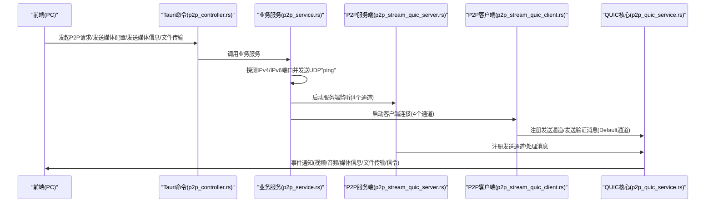

**图表来源**
- [p2p_controller.rs:186-226](file://src-tauri/src/cmd/p2p_controller.rs#L186-L226)
- [p2p_service.rs:775-913](file://src-tauri/src/service/p2p_service.rs#L775-L913)
- [p2p_stream_quic_server.rs:129-198](file://src-tauri/src/quic_service/p2p_service/p2p_stream_quic_server.rs#L129-L198)
- [p2p_stream_quic_client.rs:55-135](file://src-tauri/src/quic_service/p2p_service/p2p_stream_quic_client.rs#L55-L135)
- [p2p_quic_service.rs:245-273](file://src-tauri/src/quic_service/p2p_service/p2p_quic_service.rs#L245-L273)

## 详细组件分析

### 双通道 QUIC 架构

#### 通道类型与分配策略
- **Default 通道 (流0)**：用于传统 P2P 业务，包括视频通话邀请、接受/拒绝、结束通知、文本消息等
- **MediaInfo 通道 (流1)**：专用媒体信息通道，传输分辨率变化、码率调整、帧率统计、网络质量等控制信令
- **MediaData 通道 (流2)**：专门用于视频帧和音频帧的传输
- **File 通道 (流3)**：专门用于文件传输，支持大文件分片传输和握手协议

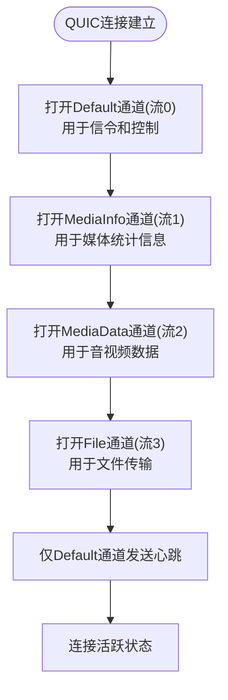

**图表来源**
- [p2p_stream_quic_client.rs:55-135](file://src-tauri/src/quic_service/p2p_service/p2p_stream_quic_client.rs#L55-L135)
- [p2p_stream_quic_server.rs:129-198](file://src-tauri/src/quic_service/p2p_service/p2p_stream_quic_server.rs#L129-L198)

**章节来源**
- [p2p_models.rs:52-80](file://src-tauri/src/entity/p2p_models.rs#L52-L80)
- [p2p_stream_quic_client.rs:55-135](file://src-tauri/src/quic_service/p2p_service/p2p_stream_quic_client.rs#L55-L135)
- [p2p_stream_quic_server.rs:129-198](file://src-tauri/src/quic_service/p2p_service/p2p_stream_quic_server.rs#L129-L198)

### 媒体统计跟踪系统

#### 媒体信息类型与数据结构
- **分辨率变化 (ResolutionChange)**：通知对端分辨率调整
- **码率调整 (BitrateChange)**：通知对端码率变化
- **帧率统计 (FrameRateStats)**：实时帧率、码率、延迟、丢帧统计
- **网络质量 (NetworkQuality)**：网络质量评估指标
- **编码器信息 (EncoderInfo)**：编码器类型和配置信息
- **自定义媒体信息 (Custom)**：支持扩展的媒体统计类型

#### 前端媒体统计实现
- 每2秒自动收集和发送媒体统计信息
- 支持实时监控视频帧率、音频码率、网络延迟、丢帧数量
- 提供分辨率变化通知和编码器信息展示

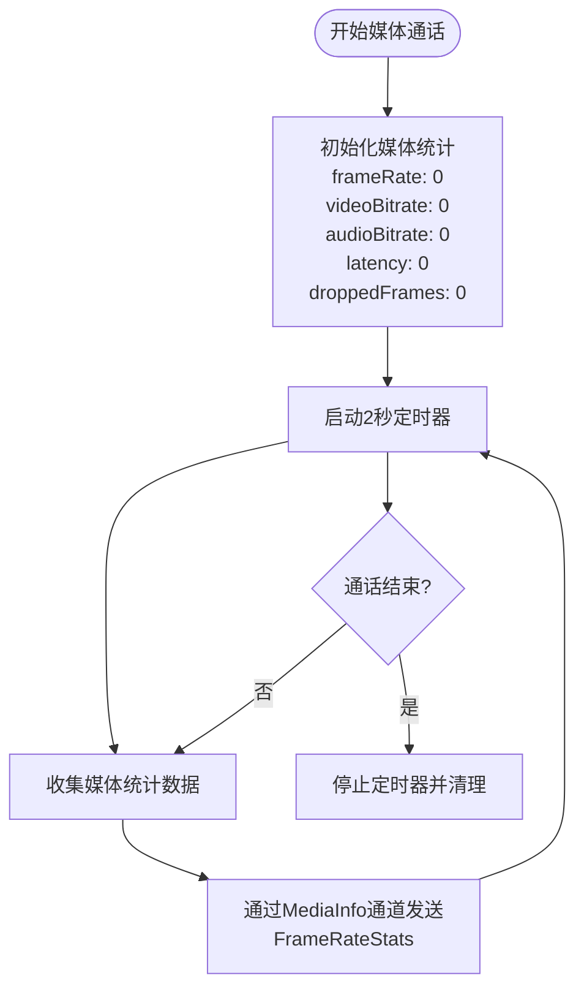

**图表来源**
- [index.tsx:688-720](file://apps/pc/src/components/Media/PrivacyVideoCall/index.tsx#L688-L720)
- [p2p_service.rs:544-593](file://src-tauri/src/service/p2p_service.rs#L544-L593)

**章节来源**
- [p2p_models.rs:84-109](file://src-tauri/src/entity/p2p_models.rs#L84-L109)
- [index.tsx:688-720](file://apps/pc/src/components/Media/PrivacyVideoCall/index.tsx#L688-L720)
- [p2p_service.rs:544-593](file://src-tauri/src/service/p2p_service.rs#L544-L593)

### QUIC P2P 核心服务
- 异步发送通道与视频帧处理
  - 使用异步通道将视频帧数据排队，后台任务统一序列化为文本消息并通过 QUIC 发送。
  - 通过全局映射维护每条目标用户的发送流，按 UUID 和通道类型获取发送通道。
- 消息处理与事件派发
  - 根据消息类型分发到不同处理分支：视频/音频数据、媒体配置、媒体控制、**新增** 媒体信息、**新增** 文件传输、文本消息、信令等。
  - 通过 Tauri 事件向前端派发，如 video_frame、audio_frame、media_config、media_control、**新增** media_info、**新增** p2p_file_data、**新增** p2p_file_transfer_request、**新增** p2p_file_transfer_response、p2p_text_message 等。
- 心跳保活
  - 周期性发送心跳消息，检查连接活跃状态，异常时停止发送并清理资源。

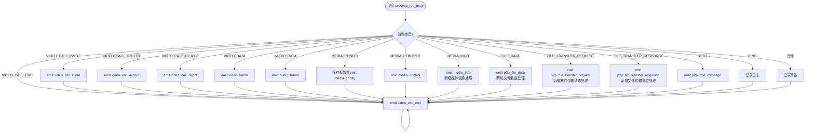

**图表来源**
- [p2p_quic_service.rs:119-306](file://src-tauri/src/quic_service/p2p_service/p2p_quic_service.rs#L119-L306)

**章节来源**
- [p2p_quic_service.rs:53-355](file://src-tauri/src/quic_service/p2p_service/p2p_quic_service.rs#L53-L355)

### P2P 客户端
- 连接建立
  - 创建 QUIC 客户端端点，禁用证书验证（开发用途），连接服务器，开启四个双向流。
  - 发送验证消息（包含请求令牌），注册发送通道，标记连接为活跃。
- 消息处理
  - 循环读取服务器返回的消息，调用核心服务的消息处理函数，派发前端事件。
  - **新增** 为每个通道启动独立的接收任务，避免阻塞。
- 心跳保活
  - 仅对 Default 通道发送心跳，周期性发送心跳，连接关闭时退出。

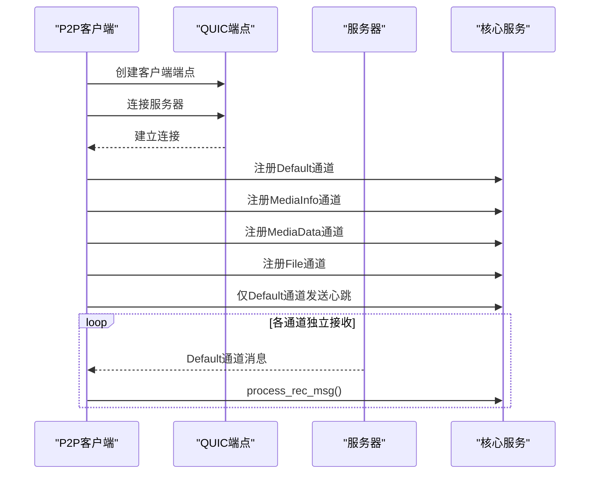

**图表来源**
- [p2p_stream_quic_client.rs:55-135](file://src-tauri/src/quic_service/p2p_service/p2p_stream_quic_client.rs#L55-L135)
- [p2p_quic_service.rs:319-354](file://src-tauri/src/quic_service/p2p_service/p2p_quic_service.rs#L319-L354)

**章节来源**
- [p2p_stream_quic_client.rs:55-135](file://src-tauri/src/quic_service/p2p_service/p2p_stream_quic_client.rs#L55-L135)

### P2P 服务端
- 连接接受
  - 创建 QUIC 服务端端点，接受客户端连接，为每个连接创建发送通道，标记连接为活跃。
- 通道分配
  - 按流序号分配通道：0=Default, 1=MediaInfo, 2=MediaData, 3=File
  - 仅对 Default 通道发送心跳
- 消息处理
  - 循环读取客户端消息，调用核心服务的消息处理函数，派发前端事件。

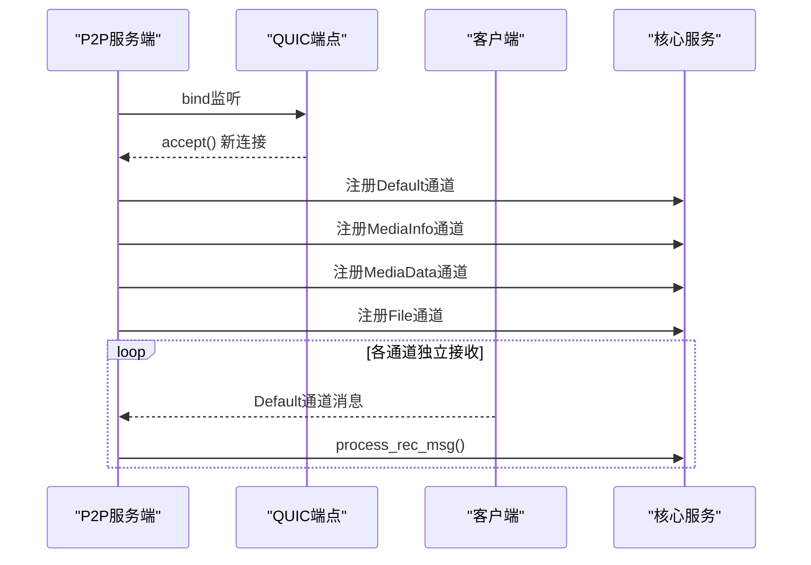

**图表来源**
- [p2p_stream_quic_server.rs:129-198](file://src-tauri/src/quic_service/p2p_service/p2p_stream_quic_server.rs#L129-L198)
- [p2p_quic_service.rs:319-354](file://src-tauri/src/quic_service/p2p_service/p2p_quic_service.rs#L319-L354)

**章节来源**
- [p2p_stream_quic_server.rs:129-198](file://src-tauri/src/quic_service/p2p_service/p2p_stream_quic_server.rs#L129-L198)

### 业务服务（NAT 穿越与媒体协商）
- P2P 初始化
  - 生成请求令牌，构造初始化消息，通过文本通道发送至服务器，由服务器转发给目标用户。
- NAT 穿越
  - 探测本机可用 UDP 端口，构造用户地址信息，通过 UDP "ping" 发送给服务器，服务器再转发给对端。
  - 支持 IPv4 与 IPv6，分别发送探测包并记录端口。
- 媒体配置与控制
  - 发送媒体配置（视频/音频参数、缓冲策略），发送媒体控制命令（开关、暂停/恢复、结束通话）。
  - **新增** 通过 MediaInfo 通道发送媒体状态信息，避免阻塞主数据通道。
- **新增** 文件传输服务
  - 发送文件分片数据：将大文件切分为多个分片，每个分片独立发送
  - 文件传输请求：发送方先发送请求，等待接收方确认
  - 文件传输响应：接收方回复接受或拒绝
  - 支持文件名、MIME类型、总大小、分片索引等元数据
- 视频通话邀请/响应/结束
  - 发送邀请（可携带默认媒体配置），接收方接受/拒绝，最终结束通话。

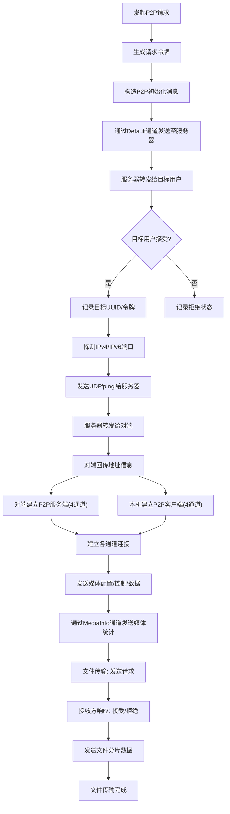

**图表来源**
- [p2p_service.rs:775-913](file://src-tauri/src/service/p2p_service.rs#L775-L913)
- [p2p_stream_quic_client.rs:55-135](file://src-tauri/src/quic_service/p2p_service/p2p_stream_quic_client.rs#L55-L135)
- [p2p_stream_quic_server.rs:129-198](file://src-tauri/src/quic_service/p2p_service/p2p_stream_quic_server.rs#L129-L198)

**章节来源**
- [p2p_service.rs:775-913](file://src-tauri/src/service/p2p_service.rs#L775-L913)

### 数据模型与消息类型
- **P2P 通道类型**
  - Default：默认通道，用于信令、文本消息、控制命令等
  - MediaInfo：媒体信息通道，用于传输媒体状态信息
  - MediaData：媒体数据通道，专门用于音视频数据传输
  - File：文件通道，专门用于文件传输
- **P2P 媒体信息**
  - 包含媒体信息类型、数据内容、时间戳
  - 支持多种媒体统计类型：分辨率变化、码率调整、帧率统计、网络质量、编码器信息等
- **P2P 文件传输模型**
  - **P2pFileData**：文件分片数据，包含文件名、MIME类型、总大小、分片索引、总分片数、分片数据、传输ID
  - **P2pFileTransferRequest**：文件传输请求，包含文件名、MIME类型、总大小、总分片数、传输ID、时间戳
  - **P2pFileTransferResponse**：文件传输响应，包含传输ID、接受状态、时间戳
- **P2P 数据模型**
  - 初始化消息、用户地址信息、视频/音频数据包、媒体配置、媒体控制命令、视频通话邀请/响应/状态等。
- **消息类型常量**
  - 定义 P2P 相关消息类型（视频/音频数据、媒体配置/控制、**新增** 媒体信息、**新增** 文件传输、文本消息、视频通话邀请/接受/拒绝/结束、心跳等）。

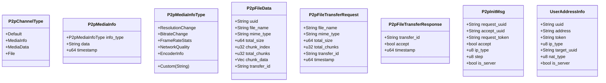

**图表来源**
- [p2p_models.rs:52-171](file://src-tauri/src/entity/p2p_models.rs#L52-L171)

**章节来源**
- [p2p_models.rs:52-171](file://src-tauri/src/entity/p2p_models.rs#L52-L171)
- [message_types.rs:1-124](file://src-tauri/src/utils/message_types.rs#L1-L124)

### 前后端实现差异与交互
- 前端
  - 发起 P2P 请求：通过 Tauri invoke 调用 send_p2p_init_msg。
  - 监听 P2P 请求事件：监听 listen_p2p_request，解析 P2P 初始化消息列表。
  - **新增** 媒体统计跟踪：通过 send_p2p_media_info 命令发送媒体状态信息。
  - **新增** 文件传输：通过文件选择器选择文件，发送文件传输请求，接收文件传输响应，分片发送文件数据。
- 后端
  - 通过 Tauri 命令层暴露统一接口，封装业务逻辑与 QUIC 交互。
  - 通过事件向前端派发媒体数据与控制指令。
  - **新增** 媒体信息通道处理：通过 media_info 事件接收对端媒体状态。
  - **新增** 文件传输事件处理：通过 p2p_file_data、p2p_file_transfer_request、p2p_file_transfer_response 事件处理文件传输相关消息。

**章节来源**
- [InitP2pMsg.tsx:1-35](file://apps/pc/src/components/P2p/InitP2pMsg.tsx#L1-L35)
- [ProcessQuicP2pStream.tsx:1-34](file://apps/pc/src/components/P2p/ProcessQuicP2pStream.tsx#L1-L34)
- [p2p_controller.rs:186-226](file://src-tauri/src/cmd/p2p_controller.rs#L186-L226)
- [index.tsx:688-720](file://apps/pc/src/components/Media/PrivacyVideoCall/index.tsx#L688-L720)
- [useP2pMessageApi.ts:1-114](file://apps/pc/src/hooks/useP2pMessageApi.ts#L1-L114)

## 文件传输功能

### 文件传输协议概述
P2P 文件传输采用基于 QUIC 的四通道架构，通过 File 通道实现可靠的大文件传输。协议包含三个主要阶段：握手阶段、传输阶段和完成阶段。

#### 文件传输协议流程
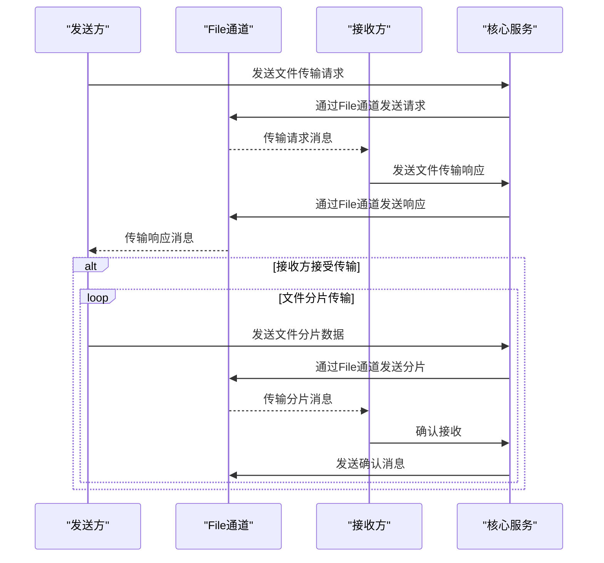

**图表来源**
- [p2p_service.rs:775-913](file://src-tauri/src/service/p2p_service.rs#L775-L913)
- [p2p_quic_service.rs:245-273](file://src-tauri/src/quic_service/p2p_service/p2p_quic_service.rs#L245-L273)

### 文件传输数据模型

#### P2pFileData - 文件分片数据
- **uuid**: 目标用户UUID
- **file_name**: 文件名
- **mime_type**: MIME类型（如 application/pdf, image/jpeg）
- **total_size**: 文件总大小（字节）
- **chunk_index**: 当前分片索引（从0开始）
- **total_chunks**: 总分片数
- **chunk_data**: 分片数据（字节数组）
- **transfer_id**: 文件传输ID（关联同一次传输的所有分片）

#### P2pFileTransferRequest - 文件传输请求
- **file_name**: 文件名
- **mime_type**: MIME类型
- **total_size**: 文件总大小（字节）
- **total_chunks**: 总分片数
- **transfer_id**: 文件传输ID
- **timestamp**: 时间戳

#### P2pFileTransferResponse - 文件传输响应
- **transfer_id**: 文件传输ID
- **accept**: 是否接受传输
- **timestamp**: 时间戳

**章节来源**
- [p2p_models.rs:121-171](file://src-tauri/src/entity/p2p_models.rs#L121-L171)

### 文件传输服务实现

#### 文件分片发送服务
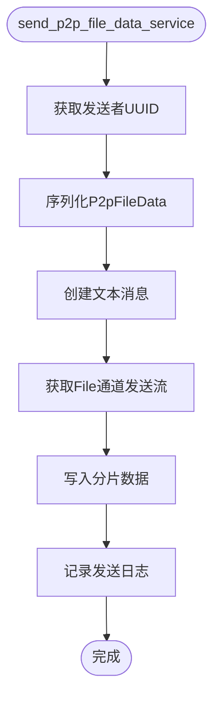

**图表来源**
- [p2p_service.rs:788-822](file://src-tauri/src/service/p2p_service.rs#L788-L822)

#### 文件传输请求服务
发送方在发送文件数据前必须先发送传输请求，等待接收方确认。

#### 文件传输响应服务
接收方收到传输请求后，通过响应服务回复接受或拒绝。

**章节来源**
- [p2p_service.rs:788-913](file://src-tauri/src/service/p2p_service.rs#L788-L913)

### 文件传输事件处理

#### 前端事件监听
前端通过 Tauri 事件系统监听文件传输相关事件：

- **p2p_file_data**: 接收文件分片数据
- **p2p_file_transfer_request**: 接收文件传输请求
- **p2p_file_transfer_response**: 接收文件传输响应

#### 事件处理流程
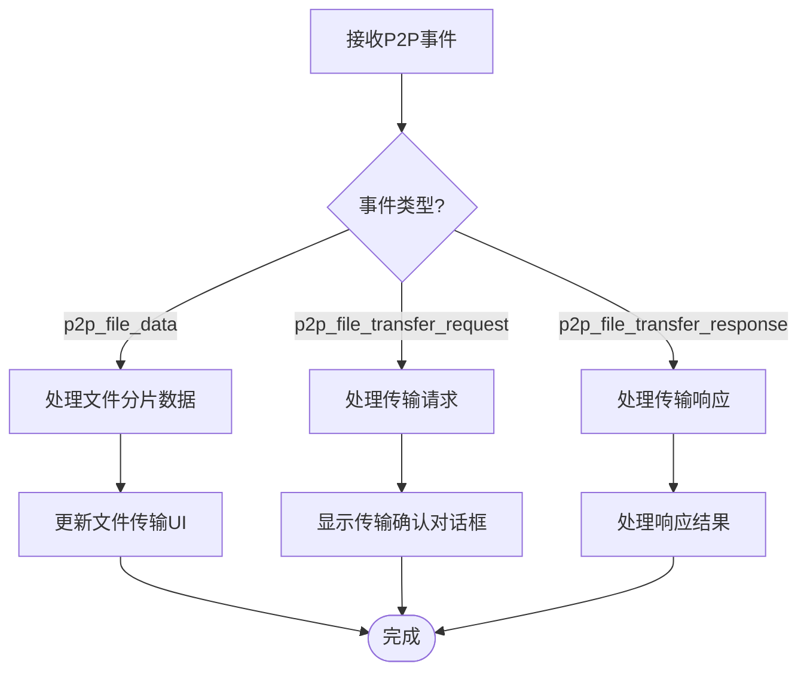

**图表来源**
- [p2p_quic_service.rs:245-273](file://src-tauri/src/quic_service/p2p_service/p2p_quic_service.rs#L245-L273)

**章节来源**
- [p2p_quic_service.rs:245-273](file://src-tauri/src/quic_service/p2p_service/p2p_quic_service.rs#L245-L273)

### 文件传输命令接口

#### Tauri 命令定义
- **send_p2p_file_data**: 发送文件分片数据
- **send_p2p_file_transfer_request**: 发送文件传输请求
- **send_p2p_file_transfer_response**: 发送文件传输响应

#### 命令参数与返回值
- 所有命令接收 JSON 字符串和目标用户UUID
- 返回 Result 类型，成功返回 Ok(()), 失败返回错误字符串
- 内部自动进行 JSON 反序列化和错误处理

**章节来源**
- [p2p_controller.rs:186-226](file://src-tauri/src/cmd/p2p_controller.rs#L186-L226)

## 依赖关系分析
- 组件耦合
  - p2p_quic_service 依赖消息类型常量与实体模型，负责消息分发与事件派发，**新增** 文件传输事件处理。
  - p2p_stream_quic_client/server 依赖 QUIC 端点与核心服务，负责连接建立与消息循环，**支持四通道架构**。
  - service/p2p_service 依赖控制器命令、UDP 工具与 QUIC 配置，负责业务编排与 NAT 穿越，**新增** 文件传输服务。
- 外部依赖
  - QUIC（quinn）、TLS（rustls）、异步运行时（tokio）、事件系统（tauri Emitter）。
- 潜在风险
  - 不安全证书配置仅用于开发环境，生产需替换为安全配置。
  - 心跳与连接状态需严格管理，避免僵尸连接与资源泄漏。
  - **新增** 文件传输的分片处理需要确保数据完整性。
  - **新增** 文件传输ID的唯一性保证，避免不同传输之间的数据混淆。

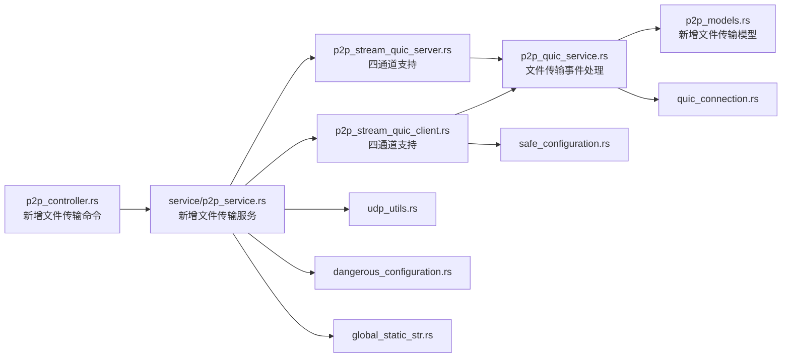

**图表来源**
- [p2p_controller.rs:186-226](file://src-tauri/src/cmd/p2p_controller.rs#L186-L226)
- [p2p_service.rs:775-913](file://src-tauri/src/service/p2p_service.rs#L775-L913)
- [p2p_stream_quic_client.rs:55-135](file://src-tauri/src/quic_service/p2p_service/p2p_stream_quic_client.rs#L55-L135)
- [p2p_stream_quic_server.rs:129-198](file://src-tauri/src/quic_service/p2p_service/p2p_stream_quic_server.rs#L129-L198)
- [p2p_quic_service.rs:245-273](file://src-tauri/src/quic_service/p2p_service/p2p_quic_service.rs#L245-L273)
- [p2p_models.rs:121-171](file://src-tauri/src/entity/p2p_models.rs#L121-L171)

**章节来源**
- [mod.rs:1-4](file://src-tauri/src/quic_service/p2p_service/mod.rs#L1-L4)
- [models.rs:1-11](file://src-tauri/src/quic_service/models.rs#L1-L11)

## 性能考量
- **双通道架构优势**
  - 媒体信息通道与数据通道分离，避免大数据帧阻塞控制信息
  - 提升媒体统计信息的实时性和可靠性
  - 减少网络拥塞对控制信令的影响
  - **新增** 文件通道独立于音视频通道，避免大文件传输影响实时通话质量
- **媒体缓冲与带宽**
  - 媒体配置包含视频/音频缓冲大小与最大延迟，可根据网络状况动态调整。
  - 建议在弱网环境下降低帧率与码率，启用自适应缓冲。
- **文件传输优化**
  - **分片大小**：根据网络状况动态调整分片大小，平衡传输效率和内存占用
  - **并发传输**：可考虑多分片并发传输以提高吞吐量
  - **断点续传**：支持传输中断后的断点续传功能
  - **压缩传输**：对可压缩文件类型启用压缩以减少带宽占用
- **心跳与空闲超时**
  - 心跳间隔与连接空闲超时需平衡保活与资源消耗，避免频繁唤醒。
  - **新增** 仅对 Default 通道发送心跳，减少不必要的网络开销。
- **发送通道背压**
  - 异步发送通道具备容量限制，建议前端控制发送速率，避免阻塞。
  - **新增** 媒体信息通道独立处理，确保控制信息优先级。
  - **新增** 文件传输通道的背压处理，避免大文件阻塞其他通道。
- **NAT 穿越效率**
  - IPv4/IPv6 双栈探测可提升成功率，但会增加网络负载，建议按需启用。
- **媒体统计开销**
  - 每2秒发送一次媒体统计信息，频率适中，不会造成显著网络负担。
  - 媒体信息数据量小，通过专用通道传输，不影响主数据流。

## 故障排查指南
- **连接无法建立**
  - 检查 QUIC 服务端/客户端配置是否正确，证书配置是否符合环境要求。
  - 确认服务器地址与端口可达，防火墙放行相应端口。
  - **新增** 检查四通道是否都能正常建立连接。
- **NAT 穿越失败**
  - 确认 UDP "ping" 是否成功发送与接收，服务器是否正确转发地址信息。
  - 参考 WebRTC NAT 分类与候选对策略，结合日志定位问题。
- **媒体数据丢失或卡顿**
  - 检查缓冲配置与网络带宽，适当降低分辨率/帧率/码率。
  - 关注心跳与连接状态，确保连接未被闲置超时关闭。
  - **新增** 检查 MediaInfo 通道是否正常工作，避免媒体统计信息阻塞。
- **文件传输失败**
  - **传输请求失败**：检查文件传输请求消息格式和目标用户UUID
  - **传输响应失败**：确认接收方是否正确处理传输请求并发送响应
  - **分片传输失败**：验证分片索引顺序和总分片数一致性
  - **数据完整性问题**：检查传输ID是否匹配，确保同一传输的所有分片正确关联
  - **内存不足**：监控分片大小和并发数量，避免内存溢出
- **事件未到达前端**
  - 确认事件名称与 payload 格式，检查前端监听逻辑是否正确。
  - **新增** 检查 p2p_file_data、p2p_file_transfer_request、p2p_file_transfer_response 事件是否正确处理。
- **媒体统计异常**
  - 确认前端定时器是否正常运行，检查媒体统计数据收集逻辑。
  - **新增** 检查媒体信息通道的发送和接收是否正常。
- **性能问题**
  - **高CPU占用**：检查文件传输的分片处理和序列化开销
  - **高内存使用**：监控文件传输过程中的内存占用情况
  - **网络拥塞**：观察传输速度和重传次数，调整分片大小和并发度

**章节来源**
- [NAT3_WEBRTC_FIX.md:198-220](file://NAT3_WEBRTC_FIX.md#L198-L220)
- [p2p_stream_quic_client.rs:135-135](file://src-tauri/src/quic_service/p2p_service/p2p_stream_quic_client.rs#L135-L135)
- [p2p_stream_quic_server.rs:195-198](file://src-tauri/src/quic_service/p2p_service/p2p_stream_quic_server.rs#L195-L198)
- [p2p_service.rs:911-913](file://src-tauri/src/service/p2p_service.rs#L911-L913)

## 结论
该 P2P 服务以 QUIC 为基础，结合服务器中转与 NAT 穿越策略，实现了从连接建立、媒体传输到信令交换的完整闭环。**最新版本**引入了双通道 QUIC 架构，将媒体信息通道与数据通道分离，显著提升了媒体统计信息的实时性和可靠性。**新增的文件传输功能**进一步扩展了 P2P 服务的应用场景，支持大文件的可靠传输，通过分片传输和握手协议确保数据完整性。完整的媒体统计跟踪系统为开发者提供了丰富的运行时监控能力。通过清晰的模块划分与事件驱动的前端交互，既保证了功能的可扩展性，也为后续优化与调试提供了明确路径。建议在生产环境中替换为安全的 TLS 配置，并持续优化媒体参数与缓冲策略以适配复杂网络场景。

## 附录

### 代码级流程图：双通道 QUIC 架构连接建立
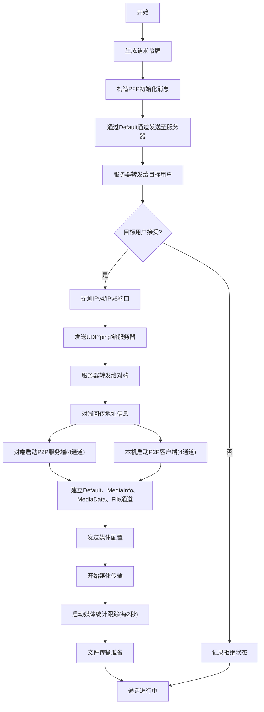

**图表来源**
- [p2p_service.rs:775-913](file://src-tauri/src/service/p2p_service.rs#L775-L913)
- [p2p_stream_quic_client.rs:55-135](file://src-tauri/src/quic_service/p2p_service/p2p_stream_quic_client.rs#L55-L135)
- [p2p_stream_quic_server.rs:129-198](file://src-tauri/src/quic_service/p2p_service/p2p_stream_quic_server.rs#L129-L198)
- [index.tsx:704-720](file://apps/pc/src/components/Media/PrivacyVideoCall/index.tsx#L704-L720)

### 代码级流程图：媒体统计跟踪系统
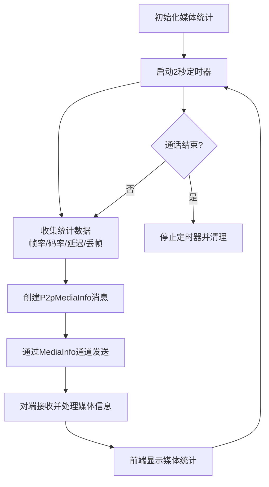

**图表来源**
- [index.tsx:688-720](file://apps/pc/src/components/Media/PrivacyVideoCall/index.tsx#L688-L720)
- [p2p_service.rs:544-593](file://src-tauri/src/service/p2p_service.rs#L544-L593)
- [p2p_quic_service.rs:233-242](file://src-tauri/src/quic_service/p2p_service/p2p_quic_service.rs#L233-L242)

### 代码级流程图：文件传输协议
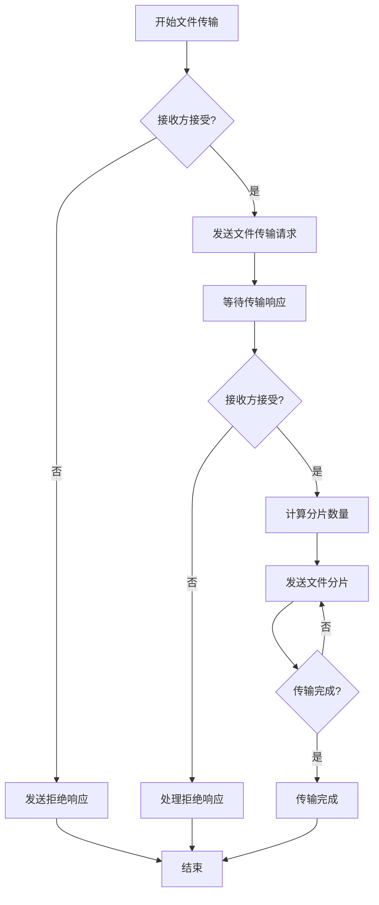

**图表来源**
- [p2p_service.rs:775-913](file://src-tauri/src/service/p2p_service.rs#L775-L913)
- [p2p_quic_service.rs:245-273](file://src-tauri/src/quic_service/p2p_service/p2p_quic_service.rs#L245-L273)

### 代码级流程图：心跳保活与资源清理
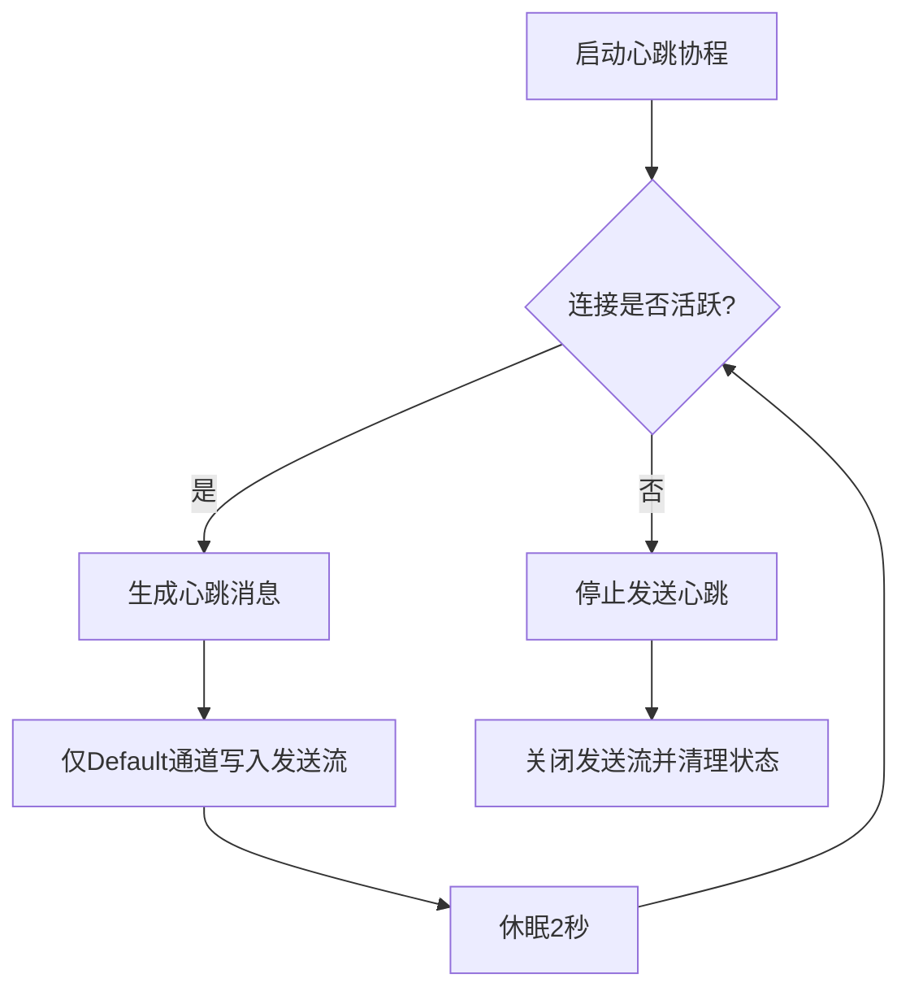

**图表来源**
- [p2p_quic_service.rs:319-354](file://src-tauri/src/quic_service/p2p_service/p2p_quic_service.rs#L319-L354)
- [p2p_stream_quic_client.rs:142-143](file://src-tauri/src/quic_service/p2p_service/p2p_stream_quic_client.rs#L142-L143)
- [p2p_stream_quic_server.rs:144-147](file://src-tauri/src/quic_service/p2p_service/p2p_stream_quic_server.rs#L144-L147)