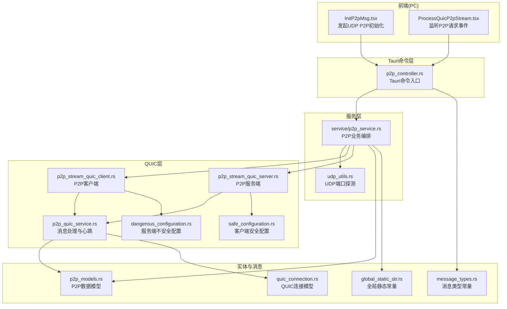
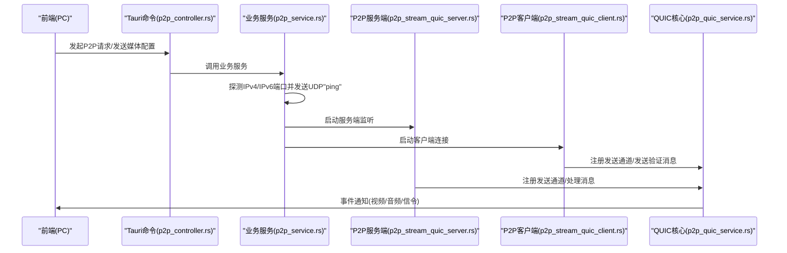
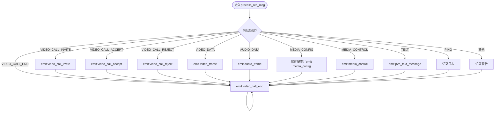
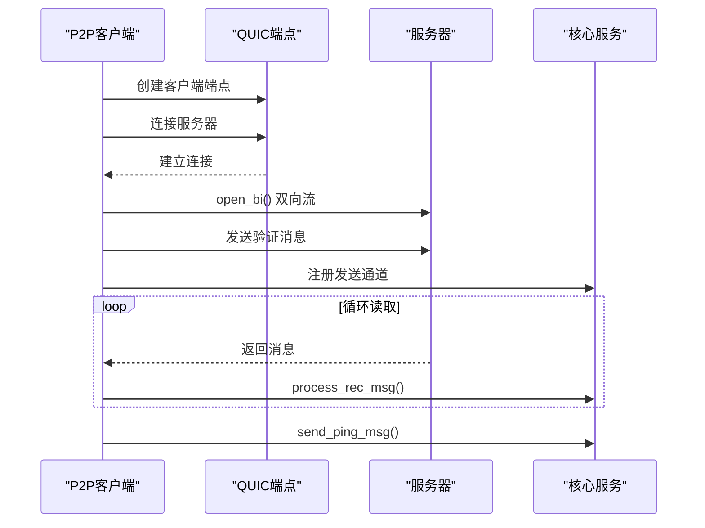
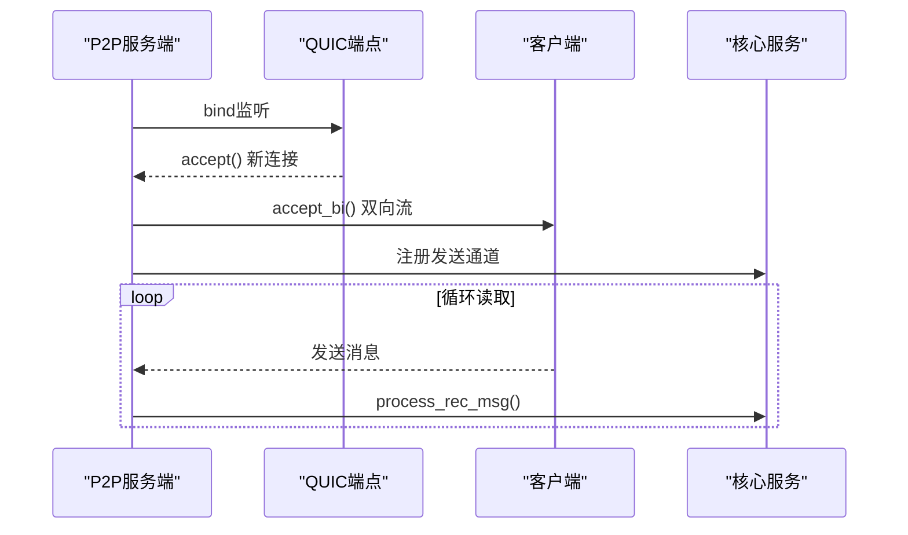
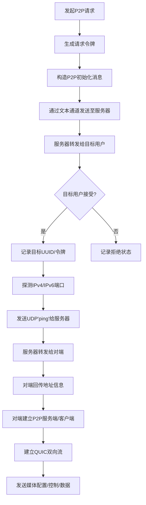
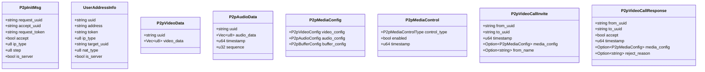
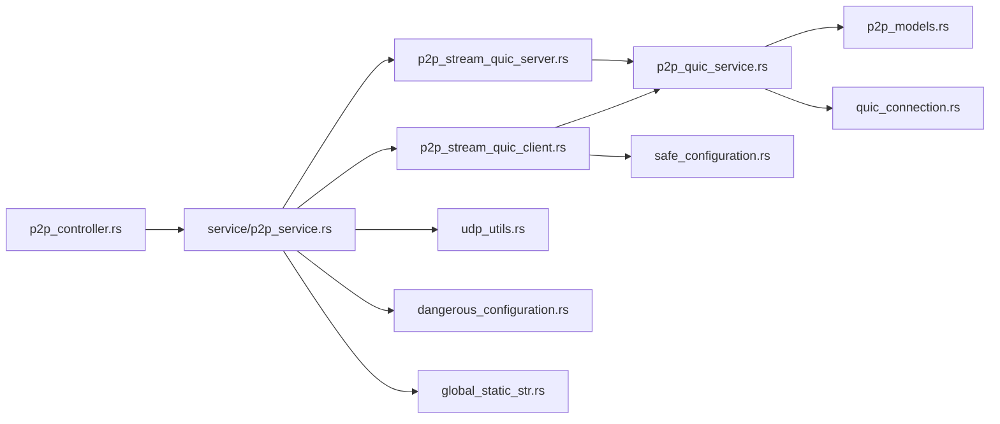
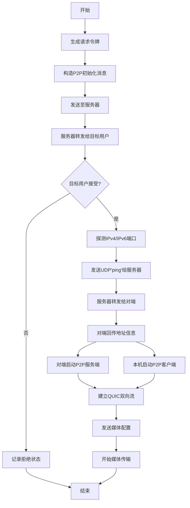
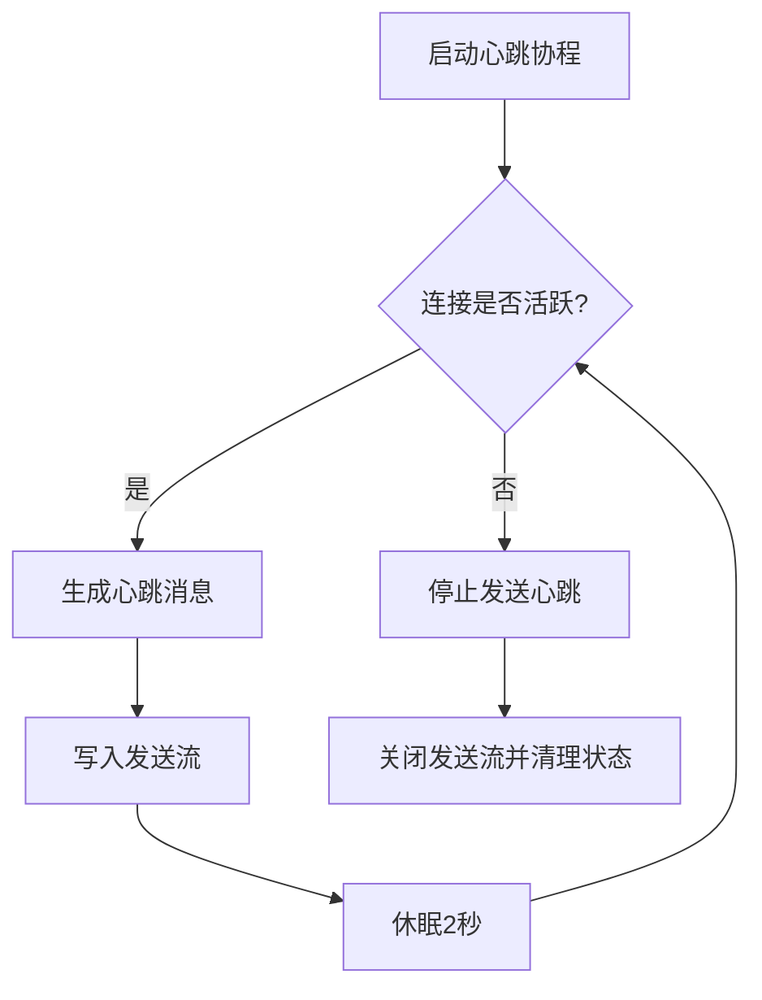

# P2P服务

<cite>
**本文引用的文件**
- [p2p_quic_service.rs](file://src-tauri/src/quic_service/p2p_service/p2p_quic_service.rs)
- [p2p_stream_quic_client.rs](file://src-tauri/src/quic_service/p2p_service/p2p_stream_quic_client.rs)
- [p2p_stream_quic_server.rs](file://src-tauri/src/quic_service/p2p_service/p2p_stream_quic_server.rs)
- [mod.rs](file://src-tauri/src/quic_service/p2p_service/mod.rs)
- [models.rs](file://src-tauri/src/quic_service/models.rs)
- [p2p_models.rs](file://src-tauri/src/entity/p2p_models.rs)
- [quic_connection.rs](file://src-tauri/src/entity/quic_connection.rs)
- [message_types.rs](file://src-tauri/src/utils/message_types.rs)
- [p2p_controller.rs](file://src-tauri/src/cmd/p2p_controller.rs)
- [p2p_service.rs](file://src-tauri/src/service/p2p_service.rs)
- [dangerous_configuration.rs](file://src-tauri/src/quic_service/dangerous_configuration.rs)
- [safe_configuration.rs](file://src-tauri/src/quic_service/safe_configuration.rs)
- [global_static_str.rs](file://src-tauri/src/utils/global_static_str.rs)
- [udp_utils.rs](file://src-tauri/src/quic_service/udp_utils.rs)
- [InitP2pMsg.tsx](file://apps/pc/src/components/P2p/InitP2pMsg.tsx)
- [ProcessQuicP2pStream.tsx](file://apps/pc/src/components/P2p/ProcessQuicP2pStream.tsx)
- [NAT3_WEBRTC_FIX.md](file://NAT3_WEBRTC_FIX.md)
</cite>

## 目录
1. [简介](#简介)
2. [项目结构](#项目结构)
3. [核心组件](#核心组件)
4. [架构总览](#架构总览)
5. [详细组件分析](#详细组件分析)
6. [依赖关系分析](#依赖关系分析)
7. [性能考量](#性能考量)
8. [故障排查指南](#故障排查指南)
9. [结论](#结论)
10. [附录](#附录)

## 简介
本文件系统性梳理 Rust + Tauri 项目中的 P2P 服务实现，重点覆盖：
- P2P 连接建立与管理
- 媒体流传输（视频/音频）与信令交换
- QUIC 协议在 P2P 通信中的应用
- NAT 穿越与 UDP 端口探测策略
- 数据模型设计与前后端差异
- 完整流程、错误处理与性能优化建议
- 代码级流程图与序列图，帮助开发者扩展与调试

## 项目结构
P2P 服务主要分布在以下模块：
- 服务端/客户端 QUIC 层：负责底层连接与双向流读写
- 业务服务层：封装 P2P 初始化、NAT 穿越、媒体配置与控制命令
- 控制器层：暴露 Tauri 命令给前端调用
- 实体与消息类型：定义 P2P 数据模型与消息类型常量
- 前端组件：演示如何发起 P2P 请求与监听 P2P 事件

**图表来源**
- [p2p_controller.rs:1-170](file://src-tauri/src/cmd/p2p_controller.rs#L1-L170)
- [p2p_service.rs:1-704](file://src-tauri/src/service/p2p_service.rs#L1-L704)
- [p2p_stream_quic_client.rs:1-137](file://src-tauri/src/quic_service/p2p_service/p2p_stream_quic_client.rs#L1-L137)
- [p2p_stream_quic_server.rs:1-168](file://src-tauri/src/quic_service/p2p_service/p2p_stream_quic_server.rs#L1-L168)
- [p2p_quic_service.rs:1-308](file://src-tauri/src/quic_service/p2p_service/p2p_quic_service.rs#L1-L308)
- [p2p_models.rs:1-283](file://src-tauri/src/entity/p2p_models.rs#L1-L283)
- [message_types.rs:1-108](file://src-tauri/src/utils/message_types.rs#L1-L108)
- [quic_connection.rs:1-64](file://src-tauri/src/entity/quic_connection.rs#L1-L64)
- [dangerous_configuration.rs:1-52](file://src-tauri/src/quic_service/dangerous_configuration.rs#L1-L52)
- [safe_configuration.rs:1-69](file://src-tauri/src/quic_service/safe_configuration.rs#L1-L69)
- [InitP2pMsg.tsx:1-35](file://apps/pc/src/components/P2p/InitP2pMsg.tsx#L1-L35)
- [ProcessQuicP2pStream.tsx:1-34](file://apps/pc/src/components/P2p/ProcessQuicP2pStream.tsx#L1-L34)

**章节来源**
- [p2p_controller.rs:1-170](file://src-tauri/src/cmd/p2p_controller.rs#L1-L170)
- [p2p_service.rs:1-704](file://src-tauri/src/service/p2p_service.rs#L1-L704)
- [p2p_stream_quic_client.rs:1-137](file://src-tauri/src/quic_service/p2p_service/p2p_stream_quic_client.rs#L1-L137)
- [p2p_stream_quic_server.rs:1-168](file://src-tauri/src/quic_service/p2p_service/p2p_stream_quic_server.rs#L1-L168)
- [p2p_quic_service.rs:1-308](file://src-tauri/src/quic_service/p2p_service/p2p_quic_service.rs#L1-L308)
- [p2p_models.rs:1-283](file://src-tauri/src/entity/p2p_models.rs#L1-L283)
- [message_types.rs:1-108](file://src-tauri/src/utils/message_types.rs#L1-L108)
- [quic_connection.rs:1-64](file://src-tauri/src/entity/quic_connection.rs#L1-L64)
- [dangerous_configuration.rs:1-52](file://src-tauri/src/quic_service/dangerous_configuration.rs#L1-L52)
- [safe_configuration.rs:1-69](file://src-tauri/src/quic_service/safe_configuration.rs#L1-L69)
- [InitP2pMsg.tsx:1-35](file://apps/pc/src/components/P2p/InitP2pMsg.tsx#L1-L35)
- [ProcessQuicP2pStream.tsx:1-34](file://apps/pc/src/components/P2p/ProcessQuicP2pStream.tsx#L1-L34)

## 核心组件
- QUIC P2P 服务核心
  - 发送通道与心跳：通过异步通道将视频帧转为文本消息并通过 QUIC 发送；周期性发送心跳维持连接活性。
  - 消息分发：根据消息类型分发到视频/音频数据、媒体配置、媒体控制、文本消息、信令等处理分支。
- P2P 客户端/服务端
  - 客户端：建立到服务器的 QUIC 连接，开启双向流，发送验证消息，注册发送通道，循环读取并处理消息。
  - 服务端：接受来自客户端的连接，为每个连接创建发送通道，循环读取并处理消息。
- 业务服务
  - P2P 初始化：构造初始化消息，通过文本通道发送至服务器，由服务器转发给目标用户。
  - NAT 穿越：探测本机 IPv4/IPv6 可用端口，向服务器发送地址信息，再通过 UDP “ping” 试探对端可达性。
  - 媒体配置与控制：发送媒体配置、媒体控制命令（如开关视频/音频、暂停/恢复、结束通话）。
  - 视频通话邀请/响应/结束：发送邀请、接受/拒绝、结束通话通知。
- 控制器与前端
  - Tauri 命令：封装发送视频帧、音频帧、文本消息、关闭连接、发送媒体配置/控制、视频通话邀请/响应/结束等。
  - 前端组件：演示如何发起 UDP P2P 初始化与监听 P2P 请求事件。

**章节来源**
- [p2p_quic_service.rs:26-308](file://src-tauri/src/quic_service/p2p_service/p2p_quic_service.rs#L26-L308)
- [p2p_stream_quic_client.rs:18-113](file://src-tauri/src/quic_service/p2p_service/p2p_stream_quic_client.rs#L18-L113)
- [p2p_stream_quic_server.rs:89-168](file://src-tauri/src/quic_service/p2p_service/p2p_stream_quic_server.rs#L89-L168)
- [p2p_service.rs:52-704](file://src-tauri/src/service/p2p_service.rs#L52-L704)
- [p2p_controller.rs:1-170](file://src-tauri/src/cmd/p2p_controller.rs#L1-L170)
- [InitP2pMsg.tsx:1-35](file://apps/pc/src/components/P2p/InitP2pMsg.tsx#L1-L35)
- [ProcessQuicP2pStream.tsx:1-34](file://apps/pc/src/components/P2p/ProcessQuicP2pStream.tsx#L1-L34)

## 架构总览
P2P 通信采用“服务器中转 + QUIC 直连”的混合架构：
- 初始阶段：通过服务器中转完成 P2P 初始化与地址交换，随后进行 NAT 穿越探测。
- 建立阶段：若 NAT 类型允许直连，直接建立 QUIC 双向流；否则通过服务器中继。
- 传输阶段：媒体数据与信令通过 QUIC 流传输，心跳维持连接活性。

**图表来源**
- [p2p_controller.rs:1-170](file://src-tauri/src/cmd/p2p_controller.rs#L1-L170)
- [p2p_service.rs:150-293](file://src-tauri/src/service/p2p_service.rs#L150-L293)
- [p2p_stream_quic_server.rs:89-168](file://src-tauri/src/quic_service/p2p_service/p2p_stream_quic_server.rs#L89-L168)
- [p2p_stream_quic_client.rs:18-113](file://src-tauri/src/quic_service/p2p_service/p2p_stream_quic_client.rs#L18-L113)
- [p2p_quic_service.rs:79-98](file://src-tauri/src/quic_service/p2p_service/p2p_quic_service.rs#L79-L98)

## 详细组件分析

### QUIC P2P 核心服务
- 异步发送通道与视频帧处理
  - 使用异步通道将视频帧数据排队，后台任务统一序列化为文本消息并通过 QUIC 发送。
  - 通过全局映射维护每条目标用户的发送流，按 UUID 获取发送通道。
- 消息处理与事件派发
  - 根据消息类型分发到不同处理分支：视频/音频数据、媒体配置、媒体控制、文本消息、信令等。
  - 通过 Tauri 事件向前端派发，如 video_frame、audio_frame、media_config、media_control、p2p_text_message 等。
- 心跳保活
  - 周期性发送心跳消息，检查连接活跃状态，异常时停止发送并清理资源。

**图表来源**
- [p2p_quic_service.rs:79-259](file://src-tauri/src/quic_service/p2p_service/p2p_quic_service.rs#L79-L259)

**章节来源**
- [p2p_quic_service.rs:26-308](file://src-tauri/src/quic_service/p2p_service/p2p_quic_service.rs#L26-L308)

### P2P 客户端
- 连接建立
  - 创建 QUIC 客户端端点，禁用证书验证（开发用途），连接服务器，开启双向流。
  - 发送验证消息（包含请求令牌），注册发送通道，标记连接为活跃。
- 消息处理
  - 循环读取服务器返回的消息，调用核心服务的消息处理函数，派发前端事件。
- 心跳保活
  - 启动心跳发送协程，周期性发送心跳，连接关闭时退出。

**图表来源**
- [p2p_stream_quic_client.rs:18-113](file://src-tauri/src/quic_service/p2p_service/p2p_stream_quic_client.rs#L18-L113)
- [p2p_quic_service.rs:272-307](file://src-tauri/src/quic_service/p2p_service/p2p_quic_service.rs#L272-L307)

**章节来源**
- [p2p_stream_quic_client.rs:18-113](file://src-tauri/src/quic_service/p2p_service/p2p_stream_quic_client.rs#L18-L113)

### P2P 服务端
- 连接接受
  - 创建 QUIC 服务端端点，接受客户端连接，为每个连接创建发送通道，标记连接为活跃。
- 消息处理
  - 循环读取客户端消息，调用核心服务的消息处理函数，派发前端事件。
- NAT 穿越辅助
  - 提供 UDP 端口转发工具函数，用于发送“ping”探测包。

**图表来源**
- [p2p_stream_quic_server.rs:89-168](file://src-tauri/src/quic_service/p2p_service/p2p_stream_quic_server.rs#L89-L168)
- [p2p_quic_service.rs:79-98](file://src-tauri/src/quic_service/p2p_service/p2p_quic_service.rs#L79-L98)

**章节来源**
- [p2p_stream_quic_server.rs:89-168](file://src-tauri/src/quic_service/p2p_service/p2p_stream_quic_server.rs#L89-L168)

### 业务服务（NAT 穿越与媒体协商）
- P2P 初始化
  - 生成请求令牌，构造初始化消息，通过文本通道发送至服务器，由服务器转发给目标用户。
- NAT 穿越
  - 探测本机可用 UDP 端口，构造用户地址信息，通过 UDP “ping” 发送给服务器，服务器再转发给对端。
  - 支持 IPv4 与 IPv6，分别发送探测包并记录端口。
- 媒体配置与控制
  - 发送媒体配置（视频/音频参数、缓冲策略），发送媒体控制命令（开关、暂停/恢复、结束通话）。
- 视频通话邀请/响应/结束
  - 发送邀请（可携带默认媒体配置），接收方接受/拒绝，最终结束通话。

**图表来源**
- [p2p_service.rs:52-193](file://src-tauri/src/service/p2p_service.rs#L52-L193)
- [p2p_service.rs:222-293](file://src-tauri/src/service/p2p_service.rs#L222-L293)

**章节来源**
- [p2p_service.rs:52-704](file://src-tauri/src/service/p2p_service.rs#L52-L704)

### 数据模型与消息类型
- P2P 数据模型
  - 初始化消息、用户地址信息、视频/音频数据包、媒体配置、媒体控制命令、视频通话邀请/响应/状态等。
- 消息类型常量
  - 定义 P2P 相关消息类型（视频/音频数据、媒体配置/控制、文本消息、视频通话邀请/接受/拒绝/结束、心跳等）。

**图表来源**
- [p2p_models.rs:1-283](file://src-tauri/src/entity/p2p_models.rs#L1-L283)

**章节来源**
- [p2p_models.rs:1-283](file://src-tauri/src/entity/p2p_models.rs#L1-L283)
- [message_types.rs:1-108](file://src-tauri/src/utils/message_types.rs#L1-L108)

### 前后端实现差异与交互
- 前端
  - 发起 P2P 请求：通过 Tauri invoke 调用 send_p2p_init_msg。
  - 监听 P2P 请求事件：监听 listen_p2p_request，解析 P2P 初始化消息列表。
- 后端
  - 通过 Tauri 命令层暴露统一接口，封装业务逻辑与 QUIC 交互。
  - 通过事件向前端派发媒体数据与控制指令。

**章节来源**
- [InitP2pMsg.tsx:1-35](file://apps/pc/src/components/P2p/InitP2pMsg.tsx#L1-L35)
- [ProcessQuicP2pStream.tsx:1-34](file://apps/pc/src/components/P2p/ProcessQuicP2pStream.tsx#L1-L34)
- [p2p_controller.rs:1-170](file://src-tauri/src/cmd/p2p_controller.rs#L1-L170)

## 依赖关系分析
- 组件耦合
  - p2p_quic_service 依赖消息类型常量与实体模型，负责消息分发与事件派发。
  - p2p_stream_quic_client/server 依赖 QUIC 端点与核心服务，负责连接建立与消息循环。
  - service/p2p_service 依赖控制器命令、UDP 工具与 QUIC 配置，负责业务编排与 NAT 穿越。
- 外部依赖
  - QUIC（quinn）、TLS（rustls）、异步运行时（tokio）、事件系统（tauri Emitter）。
- 潜在风险
  - 不安全证书配置仅用于开发环境，生产需替换为安全配置。
  - 心跳与连接状态需严格管理，避免僵尸连接与资源泄漏。

**图表来源**
- [p2p_controller.rs:1-170](file://src-tauri/src/cmd/p2p_controller.rs#L1-L170)
- [p2p_service.rs:1-704](file://src-tauri/src/service/p2p_service.rs#L1-L704)
- [p2p_stream_quic_client.rs:1-137](file://src-tauri/src/quic_service/p2p_service/p2p_stream_quic_client.rs#L1-L137)
- [p2p_stream_quic_server.rs:1-168](file://src-tauri/src/quic_service/p2p_service/p2p_stream_quic_server.rs#L1-L168)
- [p2p_quic_service.rs:1-308](file://src-tauri/src/quic_service/p2p_service/p2p_quic_service.rs#L1-L308)
- [p2p_models.rs:1-283](file://src-tauri/src/entity/p2p_models.rs#L1-L283)
- [quic_connection.rs:1-64](file://src-tauri/src/entity/quic_connection.rs#L1-L64)
- [dangerous_configuration.rs:1-52](file://src-tauri/src/quic_service/dangerous_configuration.rs#L1-L52)
- [safe_configuration.rs:1-69](file://src-tauri/src/quic_service/safe_configuration.rs#L1-L69)
- [udp_utils.rs:1-100](file://src-tauri/src/quic_service/udp_utils.rs#L1-L100)
- [global_static_str.rs:1-59](file://src-tauri/src/utils/global_static_str.rs#L1-L59)

**章节来源**
- [mod.rs:1-4](file://src-tauri/src/quic_service/p2p_service/mod.rs#L1-L4)
- [models.rs:1-11](file://src-tauri/src/quic_service/models.rs#L1-L11)

## 性能考量
- 媒体缓冲与带宽
  - 媒体配置包含视频/音频缓冲大小与最大延迟，可根据网络状况动态调整。
  - 建议在弱网环境下降低帧率与码率，启用自适应缓冲。
- 心跳与空闲超时
  - 心跳间隔与连接空闲超时需平衡保活与资源消耗，避免频繁唤醒。
- 发送通道背压
  - 异步发送通道具备容量限制，建议前端控制发送速率，避免阻塞。
- NAT 穿越效率
  - IPv4/IPv6 双栈探测可提升成功率，但会增加网络负载，建议按需启用。

[本节为通用性能建议，无需特定文件引用]

## 故障排查指南
- 连接无法建立
  - 检查 QUIC 服务端/客户端配置是否正确，证书配置是否符合环境要求。
  - 确认服务器地址与端口可达，防火墙放行相应端口。
- NAT 穿越失败
  - 确认 UDP “ping” 是否成功发送与接收，服务器是否正确转发地址信息。
  - 参考 WebRTC NAT 分类与候选对策略，结合日志定位问题。
- 媒体数据丢失或卡顿
  - 检查缓冲配置与网络带宽，适当降低分辨率/帧率/码率。
  - 关注心跳与连接状态，确保连接未被闲置超时关闭。
- 事件未到达前端
  - 确认事件名称与 payload 格式，检查前端监听逻辑是否正确。

**章节来源**
- [NAT3_WEBRTC_FIX.md:198-220](file://NAT3_WEBRTC_FIX.md#L198-L220)
- [p2p_stream_quic_client.rs:115-137](file://src-tauri/src/quic_service/p2p_service/p2p_stream_quic_client.rs#L115-L137)
- [p2p_stream_quic_server.rs:1-168](file://src-tauri/src/quic_service/p2p_service/p2p_stream_quic_server.rs#L1-L168)
- [p2p_service.rs:354-386](file://src-tauri/src/service/p2p_service.rs#L354-L386)

## 结论
该 P2P 服务以 QUIC 为基础，结合服务器中转与 NAT 穿越策略，实现了从连接建立、媒体传输到信令交换的完整闭环。通过清晰的模块划分与事件驱动的前端交互，既保证了功能的可扩展性，也为后续优化与调试提供了明确路径。建议在生产环境中替换为安全的 TLS 配置，并持续优化媒体参数与缓冲策略以适配复杂网络场景。

[本节为总结性内容，无需特定文件引用]

## 附录

### 代码级流程图：P2P 连接建立与媒体协商

**图表来源**
- [p2p_service.rs:52-193](file://src-tauri/src/service/p2p_service.rs#L52-L193)
- [p2p_service.rs:222-293](file://src-tauri/src/service/p2p_service.rs#L222-L293)
- [p2p_stream_quic_client.rs:18-113](file://src-tauri/src/quic_service/p2p_service/p2p_stream_quic_client.rs#L18-L113)
- [p2p_stream_quic_server.rs:89-168](file://src-tauri/src/quic_service/p2p_service/p2p_stream_quic_server.rs#L89-L168)

### 代码级流程图：心跳保活与资源清理

**图表来源**
- [p2p_quic_service.rs:272-307](file://src-tauri/src/quic_service/p2p_service/p2p_quic_service.rs#L272-L307)
- [p2p_service.rs:354-386](file://src-tauri/src/service/p2p_service.rs#L354-L386)