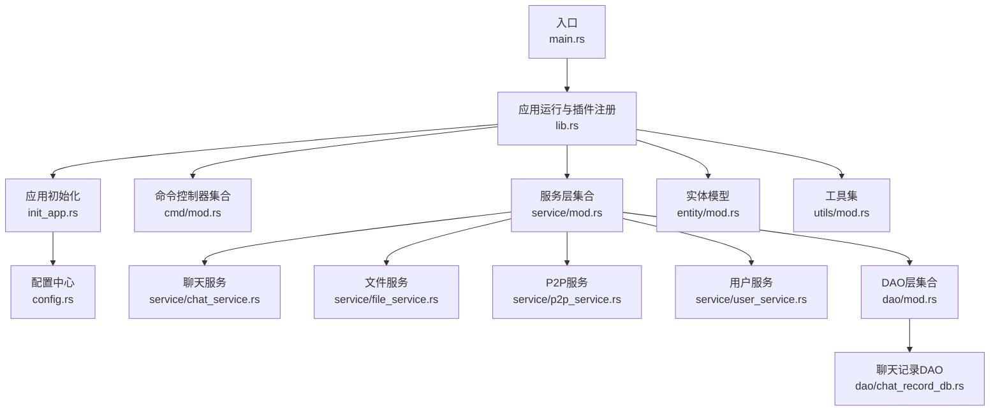
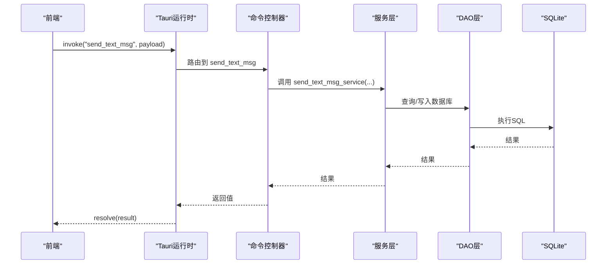
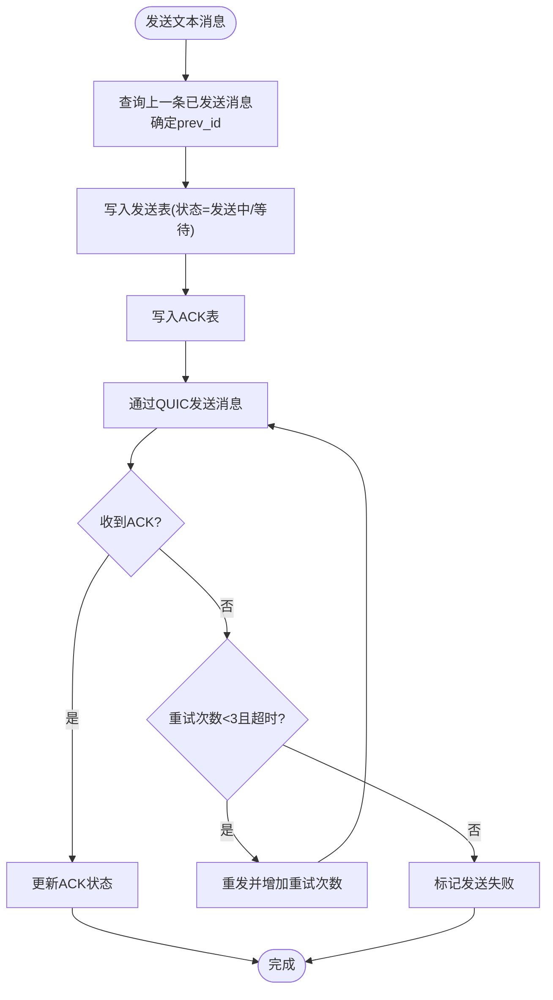
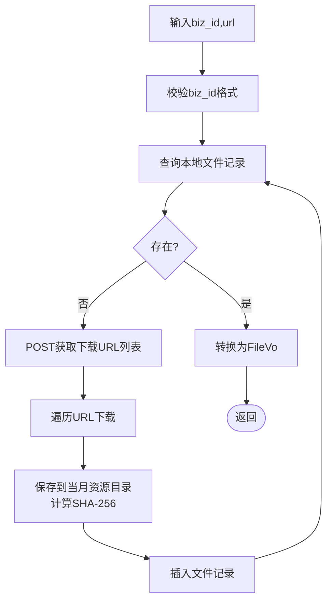
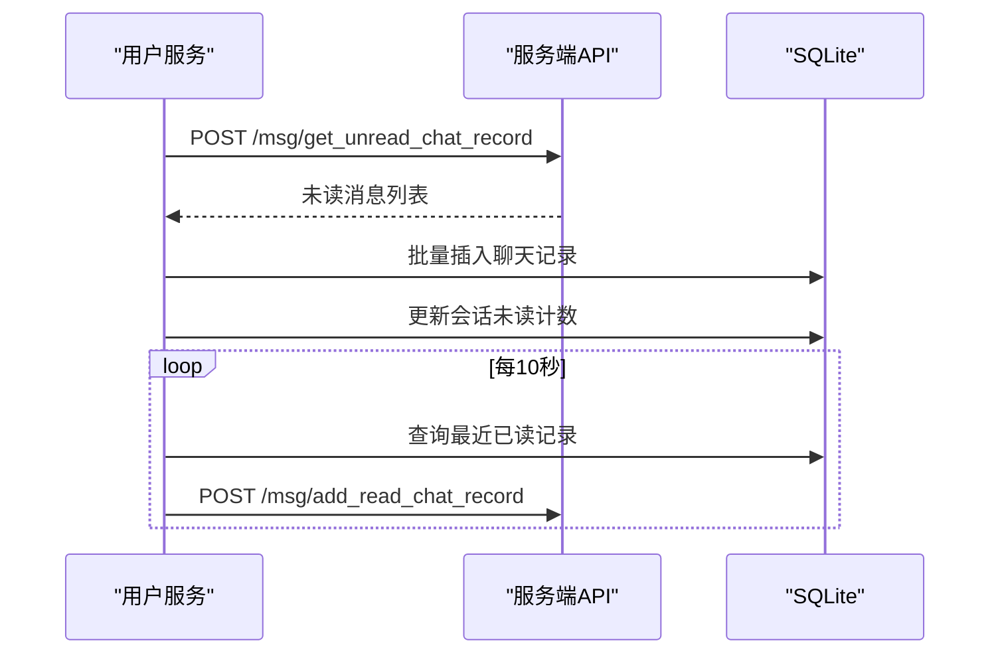
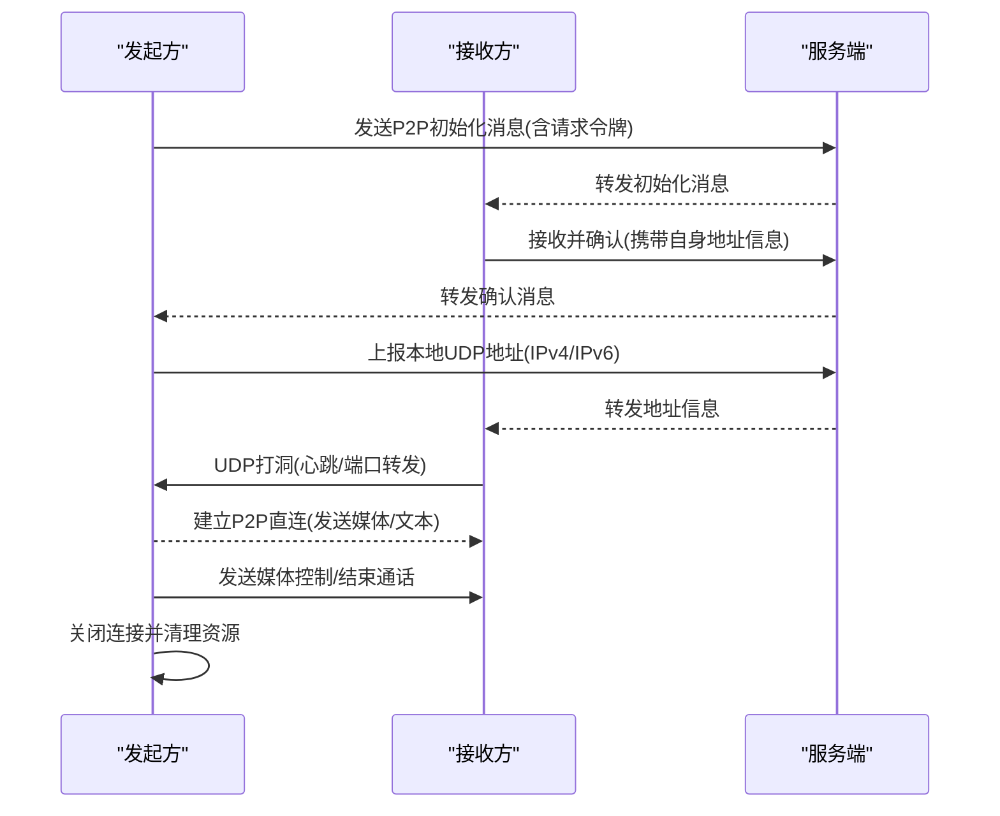
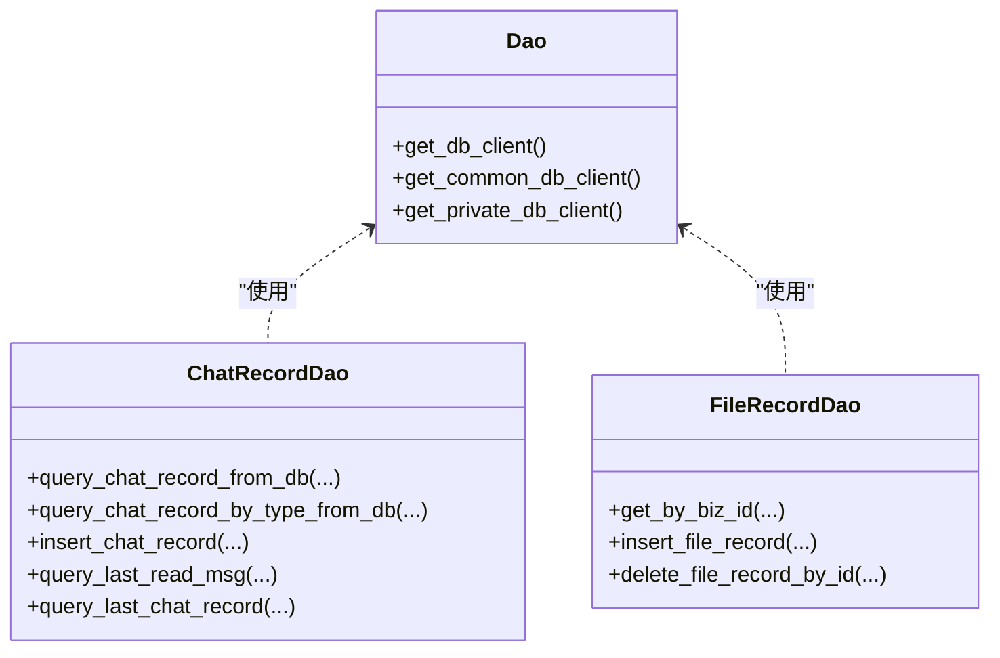
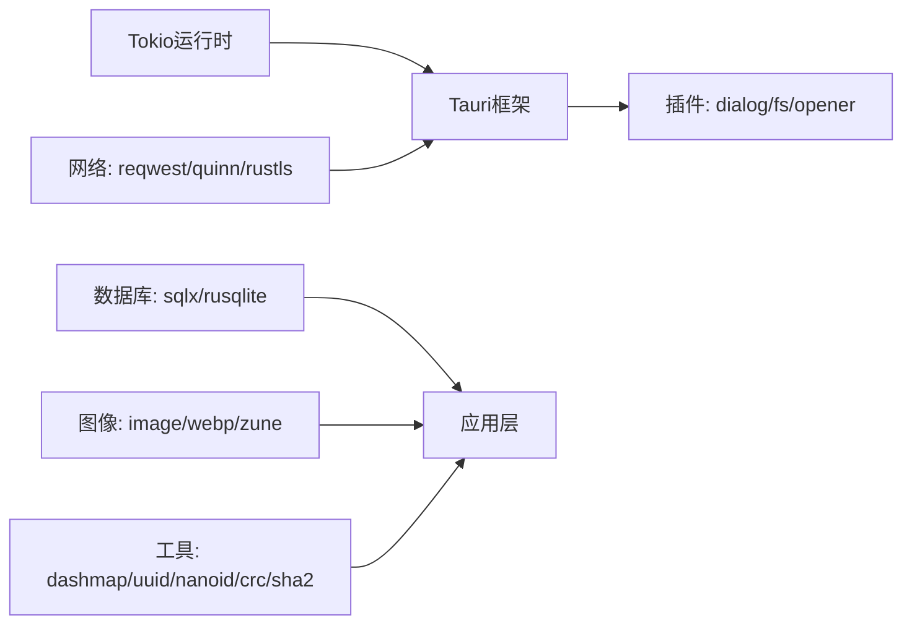

# 后端服务

<cite>
**本文引用的文件**
- [Cargo.toml](file://src-tauri/Cargo.toml)
- [main.rs](file://src-tauri/src/main.rs)
- [lib.rs](file://src-tauri/src/lib.rs)
- [init_app.rs](file://src-tauri/src/init_app.rs)
- [config.rs](file://src-tauri/src/config.rs)
- [cmd/mod.rs](file://src-tauri/src/cmd/mod.rs)
- [service/mod.rs](file://src-tauri/src/service/mod.rs)
- [dao/mod.rs](file://src-tauri/src/dao/mod.rs)
- [entity/mod.rs](file://src-tauri/src/entity/mod.rs)
- [utils/mod.rs](file://src-tauri/src/utils/mod.rs)
- [service/chat_service.rs](file://src-tauri/src/service/chat_service.rs)
- [service/file_service.rs](file://src-tauri/src/service/file_service.rs)
- [service/p2p_service.rs](file://src-tauri/src/service/p2p_service.rs)
- [service/user_service.rs](file://src-tauri/src/service/user_service.rs)
- [dao/chat_record_db.rs](file://src-tauri/src/dao/chat_record_db.rs)
</cite>

## 目录

1. [简介](#简介)
2. [项目结构](#项目结构)
3. [核心组件](#核心组件)
4. [架构总览](#架构总览)
5. [详细组件分析](#详细组件分析)
6. [依赖关系分析](#依赖关系分析)
7. [性能考量](#性能考量)
8. [故障排查指南](#故障排查指南)
9. [结论](#结论)
10. [附录](#附录)

## 简介

本文件面向后端开发者，系统性梳理 Rust 后端服务的整体架构与实现细节，覆盖服务模块的设计模式、命令处理器的实现机制、数据访问层的抽象设计，以及聊天服务、文件服务、用户服务与 P2P 服务的业务逻辑。同时解释 Tauri 前后端通信机制、异步处理模式与错误处理策略，给出服务接口定义、参数规范与返回值格式说明，并提供扩展新服务功能的实践建议。

## 项目结构

后端以 Tauri 为宿主，Rust 为核心语言，采用模块化组织方式：

- 入口与生命周期管理：main.rs、lib.rs、init_app.rs
- 配置中心：config.rs
- 命令控制器：cmd/mod.rs 及其子模块（api、auth、chat_record、chat_session、file、friend、notification、p2p、user）
- 服务层：service/mod.rs 及其子模块（api、chat、file、friend、p2p、user）
- 数据访问层：dao/mod.rs 及其子模块（chat*record*_、file*record_db、friend_db、init*_、session_db、store）
- 实体与值对象：entity/mod.rs
- 工具与常量：utils/mod.rs
- 依赖声明：Cargo.toml



**图示来源**

- [main.rs:1-8](file://src-tauri/src/main.rs#L1-L8)
- [lib.rs:1-167](file://src-tauri/src/lib.rs#L1-L167)
- [init_app.rs:1-186](file://src-tauri/src/init_app.rs#L1-L186)
- [config.rs:1-155](file://src-tauri/src/config.rs#L1-L155)
- [cmd/mod.rs:1-10](file://src-tauri/src/cmd/mod.rs#L1-L10)
- [service/mod.rs:1-7](file://src-tauri/src/service/mod.rs#L1-L7)
- [dao/mod.rs:1-39](file://src-tauri/src/dao/mod.rs#L1-L39)
- [entity/mod.rs:1-23](file://src-tauri/src/entity/mod.rs#L1-L23)
- [utils/mod.rs:1-8](file://src-tauri/src/utils/mod.rs#L1-L8)

**章节来源**

- [main.rs:1-8](file://src-tauri/src/main.rs#L1-L8)
- [lib.rs:1-167](file://src-tauri/src/lib.rs#L1-L167)
- [init_app.rs:1-186](file://src-tauri/src/init_app.rs#L1-L186)
- [config.rs:1-155](file://src-tauri/src/config.rs#L1-L155)
- [cmd/mod.rs:1-10](file://src-tauri/src/cmd/mod.rs#L1-L10)
- [service/mod.rs:1-7](file://src-tauri/src/service/mod.rs#L1-L7)
- [dao/mod.rs:1-39](file://src-tauri/src/dao/mod.rs#L1-L39)
- [entity/mod.rs:1-23](file://src-tauri/src/entity/mod.rs#L1-L23)
- [utils/mod.rs:1-8](file://src-tauri/src/utils/mod.rs#L1-L8)

## 核心组件

- 应用运行与插件注册：通过 Tauri Builder 注册插件（对话框、文件系统、外部打开器），在 setup 中初始化托盘与异步初始化应用根路径、日志、资源目录、SQLite 数据库，并启动 QUIC 客户端与定时任务。
- 全局状态与并发：使用 OnceLock/AppHandle、DashMap、Arc<RwLock<...>>、Mutex 等实现全局配置、QUIC 连接、用户信息、消息发送锁等共享状态的安全访问。
- 命令处理器：通过 generate_handler! 将各控制器函数暴露给前端调用，统一以 invoke 方式交互。
- 服务层：封装业务流程，协调 DAO 层与外部服务（HTTP、QUIC）。
- DAO 层：基于 sqlx 的 SQLite 访问，提供聊天记录、会话、文件记录等 CRUD。
- 实体与 VO：定义消息、会话、文件、P2P 模型及传输 VO。
- 工具集：DNS 解析、时间、UUID、图像压缩、消息类型常量等。

**章节来源**

- [lib.rs:57-75](file://src-tauri/src/lib.rs#L57-L75)
- [lib.rs:91-166](file://src-tauri/src/lib.rs#L91-L166)
- [init_app.rs:19-91](file://src-tauri/src/init_app.rs#L19-L91)
- [config.rs:7-155](file://src-tauri/src/config.rs#L7-L155)

## 架构总览

后端采用“命令控制器 → 服务层 → DAO 层”的分层架构，结合 Tauri 的 invoke 通道与 Tokio 异步运行时，实现高性能的前后端通信与业务处理。

```mermaid
graph TB
subgraph "前端"
FE["Tauri 前端"]
end
subgraph "后端"
CMD["命令控制器<br/>cmd/*_controller.rs"]
SVC["服务层<br/>service/*.rs"]
DAO["DAO层<br/>dao/*.rs"]
DB["SQLite/私有数据库"]
EXT["外部服务<br/>HTTP/QUIC"]
end
FE <- --> CMD
CMD --> SVC
SVC --> DAO
DAO --> DB
SVC --> EXT
```

**图示来源**

- [lib.rs:117-163](file://src-tauri/src/lib.rs#L117-L163)
- [service/chat_service.rs:1-582](file://src-tauri/src/service/chat_service.rs#L1-L582)
- [service/file_service.rs:1-210](file://src-tauri/src/service/file_service.rs#L1-L210)
- [service/p2p_service.rs:1-704](file://src-tauri/src/service/p2p_service.rs#L1-L704)
- [service/user_service.rs:1-284](file://src-tauri/src/service/user_service.rs#L1-L284)
- [dao/chat_record_db.rs:1-106](file://src-tauri/src/dao/chat_record_db.rs#L1-L106)

## 详细组件分析

### 命令控制器与 Tauri 通信机制

- 命令注册：通过 generate_handler! 将多个命令函数注册到 Tauri invoke 通道，前端以 invoke('command', payload) 调用。
- 生命周期：setup 中初始化全局 AppHandle、托盘、日志、资源目录与数据库；随后启动 QUIC 客户端与定时任务。
- 平台差异：Linux 下设置特定环境变量以兼容渲染后端。



**图示来源**

- [lib.rs:117-163](file://src-tauri/src/lib.rs#L117-L163)
- [service/chat_service.rs:280-374](file://src-tauri/src/service/chat_service.rs#L280-L374)
- [dao/chat_record_db.rs:42-55](file://src-tauri/src/dao/chat_record_db.rs#L42-L55)

**章节来源**

- [lib.rs:91-166](file://src-tauri/src/lib.rs#L91-L166)
- [init_app.rs:19-91](file://src-tauri/src/init_app.rs#L19-L91)

### 聊天服务（Chat Service）

- 会话管理：查询/创建/更新会话，维护未读计数与最后一条消息。
- 文本消息发送：构建消息链路（prev_id）、写入发送表与 ACK 表，通过 QUIC 发送；支持重试与超时处理。
- 图片消息发送：压缩为 WebP、上传至文件服务、构造 ImageRecord 并走文本消息发送流程。
- 已读同步：定时扫描本地未读消息，批量上报服务端并更新会话状态。
- 数据访问：通过 DAO 层读写聊天记录、ACK、发送状态、会话与最后已读记录。



**图示来源**

- [service/chat_service.rs:280-374](file://src-tauri/src/service/chat_service.rs#L280-L374)
- [service/chat_service.rs:398-491](file://src-tauri/src/service/chat_service.rs#L398-L491)
- [dao/chat_record_db.rs:73-85](file://src-tauri/src/dao/chat_record_db.rs#L73-L85)

**章节来源**

- [service/chat_service.rs:67-178](file://src-tauri/src/service/chat_service.rs#L67-L178)
- [service/chat_service.rs:280-582](file://src-tauri/src/service/chat_service.rs#L280-L582)
- [dao/chat_record_db.rs:1-106](file://src-tauri/src/dao/chat_record_db.rs#L1-L106)

### 文件服务（File Service）

- 业务 ID 文件获取：校验 biz_id，优先本地查找；若缺失则远程拉取并落盘，计算 SHA-256 哈希，入库记录。
- 下载流程：POST 获取下载 URL 列表，逐个 GET 二进制流，提取 Content-Disposition 中的原始文件名与扩展名，保存到当月资源目录，插入文件记录。
- 返回值：转换为 FileVo，包含绝对路径、原始字节、MIME 类型、大小等。



**图示来源**

- [service/file_service.rs:20-84](file://src-tauri/src/service/file_service.rs#L20-L84)
- [service/file_service.rs:89-189](file://src-tauri/src/service/file_service.rs#L89-L189)

**章节来源**

- [service/file_service.rs:1-210](file://src-tauri/src/service/file_service.rs#L1-L210)

### 用户服务（User Service）

- 登录初始化：初始化公共/私有数据库、拉取好友列表、未读消息与未读通知；启动 QUIC 客户端与定时任务。
- 未读消息处理：拉取服务端未读消息，入库并聚合会话未读计数，更新会话。
- 定时任务：周期性处理未发送消息、上报已读消息、校验调度键。
- 通知处理：拉取系统通知并入库。



**图示来源**

- [service/user_service.rs:27-53](file://src-tauri/src/service/user_service.rs#L27-L53)
- [service/user_service.rs:70-139](file://src-tauri/src/service/user_service.rs#L70-L139)
- [service/user_service.rs:141-245](file://src-tauri/src/service/user_service.rs#L141-L245)

**章节来源**

- [service/user_service.rs:1-284](file://src-tauri/src/service/user_service.rs#L1-L284)

### P2P 服务（P2P Service）

- 初始化与地址探测：生成请求令牌，检测 IPv4/IPv6 可用端口，向服务端上报地址信息并通过 UDP 打洞。
- 连接建立：根据对端 IP 类型选择 IPv4 服务端/客户端，通过 UDP 心跳与端口转发建立直连。
- 媒体与文本：支持发送视频帧、音频帧、文本消息、媒体配置与控制命令（切换音视频、暂停/恢复、结束通话）。
- 资源清理：关闭发送流、清理用户信息与发送器映射。



**图示来源**

- [service/p2p_service.rs:52-148](file://src-tauri/src/service/p2p_service.rs#L52-L148)
- [service/p2p_service.rs:150-193](file://src-tauri/src/service/p2p_service.rs#L150-L193)
- [service/p2p_service.rs:222-293](file://src-tauri/src/service/p2p_service.rs#L222-L293)
- [service/p2p_service.rs:354-386](file://src-tauri/src/service/p2p_service.rs#L354-L386)

**章节来源**

- [service/p2p_service.rs:1-704](file://src-tauri/src/service/p2p_service.rs#L1-L704)

### 数据访问层（DAO）抽象

- 连接池管理：通过全局 RwLock<Option<Arc<SqlitePool>>> 提供公共/私有/用户数据库连接池获取方法。
- 聊天记录：分页查询、按类型过滤、按 ID 查询、插入、查询最后已读与最后一条消息。
- 文件记录：按 biz_id 查询、插入记录、按 id 删除。
- 会话：查询/更新本地/远端会话。
- 读写分离：公共数据与私有数据分别使用不同连接池。



**图示来源**

- [dao/mod.rs:18-38](file://src-tauri/src/dao/mod.rs#L18-L38)
- [dao/chat_record_db.rs:1-106](file://src-tauri/src/dao/chat_record_db.rs#L1-L106)

**章节来源**

- [dao/mod.rs:1-39](file://src-tauri/src/dao/mod.rs#L1-L39)
- [dao/chat_record_db.rs:1-106](file://src-tauri/src/dao/chat_record_db.rs#L1-L106)

## 依赖关系分析

- 运行时与插件：Tokio 全功能运行时、Tauri 插件（对话框、文件系统、外部打开器）、日志 fast_log。
- 网络与安全：reqwest（rustls）、quinn、rustls、rcgen、webpki-roots。
- 数据库：sqlx（SQLite）、rusqlite（bundled-sqlcipher）。
- 图像与多媒体：image、webp、zune-\*、kamadak-exif。
- 并发与工具：dashmap、sha2、uuid、nanoid、crc。



**图示来源**

- [Cargo.toml:24-62](file://src-tauri/Cargo.toml#L24-L62)

**章节来源**

- [Cargo.toml:1-62](file://src-tauri/Cargo.toml#L1-L62)

## 性能考量

- 异步并发：全链路使用 async/await，Tokio 全功能运行时，合理拆分任务（定时任务、QUIC 客户端、IO 操作）。
- 连接池复用：SQLite 连接池按场景隔离（公共/私有），避免阻塞。
- 缓存与锁：全局配置使用 DashMap，消息发送使用 Mutex 保护关键路径，避免竞态。
- I/O 优化：图片压缩与文件落盘在当月资源目录，减少跨卷拷贝；下载时先计算哈希再入库。
- 超时与重试：消息发送与定时任务设置超时，避免长时间阻塞。

## 故障排查指南

- 初始化失败：检查日志初始化、资源目录创建、SQLite 初始化与 IPv6 支持检测。
- 命令调用失败：确认命令已在 generate_handler! 中注册，前端 invoke 名称一致。
- 数据库异常：核对连接池初始化顺序与数据库文件权限。
- QUIC 连接问题：检查域名解析、端口占用与防火墙策略。
- P2P 打洞失败：确认 IPv4/IPv6 地址上报与 UDP 转发成功，端口可用。

**章节来源**

- [init_app.rs:19-91](file://src-tauri/src/init_app.rs#L19-L91)
- [lib.rs:117-163](file://src-tauri/src/lib.rs#L117-L163)
- [service/p2p_service.rs:150-193](file://src-tauri/src/service/p2p_service.rs#L150-L193)

## 结论

该后端服务以 Tauri 为载体，采用清晰的分层架构与异步并发模型，实现了聊天、文件、用户与 P2P 等核心业务能力。通过统一的命令控制器与服务层抽象，DAO 层与外部服务解耦，具备良好的可维护性与扩展性。建议在新增服务时遵循现有命名与模块划分，严格定义 DTO/VO，完善错误传播与日志记录，并充分利用全局状态与连接池提升性能。

## 附录

### 服务接口定义与参数规范（示例）

- 发送文本消息
  - 前端调用：invoke("send_text_msg", TextQuicMsgVo)
  - 参数：nano_id、raw、timestamp、send_user、recv_user、text_type
  - 返回：字符串（成功/失败描述）
- 发送图片消息
  - 前端调用：invoke("send_image_msg", TextQuicMsgVo)
  - 参数：raw 为本地图片路径
  - 返回：空/错误
- 获取会话列表
  - 前端调用：invoke("get_chat_session_from_store")
  - 返回：ChatSessionVo 数组
- 获取聊天记录
  - 前端调用：invoke("get_chat_record_from_store", {text_quic_msg, page})
  - 返回：TextQuicMsgVo 数组
- 获取文件（按 biz_id）
  - 前端调用：invoke("get_file_by_biz_id", {biz_id, url})
  - 返回：FileVo 数组
- P2P 初始化
  - 前端调用：invoke("send_p2p_init_msg", target_uuid)
  - 返回：空/错误
- P2P 媒体控制
  - 前端调用：invoke("send_p2p_media_control", {control_type, enabled, target_uuid})
  - 返回：空/错误

**章节来源**

- [lib.rs:117-163](file://src-tauri/src/lib.rs#L117-L163)
- [service/chat_service.rs:67-101](file://src-tauri/src/service/chat_service.rs#L67-L101)
- [service/file_service.rs:20-84](file://src-tauri/src/service/file_service.rs#L20-L84)
- [service/p2p_service.rs:52-148](file://src-tauri/src/service/p2p_service.rs#L52-L148)
- [service/p2p_service.rs:462-521](file://src-tauri/src/service/p2p_service.rs#L462-L521)
