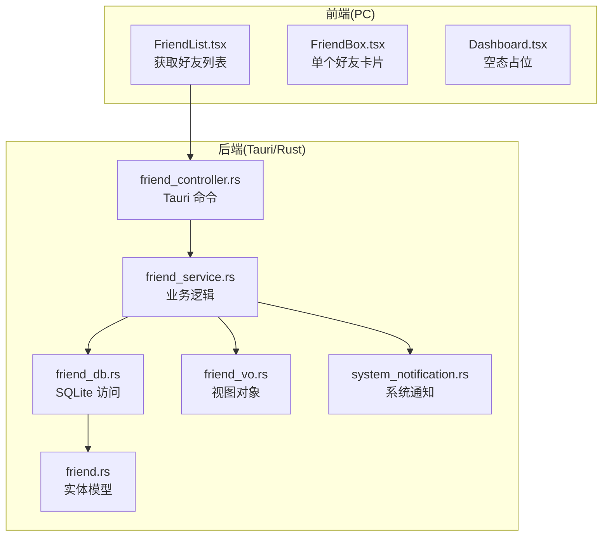
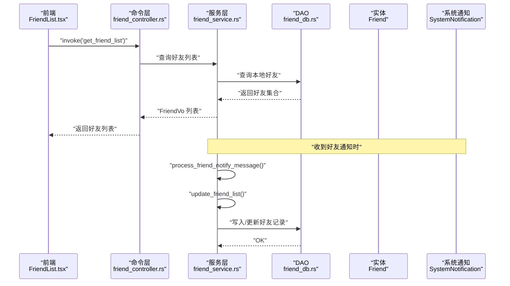
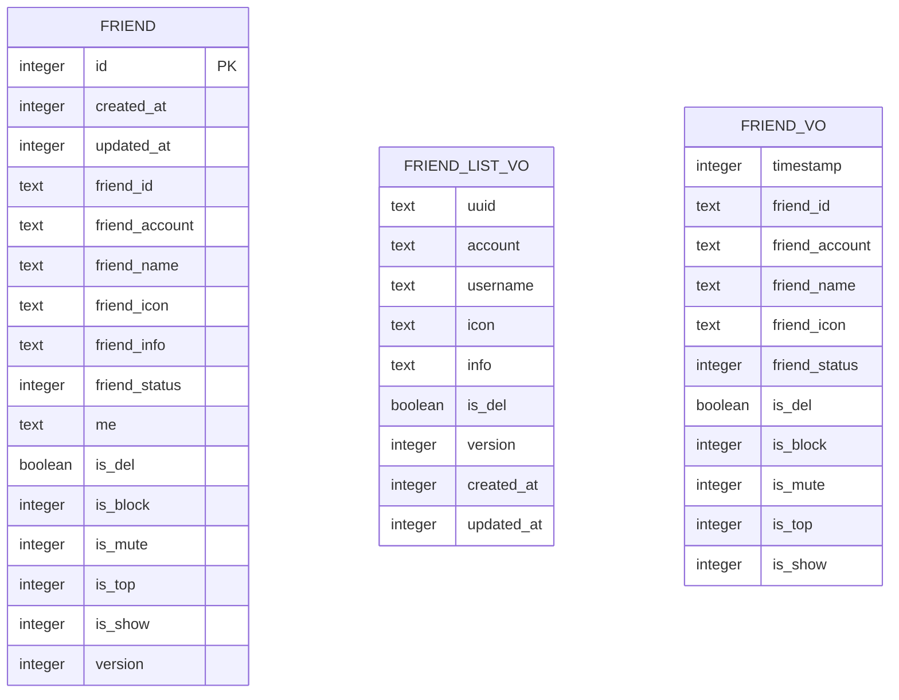
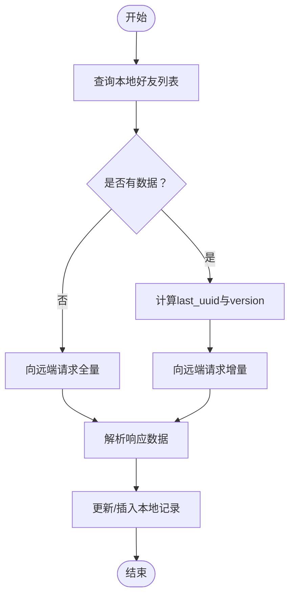
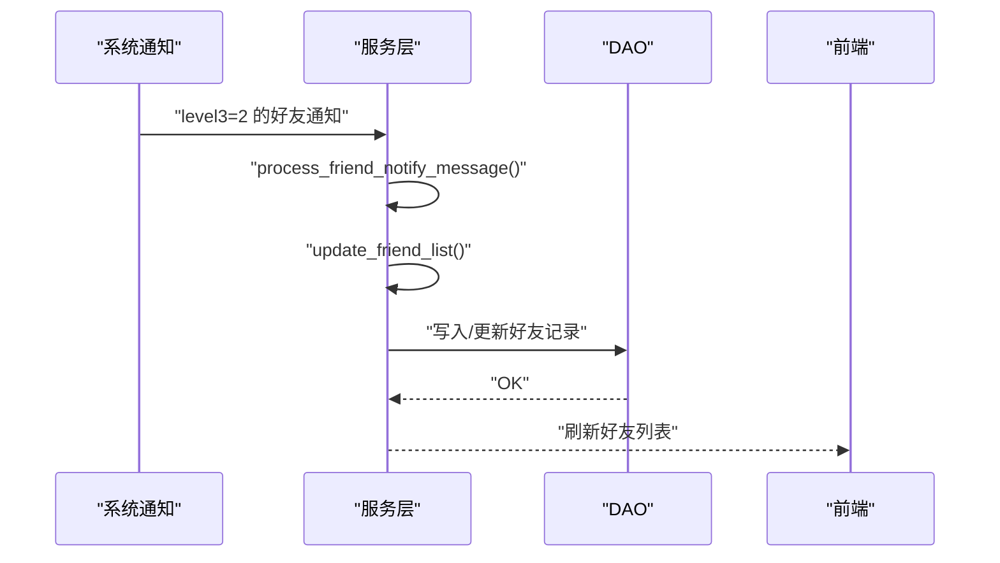
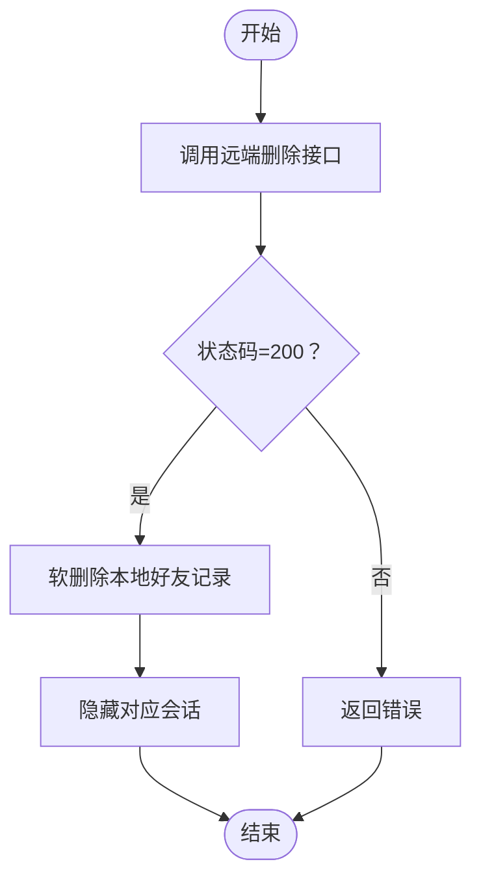
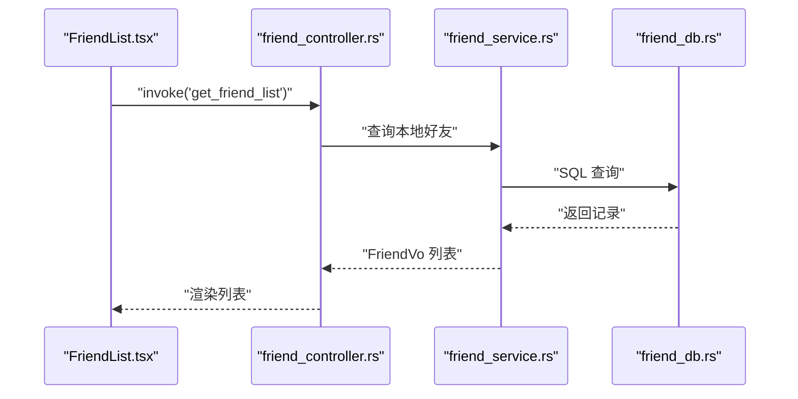
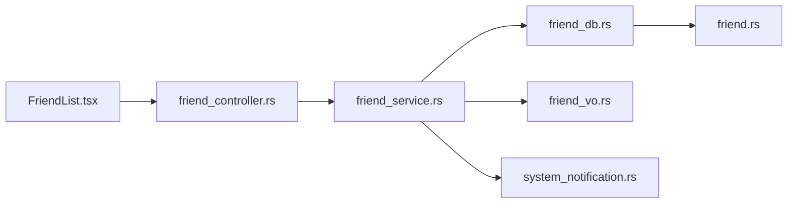

# 好友服务

<cite>
**本文引用的文件**
- [src-tauri/src/cmd/friend_controller.rs](file://src-tauri/src/cmd/friend_controller.rs)
- [src-tauri/src/service/friend_service.rs](file://src-tauri/src/service/friend_service.rs)
- [src-tauri/src/entity/friend.rs](file://src-tauri/src/entity/friend.rs)
- [src-tauri/src/dao/friend_db.rs](file://src-tauri/src/dao/friend_db.rs)
- [src-tauri/src/vo/friend_vo.rs](file://src-tauri/src/vo/friend_vo.rs)
- [src-tauri/src/entity/system_notification.rs](file://src-tauri/src/entity/system_notification.rs)
- [src-tauri/src/dto/http_result.rs](file://src-tauri/src/dto/http_result.rs)
- [src-tauri/src/lib.rs](file://src-tauri/src/lib.rs)
- [apps/pc/src/pages/Home/Contacts/components/FriendList.tsx](file://apps/pc/src/pages/Home/Contacts/components/FriendList.tsx)
- [apps/pc/src/pages/Home/Contacts/components/FriendBox.tsx](file://apps/pc/src/pages/Home/Contacts/components/FriendBox.tsx)
- [apps/pc/src/pages/Home/Contacts/components/Dashboard.tsx](file://apps/pc/src/pages/Home/Contacts/components/Dashboard.tsx)
</cite>

## 目录
1. [简介](#简介)
2. [项目结构](#项目结构)
3. [核心组件](#核心组件)
4. [架构总览](#架构总览)
5. [详细组件分析](#详细组件分析)
6. [依赖分析](#依赖分析)
7. [性能考虑](#性能考虑)
8. [故障排查指南](#故障排查指南)
9. [结论](#结论)
10. [附录：API 规范与使用示例](#附录api-规范与使用示例)

## 简介
本文件系统性阐述“好友服务”的实现方案，覆盖好友关系的建立、维护与删除全流程，包括好友请求处理、接受/拒绝机制、好友列表管理、数据模型设计、关系状态跟踪与权限控制策略。同时补充好友搜索能力、批量操作支持与关系状态同步机制的实现思路与接口规范，帮助开发者快速理解与扩展社交功能。

## 项目结构
好友服务位于后端 Rust 子项目中，采用分层架构：命令层（Tauri Command）负责暴露调用入口；服务层封装业务逻辑；DAO 层负责本地 SQLite 数据持久化；实体与 VO 定义数据模型；前端通过 Tauri invoke 调用后端命令，渲染好友列表与交互。

图表来源
- [src-tauri/src/cmd/friend_controller.rs:1-41](file://src-tauri/src/cmd/friend_controller.rs#L1-L41)
- [src-tauri/src/service/friend_service.rs:1-120](file://src-tauri/src/service/friend_service.rs#L1-L120)
- [src-tauri/src/dao/friend_db.rs:1-93](file://src-tauri/src/dao/friend_db.rs#L1-L93)
- [src-tauri/src/entity/friend.rs:1-63](file://src-tauri/src/entity/friend.rs#L1-L63)
- [src-tauri/src/vo/friend_vo.rs:1-50](file://src-tauri/src/vo/friend_vo.rs#L1-L50)
- [src-tauri/src/entity/system_notification.rs:1-162](file://src-tauri/src/entity/system_notification.rs#L1-L162)
- [apps/pc/src/pages/Home/Contacts/components/FriendList.tsx:1-46](file://apps/pc/src/pages/Home/Contacts/components/FriendList.tsx#L1-L46)
- [apps/pc/src/pages/Home/Contacts/components/FriendBox.tsx:1-46](file://apps/pc/src/pages/Home/Contacts/components/FriendBox.tsx#L1-L46)
- [apps/pc/src/pages/Home/Contacts/components/Dashboard.tsx:1-16](file://apps/pc/src/pages/Home/Contacts/components/Dashboard.tsx#L1-L16)

章节来源
- [src-tauri/src/lib.rs:117-163](file://src-tauri/src/lib.rs#L117-L163)

## 核心组件
- 命令层（friend_controller.rs）
  - 提供查询好友列表、查询指定好友信息、更新本地好友列表、删除好友等命令。
- 服务层（friend_service.rs）
  - 处理好友通知消息、删除好友（含远端请求与本地软删除）、拉取并合并远端好友列表。
- 数据访问层（friend_db.rs）
  - 提供查询、软删除、更新好友信息等数据库操作。
- 实体与 VO（entity/friend.rs, vo/friend_vo.rs）
  - 定义本地好友表结构与远端返回的列表项模型。
- 系统通知（entity/system_notification.rs）
  - 支持好友相关通知的接收与处理，触发本地好友列表同步。
- 前端集成（FriendList.tsx, FriendBox.tsx, Dashboard.tsx）
  - 通过 Tauri invoke 调用后端命令，渲染好友列表与详情入口。

章节来源
- [src-tauri/src/cmd/friend_controller.rs:1-41](file://src-tauri/src/cmd/friend_controller.rs#L1-L41)
- [src-tauri/src/service/friend_service.rs:16-119](file://src-tauri/src/service/friend_service.rs#L16-L119)
- [src-tauri/src/dao/friend_db.rs:1-93](file://src-tauri/src/dao/friend_db.rs#L1-L93)
- [src-tauri/src/entity/friend.rs:1-63](file://src-tauri/src/entity/friend.rs#L1-L63)
- [src-tauri/src/vo/friend_vo.rs:1-50](file://src-tauri/src/vo/friend_vo.rs#L1-L50)
- [src-tauri/src/entity/system_notification.rs:1-162](file://src-tauri/src/entity/system_notification.rs#L1-L162)
- [apps/pc/src/pages/Home/Contacts/components/FriendList.tsx:1-46](file://apps/pc/src/pages/Home/Contacts/components/FriendList.tsx#L1-L46)
- [apps/pc/src/pages/Home/Contacts/components/FriendBox.tsx:1-46](file://apps/pc/src/pages/Home/Contacts/components/FriendBox.tsx#L1-L46)
- [apps/pc/src/pages/Home/Contacts/components/Dashboard.tsx:1-16](file://apps/pc/src/pages/Home/Contacts/components/Dashboard.tsx#L1-L16)

## 架构总览
好友服务遵循“命令-服务-数据访问-实体/VO-前端调用”的分层设计。命令层通过 Tauri 暴露 invoke 接口；服务层负责与远端 API 交互、解析响应并更新本地数据库；DAO 层以 SQLX 访问 SQLite；前端通过 invoke 调用命令，渲染好友列表与卡片。

图表来源
- [src-tauri/src/cmd/friend_controller.rs:6-17](file://src-tauri/src/cmd/friend_controller.rs#L6-L17)
- [src-tauri/src/service/friend_service.rs:16-37](file://src-tauri/src/service/friend_service.rs#L16-L37)
- [src-tauri/src/dao/friend_db.rs:7-14](file://src-tauri/src/dao/friend_db.rs#L7-L14)
- [src-tauri/src/entity/system_notification.rs:42-64](file://src-tauri/src/entity/system_notification.rs#L42-L64)

## 详细组件分析

### 数据模型与关系状态
- 本地好友实体（Friend）
  - 字段覆盖基础信息、关系属性（屏蔽、免打扰、置顶、显示）、版本号与时间戳，以及唯一约束组合，确保同一用户与好友的唯一性。
- 远端好友列表项（FriendListVO）
  - 包含远端用户标识、账号、昵称、头像、备注、删除标记、版本号与时间戳，用于增量同步。
- 视图对象（FriendVo）
  - 用于前端展示的字段集，包含时间戳、好友标识、账号、昵称、头像、状态与显示/屏蔽标志等。

图表来源
- [src-tauri/src/entity/friend.rs:7-25](file://src-tauri/src/entity/friend.rs#L7-L25)
- [src-tauri/src/vo/friend_vo.rs:5-18](file://src-tauri/src/vo/friend_vo.rs#L5-L18)
- [src-tauri/src/vo/friend_vo.rs:38-49](file://src-tauri/src/vo/friend_vo.rs#L38-L49)

章节来源
- [src-tauri/src/entity/friend.rs:27-62](file://src-tauri/src/entity/friend.rs#L27-L62)
- [src-tauri/src/vo/friend_vo.rs:20-36](file://src-tauri/src/vo/friend_vo.rs#L20-L36)
- [src-tauri/src/vo/friend_vo.rs:38-49](file://src-tauri/src/vo/friend_vo.rs#L38-L49)

### 好友列表管理与同步
- 查询好友列表
  - 命令层根据当前用户上下文查询本地未删除的好友记录，转换为前端可用的视图对象。
- 增量同步
  - 服务层基于本地最后更新的记录（按 updated_at 与 version）向远端发起增量请求，解析响应并写入或更新本地记录。
- 关系状态跟踪
  - 本地字段（屏蔽、免打扰、置顶、显示）与远端字段（删除标记、版本号）共同构成关系状态，保证一致性。

图表来源
- [src-tauri/src/service/friend_service.rs:59-119](file://src-tauri/src/service/friend_service.rs#L59-L119)
- [src-tauri/src/dao/friend_db.rs:47-92](file://src-tauri/src/dao/friend_db.rs#L47-L92)

章节来源
- [src-tauri/src/cmd/friend_controller.rs:6-17](file://src-tauri/src/cmd/friend_controller.rs#L6-L17)
- [src-tauri/src/service/friend_service.rs:59-119](file://src-tauri/src/service/friend_service.rs#L59-L119)
- [src-tauri/src/dao/friend_db.rs:7-14](file://src-tauri/src/dao/friend_db.rs#L7-L14)

### 好友请求处理与接受/拒绝机制
- 请求到达
  - 通过系统通知（SystemNotification）承载好友请求事件，服务层根据通知层级进行分支处理。
- 接受/拒绝
  - 当收到“处理好友通知”事件时，触发本地好友列表同步，确保 UI 与数据一致。
- 权限控制
  - 本地字段（屏蔽、免打扰、置顶、显示）用于控制展示与交互行为；删除标记用于软删除。

图表来源
- [src-tauri/src/service/friend_service.rs:16-37](file://src-tauri/src/service/friend_service.rs#L16-L37)
- [src-tauri/src/entity/system_notification.rs:42-64](file://src-tauri/src/entity/system_notification.rs#L42-L64)

章节来源
- [src-tauri/src/service/friend_service.rs:16-37](file://src-tauri/src/service/friend_service.rs#L16-L37)
- [src-tauri/src/entity/system_notification.rs:10-40](file://src-tauri/src/entity/system_notification.rs#L10-L40)

### 删除好友（软删除）
- 远端删除
  - 服务层向远端 API 发起删除请求，成功后执行本地软删除与会话隐藏。
- 本地软删除
  - 设置删除标记与隐藏标志，保留记录以便审计与恢复。

图表来源
- [src-tauri/src/service/friend_service.rs:39-57](file://src-tauri/src/service/friend_service.rs#L39-L57)
- [src-tauri/src/dao/friend_db.rs:32-45](file://src-tauri/src/dao/friend_db.rs#L32-L45)

章节来源
- [src-tauri/src/service/friend_service.rs:39-57](file://src-tauri/src/service/friend_service.rs#L39-L57)
- [src-tauri/src/dao/friend_db.rs:32-45](file://src-tauri/src/dao/friend_db.rs#L32-L45)

### 前端集成与交互
- 好友列表渲染
  - 通过 invoke('get_friend_list') 获取好友列表，循环渲染为卡片组件。
- 单个好友卡片
  - 点击进入好友详情页，加载头像资源并展示基本信息。
- 空态占位
  - 当无好友时显示引导文案与图标。

图表来源
- [apps/pc/src/pages/Home/Contacts/components/FriendList.tsx:23-31](file://apps/pc/src/pages/Home/Contacts/components/FriendList.tsx#L23-L31)
- [src-tauri/src/cmd/friend_controller.rs:8-16](file://src-tauri/src/cmd/friend_controller.rs#L8-L16)
- [src-tauri/src/dao/friend_db.rs:7-14](file://src-tauri/src/dao/friend_db.rs#L7-L14)

章节来源
- [apps/pc/src/pages/Home/Contacts/components/FriendList.tsx:1-46](file://apps/pc/src/pages/Home/Contacts/components/FriendList.tsx#L1-L46)
- [apps/pc/src/pages/Home/Contacts/components/FriendBox.tsx:1-46](file://apps/pc/src/pages/Home/Contacts/components/FriendBox.tsx#L1-L46)
- [apps/pc/src/pages/Home/Contacts/components/Dashboard.tsx:1-16](file://apps/pc/src/pages/Home/Contacts/components/Dashboard.tsx#L1-L16)

## 依赖分析
- 命令层依赖服务层与 VO；服务层依赖 DAO、实体与系统通知；DAO 依赖实体与数据库连接；前端依赖命令层与类型定义。
- 耦合度低，职责清晰：命令仅做参数透传与结果包装；服务层集中处理业务；DAO 专注数据存取；实体/VO 明确数据边界。

图表来源
- [src-tauri/src/cmd/friend_controller.rs:1-5](file://src-tauri/src/cmd/friend_controller.rs#L1-L5)
- [src-tauri/src/service/friend_service.rs:1-14](file://src-tauri/src/service/friend_service.rs#L1-L14)
- [src-tauri/src/dao/friend_db.rs:1-4](file://src-tauri/src/dao/friend_db.rs#L1-L4)
- [src-tauri/src/entity/friend.rs:1-5](file://src-tauri/src/entity/friend.rs#L1-L5)
- [src-tauri/src/vo/friend_vo.rs:1-3](file://src-tauri/src/vo/friend_vo.rs#L1-L3)
- [apps/pc/src/pages/Home/Contacts/components/FriendList.tsx:1-6](file://apps/pc/src/pages/Home/Contacts/components/FriendList.tsx#L1-L6)

章节来源
- [src-tauri/src/lib.rs:117-163](file://src-tauri/src/lib.rs#L117-L163)

## 性能考虑
- 增量同步
  - 基于 updated_at 与 version 的增量请求减少网络与解析开销。
- 批量写入
  - 服务层逐条写入本地记录，可结合事务优化批量更新性能。
- 索引优化
  - 建议在本地好友表上增加常用查询索引（如 friend_id, me），提升查询效率。
- 前端渲染
  - 列表渲染采用虚拟滚动与懒加载头像资源，降低首屏与滚动卡顿。

## 故障排查指南
- 增量同步失败
  - 检查远端接口返回状态与 JSON 结构，确认 Response.data 类型匹配。
- 本地写入异常
  - DAO 层在更新失败时回退插入，若仍失败，检查唯一约束与字段绑定顺序。
- 删除失败
  - 确认远端删除接口返回 200，否则抛出错误并记录日志。
- 通知未触发同步
  - 检查系统通知的层级字段与处理分支，确保 level3=2 的通知被正确识别。

章节来源
- [src-tauri/src/service/friend_service.rs:74-116](file://src-tauri/src/service/friend_service.rs#L74-L116)
- [src-tauri/src/dao/friend_db.rs:67-90](file://src-tauri/src/dao/friend_db.rs#L67-L90)
- [src-tauri/src/service/friend_service.rs:48-54](file://src-tauri/src/service/friend_service.rs#L48-L54)
- [src-tauri/src/entity/system_notification.rs:42-64](file://src-tauri/src/entity/system_notification.rs#L42-L64)

## 结论
好友服务通过命令-服务-数据访问分层设计，实现了从远端拉取、本地增量同步、软删除与会话隐藏的完整闭环。配合系统通知驱动的自动同步机制，保障了好友关系状态的一致性与用户体验。建议后续增强好友搜索、批量操作与更细粒度的权限控制，以满足复杂社交场景需求。

## 附录：API 规范与使用示例

### API 接口规范
- 查询好友列表
  - 方法：invoke('get_friend_list')
  - 返回：FriendVo 数组
  - 用途：渲染好友列表
- 查询当前好友信息
  - 方法：invoke('get_friend_info', { friend_uuid })
  - 返回：FriendVo
  - 用途：跳转至好友详情页
- 更新本地好友列表
  - 方法：invoke('update_local_friend_list')
  - 返回：void
  - 用途：手动触发增量同步
- 删除好友（软删除）
  - 方法：invoke('delete_friend_command', { friend_uuid })
  - 返回：void
  - 用途：移除好友并隐藏会话

章节来源
- [src-tauri/src/cmd/friend_controller.rs:6-40](file://src-tauri/src/cmd/friend_controller.rs#L6-L40)
- [src-tauri/src/lib.rs:149-155](file://src-tauri/src/lib.rs#L149-L155)

### 数据验证规则
- 必填字段
  - 好友标识（friend_id）、用户标识（me）、版本号（version）等。
- 唯一性
  - (friend_id, me) 唯一，避免重复记录。
- 状态一致性
  - 删除标记与显示标志需保持一致，软删除后不应出现在列表中。

章节来源
- [src-tauri/src/entity/friend.rs:27-48](file://src-tauri/src/entity/friend.rs#L27-L48)
- [src-tauri/src/dao/friend_db.rs:47-92](file://src-tauri/src/dao/friend_db.rs#L47-L92)

### 典型使用示例
- 场景一：打开联系人页面，自动拉取好友列表
  - 前端在组件挂载与刷新标志变化时调用 get_friend_list，渲染 FriendList。
- 场景二：点击好友卡片，进入详情页
  - 前端调用 get_friend_info，携带 friend_uuid，渲染用户信息与头像。
- 场景三：删除好友
  - 前端调用 delete_friend_command，成功后隐藏对应会话并刷新列表。
- 场景四：收到好友通知，自动同步
  - 服务层处理通知后触发 update_friend_list，写入本地并刷新 UI。

章节来源
- [apps/pc/src/pages/Home/Contacts/components/FriendList.tsx:12-31](file://apps/pc/src/pages/Home/Contacts/components/FriendList.tsx#L12-L31)
- [apps/pc/src/pages/Home/Contacts/components/FriendBox.tsx:12-25](file://apps/pc/src/pages/Home/Contacts/components/FriendBox.tsx#L12-L25)
- [src-tauri/src/cmd/friend_controller.rs:35-40](file://src-tauri/src/cmd/friend_controller.rs#L35-L40)
- [src-tauri/src/service/friend_service.rs:16-37](file://src-tauri/src/service/friend_service.rs#L16-L37)