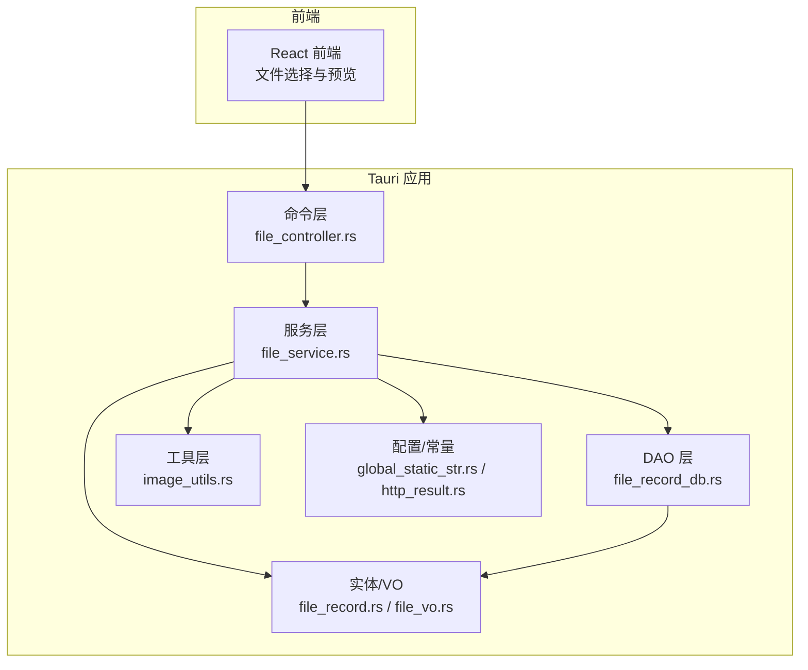
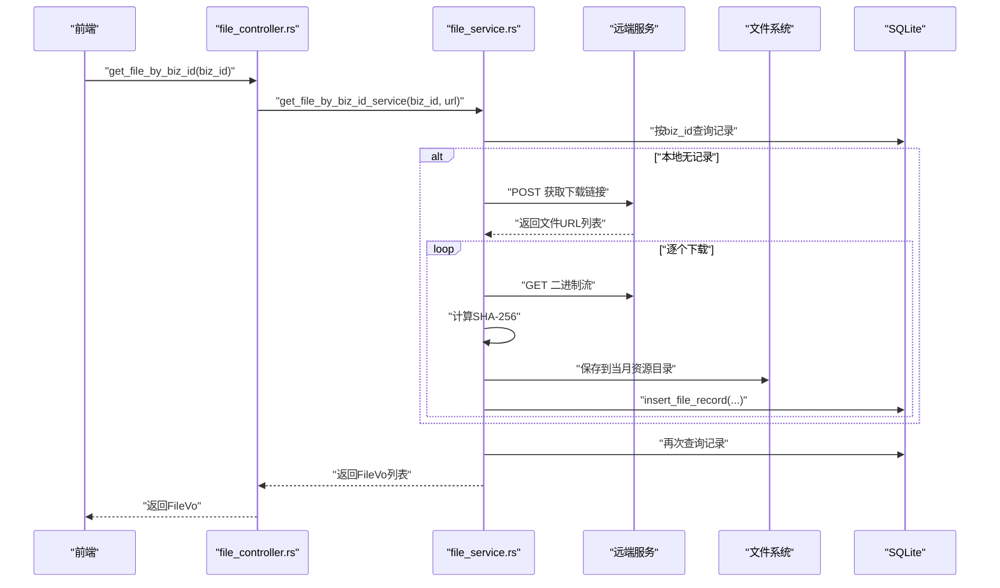
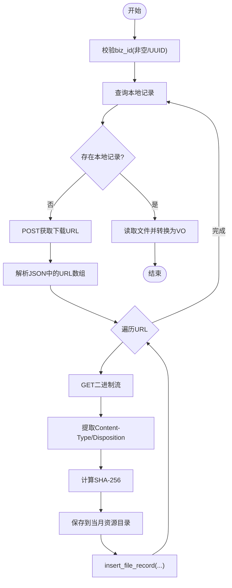
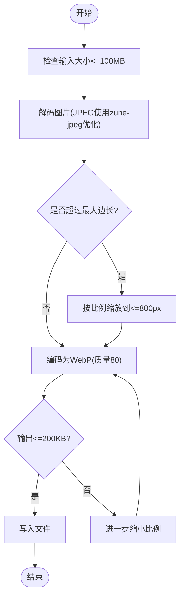
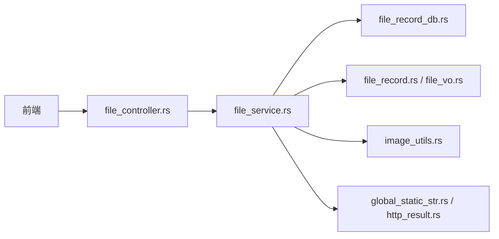

# 文件服务

<cite>
**本文引用的文件**
- [src-tauri/src/cmd/file_controller.rs](file://src-tauri/src/cmd/file_controller.rs)
- [src-tauri/src/service/file_service.rs](file://src-tauri/src/service/file_service.rs)
- [src-tauri/src/entity/file_record.rs](file://src-tauri/src/entity/file_record.rs)
- [src-tauri/src/dao/file_record_db.rs](file://src-tauri/src/dao/file_record_db.rs)
- [src-tauri/src/vo/file_vo.rs](file://src-tauri/src/vo/file_vo.rs)
- [src-tauri/src/utils/image_utils.rs](file://src-tauri/src/utils/image_utils.rs)
- [src-tauri/src/utils/global_static_str.rs](file://src-tauri/src/utils/global_static_str.rs)
- [src-tauri/src/dto/http_result.rs](file://src-tauri/src/dto/http_result.rs)
- [src-tauri/src/lib.rs](file://src-tauri/src/lib.rs)
- [src-tauri/tests/image_utils_tests.rs](file://src-tauri/tests/image_utils_tests.rs)
- [apps/pc/src/pages/TestComponent/components/FileSelectorTest.tsx](file://apps/pc/src/pages/TestComponent/components/FileSelectorTest.tsx)
</cite>

## 目录
1. [简介](#简介)
2. [项目结构](#项目结构)
3. [核心组件](#核心组件)
4. [架构总览](#架构总览)
5. [详细组件分析](#详细组件分析)
6. [依赖关系分析](#依赖关系分析)
7. [性能考量](#性能考量)
8. [故障排查指南](#故障排查指南)
9. [结论](#结论)
10. [附录](#附录)

## 简介
本文件服务提供完整的文件上传、下载、本地存储与文件预览能力。系统支持通过业务 ID 获取公开或聊天场景下的文件，自动从远端拉取并落盘，同时提供图片压缩转 WebP 的能力，并以统一的 VO 结构对外暴露文件数据。前端通过 Tauri 命令调用 Rust 后端接口，实现文件选择、上传与预览。

## 项目结构
文件服务主要由以下层次构成：
- 控制层：对外暴露 Tauri 命令，封装业务入口与错误处理
- 服务层：封装下载、校验、落盘与记录写入逻辑
- 数据访问层：SQLite 表结构与 CRUD
- 实体与值对象：文件记录实体与对外 VO
- 工具层：图片压缩、EXIF 方向修正等
- 配置与常量：全局静态字符串与配置读取
- 测试：图片压缩单元测试

图表来源
- [src-tauri/src/cmd/file_controller.rs:1-258](file://src-tauri/src/cmd/file_controller.rs#L1-L258)
- [src-tauri/src/service/file_service.rs:1-210](file://src-tauri/src/service/file_service.rs#L1-L210)
- [src-tauri/src/dao/file_record_db.rs:1-49](file://src-tauri/src/dao/file_record_db.rs#L1-L49)
- [src-tauri/src/entity/file_record.rs:1-83](file://src-tauri/src/entity/file_record.rs#L1-L83)
- [src-tauri/src/vo/file_vo.rs:1-22](file://src-tauri/src/vo/file_vo.rs#L1-L22)
- [src-tauri/src/utils/image_utils.rs:1-212](file://src-tauri/src/utils/image_utils.rs#L1-L212)
- [src-tauri/src/utils/global_static_str.rs:1-59](file://src-tauri/src/utils/global_static_str.rs#L1-L59)
- [src-tauri/src/dto/http_result.rs:1-10](file://src-tauri/src/dto/http_result.rs#L1-L10)

章节来源
- [src-tauri/src/lib.rs:117-163](file://src-tauri/src/lib.rs#L117-L163)
- [src-tauri/src/cmd/file_controller.rs:1-258](file://src-tauri/src/cmd/file_controller.rs#L1-L258)

## 核心组件
- 命令入口
  - 获取本地默认图片：优先从应用资源目录读取，否则回退到打包资源；若仍失败则生成占位图
  - 通过业务 ID 获取公开文件/聊天文件：构造远端下载链接，调用服务层下载并落盘，随后查询本地记录并返回 VO 列表
  - 调试资源路径：输出配置路径、打包资源路径及默认图片信息，便于定位问题
- 服务层
  - 校验业务 ID 格式（UUID），查询本地记录；若无则远程拉取并写入数据库，再读取返回
  - 下载流程：POST 获取文件下载链接 -> GET 二进制流 -> 计算 SHA-256 -> 保存至当月资源目录 -> 写入文件记录
- 数据层
  - SQLite 表 file_record：按业务 ID 分组，记录文件名、路径、大小、MIME、哈希、状态与时间戳
  - DAO：插入记录、按业务 ID 查询、按业务 ID+UUID 删除
- 实体与 VO
  - FileRecord：数据库映射实体
  - FileVo：对外传输结构，包含文件元信息与原始字节
- 工具层
  - 图片压缩：限制输入最大 100MB，目标输出 ≤200KB，最大边长 800px，质量 80，输出 WebP；自动处理 EXIF 方向
- 配置与常量
  - 全局常量：API 域名、资源目录、默认图片名、数据库文件名等
  - HTTP 返回包装：统一 code/data/message 结构

章节来源
- [src-tauri/src/cmd/file_controller.rs:13-172](file://src-tauri/src/cmd/file_controller.rs#L13-L172)
- [src-tauri/src/service/file_service.rs:20-189](file://src-tauri/src/service/file_service.rs#L20-L189)
- [src-tauri/src/entity/file_record.rs:9-82](file://src-tauri/src/entity/file_record.rs#L9-L82)
- [src-tauri/src/dao/file_record_db.rs:8-48](file://src-tauri/src/dao/file_record_db.rs#L8-L48)
- [src-tauri/src/vo/file_vo.rs:3-21](file://src-tauri/src/vo/file_vo.rs#L3-L21)
- [src-tauri/src/utils/image_utils.rs:15-93](file://src-tauri/src/utils/image_utils.rs#L15-L93)
- [src-tauri/src/utils/global_static_str.rs:10-59](file://src-tauri/src/utils/global_static_str.rs#L10-L59)
- [src-tauri/src/dto/http_result.rs:4-9](file://src-tauri/src/dto/http_result.rs#L4-L9)

## 架构总览
文件服务采用“命令-服务-数据访问-实体”的分层架构，结合本地 SQLite 存储与当月资源目录，实现文件的缓存与复用。图片压缩在工具层独立实现，既可被命令直接调用，也可在需要时对已有文件进行二次处理。

图表来源
- [src-tauri/src/cmd/file_controller.rs:155-172](file://src-tauri/src/cmd/file_controller.rs#L155-L172)
- [src-tauri/src/service/file_service.rs:20-84](file://src-tauri/src/service/file_service.rs#L20-L84)

## 详细组件分析

### 命令层：文件控制器
- 功能
  - 本地默认图片读取：优先应用资源目录，其次打包资源，最后占位图
  - 业务 ID 文件获取：公开/聊天两类，统一走服务层
  - 资源路径调试：输出配置路径、打包资源路径与默认图片状态
- 错误处理
  - 参数校验（空、UUID 格式）
  - 路径解析失败、文件不存在、远端请求失败均记录日志并返回错误
- 性能注意
  - 本地存在即直接读取，避免重复下载
  - 占位图体积极小，作为兜底保障

章节来源
- [src-tauri/src/cmd/file_controller.rs:13-172](file://src-tauri/src/cmd/file_controller.rs#L13-L172)
- [src-tauri/src/cmd/file_controller.rs:193-257](file://src-tauri/src/cmd/file_controller.rs#L193-L257)

### 服务层：文件服务
- 功能
  - 业务 ID 校验与本地记录查询
  - 远程下载与落盘：POST 获取 URL -> GET 二进制 -> 保存文件 -> 写入记录
  - 读取本地文件并转换为 VO
- 关键流程
  - 下载链接获取：POST 请求，解析 JSON 包含的 URL 数组
  - 二进制处理：提取 Content-Type、Content-Disposition，计算哈希，生成 UUID 文件名并保留原扩展名
  - 路径管理：从配置读取当月资源目录，确保目录存在
- 错误处理
  - 请求失败、无扩展名、无法创建文件、读取文件失败时删除记录并报错

图表来源
- [src-tauri/src/service/file_service.rs:20-189](file://src-tauri/src/service/file_service.rs#L20-L189)

章节来源
- [src-tauri/src/service/file_service.rs:20-189](file://src-tauri/src/service/file_service.rs#L20-L189)

### 数据层：文件记录与 DAO
- 表结构
  - 字段：主键、业务 ID、文件 UUID、文件名、绝对路径、大小、MIME、哈希、状态、创建/更新时间
  - 索引建议：biz_id + status 组合索引可提升查询效率
- DAO 方法
  - 插入记录：包含 biz_id、uuid、file_name、file_path、file_size、mime_type、file_hash、status、created_at、updated_at
  - 按业务 ID 查询：筛选 status=0
  - 按业务 ID+UUID 删除：清理失效记录

章节来源
- [src-tauri/src/entity/file_record.rs:9-82](file://src-tauri/src/entity/file_record.rs#L9-L82)
- [src-tauri/src/dao/file_record_db.rs:8-48](file://src-tauri/src/dao/file_record_db.rs#L8-L48)

### 实体与 VO：数据模型
- FileRecord
  - 用于 SQLite 映射，字段覆盖表结构
- FileVo
  - 对外传输结构，包含 size、mime_type、original_file_name、absolute_file_path、raw 等
  - 支持可选字段，便于灵活扩展

章节来源
- [src-tauri/src/entity/file_record.rs:10-34](file://src-tauri/src/entity/file_record.rs#L10-L34)
- [src-tauri/src/vo/file_vo.rs:3-21](file://src-tauri/src/vo/file_vo.rs#L3-L21)

### 工具层：图片压缩与格式处理
- 压缩策略
  - 输入限制：最大 100MB
  - 输出限制：目标 ≤200KB
  - 尺寸限制：最大边长 800px，按比例缩放
  - 质量：80
  - 编码：WebP
- EXIF 方向修正
  - 读取 EXIF Orientation，按需旋转/翻转
- 输出命名
  - 以输入文件名 + 时间戳 + .webp 命名，保存至当月资源目录

图表来源
- [src-tauri/src/utils/image_utils.rs:20-93](file://src-tauri/src/utils/image_utils.rs#L20-L93)
- [src-tauri/src/utils/image_utils.rs:141-182](file://src-tauri/src/utils/image_utils.rs#L141-L182)
- [src-tauri/src/utils/image_utils.rs:184-211](file://src-tauri/src/utils/image_utils.rs#L184-L211)

章节来源
- [src-tauri/src/utils/image_utils.rs:15-93](file://src-tauri/src/utils/image_utils.rs#L15-L93)
- [src-tauri/src/utils/image_utils.rs:141-211](file://src-tauri/src/utils/image_utils.rs#L141-L211)
- [src-tauri/tests/image_utils_tests.rs:20-104](file://src-tauri/tests/image_utils_tests.rs#L20-L104)

### 配置与常量
- 全局常量
  - API 域名、资源目录、默认图片名、数据库文件名、日志路径等
- HTTP 返回包装
  - 统一 code/data/message 结构，便于前后端约定

章节来源
- [src-tauri/src/utils/global_static_str.rs:10-59](file://src-tauri/src/utils/global_static_str.rs#L10-L59)
- [src-tauri/src/dto/http_result.rs:4-9](file://src-tauri/src/dto/http_result.rs#L4-L9)

## 依赖关系分析
- 命令层依赖服务层与工具层，负责参数校验与错误包装
- 服务层依赖 DAO、实体、配置与 HTTP 工具，负责业务编排
- DAO 依赖 SQLite 连接池与实体映射
- 工具层依赖图像处理库与 EXIF 库
- 前端通过 Tauri 命令调用后端，实现文件选择与预览

图表来源
- [src-tauri/src/lib.rs:117-163](file://src-tauri/src/lib.rs#L117-L163)
- [src-tauri/src/cmd/file_controller.rs:1-258](file://src-tauri/src/cmd/file_controller.rs#L1-L258)
- [src-tauri/src/service/file_service.rs:1-210](file://src-tauri/src/service/file_service.rs#L1-L210)

章节来源
- [src-tauri/src/lib.rs:117-163](file://src-tauri/src/lib.rs#L117-L163)

## 性能考量
- 缓存策略
  - 本地 SQLite 记录文件元信息，避免重复下载
  - 当月资源目录集中存放，便于清理与管理
- IO 优化
  - 读取本地文件时直接读取二进制，减少中间转换
  - 图片压缩采用分阶段输出控制，避免大文件反复编码
- 网络优化
  - 一次请求获取多个下载 URL，批量处理
  - 仅在必要时触发下载，降低网络开销
- 存储优化
  - WebP 输出体积更小，适合传输与预览
  - 保留原扩展名，便于后续处理

## 故障排查指南
- 本地资源路径问题
  - 使用调试命令输出配置路径、打包资源路径与默认图片状态，确认路径是否存在
- 文件不存在
  - 若本地记录存在但文件缺失，服务层会删除记录并报错；检查磁盘空间与权限
- 下载失败
  - 检查网络连通性与远端服务状态；确认返回 JSON 中的 URL 数组有效
- 图片压缩失败
  - 输入超过 100MB 或输出仍大于 200KB 时会触发错误；调整输入或放宽阈值
- EXIF 方向异常
  - 工具层会自动修正方向；如仍异常，检查 EXIF 数据完整性

章节来源
- [src-tauri/src/cmd/file_controller.rs:193-257](file://src-tauri/src/cmd/file_controller.rs#L193-L257)
- [src-tauri/src/service/file_service.rs:52-60](file://src-tauri/src/service/file_service.rs#L52-L60)
- [src-tauri/src/utils/image_utils.rs:26-28](file://src-tauri/src/utils/image_utils.rs#L26-L28)
- [src-tauri/tests/image_utils_tests.rs:38-55](file://src-tauri/tests/image_utils_tests.rs#L38-L55)

## 结论
该文件服务以清晰的分层架构实现了文件的下载、缓存与预览能力，并通过 SQLite 与当月资源目录形成稳定的本地存储体系。图片压缩工具提供了高效的 WebP 转换能力，满足传输与展示需求。整体设计兼顾了易用性与可维护性，便于后续扩展与优化。

## 附录

### API 接口定义
- 获取本地默认图片
  - 方法：get_local_file
  - 返回：FileVo（包含原始字节与元信息）
  - 失败：返回错误字符串
- 通过业务 ID 获取公开文件
  - 方法：get_file_by_biz_id
  - 参数：biz_id(String)
  - 返回：Vec<FileVo>
  - 失败：返回错误字符串
- 通过业务 ID 获取聊天文件
  - 方法：get_chat_file_by_biz_id
  - 参数：biz_id(String)
  - 返回：Vec<FileVo>
  - 失败：返回错误字符串
- 调试资源路径
  - 方法：debug_resource_paths
  - 返回：String（包含路径与文件信息）

章节来源
- [src-tauri/src/cmd/file_controller.rs:13-172](file://src-tauri/src/cmd/file_controller.rs#L13-L172)
- [src-tauri/src/cmd/file_controller.rs:193-257](file://src-tauri/src/cmd/file_controller.rs#L193-L257)

### 前端集成示例
- 文件选择测试组件展示了如何调用前端服务选择文件并展示结果
- 可参考该组件在实际页面中集成文件上传与预览逻辑

章节来源
- [apps/pc/src/pages/TestComponent/components/FileSelectorTest.tsx:11-37](file://apps/pc/src/pages/TestComponent/components/FileSelectorTest.tsx#L11-L37)