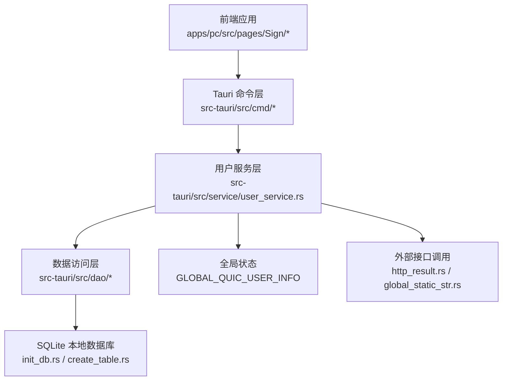
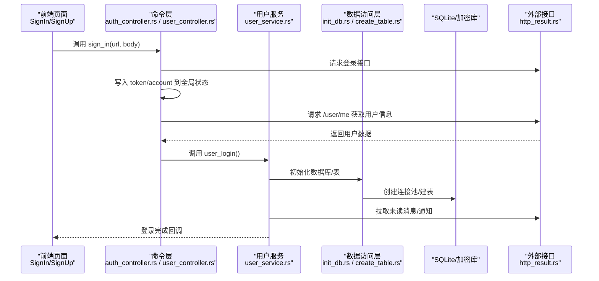
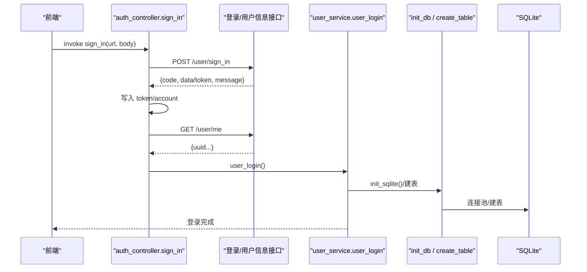
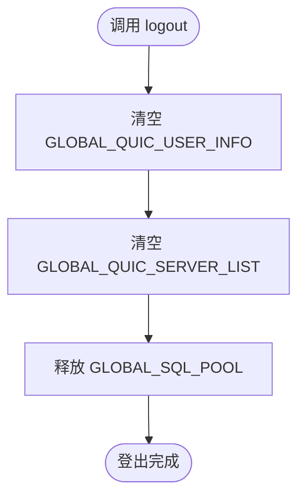
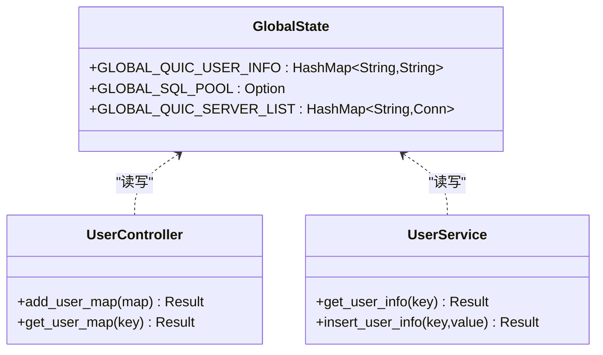
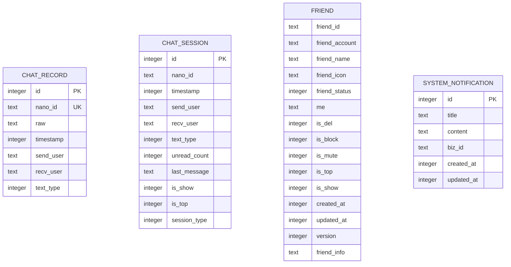
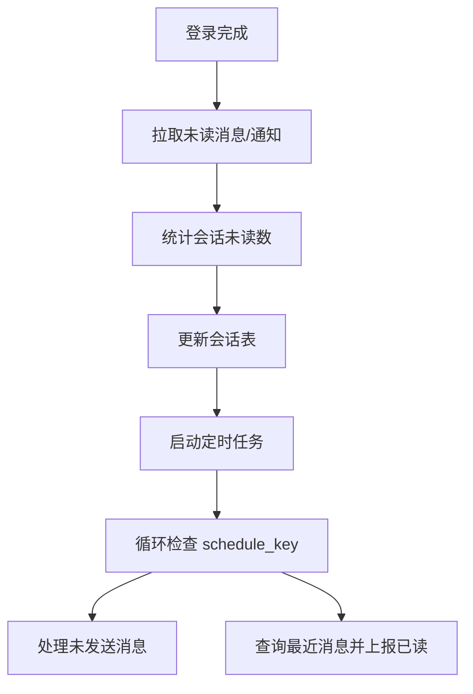
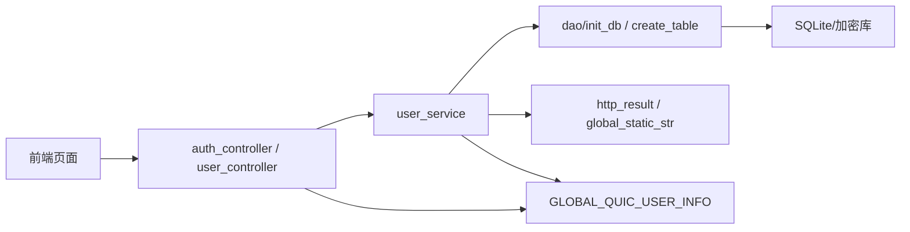

# 用户服务

<cite>
**本文引用的文件**   
- [src-tauri/src/lib.rs](file://src-tauri/src/lib.rs)
- [src-tauri/src/main.rs](file://src-tauri/src/main.rs)
- [src-tauri/src/cmd/auth_controller.rs](file://src-tauri/src/cmd/auth_controller.rs)
- [src-tauri/src/cmd/user_controller.rs](file://src-tauri/src/cmd/user_controller.rs)
- [src-tauri/src/service/user_service.rs](file://src-tauri/src/service/user_service.rs)
- [src-tauri/src/entity/user.rs](file://src-tauri/src/entity/user.rs)
- [src-tauri/src/utils/global_static_str.rs](file://src-tauri/src/utils/global_static_str.rs)
- [src-tauri/src/dao/init_db.rs](file://src-tauri/src/dao/init_db.rs)
- [src-tauri/src/dao/store.rs](file://src-tauri/src/dao/store.rs)
- [src-tauri/src/dto/http_result.rs](file://src-tauri/src/dto/http_result.rs)
- [src-tauri/src/dao/create_table.rs](file://src-tauri/src/dao/create_table.rs)
- [src-tauri/src/dao/friend_db.rs](file://src-tauri/src/dao/friend_db.rs)
- [src-tauri/src/entity/chat_record.rs](file://src-tauri/src/entity/chat_record.rs)
- [src-tauri/src/entity/chat_session.rs](file://src-tauri/src/entity/chat_session.rs)
- [apps/pc/src/pages/Sign/SignIn/index.tsx](file://apps/pc/src/pages/Sign/SignIn/index.tsx)
- [apps/pc/src/pages/Sign/SignUp/components/FastSignUp.tsx](file://apps/pc/src/pages/Sign/SignUp/components/FastSignUp.tsx)
</cite>

## 目录
1. [简介](#简介)
2. [项目结构](#项目结构)
3. [核心组件](#核心组件)
4. [架构总览](#架构总览)
5. [详细组件分析](#详细组件分析)
6. [依赖关系分析](#依赖关系分析)
7. [性能考量](#性能考量)
8. [故障排查指南](#故障排查指南)
9. [结论](#结论)
10. [附录：API 接口规范与参数校验](#附录api-接口规范与参数校验)

## 简介
本文件面向开发者，系统性阐述用户服务在 Rust + Tauri 架构中的实现方式与使用方法。内容覆盖用户注册登录流程、认证授权机制、用户信息管理、数据模型设计、密码安全处理、会话与定时任务管理、在线状态与权限控制等主题，并提供完整的 API 规范、参数校验规则与安全注意事项，帮助快速扩展与集成。

## 项目结构
用户服务位于 Rust 后端模块 src-tauri 中，通过 Tauri 的命令系统暴露到前端；同时配合 SQLite 本地存储与可选的 SQLCipher 加密存储，完成用户数据的持久化与安全保护。前端通过 Tauri invoke 调用后端命令，实现登录、登出、用户信息读写等功能。

图表来源
- [src-tauri/src/lib.rs:117-163](file://src-tauri/src/lib.rs#L117-L163)
- [src-tauri/src/cmd/auth_controller.rs:16-64](file://src-tauri/src/cmd/auth_controller.rs#L16-L64)
- [src-tauri/src/service/user_service.rs:27-53](file://src-tauri/src/service/user_service.rs#L27-L53)
- [src-tauri/src/dao/init_db.rs:17-41](file://src-tauri/src/dao/init_db.rs#L17-L41)

章节来源
- [src-tauri/src/lib.rs:117-163](file://src-tauri/src/lib.rs#L117-L163)
- [src-tauri/src/main.rs:4-7](file://src-tauri/src/main.rs#L4-L7)

## 核心组件
- 命令层（auth_controller、user_controller）：封装前端调用的登录、登出、用户信息读写等命令，负责参数校验与错误处理。
- 服务层（user_service）：实现登录流程、未读消息与通知拉取、定时已读上报、数据库初始化与表结构管理。
- 数据访问层（dao）：封装 SQLite 连接、建表、查询与更新逻辑，支持普通数据库与加密数据库。
- 实体与 DTO：定义用户登录响应结构、HTTP 统一返回结构等。
- 全局状态：使用 DashMap/RwLock 维护用户令牌、账号、UUID、服务器列表、SQL 连接池等全局信息。
- 前端集成：通过 Tauri invoke 调用后端命令，完成登录、注册、登出等交互。

章节来源
- [src-tauri/src/cmd/auth_controller.rs:16-112](file://src-tauri/src/cmd/auth_controller.rs#L16-L112)
- [src-tauri/src/cmd/user_controller.rs:6-16](file://src-tauri/src/cmd/user_controller.rs#L6-L16)
- [src-tauri/src/service/user_service.rs:27-284](file://src-tauri/src/service/user_service.rs#L27-L284)
- [src-tauri/src/dao/init_db.rs:17-74](file://src-tauri/src/dao/init_db.rs#L17-L74)
- [src-tauri/src/entity/user.rs:3-8](file://src-tauri/src/entity/user.rs#L3-L8)
- [src-tauri/src/dto/http_result.rs:4-9](file://src-tauri/src/dto/http_result.rs#L4-L9)
- [src-tauri/src/utils/global_static_str.rs:1-59](file://src-tauri/src/utils/global_static_str.rs#L1-L59)

## 架构总览
下图展示了从前端到后端命令、服务、DAO 与数据库的整体调用链路，以及全局状态与外部 API 的交互。

图表来源
- [apps/pc/src/pages/Sign/SignIn/index.tsx:100-159](file://apps/pc/src/pages/Sign/SignIn/index.tsx#L100-L159)
- [src-tauri/src/cmd/auth_controller.rs:16-64](file://src-tauri/src/cmd/auth_controller.rs#L16-L64)
- [src-tauri/src/service/user_service.rs:27-53](file://src-tauri/src/service/user_service.rs#L27-L53)
- [src-tauri/src/dao/init_db.rs:17-41](file://src-tauri/src/dao/init_db.rs#L17-L41)
- [src-tauri/src/dto/http_result.rs:4-9](file://src-tauri/src/dto/http_result.rs#L4-L9)

## 详细组件分析

### 认证与登录流程
- 前端通过 invoke 调用 sign_in 命令，传入登录 URL 与请求体（含账号、密码、平台等）。
- 命令层使用 HTTP 客户端发起登录请求，解析统一返回结构，若 code=200 则继续。
- 将 token 与 account 写入全局状态，随后请求 /user/me 获取用户 UUID，并写入全局状态。
- 调用 user_login 完成数据库初始化、拉取好友列表、未读消息与通知，并启动 QUIC 客户端与定时任务。

图表来源
- [apps/pc/src/pages/Sign/SignIn/index.tsx:100-159](file://apps/pc/src/pages/Sign/SignIn/index.tsx#L100-L159)
- [src-tauri/src/cmd/auth_controller.rs:16-64](file://src-tauri/src/cmd/auth_controller.rs#L16-L64)
- [src-tauri/src/service/user_service.rs:27-53](file://src-tauri/src/service/user_service.rs#L27-L53)
- [src-tauri/src/dao/init_db.rs:17-41](file://src-tauri/src/dao/init_db.rs#L17-L41)

章节来源
- [src-tauri/src/cmd/auth_controller.rs:16-64](file://src-tauri/src/cmd/auth_controller.rs#L16-L64)
- [src-tauri/src/service/user_service.rs:27-53](file://src-tauri/src/service/user_service.rs#L27-L53)
- [apps/pc/src/pages/Sign/SignIn/index.tsx:100-159](file://apps/pc/src/pages/Sign/SignIn/index.tsx#L100-L159)

### 登出与清理
- logout 命令清空全局用户信息、服务器列表与数据库连接池，确保会话与资源释放。
- clear_user_info 仅清理用户信息与服务器列表，保留数据库连接池。

图表来源
- [src-tauri/src/cmd/auth_controller.rs:66-112](file://src-tauri/src/cmd/auth_controller.rs#L66-L112)

章节来源
- [src-tauri/src/cmd/auth_controller.rs:66-112](file://src-tauri/src/cmd/auth_controller.rs#L66-L112)

### 用户信息管理与全局状态
- 全局状态使用 Arc<RwLock<HashMap<...>>> 维护用户信息（token、account、uuid 等），支持并发读写。
- 提供 add_user_map 与 get_user_map 命令，便于在运行时写入与读取用户键值对。
- user_service 提供 get_user_info/insert_user_info 等方法，封装对全局状态的访问。

图表来源
- [src-tauri/src/lib.rs:61-75](file://src-tauri/src/lib.rs#L61-L75)
- [src-tauri/src/cmd/user_controller.rs:6-16](file://src-tauri/src/cmd/user_controller.rs#L6-L16)
- [src-tauri/src/service/user_service.rs:55-68](file://src-tauri/src/service/user_service.rs#L55-L68)

章节来源
- [src-tauri/src/lib.rs:61-75](file://src-tauri/src/lib.rs#L61-L75)
- [src-tauri/src/cmd/user_controller.rs:6-16](file://src-tauri/src/cmd/user_controller.rs#L6-L16)
- [src-tauri/src/service/user_service.rs:55-68](file://src-tauri/src/service/user_service.rs#L55-L68)

### 数据模型与持久化
- 用户登录响应结构 SignInResult 与 HTTP 统一返回结构 HttpResult，用于前后端交互。
- SQLite 表结构由 create_table 初始化，包括聊天记录、会话、好友、系统通知等。
- init_db 负责根据应用路径与当前账号动态创建数据库文件与目录；init_private_db 支持 SQLCipher 加密数据库。

图表来源
- [src-tauri/src/dao/create_table.rs:14-30](file://src-tauri/src/dao/create_table.rs#L14-L30)
- [src-tauri/src/entity/chat_record.rs:8-47](file://src-tauri/src/entity/chat_record.rs#L8-L47)
- [src-tauri/src/entity/chat_session.rs:41-71](file://src-tauri/src/entity/chat_session.rs#L41-L71)
- [src-tauri/src/dao/friend_db.rs:6-92](file://src-tauri/src/dao/friend_db.rs#L6-L92)

章节来源
- [src-tauri/src/dto/http_result.rs:4-9](file://src-tauri/src/dto/http_result.rs#L4-L9)
- [src-tauri/src/entity/user.rs:3-8](file://src-tauri/src/entity/user.rs#L3-L8)
- [src-tauri/src/dao/create_table.rs:14-30](file://src-tauri/src/dao/create_table.rs#L14-L30)
- [src-tauri/src/dao/init_db.rs:17-74](file://src-tauri/src/dao/init_db.rs#L17-L74)

### 未读消息与定时已读任务
- user_service 在登录后拉取未读消息与通知，并统计会话未读数、更新会话表。
- 启动定时任务，周期性处理未发送消息与已读上报，通过 schedule_key 校验任务有效性。

图表来源
- [src-tauri/src/service/user_service.rs:70-139](file://src-tauri/src/service/user_service.rs#L70-L139)
- [src-tauri/src/service/user_service.rs:141-198](file://src-tauri/src/service/user_service.rs#L141-L198)
- [src-tauri/src/service/user_service.rs:200-245](file://src-tauri/src/service/user_service.rs#L200-L245)

章节来源
- [src-tauri/src/service/user_service.rs:70-139](file://src-tauri/src/service/user_service.rs#L70-L139)
- [src-tauri/src/service/user_service.rs:141-198](file://src-tauri/src/service/user_service.rs#L141-L198)
- [src-tauri/src/service/user_service.rs:200-245](file://src-tauri/src/service/user_service.rs#L200-L245)

### 权限控制与状态管理
- 前端页面对输入进行基础校验（账号、昵称、密码长度与格式），并在登录/注册时通过 invoke 调用后端命令。
- 后端通过全局状态维护 token 与用户标识，作为后续接口调用的上下文依据。
- 好友相关操作通过 DAO 层实现软删除、更新与查询，配合版本号与状态字段实现权限与状态控制。

章节来源
- [apps/pc/src/pages/Sign/SignIn/index.tsx:38-82](file://apps/pc/src/pages/Sign/SignIn/index.tsx#L38-L82)
- [apps/pc/src/pages/Sign/SignUp/components/FastSignUp.tsx:26-56](file://apps/pc/src/pages/Sign/SignUp/components/FastSignUp.tsx#L26-L56)
- [src-tauri/src/cmd/auth_controller.rs:16-64](file://src-tauri/src/cmd/auth_controller.rs#L16-L64)
- [src-tauri/src/dao/friend_db.rs:32-92](file://src-tauri/src/dao/friend_db.rs#L32-L92)

## 依赖关系分析
- 命令层依赖服务层与工具常量；服务层依赖 DAO 与外部 API；DAO 依赖 SQLite 连接池与建表脚本。
- 全局状态贯穿命令与服务层，承担跨模块共享数据的角色。
- 前端通过 Tauri invoke 与命令层交互，命令层再驱动服务层与 DAO。

图表来源
- [src-tauri/src/lib.rs:117-163](file://src-tauri/src/lib.rs#L117-L163)
- [src-tauri/src/cmd/auth_controller.rs:16-64](file://src-tauri/src/cmd/auth_controller.rs#L16-L64)
- [src-tauri/src/service/user_service.rs:27-53](file://src-tauri/src/service/user_service.rs#L27-L53)
- [src-tauri/src/dao/init_db.rs:17-41](file://src-tauri/src/dao/init_db.rs#L17-L41)
- [src-tauri/src/dto/http_result.rs:4-9](file://src-tauri/src/dto/http_result.rs#L4-L9)
- [src-tauri/src/utils/global_static_str.rs:1-59](file://src-tauri/src/utils/global_static_str.rs#L1-L59)

章节来源
- [src-tauri/src/lib.rs:117-163](file://src-tauri/src/lib.rs#L117-L163)
- [src-tauri/src/cmd/auth_controller.rs:16-64](file://src-tauri/src/cmd/auth_controller.rs#L16-L64)
- [src-tauri/src/service/user_service.rs:27-53](file://src-tauri/src/service/user_service.rs#L27-L53)

## 性能考量
- 数据库连接池：最大连接数限制为 5，避免高并发下的资源争用；按需创建连接池，减少初始化开销。
- 异步与锁：全局状态使用 RwLock，读多写少场景下提升并发性能；消息发送使用 Mutex 保证原子性。
- 定时任务：采用固定间隔轮询与 schedule_key 校验，避免重复任务与资源泄漏。
- 外部请求：统一使用统一返回结构与错误码判断，减少无效重试与网络浪费。

## 故障排查指南
- 登录失败：检查 sign_in 返回的 code 是否为 200，确认 token 与 account 是否正确写入全局状态。
- 未读消息为空：确认 HTTP 返回 code 与 data 结构，关注 204 无数据与 200 成功分支。
- 数据库初始化失败：检查应用路径与账号目录是否存在，确认数据库文件创建成功。
- 定时任务异常：核对 schedule_key 是否一致，查看日志中“定时任务key不匹配”或“启动定时任务失败”。

章节来源
- [src-tauri/src/cmd/auth_controller.rs:16-64](file://src-tauri/src/cmd/auth_controller.rs#L16-L64)
- [src-tauri/src/service/user_service.rs:70-84](file://src-tauri/src/service/user_service.rs#L70-L84)
- [src-tauri/src/dao/init_db.rs:43-74](file://src-tauri/src/dao/init_db.rs#L43-L74)
- [src-tauri/src/service/user_service.rs:183-198](file://src-tauri/src/service/user_service.rs#L183-L198)

## 结论
该用户服务以 Tauri 命令层为桥梁，结合服务层的登录流程与定时任务、DAO 层的数据库初始化与建表、以及全局状态的用户上下文管理，形成了从认证到数据持久化的完整闭环。通过清晰的模块划分与统一的错误处理机制，既满足了功能需求，也为后续扩展提供了良好基础。

## 附录：API 接口规范与参数校验

### 登录接口
- 前端调用
  - 命令：sign_in
  - 参数：
    - url: 登录接口地址（如：/user/sign_in）
    - body: JSON 对象，包含 account、password、platform 等
  - 返回：统一响应对象，包含 code、data、message
- 后端行为：
  - 发起 HTTP POST 登录请求
  - 解析 SignInResult，code=200 时继续
  - 写入 token 与 account 至全局状态
  - 请求 /user/me 获取用户信息并写入 uuid
  - 调用 user_login 完成数据库初始化与任务启动

章节来源
- [apps/pc/src/pages/Sign/SignIn/index.tsx:100-159](file://apps/pc/src/pages/Sign/SignIn/index.tsx#L100-L159)
- [src-tauri/src/cmd/auth_controller.rs:16-64](file://src-tauri/src/cmd/auth_controller.rs#L16-L64)
- [src-tauri/src/entity/user.rs:3-8](file://src-tauri/src/entity/user.rs#L3-L8)

### 登出接口
- 命令：logout
- 行为：清空全局用户信息、服务器列表与数据库连接池
- 返回：字符串“登出成功”

章节来源
- [src-tauri/src/cmd/auth_controller.rs:66-92](file://src-tauri/src/cmd/auth_controller.rs#L66-L92)

### 用户信息读写接口
- 命令：add_user_map、get_user_map
- 行为：向全局状态写入/读取键值对
- 返回：add_user_map 返回字符串“success”，get_user_map 返回对应值或错误字符串

章节来源
- [src-tauri/src/cmd/user_controller.rs:6-16](file://src-tauri/src/cmd/user_controller.rs#L6-L16)
- [src-tauri/src/service/user_service.rs:276-283](file://src-tauri/src/service/user_service.rs#L276-L283)

### 参数校验规则
- 登录页（SignIn）
  - 账号/密码非空且满足最小长度要求
  - 密码长度不少于 8 位
- 注册页（SignUp）
  - 账号非空、仅允许字母数字、长度不少于 8 位
  - 昵称非空
  - 密码非空、长度不少于 8 位

章节来源
- [apps/pc/src/pages/Sign/SignIn/index.tsx:38-82](file://apps/pc/src/pages/Sign/SignIn/index.tsx#L38-L82)
- [apps/pc/src/pages/Sign/SignUp/components/FastSignUp.tsx:26-56](file://apps/pc/src/pages/Sign/SignUp/components/FastSignUp.tsx#L26-L56)

### 安全考虑
- 密码安全：前端仅传输明文（建议在生产环境通过 HTTPS 与安全通道传输），后端不直接处理密码；登录成功后使用 token 作为后续鉴权凭证。
- 会话管理：通过全局状态维护 token 与用户标识，登出时清空；避免在内存中长期持有敏感信息。
- 数据存储：普通数据使用 SQLite，敏感数据可通过 init_private_db 启用 SQLCipher 加密；注意密钥管理与备份策略。
- 外部接口：统一使用 HttpResult 结构，严格校验 code 与 message，防止误判与注入风险。

章节来源
- [src-tauri/src/cmd/auth_controller.rs:16-64](file://src-tauri/src/cmd/auth_controller.rs#L16-L64)
- [src-tauri/src/dto/http_result.rs:4-9](file://src-tauri/src/dto/http_result.rs#L4-L9)
- [src-tauri/src/dao/init_private_db.rs:19-39](file://src-tauri/src/dao/init_private_db.rs#L19-L39)