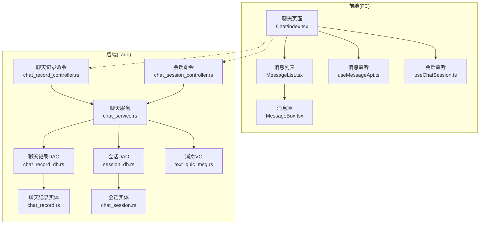
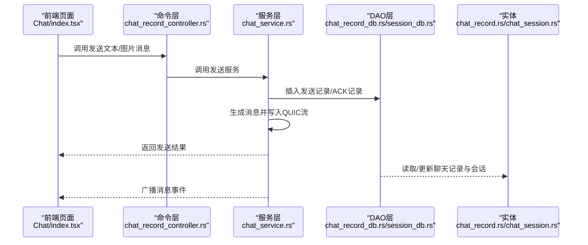
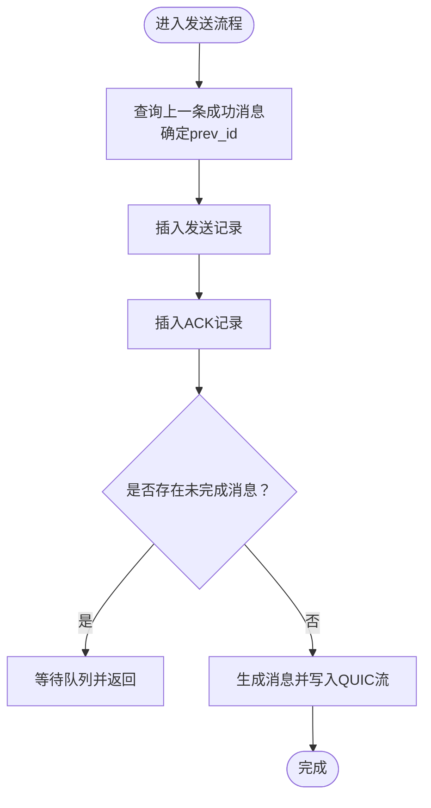
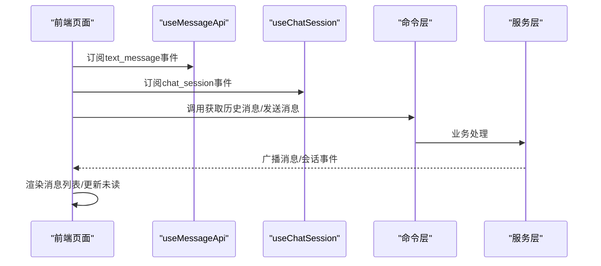
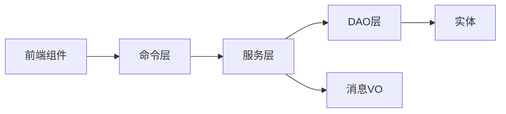

# 聊天服务

<cite>
**本文引用的文件**
- [src/lib.rs](file://src-tauri/src/lib.rs)
- [src/main.rs](file://src-tauri/src/main.rs)
- [service/chat_service.rs](file://src-tauri/src/service/chat_service.rs)
- [cmd/chat_record_controller.rs](file://src-tauri/src/cmd/chat_record_controller.rs)
- [cmd/chat_session_controller.rs](file://src-tauri/src/cmd/chat_session_controller.rs)
- [entity/chat_record.rs](file://src-tauri/src/entity/chat_record.rs)
- [entity/chat_session.rs](file://src-tauri/src/entity/chat_session.rs)
- [dao/chat_record_db.rs](file://src-tauri/src/dao/chat_record_db.rs)
- [dao/session_db.rs](file://src-tauri/src/dao/session_db.rs)
- [vo/text_quic_msg.rs](file://src-tauri/src/vo/text_quic_msg.rs)
- [pages/Home/Chats/Chat/index.tsx](file://apps/pc/src/pages/Home/Chats/Chat/index.tsx)
- [hooks/useChatSession.ts](file://apps/pc/src/hooks/useChatSession.ts)
- [hooks/useMessageApi.ts](file://apps/pc/src/hooks/useMessageApi.ts)
- [pages/Home/Chats/components/MessageBox.tsx](file://apps/pc/src/pages/Home/Chats/components/MessageBox.tsx)
- [pages/Home/Chats/components/MessageList.tsx](file://apps/pc/src/pages/Home/Chats/components/MessageList.tsx)
</cite>

## 目录
1. [简介](#简介)
2. [项目结构](#项目结构)
3. [核心组件](#核心组件)
4. [架构总览](#架构总览)
5. [详细组件分析](#详细组件分析)
6. [依赖关系分析](#依赖关系分析)
7. [性能考量](#性能考量)
8. [故障排查指南](#故障排查指南)
9. [结论](#结论)
10. [附录](#附录)

## 简介
本文件系统性梳理聊天服务的实现机制与扩展指南，覆盖消息发送/接收、聊天记录存储与检索、会话列表维护、已读状态同步、消息类型处理（文本、图片、WebRTC信令）以及消息状态跟踪与会话管理策略。文档同时给出 API 定义、参数规范、返回值格式、调用示例路径与最佳实践，帮助开发者快速理解与扩展聊天能力。

## 项目结构
聊天服务由 Rust 后端（Tauri 插件）与前端 React 页面协同组成：
- 后端通过命令注册暴露聊天接口，封装消息发送、存储、会话管理与事件广播。
- 前端负责渲染消息列表、监听消息事件、触发已读上报与分页加载。

**图表来源**
- [pages/Home/Chats/Chat/index.tsx:1-355](file://apps/pc/src/pages/Home/Chats/Chat/index.tsx#L1-L355)
- [hooks/useMessageApi.ts:1-45](file://apps/pc/src/hooks/useMessageApi.ts#L1-L45)
- [hooks/useChatSession.ts:1-49](file://apps/pc/src/hooks/useChatSession.ts#L1-L49)
- [pages/Home/Chats/components/MessageList.tsx:1-122](file://apps/pc/src/pages/Home/Chats/components/MessageList.tsx#L1-L122)
- [pages/Home/Chats/components/MessageBox.tsx:1-133](file://apps/pc/src/pages/Home/Chats/components/MessageBox.tsx#L1-L133)
- [cmd/chat_record_controller.rs:1-80](file://src-tauri/src/cmd/chat_record_controller.rs#L1-L80)
- [cmd/chat_session_controller.rs:1-24](file://src-tauri/src/cmd/chat_session_controller.rs#L1-L24)
- [service/chat_service.rs:1-582](file://src-tauri/src/service/chat_service.rs#L1-L582)
- [dao/chat_record_db.rs:1-106](file://src-tauri/src/dao/chat_record_db.rs#L1-L106)
- [dao/session_db.rs:1-117](file://src-tauri/src/dao/session_db.rs#L1-L117)
- [entity/chat_record.rs:1-61](file://src-tauri/src/entity/chat_record.rs#L1-L61)
- [entity/chat_session.rs:1-72](file://src-tauri/src/entity/chat_session.rs#L1-L72)
- [vo/text_quic_msg.rs:1-47](file://src-tauri/src/vo/text_quic_msg.rs#L1-L47)

**章节来源**
- [src/lib.rs:1-167](file://src-tauri/src/lib.rs#L1-L167)
- [src/main.rs:1-8](file://src-tauri/src/main.rs#L1-L8)

## 核心组件
- 命令层（Command）：将聊天相关操作暴露为 Tauri 命令，供前端调用。
- 服务层（Service）：封装业务逻辑，如消息发送、已读同步、会话创建与清理、图片消息处理等。
- 数据访问层（DAO）：封装 SQLite 访问，提供聊天记录与会话的增删改查。
- 实体与VO：定义聊天记录、会话、消息体的数据结构与序列化。
- 前端监听与渲染：监听消息事件、渲染消息列表、处理已读上报与分页加载。

**章节来源**
- [cmd/chat_record_controller.rs:1-80](file://src-tauri/src/cmd/chat_record_controller.rs#L1-L80)
- [cmd/chat_session_controller.rs:1-24](file://src-tauri/src/cmd/chat_session_controller.rs#L1-L24)
- [service/chat_service.rs:1-582](file://src-tauri/src/service/chat_service.rs#L1-L582)
- [dao/chat_record_db.rs:1-106](file://src-tauri/src/dao/chat_record_db.rs#L1-L106)
- [dao/session_db.rs:1-117](file://src-tauri/src/dao/session_db.rs#L1-L117)
- [entity/chat_record.rs:1-61](file://src-tauri/src/entity/chat_record.rs#L1-L61)
- [entity/chat_session.rs:1-72](file://src-tauri/src/entity/chat_session.rs#L1-L72)
- [vo/text_quic_msg.rs:1-47](file://src-tauri/src/vo/text_quic_msg.rs#L1-L47)

## 架构总览
聊天服务采用“命令-服务-DAO-实体”的分层设计，结合前端事件监听与状态管理，形成完整的消息生命周期闭环。

**图表来源**
- [cmd/chat_record_controller.rs:16-37](file://src-tauri/src/cmd/chat_record_controller.rs#L16-L37)
- [service/chat_service.rs:280-374](file://src-tauri/src/service/chat_service.rs#L280-L374)
- [dao/chat_record_db.rs:42-55](file://src-tauri/src/dao/chat_record_db.rs#L42-L55)
- [entity/chat_record.rs:8-17](file://src-tauri/src/entity/chat_record.rs#L8-L17)

## 详细组件分析

### 命令层（Command）
- 文本消息发送：带超时与全局发送锁保护，避免并发冲突。
- 图片消息发送：先压缩图片，上传至文件服务器，再构造图片消息并走文本发送流程。
- 已读标记：按消息ID查询并批量更新最后已读记录，同时清理会话未读计数。
- 会话相关：创建会话、获取会话列表、按会话标记已读。

**章节来源**
- [cmd/chat_record_controller.rs:16-79](file://src-tauri/src/cmd/chat_record_controller.rs#L16-L79)
- [cmd/chat_session_controller.rs:6-23](file://src-tauri/src/cmd/chat_session_controller.rs#L6-L23)

### 服务层（Service）
- 会话管理：创建会话、清理会话未读、按用户查询会话。
- 消息发送：生成消息体、维护 prev_id 链、处理发送队列与重试。
- 已读同步：从数据库聚合最后已读消息，去重后更新会话与前端事件。
- 图片消息：压缩、上传、拼装 ImageRecord 并复用文本发送流程。

**图表来源**
- [service/chat_service.rs:280-374](file://src-tauri/src/service/chat_service.rs#L280-L374)

**章节来源**
- [service/chat_service.rs:67-178](file://src-tauri/src/service/chat_service.rs#L67-L178)
- [service/chat_service.rs:280-581](file://src-tauri/src/service/chat_service.rs#L280-L581)

### 数据访问层（DAO）
- 聊天记录：分页查询、按类型过滤、按ID查询、插入记录、查询最后已读、查询最新消息。
- 会话：更新/插入会话、本地更新、查询会话列表、按用户查询、隐藏会话。

**章节来源**
- [dao/chat_record_db.rs:7-105](file://src-tauri/src/dao/chat_record_db.rs#L7-L105)
- [dao/session_db.rs:8-116](file://src-tauri/src/dao/session_db.rs#L8-L116)

### 实体与VO
- 聊天记录实体：包含消息ID、类型、原始数据、双方用户、时间戳。
- 会话实体：包含会话ID、类型、未读数、最后消息、双方用户、置顶/显示标志。
- 消息VO：跨层传输的消息载体，包含nano_id、text_type、raw、recv_user、send_user、timestamp。

**章节来源**
- [entity/chat_record.rs:8-60](file://src-tauri/src/entity/chat_record.rs#L8-L60)
- [entity/chat_session.rs:8-71](file://src-tauri/src/entity/chat_session.rs#L8-L71)
- [vo/text_quic_msg.rs:7-46](file://src-tauri/src/vo/text_quic_msg.rs#L7-L46)

### 前端组件与交互
- 聊天页面：初始化加载历史消息、滚动到底部、监听新消息、标记已读、分页加载。
- 消息监听：订阅 text_message 事件，按接收方过滤，处理ACK与系统消息。
- 会话监听：订阅 chat_session 事件，更新会话未读与UI。
- 消息列表：按时间戳显示时间分隔、动画标识新消息、解析不同类型消息内容。

**图表来源**
- [pages/Home/Chats/Chat/index.tsx:56-127](file://apps/pc/src/pages/Home/Chats/Chat/index.tsx#L56-L127)
- [hooks/useMessageApi.ts:10-39](file://apps/pc/src/hooks/useMessageApi.ts#L10-L39)
- [hooks/useChatSession.ts:9-42](file://apps/pc/src/hooks/useChatSession.ts#L9-L42)

**章节来源**
- [pages/Home/Chats/Chat/index.tsx:1-355](file://apps/pc/src/pages/Home/Chats/Chat/index.tsx#L1-L355)
- [hooks/useMessageApi.ts:1-45](file://apps/pc/src/hooks/useMessageApi.ts#L1-L45)
- [hooks/useChatSession.ts:1-49](file://apps/pc/src/hooks/useChatSession.ts#L1-L49)
- [pages/Home/Chats/components/MessageList.tsx:1-122](file://apps/pc/src/pages/Home/Chats/components/MessageList.tsx#L1-L122)
- [pages/Home/Chats/components/MessageBox.tsx:1-133](file://apps/pc/src/pages/Home/Chats/components/MessageBox.tsx#L1-L133)

## 依赖关系分析
- 命令层依赖服务层；服务层依赖DAO层与实体；DAO层依赖实体与SQLite连接池。
- 前端通过 Tauri invoke 调用命令，通过事件监听接收服务层广播。

**图表来源**
- [cmd/chat_record_controller.rs:1-80](file://src-tauri/src/cmd/chat_record_controller.rs#L1-L80)
- [service/chat_service.rs:1-582](file://src-tauri/src/service/chat_service.rs#L1-L582)
- [dao/chat_record_db.rs:1-106](file://src-tauri/src/dao/chat_record_db.rs#L1-L106)
- [entity/chat_record.rs:1-61](file://src-tauri/src/entity/chat_record.rs#L1-L61)
- [vo/text_quic_msg.rs:1-47](file://src-tauri/src/vo/text_quic_msg.rs#L1-L47)

**章节来源**
- [src/lib.rs:117-163](file://src-tauri/src/lib.rs#L117-L163)

## 性能考量
- 发送锁与超时：发送接口使用全局锁与超时控制，避免并发写入与长时间阻塞。
- 分页查询：聊天记录按页查询并排序，减少一次性加载量。
- 本地去重：已读更新时按发送方+接收方去重，降低重复更新开销。
- 图片压缩：发送前压缩图片，减小网络传输与存储体积。
- 事件驱动：通过事件广播减少轮询成本，提升交互实时性。

[本节为通用性能建议，无需特定文件引用]

## 故障排查指南
- 发送超时或锁冲突：检查发送锁是否被长时间占用，确认命令调用是否在超时时间内完成。
- 已读不同步：确认前端是否正确订阅 chat_session 事件，服务层是否正确清理会话未读。
- 图片发送失败：检查图片压缩与上传流程，确认文件服务器返回状态与biz_id。
- 会话异常：检查会话唯一约束与更新逻辑，确保按用户维度正确更新。

**章节来源**
- [cmd/chat_record_controller.rs:18-36](file://src-tauri/src/cmd/chat_record_controller.rs#L18-L36)
- [service/chat_service.rs:103-115](file://src-tauri/src/service/chat_service.rs#L103-L115)
- [service/chat_service.rs:517-581](file://src-tauri/src/service/chat_service.rs#L517-L581)
- [dao/session_db.rs:8-48](file://src-tauri/src/dao/session_db.rs#L8-L48)

## 结论
该聊天服务以清晰的分层架构实现了消息的全生命周期管理：从发送、存储、检索到会话维护与已读同步。通过命令层统一暴露接口、服务层封装业务规则、DAO层抽象数据访问，配合前端事件驱动渲染，形成了高内聚、低耦合的聊天体系。开发者可在此基础上扩展更多消息类型与业务策略。

[本节为总结性内容，无需特定文件引用]

## 附录

### API 接口定义与调用示例路径
- 发送文本消息
  - 方法：POST（通过命令）
  - 路径：无（命令名：send_text_msg）
  - 请求体：TextQuicMsgVo
    - 字段：nano_id, text_type, raw, recv_user, send_user, timestamp
  - 返回值：字符串（成功/错误信息）
  - 示例路径：[调用示例:294-304](file://apps/pc/src/pages/Home/Chats/Chat/index.tsx#L294-L304)
  - 实现路径：[命令:16-37](file://src-tauri/src/cmd/chat_record_controller.rs#L16-L37), [服务:280-374](file://src-tauri/src/service/chat_service.rs#L280-L374)

- 发送图片消息
  - 方法：POST（通过命令）
  - 路径：无（命令名：send_image_msg）
  - 请求体：TextQuicMsgVo（raw为本地图片路径）
  - 返回值：空/错误信息
  - 示例路径：[调用示例:294-304](file://apps/pc/src/pages/Home/Chats/Chat/index.tsx#L294-L304)
  - 实现路径：[命令:39-43](file://src-tauri/src/cmd/chat_record_controller.rs#L39-L43), [服务:517-581](file://src-tauri/src/service/chat_service.rs#L517-L581)

- 标记已读（按消息ID）
  - 方法：POST（通过命令）
  - 路径：无（命令名：mark_read）
  - 请求体：数组[String]（消息nano_id列表）
  - 返回值：空/错误信息
  - 示例路径：[调用示例:114-127](file://apps/pc/src/pages/Home/Chats/Chat/index.tsx#L114-L127)
  - 实现路径：[命令:45-58](file://src-tauri/src/cmd/chat_record_controller.rs#L45-L58), [服务:180-240](file://src-tauri/src/service/chat_service.rs#L180-L240)

- 获取聊天记录（分页）
  - 方法：POST（通过命令）
  - 路径：无（命令名：get_chat_record_from_store）
  - 请求体：TextQuicMsgVo + Page（size, current）
  - 返回值：TextQuicMsgVo[]
  - 示例路径：[调用示例:141-230](file://apps/pc/src/pages/Home/Chats/Chat/index.tsx#L141-L230)
  - 实现路径：[命令:60-69](file://src-tauri/src/cmd/chat_record_controller.rs#L60-L69), [DAO:7-23](file://src-tauri/src/dao/chat_record_db.rs#L7-L23)

- 按消息类型获取聊天记录
  - 方法：POST（通过命令）
  - 路径：无（命令名：get_chat_record_by_type）
  - 请求体：TextQuicMsgVo + text_type + Page
  - 返回值：TextQuicMsgVo[]
  - 实现路径：[命令:69-79](file://src-tauri/src/cmd/chat_record_controller.rs#L69-L79), [DAO:87-105](file://src-tauri/src/dao/chat_record_db.rs#L87-L105)

- 创建会话
  - 方法：POST（通过命令）
  - 路径：无（命令名：create_chat_session）
  - 请求体：friend_uuid
  - 返回值：空/错误信息
  - 实现路径：[命令:13-17](file://src-tauri/src/cmd/chat_session_controller.rs#L13-L17), [服务:242-278](file://src-tauri/src/service/chat_service.rs#L242-L278)

- 获取会话列表
  - 方法：POST（通过命令）
  - 路径：无（命令名：get_chat_session_from_store）
  - 请求体：无
  - 返回值：ChatSessionVo[]
  - 实现路径：[命令:19-23](file://src-tauri/src/cmd/chat_session_controller.rs#L19-L23), [DAO:74-86](file://src-tauri/src/dao/session_db.rs#L74-L86)

- 按会话标记已读
  - 方法：POST（通过命令）
  - 路径：无（命令名：mark_read_chat_session）
  - 请求体：friend_uuid
  - 返回值：空/错误信息
  - 实现路径：[命令:6-11](file://src-tauri/src/cmd/chat_session_controller.rs#L6-L11), [服务:126-178](file://src-tauri/src/service/chat_service.rs#L126-L178)

### 消息类型与状态
- 文本消息：text_type=0，raw为JSON字符串。
- 图片消息：text_type=2，raw为ImageRecord JSON，包含biz_id、尺寸、大小等。
- WebRTC信令：text_type=100，raw为WebRTCSignalRecord JSON。
- 已读ACK：系统消息text_type=201，用于确认对方已收到消息。

**章节来源**
- [vo/text_quic_msg.rs:7-46](file://src-tauri/src/vo/text_quic_msg.rs#L7-L46)
- [pages/Home/Chats/Chat/index.tsx:264-284](file://apps/pc/src/pages/Home/Chats/Chat/index.tsx#L264-L284)

### 最佳实践建议
- 发送前加锁与超时：确保消息顺序与一致性，避免长时间阻塞。
- 消息链维护：严格设置 prev_id，保证消息链完整与可追溯。
- 图片优化：发送前压缩，上传后缓存biz_id，减少重复上传。
- 已读策略：前端滚动到底部自动标记，服务层按去重策略批量更新。
- 会话管理：按用户维度唯一约束，避免重复会话；隐藏会话时注意双向条件。

[本节为通用最佳实践，无需特定文件引用]