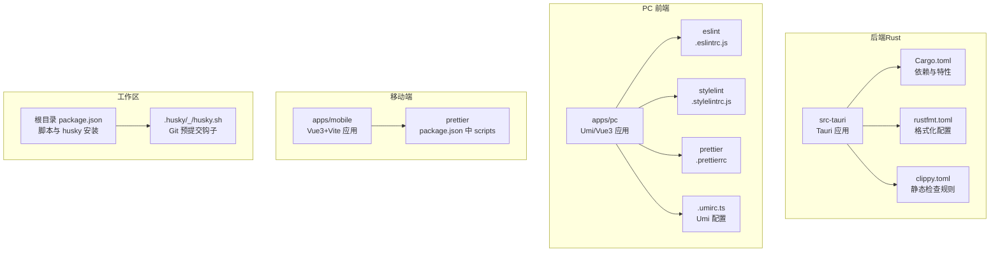
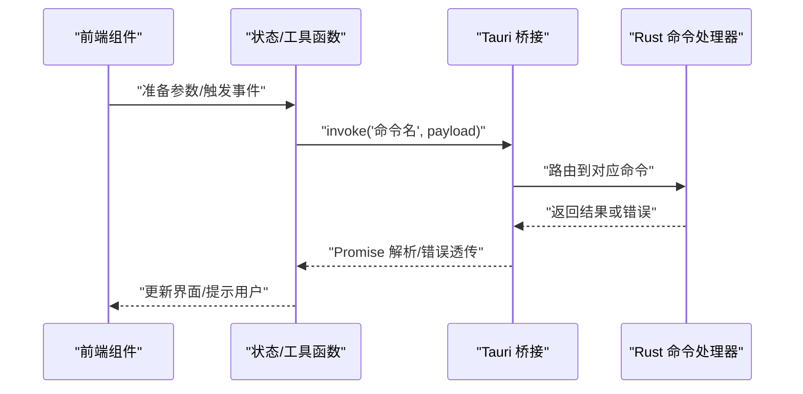
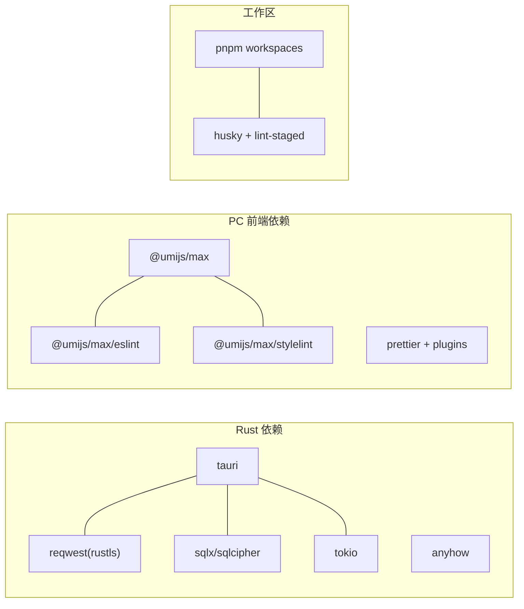

# 代码规范

<cite>
**本文引用的文件**
- [Cargo.toml](file://src-tauri/Cargo.toml)
- [rustfmt.toml](file://src-tauri/rustfmt.toml)
- [clippy.toml](file://src-tauri/clippy.toml)
- [.prettierrc](file://apps/pc/.prettierrc)
- [.eslintrc.js](file://apps/pc/.eslintrc.js)
- [.stylelintrc.js](file://apps/pc/.stylelintrc.js)
- [package.json](file://package.json)
- [package.json](file://apps/mobile/package.json)
- [.umirc.ts](file://apps/pc/.umirc.ts)
- [tsconfig.json](file://apps/pc/tsconfig.json)
- [tsconfig.json](file://apps/mobile/tsconfig.json)
- [lib.rs](file://src-tauri/src/lib.rs)
- [main.rs](file://src-tauri/src/main.rs)
- [LayoutBtn.tsx](file://apps/pc/src/components/Button/LayoutBtn.tsx)
- [index.tsx](file://apps/pc/src/pages/Home/Chats/Chat/index.tsx)
- [format.ts](file://apps/pc/src/utils/format.ts)
- [husky.sh](file://.husky/_/husky.sh)
</cite>

## 目录
1. [引言](#引言)
2. [项目结构](#项目结构)
3. [核心组件](#核心组件)
4. [架构总览](#架构总览)
5. [详细组件分析](#详细组件分析)
6. [依赖关系分析](#依赖关系分析)
7. [性能考虑](#性能考虑)
8. [故障排查指南](#故障排查指南)
9. [结论](#结论)
10. [附录](#附录)

## 引言
本文件为跨端应用“Rust-Tauri-Umi”的统一代码规范与最佳实践指南，覆盖以下方面：
- Rust 后端：格式化与静态检查（rustfmt、Clippy）及工程配置
- 前端（PC 端 Umi/Vue3）：TypeScript、Less、ESLint、Stylelint、Prettier 规范
- 移动端（Vue3 + Vite）：TypeScript、Less、Prettier 规范
- Git 提交与自动化：husky、lint-staged、pre-commit 流程
- IDE 配置与插件推荐、注释与错误处理模式、命名约定、代码组织结构
- 通过图示与“章节来源”定位到具体实现文件，便于对照与落地

## 项目结构
该仓库采用 monorepo 结构，包含：
- src-tauri：Rust 后端（Tauri 应用）
- apps/pc：Umi/Vue3 PC 端应用
- apps/mobile：Vue3 移动端应用
- 根目录：工作区脚本与 husky 预提交钩子

图表来源
- [Cargo.toml:1-62](file://src-tauri/Cargo.toml#L1-L62)
- [rustfmt.toml:1-27](file://src-tauri/rustfmt.toml#L1-L27)
- [clippy.toml:1-4](file://src-tauri/clippy.toml#L1-L4)
- [.eslintrc.js:1-4](file://apps/pc/.eslintrc.js#L1-L4)
- [.stylelintrc.js:1-4](file://apps/pc/.stylelintrc.js#L1-L4)
- [.prettierrc:1-9](file://apps/pc/.prettierrc#L1-L9)
- [.umirc.ts:1-22](file://apps/pc/.umirc.ts#L1-L22)
- [package.json:1-30](file://package.json#L1-L30)
- [package.json:1-37](file://apps/mobile/package.json#L1-L37)
- [husky.sh](file://.husky/_/husky.sh)

章节来源
- [package.json:1-30](file://package.json#L1-L30)
- [Cargo.toml:1-62](file://src-tauri/Cargo.toml#L1-L62)

## 核心组件
- Rust 后端：以 Tauri 为核心，模块化组织命令、服务、DAO、实体等；通过生成的命令处理器对外暴露能力
- PC 前端：基于 Umi 的路由、布局、国际化、请求封装；组件按功能拆分，样式使用 Less
- 移动端：Vue3 + Vite，遵循 PC 端的 TS/Less/Prettier 规范
- 工作区：统一脚本、husky 预提交、lint-staged 统一执行格式化与校验

章节来源
- [lib.rs:1-167](file://src-tauri/src/lib.rs#L1-L167)
- [main.rs:1-8](file://src-tauri/src/main.rs#L1-L8)
- [.umirc.ts:1-22](file://apps/pc/.umirc.ts#L1-L22)
- [package.json:1-37](file://apps/mobile/package.json#L1-L37)

## 架构总览
下图展示从浏览器/桌面窗口到后端命令调用的典型流程。

图表来源
- [lib.rs:117-163](file://src-tauri/src/lib.rs#L117-L163)
- [index.tsx:89-98](file://apps/pc/src/pages/Home/Chats/Chat/index.tsx#L89-L98)
- [index.tsx:104-112](file://apps/pc/src/pages/Home/Chats/Chat/index.tsx#L104-L112)

## 详细组件分析

### Rust 后端规范
- 命名约定
  - 模块与文件：snake_case；公共函数与导出项：snake_case；常量：SCREAMING_SNAKE_CASE
  - 类型与枚举：PascalCase；泛型参数：通常使用单字母或简短描述
- 代码组织
  - 命令层：src/cmd/* 控制器，负责参数解析与调用服务层
  - 服务层：src/service/* 业务逻辑，尽量无副作用、可测试
  - DAO 层：src/dao/* 数据访问，封装数据库操作
  - 实体与 VO：src/entity/*、src/vo/* 明确数据模型边界
  - 工具与配置：src/utils/*、src/config.rs
- 注释与文档
  - 对外公开的命令与服务函数应有简洁文档注释，说明用途、输入输出与异常
  - 复杂算法或平台相关逻辑需补充背景说明
- 错误处理
  - 使用 anyhow 或自定义 Result 类型，避免 unwrap/unreachable
  - 在命令入口处统一转换为 HTTP/IPC 友好的错误结构
- 并发与资源
  - 全局共享状态使用 Arc<Mutex/ RwLock/DashMap> 包裹；尽量减少全局状态
  - 数据库连接池使用 Arc 封装，按库区分公共/私有连接池
- 性能与安全
  - 发布配置启用 LTO、优化级别等；网络通信使用 rustls；SQLite 使用 sqlcipher
- 格式化与静态检查
  - rustfmt：最大行长、缩进风格、导入分组策略
  - Clippy：禁止 unwrap 系列方法，鼓励显式错误处理

章节来源
- [Cargo.toml:1-62](file://src-tauri/Cargo.toml#L1-L62)
- [rustfmt.toml:1-27](file://src-tauri/rustfmt.toml#L1-L27)
- [clippy.toml:1-4](file://src-tauri/clippy.toml#L1-L4)
- [lib.rs:1-167](file://src-tauri/src/lib.rs#L1-L167)
- [main.rs:1-8](file://src-tauri/src/main.rs#L1-L8)

### PC 前端（Umi/Vue3）规范
- 命名约定
  - 组件文件：PascalCase（如 Chat/index.tsx），样式文件：同名目录下的 index.less
  - 类型与接口：PascalCase；常量：SCREAMING_SNAKE_CASE
  - 路由与页面：按功能目录划分，页面组件以 index.tsx 命名
- 代码组织
  - 组件：src/components/* 功能拆分，样式独立 less 文件
  - 页面：src/pages/* 按模块划分，子组件在 components 子目录
  - Hooks：src/hooks/*
  - 服务与 API：src/services/*
  - 工具：src/utils/*
  - 布局：src/layouts/*
  - 国际化：src/locales/*
  - 主题：src/theme/*
- 注释与文档
  - 函数/方法：JSDoc 风格注释，说明参数、返回值、异常
  - 复杂逻辑：在关键分支添加注释说明
- 错误处理
  - 统一使用 try/catch 包裹 invoke 调用，打印日志并提示用户
  - 对外部错误进行分类与用户友好提示
- 样式规范
  - 使用 Less，组件样式类名采用 BEM 风格或语义化命名
  - 全局样式集中于 src/global.less，主题变量集中于 theme/*.json
- TypeScript 规范
  - 严格模式，明确类型声明；避免 any；合理使用联合类型与工具类型
  - 对外暴露的 props 使用接口约束，避免不必要可选属性

章节来源
- [.umirc.ts:1-22](file://apps/pc/.umirc.ts#L1-L22)
- [LayoutBtn.tsx:1-19](file://apps/pc/src/components/Button/LayoutBtn.tsx#L1-L19)
- [index.tsx:1-355](file://apps/pc/src/pages/Home/Chats/Chat/index.tsx#L1-L355)
- [format.ts:1-52](file://apps/pc/src/utils/format.ts#L1-L52)

### 移动端（Vue3 + Vite）规范
- 命名约定与组织结构同 PC 端，保持一致性
- 样式与脚本：Less + TypeScript，遵循 PC 端的 Prettier 规则
- 构建与运行：通过 package.json 中的 scripts 进行开发与构建

章节来源
- [package.json:1-37](file://apps/mobile/package.json#L1-L37)

### Git 提交与自动化规范
- 预提交钩子
  - husky 安装与钩子脚本：根目录 scripts.prepare 调用 husky install
  - lint-staged：对暂存区文件执行格式化与校验
- 提交前检查
  - Rust：cargo fmt、cargo clippy
  - PC/移动端：prettier、eslint、stylelint
- 提交信息
  - 建议采用“类型(scope)：变更摘要”的格式，配合变更日志生成

章节来源
- [package.json:1-30](file://package.json#L1-L30)
- [husky.sh](file://.husky/_/husky.sh)

## 依赖关系分析
- 后端依赖
  - Tauri 2、reqwest（rustls）、sqlx/sqlcipher、tokio、dashmap、anyhow、uuid 等
  - 发布配置启用 LTO、单代码生成单元
- 前端依赖
  - Umi、Ant Design、国际化、请求封装、路由
  - ESLint、Stylelint、Prettier 插件链
- 工作区
  - pnpm workspace 管理多包；统一脚本与 husky 预提交

图表来源
- [Cargo.toml:24-62](file://src-tauri/Cargo.toml#L24-L62)
- [.eslintrc.js:1-4](file://apps/pc/.eslintrc.js#L1-L4)
- [.stylelintrc.js:1-4](file://apps/pc/.stylelintrc.js#L1-L4)
- [package.json:1-30](file://package.json#L1-L30)

章节来源
- [Cargo.toml:1-62](file://src-tauri/Cargo.toml#L1-L62)
- [.eslintrc.js:1-4](file://apps/pc/.eslintrc.js#L1-L4)
- [.stylelintrc.js:1-4](file://apps/pc/.stylelintrc.js#L1-L4)
- [package.json:1-30](file://package.json#L1-L30)

## 性能考虑
- Rust 后端
  - 发布配置开启 LTO、优化级别与单代码生成单元，提升运行时性能
  - 数据库连接池复用，避免频繁创建销毁
  - 全局并发容器使用 DashMap/RwLock，降低锁竞争
- 前端
  - 懒加载与虚拟滚动结合，控制列表渲染规模
  - 图片压缩与缓存策略，减少带宽与 CPU 占用
  - 事件节流与去抖，避免高频重排/重绘

## 故障排查指南
- Rust
  - 启用 RUST_BACKTRACE=full 获取完整堆栈
  - 在命令入口捕获错误并转换为 IPC 友好格式
  - 使用 Clippy 禁止 unwrap，改用显式错误处理
- 前端
  - invoke 调用统一 try/catch，记录错误并提示用户
  - 样式冲突优先检查 Less 作用域与类名拼接
- Git 预提交
  - husky 安装失败：确认 scripts.prepare 是否执行成功
  - lint-staged 未生效：检查 .lintstagedrc 与各工具配置

章节来源
- [lib.rs:94-115](file://src-tauri/src/lib.rs#L94-L115)
- [clippy.toml:1-4](file://src-tauri/clippy.toml#L1-L4)
- [package.json:13-14](file://package.json#L13-L14)
- [index.tsx:89-98](file://apps/pc/src/pages/Home/Chats/Chat/index.tsx#L89-L98)

## 结论
本规范以“统一、可维护、可扩展”为目标，结合 Rust 的静态安全与前端的工程化工具链，形成前后端一致的编码标准与自动化流程。建议团队在日常开发中：
- 严格遵守命名与组织约定
- 使用 IDE 插件与自动格式化工具
- 在提交前执行本地校验
- 通过 husky/lint-staged 保证仓库质量

## 附录

### Rust 编码规范要点
- 格式化：cargo fmt（rustfmt.toml）
- 静态检查：cargo clippy（clippy.toml）
- 依赖与发布：Cargo.toml
- 入口与命令注册：lib.rs、main.rs

章节来源
- [rustfmt.toml:1-27](file://src-tauri/rustfmt.toml#L1-L27)
- [clippy.toml:1-4](file://src-tauri/clippy.toml#L1-L4)
- [Cargo.toml:1-62](file://src-tauri/Cargo.toml#L1-L62)
- [lib.rs:117-163](file://src-tauri/src/lib.rs#L117-L163)
- [main.rs:1-8](file://src-tauri/src/main.rs#L1-L8)

### 前端编码规范要点
- TypeScript：严格类型、明确注释
- ESLint：继承 @umijs/max/eslint
- Stylelint：继承 @umijs/max/stylelint
- Prettier：统一缩进、引号、尾逗号等
- Umi 配置：国际化、路由、插件等

章节来源
- [.eslintrc.js:1-4](file://apps/pc/.eslintrc.js#L1-L4)
- [.stylelintrc.js:1-4](file://apps/pc/.stylelintrc.js#L1-L4)
- [.prettierrc:1-9](file://apps/pc/.prettierrc#L1-L9)
- [.umirc.ts:1-22](file://apps/pc/.umirc.ts#L1-L22)

### Git 与自动化
- 预提交：husky install、lint-staged
- 工作区脚本：统一 dev/build/prepare

章节来源
- [package.json:1-30](file://package.json#L1-L30)
- [husky.sh](file://.husky/_/husky.sh)