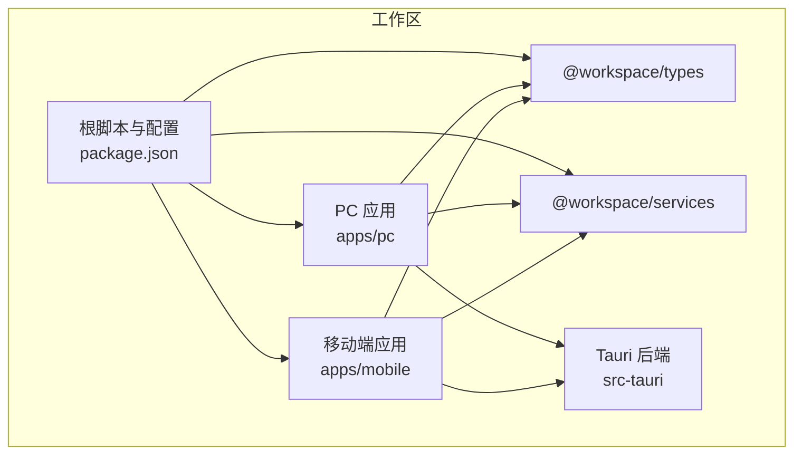
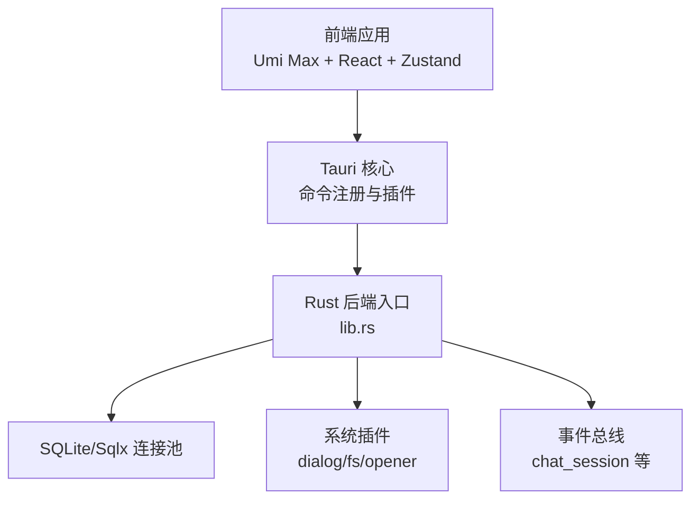
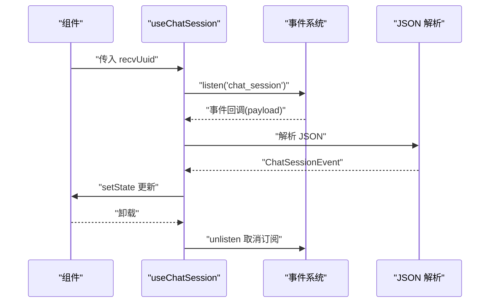
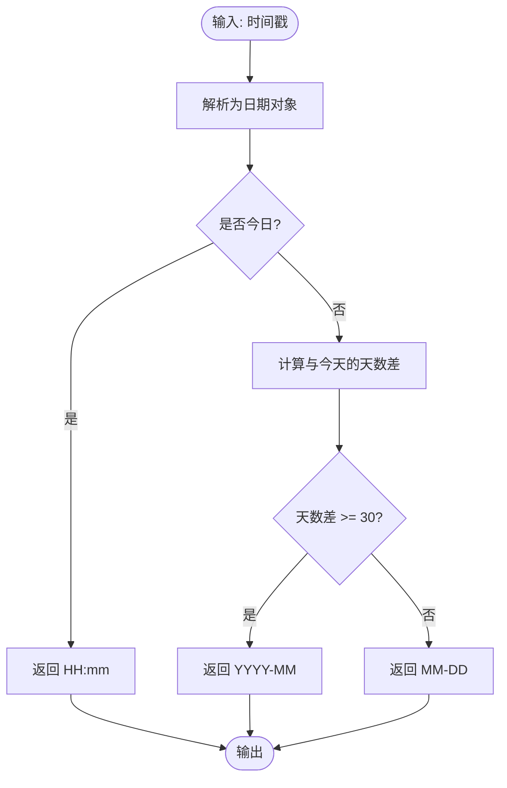
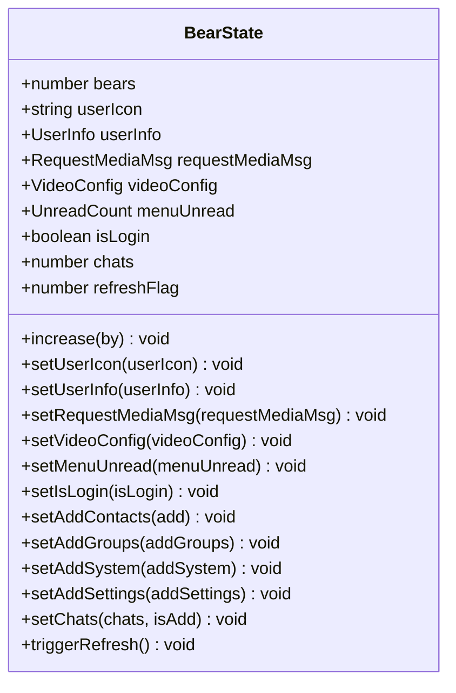
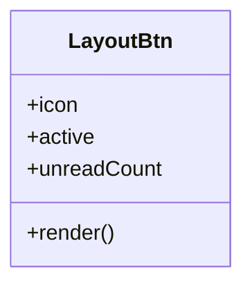
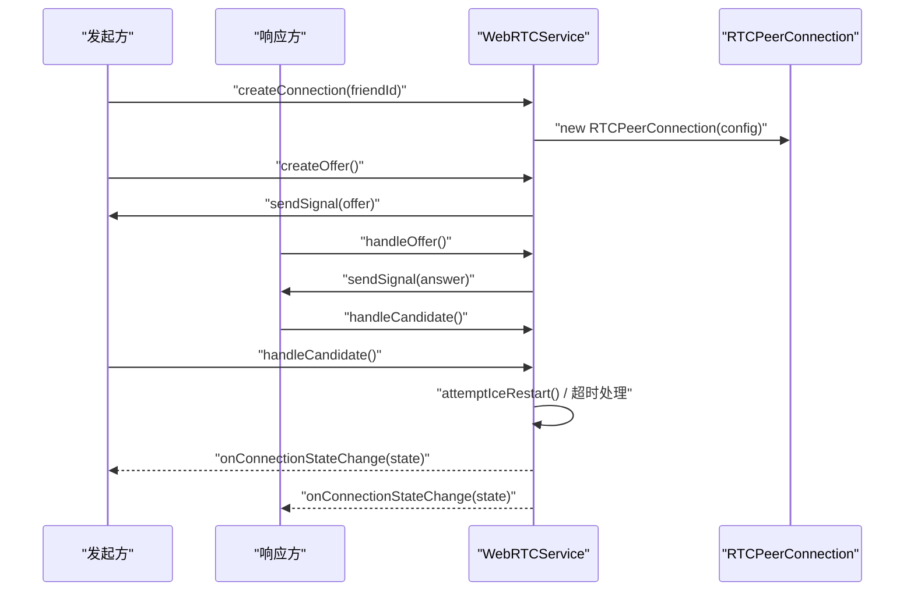
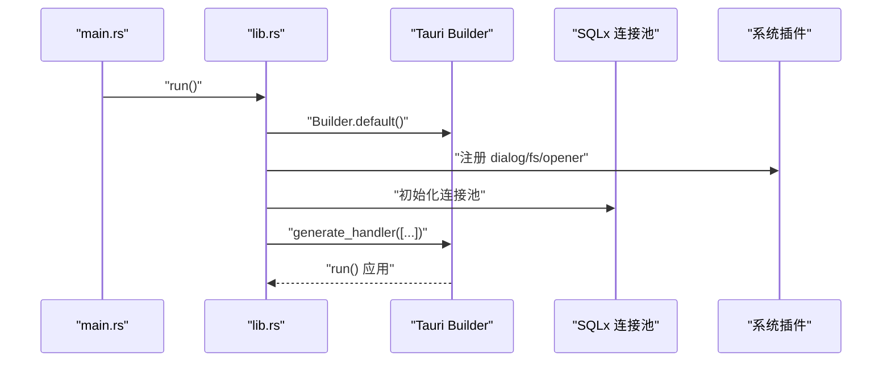
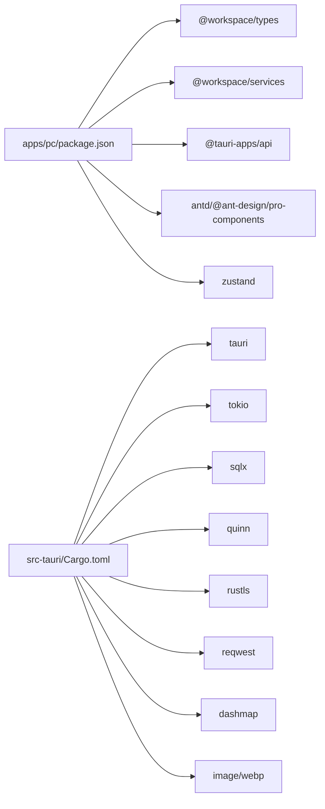

# 开发指南

<cite>
**本文引用的文件**   
- [package.json](file://package.json)
- [apps/pc/package.json](file://apps/pc/package.json)
- [apps/mobile/package.json](file://apps/mobile/package.json)
- [apps/pc/.umirc.ts](file://apps/pc/.umirc.ts)
- [src-tauri/Cargo.toml](file://src-tauri/Cargo.toml)
- [src-tauri/src/lib.rs](file://src-tauri/src/lib.rs)
- [src-tauri/src/main.rs](file://src-tauri/src/main.rs)
- [apps/pc/src/hooks/index.ts](file://apps/pc/src/hooks/index.ts)
- [apps/pc/src/hooks/useChatSession.ts](file://apps/pc/src/hooks/useChatSession.ts)
- [apps/pc/src/utils/format.ts](file://apps/pc/src/utils/format.ts)
- [apps/pc/src/store/store.ts](file://apps/pc/src/store/store.ts)
- [apps/pc/src/app.ts](file://apps/pc/src/app.ts)
- [apps/pc/src/components/Button/LayoutBtn.tsx](file://apps/pc/src/components/Button/LayoutBtn.tsx)
- [apps/pc/src/services/webrtcService/index.ts](file://apps/pc/src/services/webrtcService/index.ts)
- [src-tauri/tests/api_service_tests.rs](file://src-tauri/tests/api_service_tests.rs)
- [README.md](file://README.md)
</cite>

## 目录
1. [简介](#简介)
2. [项目结构](#项目结构)
3. [核心组件](#核心组件)
4. [架构总览](#架构总览)
5. [详细组件分析](#详细组件分析)
6. [依赖关系分析](#依赖关系分析)
7. [性能考虑](#性能考虑)
8. [故障排查指南](#故障排查指南)
9. [结论](#结论)
10. [附录](#附录)

## 简介
本开发指南面向参与本项目的前端与后端开发者，提供从环境准备、开发流程、代码规范、调试技巧到性能优化、测试策略与自动化配置的完整实践指引。项目采用 Umi Max（React）+ Ant Design + Zustand 作为前端技术栈，结合 Tauri 桌面端框架与 Rust 后端，实现即时通讯、媒体处理与 P2P 通信能力。

## 项目结构
项目采用多包工作区组织方式，包含 PC 端应用、移动端应用、共享类型与服务包，以及 Tauri Rust 后端。根级脚本统一管理各子包的开发与构建流程；PC 端应用通过 Umi Max 配置路由与国际化；Rust 后端通过 Tauri 注册命令与插件，提供系统能力与业务接口。

**图表来源**
- [package.json:1-30](file://package.json#L1-L30)
- [apps/pc/package.json:1-45](file://apps/pc/package.json#L1-L45)
- [apps/mobile/package.json:1-37](file://apps/mobile/package.json#L1-L37)

**章节来源**
- [README.md:76-93](file://README.md#L76-L93)
- [package.json:4-14](file://package.json#L4-L14)
- [apps/pc/.umirc.ts:1-22](file://apps/pc/.umirc.ts#L1-L22)

## 核心组件
- 前端状态管理：Zustand Store 提供全局状态与媒体配置，支持未读计数、登录态与刷新标志等。
- Hook 封装：事件监听 Hook（如 useChatSession）负责跨平台事件订阅与清理，保证组件生命周期安全。
- 工具函数：时间格式化工具提供消息时间与完整时间展示逻辑。
- 服务层：WebRTC 服务封装连接生命周期、信令交换、媒体轨道控制与 ICE 重启策略。
- 后端入口：Rust lib.rs 注册命令与插件，初始化托盘、数据库连接池与全局静态变量。

**章节来源**
- [apps/pc/src/store/store.ts:1-122](file://apps/pc/src/store/store.ts#L1-L122)
- [apps/pc/src/hooks/useChatSession.ts:1-49](file://apps/pc/src/hooks/useChatSession.ts#L1-L49)
- [apps/pc/src/utils/format.ts:1-52](file://apps/pc/src/utils/format.ts#L1-L52)
- [apps/pc/src/services/webrtcService/index.ts:1-1662](file://apps/pc/src/services/webrtcService/index.ts#L1-L1662)
- [src-tauri/src/lib.rs:77-167](file://src-tauri/src/lib.rs#L77-L167)

## 架构总览
整体架构由前端应用与 Rust 后端组成，前端通过 Tauri 暴露的命令与插件调用后端能力，后端通过 Tokio 运行时与 SQLx 连接 SQLite 数据库，同时维护 QUIC/P2P 与 WebRTC 通信通道。

**图表来源**
- [apps/pc/.umirc.ts:1-22](file://apps/pc/.umirc.ts#L1-L22)
- [src-tauri/src/lib.rs:91-167](file://src-tauri/src/lib.rs#L91-L167)
- [src-tauri/Cargo.toml:24-62](file://src-tauri/Cargo.toml#L24-L62)

**章节来源**
- [src-tauri/src/lib.rs:77-167](file://src-tauri/src/lib.rs#L77-L167)
- [src-tauri/src/main.rs:1-8](file://src-tauri/src/main.rs#L1-L8)

## 详细组件分析

### Hook 封装模式：useChatSession
该 Hook 负责订阅 chat_session 事件，解析 payload 并根据目标用户 UUID 过滤消息，最后在组件卸载时取消监听，避免内存泄漏与重复订阅。

**图表来源**
- [apps/pc/src/hooks/useChatSession.ts:6-43](file://apps/pc/src/hooks/useChatSession.ts#L6-L43)

**章节来源**
- [apps/pc/src/hooks/index.ts:1-6](file://apps/pc/src/hooks/index.ts#L1-L6)
- [apps/pc/src/hooks/useChatSession.ts:1-49](file://apps/pc/src/hooks/useChatSession.ts#L1-L49)

### 工具函数：时间格式化
提供“今日/非今日”、“按月/按日”与“完整时间”三种格式化策略，兼顾本地化与可读性。

**图表来源**
- [apps/pc/src/utils/format.ts:5-40](file://apps/pc/src/utils/format.ts#L5-L40)

**章节来源**
- [apps/pc/src/utils/format.ts:1-52](file://apps/pc/src/utils/format.ts#L1-L52)

### 状态管理：Zustand Store
Store 定义全局状态键与动作，包括用户信息、媒体配置、未读计数、登录态与刷新标志等，提供原子更新与批量更新方法，保证状态一致性与可追踪性。

**图表来源**
- [apps/pc/src/store/store.ts:9-32](file://apps/pc/src/store/store.ts#L9-L32)

**章节来源**
- [apps/pc/src/store/store.ts:1-122](file://apps/pc/src/store/store.ts#L1-L122)

### 通用组件：按钮与徽标
布局按钮组件通过属性控制图标、激活态与未读徽标显示，样式通过模块化 CSS 实现，便于主题切换与复用。

**图表来源**
- [apps/pc/src/components/Button/LayoutBtn.tsx:1-19](file://apps/pc/src/components/Button/LayoutBtn.tsx#L1-L19)

**章节来源**
- [apps/pc/src/components/Button/LayoutBtn.tsx:1-19](file://apps/pc/src/components/Button/LayoutBtn.tsx#L1-L19)

### 服务层：WebRTC 服务
WebRTC 服务封装连接生命周期、信令交换、媒体轨道控制与 ICE 重启策略，支持 NAT3 环境下的候选对优化与超时处理。

**图表来源**
- [apps/pc/src/services/webrtcService/index.ts:131-738](file://apps/pc/src/services/webrtcService/index.ts#L131-L738)

**章节来源**
- [apps/pc/src/services/webrtcService/index.ts:1-1662](file://apps/pc/src/services/webrtcService/index.ts#L1-L1662)

### 后端入口：Rust 入口与命令注册
Rust 入口负责初始化托盘、设置全局环境变量、注册命令与插件，并运行 Tauri 应用。

**图表来源**
- [src-tauri/src/main.rs:4-7](file://src-tauri/src/main.rs#L4-L7)
- [src-tauri/src/lib.rs:91-167](file://src-tauri/src/lib.rs#L91-L167)

**章节来源**
- [src-tauri/src/main.rs:1-8](file://src-tauri/src/main.rs#L1-L8)
- [src-tauri/src/lib.rs:77-167](file://src-tauri/src/lib.rs#L77-L167)

## 依赖关系分析
- 前端依赖：Umi Max、Ant Design、Zustand、React、@tauri-apps/api 等；PC 应用额外依赖 @workspace/types 与 @workspace/services。
- 后端依赖：Tauri、Tokio、SQLx、rusqlite（bundled-sqlcipher）、reqwest、quinn、rustls、fast_log、dashmap、image/webp 等。
- 工作区脚本：统一管理 dev/build/tauri 等命令，支持并行构建 types 与 services。

**图表来源**
- [apps/pc/package.json:18-32](file://apps/pc/package.json#L18-L32)
- [src-tauri/Cargo.toml:24-62](file://src-tauri/Cargo.toml#L24-L62)

**章节来源**
- [apps/pc/package.json:1-45](file://apps/pc/package.json#L1-L45)
- [apps/mobile/package.json:16-24](file://apps/mobile/package.json#L16-L24)
- [src-tauri/Cargo.toml:1-62](file://src-tauri/Cargo.toml#L1-L62)
- [package.json:4-14](file://package.json#L4-L14)

## 性能考虑
- 前端
  - 使用 Zustand 替代重型状态库，减少不必要的重渲染。
  - 图片与媒体处理建议使用 WebP 或压缩策略，降低带宽与内存占用。
  - WebRTC 候选池与 ICE 超时参数需根据网络环境调整，避免过度重试导致资源浪费。
- 后端
  - 使用 LTO、单代码生成单元与优化级别提升发布性能。
  - SQLx 连接池与 rusqlite（bundled-sqlcipher）保障数据库并发与安全。
  - Tokio 全栈运行时，注意异步任务调度与背压处理。

**章节来源**
- [src-tauri/Cargo.toml:11-15](file://src-tauri/Cargo.toml#L11-L15)
- [src-tauri/src/lib.rs:61-75](file://src-tauri/src/lib.rs#L61-L75)

## 故障排查指南
- 事件监听未清理
  - 症状：组件卸载后仍接收事件，内存增长。
  - 处理：确认 Hook 中返回的取消函数被调用。
  - 参考：[apps/pc/src/hooks/useChatSession.ts:40-43](file://apps/pc/src/hooks/useChatSession.ts#L40-L43)
- WebRTC 连接失败
  - 症状：ICE 失败、超时。
  - 处理：检查 STUN 列表、候选池大小与 ICE 重启策略；必要时延长超时时间。
  - 参考：[apps/pc/src/services/webrtcService/index.ts:593-614](file://apps/pc/src/services/webrtcService/index.ts#L593-L614)
- Rust 插件初始化失败
  - 症状：托盘或系统对话框不可用。
  - 处理：检查插件注册顺序与初始化日志。
  - 参考：[src-tauri/src/lib.rs:94-115](file://src-tauri/src/lib.rs#L94-L115)
- 文件上传测试失败
  - 症状：文件不存在或上传失败。
  - 处理：验证测试文件路径与权限。
  - 参考：[src-tauri/tests/api_service_tests.rs:31-39](file://src-tauri/tests/api_service_tests.rs#L31-L39)

**章节来源**
- [apps/pc/src/hooks/useChatSession.ts:40-43](file://apps/pc/src/hooks/useChatSession.ts#L40-L43)
- [apps/pc/src/services/webrtcService/index.ts:593-614](file://apps/pc/src/services/webrtcService/index.ts#L593-L614)
- [src-tauri/src/lib.rs:94-115](file://src-tauri/src/lib.rs#L94-L115)
- [src-tauri/tests/api_service_tests.rs:31-39](file://src-tauri/tests/api_service_tests.rs#L31-L39)

## 结论
本指南提供了从项目结构、核心组件到架构与性能优化的系统性开发参考。建议在日常开发中遵循统一的代码规范、测试策略与调试流程，以保障功能稳定性与可维护性。

## 附录

### 开发工作流程
- 环境准备：安装 Node.js、pnpm、Rust（rustup）与 Tauri 依赖。
- 本地开发：使用根脚本启动前端与 Tauri 开发模式。
- 代码格式化：通过 Prettier 与 Husky/Lint-Staged 自动化格式化与校验。
- 构建与打包：分别构建前端与 Tauri 桌面应用产物。

**章节来源**
- [README.md:16-75](file://README.md#L16-L75)
- [package.json:4-14](file://package.json#L4-L14)

### 代码规范与最佳实践
- 前端
  - 使用 TypeScript 严格模式，组件与 Hook 明确输入输出。
  - 状态管理集中于 Zustand，避免跨组件重复状态。
  - 事件监听务必在副作用清理阶段取消订阅。
- 后端
  - 使用 async/await 与 Tokio 运行时，避免阻塞操作。
  - SQLx 查询使用参数绑定，防止注入。
  - 日志使用 fast_log，生产环境开启 backtrace。

**章节来源**
- [apps/pc/src/hooks/useChatSession.ts:13-43](file://apps/pc/src/hooks/useChatSession.ts#L13-L43)
- [src-tauri/src/lib.rs:86-89](file://src-tauri/src/lib.rs#L86-L89)

### 调试技巧
- 前端
  - 在组件中打印事件与状态变更，定位订阅与更新问题。
  - 使用 React DevTools 检查渲染与状态树。
- 后端
  - 启用 RUST_BACKTRACE=full，查看完整堆栈。
  - 通过日志与 SQLx 统计信息定位性能瓶颈。

**章节来源**
- [apps/pc/src/services/webrtcService/index.ts:765-800](file://apps/pc/src/services/webrtcService/index.ts#L765-L800)
- [src-tauri/src/lib.rs:86-89](file://src-tauri/src/lib.rs#L86-L89)

### 单元测试与集成测试
- Rust 测试
  - 使用 #[tokio::test] 编写异步测试，覆盖文件上传与表单提交场景。
  - 参考：[src-tauri/tests/api_service_tests.rs:17-58](file://src-tauri/tests/api_service_tests.rs#L17-L58)
- 前端测试
  - 建议使用 Vitest/Jest 对工具函数与 Hook 行为进行单元测试。
  - 集成测试可结合 Playwright 或 Cypress 进行端到端验证。

**章节来源**
- [src-tauri/tests/api_service_tests.rs:17-58](file://src-tauri/tests/api_service_tests.rs#L17-L58)

### 自动化与质量门禁
- Husky + Lint-Staged：在提交前执行格式化与 ESLint/StyleLint 校验。
- Prettier：统一代码风格，减少审阅分歧。
- CI/CD：建议在流水线中加入 Rust 与前端构建、测试步骤。

**章节来源**
- [package.json:16-24](file://package.json#L16-L24)

### 重构与扩展指导
- 重构
  - 将重复逻辑抽象为 Hook 或工具函数，保持单一职责。
  - 对大型组件拆分，使用组合与状态下沉。
- 扩展
  - 新增 Tauri 命令时，遵循现有命名与参数约定，统一返回结构。
  - 新增 WebRTC 功能时，优先复用现有服务封装与 ICE 策略。

**章节来源**
- [apps/pc/src/services/webrtcService/index.ts:131-190](file://apps/pc/src/services/webrtcService/index.ts#L131-L190)
- [src-tauri/src/lib.rs:117-163](file://src-tauri/src/lib.rs#L117-L163)