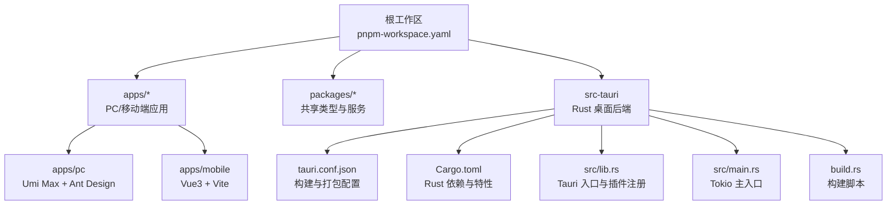
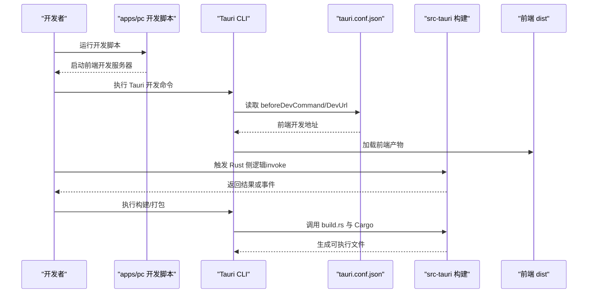
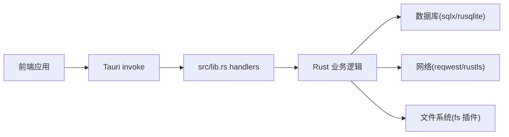

# 开发流程

<cite>
**本文引用的文件**
- [package.json](file://package.json)
- [pnpm-workspace.yaml](file://pnpm-workspace.yaml)
- [README.md](file://README.md)
- [.gitignore](file://.gitignore)
- [apps/pc/package.json](file://apps/pc/package.json)
- [apps/mobile/package.json](file://apps/mobile/package.json)
- [apps/pc/.prettierrc](file://apps/pc/.prettierrc)
- [apps/pc/.umirc.ts](file://apps/pc/.umirc.ts)
- [apps/mobile/vite.config.ts](file://apps/mobile/vite.config.ts)
- [src-tauri/Cargo.toml](file://src-tauri/Cargo.toml)
- [src-tauri/Cargo.lock](file://src-tauri/Cargo.lock)
- [src-tauri/tauri.conf.json](file://src-tauri/tauri.conf.json)
- [src-tauri/build.rs](file://src-tauri/build.rs)
- [src-tauri/src/main.rs](file://src-tauri/src/main.rs)
- [src-tauri/src/lib.rs](file://src-tauri/src/lib.rs)
</cite>

## 目录

1. [简介](#简介)
2. [项目结构](#项目结构)
3. [核心组件](#核心组件)
4. [架构总览](#架构总览)
5. [详细组件分析](#详细组件分析)
6. [依赖分析](#依赖分析)
7. [性能考虑](#性能考虑)
8. [故障排查指南](#故障排查指南)
9. [结论](#结论)
10. [附录](#附录)

## 简介

本项目是一个基于 Umi Max（React）与 Tauri 的跨平台桌面应用，结合 Rust 后端实现即时通讯、媒体处理与 P2P 通信能力。开发流程围绕多包工作区（pnpm workspaces）、前端工程化（Vite/Vue 或 Umi Max）、Rust 后端（Tauri 插件与 CLI）以及统一的代码质量工具链（Prettier、Husky、lint-staged）展开。

## 项目结构

项目采用 monorepo 结构，根级通过 pnpm 工作区组织 packages 与 apps 两个子树；桌面端 Rust 后端位于 src-tauri，前端 PC 应用位于 apps/pc，移动端应用位于 apps/mobile。

图表来源

- [pnpm-workspace.yaml:1-4](file://pnpm-workspace.yaml#L1-L4)
- [apps/pc/package.json:1-45](file://apps/pc/package.json#L1-L45)
- [apps/mobile/package.json:1-37](file://apps/mobile/package.json#L1-L37)
- [src-tauri/tauri.conf.json:1-58](file://src-tauri/tauri.conf.json#L1-L58)
- [src-tauri/Cargo.toml:1-62](file://src-tauri/Cargo.toml#L1-L62)
- [src-tauri/src/lib.rs:1-167](file://src-tauri/src/lib.rs#L1-L167)
- [src-tauri/src/main.rs:1-8](file://src-tauri/src/main.rs#L1-L8)
- [src-tauri/build.rs:1-4](file://src-tauri/build.rs#L1-L4)

章节来源

- [pnpm-workspace.yaml:1-4](file://pnpm-workspace.yaml#L1-L4)
- [package.json:1-30](file://package.json#L1-L30)
- [README.md:76-93](file://README.md#L76-L93)

## 核心组件

- 多包工作区与脚本
  - 根 package.json 提供统一脚本入口，聚合 PC/移动端构建、类型与服务构建、Tauri CLI 与代码格式化等任务。
  - apps/pc 与 apps/mobile 分别定义各自开发与构建脚本，并通过 workspace:\* 引用 packages 下的共享模块。
- Tauri 桌面后端
  - src-tauri/Cargo.toml 定义 Rust 依赖与特性，启用 LTO、单编译单元等以优化发布体积与性能。
  - src-tauri/tauri.conf.json 配置前端产物路径、开发时启动命令、窗口与安全策略、打包图标与安装器钩子。
  - src-tauri/src/lib.rs 注册 Tauri 插件与 invoke handler，集中暴露 Rust 能力给前端调用。
  - src-tauri/src/main.rs 作为 Tokio 主入口，调用 lib.run 初始化应用。
- 前端工程化
  - apps/pc 使用 Umi Max，配置国际化、路由、最小化 IIFE 等。
  - apps/mobile 使用 Vite + Vue，配置别名、Less、端口与忽略监听路径等。
  - 代码格式化统一由 Prettier 与 Husky/lint-staged 驱动。

章节来源

- [package.json:4-14](file://package.json#L4-L14)
- [apps/pc/package.json:8-16](file://apps/pc/package.json#L8-L16)
- [apps/mobile/package.json:7-15](file://apps/mobile/package.json#L7-L15)
- [apps/pc/.umirc.ts:1-22](file://apps/pc/.umirc.ts#L1-L22)
- [apps/mobile/vite.config.ts:1-31](file://apps/mobile/vite.config.ts#L1-L31)
- [src-tauri/Cargo.toml:11-19](file://src-tauri/Cargo.toml#L11-L19)
- [src-tauri/tauri.conf.json:6-11](file://src-tauri/tauri.conf.json#L6-L11)
- [src-tauri/src/lib.rs:91-166](file://src-tauri/src/lib.rs#L91-L166)
- [src-tauri/src/main.rs:4-7](file://src-tauri/src/main.rs#L4-L7)

## 架构总览

下图展示从开发到构建的关键流程：前端开发服务器、Tauri 开发模式、Rust 构建与打包。

图表来源

- [apps/pc/package.json:8-16](file://apps/pc/package.json#L8-L16)
- [src-tauri/tauri.conf.json:6-10](file://src-tauri/tauri.conf.json#L6-L10)
- [src-tauri/build.rs:1-4](file://src-tauri/build.rs#L1-L4)
- [src-tauri/Cargo.toml:21-22](file://src-tauri/Cargo.toml#L21-L22)

章节来源

- [README.md:41-65](file://README.md#L41-L65)
- [src-tauri/tauri.conf.json:6-11](file://src-tauri/tauri.conf.json#L6-L11)

## 详细组件分析

### 分支管理策略

- 基线分支
  - main：稳定发布基线，合并经评审的 PR。
  - develop：日常开发分支，从 main 切分，定期同步 main。
- 功能分支
  - feature/\*：按功能切分，完成后合并至 develop。
- 预发布分支
  - release/\*：准备发布时从 develop 切出，修复紧急问题后合并回 develop 与 main。
- 热修复分支
  - hotfix/\*：从 main 切出，修复后同时合并回 main 与 develop。
- 合并与保护
  - main 与 develop 设置保护分支规则，禁止直接推送，必须通过受保护的 PR 合并。

### 代码审查流程

- PR 规范
  - 必须关联需求/缺陷编号，简述变更内容与影响范围。
  - 代码需通过格式化、静态检查与测试。
  - 至少一名 reviewer 通过后方可合并。
- 提交信息规范
  - 类型(scope): 摘要
  - 类型: feat | fix | docs | style | refactor | perf | test | build | ci | chore | revert
  - scope: 模块或功能域
  - 示例: feat(pc): 优化消息列表渲染性能

### 持续集成配置

- 触发条件
  - push 到 feature/_、hotfix/_、release/\* 自动触发构建与测试。
  - PR 更新时自动运行 lint 与测试。
- 步骤建议
  - 安装依赖（pnpm install）
  - 代码格式化与校验（prettier、lint-staged）
  - Rust 测试与构建（cargo test/build）
  - 前端构建（PC/移动端分别构建）
  - 生成安装包（Tauri bundle）

### 版本发布流程

- 版本号策略
  - 语义化版本：主版本.次版本.修订号
- 发布步骤
  - 在 release/\* 上进行最终验证
  - 合并 main 并打标签
  - 产出安装包（Windows NSIS、macOS DMG、Linux AppImage）
  - 更新变更日志与发布说明

### 开发环境搭建

- 环境要求
  - Node.js 与 pnpm 版本见根 package.json engines 字段
  - Rust 与 Tauri CLI
  - Windows 特别要求：WebView2 与 MSVC 构建工具
- 安装与启动
  - 安装依赖：pnpm install
  - 前端开发：pnpm dev（PC）或 pnpm dev:mobile（移动端）
  - Tauri 开发：pnpm tauri dev
- 代码格式化
  - 统一使用 Prettier，根与各应用配置一致

章节来源

- [README.md:16-31](file://README.md#L16-L31)
- [package.json:25-28](file://package.json#L25-L28)
- [apps/pc/.prettierrc:1-9](file://apps/pc/.prettierrc#L1-L9)
- [apps/pc/package.json:8-16](file://apps/pc/package.json#L8-L16)
- [apps/mobile/package.json:7-15](file://apps/mobile/package.json#L7-L15)

### 依赖管理

- 工作区
  - pnpm-workspace.yaml 将 packages 与 apps 纳入工作区，支持本地包引用。
- 前端依赖
  - apps/pc 与 apps/mobile 通过 workspace:\* 引用 packages 下的共享模块。
- Rust 依赖
  - src-tauri/Cargo.toml 定义 Rust 依赖与特性，如 LTO、full runtime、sqlite 与 sqlx 等。
  - src-tauri/Cargo.lock 记录锁定版本，保证可复现构建。

章节来源

- [pnpm-workspace.yaml:1-4](file://pnpm-workspace.yaml#L1-L4)
- [apps/pc/package.json:24-25](file://apps/pc/package.json#L24-L25)
- [apps/mobile/package.json:22-23](file://apps/mobile/package.json#L22-L23)
- [src-tauri/Cargo.toml:24-62](file://src-tauri/Cargo.toml#L24-L62)
- [src-tauri/Cargo.lock:1-800](file://src-tauri/Cargo.lock#L1-L800)

### 构建流程

- 前端构建
  - apps/pc：使用 Umi Max，构建产物输出至 dist。
  - apps/mobile：使用 Vite，构建产物输出至 dist。
- Rust 构建与打包
  - src-tauri/tauri.conf.json 指定前端 dist 路径与 beforeBuildCommand。
  - build.rs 调用 tauri_build::build 完成 Tauri 构建。
  - Cargo.toml 中 profile.release 启用 LTO、单编译单元等优化。
- 安装包
  - tauri.conf.json 中配置 icon 与 Windows NSIS 安装器钩子。

章节来源

- [apps/pc/package.json:9-10](file://apps/pc/package.json#L9-L10)
- [apps/mobile/package.json:9-9](file://apps/mobile/package.json#L9-L9)
- [src-tauri/tauri.conf.json:7-10](file://src-tauri/tauri.conf.json#L7-L10)
- [src-tauri/build.rs:1-4](file://src-tauri/build.rs#L1-L4)
- [src-tauri/Cargo.toml:11-19](file://src-tauri/Cargo.toml#L11-L19)

### 测试流程

- Rust 测试
  - src-tauri/tests 目录包含单元测试样例，使用 cargo test 运行。
- 前端测试
  - 建议在 apps/pc 与 apps/mobile 中引入测试框架（如 Vitest/Jest），在 CI 中统一执行。

章节来源

- [src-tauri/Cargo.toml:21-22](file://src-tauri/Cargo.toml#L21-L22)
- [src-tauri/src/lib.rs:1-22](file://src-tauri/src/lib.rs#L1-L22)

### Git 工作流最佳实践

- 分支命名
  - feature/xxx、hotfix/xxx、release/xxx
- 提交信息
  - 类型(scope): 摘要
- PR 模板
  - 摘要、变更点、影响范围、测试要点、风险与回滚预案
- 代码合并
  - Squash 合并保持提交历史整洁；Rebase 保持线性历史

### 本地开发调试流程

- 启动前端开发服务器
  - pnpm dev（PC）或 pnpm dev:mobile（移动端）
- 启动 Tauri 开发模式
  - pnpm tauri dev
- 热重载
  - 前端开发服务器热更新；移动端 Vite 配置忽略 src-tauri 监听，避免冲突
- 日志与错误
  - Rust 设置 RUST_BACKTRACE=full，便于定位错误堆栈

章节来源

- [apps/mobile/vite.config.ts:26-29](file://apps/mobile/vite.config.ts#L26-L29)
- [src-tauri/src/lib.rs:86-89](file://src-tauri/src/lib.rs#L86-L89)
- [README.md:41-56](file://README.md#L41-L56)

### 多平台构建流程

- Windows
  - NSIS 安装器钩子在 tauri.conf.json 中配置
- macOS/Linux
  - tauri.conf.json targets 设为 all，自动打包对应平台安装包

章节来源

- [src-tauri/tauri.conf.json:41-56](file://src-tauri/tauri.conf.json#L41-L56)

## 依赖分析

- 前端与后端耦合
  - 前端通过 Tauri invoke 调用 Rust 暴露的命令，数据通过 serde_json 传递。
- 插件与能力
  - dialog、fs、opener 等插件在 src/lib.rs 中注册，tauri.conf.json 中声明能力集。
- 数据库与网络
  - sqlite/sqlx 与 rusqlite（bundled-sqlcipher）用于本地存储；reqwest 与 rustls 用于网络请求。

图表来源

- [src-tauri/src/lib.rs:117-163](file://src-tauri/src/lib.rs#L117-L163)
- [src-tauri/Cargo.toml:34-62](file://src-tauri/Cargo.toml#L34-L62)
- [src-tauri/tauri.conf.json:38-38](file://src-tauri/tauri.conf.json#L38-L38)

章节来源

- [src-tauri/src/lib.rs:91-166](file://src-tauri/src/lib.rs#L91-L166)
- [src-tauri/Cargo.toml:24-62](file://src-tauri/Cargo.toml#L24-L62)

## 性能考虑

- 发布优化
  - profile.release 启用 LTO、单编译单元，减少体积与提升性能
- 并发与异步
  - Tokio 全栈运行时，配合 sqlx 连接池与并发数据结构（DashMap）
- 图像与网络
  - 图像处理依赖 image/webp/zune-\*，网络传输使用 QUIC（quinn）与 rustls

章节来源

- [src-tauri/Cargo.toml:11-19](file://src-tauri/Cargo.toml#L11-L19)
- [src-tauri/src/lib.rs:61-75](file://src-tauri/src/lib.rs#L61-L75)
- [src-tauri/Cargo.toml:36-62](file://src-tauri/Cargo.toml#L36-L62)

## 故障排查指南

- 依赖安装失败
  - 清理缓存并重新安装：pnpm install --frozen-lockfile=false
- Tauri 开发异常
  - 检查 tauri.conf.json 中 beforeDevCommand 与 DevUrl 是否正确
  - 确认前端开发服务器已启动且端口未被占用
- Windows 构建失败
  - 确保已安装 WebView2 与 MSVC 构建工具
- Rust 编译错误
  - 查看 RUST_BACKTRACE 输出，定位具体模块与调用栈

章节来源

- [README.md:16-31](file://README.md#L16-L31)
- [src-tauri/tauri.conf.json:6-10](file://src-tauri/tauri.conf.json#L6-L10)
- [src-tauri/src/lib.rs:86-89](file://src-tauri/src/lib.rs#L86-L89)

## 结论

本项目通过 pnpm 工作区、Umi Max/Vite 前端工程化与 Tauri/Rust 后端的组合，形成清晰的开发与交付流水线。遵循本文档的分支、审查、CI 与发布规范，可有效保障团队协作效率与产物质量。

## 附录

- 常用命令
  - 开发：pnpm dev（PC）、pnpm dev:mobile（移动端）、pnpm tauri dev
  - 构建：pnpm build（PC）、pnpm build:mobile（移动端）、pnpm tauri build
  - 格式化：pnpm lint（根级 Prettier）
- 文件与目录
  - .gitignore 已排除 node_modules、target、dist、logs 等

章节来源

- [README.md:32-75](file://README.md#L32-L75)
- [.gitignore:1-12](file://.gitignore#L1-L12)
