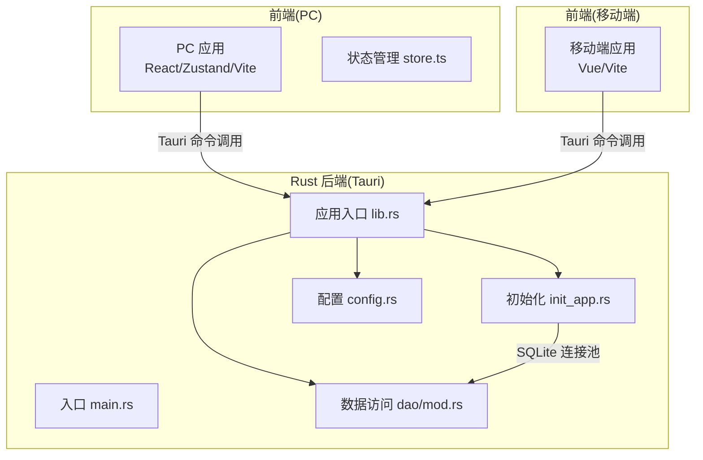
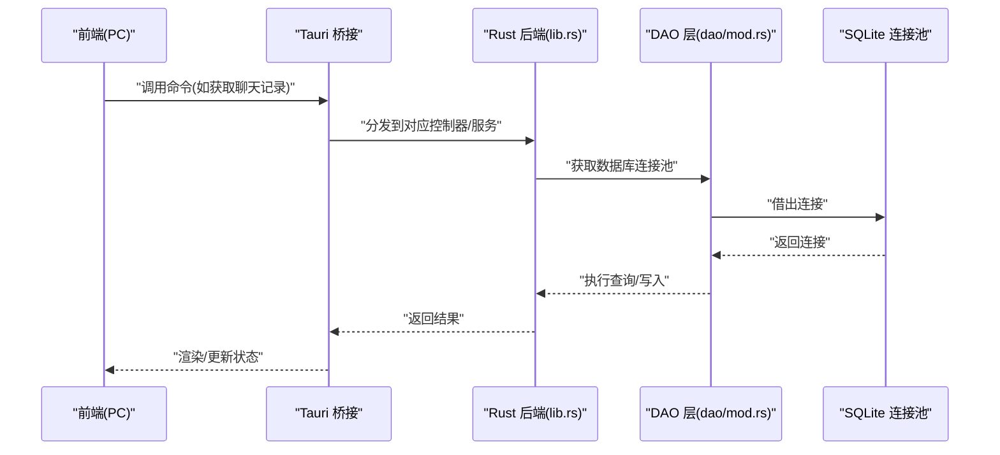
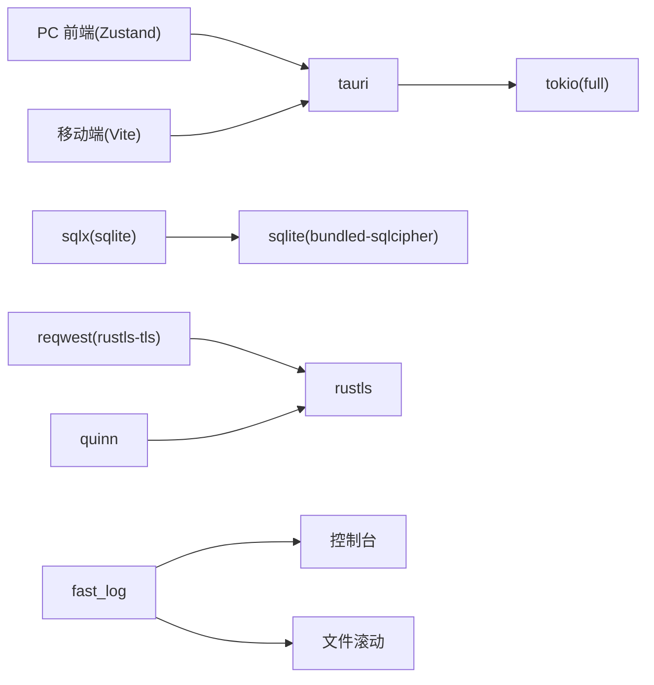

# 性能优化

<cite>
**本文引用的文件**
- [Cargo.toml](file://src-tauri/Cargo.toml)
- [main.rs](file://src-tauri/src/main.rs)
- [lib.rs](file://src-tauri/src/lib.rs)
- [init_app.rs](file://src-tauri/src/init_app.rs)
- [config.rs](file://src-tauri/src/config.rs)
- [dao/mod.rs](file://src-tauri/src/dao/mod.rs)
- [store.ts](file://apps/pc/src/store/store.ts)
- [vite.config.ts](file://apps/mobile/vite.config.ts)
- [package.json](file://apps/pc/package.json)
- [package.json](file://package.json)
</cite>

## 目录
1. [引言](#引言)
2. [项目结构](#项目结构)
3. [核心组件](#核心组件)
4. [架构总览](#架构总览)
5. [详细组件分析](#详细组件分析)
6. [依赖关系分析](#依赖关系分析)
7. [性能考量](#性能考量)
8. [故障排查指南](#故障排查指南)
9. [结论](#结论)
10. [附录](#附录)

## 引言
本文件面向Rust后端与前端全栈性能优化，结合仓库现有实现，给出系统性的优化建议与最佳实践。内容覆盖：
- Rust后端：内存管理、并发处理、算法优化、数据库查询与连接池、网络请求与QUIC/P2P、日志与可观测性
- 前端：组件渲染优化、资源加载优化、状态管理优化
- 缓存策略、性能监控工具使用、瓶颈识别、内存泄漏检测、CPU使用率优化与响应时间改善

## 项目结构
该工程采用多包工作区布局，包含PC端Vue应用、移动端Vue应用、Rust Tauri后端以及共享服务与类型包。Rust后端通过Tauri暴露命令接口给前端调用，数据库采用SQLite并使用连接池，网络层基于QUIC与UDP。

**图示来源**
- [main.rs:1-8](file://src-tauri/src/main.rs#L1-L8)
- [lib.rs:1-167](file://src-tauri/src/lib.rs#L1-L167)
- [init_app.rs:1-186](file://src-tauri/src/init_app.rs#L1-L186)
- [dao/mod.rs:1-39](file://src-tauri/src/dao/mod.rs#L1-L39)
- [config.rs:1-155](file://src-tauri/src/config.rs#L1-L155)

**章节来源**
- [main.rs:1-8](file://src-tauri/src/main.rs#L1-L8)
- [lib.rs:1-167](file://src-tauri/src/lib.rs#L1-L167)
- [init_app.rs:1-186](file://src-tauri/src/init_app.rs#L1-L186)
- [dao/mod.rs:1-39](file://src-tauri/src/dao/mod.rs#L1-L39)
- [config.rs:1-155](file://src-tauri/src/config.rs#L1-L155)
- [store.ts:1-122](file://apps/pc/src/store/store.ts#L1-L122)
- [vite.config.ts:1-31](file://apps/mobile/vite.config.ts#L1-L31)
- [package.json:1-45](file://apps/pc/package.json#L1-L45)
- [package.json:1-30](file://package.json#L1-L30)

## 核心组件
- 后端入口与并发运行时
  - 使用Tokio全功能运行时，主线程以异步主函数启动应用，确保I/O密集型任务高效调度。
  - 关键路径参考：[main.rs:1-8](file://src-tauri/src/main.rs#L1-L8)、[lib.rs:1-167](file://src-tauri/src/lib.rs#L1-L167)
- 全局状态与并发容器
  - 使用Arc+DashMap+RwLock实现高性能并发配置与连接表；全局消息发送互斥锁避免竞态。
  - 关键路径参考：[lib.rs:57-75](file://src-tauri/src/lib.rs#L57-L75)
- 初始化流程
  - 启动时创建日志、资源目录、SQLite目录，初始化公共数据库，复制资源文件，检测IPv6支持。
  - 关键路径参考：[init_app.rs:1-186](file://src-tauri/src/init_app.rs#L1-L186)
- 数据访问层
  - 提供公共/用户/私有数据库连接池获取方法，统一管理SQLX连接池生命周期。
  - 关键路径参考：[dao/mod.rs:1-39](file://src-tauri/src/dao/mod.rs#L1-L39)
- 配置管理
  - 基于DashMap的全局配置读写，支持JSON序列化/反序列化与批量操作。
  - 关键路径参考：[config.rs:1-155](file://src-tauri/src/config.rs#L1-L155)
- 前端状态管理
  - 使用Zustand进行轻量级状态管理，集中维护用户信息、未读计数、视频配置等。
  - 关键路径参考：[store.ts:1-122](file://apps/pc/src/store/store.ts#L1-L122)

**章节来源**
- [main.rs:1-8](file://src-tauri/src/main.rs#L1-L8)
- [lib.rs:57-75](file://src-tauri/src/lib.rs#L57-L75)
- [init_app.rs:1-186](file://src-tauri/src/init_app.rs#L1-L186)
- [dao/mod.rs:1-39](file://src-tauri/src/dao/mod.rs#L1-L39)
- [config.rs:1-155](file://src-tauri/src/config.rs#L1-L155)
- [store.ts:1-122](file://apps/pc/src/store/store.ts#L1-L122)

## 架构总览
后端通过Tauri桥接到前端，前端通过命令调用触发后端业务逻辑。数据库采用SQLite并使用连接池，网络层包含HTTP与QUIC/P2P能力。

**图示来源**
- [lib.rs:117-163](file://src-tauri/src/lib.rs#L117-L163)
- [dao/mod.rs:19-38](file://src-tauri/src/dao/mod.rs#L19-L38)

## 详细组件分析

### Rust 后端：并发与内存管理
- 并发模型
  - 使用Tokio全功能运行时，配合RwLock/DashMap实现高并发读写分离；全局配置与连接表使用Arc包裹，减少锁粒度。
  - 参考：[lib.rs:57-75](file://src-tauri/src/lib.rs#L57-L75)
- 内存管理
  - 避免不必要的克隆，优先使用引用或Arc共享；对大对象（如图像压缩）采用流式处理与零拷贝思路。
  - 参考：图像处理相关模块位于utils/image_utils.rs（路径见utils/mod.rs），建议在处理大图时限制尺寸与通道数。
- 锁竞争与无锁优化
  - 对高频读场景使用RwLock；对全局互斥（消息发送）使用Mutex，尽量缩短持有时间。
  - 参考：[lib.rs:74-75](file://src-tauri/src/lib.rs#L74-L75)

**章节来源**
- [lib.rs:57-75](file://src-tauri/src/lib.rs#L57-L75)

### Rust 后端：数据库与连接池
- 连接池设计
  - 通过全局变量持有SqlitePool，DAO层提供统一获取接口，避免重复创建连接，降低开销。
  - 参考：[dao/mod.rs:19-38](file://src-tauri/src/dao/mod.rs#L19-L38)
- 查询优化建议
  - 为常用查询字段建立索引；避免SELECT *，只取必要列；批量插入使用事务；对分页查询使用LIMIT/OFFSET。
  - 在现有DAO中按需扩展索引与参数化查询。
- 运行时配置
  - Cargo.toml启用release优化与LTO，提升编译期优化与二进制体积控制。
  - 参考：[Cargo.toml:11-15](file://src-tauri/Cargo.toml#L11-L15)

**章节来源**
- [dao/mod.rs:1-39](file://src-tauri/src/dao/mod.rs#L1-L39)
- [Cargo.toml:11-15](file://src-tauri/Cargo.toml#L11-L15)

### Rust 后端：网络与P2P
- QUIC/P2P能力
  - 项目引入quinn与rustls，具备P2P媒体流与文本消息能力；建议在发送路径上启用流控与背压，避免内存暴涨。
  - 参考：[lib.rs:1-22](file://src-tauri/src/lib.rs#L1-L22)
- 网络请求优化
  - 使用reqwest(rustls-tls)进行HTTPS请求，建议复用客户端实例、设置合理的超时与重试策略，并开启压缩。
  - 参考：[Cargo.toml:34-36](file://src-tauri/Cargo.toml#L34-L36)

**章节来源**
- [lib.rs:1-22](file://src-tauri/src/lib.rs#L1-L22)
- [Cargo.toml:34-36](file://src-tauri/Cargo.toml#L34-L36)

### Rust 后端：日志与可观测性
- 日志初始化
  - 使用fast_log进行滚动日志与通道缓冲，便于生产环境问题定位。
  - 参考：[init_app.rs:168-185](file://src-tauri/src/init_app.rs#L168-L185)
- 建议
  - 为关键路径增加结构化日志与采样；区分级别（Trace/Debug/Info/Warn/Error）；在性能敏感路径避免频繁格式化。

**章节来源**
- [init_app.rs:168-185](file://src-tauri/src/init_app.rs#L168-L185)

### 前端：状态管理与渲染优化
- 状态管理
  - 使用Zustand集中管理用户信息、未读计数、视频配置等，避免跨组件重复拉取。
  - 参考：[store.ts:1-122](file://apps/pc/src/store/store.ts#L1-L122)
- 渲染优化
  - 将大型列表虚拟化；对频繁更新的状态使用浅比较；拆分组件边界，减少重渲染。
- 资源加载
  - 图片懒加载与占位符；媒体资源按需加载；静态资源走CDN或内置缓存策略。

**章节来源**
- [store.ts:1-122](file://apps/pc/src/store/store.ts#L1-L122)

### 前端：构建与开发体验
- 构建配置
  - 移动端Vite配置包含别名与CSS预处理器，避免监听无关目录，减少开发时I/O压力。
  - 参考：[vite.config.ts:1-31](file://apps/mobile/vite.config.ts#L1-L31)
- 工作区脚本
  - 顶层package.json提供统一构建与开发脚本，便于并行构建各子包。
  - 参考：[package.json:1-30](file://package.json#L1-L30)

**章节来源**
- [vite.config.ts:1-31](file://apps/mobile/vite.config.ts#L1-L31)
- [package.json:1-30](file://package.json#L1-L30)

## 依赖关系分析
Rust后端依赖关系围绕Tauri、Tokio、SQLX、QUIC与日志展开；前端依赖Zustand与构建工具链。

**图示来源**
- [Cargo.toml:24-62](file://src-tauri/Cargo.toml#L24-L62)
- [lib.rs:1-22](file://src-tauri/src/lib.rs#L1-L22)
- [init_app.rs:168-185](file://src-tauri/src/init_app.rs#L168-L185)

**章节来源**
- [Cargo.toml:24-62](file://src-tauri/Cargo.toml#L24-L62)
- [lib.rs:1-22](file://src-tauri/src/lib.rs#L1-L22)
- [init_app.rs:168-185](file://src-tauri/src/init_app.rs#L168-L185)

## 性能考量

### Rust 后端优化要点
- 编译与链接优化
  - release配置启用opt-level=3、LTO与单codegen-unit，适合桌面端发布；移动端可权衡体积与速度。
  - 参考：[Cargo.toml:11-15](file://src-tauri/Cargo.toml#L11-L15)
- 并发与锁
  - 读多写少场景优先RwLock；全局互斥范围最小化；避免在事件循环中执行阻塞操作。
  - 参考：[lib.rs:57-75](file://src-tauri/src/lib.rs#L57-L75)
- 数据库
  - 连接池复用；查询加索引；批量写入事务化；避免N+1查询。
  - 参考：[dao/mod.rs:19-38](file://src-tauri/src/dao/mod.rs#L19-L38)
- 网络
  - 复用HTTP客户端；设置合理超时；启用压缩；QUIC流控与背压。
  - 参考：[Cargo.toml:34-36](file://src-tauri/Cargo.toml#L34-L36)

### 前端优化要点
- 渲染
  - 列表虚拟化；组件拆分；避免深层不可变更新；使用memo化。
- 状态
  - Zustand按域拆分状态；避免全局状态爆炸；必要时使用选择器。
  - 参考：[store.ts:1-122](file://apps/pc/src/store/store.ts#L1-L122)
- 资源
  - 图片WebP压缩；媒体按需加载；静态资源缓存头与版本化。

### 缓存策略
- 应用层缓存
  - 使用DashMap缓存热点配置与连接元数据；设置TTL或LRU淘汰。
  - 参考：[config.rs:1-155](file://src-tauri/src/config.rs#L1-L155)、[lib.rs:71-72](file://src-tauri/src/lib.rs#L71-L72)
- 前端缓存
  - 浏览器缓存与Service Worker；Zustand持久化插件；图片与媒体本地缓存。

### 性能监控与指标
- 指标建议
  - CPU使用率、内存占用、数据库查询耗时、网络请求延迟、QUIC往返时间、页面渲染帧耗时。
- 工具建议
  - Rust：perf、flamegraph、cargo-flamegraph、tokio-console；前端：浏览器性能面板、React DevTools Profiler。
- 观测性
  - fast_log输出结构化日志；关键路径埋点；采样上报。

### 瓶颈识别技巧
- 后端
  - 使用火焰图定位CPU热点；检查数据库慢查询日志；观察连接池饱和度；QUIC拥塞控制与丢包率。
- 前端
  - 分析长任务与主线程阻塞；测量首屏与交互延迟；关注重排重绘热点区域。

### 内存泄漏检测
- Rust
  - 使用AddressSanitizer/LeakSanitizer；定期检查Arc强引用环；避免闭包捕获长生命周期引用。
- 前端
  - React DevTools检测组件泄漏；Zustand状态清理；定时器与事件监听及时解绑。

### CPU使用率优化
- 后端
  - 减少锁持有时间；批处理I/O；使用非阻塞异步；合理线程数与任务调度。
- 前端
  - 避免高频计算；Web Workers；节流与防抖；虚拟化与懒执行。

### 响应时间改善
- 后端
  - 连接池预热；查询索引优化；缓存热点数据；异步处理非关键路径。
- 前端
  - 预加载与骨架屏；增量渲染；CDN与缓存策略；减少重定向与大资源。

## 故障排查指南
- 初始化失败
  - 检查日志目录创建与权限；确认SQLite目录存在；核对资源复制流程。
  - 参考：[init_app.rs:31-72](file://src-tauri/src/init_app.rs#L31-L72)
- 数据库连接异常
  - 核查连接池初始化顺序；确认数据库文件可写；检查索引与SQL语法。
  - 参考：[dao/mod.rs:19-38](file://src-tauri/src/dao/mod.rs#L19-L38)
- IPv6不支持
  - 记录警告日志并降级到IPv4；在P2P路径中提供备用方案。
  - 参考：[init_app.rs:82-88](file://src-tauri/src/init_app.rs#L82-L88)
- 前端状态异常
  - 检查Zustand状态更新是否幂等；避免意外替换整个对象；使用调试工具追踪动作。
  - 参考：[store.ts:1-122](file://apps/pc/src/store/store.ts#L1-L122)

**章节来源**
- [init_app.rs:31-90](file://src-tauri/src/init_app.rs#L31-L90)
- [dao/mod.rs:19-38](file://src-tauri/src/dao/mod.rs#L19-L38)
- [store.ts:1-122](file://apps/pc/src/store/store.ts#L1-L122)

## 结论
本项目在并发、数据库与网络方面已有良好基础。建议在以下方向持续优化：完善数据库索引与查询计划、加强QUIC流控与背压、前端虚拟化与状态域拆分、引入结构化日志与采样观测、建立性能基线与回归测试。通过系统化的优化与监控，可显著提升CPU使用效率、内存占用与响应时间表现。

## 附录
- 快速检查清单
  - 后端：启用release优化、连接池预热、索引补齐、日志分级、网络超时配置
  - 前端：组件虚拟化、状态域拆分、资源缓存、骨架屏与懒加载
  - 监控：关键指标采集、火焰图与慢查询分析、用户路径埋点