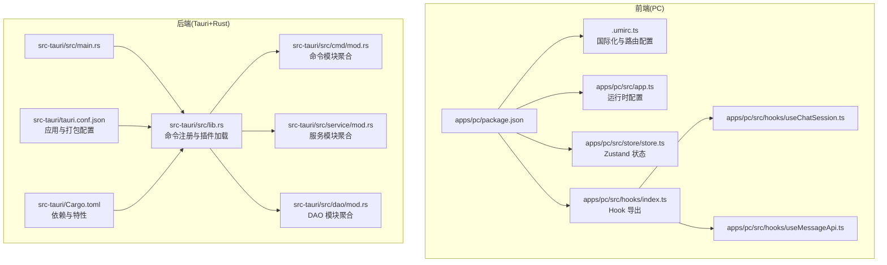
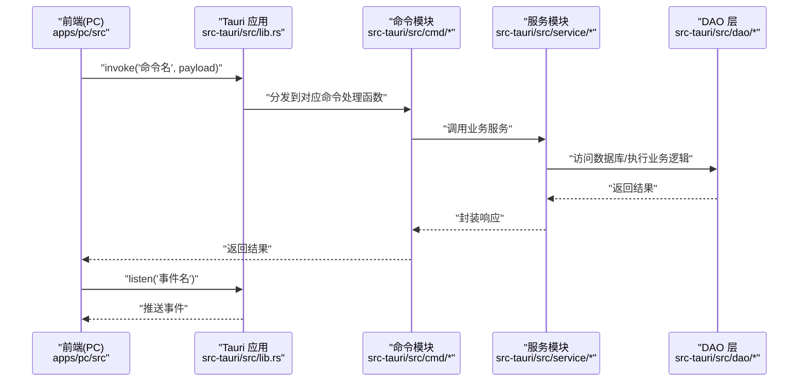
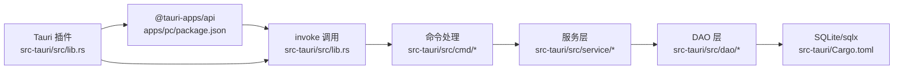

# 扩展开发

<cite>
**本文引用的文件**
- [Cargo.toml](file://src-tauri/Cargo.toml)
- [package.json](file://package.json)
- [apps/pc/package.json](file://apps/pc/package.json)
- [src-tauri/tauri.conf.json](file://src-tauri/tauri.conf.json)
- [apps/pc/.umirc.ts](file://apps/pc/.umirc.ts)
- [src-tauri/src/main.rs](file://src-tauri/src/main.rs)
- [src-tauri/src/lib.rs](file://src-tauri/src/lib.rs)
- [src-tauri/src/cmd/mod.rs](file://src-tauri/src/cmd/mod.rs)
- [src-tauri/src/service/mod.rs](file://src-tauri/src/service/mod.rs)
- [src-tauri/src/dao/mod.rs](file://src-tauri/src/dao/mod.rs)
- [apps/pc/src/app.ts](file://apps/pc/src/app.ts)
- [apps/pc/src/store/store.ts](file://apps/pc/src/store/store.ts)
- [apps/pc/src/hooks/index.ts](file://apps/pc/src/hooks/index.ts)
- [apps/pc/src/hooks/useChatSession.ts](file://apps/pc/src/hooks/useChatSession.ts)
- [apps/pc/src/hooks/useMessageApi.ts](file://apps/pc/src/hooks/useMessageApi.ts)
</cite>

## 目录

1. [简介](#简介)
2. [项目结构](#项目结构)
3. [核心组件](#核心组件)
4. [架构总览](#架构总览)
5. [详细组件分析](#详细组件分析)
6. [依赖分析](#依赖分析)
7. [性能考虑](#性能考虑)
8. [故障排查指南](#故障排查指南)
9. [结论](#结论)
10. [附录](#附录)

## 简介

本文件面向希望扩展与定制本项目的开发者，系统讲解以下扩展方向与最佳实践：

- Tauri 命令扩展开发：如何新增后端命令、注册到前端调用层。
- 服务模块扩展：如何在现有服务层之上增加业务服务、保持线程安全与并发控制。
- UI 组件扩展：如何在 PC 端基于现有组件体系进行二次开发与复用。
- 插件开发模式与第三方集成：如何引入并配置 Tauri 插件与前端依赖。
- API 扩展策略：前后端命令映射、事件监听与状态管理的协同。
- 自定义 Hook 开发：如何基于现有 Hook 模式扩展新的事件监听与状态更新。
- 业务服务扩展与数据模型扩展：DAO 层、实体与 VO 的扩展方式。
- 配置扩展、主题定制与国际化扩展：如何在现有配置基础上进行扩展。

## 项目结构

该项目采用多包工作区结构，前端使用 Umi Max（PC 端）与 Vue 移动端，后端使用 Tauri + Rust，数据库采用 SQLite 并通过 sqlx 访问。整体结构如下：

图表来源

- [apps/pc/package.json:1-45](file://apps/pc/package.json#L1-L45)
- [apps/pc/.umirc.ts:1-22](file://apps/pc/.umirc.ts#L1-L22)
- [apps/pc/src/app.ts:1-23](file://apps/pc/src/app.ts#L1-L23)
- [apps/pc/src/store/store.ts:1-122](file://apps/pc/src/store/store.ts#L1-L122)
- [apps/pc/src/hooks/index.ts:1-6](file://apps/pc/src/hooks/index.ts#L1-L6)
- [apps/pc/src/hooks/useChatSession.ts:1-49](file://apps/pc/src/hooks/useChatSession.ts#L1-L49)
- [apps/pc/src/hooks/useMessageApi.ts:1-45](file://apps/pc/src/hooks/useMessageApi.ts#L1-L45)
- [src-tauri/src/main.rs:1-8](file://src-tauri/src/main.rs#L1-L8)
- [src-tauri/src/lib.rs:1-167](file://src-tauri/src/lib.rs#L1-L167)
- [src-tauri/src/cmd/mod.rs:1-10](file://src-tauri/src/cmd/mod.rs#L1-L10)
- [src-tauri/src/service/mod.rs:1-7](file://src-tauri/src/service/mod.rs#L1-L7)
- [src-tauri/src/dao/mod.rs:1-39](file://src-tauri/src/dao/mod.rs#L1-L39)
- [src-tauri/tauri.conf.json:1-58](file://src-tauri/tauri.conf.json#L1-L58)
- [src-tauri/Cargo.toml:1-62](file://src-tauri/Cargo.toml#L1-L62)

章节来源

- [package.json:1-30](file://package.json#L1-L30)
- [apps/pc/package.json:1-45](file://apps/pc/package.json#L1-L45)
- [src-tauri/Cargo.toml:1-62](file://src-tauri/Cargo.toml#L1-L62)
- [src-tauri/tauri.conf.json:1-58](file://src-tauri/tauri.conf.json#L1-L58)
- [apps/pc/.umirc.ts:1-22](file://apps/pc/.umirc.ts#L1-L22)

## 核心组件

- 后端入口与命令注册

  - 后端入口通过主程序启动应用，统一在库模块中注册所有命令与插件，便于扩展新的命令与服务。
  - 关键路径参考：[src-tauri/src/main.rs:1-8](file://src-tauri/src/main.rs#L1-L8)，[src-tauri/src/lib.rs:1-167](file://src-tauri/src/lib.rs#L1-L167)

- 前端运行时配置与国际化

  - PC 端通过运行时配置导出路由变更钩子与全局初始化数据，支持国际化与本地化。
  - 关键路径参考：[apps/pc/src/app.ts:1-23](file://apps/pc/src/app.ts#L1-L23)，[apps/pc/.umirc.ts:1-22](file://apps/pc/.umirc.ts#L1-L22)

- 状态管理与 Hook
  - 使用 Zustand 管理用户、媒体配置、未读计数等状态；通过自定义 Hook 封装事件监听与状态更新。
  - 关键路径参考：[apps/pc/src/store/store.ts:1-122](file://apps/pc/src/store/store.ts#L1-L122)，[apps/pc/src/hooks/index.ts:1-6](file://apps/pc/src/hooks/index.ts#L1-L6)，[apps/pc/src/hooks/useChatSession.ts:1-49](file://apps/pc/src/hooks/useChatSession.ts#L1-L49)，[apps/pc/src/hooks/useMessageApi.ts:1-45](file://apps/pc/src/hooks/useMessageApi.ts#L1-L45)

章节来源

- [src-tauri/src/main.rs:1-8](file://src-tauri/src/main.rs#L1-L8)
- [src-tauri/src/lib.rs:1-167](file://src-tauri/src/lib.rs#L1-L167)
- [apps/pc/src/app.ts:1-23](file://apps/pc/src/app.ts#L1-L23)
- [apps/pc/.umirc.ts:1-22](file://apps/pc/.umirc.ts#L1-L22)
- [apps/pc/src/store/store.ts:1-122](file://apps/pc/src/store/store.ts#L1-L122)
- [apps/pc/src/hooks/index.ts:1-6](file://apps/pc/src/hooks/index.ts#L1-L6)
- [apps/pc/src/hooks/useChatSession.ts:1-49](file://apps/pc/src/hooks/useChatSession.ts#L1-L49)
- [apps/pc/src/hooks/useMessageApi.ts:1-45](file://apps/pc/src/hooks/useMessageApi.ts#L1-L45)

## 架构总览

下图展示了前端与后端的交互关系，以及命令注册、事件监听与状态管理的关键流程。

图表来源

- [src-tauri/src/lib.rs:117-163](file://src-tauri/src/lib.rs#L117-L163)
- [src-tauri/src/cmd/mod.rs:1-10](file://src-tauri/src/cmd/mod.rs#L1-L10)
- [src-tauri/src/service/mod.rs:1-7](file://src-tauri/src/service/mod.rs#L1-L7)
- [src-tauri/src/dao/mod.rs:1-39](file://src-tauri/src/dao/mod.rs#L1-L39)

## 详细组件分析

### Tauri 命令扩展开发

- 扩展步骤

  1. 在命令模块中新增命令处理函数（Rust），参考现有命令组织方式。
     - 参考路径：[src-tauri/src/cmd/mod.rs:1-10](file://src-tauri/src/cmd/mod.rs#L1-L10)
  2. 在命令注册处将新命令加入 invoke_handler 列表。
     - 参考路径：[src-tauri/src/lib.rs:117-163](file://src-tauri/src/lib.rs#L117-L163)
  3. 在前端通过 Tauri 的 invoke 接口调用新命令。
     - 参考路径：[apps/pc/package.json:18-31](file://apps/pc/package.json#L18-L31)

- 数据流与并发

  - 命令处理函数通常会调用服务层，服务层再访问 DAO 层；全局池与锁保证并发安全。
  - 参考路径：[src-tauri/src/dao/mod.rs:18-38](file://src-tauri/src/dao/mod.rs#L18-L38)

- 最佳实践
  - 命令参数与返回值尽量使用结构化数据（如 JSON），并在 DTO/VO 中定义。
  - 对于耗时操作，使用异步任务与锁保护共享资源。
  - 对外暴露的命令命名规范统一，避免冲突。

章节来源

- [src-tauri/src/cmd/mod.rs:1-10](file://src-tauri/src/cmd/mod.rs#L1-L10)
- [src-tauri/src/lib.rs:117-163](file://src-tauri/src/lib.rs#L117-L163)
- [apps/pc/package.json:18-31](file://apps/pc/package.json#L18-L31)
- [src-tauri/src/dao/mod.rs:18-38](file://src-tauri/src/dao/mod.rs#L18-L38)

### 服务模块扩展

- 扩展步骤

  1. 在服务模块中新增业务服务函数，遵循现有服务接口风格。
     - 参考路径：[src-tauri/src/service/mod.rs:1-7](file://src-tauri/src/service/mod.rs#L1-L7)
  2. 在命令处理函数中调用新增的服务函数。
  3. 如需访问数据库，通过 DAO 层提供的连接池获取客户端。
     - 参考路径：[src-tauri/src/dao/mod.rs:18-38](file://src-tauri/src/dao/mod.rs#L18-L38)

- 并发与线程安全

  - 使用全局池与读写锁管理数据库连接与共享状态。
  - 参考路径：[src-tauri/src/lib.rs:61-75](file://src-tauri/src/lib.rs#L61-L75)

- 最佳实践
  - 服务函数应尽量无副作用，输入输出清晰，便于测试与复用。
  - 对外部依赖（网络、文件系统）进行超时与重试策略设计。

章节来源

- [src-tauri/src/service/mod.rs:1-7](file://src-tauri/src/service/mod.rs#L1-L7)
- [src-tauri/src/dao/mod.rs:18-38](file://src-tauri/src/dao/mod.rs#L18-L38)
- [src-tauri/src/lib.rs:61-75](file://src-tauri/src/lib.rs#L61-L75)

### UI 组件扩展

- 扩展步骤

  1. 在现有组件目录下新增组件或在 hooks 中新增 Hook，遵循现有命名与样式约定。
     - 参考路径：[apps/pc/src/hooks/index.ts:1-6](file://apps/pc/src/hooks/index.ts#L1-L6)
  2. 在页面中使用新组件或 Hook，结合 Zustand 状态进行数据驱动。
     - 参考路径：[apps/pc/src/store/store.ts:1-122](file://apps/pc/src/store/store.ts#L1-L122)

- 事件监听与状态联动

  - 使用自定义 Hook 封装事件监听与状态更新，保持组件解耦。
    - 参考路径：[apps/pc/src/hooks/useChatSession.ts:1-49](file://apps/pc/src/hooks/useChatSession.ts#L1-L49)，[apps/pc/src/hooks/useMessageApi.ts:1-45](file://apps/pc/src/hooks/useMessageApi.ts#L1-L45)

- 最佳实践
  - 组件职责单一，通过 props 传参与事件回调通信。
  - 样式与主题分离，便于主题切换与定制。

章节来源

- [apps/pc/src/hooks/index.ts:1-6](file://apps/pc/src/hooks/index.ts#L1-L6)
- [apps/pc/src/store/store.ts:1-122](file://apps/pc/src/store/store.ts#L1-L122)
- [apps/pc/src/hooks/useChatSession.ts:1-49](file://apps/pc/src/hooks/useChatSession.ts#L1-L49)
- [apps/pc/src/hooks/useMessageApi.ts:1-45](file://apps/pc/src/hooks/useMessageApi.ts#L1-L45)

### 插件开发模式与第三方集成

- Tauri 插件

  - 已集成 dialog、fs、opener 等插件，可在应用启动时加载。
  - 参考路径：[src-tauri/src/lib.rs:91-116](file://src-tauri/src/lib.rs#L91-L116)，[src-tauri/Cargo.toml:24-62](file://src-tauri/Cargo.toml#L24-L62)

- 前端依赖

  - 前端通过包管理器引入 UI 组件库与 Tauri API，统一在 PC 端包配置中管理。
  - 参考路径：[apps/pc/package.json:18-31](file://apps/pc/package.json#L18-L31)

- 最佳实践
  - 插件版本与 Tauri 主版本保持兼容。
  - 第三方库尽量通过包管理器集中管理，避免重复与版本冲突。

章节来源

- [src-tauri/src/lib.rs:91-116](file://src-tauri/src/lib.rs#L91-L116)
- [src-tauri/Cargo.toml:24-62](file://src-tauri/Cargo.toml#L24-L62)
- [apps/pc/package.json:18-31](file://apps/pc/package.json#L18-L31)

### API 扩展策略

- 命令与事件

  - 前端通过 invoke 调用后端命令，后端通过事件向前端推送消息。
  - 参考路径：[src-tauri/src/lib.rs:117-163](file://src-tauri/src/lib.rs#L117-L163)，[apps/pc/src/hooks/useMessageApi.ts:1-45](file://apps/pc/src/hooks/useMessageApi.ts#L1-L45)

- 状态同步

  - 通过 Zustand 管理全局状态，组件通过 Hook 订阅状态变化。
  - 参考路径：[apps/pc/src/store/store.ts:1-122](file://apps/pc/src/store/store.ts#L1-L122)

- 最佳实践
  - 命令与事件命名语义明确，避免歧义。
  - 对事件负载进行结构化定义，便于前端消费。

章节来源

- [src-tauri/src/lib.rs:117-163](file://src-tauri/src/lib.rs#L117-L163)
- [apps/pc/src/hooks/useMessageApi.ts:1-45](file://apps/pc/src/hooks/useMessageApi.ts#L1-L45)
- [apps/pc/src/store/store.ts:1-122](file://apps/pc/src/store/store.ts#L1-L122)

### 自定义 Hook 开发指南

- 设计原则

  - 将事件监听、状态更新与副作用封装在 Hook 内部，对外仅暴露必要的状态与方法。
  - 参考路径：[apps/pc/src/hooks/useChatSession.ts:1-49](file://apps/pc/src/hooks/useChatSession.ts#L1-L49)，[apps/pc/src/hooks/useMessageApi.ts:1-45](file://apps/pc/src/hooks/useMessageApi.ts#L1-L45)

- 生命周期管理

  - 在组件卸载时取消事件监听，防止内存泄漏。
  - 参考路径：[apps/pc/src/hooks/useChatSession.ts:40-43](file://apps/pc/src/hooks/useChatSession.ts#L40-L43)，[apps/pc/src/hooks/useMessageApi.ts:36-38](file://apps/pc/src/hooks/useMessageApi.ts#L36-L38)

- 复用与组合
  - Hook 可以组合使用，形成更复杂的业务能力。
  - 参考路径：[apps/pc/src/hooks/index.ts:1-6](file://apps/pc/src/hooks/index.ts#L1-L6)

章节来源

- [apps/pc/src/hooks/useChatSession.ts:1-49](file://apps/pc/src/hooks/useChatSession.ts#L1-L49)
- [apps/pc/src/hooks/useMessageApi.ts:1-45](file://apps/pc/src/hooks/useMessageApi.ts#L1-L45)
- [apps/pc/src/hooks/index.ts:1-6](file://apps/pc/src/hooks/index.ts#L1-L6)

### 业务服务扩展与数据模型扩展

- 业务服务扩展

  - 新增服务函数时，遵循现有服务模块组织方式，保持接口一致。
  - 参考路径：[src-tauri/src/service/mod.rs:1-7](file://src-tauri/src/service/mod.rs#L1-L7)

- 数据模型扩展

  - 实体与 VO 定义在对应的模块中，新增字段时注意前后端一致性。
  - 参考路径：[src-tauri/src/dao/mod.rs:1-39](file://src-tauri/src/dao/mod.rs#L1-L39)

- 数据访问层
  - 通过 DAO 提供的连接池访问数据库，注意并发与事务。
  - 参考路径：[src-tauri/src/dao/mod.rs:18-38](file://src-tauri/src/dao/mod.rs#L18-L38)

章节来源

- [src-tauri/src/service/mod.rs:1-7](file://src-tauri/src/service/mod.rs#L1-L7)
- [src-tauri/src/dao/mod.rs:1-39](file://src-tauri/src/dao/mod.rs#L1-L39)

### 配置扩展、主题定制与国际化扩展

- 应用与打包配置

  - 通过 Tauri 配置文件设置窗口、安全策略与打包选项。
  - 参考路径：[src-tauri/tauri.conf.json:1-58](file://src-tauri/tauri.conf.json#L1-L58)

- 国际化

  - 前端通过运行时配置启用多语言与本地化。
  - 参考路径：[apps/pc/.umirc.ts:11-17](file://apps/pc/.umirc.ts#L11-L17)

- 主题定制

  - 主题文件位于主题目录，可通过替换 JSON 文件实现主题切换。
  - 参考路径：[apps/pc/src/theme/dark.json](file://apps/pc/src/theme/dark.json)，[apps/pc/src/theme/light.json](file://apps/pc/src/theme/light.json)

- 最佳实践
  - 配置项集中管理，避免硬编码。
  - 主题与国际化配置与 UI 组件解耦，便于维护。

章节来源

- [src-tauri/tauri.conf.json:1-58](file://src-tauri/tauri.conf.json#L1-L58)
- [apps/pc/.umirc.ts:11-17](file://apps/pc/.umirc.ts#L11-L17)

## 依赖分析

- 前后端依赖关系

  - 前端通过 @tauri-apps/api 与后端命令交互；后端通过 tauri 与前端桥接。
  - 参考路径：[apps/pc/package.json:18-31](file://apps/pc/package.json#L18-L31)，[src-tauri/Cargo.toml:24-62](file://src-tauri/Cargo.toml#L24-L62)

- 数据库与并发
  - 使用 sqlx 与 sqlite，配合全局连接池与读写锁保证并发安全。
  - 参考路径：[src-tauri/Cargo.toml:46-48](file://src-tauri/Cargo.toml#L46-L48)，[src-tauri/src/lib.rs:61-75](file://src-tauri/src/lib.rs#L61-L75)

图表来源

- [apps/pc/package.json:18-31](file://apps/pc/package.json#L18-L31)
- [src-tauri/src/lib.rs:91-116](file://src-tauri/src/lib.rs#L91-L116)
- [src-tauri/src/cmd/mod.rs:1-10](file://src-tauri/src/cmd/mod.rs#L1-L10)
- [src-tauri/src/service/mod.rs:1-7](file://src-tauri/src/service/mod.rs#L1-L7)
- [src-tauri/src/dao/mod.rs:1-39](file://src-tauri/src/dao/mod.rs#L1-L39)
- [src-tauri/Cargo.toml:46-48](file://src-tauri/Cargo.toml#L46-L48)

章节来源

- [apps/pc/package.json:18-31](file://apps/pc/package.json#L18-L31)
- [src-tauri/src/lib.rs:91-116](file://src-tauri/src/lib.rs#L91-L116)
- [src-tauri/src/dao/mod.rs:1-39](file://src-tauri/src/dao/mod.rs#L1-L39)
- [src-tauri/Cargo.toml:46-48](file://src-tauri/Cargo.toml#L46-L48)

## 性能考虑

- 异步与并发

  - 使用 tokio 运行时与读写锁管理共享状态，避免阻塞主线程。
  - 参考路径：[src-tauri/src/lib.rs:61-75](file://src-tauri/src/lib.rs#L61-L75)，[src-tauri/Cargo.toml](file://src-tauri/Cargo.toml#L39)

- 数据库访问

  - 通过连接池复用数据库连接，减少开销；对热点查询建立索引。
  - 参考路径：[src-tauri/src/dao/mod.rs:18-38](file://src-tauri/src/dao/mod.rs#L18-L38)

- 前端渲染
  - 使用轻量状态管理与事件监听，避免不必要的重渲染。
  - 参考路径：[apps/pc/src/store/store.ts:1-122](file://apps/pc/src/store/store.ts#L1-L122)

## 故障排查指南

- 命令未生效

  - 检查命令是否已注册到 invoke_handler。
  - 参考路径：[src-tauri/src/lib.rs:117-163](file://src-tauri/src/lib.rs#L117-L163)

- 事件未触发

  - 检查事件名称与监听逻辑，确认组件卸载时正确取消监听。
  - 参考路径：[apps/pc/src/hooks/useMessageApi.ts:36-38](file://apps/pc/src/hooks/useMessageApi.ts#L36-L38)

- 数据库连接失败
  - 检查全局连接池初始化与错误处理。
  - 参考路径：[src-tauri/src/dao/mod.rs:18-38](file://src-tauri/src/dao/mod.rs#L18-L38)

章节来源

- [src-tauri/src/lib.rs:117-163](file://src-tauri/src/lib.rs#L117-L163)
- [apps/pc/src/hooks/useMessageApi.ts:36-38](file://apps/pc/src/hooks/useMessageApi.ts#L36-L38)
- [src-tauri/src/dao/mod.rs:18-38](file://src-tauri/src/dao/mod.rs#L18-L38)

## 结论

本项目提供了清晰的前后端分层与扩展点，开发者可按以下流程进行扩展：

- 后端：新增命令 → 注册命令 → 编写服务与 DAO → 测试与验证
- 前端：新增 Hook/组件 → 状态管理 → 事件监听 → UI 集成
- 配置：在 Tauri 与 Umi 配置中统一管理
- 主题与国际化：通过主题 JSON 与运行时配置扩展
  遵循上述流程与最佳实践，可确保扩展的兼容性与可维护性。

## 附录

- 开发流程建议

  - 新功能开发流程
    1. 需求分析与接口设计（DTO/VO）
    2. 后端命令与服务实现
    3. 前端 Hook/组件与状态管理
    4. 事件监听与 UI 集成
    5. 配置与主题国际化扩展
    6. 单元测试与集成测试
    7. 文档与回归测试

- 参考路径汇总
  - 命令注册与插件加载：[src-tauri/src/lib.rs:91-116](file://src-tauri/src/lib.rs#L91-L116)
  - 命令模块聚合：[src-tauri/src/cmd/mod.rs:1-10](file://src-tauri/src/cmd/mod.rs#L1-L10)
  - 服务模块聚合：[src-tauri/src/service/mod.rs:1-7](file://src-tauri/src/service/mod.rs#L1-L7)
  - DAO 层与连接池：[src-tauri/src/dao/mod.rs:1-39](file://src-tauri/src/dao/mod.rs#L1-L39)
  - 前端运行时配置：[apps/pc/.umirc.ts:1-22](file://apps/pc/.umirc.ts#L1-L22)
  - 前端状态管理：[apps/pc/src/store/store.ts:1-122](file://apps/pc/src/store/store.ts#L1-L122)
  - 前端 Hook：[apps/pc/src/hooks/index.ts:1-6](file://apps/pc/src/hooks/index.ts#L1-L6)，[apps/pc/src/hooks/useChatSession.ts:1-49](file://apps/pc/src/hooks/useChatSession.ts#L1-L49)，[apps/pc/src/hooks/useMessageApi.ts:1-45](file://apps/pc/src/hooks/useMessageApi.ts#L1-L45)
  - 应用配置：[src-tauri/tauri.conf.json:1-58](file://src-tauri/tauri.conf.json#L1-L58)
  - 依赖与特性：[src-tauri/Cargo.toml:24-62](file://src-tauri/Cargo.toml#L24-L62)
