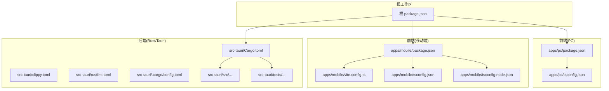
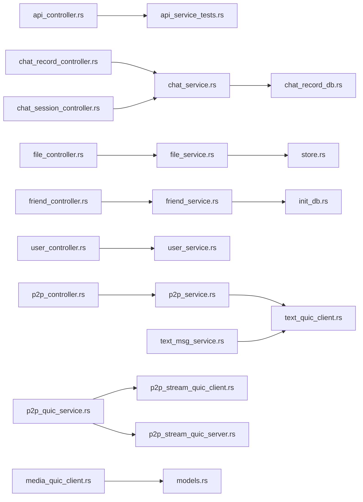
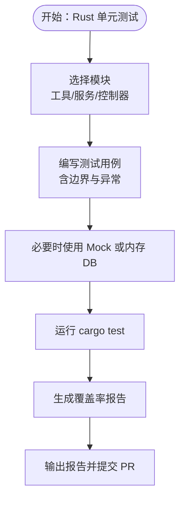
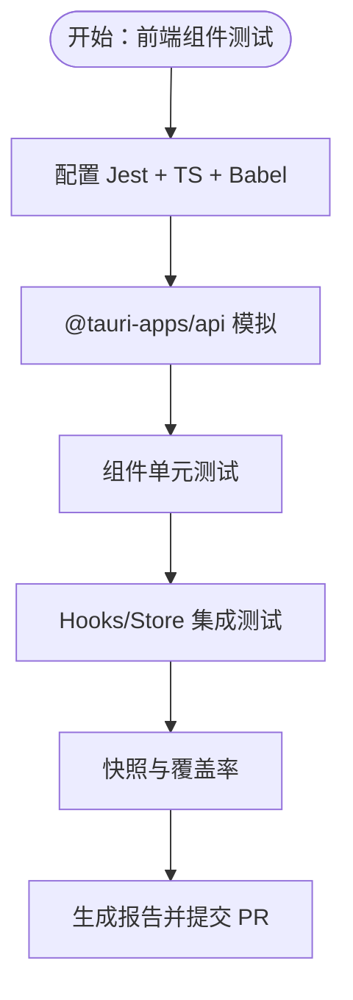
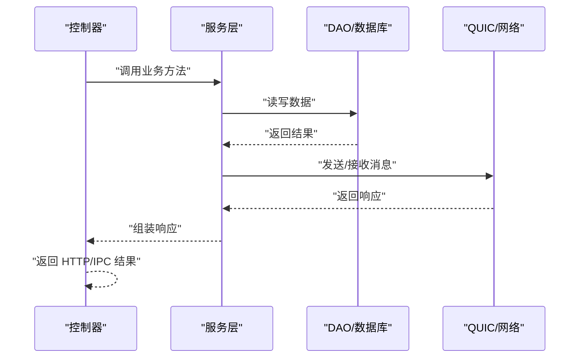
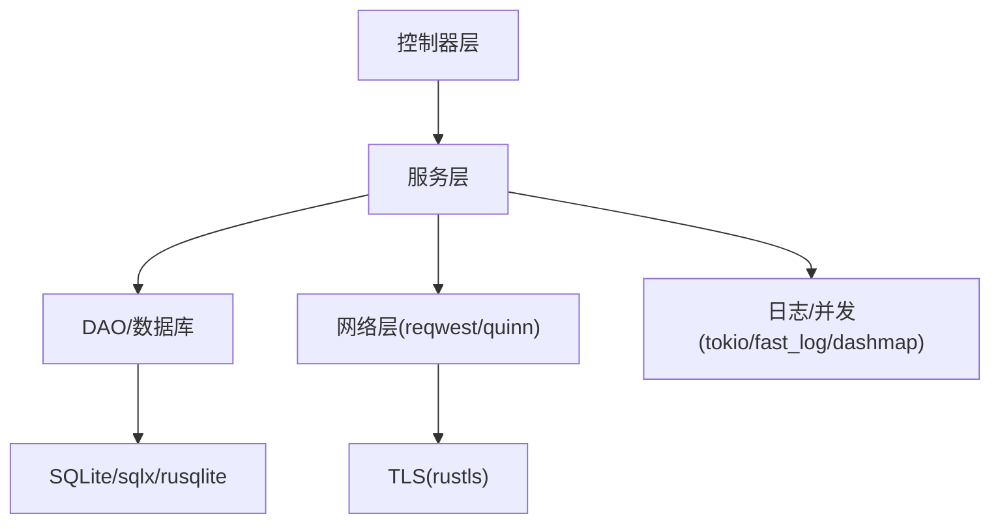

# 测试策略

<cite>
**本文引用的文件**
- [Cargo.toml](file://src-tauri/Cargo.toml)
- [clippy.toml](file://src-tauri/clippy.toml)
- [rustfmt.toml](file://src-tauri/rustfmt.toml)
- [.cargo/config.toml](file://src-tauri/.cargo/config.toml)
- [package.json（PC 应用）](file://apps/pc/package.json)
- [package.json（移动端应用）](file://apps/mobile/package.json)
- [package.json（根工作区）](file://package.json)
- [vite.config.ts（移动端）](file://apps/mobile/vite.config.ts)
- [tsconfig.json（移动端）](file://apps/mobile/tsconfig.json)
- [tsconfig.node.json（移动端）](file://apps/mobile/tsconfig.node.json)
- [api_controller.rs](file://src-tauri/src/cmd/api_controller.rs)
- [chat_record_controller.rs](file://src-tauri/src/cmd/chat_record_controller.rs)
- [chat_session_controller.rs](file://src-tauri/src/cmd/chat_session_controller.rs)
- [file_controller.rs](file://src-tauri/src/cmd/file_controller.rs)
- [friend_controller.rs](file://src-tauri/src/cmd/friend_controller.rs)
- [user_controller.rs](file://src-tauri/src/cmd/user_controller.rs)
- [p2p_controller.rs](file://src-tauri/src/cmd/p2p_controller.rs)
- [notification_controller.rs](file://src-tauri/src/cmd/notification_controller.rs)
- [chat_service.rs](file://src-tauri/src/service/chat_service.rs)
- [file_service.rs](file://src-tauri/src/service/file_service.rs)
- [friend_service.rs](file://src-tauri/src/service/friend_service.rs)
- [p2p_service.rs](file://src-tauri/src/service/p2p_service.rs)
- [user_service.rs](file://src-tauri/src/service/user_service.rs)
- [chat_record_db.rs](file://src-tauri/src/dao/chat_record_db.rs)
- [init_db.rs](file://src-tauri/src/dao/init_db.rs)
- [create_table.rs](file://src-tauri/src/dao/create_table.rs)
- [store.rs](file://src-tauri/src/dao/store.rs)
- [text_msg_service.rs](file://src-tauri/src/quic_service/center_service/text_msg_service.rs)
- [text_quic_client.rs](file://src-tauri/src/quic_service/center_service/text_quic_client.rs)
- [p2p_quic_service.rs](file://src-tauri/src/quic_service/p2p_service/p2p_quic_service.rs)
- [p2p_stream_quic_client.rs](file://src-tauri/src/quic_service/p2p_service/p2p_stream_quic_client.rs)
- [p2p_stream_quic_server.rs](file://src-tauri/src/quic_service/p2p_service/p2p_stream_quic_server.rs)
- [media_quic_client.rs](file://src-tauri/src/quic_service/center_service/media_quic_client.rs)
- [models.rs](file://src-tauri/src/quic_service/models.rs)
- [safe_configuration.rs](file://src-tauri/src/quic_service/safe_configuration.rs)
- [dangerous_configuration.rs](file://src-tauri/src/quic_service/dangerous_configuration.rs)
- [image_utils_tests.rs](file://src-tauri/tests/image_utils_tests.rs)
- [image_utils_real_tests.rs](file://src-tauri/tests/image_utils_real_tests.rs)
- [dns_utils_tests.rs](file://src-tauri/tests/dns_utils_tests.rs)
- [api_service_tests.rs](file://src-tauri/tests/api_service_tests.rs)
</cite>

## 目录
1. [引言](#引言)
2. [项目结构](#项目结构)
3. [核心组件](#核心组件)
4. [架构总览](#架构总览)
5. [详细组件分析](#详细组件分析)
6. [依赖分析](#依赖分析)
7. [性能考虑](#性能考虑)
8. [故障排查指南](#故障排查指南)
9. [结论](#结论)
10. [附录](#附录)

## 引言
本测试策略文档旨在为 Rust-Tauri-Umi 即时通讯应用建立一套完整、可落地的测试体系与实践指导。文档覆盖单元测试（Rust 与前端组件）、集成测试、端到端测试配置，并明确测试覆盖率目标、测试数据准备与 Mock 策略；同时给出测试工具配置建议（Rust 测试框架、Jest 配置、Cypress 配置）以及在 CI/CD 中的测试执行流程；最后补充性能测试、压力测试与安全测试要点，并提供各层级测试的最佳实践与示例路径。

## 项目结构
该仓库采用多包工作区结构，包含：
- 根工作区：统一脚本与依赖管理
- PC 应用（React + Ant Design + Umi Max）
- 移动端应用（Vue3 + Vant + Vite）
- Rust/Tauri 后端（服务层、DAO 层、QUIC 信令与媒体传输）

图示来源
- [package.json（根工作区）:1-30](file://package.json#L1-L30)
- [package.json（PC 应用）:1-45](file://apps/pc/package.json#L1-L45)
- [package.json（移动端应用）:1-37](file://apps/mobile/package.json#L1-L37)
- [vite.config.ts（移动端）:1-31](file://apps/mobile/vite.config.ts#L1-L31)
- [tsconfig.json（移动端）:1-27](file://apps/mobile/tsconfig.json#L1-L27)
- [tsconfig.node.json（移动端）:1-10](file://apps/mobile/tsconfig.node.json#L1-L10)
- [Cargo.toml:1-62](file://src-tauri/Cargo.toml#L1-L62)
- [clippy.toml:1-4](file://src-tauri/clippy.toml#L1-L4)
- [rustfmt.toml:1-27](file://src-tauri/rustfmt.toml#L1-L27)
- [.cargo/config.toml:1-12](file://src-tauri/.cargo/config.toml#L1-L12)

章节来源
- [package.json（根工作区）:1-30](file://package.json#L1-L30)
- [package.json（PC 应用）:1-45](file://apps/pc/package.json#L1-L45)
- [package.json（移动端应用）:1-37](file://apps/mobile/package.json#L1-L37)
- [vite.config.ts（移动端）:1-31](file://apps/mobile/vite.config.ts#L1-L31)
- [tsconfig.json（移动端）:1-27](file://apps/mobile/tsconfig.json#L1-L27)
- [tsconfig.node.json（移动端）:1-10](file://apps/mobile/tsconfig.node.json#L1-L10)
- [Cargo.toml:1-62](file://src-tauri/Cargo.toml#L1-L62)
- [clippy.toml:1-4](file://src-tauri/clippy.toml#L1-L4)
- [rustfmt.toml:1-27](file://src-tauri/rustfmt.toml#L1-L27)
- [.cargo/config.toml:1-12](file://src-tauri/.cargo/config.toml#L1-L12)

## 核心组件
- 控制器层（Controllers）：负责 HTTP/IPC 请求入口与参数校验，如聊天记录、会话、好友、文件、用户、P2P、通知等控制器。
- 服务层（Services）：封装业务逻辑，调用 DAO 与外部依赖，如聊天服务、文件服务、好友服务、P2P 服务、用户服务。
- 数据访问层（DAO/DB）：数据库初始化、建表、CRUD 操作与存储封装。
- QUIC 传输层：中心文本消息服务、P2P 文本/媒体流客户端与服务端、安全/危险配置。
- 工具与测试：图像处理工具测试、DNS 工具测试、API 服务测试等。

章节来源
- [api_controller.rs](file://src-tauri/src/cmd/api_controller.rs)
- [chat_record_controller.rs](file://src-tauri/src/cmd/chat_record_controller.rs)
- [chat_session_controller.rs](file://src-tauri/src/cmd/chat_session_controller.rs)
- [file_controller.rs](file://src-tauri/src/cmd/file_controller.rs)
- [friend_controller.rs](file://src-tauri/src/cmd/friend_controller.rs)
- [user_controller.rs](file://src-tauri/src/cmd/user_controller.rs)
- [p2p_controller.rs](file://src-tauri/src/cmd/p2p_controller.rs)
- [notification_controller.rs](file://src-tauri/src/cmd/notification_controller.rs)
- [chat_service.rs](file://src-tauri/src/service/chat_service.rs)
- [file_service.rs](file://src-tauri/src/service/file_service.rs)
- [friend_service.rs](file://src-tauri/src/service/friend_service.rs)
- [p2p_service.rs](file://src-tauri/src/service/p2p_service.rs)
- [user_service.rs](file://src-tauri/src/service/user_service.rs)
- [chat_record_db.rs](file://src-tauri/src/dao/chat_record_db.rs)
- [init_db.rs](file://src-tauri/src/dao/init_db.rs)
- [create_table.rs](file://src-tauri/src/dao/create_table.rs)
- [store.rs](file://src-tauri/src/dao/store.rs)
- [text_msg_service.rs](file://src-tauri/src/quic_service/center_service/text_msg_service.rs)
- [text_quic_client.rs](file://src-tauri/src/quic_service/center_service/text_quic_client.rs)
- [p2p_quic_service.rs](file://src-tauri/src/quic_service/p2p_service/p2p_quic_service.rs)
- [p2p_stream_quic_client.rs](file://src-tauri/src/quic_service/p2p_service/p2p_stream_quic_client.rs)
- [p2p_stream_quic_server.rs](file://src-tauri/src/quic_service/p2p_service/p2p_stream_quic_server.rs)
- [media_quic_client.rs](file://src-tauri/src/quic_service/center_service/media_quic_client.rs)
- [models.rs](file://src-tauri/src/quic_service/models.rs)
- [safe_configuration.rs](file://src-tauri/src/quic_service/safe_configuration.rs)
- [dangerous_configuration.rs](file://src-tauri/src/quic_service/dangerous_configuration.rs)

## 架构总览
下图展示从控制器到服务、DAO 与 QUIC 的典型调用链路，便于设计单元与集成测试。

图示来源
- [api_controller.rs](file://src-tauri/src/cmd/api_controller.rs)
- [chat_record_controller.rs](file://src-tauri/src/cmd/chat_record_controller.rs)
- [chat_session_controller.rs](file://src-tauri/src/cmd/chat_session_controller.rs)
- [file_controller.rs](file://src-tauri/src/cmd/file_controller.rs)
- [friend_controller.rs](file://src-tauri/src/cmd/friend_controller.rs)
- [user_controller.rs](file://src-tauri/src/cmd/user_controller.rs)
- [p2p_controller.rs](file://src-tauri/src/cmd/p2p_controller.rs)
- [chat_service.rs](file://src-tauri/src/service/chat_service.rs)
- [file_service.rs](file://src-tauri/src/service/file_service.rs)
- [friend_service.rs](file://src-tauri/src/service/friend_service.rs)
- [p2p_service.rs](file://src-tauri/src/service/p2p_service.rs)
- [user_service.rs](file://src-tauri/src/service/user_service.rs)
- [chat_record_db.rs](file://src-tauri/src/dao/chat_record_db.rs)
- [store.rs](file://src-tauri/src/dao/store.rs)
- [init_db.rs](file://src-tauri/src/dao/init_db.rs)
- [text_msg_service.rs](file://src-tauri/src/quic_service/center_service/text_msg_service.rs)
- [text_quic_client.rs](file://src-tauri/src/quic_service/center_service/text_quic_client.rs)
- [p2p_quic_service.rs](file://src-tauri/src/quic_service/p2p_service/p2p_quic_service.rs)
- [p2p_stream_quic_client.rs](file://src-tauri/src/quic_service/p2p_service/p2p_stream_quic_client.rs)
- [p2p_stream_quic_server.rs](file://src-tauri/src/quic_service/p2p_service/p2p_stream_quic_server.rs)
- [media_quic_client.rs](file://src-tauri/src/quic_service/center_service/media_quic_client.rs)
- [models.rs](file://src-tauri/src/quic_service/models.rs)

## 详细组件分析

### Rust 单元测试策略
- 测试范围
  - 工具函数：图像处理、DNS 解析等独立函数的正确性与边界条件。
  - 服务层：对业务逻辑进行断言，必要时通过 Mock 外部依赖或数据库。
  - 控制器层：验证请求解析、参数校验、错误码返回。
- 覆盖率目标
  - 关键路径与分支覆盖率不低于 80%，核心服务与工具不低于 90%。
- 测试组织
  - 使用 Rust 内置测试框架，按模块划分测试文件，避免跨模块耦合。
  - 对数据库操作使用内存数据库或临时文件，确保可重复性。
- 示例路径
  - 图像处理测试：[image_utils_tests.rs](file://src-tauri/tests/image_utils_tests.rs)
  - 实际图像处理测试：[image_utils_real_tests.rs](file://src-tauri/tests/image_utils_real_tests.rs)
  - DNS 工具测试：[dns_utils_tests.rs](file://src-tauri/tests/dns_utils_tests.rs)
  - API 服务测试：[api_service_tests.rs](file://src-tauri/tests/api_service_tests.rs)

章节来源
- [image_utils_tests.rs](file://src-tauri/tests/image_utils_tests.rs)
- [image_utils_real_tests.rs](file://src-tauri/tests/image_utils_real_tests.rs)
- [dns_utils_tests.rs](file://src-tauri/tests/dns_utils_tests.rs)
- [api_service_tests.rs](file://src-tauri/tests/api_service_tests.rs)

### 前端组件测试策略（Jest + React/Vue）
- 测试类型
  - 单元测试：组件渲染、Props/状态变化、事件触发。
  - 集成测试：组件与 Hooks、Store 的协作。
- Jest 配置建议
  - 使用 Babel 预设与 TS 支持，启用快照测试与覆盖率统计。
  - 为 PC 应用与移动端分别维护 tsconfig 与别名配置。
- 示例路径
  - 移动端 Vite 别名与 CSS 预处理器配置：[vite.config.ts（移动端）:1-31](file://apps/mobile/vite.config.ts#L1-L31)
  - 移动端 TS 配置：[tsconfig.json（移动端）:1-27](file://apps/mobile/tsconfig.json#L1-L27)、[tsconfig.node.json（移动端）:1-10](file://apps/mobile/tsconfig.node.json#L1-L10)
  - PC 应用依赖与脚本：[package.json（PC 应用）:1-45](file://apps/pc/package.json#L1-L45)

章节来源
- [vite.config.ts（移动端）:1-31](file://apps/mobile/vite.config.ts#L1-L31)
- [tsconfig.json（移动端）:1-27](file://apps/mobile/tsconfig.json#L1-L27)
- [tsconfig.node.json（移动端）:1-10](file://apps/mobile/tsconfig.node.json#L1-L10)
- [package.json（PC 应用）:1-45](file://apps/pc/package.json#L1-L45)

### 集成测试策略
- 目标
  - 验证控制器到服务、DAO 的完整链路；QUIC 客户端/服务端交互。
- 数据准备
  - 使用内存数据库或临时 SQLite 文件；为每个测试隔离数据库实例。
- Mock 策略
  - 对网络层（QUIC、HTTP）使用本地回环或模拟服务器；对外部服务使用桩对象。
- 示例路径
  - 控制器到服务：[chat_record_controller.rs](file://src-tauri/src/cmd/chat_record_controller.rs) → [chat_service.rs](file://src-tauri/src/service/chat_service.rs) → [chat_record_db.rs](file://src-tauri/src/dao/chat_record_db.rs)
  - QUIC 交互：[text_msg_service.rs](file://src-tauri/src/quic_service/center_service/text_msg_service.rs)、[text_quic_client.rs](file://src-tauri/src/quic_service/center_service/text_quic_client.rs)、[p2p_quic_service.rs](file://src-tauri/src/quic_service/p2p_service/p2p_quic_service.rs)

图示来源
- [chat_record_controller.rs](file://src-tauri/src/cmd/chat_record_controller.rs)
- [chat_service.rs](file://src-tauri/src/service/chat_service.rs)
- [chat_record_db.rs](file://src-tauri/src/dao/chat_record_db.rs)
- [text_msg_service.rs](file://src-tauri/src/quic_service/center_service/text_msg_service.rs)
- [text_quic_client.rs](file://src-tauri/src/quic_service/center_service/text_quic_client.rs)
- [p2p_quic_service.rs](file://src-tauri/src/quic_service/p2p_service/p2p_quic_service.rs)

### 端到端测试配置（Cypress）
- 适用场景
  - 用户主流程（登录、聊天、文件传输、P2P 视频通话）的端到端验证。
- 配置建议
  - 在 PC 应用中引入 Cypress 并配置浏览器环境；通过 @tauri-apps/cli 启动应用后进行 E2E 测试。
  - 使用环境变量控制测试数据与目标后端地址。
- 执行策略
  - 在 CI 中先构建应用，再启动应用并执行 Cypress 测试套件。

章节来源
- [package.json（PC 应用）:1-45](file://apps/pc/package.json#L1-L45)

### 测试覆盖率要求
- 目标
  - 语句覆盖率：≥80%，关键路径 ≥90%
  - 分支覆盖率：≥70%，核心模块 ≥85%
  - 函数/类覆盖率：≥85%
- 工具
  - Rust：cargo-tarpaulin 或 grcov
  - JS/TS：Jest + Istanbul（或 nyc）

章节来源
- [clippy.toml:1-4](file://src-tauri/clippy.toml#L1-L4)
- [rustfmt.toml:1-27](file://src-tauri/rustfmt.toml#L1-L27)

### 测试数据准备与 Mock 策略
- 数据准备
  - 使用内存数据库（SQLite 内存模式）或临时文件，确保测试隔离与可重复。
  - 对 QUIC/网络层使用本地回环或模拟服务器。
- Mock 策略
  - 对外依赖（HTTP、文件系统、系统对话框插件）使用桩对象或假实现。
  - 对 Tauri 插件（dialog、fs）在测试中注入模拟实现。

章节来源
- [Cargo.toml:1-62](file://src-tauri/Cargo.toml#L1-L62)
- [package.json（移动端应用）:1-37](file://apps/mobile/package.json#L1-L37)
- [package.json（PC 应用）:1-45](file://apps/pc/package.json#L1-L45)

### CI/CD 中的测试执行流程
- 建议流水线阶段
  - 安装依赖 → Lint/Format → Rust 单元测试与覆盖率 → 前端单元测试与覆盖率 → 集成测试 → E2E 测试 → 构建产物
- 关键点
  - Rust 使用稳定工具链与锁定文件；前端使用 pnpm 工作区脚本。
  - 将覆盖率报告上传至平台（如 Codecov），设置阈值保护。

章节来源
- [package.json（根工作区）:1-30](file://package.json#L1-L30)
- [Cargo.toml:1-62](file://src-tauri/Cargo.toml#L1-L62)
- [package.json（PC 应用）:1-45](file://apps/pc/package.json#L1-L45)
- [package.json（移动端应用）:1-37](file://apps/mobile/package.json#L1-L37)

## 依赖分析
- 组件耦合
  - 控制器仅依赖服务接口，降低对具体实现的耦合。
  - 服务层依赖 DAO 与外部库（HTTP、QUIC、日志、加密），应通过接口抽象以支持 Mock。
- 外部依赖
  - 网络：reqwest（rustls）、quinn、rustls
  - 数据库：sqlx（SQLite）、rusqlite（bundled-sqlcipher）
  - 日志与并发：tokio、fast_log、dashmap
- 潜在风险
  - QUIC 配置（安全/危险）需谨慎，避免在测试中暴露真实密钥材料。

图示来源
- [Cargo.toml:1-62](file://src-tauri/Cargo.toml#L1-L62)
- [chat_service.rs](file://src-tauri/src/service/chat_service.rs)
- [chat_record_db.rs](file://src-tauri/src/dao/chat_record_db.rs)
- [text_quic_client.rs](file://src-tauri/src/quic_service/center_service/text_quic_client.rs)
- [safe_configuration.rs](file://src-tauri/src/quic_service/safe_configuration.rs)
- [dangerous_configuration.rs](file://src-tauri/src/quic_service/dangerous_configuration.rs)

章节来源
- [Cargo.toml:1-62](file://src-tauri/Cargo.toml#L1-L62)

## 性能考虑
- 单元测试
  - 避免真实 IO，优先使用内存数据库与 Mock。
- 集成测试
  - 使用小规模数据集与本地回环网络，减少外部依赖延迟。
- 压力测试
  - 使用基准测试（benchmarks）评估热点路径；对 QUIC 通道与数据库写入进行吞吐与延迟测量。
- 最佳实践
  - 为高频调用的工具函数与服务方法建立基准测试；对数据库事务批量写入进行优化与回归测试。

## 故障排查指南
- 常见问题
  - 测试失败由外部依赖不稳定导致：使用 Mock 或容器化依赖。
  - 跨平台编译问题：检查 .cargo/config.toml 中 NDK/链接器配置。
  - 前端别名与类型不匹配：核对移动端 tsconfig 与 vite 别名。
- 排查步骤
  - 缩小测试范围，定位失败用例；打印关键中间态；对比期望与实际。
  - 对 QUIC 相关问题，检查安全配置与证书加载。

章节来源
- [.cargo/config.toml:1-12](file://src-tauri/.cargo/config.toml#L1-L12)
- [vite.config.ts（移动端）:1-31](file://apps/mobile/vite.config.ts#L1-L31)
- [tsconfig.json（移动端）:1-27](file://apps/mobile/tsconfig.json#L1-L27)

## 结论
通过分层测试策略（单元、集成、端到端）与严格的覆盖率目标，结合合理的 Mock 与数据准备，可在保证质量的同时提升开发效率。建议在 CI 中强制执行覆盖率阈值，并持续优化关键路径的性能与稳定性。

## 附录
- 测试工具与配置建议
  - Rust：cargo test + 覆盖率工具；clippy 限制 unwrap；rustfmt 统一风格。
  - JS/TS：Jest + Babel/TS 预设；PC/移动端分别维护 tsconfig 与别名。
  - E2E：Cypress + @tauri-apps/cli 启动应用。
- 示例路径清单
  - Rust 测试：[image_utils_tests.rs](file://src-tauri/tests/image_utils_tests.rs)、[dns_utils_tests.rs](file://src-tauri/tests/dns_utils_tests.rs)、[api_service_tests.rs](file://src-tauri/tests/api_service_tests.rs)
  - 前端配置：[vite.config.ts（移动端）:1-31](file://apps/mobile/vite.config.ts#L1-L31)、[tsconfig.json（移动端）:1-27](file://apps/mobile/tsconfig.json#L1-L27)、[tsconfig.node.json（移动端）:1-10](file://apps/mobile/tsconfig.node.json#L1-L10)
  - 服务与 DAO：[chat_service.rs](file://src-tauri/src/service/chat_service.rs)、[chat_record_db.rs](file://src-tauri/src/dao/chat_record_db.rs)、[init_db.rs](file://src-tauri/src/dao/init_db.rs)
  - QUIC：[text_msg_service.rs](file://src-tauri/src/quic_service/center_service/text_msg_service.rs)、[text_quic_client.rs](file://src-tauri/src/quic_service/center_service/text_quic_client.rs)、[p2p_quic_service.rs](file://src-tauri/src/quic_service/p2p_service/p2p_quic_service.rs)