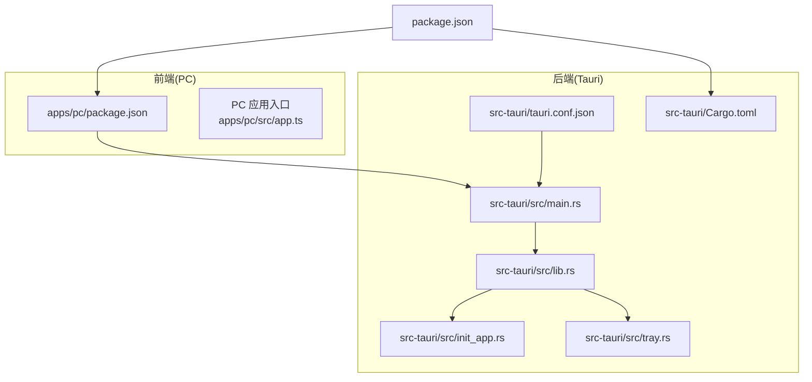
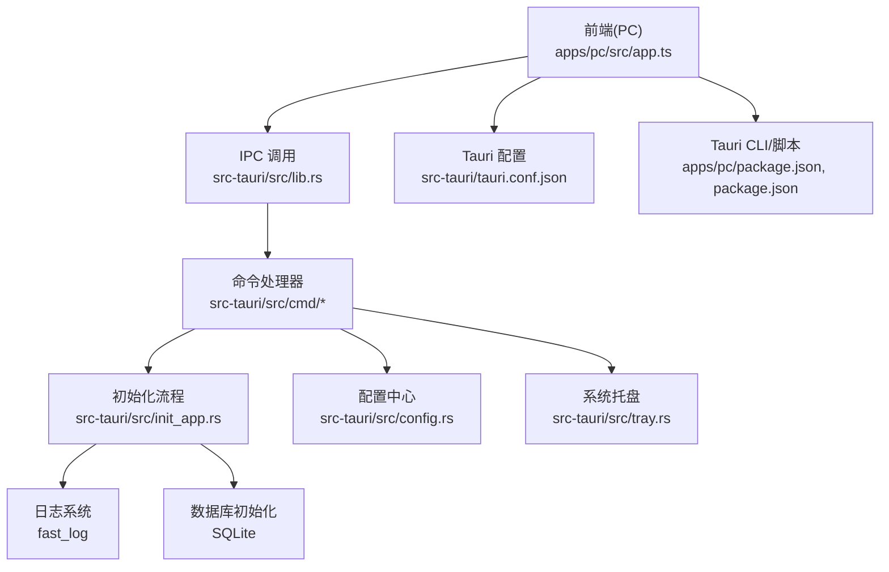
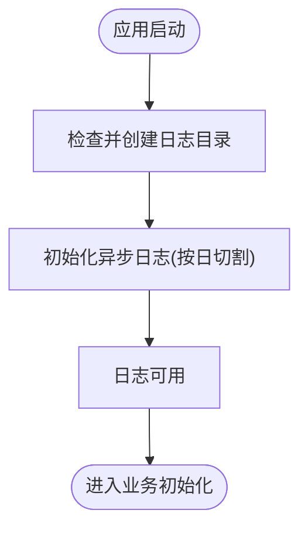
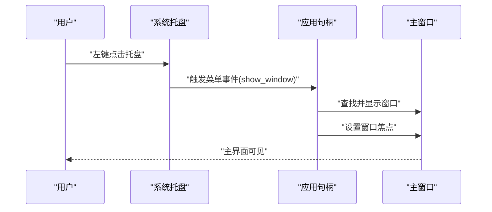
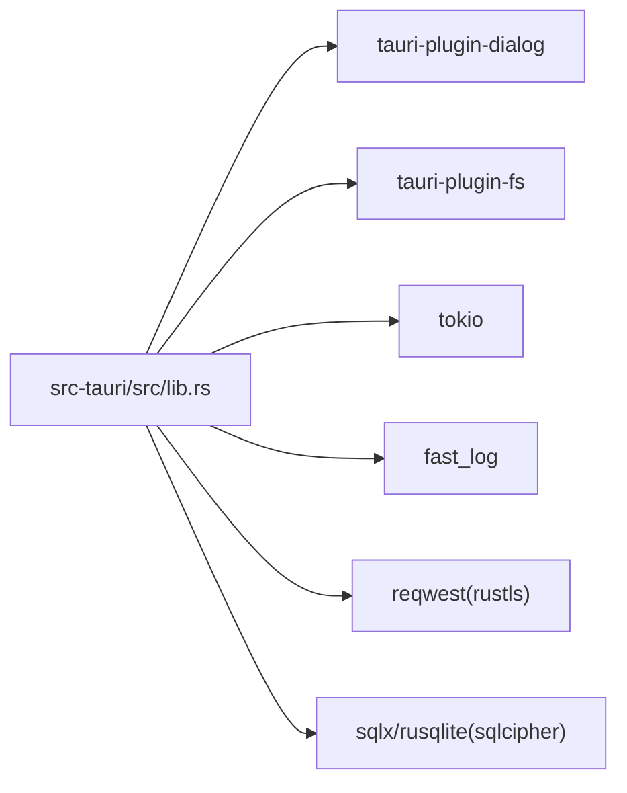

# 调试技巧

<cite>
**本文引用的文件**
- [src-tauri/Cargo.toml](file://src-tauri/Cargo.toml)
- [src-tauri/tauri.conf.json](file://src-tauri/tauri.conf.json)
- [src-tauri/src/main.rs](file://src-tauri/src/main.rs)
- [src-tauri/src/lib.rs](file://src-tauri/src/lib.rs)
- [src-tauri/src/init_app.rs](file://src-tauri/src/init_app.rs)
- [src-tauri/src/tray.rs](file://src-tauri/src/tray.rs)
- [src-tauri/src/utils/global_static_str.rs](file://src-tauri/src/utils/global_static_str.rs)
- [src-tauri/src/config.rs](file://src-tauri/src/config.rs)
- [apps/pc/package.json](file://apps/pc/package.json)
- [package.json](file://package.json)
- [src-tauri/gen/android/app/src/main/java/com/only/talk/app/generated/Logger.kt](file://src-tauri/gen/android/app/src/main/java/com/only/talk/app/generated/Logger.kt)
</cite>

## 目录

1. [简介](#简介)
2. [项目结构](#项目结构)
3. [核心组件](#核心组件)
4. [架构总览](#架构总览)
5. [详细组件分析](#详细组件分析)
6. [依赖关系分析](#依赖关系分析)
7. [性能考虑](#性能考虑)
8. [故障排查指南](#故障排查指南)
9. [结论](#结论)
10. [附录](#附录)

## 简介

本文件面向 Rust + Tauri + Vue/React 混合架构的应用开发者，提供系统化的调试方法与工具使用指南。内容覆盖：

- 后端（Rust）：日志配置、断点调试、性能分析
- 前端（PC 端基于 React/Vue 生态）：浏览器调试工具、Vue DevTools/React DevTools 使用
- Tauri 特有调试：IPC 通信调试、窗口管理调试、系统托盘调试
- 常见问题诊断、错误排查步骤、性能优化技巧
- 日志记录最佳实践、错误监控配置与生产环境问题定位

## 项目结构

该仓库采用多包工作区组织方式，前端在 apps/pc 与 apps/mobile，后端在 src-tauri，根级脚本通过 pnpm 进行统一编排。

图表来源

- [apps/pc/package.json:1-45](file://apps/pc/package.json#L1-L45)
- [package.json:1-30](file://package.json#L1-L30)
- [src-tauri/tauri.conf.json:1-58](file://src-tauri/tauri.conf.json#L1-L58)
- [src-tauri/src/main.rs:1-8](file://src-tauri/src/main.rs#L1-L8)
- [src-tauri/src/lib.rs:1-167](file://src-tauri/src/lib.rs#L1-L167)
- [src-tauri/src/init_app.rs:1-186](file://src-tauri/src/init_app.rs#L1-L186)
- [src-tauri/src/tray.rs:1-45](file://src-tauri/src/tray.rs#L1-L45)
- [src-tauri/Cargo.toml:1-62](file://src-tauri/Cargo.toml#L1-L62)

章节来源

- [apps/pc/package.json:1-45](file://apps/pc/package.json#L1-L45)
- [package.json:1-30](file://package.json#L1-L30)
- [src-tauri/tauri.conf.json:1-58](file://src-tauri/tauri.conf.json#L1-L58)
- [src-tauri/src/main.rs:1-8](file://src-tauri/src/main.rs#L1-L8)
- [src-tauri/src/lib.rs:1-167](file://src-tauri/src/lib.rs#L1-L167)
- [src-tauri/src/init_app.rs:1-186](file://src-tauri/src/init_app.rs#L1-L186)
- [src-tauri/src/tray.rs:1-45](file://src-tauri/src/tray.rs#L1-L45)
- [src-tauri/Cargo.toml:1-62](file://src-tauri/Cargo.toml#L1-L62)

## 核心组件

- 应用入口与运行时
  - 后端入口：Windows 子系统控制台行为、Tokio 运行时入口
  - 应用构建器：插件注册、全局状态初始化、IPC 命令注册、托盘初始化
- 初始化流程
  - 日志初始化：异步滚动日志、按日切割、保留 30 天
  - 资源与数据库初始化：应用数据目录、资源目录、当月资源目录、SQLite 初始化
  - 移动端资源复制：从资源目录复制到可访问目录
- 托盘功能
  - 左键弹出菜单、显示主界面、退出应用
- 配置与常量
  - 全局配置存储（DashMap）、配置读写接口
  - 全局静态常量（域名、UDP/QUIC 地址、路径等）

章节来源

- [src-tauri/src/main.rs:1-8](file://src-tauri/src/main.rs#L1-L8)
- [src-tauri/src/lib.rs:77-167](file://src-tauri/src/lib.rs#L77-L167)
- [src-tauri/src/init_app.rs:19-91](file://src-tauri/src/init_app.rs#L19-L91)
- [src-tauri/src/init_app.rs:93-166](file://src-tauri/src/init_app.rs#L93-L166)
- [src-tauri/src/init_app.rs:168-186](file://src-tauri/src/init_app.rs#L168-L186)
- [src-tauri/src/tray.rs:9-44](file://src-tauri/src/tray.rs#L9-L44)
- [src-tauri/src/config.rs:7-81](file://src-tauri/src/config.rs#L7-L81)
- [src-tauri/src/utils/global_static_str.rs:1-59](file://src-tauri/src/utils/global_static_str.rs#L1-L59)

## 架构总览

下图展示从前端到后端的关键交互路径，以及日志、托盘、配置等横切关注点。

图表来源

- [src-tauri/src/lib.rs:117-163](file://src-tauri/src/lib.rs#L117-L163)
- [src-tauri/src/init_app.rs:19-91](file://src-tauri/src/init_app.rs#L19-L91)
- [src-tauri/src/config.rs:7-81](file://src-tauri/src/config.rs#L7-L81)
- [src-tauri/src/tray.rs:9-44](file://src-tauri/src/tray.rs#L9-L44)
- [apps/pc/package.json:1-45](file://apps/pc/package.json#L1-L45)
- [package.json:1-30](file://package.json#L1-L30)
- [src-tauri/tauri.conf.json:1-58](file://src-tauri/tauri.conf.json#L1-L58)

## 详细组件分析

### 后端调试：日志配置与初始化

- 日志库与策略
  - 使用异步日志库，按日滚动切割，保留最近 30 份
  - 控制台输出与文件输出同时开启，便于开发期快速定位
- 初始化流程
  - 创建日志目录、拼接日志文件路径
  - 初始化日志系统，随后在后续流程中打印 info/warn/error 级别日志
- 调试建议
  - 开发阶段可临时提升日志级别以捕获更多信息
  - 生产环境建议保持 Info 级别，避免过多 I/O 开销
  - 结合日志轮转策略，定期清理旧日志，防止磁盘占用过大

图表来源

- [src-tauri/src/init_app.rs:26-42](file://src-tauri/src/init_app.rs#L26-L42)
- [src-tauri/src/init_app.rs:168-186](file://src-tauri/src/init_app.rs#L168-L186)

章节来源

- [src-tauri/src/init_app.rs:26-42](file://src-tauri/src/init_app.rs#L26-L42)
- [src-tauri/src/init_app.rs:168-186](file://src-tauri/src/init_app.rs#L168-L186)

### 后端调试：断点与运行时

- 入口与运行时
  - Windows 子系统配置：发布版本隐藏控制台窗口
  - Tokio 全栈异步运行时：适合并发网络与 IO 密集场景
- 调试建议
  - 使用 RUST_BACKTRACE=full 环境变量获取完整堆栈
  - 在 IDE 中设置断点于命令处理器或初始化流程关键位置
  - 利用异步任务 spawn 与日志结合定位执行路径

章节来源

- [src-tauri/src/main.rs:1-8](file://src-tauri/src/main.rs#L1-L8)
- [src-tauri/src/lib.rs:86-89](file://src-tauri/src/lib.rs#L86-L89)

### 后端调试：性能分析

- 关键依赖与特性
  - 异步运行时与高性能网络库组合，适合高并发场景
  - 数据库层使用 SQLite/加密 SQLCipher，注意 I/O 瓶颈
- 分析建议
  - 使用火焰图/性能剖析工具定位热点函数
  - 关注日志中的耗时点，结合业务流程进行分段统计
  - 对高频 IPC 调用与数据库操作进行压测与缓存优化

章节来源

- [src-tauri/Cargo.toml:38-62](file://src-tauri/Cargo.toml#L38-L62)

### 前端调试：浏览器与工具

- 浏览器调试
  - 打开开发者工具，使用 Elements/Console/Network/Performance 面板
  - 观察 IPC 调用的请求/响应、网络异常与资源加载
- Vue DevTools（PC 端）
  - 安装扩展后查看组件树、状态、事件流
  - 结合 Vuex/DVA 状态管理定位数据流转问题
- React DevTools（PC 端）
  - 查看组件层级、Props/State、渲染次数
  - 使用 Profiler 分析重渲染热点

章节来源

- [apps/pc/package.json:18-32](file://apps/pc/package.json#L18-L32)

### 前端调试：IPC 与窗口

- IPC 调用
  - 通过 Tauri API 发起 invoke，后端在命令处理器中处理
  - 建议在前后端均添加请求 ID 与时间戳，便于追踪
- 窗口管理
  - 在配置中定义窗口属性（尺寸、装饰、居中等）
  - 使用开发者工具切换到移动端设备模式验证布局

章节来源

- [src-tauri/src/lib.rs:117-163](file://src-tauri/src/lib.rs#L117-L163)
- [src-tauri/tauri.conf.json:13-25](file://src-tauri/tauri.conf.json#L13-L25)

### Tauri 特有调试：系统托盘

- 功能要点
  - 左键弹出菜单，包含“显示主界面”“退出应用”
  - 点击菜单项触发窗口显示与焦点设置
- 调试建议
  - 在菜单事件回调中增加日志，确认事件触发顺序
  - 若窗口未显示，检查窗口标签与存在性判断

图表来源

- [src-tauri/src/tray.rs:22-32](file://src-tauri/src/tray.rs#L22-L32)

章节来源

- [src-tauri/src/tray.rs:9-44](file://src-tauri/src/tray.rs#L9-L44)

### Tauri 特有调试：IPC 通信

- 注册与调用
  - 后端集中注册所有 IPC 命令，前端通过 invoke 调用
  - 建议为每个命令添加统一的错误包装与日志埋点
- 调试建议
  - 在命令处理器入口与出口打点，记录参数与返回值
  - 对网络类调用（如上传/下载）增加超时与重试策略

章节来源

- [src-tauri/src/lib.rs:117-163](file://src-tauri/src/lib.rs#L117-L163)

### 配置与常量调试

- 全局配置
  - 使用 DashMap 存储键值对，提供增删改查与批量导入导出
  - 支持字符串/数值/布尔类型读取与默认值回退
- 常量
  - 统一存放域名、UDP/QUIC 地址、路径等，便于集中维护与替换

章节来源

- [src-tauri/src/config.rs:7-81](file://src-tauri/src/config.rs#L7-L81)
- [src-tauri/src/utils/global_static_str.rs:1-59](file://src-tauri/src/utils/global_static_str.rs#L1-L59)

### 移动端日志调试（Android）

- 生成代码中的日志封装
  - 提供 warn/error 等方法，并受 DEBUG 开关控制
- 调试建议
  - 在 Android Studio 中查看 logcat，过滤应用 TAG
  - 发布版本关闭 DEBUG 以减少日志输出

章节来源

- [src-tauri/gen/android/app/src/main/java/com/only/talk/app/generated/Logger.kt:59-89](file://src-tauri/gen/android/app/src/main/java/com/only/talk/app/generated/Logger.kt#L59-L89)

## 依赖关系分析

- 运行时与插件
  - Tauri 核心、对话框与文件系统插件
  - 异步运行时与日志库
- 网络与安全
  - 请求客户端、TLS 配置、CSP 策略
- 数据与存储
  - SQLite 与加密 SQLCipher、内存共享结构

图表来源

- [src-tauri/src/lib.rs:91-116](file://src-tauri/src/lib.rs#L91-L116)
- [src-tauri/Cargo.toml:24-62](file://src-tauri/Cargo.toml#L24-L62)

章节来源

- [src-tauri/src/lib.rs:91-116](file://src-tauri/src/lib.rs#L91-L116)
- [src-tauri/Cargo.toml:24-62](file://src-tauri/Cargo.toml#L24-L62)

## 性能考虑

- 异步优先：大量 IO 与网络请求使用异步模型，避免阻塞主线程
- 日志成本：生产环境降低日志级别，合理使用滚动与保留策略
- 数据库：对频繁查询建立索引，批量写入减少事务开销
- IPC：合并小请求、避免高频短间隔调用，必要时引入节流/去抖
- 资源复制：移动端资源复制仅在首次或缺失时执行，避免重复 I/O

## 故障排查指南

- 启动失败
  - 检查应用句柄初始化与托盘初始化日志
  - 确认日志目录可写、路径拼接正确
- IPC 无响应
  - 核对命令名称是否一致、参数类型是否匹配
  - 在命令处理器入口与出口增加日志，定位阻塞点
- 窗口显示异常
  - 检查窗口标签与存在性判断
  - 确认 CSP 策略允许 ipc 与 asset 协议
- 托盘菜单无效
  - 检查菜单事件回调与窗口焦点设置
- 日志缺失
  - 确认日志初始化顺序与文件路径
  - 检查日志级别与滚动策略
- 移动端资源无法加载
  - 确认资源复制逻辑与目标路径存在性
  - 查看资源目录枚举与文件存在性日志

章节来源

- [src-tauri/src/init_app.rs:93-166](file://src-tauri/src/init_app.rs#L93-L166)
- [src-tauri/src/lib.rs:94-115](file://src-tauri/src/lib.rs#L94-L115)
- [src-tauri/src/tray.rs:22-32](file://src-tauri/src/tray.rs#L22-L32)
- [src-tauri/tauri.conf.json:26-39](file://src-tauri/tauri.conf.json#L26-L39)

## 结论

本项目在后端提供了完善的日志与初始化框架，在前端具备成熟的调试工具链，并在 Tauri 层面提供了 IPC、窗口与托盘的调试入口。建议在开发阶段充分利用日志与断点，在生产阶段通过合理的日志策略与监控体系保障稳定性。

## 附录

- 调试常用命令
  - 前端开发：在根目录或 PC 应用目录执行开发脚本
  - 后端开发：直接运行 Rust 二进制或使用 Cargo 调试器
- 环境变量
  - RUST_BACKTRACE=full：启用完整堆栈跟踪
  - Windows 子系统：发布版本隐藏控制台窗口
- 配置参考
  - Tauri 窗口与安全策略
  - 前端构建与开发 URL

章节来源

- [package.json:4-16](file://package.json#L4-L16)
- [apps/pc/package.json:8-16](file://apps/pc/package.json#L8-L16)
- [src-tauri/src/main.rs:1-8](file://src-tauri/src/main.rs#L1-L8)
- [src-tauri/tauri.conf.json:6-11](file://src-tauri/tauri.conf.json#L6-L11)
