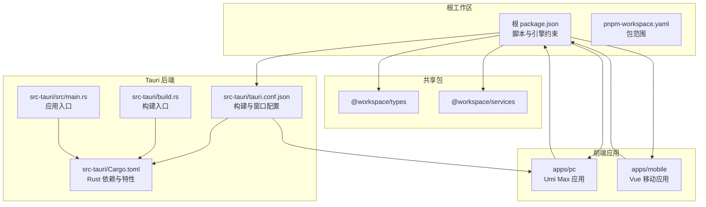
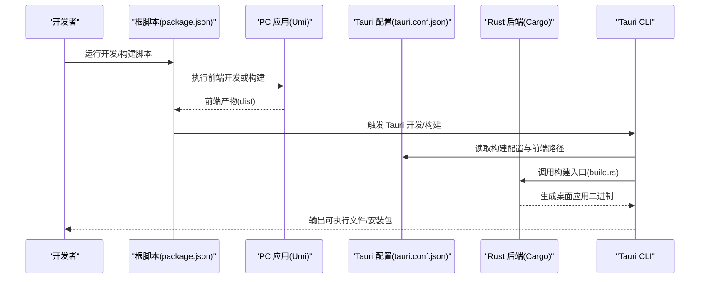
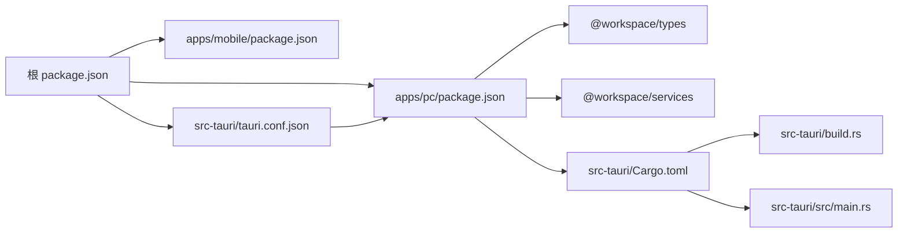

# 快速开始

<cite>
**本文引用的文件**
- [README.md](file://README.md)
- [package.json](file://package.json)
- [pnpm-workspace.yaml](file://pnpm-workspace.yaml)
- [src-tauri/Cargo.toml](file://src-tauri/Cargo.toml)
- [src-tauri/tauri.conf.json](file://src-tauri/tauri.conf.json)
- [src-tauri/build.rs](file://src-tauri/build.rs)
- [src-tauri/src/main.rs](file://src-tauri/src/main.rs)
- [apps/pc/package.json](file://apps/pc/package.json)
- [apps/pc/.umirc.ts](file://apps/pc/.umirc.ts)
- [apps/mobile/package.json](file://apps/mobile/package.json)
- [apps/mobile/vite.config.ts](file://apps/mobile/vite.config.ts)
- [apps/pc/tsconfig.json](file://apps/pc/tsconfig.json)
</cite>

## 目录
1. [简介](#简介)
2. [项目结构](#项目结构)
3. [核心组件](#核心组件)
4. [架构总览](#架构总览)
5. [详细组件分析](#详细组件分析)
6. [依赖关系分析](#依赖关系分析)
7. [性能考虑](#性能考虑)
8. [故障排除指南](#故障排除指南)
9. [结论](#结论)
10. [附录](#附录)

## 简介
本指南面向希望快速搭建与运行 Rust Tauri Umi 即时通讯应用的开发者。内容覆盖环境要求检查、依赖安装、首次运行、开发与生产构建差异、常见问题排查，以及本地开发服务器、Tauri 桌面应用调试与多平台构建的实操步骤。目标是让新手顺利上手，同时为有经验的开发者提供高效工作流建议。

## 项目结构
该仓库采用 pnpm workspace 多包结构，包含 PC 端 Umi 应用、移动端 Vue 应用、共享类型与服务包，以及 Tauri Rust 后端。Tauri 配置指向 PC 端构建产物作为前端静态资源，实现桌面端与 Web 端的统一开发体验。

图表来源
- [package.json:1-30](file://package.json#L1-L30)
- [pnpm-workspace.yaml:1-4](file://pnpm-workspace.yaml#L1-L4)
- [apps/pc/package.json:1-45](file://apps/pc/package.json#L1-L45)
- [apps/mobile/package.json:1-37](file://apps/mobile/package.json#L1-L37)
- [src-tauri/tauri.conf.json:1-58](file://src-tauri/tauri.conf.json#L1-L58)
- [src-tauri/Cargo.toml:1-62](file://src-tauri/Cargo.toml#L1-L62)
- [src-tauri/build.rs:1-4](file://src-tauri/build.rs#L1-L4)
- [src-tauri/src/main.rs:1-8](file://src-tauri/src/main.rs#L1-L8)

章节来源
- [README.md:76-93](file://README.md#L76-L93)
- [pnpm-workspace.yaml:1-4](file://pnpm-workspace.yaml#L1-L4)
- [apps/pc/.umirc.ts:1-22](file://apps/pc/.umirc.ts#L1-L22)

## 核心组件
- 根工作区与脚本
  - 根 package.json 提供统一脚本入口，包括前端开发、构建、移动应用构建、格式化等；并声明 Node.js 与 pnpm 的最低版本要求。
- PC 端 Umi 应用
  - apps/pc/package.json 定义 Umi Max 应用的依赖与脚本，包含本地开发、构建、格式化与初始化流程。
  - apps/pc/.umirc.ts 配置国际化、路由、插件与构建参数。
- 移动端 Vue 应用
  - apps/mobile/package.json 定义移动端依赖与脚本，支持 Vite 开发与构建。
  - apps/mobile/vite.config.ts 配置路径别名、CSS 预处理器、开发服务器端口与忽略规则。
- Tauri 后端
  - src-tauri/tauri.conf.json 指定前端产物目录、开发 URL、构建前置命令、窗口属性、安全策略与打包图标。
  - src-tauri/Cargo.toml 定义 Rust 依赖、特性与构建配置。
  - src-tauri/build.rs 与 src-tauri/src/main.rs 分别承担构建入口与应用入口。

章节来源
- [package.json:1-30](file://package.json#L1-L30)
- [apps/pc/package.json:1-45](file://apps/pc/package.json#L1-L45)
- [apps/pc/.umirc.ts:1-22](file://apps/pc/.umirc.ts#L1-L22)
- [apps/mobile/package.json:1-37](file://apps/mobile/package.json#L1-L37)
- [apps/mobile/vite.config.ts:1-31](file://apps/mobile/vite.config.ts#L1-L31)
- [src-tauri/tauri.conf.json:1-58](file://src-tauri/tauri.conf.json#L1-L58)
- [src-tauri/Cargo.toml:1-62](file://src-tauri/Cargo.toml#L1-L62)
- [src-tauri/build.rs:1-4](file://src-tauri/build.rs#L1-L4)
- [src-tauri/src/main.rs:1-8](file://src-tauri/src/main.rs#L1-L8)

## 架构总览
下图展示从开发到构建的关键流程：PC 端 Umi 应用负责前端开发与构建；Tauri 配置在开发阶段通过 beforeDevCommand 自动启动前端开发服务器，在构建阶段通过 beforeBuildCommand 生成生产构建；Rust 后端通过 Tauri CLI 注入前端产物并打包为桌面应用。

图表来源
- [package.json:4-14](file://package.json#L4-L14)
- [src-tauri/tauri.conf.json:6-11](file://src-tauri/tauri.conf.json#L6-L11)
- [src-tauri/build.rs:1-4](file://src-tauri/build.rs#L1-L4)

章节来源
- [README.md:32-65](file://README.md#L32-L65)
- [src-tauri/tauri.conf.json:6-11](file://src-tauri/tauri.conf.json#L6-L11)

## 详细组件分析

### 环境要求与安装清单
- 软件版本
  - Node.js: >= 16.0.0（根脚本声明）
  - pnpm: >= 8.0.0（根脚本声明）
  - Rust: >= 1.77.2（Rust 项目声明）
- 操作系统
  - 前端开发：Windows 10+/macOS 10.14+/Linux
  - Tauri 桌面应用构建：Windows 10+
- Windows 特定依赖
  - WebView2（Windows 10+/11）
  - Microsoft Visual Studio C++ Build Tools（Rust 编译）

章节来源
- [README.md:16-31](file://README.md#L16-L31)
- [package.json:25-28](file://package.json#L25-L28)
- [src-tauri/Cargo.toml:9](file://src-tauri/Cargo.toml#L9)

### 项目克隆与依赖安装
- 步骤
  - 克隆仓库后，使用 pnpm 安装根工作区依赖。
  - 根据需要分别安装 PC 端与移动端依赖（由工作区自动处理）。
- 注意事项
  - 若使用 pnpm < 8 或 Node < 16，需先升级工具链以满足根脚本要求。

章节来源
- [README.md:34-39](file://README.md#L34-L39)
- [package.json:25-28](file://package.json#L25-L28)

### 首次运行与本地开发
- 启动前端开发服务器
  - 在根目录执行前端开发脚本，将启动 PC 端 Umi 开发服务器。
  - 默认访问地址为 http://localhost:8080（由 Tauri 配置指定）。
- 启动 Tauri 桌面应用开发
  - 在根目录执行 Tauri 开发脚本，将自动启动前端开发服务器并打开桌面窗口。
- 移动端开发
  - 可单独启动移动端开发服务器（移动端自有脚本）。

章节来源
- [README.md:41-55](file://README.md#L41-L55)
- [src-tauri/tauri.conf.json:8-10](file://src-tauri/tauri.conf.json#L8-L10)
- [apps/pc/package.json:8-16](file://apps/pc/package.json#L8-L16)
- [apps/mobile/package.json:7-15](file://apps/mobile/package.json#L7-L15)

### 开发模式与生产构建
- 开发模式
  - 前端：Umi 开发服务器提供热更新与调试能力。
  - Tauri：通过 beforeDevCommand 自动启动前端开发服务器，窗口加载 devUrl。
- 生产构建
  - 前端：Umi 生产构建输出至 dist 目录。
  - Tauri：通过 beforeBuildCommand 生成前端产物，随后调用 Rust 构建生成桌面应用。
- 产物位置
  - Web：dist 目录（由前端构建产生）
  - 桌面应用：src-tauri/target/release（默认发布配置）

章节来源
- [README.md:57-67](file://README.md#L57-L67)
- [src-tauri/tauri.conf.json:7-10](file://src-tauri/tauri.conf.json#L7-L10)
- [apps/pc/package.json:9-10](file://apps/pc/package.json#L9-L10)

### 多平台构建与打包
- 平台支持
  - Tauri 配置启用全平台打包（targets: all），并定义 Windows 安装器钩子。
- 图标与资源
  - 通过 bundle.icon 指定多尺寸图标，适配不同平台。
- 打包流程
  - 先构建前端产物，再由 Tauri CLI 调用 Rust 构建，最终生成安装包。

章节来源
- [src-tauri/tauri.conf.json:41-56](file://src-tauri/tauri.conf.json#L41-L56)

### 调试与开发技巧
- 前端调试
  - 使用浏览器开发者工具对 Umi 应用进行断点与网络调试。
- Tauri 调试
  - 在开发模式下，桌面窗口与前端开发服务器联动；可通过 Tauri CLI 日志定位问题。
- 路径与别名
  - 移动端 Vite 配置提供路径别名与严格端口绑定，避免冲突。
- 国际化与布局
  - PC 端 Umi 配置开启国际化与本地存储，便于本地调试。

章节来源
- [apps/mobile/vite.config.ts:7-30](file://apps/mobile/vite.config.ts#L7-L30)
- [apps/pc/.umirc.ts:11-17](file://apps/pc/.umirc.ts#L11-L17)
- [apps/pc/package.json:8-16](file://apps/pc/package.json#L8-L16)

## 依赖关系分析
- 工作区与包管理
  - pnpm-workspace.yaml 声明 apps 与 packages 为工作区包，根 package.json 统一脚本与引擎约束。
- 前端与后端耦合
  - Tauri 配置将前端产物目录与开发 URL 明确绑定，保证开发与构建一致性。
- Rust 依赖与特性
  - Cargo.toml 引入 Tauri、网络、数据库、图像处理等依赖，支撑即时通讯功能。

图表来源
- [package.json:1-30](file://package.json#L1-L30)
- [pnpm-workspace.yaml:1-4](file://pnpm-workspace.yaml#L1-L4)
- [apps/pc/package.json:18-32](file://apps/pc/package.json#L18-L32)
- [apps/mobile/package.json:16-24](file://apps/mobile/package.json#L16-L24)
- [src-tauri/tauri.conf.json:7-10](file://src-tauri/tauri.conf.json#L7-L10)
- [src-tauri/Cargo.toml:24-62](file://src-tauri/Cargo.toml#L24-L62)
- [src-tauri/build.rs:1-4](file://src-tauri/build.rs#L1-L4)
- [src-tauri/src/main.rs:1-8](file://src-tauri/src/main.rs#L1-L8)

章节来源
- [pnpm-workspace.yaml:1-4](file://pnpm-workspace.yaml#L1-L4)
- [apps/pc/package.json:18-32](file://apps/pc/package.json#L18-L32)
- [apps/mobile/package.json:16-24](file://apps/mobile/package.json#L16-L24)
- [src-tauri/tauri.conf.json:7-10](file://src-tauri/tauri.conf.json#L7-L10)
- [src-tauri/Cargo.toml:24-62](file://src-tauri/Cargo.toml#L24-L62)

## 性能考虑
- 前端构建优化
  - Umi 配置启用 IIFE 最小化，有助于减少产物体积与加载时间。
- Rust 发布配置
  - Cargo.toml 中的 release 配置启用 LTO 与单代码单元，提升运行时性能。
- 资源与安全
  - Tauri 配置中的 CSP 与资产协议限制，兼顾安全性与性能。

章节来源
- [apps/pc/.umirc.ts:20](file://apps/pc/.umirc.ts#L20)
- [src-tauri/Cargo.toml:11-15](file://src-tauri/Cargo.toml#L11-L15)
- [src-tauri/tauri.conf.json:26-39](file://src-tauri/tauri.conf.json#L26-L39)

## 故障排除指南
- Node.js/pnpm 版本不匹配
  - 症状：脚本报错或依赖安装失败
  - 解决：升级 Node.js 至 >= 16，pnpm 至 >= 8
- Rust 工具链缺失
  - 症状：编译错误或找不到 rustc
  - 解决：安装 rustup 并确保 Rust >= 1.77.2
- Windows WebView2 缺失
  - 症状：桌面窗口无法加载或白屏
  - 解决：安装 WebView2 Runtime
- Windows C++ 构建工具缺失
  - 症状：Rust 编译失败
  - 解决：安装 Microsoft Visual Studio C++ Build Tools
- 端口冲突
  - 症状：开发服务器启动失败
  - 解决：调整移动端 Vite 端口或关闭占用进程
- 前端产物未生成
  - 症状：Tauri 开发模式无法加载页面
  - 解决：确认 beforeDevCommand 与 beforeBuildCommand 正常执行，检查 PC 端构建产物路径

章节来源
- [README.md:16-31](file://README.md#L16-L31)
- [package.json:25-28](file://package.json#L25-L28)
- [apps/mobile/vite.config.ts:22-28](file://apps/mobile/vite.config.ts#L22-L28)
- [src-tauri/tauri.conf.json:8-10](file://src-tauri/tauri.conf.json#L8-L10)

## 结论
通过本指南，您可以完成从环境准备到首次运行、从开发调试到生产构建的全流程操作。建议优先验证 Node.js/pnpm/Rust 版本与平台依赖，再按顺序执行依赖安装、前端开发、Tauri 开发与构建。遇到问题时，优先核对脚本版本、端口占用与 WebView2/构建工具状态。

## 附录

### 常用命令速查
- 安装依赖：在根目录执行 pnpm 安装
- 启动前端开发：执行根脚本中的 dev（或直接进入 apps/pc 执行其 dev）
- 启动 Tauri 开发：执行根脚本中的 tauri dev
- 构建前端生产：执行根脚本中的 build
- 构建 Tauri 桌面应用：执行根脚本中的 tauri build
- 代码格式化：执行根脚本中的 lint

章节来源
- [README.md:34-74](file://README.md#L34-L74)
- [package.json:4-14](file://package.json#L4-L14)