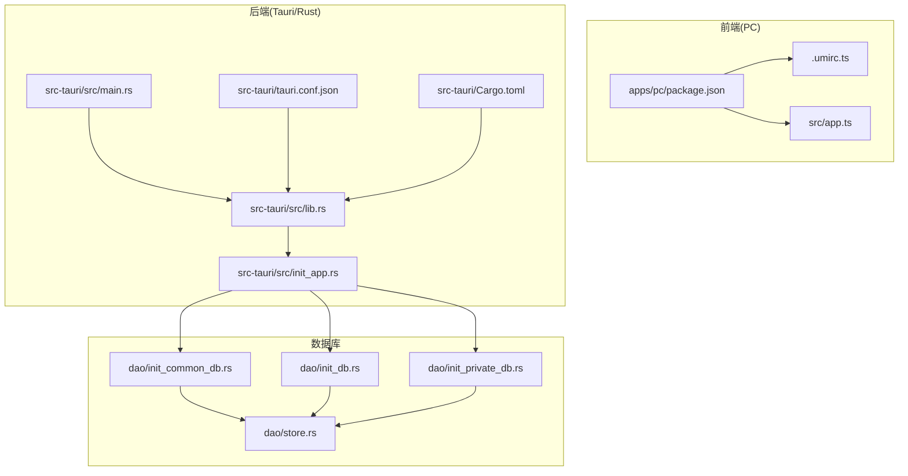
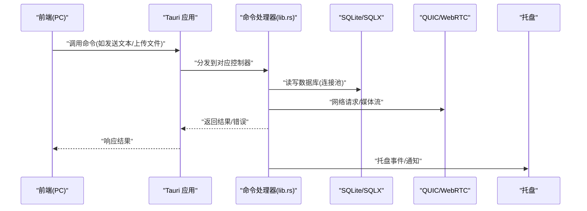
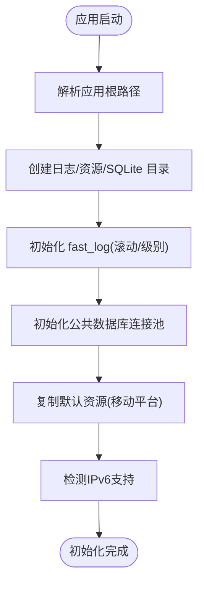
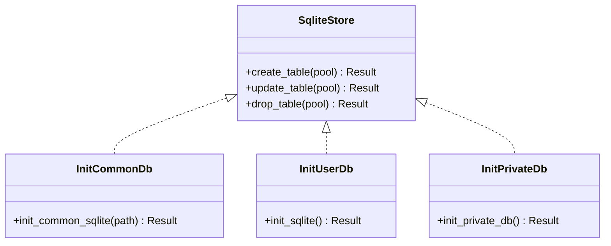
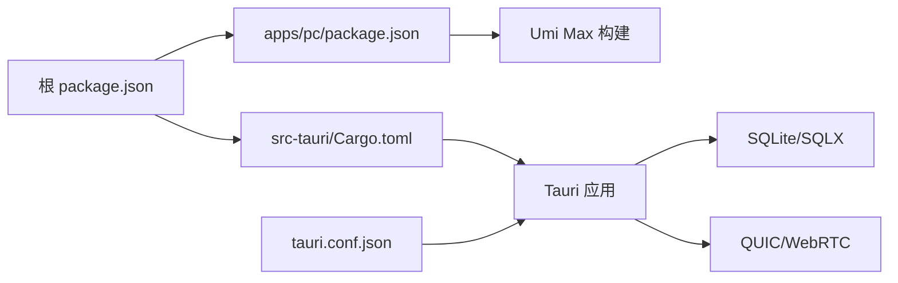

# 故障排除

<cite>
**本文引用的文件**
- [README.md](file://README.md)
- [package.json](file://package.json)
- [apps/pc/package.json](file://apps/pc/package.json)
- [src-tauri/Cargo.toml](file://src-tauri/Cargo.toml)
- [src-tauri/tauri.conf.json](file://src-tauri/tauri.conf.json)
- [src-tauri/src/main.rs](file://src-tauri/src/main.rs)
- [src-tauri/src/lib.rs](file://src-tauri/src/lib.rs)
- [src-tauri/src/init_app.rs](file://src-tauri/src/init_app.rs)
- [src-tauri/src/dao/init_common_db.rs](file://src-tauri/src/dao/init_common_db.rs)
- [src-tauri/src/dao/init_db.rs](file://src-tauri/src/dao/init_db.rs)
- [src-tauri/src/dao/init_private_db.rs](file://src-tauri/src/dao/init_private_db.rs)
- [src-tauri/src/dao/store.rs](file://src-tauri/src/dao/store.rs)
- [apps/pc/.umirc.ts](file://apps/pc/.umirc.ts)
- [apps/pc/src/app.ts](file://apps/pc/src/app.ts)
- [src-tauri/logs/onlytalk.log](file://src-tauri/logs/onlytalk.log)
</cite>

## 目录
1. [简介](#简介)
2. [项目结构](#项目结构)
3. [核心组件](#核心组件)
4. [架构总览](#架构总览)
5. [详细组件分析](#详细组件分析)
6. [依赖关系分析](#依赖关系分析)
7. [性能考虑](#性能考虑)
8. [故障排除指南](#故障排除指南)
9. [结论](#结论)
10. [附录](#附录)

## 简介
本指南面向开发者与技术支持人员，聚焦于该 Rust + Tauri + Umi Max 桌面应用在开发与运行阶段的常见问题诊断与解决。内容覆盖开发环境准备、运行时错误、性能问题、日志分析、调试工具使用、网络与数据库异常、UI 渲染问题、系统兼容性与权限配置、第三方依赖冲突、性能瓶颈与内存泄漏检测、崩溃转储分析等，提供可操作的排查步骤与定位策略。

## 项目结构
该工程采用多包工作区结构，前端基于 Umi Max（React），后端基于 Tauri/Rust，数据库使用 SQLite 并通过 SQLX 连接池管理，辅以 QUIC/WebRTC 媒体通道与托盘功能。关键目录与职责概览：
- apps/pc：PC 端前端应用（Umi Max + Ant Design + Zustand）
- apps/mobile：移动端前端应用（Vue3 + Vant）
- src-tauri：Rust 后端（Tauri 应用、命令导出、数据库初始化、QUIC/WebRTC 服务、托盘）
- packages/types、packages/services：共享类型与服务模块
- 根 package.json：统一脚本与引擎约束

图表来源
- [src-tauri/src/main.rs:1-8](file://src-tauri/src/main.rs#L1-L8)
- [src-tauri/src/lib.rs:1-167](file://src-tauri/src/lib.rs#L1-L167)
- [src-tauri/src/init_app.rs:1-186](file://src-tauri/src/init_app.rs#L1-L186)
- [src-tauri/src/dao/init_common_db.rs:1-48](file://src-tauri/src/dao/init_common_db.rs#L1-L48)
- [src-tauri/src/dao/init_db.rs:1-41](file://src-tauri/src/dao/init_db.rs#L1-L41)
- [src-tauri/src/dao/init_private_db.rs:1-94](file://src-tauri/src/dao/init_private_db.rs#L1-L94)
- [src-tauri/src/dao/store.rs:1-20](file://src-tauri/src/dao/store.rs#L1-L20)
- [apps/pc/package.json:1-45](file://apps/pc/package.json#L1-L45)
- [apps/pc/.umirc.ts:1-22](file://apps/pc/.umirc.ts#L1-L22)
- [apps/pc/src/app.ts:1-23](file://apps/pc/src/app.ts#L1-L23)
- [src-tauri/Cargo.toml:1-62](file://src-tauri/Cargo.toml#L1-L62)
- [src-tauri/tauri.conf.json:1-58](file://src-tauri/tauri.conf.json#L1-L58)

章节来源
- [README.md:1-100](file://README.md#L1-L100)
- [package.json:1-30](file://package.json#L1-L30)
- [apps/pc/package.json:1-45](file://apps/pc/package.json#L1-L45)
- [src-tauri/Cargo.toml:1-62](file://src-tauri/Cargo.toml#L1-L62)
- [src-tauri/tauri.conf.json:1-58](file://src-tauri/tauri.conf.json#L1-L58)

## 核心组件
- 应用入口与生命周期
  - 后端入口：Rust 主进程启动，设置平台相关环境变量与回溯信息，初始化托盘与应用状态，注册命令处理器，运行 Tauri 应用。
  - 前端运行时：Umi Max 配置、路由守卫与全局初始化。
- 数据层
  - 公共数据库、用户数据库、私有数据库（SQLCipher 加密）初始化与连接池管理；通用表结构初始化接口。
- 通信与网络
  - 通过 Tauri 命令桥接前端与后端；QUIC/WebRTC 服务用于消息与媒体传输。
- 日志与配置
  - Rust 使用 fast_log 异步滚动日志；前端通过 Tauri CLI 与插件进行对话框与文件系统交互；Tauri 配置定义 CSP、协议与打包参数。

章节来源
- [src-tauri/src/main.rs:1-8](file://src-tauri/src/main.rs#L1-L8)
- [src-tauri/src/lib.rs:1-167](file://src-tauri/src/lib.rs#L1-L167)
- [src-tauri/src/init_app.rs:1-186](file://src-tauri/src/init_app.rs#L1-L186)
- [src-tauri/src/dao/init_common_db.rs:1-48](file://src-tauri/src/dao/init_common_db.rs#L1-L48)
- [src-tauri/src/dao/init_db.rs:1-41](file://src-tauri/src/dao/init_db.rs#L1-L41)
- [src-tauri/src/dao/init_private_db.rs:1-94](file://src-tauri/src/dao/init_private_db.rs#L1-L94)
- [apps/pc/.umirc.ts:1-22](file://apps/pc/.umirc.ts#L1-L22)
- [apps/pc/src/app.ts:1-23](file://apps/pc/src/app.ts#L1-L23)

## 架构总览
下图展示从前端到后端、再到数据库与网络服务的整体交互流程，以及关键的错误传播路径。

图表来源
- [src-tauri/src/lib.rs:117-163](file://src-tauri/src/lib.rs#L117-L163)
- [src-tauri/src/init_app.rs:19-91](file://src-tauri/src/init_app.rs#L19-L91)
- [src-tauri/src/dao/init_common_db.rs:13-37](file://src-tauri/src/dao/init_common_db.rs#L13-L37)
- [src-tauri/src/dao/init_db.rs:17-41](file://src-tauri/src/dao/init_db.rs#L17-L41)
- [src-tauri/src/dao/init_private_db.rs:21-61](file://src-tauri/src/dao/init_private_db.rs#L21-L61)

## 详细组件分析

### 后端入口与初始化
- 关键点
  - 设置平台环境变量（Linux Wayland/Qt 平台、Webkit 复合模式禁用）、启用完整回溯。
  - 注册插件（对话框、文件系统、打开器），初始化托盘，异步执行应用初始化。
  - 注册所有命令处理器，统一运行应用。
- 常见问题
  - Linux 平台 UI 显示异常：检查环境变量设置与窗口合成模式。
  - 托盘初始化失败：关注 eprintln 输出与初始化错误分支。
  - 崩溃或无响应：开启 RUST_BACKTRACE 后重试，结合日志定位。

章节来源
- [src-tauri/src/main.rs:1-8](file://src-tauri/src/main.rs#L1-L8)
- [src-tauri/src/lib.rs:77-115](file://src-tauri/src/lib.rs#L77-L115)
- [src-tauri/src/lib.rs:105-113](file://src-tauri/src/lib.rs#L105-L113)

### 应用初始化流程
- 关键点
  - 解析应用根路径，创建日志、资源、当月资源、SQLite 目录。
  - 初始化 fast_log，按日期滚动保留 30 天。
  - 初始化公共数据库连接池并创建表结构。
  - 复制默认资源到可访问目录（移动平台）。
  - 检测 IPv6 支持并记录警告。
- 常见问题
  - 日志未生成：确认日志目录创建与路径解析。
  - 资源复制失败：检查资源目录存在性与权限。
  - 数据库初始化失败：检查连接字符串、权限与磁盘空间。

图表来源
- [src-tauri/src/init_app.rs:19-91](file://src-tauri/src/init_app.rs#L19-L91)
- [src-tauri/src/init_app.rs:93-166](file://src-tauri/src/init_app.rs#L93-L166)
- [src-tauri/src/init_app.rs:168-185](file://src-tauri/src/init_app.rs#L168-L185)

章节来源
- [src-tauri/src/init_app.rs:1-186](file://src-tauri/src/init_app.rs#L1-L186)

### 数据库初始化与连接池
- 关键点
  - 公共数据库：创建连接池，初始化 DDL。
  - 用户数据库：按账户隔离目录，创建连接池与表。
  - 私有数据库：SQLCipher 加密，设置密钥，验证可用性。
  - 通用接口：通过 SqliteStore trait 统一创建/更新/删除表。
- 常见问题
  - 连接池满：检查 max_connections 与并发查询。
  - 权限不足：确认数据库文件与目录权限。
  - 加密失败：核对密钥与 SQLCipher 功能启用。

图表来源
- [src-tauri/src/dao/store.rs:1-20](file://src-tauri/src/dao/store.rs#L1-L20)
- [src-tauri/src/dao/init_common_db.rs:1-48](file://src-tauri/src/dao/init_common_db.rs#L1-L48)
- [src-tauri/src/dao/init_db.rs:1-41](file://src-tauri/src/dao/init_db.rs#L1-L41)
- [src-tauri/src/dao/init_private_db.rs:1-94](file://src-tauri/src/dao/init_private_db.rs#L1-L94)

章节来源
- [src-tauri/src/dao/store.rs:1-20](file://src-tauri/src/dao/store.rs#L1-L20)
- [src-tauri/src/dao/init_common_db.rs:1-48](file://src-tauri/src/dao/init_common_db.rs#L1-L48)
- [src-tauri/src/dao/init_db.rs:1-41](file://src-tauri/src/dao/init_db.rs#L1-L41)
- [src-tauri/src/dao/init_private_db.rs:1-94](file://src-tauri/src/dao/init_private_db.rs#L1-L94)

### 前端运行时与路由守卫
- 关键点
  - onRouteChange 钩子用于监听路由变化并执行守卫逻辑。
  - getInitialState 提供全局初始化数据入口。
  - Umi 配置启用国际化、本地化与最小化 IIFE。
- 常见问题
  - 路由跳转异常：检查路由守卫实现与权限状态。
  - 国际化失效：确认 locale 配置与本地存储开关。

章节来源
- [apps/pc/src/app.ts:1-23](file://apps/pc/src/app.ts#L1-L23)
- [apps/pc/.umirc.ts:1-22](file://apps/pc/.umirc.ts#L1-L22)

## 依赖关系分析
- 前端依赖
  - @umijs/max、antd、@tauri-apps/api、zustand 等。
  - 脚本统一由根 package.json 管理，PC/Mobile 分别独立构建。
- 后端依赖
  - tauri、tokio、sqlx、fast_log、quinn、rustls、rusqlite(sqlcipher) 等。
  - 通过 Cargo.toml 管理版本与特性（如 lto、opt-level、bundled-sqlcipher）。
- 配置与打包
  - tauri.conf.json 定义 CSP、资产协议作用域、窗口属性、打包图标与 NSIS 安装器钩子。

图表来源
- [package.json:1-30](file://package.json#L1-L30)
- [apps/pc/package.json:1-45](file://apps/pc/package.json#L1-L45)
- [src-tauri/Cargo.toml:1-62](file://src-tauri/Cargo.toml#L1-L62)
- [src-tauri/tauri.conf.json:1-58](file://src-tauri/tauri.conf.json#L1-L58)

章节来源
- [package.json:1-30](file://package.json#L1-L30)
- [apps/pc/package.json:1-45](file://apps/pc/package.json#L1-L45)
- [src-tauri/Cargo.toml:1-62](file://src-tauri/Cargo.toml#L1-L62)
- [src-tauri/tauri.conf.json:1-58](file://src-tauri/tauri.conf.json#L1-L58)

## 性能考虑
- 后端优化
  - 发布配置启用 LTO、单代码单元与高优化等级，适合桌面应用发布。
  - SQLX 连接池限制最大连接数，避免过度并发导致资源争用。
- 前端优化
  - Umi 配置启用 IIFE 最小化，减少运行时开销。
- 网络与媒体
  - QUIC/WebRTC 服务需注意带宽与丢包场景下的重传与缓冲策略，建议结合日志观察延迟与丢包率。

章节来源
- [src-tauri/Cargo.toml:11-15](file://src-tauri/Cargo.toml#L11-L15)
- [src-tauri/src/dao/init_common_db.rs:18-29](file://src-tauri/src/dao/init_common_db.rs#L18-L29)
- [apps/pc/.umirc.ts:20-20](file://apps/pc/.umirc.ts#L20-L20)

## 故障排除指南

### 一、开发环境问题
- 症状
  - pnpm 安装失败、版本不匹配、Node 版本过低。
  - Tauri 开发模式无法启动、端口占用、WebView2 缺失。
- 排查步骤
  - 检查根与前端包的 engines 字段与实际版本。
  - 确认 Tauri CLI 版本与 tauri.conf.json 中的 schema 一致。
  - Windows 平台安装 WebView2 与 MSVC 构建工具。
  - 若 devUrl 冲突，修改 tauri.conf.json 的 devUrl 或关闭占用进程。
- 相关配置
  - 根 engines 与脚本、PC 包脚本、CLI 版本、tauri.conf.json devUrl。

章节来源
- [package.json:25-28](file://package.json#L25-L28)
- [apps/pc/package.json:16-17](file://apps/pc/package.json#L16-L17)
- [src-tauri/tauri.conf.json:8-10](file://src-tauri/tauri.conf.json#L8-L10)
- [README.md:16-31](file://README.md#L16-L31)

### 二、运行时错误
- 常见现象
  - 应用启动后无界面、托盘初始化失败、命令调用无响应。
- 排查步骤
  - 查看后端控制台输出与 eprintln 错误。
  - 检查 RUST_BACKTRACE 是否启用，复现后收集堆栈。
  - 确认命令处理器已注册且参数正确。
- 相关位置
  - 托盘初始化错误分支、命令注册列表、main.rs 启动逻辑。

章节来源
- [src-tauri/src/lib.rs:105-113](file://src-tauri/src/lib.rs#L105-L113)
- [src-tauri/src/lib.rs:117-163](file://src-tauri/src/lib.rs#L117-L163)
- [src-tauri/src/main.rs:86-89](file://src-tauri/src/main.rs#L86-L89)

### 三、性能问题
- 症状
  - 启动缓慢、CPU 占用高、UI 卡顿。
- 排查步骤
  - 对比发布与调试构建差异，确认优化选项。
  - 观察日志中数据库语句耗时与连接池饱和情况。
  - 前端侧检查路由守卫与全局状态更新频率。
- 相关位置
  - Cargo profile.release、fast_log 日志、Umi IIFE 最小化。

章节来源
- [src-tauri/Cargo.toml:11-15](file://src-tauri/Cargo.toml#L11-L15)
- [src-tauri/src/init_app.rs:168-185](file://src-tauri/src/init_app.rs#L168-L185)
- [apps/pc/.umirc.ts:20-20](file://apps/pc/.umirc.ts#L20-L20)

### 四、日志分析技巧
- 日志位置与级别
  - Rust 使用 fast_log，按日期滚动，保留 30 天，级别默认 Info。
  - 日志文件名与路径由初始化逻辑确定。
- 分析要点
  - 关注数据库初始化语句、资源复制过程、IPv6 检测与错误警告。
  - 结合应用启动顺序定位问题发生阶段。
- 实操示例
  - 在 onlytalk.log 中查找“初始化失败”“复制资源失败”“不支持ipv6传输”等关键字。

章节来源
- [src-tauri/src/init_app.rs:168-185](file://src-tauri/src/init_app.rs#L168-L185)
- [src-tauri/logs/onlytalk.log:1-11](file://src-tauri/logs/onlytalk.log#L1-L11)

### 五、调试工具使用
- 前端
  - 使用浏览器开发者工具检查网络请求、控制台错误与路由状态。
  - 利用 Umi 的 initialState 与路由守卫定位鉴权与权限问题。
- 后端
  - 启用 RUST_BACKTRACE=full，复现后查看堆栈。
  - 在命令处理处添加临时日志，缩小范围。
- Tauri
  - 使用 @tauri-apps/cli 的 dev 模式与 devUrl，便于热更新与联调。

章节来源
- [apps/pc/src/app.ts:11-22](file://apps/pc/src/app.ts#L11-L22)
- [src-tauri/src/main.rs:86-89](file://src-tauri/src/main.rs#L86-L89)
- [src-tauri/tauri.conf.json:8-10](file://src-tauri/tauri.conf.json#L8-L10)

### 六、网络连接问题
- 症状
  - 请求超时、证书错误、IPv6 不可用。
- 排查步骤
  - 检查 reqwest TLS 配置与 rustls 特性。
  - 观察 IPv6 检测日志，必要时降级至 IPv4。
  - 校验 CSP 与资产协议配置，避免跨域阻断。
- 相关位置
  - tauri.conf.json 的 CSP 与 assetProtocol、reqwest 依赖、IPv6 检测。

章节来源
- [src-tauri/Cargo.toml:34-36](file://src-tauri/Cargo.toml#L34-L36)
- [src-tauri/src/init_app.rs:82-88](file://src-tauri/src/init_app.rs#L82-L88)
- [src-tauri/tauri.conf.json:26-39](file://src-tauri/tauri.conf.json#L26-L39)

### 七、数据库异常
- 症状
  - 连接失败、表结构缺失、加密数据库不可用。
- 排查步骤
  - 检查数据库 URL、连接池配置与权限。
  - 确认公共/用户/私有数据库初始化顺序与路径。
  - 验证 SQLCipher 密钥与功能启用。
- 相关位置
  - init_common_db、init_db、init_private_db 的连接与校验逻辑。

章节来源
- [src-tauri/src/dao/init_common_db.rs:13-37](file://src-tauri/src/dao/init_common_db.rs#L13-L37)
- [src-tauri/src/dao/init_db.rs:17-41](file://src-tauri/src/dao/init_db.rs#L17-L41)
- [src-tauri/src/dao/init_private_db.rs:21-61](file://src-tauri/src/dao/init_private_db.rs#L21-L61)

### 八、UI 渲染错误
- 症状
  - 页面空白、组件不显示、国际化文案异常。
- 排查步骤
  - 检查路由配置与页面组件导入。
  - 确认国际化开关与本地存储。
  - 检查样式与主题资源是否加载。
- 相关位置
  - .umirc.ts 的 routes、locale、layout 与 esbuildMinifyIIFE。

章节来源
- [apps/pc/.umirc.ts:4-21](file://apps/pc/.umirc.ts#L4-L21)

### 九、系统兼容性与权限配置
- 症状
  - Linux 下 UI 显示异常、Wayland 平台黑屏或闪烁。
- 排查步骤
  - 检查 main.rs 中针对 Linux 的环境变量设置。
  - 确认托盘与窗口装饰配置。
- 相关位置
  - main.rs 的平台环境变量设置与窗口配置。

章节来源
- [src-tauri/src/main.rs:80-84](file://src-tauri/src/main.rs#L80-L84)
- [src-tauri/tauri.conf.json:13-25](file://src-tauri/tauri.conf.json#L13-L25)

### 十、权限配置错误
- 症状
  - 无法读取/写入资源目录、文件选择失败。
- 排查步骤
  - 检查 tauri.conf.json 的 assetProtocol 作用域与 CSP。
  - 确认资源复制流程与目标路径权限。
- 相关位置
  - tauri.conf.json 的 assetProtocol 与 CSP、资源复制逻辑。

章节来源
- [src-tauri/tauri.conf.json:26-39](file://src-tauri/tauri.conf.json#L26-L39)
- [src-tauri/src/init_app.rs:93-166](file://src-tauri/src/init_app.rs#L93-L166)

### 十一、第三方依赖冲突
- 症状
  - 构建报错、符号重复、版本不兼容。
- 排查步骤
  - 统一 CLI 版本与 Tauri 版本，核对 schema。
  - 检查 Rust 与 Node 生态版本约束。
- 相关位置
  - 根 package.json 的 @tauri-apps/cli 版本、Cargo.toml 与各包 engines。

章节来源
- [package.json:16-17](file://package.json#L16-L17)
- [apps/pc/package.json:33-34](file://apps/pc/package.json#L33-L34)
- [src-tauri/Cargo.toml:21-22](file://src-tauri/Cargo.toml#L21-L22)

### 十二、性能瓶颈分析
- 方法
  - 使用 fast_log 记录关键路径耗时，识别慢查询与阻塞点。
  - 结合浏览器性能面板与后端日志对比前后端耗时。
  - 控制并发与连接池大小，避免资源争用。
- 相关位置
  - init_app 的日志初始化与数据库初始化。

章节来源
- [src-tauri/src/init_app.rs:168-185](file://src-tauri/src/init_app.rs#L168-L185)
- [src-tauri/src/dao/init_common_db.rs:18-29](file://src-tauri/src/dao/init_common_db.rs#L18-L29)

### 十三、内存泄漏检测
- 方法
  - 使用 Rust 工具链（如 valgrind、Dr. Memory）检测内存问题。
  - 关注大对象持有与长生命周期缓存（如全局连接池、静态映射）。
  - 定期清理无用资源与连接。
- 相关位置
  - 全局连接池与静态映射的生命周期管理。

章节来源
- [src-tauri/src/lib.rs:61-75](file://src-tauri/src/lib.rs#L61-L75)

### 十四、崩溃转储分析
- 方法
  - 启用完整回溯，复现后保存日志与堆栈。
  - 结合浏览器开发者工具的 JS 崩溃信息与后端日志交叉验证。
  - 使用 Tauri 的 dev 模式快速定位前端到后端的调用链问题。
- 相关位置
  - main.rs 的回溯设置、命令注册与调用链。

章节来源
- [src-tauri/src/main.rs:86-89](file://src-tauri/src/main.rs#L86-L89)
- [src-tauri/src/lib.rs:117-163](file://src-tauri/src/lib.rs#L117-L163)

## 结论
本指南提供了从环境准备到运行时诊断、从日志分析到性能优化的全链路排障方法。建议在开发与测试阶段即建立完善的日志与监控体系，并遵循统一的版本与配置管理，以降低问题定位成本并提升稳定性。

## 附录
- 常用命令
  - 前端开发：apps/pc/package.json 的 dev 脚本
  - Tauri 开发：根 package.json 的 tauri 脚本
  - 构建：apps/pc/package.json 的 build 脚本
- 配置参考
  - tauri.conf.json 的窗口、安全、打包与 devUrl
  - .umirc.ts 的国际化、布局与构建选项

章节来源
- [apps/pc/package.json:8-10](file://apps/pc/package.json#L8-L10)
- [package.json:12-12](file://package.json#L12-L12)
- [src-tauri/tauri.conf.json:6-11](file://src-tauri/tauri.conf.json#L6-L11)
- [apps/pc/.umirc.ts:1-22](file://apps/pc/.umirc.ts#L1-L22)