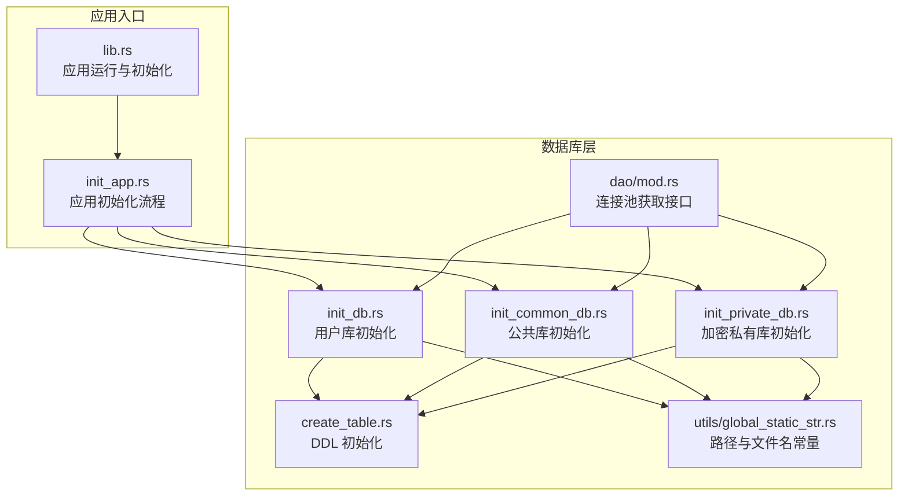
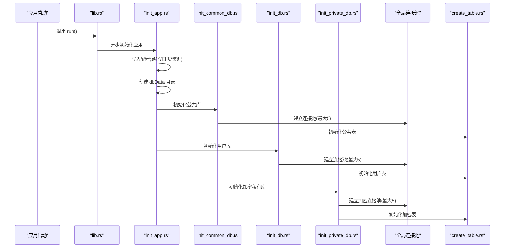
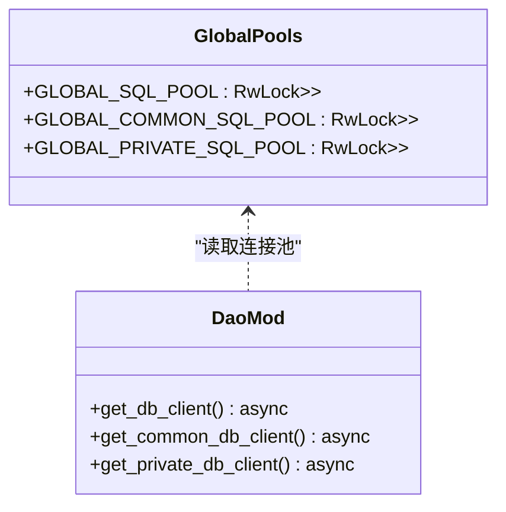
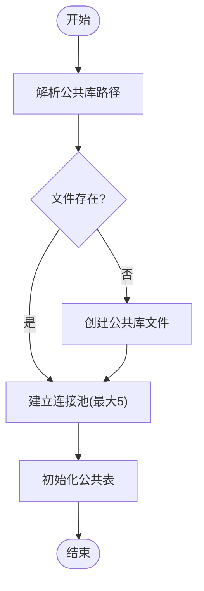
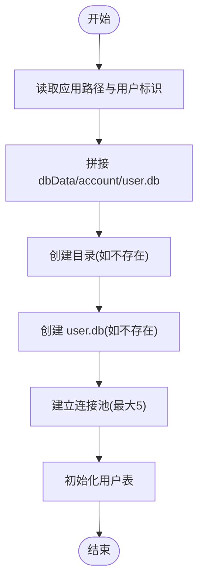
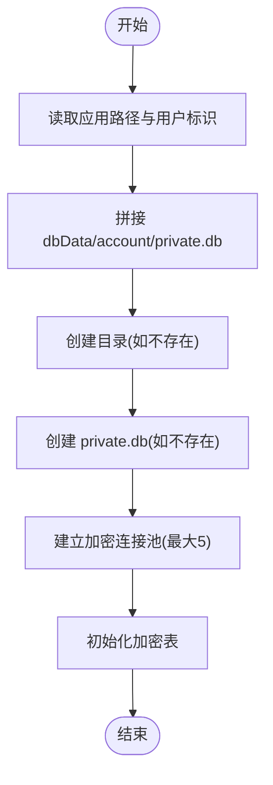
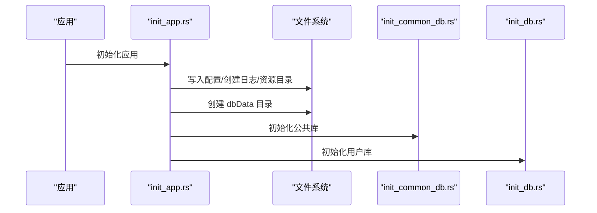
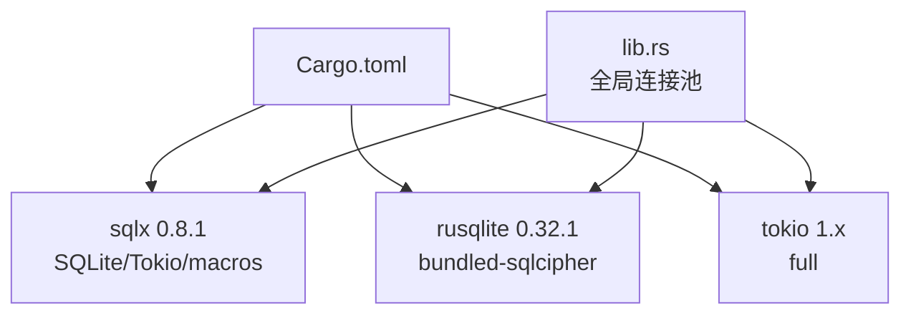

# 数据库架构设计

<cite>
**本文引用的文件**
- [src-tauri/src/lib.rs](file://src-tauri/src/lib.rs)
- [src-tauri/src/init_app.rs](file://src-tauri/src/init_app.rs)
- [src-tauri/src/dao/mod.rs](file://src-tauri/src/dao/mod.rs)
- [src-tauri/src/dao/init_db.rs](file://src-tauri/src/dao/init_db.rs)
- [src-tauri/src/dao/init_common_db.rs](file://src-tauri/src/dao/init_common_db.rs)
- [src-tauri/src/dao/init_private_db.rs](file://src-tauri/src/dao/init_private_db.rs)
- [src-tauri/src/dao/create_table.rs](file://src-tauri/src/dao/create_table.rs)
- [src-tauri/src/utils/global_static_str.rs](file://src-tauri/src/utils/global_static_str.rs)
- [src-tauri/Cargo.toml](file://src-tauri/Cargo.toml)
</cite>

## 目录

1. [引言](#引言)
2. [项目结构](#项目结构)
3. [核心组件](#核心组件)
4. [架构总览](#架构总览)
5. [详细组件分析](#详细组件分析)
6. [依赖关系分析](#依赖关系分析)
7. [性能考量](#性能考量)
8. [故障排查指南](#故障排查指南)
9. [结论](#结论)
10. [附录](#附录)

## 引言

本文件系统化阐述即时通讯应用在 Tauri 后端采用 SQLite 本地数据库的架构设计与实现细节。重点包括：

- 技术决策：为何选择 SQLite 本地数据库，以及结合 SQLCipher 实现数据库级加密的策略
- 连接池配置与并发控制：连接池大小、线程模型、并发访问保护
- 初始化流程：应用启动时的路径管理、数据库文件创建与表结构初始化
- 多用户隔离：用户目录结构、数据库文件组织方式与命名规范
- 安全与备份：加密密钥管理、备份建议与故障恢复思路
- 性能调优与资源管理：连接池参数、事务与索引策略、日志与磁盘空间

## 项目结构

后端以 Rust + Tauri 构建，数据库相关代码集中在 src-tauri/src 下的 dao、utils、config 等模块中；全局连接池通过 lib.rs 中的静态变量进行统一持有。



图表来源

- [src-tauri/src/lib.rs:79-115](file://src-tauri/src/lib.rs#L79-L115)
- [src-tauri/src/init_app.rs:19-91](file://src-tauri/src/init_app.rs#L19-L91)
- [src-tauri/src/dao/mod.rs:18-39](file://src-tauri/src/dao/mod.rs#L18-L39)
- [src-tauri/src/dao/init_db.rs:17-41](file://src-tauri/src/dao/init_db.rs#L17-L41)
- [src-tauri/src/dao/init_common_db.rs:13-37](file://src-tauri/src/dao/init_common_db.rs#L13-L37)
- [src-tauri/src/dao/init_private_db.rs:21-61](file://src-tauri/src/dao/init_private_db.rs#L21-L61)
- [src-tauri/src/dao/create_table.rs:14-54](file://src-tauri/src/dao/create_table.rs#L14-L54)
- [src-tauri/src/utils/global_static_str.rs:28-47](file://src-tauri/src/utils/global_static_str.rs#L28-L47)

章节来源

- [src-tauri/src/lib.rs:79-115](file://src-tauri/src/lib.rs#L79-L115)
- [src-tauri/src/init_app.rs:19-91](file://src-tauri/src/init_app.rs#L19-L91)

## 核心组件

- 全局连接池
  - 用户库连接池：通过全局静态变量持有，供业务模块按需获取
  - 公共库连接池：独立于用户库，用于存放公共资源
  - 加密私有库连接池：基于 SQLCipher 的加密连接池
- 初始化流程
  - 应用启动时先写入配置（应用根路径、日志路径、资源路径等），再创建 dbData 目录
  - 分别初始化公共库与用户库，并在各自连接池上执行 DDL
- 连接池配置
  - 最大连接数：每个连接池最大 5 个连接
  - 运行时：Tokio 异步运行时
  - 编解码：SQLx 提供的 SQLite 支持
- 多用户隔离
  - 每个用户拥有独立的数据库文件，位于用户目录下
  - 公共库与加密私有库独立于用户目录，分别存放公共资源与加密消息链

章节来源

- [src-tauri/src/lib.rs:68-75](file://src-tauri/src/lib.rs#L68-L75)
- [src-tauri/src/dao/mod.rs:18-39](file://src-tauri/src/dao/mod.rs#L18-L39)
- [src-tauri/src/dao/init_db.rs:22-41](file://src-tauri/src/dao/init_db.rs#L22-L41)
- [src-tauri/src/dao/init_common_db.rs:18-37](file://src-tauri/src/dao/init_common_db.rs#L18-L37)
- [src-tauri/src/dao/init_private_db.rs:26-61](file://src-tauri/src/dao/init_private_db.rs#L26-L61)

## 架构总览

下图展示应用启动到数据库初始化的关键交互，以及连接池与各库之间的关系。



图表来源

- [src-tauri/src/lib.rs:94-115](file://src-tauri/src/lib.rs#L94-L115)
- [src-tauri/src/init_app.rs:66-91](file://src-tauri/src/init_app.rs#L66-L91)
- [src-tauri/src/dao/init_common_db.rs:13-37](file://src-tauri/src/dao/init_common_db.rs#L13-L37)
- [src-tauri/src/dao/init_db.rs:17-41](file://src-tauri/src/dao/init_db.rs#L17-L41)
- [src-tauri/src/dao/init_private_db.rs:21-61](file://src-tauri/src/dao/init_private_db.rs#L21-L61)
- [src-tauri/src/dao/create_table.rs:14-54](file://src-tauri/src/dao/create_table.rs#L14-L54)

## 详细组件分析

### 组件一：全局连接池与获取接口

- 设计要点
  - 三个全局连接池：用户库、公共库、加密私有库
  - 通过读写锁保护全局池，提供异步获取接口
  - 私有库当前复用用户库连接池（保持一致性）
- 并发控制
  - 读写锁保证并发安全
  - 连接池自身具备内部同步，避免竞态



图表来源

- [src-tauri/src/lib.rs:68-75](file://src-tauri/src/lib.rs#L68-L75)
- [src-tauri/src/dao/mod.rs:18-39](file://src-tauri/src/dao/mod.rs#L18-L39)

章节来源

- [src-tauri/src/lib.rs:68-75](file://src-tauri/src/lib.rs#L68-L75)
- [src-tauri/src/dao/mod.rs:18-39](file://src-tauri/src/dao/mod.rs#L18-L39)

### 组件二：公共数据库初始化

- 初始化步骤
  - 解析公共数据库文件路径，若不存在则创建
  - 建立连接池（最大 5 连接）
  - 初始化公共表结构
- 文件组织
  - 公共库文件位于 dbData/common.db



图表来源

- [src-tauri/src/dao/init_common_db.rs:13-37](file://src-tauri/src/dao/init_common_db.rs#L13-L37)
- [src-tauri/src/dao/create_table.rs:14-23](file://src-tauri/src/dao/create_table.rs#L14-L23)

章节来源

- [src-tauri/src/dao/init_common_db.rs:13-37](file://src-tauri/src/dao/init_common_db.rs#L13-L37)
- [src-tauri/src/dao/create_table.rs:14-23](file://src-tauri/src/dao/create_table.rs#L14-L23)

### 组件三：用户数据库初始化

- 初始化步骤
  - 读取应用根路径与当前用户标识
  - 在用户目录下创建 dbData/<account>/user.db
  - 建立连接池（最大 5 连接）
  - 初始化用户相关表（会话、消息、好友、系统通知等）
- 多用户隔离
  - 每个账户拥有独立目录与独立数据库文件
  - 不同账户之间天然隔离



图表来源

- [src-tauri/src/dao/init_db.rs:43-74](file://src-tauri/src/dao/init_db.rs#L43-L74)
- [src-tauri/src/utils/global_static_str.rs:28-47](file://src-tauri/src/utils/global_static_str.rs#L28-L47)
- [src-tauri/src/dao/create_table.rs:26-41](file://src-tauri/src/dao/create_table.rs#L26-L41)

章节来源

- [src-tauri/src/dao/init_db.rs:17-74](file://src-tauri/src/dao/init_db.rs#L17-L74)
- [src-tauri/src/utils/global_static_str.rs:28-47](file://src-tauri/src/utils/global_static_str.rs#L28-L47)
- [src-tauri/src/dao/create_table.rs:26-41](file://src-tauri/src/dao/create_table.rs#L26-L41)

### 组件四：加密私有数据库初始化（SQLCipher）

- 初始化步骤
  - 读取应用根路径与当前用户标识
  - 在用户目录下创建 dbData/<account>/private.db
  - 使用连接选项启用 create_if_missing 并注入加密密钥
  - 建立连接池（最大 5 连接）
  - 初始化加密表结构
- 安全特性
  - 通过 SQLCipher 对数据库文件进行透明加密
  - 加密密钥由常量提供，便于统一管理



图表来源

- [src-tauri/src/dao/init_private_db.rs:21-61](file://src-tauri/src/dao/init_private_db.rs#L21-L61)
- [src-tauri/src/utils/global_static_str.rs:44-47](file://src-tauri/src/utils/global_static_str.rs#L44-L47)
- [src-tauri/src/dao/create_table.rs:44-54](file://src-tauri/src/dao/create_table.rs#L44-L54)

章节来源

- [src-tauri/src/dao/init_private_db.rs:21-61](file://src-tauri/src/dao/init_private_db.rs#L21-L61)
- [src-tauri/src/utils/global_static_str.rs:44-47](file://src-tauri/src/utils/global_static_str.rs#L44-L47)
- [src-tauri/src/dao/create_table.rs:44-54](file://src-tauri/src/dao/create_table.rs#L44-L54)

### 组件五：DDL 初始化与实体映射

- 公共库 DDL：初始化文件记录等公共资源表
- 用户库 DDL：初始化会话、消息、好友、系统通知等表
- 加密私有库 DDL：初始化消息链相关表（加密）

```mermaid
classDiagram
class CreateTable {
+init_common_ddl(pool)
+init_user_ddl(pool)
+init_private_ddl(pool)
}
class Entities {
<<tables>>
"ChatRecordRead"
"ChatSession"
"Friend"
"SystemNotification"
"ChatRecord"
"ChatRecordSend"
"ChatRecordAck"
"FileRecord"
}
CreateTable --> Entities : "创建表"
```

图表来源

- [src-tauri/src/dao/create_table.rs:14-54](file://src-tauri/src/dao/create_table.rs#L14-L54)

章节来源

- [src-tauri/src/dao/create_table.rs:14-54](file://src-tauri/src/dao/create_table.rs#L14-L54)

### 组件六：应用启动与路径管理

- 初始化流程
  - 写入应用根路径、日志路径、资源路径等配置
  - 创建 dbData 目录
  - 初始化公共库与用户库
- 资源复制（移动端）
  - 将打包资源复制到应用可访问目录，确保图片等资源可用



图表来源

- [src-tauri/src/init_app.rs:19-91](file://src-tauri/src/init_app.rs#L19-L91)

章节来源

- [src-tauri/src/init_app.rs:19-91](file://src-tauri/src/init_app.rs#L19-L91)

## 依赖关系分析

- 运行时与库依赖
  - SQLx 0.8.1（SQLite、Tokio 运行时、宏）
  - rusqlite 0.32.1（启用 bundled-sqlcipher）
  - Tokio 全功能运行时
- 连接池与并发
  - 每个库独立连接池，最大 5 连接
  - 通过读写锁保护全局连接池，避免竞态
- 外部集成点
  - Tauri 插件（对话框、文件系统）用于资源复制与路径解析



图表来源

- [src-tauri/Cargo.toml:46-48](file://src-tauri/Cargo.toml#L46-L48)
- [src-tauri/src/lib.rs:68-75](file://src-tauri/src/lib.rs#L68-L75)

章节来源

- [src-tauri/Cargo.toml:46-48](file://src-tauri/Cargo.toml#L46-L48)
- [src-tauri/src/lib.rs:68-75](file://src-tauri/src/lib.rs#L68-L75)

## 性能考量

- 连接池参数
  - 每个连接池最大 5 个连接，适合桌面/移动端单进程场景
  - 若业务并发较高，可评估提升 max_connections 并配合事务批处理
- 事务与批处理
  - 对批量插入/更新建议使用事务包裹，减少 WAL 刷新开销
- 索引与查询
  - 针对高频查询字段（时间戳、会话 ID、消息 ID）建立合适索引
- I/O 优化
  - SQLite 适合中小规模数据；若消息体量增长，建议分表或归档旧数据
- 日志与磁盘
  - 日志滚动与保留策略降低磁盘压力；定期清理 dbData 与日志目录

## 故障排查指南

- 初始化失败
  - 检查应用根路径与用户标识是否正确解析
  - 确认 dbData 目录权限可写
- 连接池为空
  - 确认初始化流程已执行且未早退
  - 检查全局连接池的读写锁是否被意外阻塞
- 加密库不可用
  - 确认 SQLCipher 已正确编译（bundled-sqlcipher）
  - 校验加密密钥是否一致
- 表结构异常
  - 检查 DDL 初始化是否成功执行
  - 确认实体定义与表结构匹配

章节来源

- [src-tauri/src/dao/init_db.rs:17-41](file://src-tauri/src/dao/init_db.rs#L17-L41)
- [src-tauri/src/dao/init_common_db.rs:13-37](file://src-tauri/src/dao/init_common_db.rs#L13-L37)
- [src-tauri/src/dao/init_private_db.rs:21-61](file://src-tauri/src/dao/init_private_db.rs#L21-L61)
- [src-tauri/src/dao/create_table.rs:14-54](file://src-tauri/src/dao/create_table.rs#L14-L54)

## 结论

该数据库架构以 SQLite 为核心，结合 SQLCipher 实现数据库级加密，满足即时通讯应用对本地存储、多用户隔离与数据安全的需求。通过独立连接池与严格的初始化流程，系统在小到中等规模的数据量下具备良好的稳定性与可维护性。针对更高并发与更大体量，建议引入事务批处理、索引优化与数据归档策略。

## 附录

- 关键配置与常量
  - 路径与文件名常量集中于 utils/global_static_str.rs
  - 连接池最大连接数：5
  - 加密密钥：REDACTED_DB_ENCRYPTION_KEY
- 建议的安全与备份实践
  - 定期备份 dbData 目录
  - 对加密私有库进行异地备份
  - 严格管理加密密钥，避免硬编码泄露
  - 定期审计日志，监控初始化与连接池状态

章节来源

- [src-tauri/src/utils/global_static_str.rs:28-47](file://src-tauri/src/utils/global_static_str.rs#L28-L47)
- [src-tauri/src/dao/init_private_db.rs:27-29](file://src-tauri/src/dao/init_private_db.rs#L27-L29)
