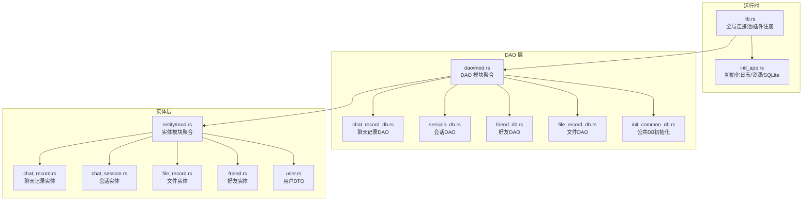
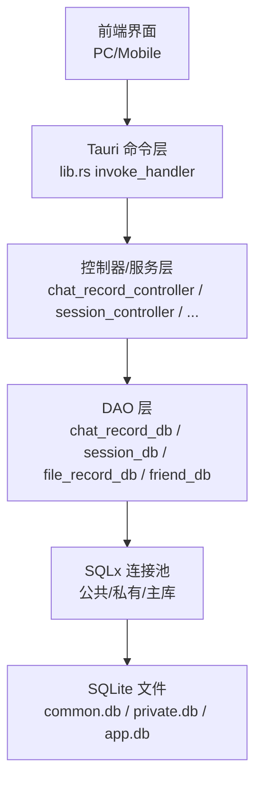
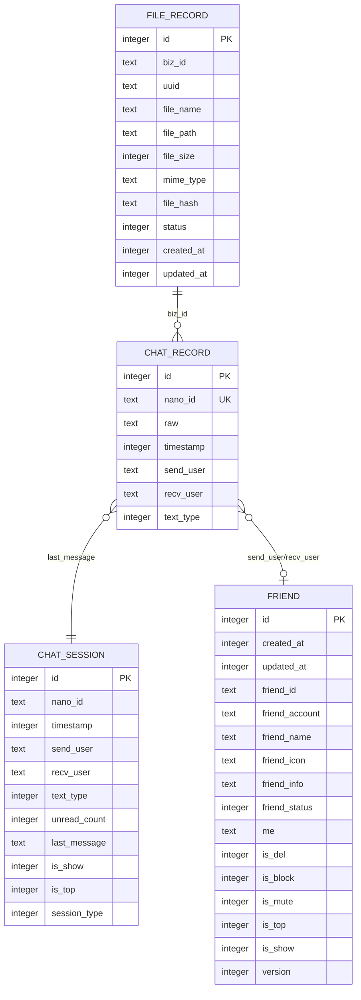
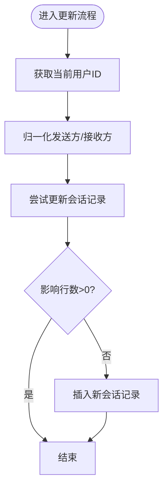
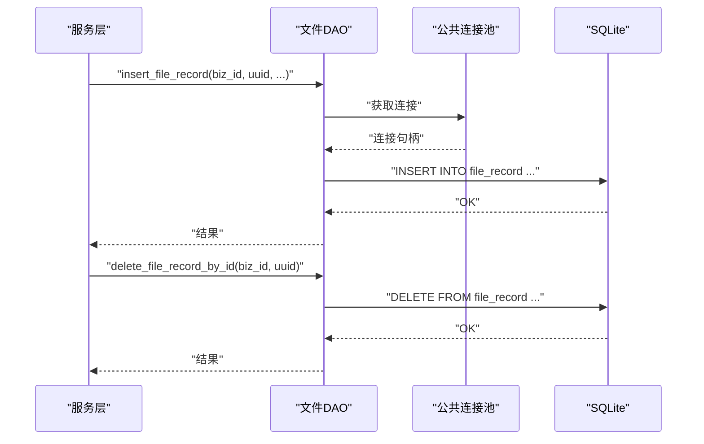
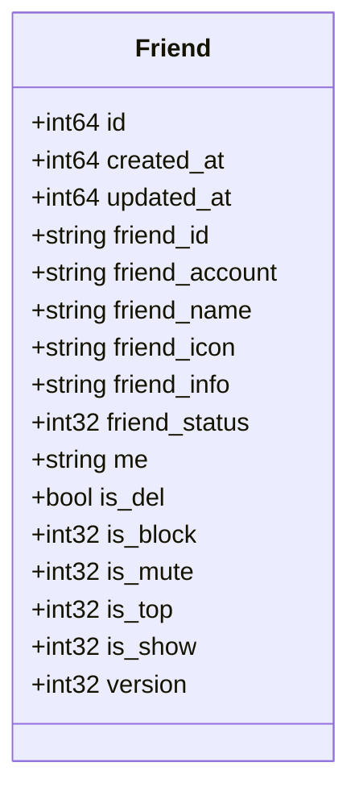
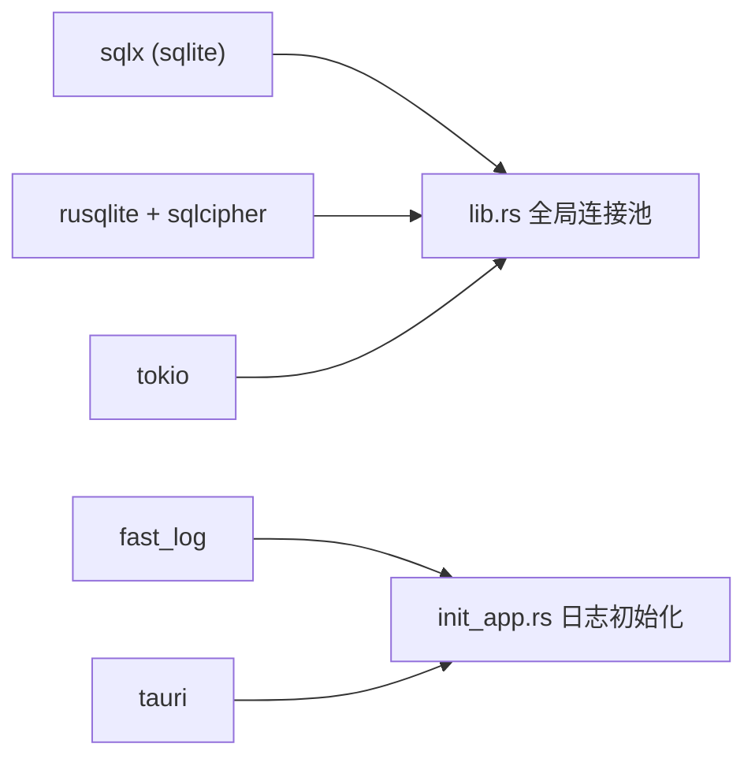

# 数据库设计

<cite>
**本文引用的文件**
- [Cargo.toml](file://src-tauri/Cargo.toml)
- [lib.rs](file://src-tauri/src/lib.rs)
- [init_app.rs](file://src-tauri/src/init_app.rs)
- [mod.rs（DAO）](file://src-tauri/src/dao/mod.rs)
- [chat_record_db.rs](file://src-tauri/src/dao/chat_record_db.rs)
- [session_db.rs](file://src-tauri/src/dao/session_db.rs)
- [file_record_db.rs](file://src-tauri/src/dao/file_record_db.rs)
- [friend_db.rs](file://src-tauri/src/dao/friend_db.rs)
- [init_common_db.rs](file://src-tauri/src/dao/init_common_db.rs)
- [chat_record.rs](file://src-tauri/src/entity/chat_record.rs)
- [chat_session.rs](file://src-tauri/src/entity/chat_session.rs)
- [file_record.rs](file://src-tauri/src/entity/file_record.rs)
- [friend.rs](file://src-tauri/src/entity/friend.rs)
- [user.rs](file://src-tauri/src/entity/user.rs)
</cite>

## 目录

1. [简介](#简介)
2. [项目结构](#项目结构)
3. [核心组件](#核心组件)
4. [架构总览](#架构总览)
5. [详细组件分析](#详细组件分析)
6. [依赖分析](#依赖分析)
7. [性能考虑](#性能考虑)
8. [故障排查指南](#故障排查指南)
9. [结论](#结论)
10. [附录](#附录)

## 简介

本文件面向即时通讯应用的数据库设计与实现，聚焦于本地 SQLite 存储策略、数据模型与关系映射、事务与并发控制、数据访问层抽象、ORM 使用模式以及迁移与运维实践。项目采用 Rust + Tauri 架构，后端以 SQLx 作为 ORM/查询构建器，rusqlite/sqlcipher 提供加密能力，结合全局连接池与模块化 DAO 层，支撑聊天记录、会话状态、好友关系与文件管理等核心业务。

## 项目结构

数据库相关代码主要分布在以下模块：

- 运行时与全局资源：lib.rs 中定义全局连接池、静态资源路径与应用初始化流程
- 应用初始化：init_app.rs 负责创建日志、资源与 SQLite 目录，并初始化公共数据库
- DAO 层：封装对 SQLite 的增删改查操作，按功能拆分为聊天记录、会话、文件、好友等模块
- 实体层：定义与表结构对应的结构体，实现通用的表创建接口
- 依赖声明：Cargo.toml 中启用 sqlx sqlite、rusqlite(sqlcipher) 等特性

图表来源

- [lib.rs:1-167](file://src-tauri/src/lib.rs#L1-L167)
- [init_app.rs:1-186](file://src-tauri/src/init_app.rs#L1-L186)
- [dao/mod.rs:1-39](file://src-tauri/src/dao/mod.rs#L1-L39)
- [entity/mod.rs:1-23](file://src-tauri/src/entity/mod.rs#L1-L23)

章节来源

- [lib.rs:1-167](file://src-tauri/src/lib.rs#L1-L167)
- [init_app.rs:1-186](file://src-tauri/src/init_app.rs#L1-L186)
- [dao/mod.rs:1-39](file://src-tauri/src/dao/mod.rs#L1-L39)
- [entity/mod.rs:1-23](file://src-tauri/src/entity/mod.rs#L1-L23)

## 核心组件

- 连接池与全局状态
  - 全局连接池：公共数据库、私有数据库（加密）与主数据库分别持有独立连接池，通过全局写锁保护
  - 初始化流程：应用启动时创建日志、资源与 SQLite 目录，随后初始化公共数据库并创建表
- DAO 抽象
  - 统一的数据库客户端获取函数：get_db_client、get_common_db_client、get_private_db_client
  - 各领域 DAO 聚合查询、插入、更新与软删除等操作
- 实体与表结构
  - 聊天记录、会话、文件、好友等实体均实现通用的表创建接口，确保建表一致性
- ORM 与查询
  - 使用 SQLx 的查询宏与参数绑定，避免 SQL 注入；部分复杂查询采用子查询与排序组合实现分页与类型过滤

章节来源

- [lib.rs:57-75](file://src-tauri/src/lib.rs#L57-L75)
- [init_app.rs:19-91](file://src-tauri/src/init_app.rs#L19-L91)
- [dao/mod.rs:18-39](file://src-tauri/src/dao/mod.rs#L18-L39)
- [entity/chat_record.rs:19-61](file://src-tauri/src/entity/chat_record.rs#L19-L61)
- [entity/chat_session.rs:41-72](file://src-tauri/src/entity/chat_session.rs#L41-L72)
- [entity/file_record.rs:36-83](file://src-tauri/src/entity/file_record.rs#L36-L83)
- [entity/friend.rs:27-63](file://src-tauri/src/entity/friend.rs#L27-L63)

## 架构总览

下图展示数据库层在应用中的位置与交互关系：前端通过 Tauri 桥接到后端命令，后端路由至对应控制器，再调用 DAO 层执行 SQL 操作，最终落库到 SQLite。

图表来源

- [lib.rs:117-166](file://src-tauri/src/lib.rs#L117-L166)
- [chat_record_db.rs:1-106](file://src-tauri/src/dao/chat_record_db.rs#L1-L106)
- [session_db.rs:1-117](file://src-tauri/src/dao/session_db.rs#L1-L117)
- [file_record_db.rs:1-49](file://src-tauri/src/dao/file_record_db.rs#L1-L49)
- [friend_db.rs:1-93](file://src-tauri/src/dao/friend_db.rs#L1-L93)

## 详细组件分析

### 聊天记录数据模型与存储策略

- 表结构要点
  - 主键自增 id
  - nano_id 唯一，用于消息幂等与去重
  - 发送方/接收方字段用于双向检索
  - 时间戳用于排序与分页
  - 文本类型字段用于区分消息类型（如原生文本、JSON 等）
- 查询与分页
  - 支持按双方用户 ID 查询对话历史，先按时间倒序限制条数，再正序输出保证顺序
  - 支持按消息类型过滤与分页
  - 支持按消息 ID 与用户维度查询单条记录
- 并发与一致性
  - 私有数据库连接池用于加密存储聊天记录
  - 查询使用参数绑定，避免注入风险
- 关系映射
  - 与会话表通过 send_user/recv_user 字段关联
  - 与已读标记表通过时间戳范围关联

图表来源

- [chat_record.rs:19-44](file://src-tauri/src/entity/chat_record.rs#L19-L44)
- [chat_session.rs:41-62](file://src-tauri/src/entity/chat_session.rs#L41-L62)
- [file_record.rs:36-68](file://src-tauri/src/entity/file_record.rs#L36-L68)
- [friend.rs:27-53](file://src-tauri/src/entity/friend.rs#L27-L53)

章节来源

- [chat_record.rs:8-61](file://src-tauri/src/entity/chat_record.rs#L8-L61)
- [chat_record_db.rs:7-106](file://src-tauri/src/dao/chat_record_db.rs#L7-L106)

### 会话状态数据模型与存储策略

- 表结构要点
  - 唯一键约束：(send_user, recv_user)，确保每对用户仅有一条会话记录
  - 未读计数、置顶与显示开关字段
  - 最新消息内容与时间戳用于界面展示
- 更新策略
  - 优先更新现有会话；若无匹配记录则插入新会话
  - 支持本地更新（仅更新展示与置顶状态）
- 关联查询
  - 与好友表左连接，补充头像与名称等信息
  - 仅返回 is_show = 1 的会话

图表来源

- [session_db.rs:8-48](file://src-tauri/src/dao/session_db.rs#L8-L48)

章节来源

- [chat_session.rs:8-72](file://src-tauri/src/entity/chat_session.rs#L8-L72)
- [session_db.rs:1-117](file://src-tauri/src/dao/session_db.rs#L1-L117)

### 文件管理数据模型与存储策略

- 表结构要点
  - 业务 ID biz_id 与 UUID 双维度索引字段，便于按业务与文件唯一标识检索
  - MIME 类型与哈希值用于识别与去重
  - 状态位区分正常/删除/临时文件
  - 创建与更新时间戳用于排序与清理
- 操作接口
  - 插入文件记录（状态初始为正常）
  - 按 biz_id 与 UUID 删除记录
  - 按 biz_id 查询所有正常状态的记录

图表来源

- [file_record_db.rs:7-49](file://src-tauri/src/dao/file_record_db.rs#L7-L49)
- [file_record.rs:36-83](file://src-tauri/src/entity/file_record.rs#L36-L83)

章节来源

- [file_record.rs:9-83](file://src-tauri/src/entity/file_record.rs#L9-L83)
- [file_record_db.rs:1-49](file://src-tauri/src/dao/file_record_db.rs#L1-L49)

### 好友关系数据模型与存储策略

- 表结构要点
  - 唯一键约束：(friend_id, me)，确保同一用户对同一好友仅一条记录
  - 软删除字段 is_del 与屏蔽/免打扰/置顶/显示等状态位
  - 版本号用于并发冲突检测
- 操作接口
  - 查询某用户的所有有效好友
  - 按用户与好友 ID 查询单条记录
  - 软删除（设置 is_del 与 is_show）
  - 更新或插入好友信息

图表来源

- [friend.rs:7-63](file://src-tauri/src/entity/friend.rs#L7-L63)

章节来源

- [friend.rs:1-63](file://src-tauri/src/entity/friend.rs#L1-L63)
- [friend_db.rs:1-93](file://src-tauri/src/dao/friend_db.rs#L1-L93)

### 用户信息与认证（数据模型）

- 用户登录结果 DTO 定义了统一响应结构，便于前后端约定
- 用户信息在会话与好友等场景中被引用，建议在应用层维护轻量级用户缓存

章节来源

- [user.rs:1-9](file://src-tauri/src/entity/user.rs#L1-L9)

## 依赖分析

- ORM 与驱动
  - SQLx：SQLite 连接池、查询宏、参数绑定
  - rusqlite + sqlcipher：提供加密能力（bundled-sqlcipher 特性）
- 并发与线程
  - Tokio 异步运行时，配合 RwLock 与 Arc 管理全局连接池
- 日志与配置
  - fast_log：按日期滚动的日志文件
  - Tauri 路径解析：跨平台定位文档/应用数据目录

图表来源

- [Cargo.toml:46-48](file://src-tauri/Cargo.toml#L46-L48)
- [lib.rs:57-75](file://src-tauri/src/lib.rs#L57-L75)
- [init_app.rs:168-186](file://src-tauri/src/init_app.rs#L168-L186)

章节来源

- [Cargo.toml:1-62](file://src-tauri/Cargo.toml#L1-L62)
- [lib.rs:1-167](file://src-tauri/src/lib.rs#L1-L167)
- [init_app.rs:1-186](file://src-tauri/src/init_app.rs#L1-L186)

## 性能考虑

- 连接池与并发
  - 公共数据库连接池最大连接数为 5，建议根据设备性能与 I/O 密集度调整
  - 使用全局写锁保护连接池赋值，读多写少场景下可考虑读写分离
- 查询优化
  - 聊天记录与会话查询涉及多条件与排序，建议在 send_user/recv_user 上建立复合索引（当前表结构已具备唯一约束，可满足常见查询）
  - 分页查询使用子查询+limit+offset，注意大数据量下的偏移开销，必要时引入基于游标的时间戳分页
- IO 与磁盘
  - SQLite 适合中小规模本地存储；大体量消息建议分表或按月归档
  - 文件记录表按 biz_id 查询，建议为 biz_id 建立索引以提升检索效率
- 加密与安全
  - 使用 sqlcipher 对私有数据库进行透明加密，注意密钥管理与性能权衡

## 故障排查指南

- 连接池为空
  - 现象：获取数据库客户端报“获取失败”
  - 排查：确认 init_app 是否已完成公共数据库初始化；检查全局连接池赋值逻辑
- 查询异常
  - 现象：分页/过滤查询返回空或结果不正确
  - 排查：核对参数绑定顺序与字段类型；检查表结构是否与实体定义一致
- 唯一键冲突
  - 现象：插入会话或好友时报唯一约束冲突
  - 排查：确认 send_user/recv_user 或 (friend_id, me) 的组合是否重复
- 文件记录缺失
  - 现象：按 biz_id 查询不到文件
  - 排查：确认状态字段是否为正常；检查 biz_id 与 uuid 绑定是否正确

章节来源

- [dao/mod.rs:18-39](file://src-tauri/src/dao/mod.rs#L18-L39)
- [session_db.rs:28-46](file://src-tauri/src/dao/session_db.rs#L28-L46)
- [friend_db.rs:67-90](file://src-tauri/src/dao/friend_db.rs#L67-L90)
- [file_record_db.rs:38-49](file://src-tauri/src/dao/file_record_db.rs#L38-L49)

## 结论

本设计以 SQLite 为核心，结合 SQLx 的强类型查询与 rusqlite/sqlcipher 的加密能力，构建了覆盖聊天记录、会话状态、好友关系与文件管理的本地存储体系。通过模块化的 DAO 层与实体层抽象，实现了清晰的数据访问与稳定的表结构演进。建议后续完善索引策略、引入游标分页与定期归档，以进一步提升性能与可维护性。

## 附录

### 数据库初始化与目录结构

- 初始化步骤
  - 创建日志目录与日志文件
  - 创建资源目录与当月资源目录
  - 创建 SQLite 目录
  - 初始化公共数据库（common.db），创建表
- 目录约定
  - 日志路径、资源路径、SQLite 路径通过配置常量集中管理

章节来源

- [init_app.rs:19-91](file://src-tauri/src/init_app.rs#L19-L91)

### 表结构与字段类型摘要

- 聊天记录表
  - 字段：id（自增）、nano_id（唯一）、raw、timestamp、send_user、recv_user、text_type
  - 约束：UNIQUE(nano_id)
- 会话表
  - 字段：id（自增）、nano_id、timestamp、send_user、recv_user、text_type、unread_count、last_message、is_show、is_top、session_type
  - 约束：UNIQUE(send_user, recv_user)
- 文件记录表
  - 字段：id（自增）、biz_id、uuid、file_name、file_path、file_size、mime_type、file_hash、status、created_at、updated_at
- 好友表
  - 字段：id（自增）、created_at、updated_at、friend_id、friend_account、friend_name、friend_icon、friend_info、friend_status、me、is_del、is_block、is_mute、is_top、is_show、version
  - 约束：UNIQUE(friend_id, me)

章节来源

- [chat_record.rs:19-44](file://src-tauri/src/entity/chat_record.rs#L19-L44)
- [chat_session.rs:41-62](file://src-tauri/src/entity/chat_session.rs#L41-L62)
- [file_record.rs:36-68](file://src-tauri/src/entity/file_record.rs#L36-L68)
- [friend.rs:27-53](file://src-tauri/src/entity/friend.rs#L27-L53)
