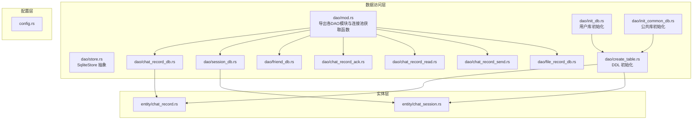
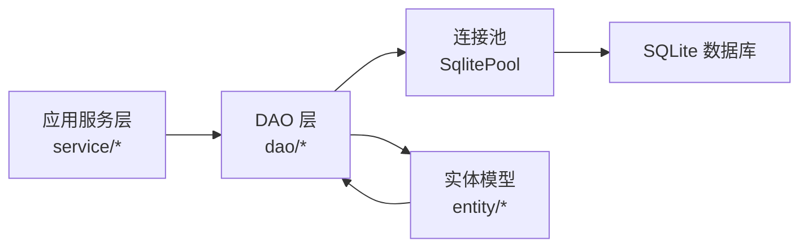
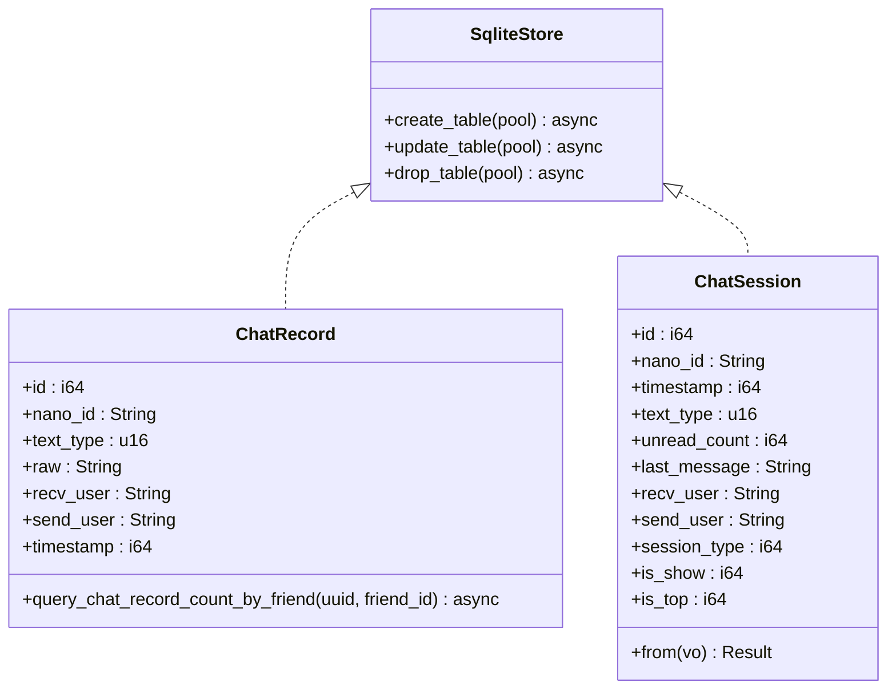
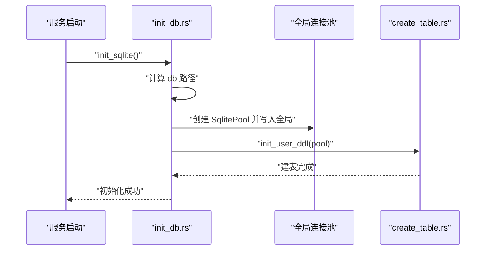
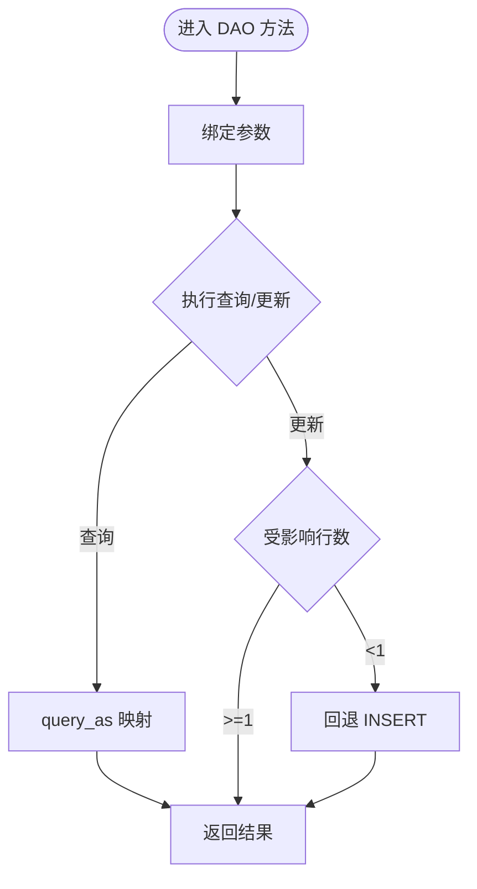
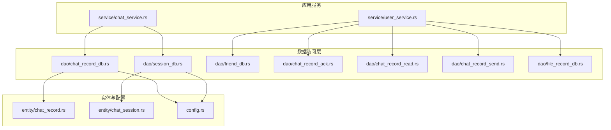
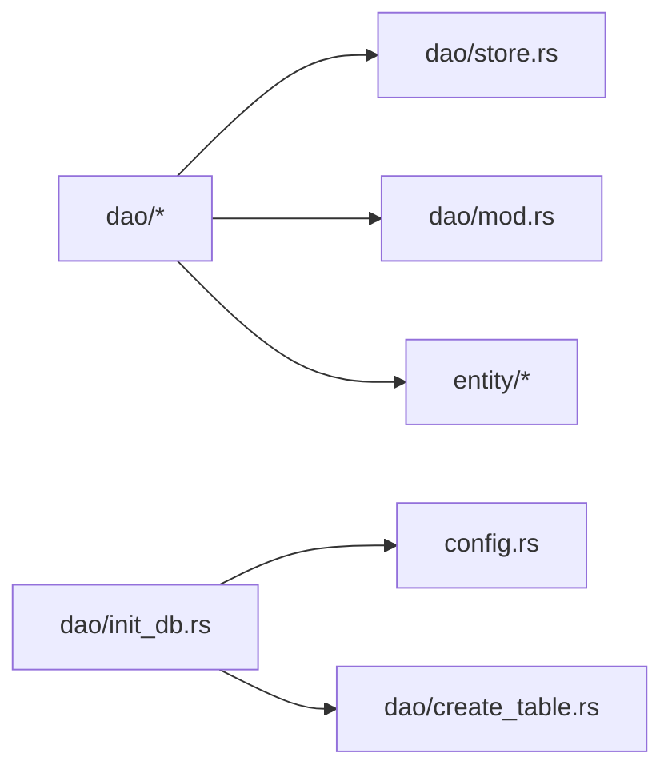

# 数据访问层

<cite>
**本文引用的文件**
- [src-tauri/src/dao/mod.rs](file://src-tauri/src/dao/mod.rs)
- [src-tauri/src/dao/init_db.rs](file://src-tauri/src/dao/init_db.rs)
- [src-tauri/src/dao/init_common_db.rs](file://src-tauri/src/dao/init_common_db.rs)
- [src-tauri/src/dao/store.rs](file://src-tauri/src/dao/store.rs)
- [src-tauri/src/dao/create_table.rs](file://src-tauri/src/dao/create_table.rs)
- [src-tauri/src/dao/chat_record_db.rs](file://src-tauri/src/dao/chat_record_db.rs)
- [src-tauri/src/dao/session_db.rs](file://src-tauri/src/dao/session_db.rs)
- [src-tauri/src/dao/friend_db.rs](file://src-tauri/src/dao/friend_db.rs)
- [src-tauri/src/dao/chat_record_ack.rs](file://src-tauri/src/dao/chat_record_ack.rs)
- [src-tauri/src/dao/chat_record_read.rs](file://src-tauri/src/dao/chat_record_read.rs)
- [src-tauri/src/dao/chat_record_send.rs](file://src-tauri/src/dao/chat_record_send.rs)
- [src-tauri/src/dao/file_record_db.rs](file://src-tauri/src/dao/file_record_db.rs)
- [src-tauri/src/entity/chat_record.rs](file://src-tauri/src/entity/chat_record.rs)
- [src-tauri/src/entity/chat_session.rs](file://src-tauri/src/entity/chat_session.rs)
- [src-tauri/src/config.rs](file://src-tauri/src/config.rs)
</cite>

## 目录

1. [引言](#引言)
2. [项目结构](#项目结构)
3. [核心组件](#核心组件)
4. [架构总览](#架构总览)
5. [详细组件分析](#详细组件分析)
6. [依赖分析](#依赖分析)
7. [性能考量](#性能考量)
8. [故障排查指南](#故障排查指南)
9. [结论](#结论)
10. [附录](#附录)

## 引言

本文件面向即时通讯应用的数据访问层，系统化阐述 DAO（数据访问对象）模式在 Rust + Tauri 后端中的落地实践。内容涵盖：

- DAO 抽象与接口定义、实现规范
- SQL 查询封装、参数绑定与结果映射
- 连接池初始化与使用策略
- 表结构初始化与迁移思路
- 错误处理与日志记录
- 安全性、并发控制与资源管理建议

## 项目结构

数据访问层位于后端工程的 src-tauri 子树下，采用“按功能域划分”的模块组织方式：

- dao：DAO 层，负责数据库操作与连接池访问
- entity：实体模型，承载表结构与 ORM 映射
- config：全局配置读写工具
- 其他子模块：service、utils 等与 DAO 协同工作

图表来源

- [src-tauri/src/dao/mod.rs:1-39](file://src-tauri/src/dao/mod.rs#L1-L39)
- [src-tauri/src/dao/init_db.rs:1-75](file://src-tauri/src/dao/init_db.rs#L1-L75)
- [src-tauri/src/dao/init_common_db.rs:1-49](file://src-tauri/src/dao/init_common_db.rs#L1-L49)
- [src-tauri/src/dao/store.rs:1-21](file://src-tauri/src/dao/store.rs#L1-L21)
- [src-tauri/src/dao/create_table.rs:1-55](file://src-tauri/src/dao/create_table.rs#L1-L55)
- [src-tauri/src/dao/chat_record_db.rs:1-106](file://src-tauri/src/dao/chat_record_db.rs#L1-L106)
- [src-tauri/src/dao/session_db.rs:1-117](file://src-tauri/src/dao/session_db.rs#L1-L117)
- [src-tauri/src/dao/friend_db.rs:1-93](file://src-tauri/src/dao/friend_db.rs#L1-L93)
- [src-tauri/src/dao/chat_record_ack.rs:1-77](file://src-tauri/src/dao/chat_record_ack.rs#L1-L77)
- [src-tauri/src/dao/chat_record_read.rs:1-25](file://src-tauri/src/dao/chat_record_read.rs#L1-L25)
- [src-tauri/src/dao/chat_record_send.rs:1-104](file://src-tauri/src/dao/chat_record_send.rs#L1-L104)
- [src-tauri/src/dao/file_record_db.rs:1-49](file://src-tauri/src/dao/file_record_db.rs#L1-L49)
- [src-tauri/src/entity/chat_record.rs:1-61](file://src-tauri/src/entity/chat_record.rs#L1-L61)
- [src-tauri/src/entity/chat_session.rs:1-72](file://src-tauri/src/entity/chat_session.rs#L1-L72)
- [src-tauri/src/config.rs:1-155](file://src-tauri/src/config.rs#L1-L155)

章节来源

- [src-tauri/src/dao/mod.rs:1-39](file://src-tauri/src/dao/mod.rs#L1-L39)
- [src-tauri/src/dao/init_db.rs:17-75](file://src-tauri/src/dao/init_db.rs#L17-L75)
- [src-tauri/src/dao/init_common_db.rs:13-49](file://src-tauri/src/dao/init_common_db.rs#L13-L49)
- [src-tauri/src/dao/store.rs:12-21](file://src-tauri/src/dao/store.rs#L12-L21)
- [src-tauri/src/dao/create_table.rs:26-55](file://src-tauri/src/dao/create_table.rs#L26-L55)

## 核心组件

- 连接池获取与路由
  - 提供三类数据库客户端获取方法：用户库、公共库、私有库（当前私有库复用用户库）
  - 通过全局读写锁保护连接池实例，避免并发竞态
- DDL 初始化
  - 统一调用 SqliteStore 抽象进行建表、更新、删除
  - 按库区分初始化：用户库、公共库、私有库
- DAO 方法族
  - 聊天记录：分页查询、按 ID 查询、插入、按类型过滤、最近消息等
  - 会话：更新、本地更新、查询、隐藏
  - 好友：查询、软删除、更新
  - 已读标记：更新
  - 发送状态：插入、成功标记、更新、条件查询
  - ACK：插入、查询、状态更新、前序 ID 更新
  - 文件记录：插入、删除
- 实体与映射
  - 实体实现 FromRow，并在各自模块内定义 CREATE TABLE 语句
  - DAO 侧通过 query_as 或 bind 参数化执行

章节来源

- [src-tauri/src/dao/mod.rs:18-39](file://src-tauri/src/dao/mod.rs#L18-L39)
- [src-tauri/src/dao/store.rs:3-21](file://src-tauri/src/dao/store.rs#L3-L21)
- [src-tauri/src/dao/create_table.rs:26-55](file://src-tauri/src/dao/create_table.rs#L26-L55)
- [src-tauri/src/dao/chat_record_db.rs:8-106](file://src-tauri/src/dao/chat_record_db.rs#L8-L106)
- [src-tauri/src/dao/session_db.rs:9-117](file://src-tauri/src/dao/session_db.rs#L9-L117)
- [src-tauri/src/dao/friend_db.rs:7-93](file://src-tauri/src/dao/friend_db.rs#L7-L93)
- [src-tauri/src/dao/chat_record_read.rs:5-25](file://src-tauri/src/dao/chat_record_read.rs#L5-L25)
- [src-tauri/src/dao/chat_record_send.rs:5-104](file://src-tauri/src/dao/chat_record_send.rs#L5-L104)
- [src-tauri/src/dao/chat_record_ack.rs:5-77](file://src-tauri/src/dao/chat_record_ack.rs#L5-L77)
- [src-tauri/src/dao/file_record_db.rs:8-49](file://src-tauri/src/dao/file_record_db.rs#L8-L49)
- [src-tauri/src/entity/chat_record.rs:8-61](file://src-tauri/src/entity/chat_record.rs#L8-L61)
- [src-tauri/src/entity/chat_session.rs:8-72](file://src-tauri/src/entity/chat_session.rs#L8-L72)

## 架构总览

数据访问层围绕“连接池 + DAO + 实体”三层展开，DAO 作为业务与数据库之间的唯一入口，统一参数绑定与结果映射。

图表来源

- [src-tauri/src/dao/mod.rs:18-39](file://src-tauri/src/dao/mod.rs#L18-L39)
- [src-tauri/src/dao/init_db.rs:22-41](file://src-tauri/src/dao/init_db.rs#L22-L41)
- [src-tauri/src/dao/init_common_db.rs:18-37](file://src-tauri/src/dao/init_common_db.rs#L18-L37)
- [src-tauri/src/dao/store.rs:12-21](file://src-tauri/src/dao/store.rs#L12-L21)

## 详细组件分析

### DAO 抽象与接口定义

- SqliteStore 抽象
  - 规定 create_table/update_table/drop_table 三个生命周期方法
  - init_sqlite 泛型函数统一调度建表、更新、删除流程
- 实体实现
  - 实体通过 FromRow 自动映射查询结果
  - 在实体模块内定义 CREATE TABLE 语句，确保结构与 DAO 查询一致

图表来源

- [src-tauri/src/dao/store.rs:3-21](file://src-tauri/src/dao/store.rs#L3-L21)
- [src-tauri/src/entity/chat_record.rs:8-61](file://src-tauri/src/entity/chat_record.rs#L8-L61)
- [src-tauri/src/entity/chat_session.rs:8-72](file://src-tauri/src/entity/chat_session.rs#L8-L72)

章节来源

- [src-tauri/src/dao/store.rs:3-21](file://src-tauri/src/dao/store.rs#L3-L21)
- [src-tauri/src/entity/chat_record.rs:8-61](file://src-tauri/src/entity/chat_record.rs#L8-L61)
- [src-tauri/src/entity/chat_session.rs:8-72](file://src-tauri/src/entity/chat_session.rs#L8-L72)

### 连接池初始化与使用

- 用户库初始化
  - 解析应用路径与用户账户，构造 db 文件路径
  - 创建连接池（最大连接数限制），写入全局变量
  - 通过 init_user_ddl 初始化用户库表结构
- 公共库初始化
  - 接收外部传入的公共库路径，创建连接池并初始化公共表
- 私有库
  - 当前实现复用用户库连接池；如需隔离可扩展独立池

图表来源

- [src-tauri/src/dao/init_db.rs:17-41](file://src-tauri/src/dao/init_db.rs#L17-L41)
- [src-tauri/src/dao/create_table.rs:26-41](file://src-tauri/src/dao/create_table.rs#L26-L41)

章节来源

- [src-tauri/src/dao/init_db.rs:17-75](file://src-tauri/src/dao/init_db.rs#L17-L75)
- [src-tauri/src/dao/init_common_db.rs:13-49](file://src-tauri/src/dao/init_common_db.rs#L13-L49)
- [src-tauri/src/dao/create_table.rs:14-55](file://src-tauri/src/dao/create_table.rs#L14-L55)

### SQL 查询封装、参数绑定与结果映射

- 参数绑定
  - 统一使用问号占位符与 bind 方法，避免 SQL 注入
  - 复杂查询（如 IN 条件）动态拼接占位符，保证安全与灵活性
- 结果映射
  - 使用 query_as 将结果映射到实体或 VO
  - 对可选结果使用 fetch_optional，避免异常中断
- 典型场景
  - 分页查询：先按时间倒序取上限，再正序输出
  - 条件查询：支持多状态 IN 查询、模糊匹配
  - 更新回退：若 rows_affected < 1 则回退为 INSERT

图表来源

- [src-tauri/src/dao/chat_record_send.rs:78-92](file://src-tauri/src/dao/chat_record_send.rs#L78-L92)
- [src-tauri/src/dao/chat_record_read.rs:14-24](file://src-tauri/src/dao/chat_record_read.rs#L14-L24)
- [src-tauri/src/dao/session_db.rs:28-47](file://src-tauri/src/dao/session_db.rs#L28-L47)

章节来源

- [src-tauri/src/dao/chat_record_db.rs:13-23](file://src-tauri/src/dao/chat_record_db.rs#L13-L23)
- [src-tauri/src/dao/chat_record_db.rs:26-40](file://src-tauri/src/dao/chat_record_db.rs#L26-L40)
- [src-tauri/src/dao/chat_record_db.rs:43-55](file://src-tauri/src/dao/chat_record_db.rs#L43-L55)
- [src-tauri/src/dao/chat_record_db.rs:88-105](file://src-tauri/src/dao/chat_record_db.rs#L88-L105)
- [src-tauri/src/dao/chat_record_send.rs:59-92](file://src-tauri/src/dao/chat_record_send.rs#L59-L92)
- [src-tauri/src/dao/chat_record_read.rs:5-24](file://src-tauri/src/dao/chat_record_read.rs#L5-L24)
- [src-tauri/src/dao/session_db.rs:9-48](file://src-tauri/src/dao/session_db.rs#L9-L48)

### 事务管理、错误处理与连接池策略

- 事务管理
  - 当前 DAO 未显式开启事务；对需要强一致性的场景（如会话更新+消息插入）建议在 service 层组合调用并使用事务包裹
- 错误处理
  - 统一返回 Result，使用 anyhow::anyhow 包装底层错误
  - 日志记录关键操作（如更新影响行数、插入文件记录）
- 连接池策略
  - 最大连接数固定为 5，适合桌面端低并发场景
  - 通过全局读写锁保护连接池，避免并发初始化与访问冲突

章节来源

- [src-tauri/src/dao/mod.rs:18-39](file://src-tauri/src/dao/mod.rs#L18-L39)
- [src-tauri/src/dao/init_db.rs:22-32](file://src-tauri/src/dao/init_db.rs#L22-L32)
- [src-tauri/src/dao/file_record_db.rs:34-36](file://src-tauri/src/dao/file_record_db.rs#L34-L36)

### 数据访问层架构图与组件交互

图表来源

- [src-tauri/src/dao/chat_record_db.rs:1-106](file://src-tauri/src/dao/chat_record_db.rs#L1-L106)
- [src-tauri/src/dao/session_db.rs:1-117](file://src-tauri/src/dao/session_db.rs#L1-L117)
- [src-tauri/src/dao/friend_db.rs:1-93](file://src-tauri/src/dao/friend_db.rs#L1-L93)
- [src-tauri/src/dao/chat_record_ack.rs:1-77](file://src-tauri/src/dao/chat_record_ack.rs#L1-L77)
- [src-tauri/src/dao/chat_record_read.rs:1-25](file://src-tauri/src/dao/chat_record_read.rs#L1-L25)
- [src-tauri/src/dao/chat_record_send.rs:1-104](file://src-tauri/src/dao/chat_record_send.rs#L1-L104)
- [src-tauri/src/dao/file_record_db.rs:1-49](file://src-tauri/src/dao/file_record_db.rs#L1-L49)
- [src-tauri/src/entity/chat_record.rs:1-61](file://src-tauri/src/entity/chat_record.rs#L1-L61)
- [src-tauri/src/entity/chat_session.rs:1-72](file://src-tauri/src/entity/chat_session.rs#L1-L72)
- [src-tauri/src/config.rs:1-155](file://src-tauri/src/config.rs#L1-L155)

## 依赖分析

- DAO 与实体
  - DAO 依赖实体的 FromRow 映射能力，确保查询结果类型安全
- DAO 与连接池
  - 通过 mod.rs 的 get\_\*\_db_client 获取池实例，DAO 内部不再直接管理连接
- DAO 与配置
  - init_db 依赖 config 获取应用路径，确保 db 文件路径正确

图表来源

- [src-tauri/src/dao/mod.rs:1-39](file://src-tauri/src/dao/mod.rs#L1-L39)
- [src-tauri/src/dao/store.rs:1-21](file://src-tauri/src/dao/store.rs#L1-L21)
- [src-tauri/src/dao/init_db.rs:1-75](file://src-tauri/src/dao/init_db.rs#L1-L75)
- [src-tauri/src/dao/create_table.rs:1-55](file://src-tauri/src/dao/create_table.rs#L1-L55)
- [src-tauri/src/config.rs:1-155](file://src-tauri/src/config.rs#L1-L155)

章节来源

- [src-tauri/src/dao/mod.rs:1-39](file://src-tauri/src/dao/mod.rs#L1-L39)
- [src-tauri/src/dao/store.rs:1-21](file://src-tauri/src/dao/store.rs#L1-L21)
- [src-tauri/src/dao/init_db.rs:1-75](file://src-tauri/src/dao/init_db.rs#L1-L75)
- [src-tauri/src/dao/create_table.rs:1-55](file://src-tauri/src/dao/create_table.rs#L1-L55)
- [src-tauri/src/config.rs:1-155](file://src-tauri/src/config.rs#L1-L155)

## 性能考量

- 连接池大小
  - 默认最大连接数为 5，适合桌面端低并发；如需提升吞吐可在安全范围内适度增大
- 查询优化
  - 分页查询先降序取上限再升序输出，避免大偏移
  - 对高频查询字段建立索引（建议结合实际查询计划评估）
- 参数化与映射
  - 统一使用 bind 与 query_as，减少解析与转换成本
- I/O 与磁盘
  - 文件记录插入后立即落盘，注意批量写入时的 I/O 峰值

## 故障排查指南

- 初始化失败
  - 检查应用路径与用户账户是否正确，确认 db 文件存在且可写
  - 关注初始化日志与错误返回，定位具体步骤
- 查询无结果
  - 核对 bind 参数顺序与类型，确认查询条件与数据一致性
  - 对可选查询使用 fetch_optional 并做空判断
- 更新无效
  - 检查 rows_affected 是否为 0，必要时回退为 INSERT
  - 确认唯一约束与索引是否影响更新命中

章节来源

- [src-tauri/src/dao/init_db.rs:43-75](file://src-tauri/src/dao/init_db.rs#L43-L75)
- [src-tauri/src/dao/chat_record_read.rs:14-24](file://src-tauri/src/dao/chat_record_read.rs#L14-L24)
- [src-tauri/src/dao/session_db.rs:28-47](file://src-tauri/src/dao/session_db.rs#L28-L47)

## 结论

该数据访问层以 DAO 抽象为核心，结合 SqliteStore 抽象与实体映射，实现了清晰的职责分离与可维护性。通过参数化查询与统一的结果映射，有效降低了 SQL 注入风险与开发复杂度。建议在后续迭代中引入事务封装、索引优化与连接池容量调优，进一步提升稳定性与性能。

## 附录

- 安全性建议
  - 严格使用参数绑定，避免字符串拼接
  - 对敏感字段（如 raw 文本）在入库前进行长度与格式校验
- 并发控制
  - 保持全局连接池的只读/只写访问一致性，避免重复初始化
- 资源管理
  - 连接池由框架管理生命周期；DAO 层仅负责获取与使用，不持有连接
