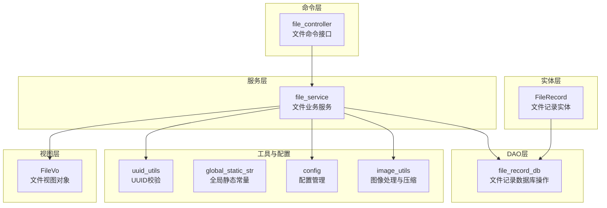
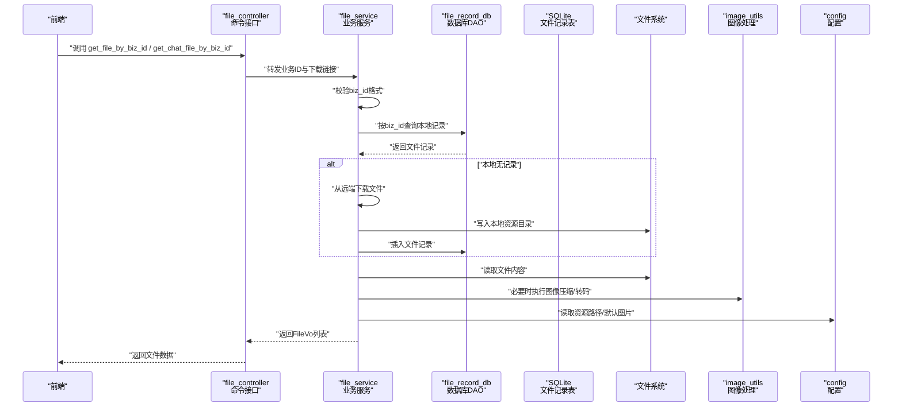
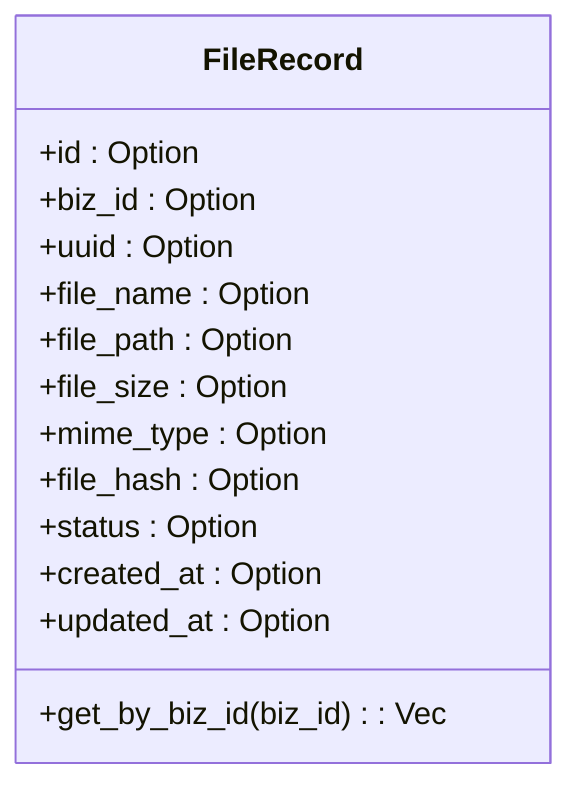
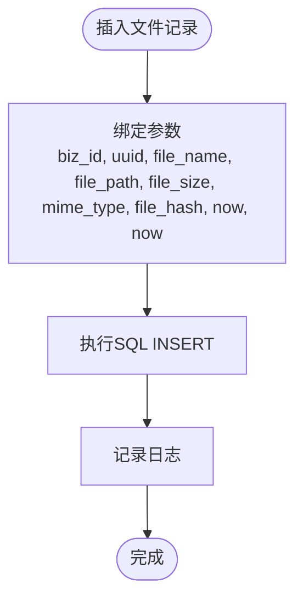
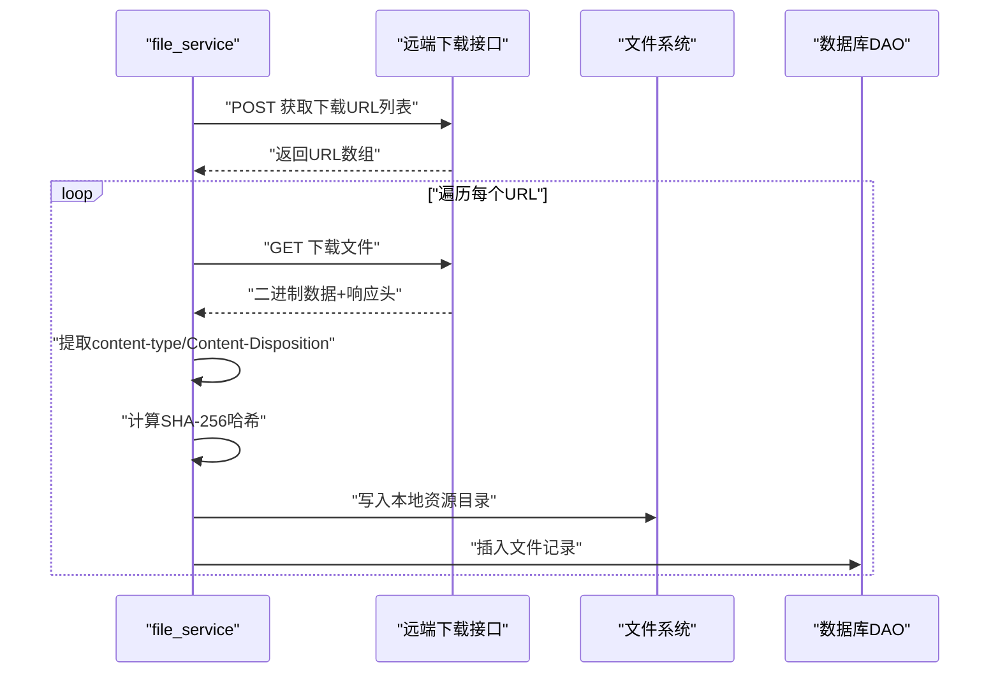
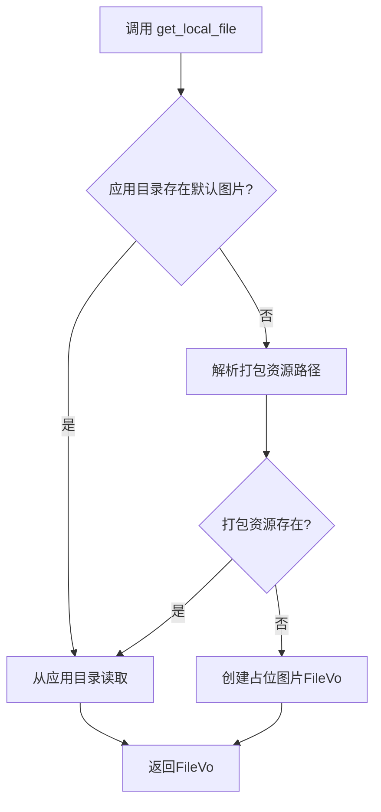
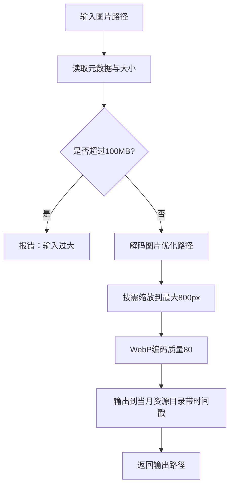
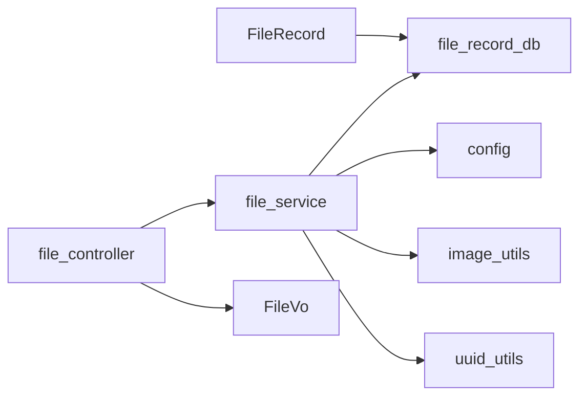

# 文件数据模型

<cite>
**本文引用的文件**
- [src-tauri/src/entity/file_record.rs](file://src-tauri/src/entity/file_record.rs)
- [src-tauri/src/dao/file_record_db.rs](file://src-tauri/src/dao/file_record_db.rs)
- [src-tauri/src/service/file_service.rs](file://src-tauri/src/service/file_service.rs)
- [src-tauri/src/cmd/file_controller.rs](file://src-tauri/src/cmd/file_controller.rs)
- [src-tauri/src/vo/file_vo.rs](file://src-tauri/src/vo/file_vo.rs)
- [src-tauri/src/utils/image_utils.rs](file://src-tauri/src/utils/image_utils.rs)
- [src-tauri/src/utils/uuid_utils.rs](file://src-tauri/src/utils/uuid_utils.rs)
- [src-tauri/src/config.rs](file://src-tauri/src/config.rs)
- [src-tauri/src/utils/global_static_str.rs](file://src-tauri/src/utils/global_static_str.rs)
- [src-tauri/examples/debug_compress.rs](file://src-tauri/examples/debug_compress.rs)
</cite>

## 目录
1. [简介](#简介)
2. [项目结构](#项目结构)
3. [核心组件](#核心组件)
4. [架构总览](#架构总览)
5. [详细组件分析](#详细组件分析)
6. [依赖关系分析](#依赖关系分析)
7. [性能考量](#性能考量)
8. [故障排查指南](#故障排查指南)
9. [结论](#结论)
10. [附录](#附录)

## 简介
本文件系统围绕“文件数据模型”展开，重点阐述文件记录表（FileRecord）的字段定义、文件元数据管理与存储路径设计；说明文件类型分类、大小限制与安全检查机制；解释文件上传下载状态管理、进度跟踪与断点续传支持现状；覆盖文件预览信息、缩略图生成与缓存策略；并给出文件生命周期管理、版本控制与清理策略建议。文中所有技术细节均基于仓库现有实现进行归纳与可视化呈现。

## 项目结构
文件相关模块在后端 Rust 工程中分布于实体层、DAO 层、服务层与命令层，并辅以通用工具与配置常量。整体采用分层架构，职责清晰、耦合度低，便于扩展与维护。

图表来源
- [src-tauri/src/entity/file_record.rs:1-83](file://src-tauri/src/entity/file_record.rs#L1-L83)
- [src-tauri/src/dao/file_record_db.rs:1-49](file://src-tauri/src/dao/file_record_db.rs#L1-L49)
- [src-tauri/src/service/file_service.rs:1-210](file://src-tauri/src/service/file_service.rs#L1-L210)
- [src-tauri/src/cmd/file_controller.rs:1-258](file://src-tauri/src/cmd/file_controller.rs#L1-L258)
- [src-tauri/src/vo/file_vo.rs:1-22](file://src-tauri/src/vo/file_vo.rs#L1-L22)
- [src-tauri/src/utils/image_utils.rs:1-212](file://src-tauri/src/utils/image_utils.rs#L1-L212)
- [src-tauri/src/utils/global_static_str.rs:1-59](file://src-tauri/src/utils/global_static_str.rs#L1-L59)
- [src-tauri/src/config.rs:1-155](file://src-tauri/src/config.rs#L1-L155)
- [src-tauri/src/utils/uuid_utils.rs:1-6](file://src-tauri/src/utils/uuid_utils.rs#L1-L6)

章节来源
- [src-tauri/src/entity/file_record.rs:1-83](file://src-tauri/src/entity/file_record.rs#L1-L83)
- [src-tauri/src/dao/file_record_db.rs:1-49](file://src-tauri/src/dao/file_record_db.rs#L1-L49)
- [src-tauri/src/service/file_service.rs:1-210](file://src-tauri/src/service/file_service.rs#L1-L210)
- [src-tauri/src/cmd/file_controller.rs:1-258](file://src-tauri/src/cmd/file_controller.rs#L1-L258)
- [src-tauri/src/vo/file_vo.rs:1-22](file://src-tauri/src/vo/file_vo.rs#L1-L22)
- [src-tauri/src/utils/image_utils.rs:1-212](file://src-tauri/src/utils/image_utils.rs#L1-L212)
- [src-tauri/src/utils/global_static_str.rs:1-59](file://src-tauri/src/utils/global_static_str.rs#L1-L59)
- [src-tauri/src/config.rs:1-155](file://src-tauri/src/config.rs#L1-L155)
- [src-tauri/src/utils/uuid_utils.rs:1-6](file://src-tauri/src/utils/uuid_utils.rs#L1-L6)

## 核心组件
- 文件记录实体（FileRecord）：定义文件在本地数据库中的字段与表结构，支持按业务 ID 查询与状态过滤。
- 数据库 DAO（file_record_db）：封装文件记录的插入、删除等数据库操作。
- 业务服务（file_service）：负责文件下载、本地读取、哈希计算、元数据提取与 VO 转换。
- 命令接口（file_controller）：暴露 Tauri 命令，供前端调用，包括公开文件与聊天文件的获取。
- 视图对象（FileVo）：统一输出给前端的文件数据载体。
- 图像处理工具（image_utils）：提供图片压缩、WebP 编码、EXIF 方向修正与尺寸调整能力。
- 配置与常量（config/global_static_str）：提供资源路径、API 地址、默认图片等全局配置。
- UUID 校验（uuid_utils）：确保业务 ID 合规性。

章节来源
- [src-tauri/src/entity/file_record.rs:1-83](file://src-tauri/src/entity/file_record.rs#L1-L83)
- [src-tauri/src/dao/file_record_db.rs:1-49](file://src-tauri/src/dao/file_record_db.rs#L1-L49)
- [src-tauri/src/service/file_service.rs:1-210](file://src-tauri/src/service/file_service.rs#L1-L210)
- [src-tauri/src/cmd/file_controller.rs:1-258](file://src-tauri/src/cmd/file_controller.rs#L1-L258)
- [src-tauri/src/vo/file_vo.rs:1-22](file://src-tauri/src/vo/file_vo.rs#L1-L22)
- [src-tauri/src/utils/image_utils.rs:1-212](file://src-tauri/src/utils/image_utils.rs#L1-L212)
- [src-tauri/src/utils/global_static_str.rs:1-59](file://src-tauri/src/utils/global_static_str.rs#L1-L59)
- [src-tauri/src/config.rs:1-155](file://src-tauri/src/config.rs#L1-L155)
- [src-tauri/src/utils/uuid_utils.rs:1-6](file://src-tauri/src/utils/uuid_utils.rs#L1-L6)

## 架构总览
下图展示从前端命令到后端服务、DAO、数据库与文件系统的完整流程，以及图像处理与配置参与的关键环节。

图表来源
- [src-tauri/src/cmd/file_controller.rs:155-191](file://src-tauri/src/cmd/file_controller.rs#L155-L191)
- [src-tauri/src/service/file_service.rs:20-84](file://src-tauri/src/service/file_service.rs#L20-L84)
- [src-tauri/src/dao/file_record_db.rs:8-36](file://src-tauri/src/dao/file_record_db.rs#L8-L36)
- [src-tauri/src/utils/image_utils.rs:20-93](file://src-tauri/src/utils/image_utils.rs#L20-L93)
- [src-tauri/src/config.rs:13-25](file://src-tauri/src/config.rs#L13-L25)

## 详细组件分析

### 文件记录实体（FileRecord）
- 字段定义与含义
  - id：自增主键
  - biz_id：业务 ID（UUID），用于关联业务表
  - uuid：文件唯一标识符（与业务内文件ID一致）
  - file_name：本地文件名（含扩展名）
  - file_path：本地绝对路径
  - file_size：文件大小（字节）
  - mime_type：MIME 类型
  - file_hash：文件哈希（用于去重与完整性校验）
  - status：文件状态（0-正常，1-已删除，2-临时文件）
  - created_at / updated_at：时间戳
- 表结构与初始化
  - 通过实现 SqliteStore 的 create_table 方法创建表
  - 支持按 biz_id 查询且仅返回 status=0 的记录
- 关键查询
  - get_by_biz_id：按业务 ID 过滤正常状态的文件记录

图表来源
- [src-tauri/src/entity/file_record.rs:10-34](file://src-tauri/src/entity/file_record.rs#L10-L34)
- [src-tauri/src/entity/file_record.rs:70-82](file://src-tauri/src/entity/file_record.rs#L70-L82)

章节来源
- [src-tauri/src/entity/file_record.rs:1-83](file://src-tauri/src/entity/file_record.rs#L1-L83)

### 数据库 DAO（file_record_db）
- 功能
  - 插入文件记录：包含 biz_id、uuid、file_name、file_path、file_size、mime_type、file_hash、status、created_at、updated_at
  - 删除文件记录：按 biz_id 与 uuid 删除
- 注意
  - 未实现“更新记录”逻辑，当前表结构更新方法为空实现
  - 未实现“按哈希去重”的自动插入策略

图表来源
- [src-tauri/src/dao/file_record_db.rs:8-36](file://src-tauri/src/dao/file_record_db.rs#L8-L36)

章节来源
- [src-tauri/src/dao/file_record_db.rs:1-49](file://src-tauri/src/dao/file_record_db.rs#L1-L49)

### 业务服务（file_service）
- 下载与本地化
  - 通过 biz_id 与远端下载链接获取文件列表
  - 从响应头提取 content-type 与 content-disposition，推导原始文件名与扩展名
  - 计算 SHA-256 哈希，生成本地文件名（uuid.ext），写入资源目录
  - 插入文件记录到数据库
- 本地读取与错误处理
  - 若本地文件缺失，删除对应记录并返回错误
  - 将文件内容读取为字节数组，转换为 FileVo 返回
- 安全与校验
  - 对 biz_id 进行非空与 UUID 格式校验
  - 对下载响应状态进行判断
- 未实现
  - 断点续传：未见分块下载与断点续传逻辑
  - 进度跟踪：未见进度回调或中间态记录
  - 版本控制：未见文件版本字段或历史记录表

图表来源
- [src-tauri/src/service/file_service.rs:89-189](file://src-tauri/src/service/file_service.rs#L89-L189)

章节来源
- [src-tauri/src/service/file_service.rs:1-210](file://src-tauri/src/service/file_service.rs#L1-L210)
- [src-tauri/src/utils/uuid_utils.rs:1-6](file://src-tauri/src/utils/uuid_utils.rs#L1-L6)

### 命令接口（file_controller）
- 暴露命令
  - get_file_by_biz_id：获取公开业务文件
  - get_chat_file_by_biz_id：获取聊天业务文件
  - get_local_file：从应用资源目录读取默认图片（回退到占位图）
  - debug_resource_paths：调试资源路径与文件列表
- 错误处理
  - 对空 biz_id 进行告警
  - 读取资源失败时回退至占位图

图表来源
- [src-tauri/src/cmd/file_controller.rs:14-67](file://src-tauri/src/cmd/file_controller.rs#L14-L67)

章节来源
- [src-tauri/src/cmd/file_controller.rs:1-258](file://src-tauri/src/cmd/file_controller.rs#L1-L258)

### 视图对象（FileVo）
- 字段
  - file_id、size、file_hash、created_at、updated_at、status
  - file_extension、mime_type、description
  - original_file_name、original_file_path、absolute_file_path
  - raw（文件字节流）、is_del
- 用途
  - 统一对外输出，避免直接暴露实体与底层路径

章节来源
- [src-tauri/src/vo/file_vo.rs:1-22](file://src-tauri/src/vo/file_vo.rs#L1-L22)

### 图像处理与缓存策略（image_utils）
- 能力
  - 图片解码优化（JPEG 使用 zune-jpeg，其他格式使用 image）
  - 自动 EXIF 方向修正
  - 尺寸缩放（最大边不超过 800px）
  - WebP 编码（目标质量 80）
  - 输出路径：当月资源目录 + 时间戳命名
- 限制与阈值
  - 输入最大 100MB，输出最大 200KB
- 缓存策略
  - 以“当月资源目录”为缓存根目录，文件名包含时间戳，天然具备过期与清理空间
  - 未见显式 TTL 或 LRU 回收机制

图表来源
- [src-tauri/src/utils/image_utils.rs:20-93](file://src-tauri/src/utils/image_utils.rs#L20-L93)

章节来源
- [src-tauri/src/utils/image_utils.rs:1-212](file://src-tauri/src/utils/image_utils.rs#L1-L212)
- [src-tauri/examples/debug_compress.rs:1-78](file://src-tauri/examples/debug_compress.rs#L1-L78)

### 存储路径与配置
- 全局常量
  - RESOURCE_PATH：本地资源目录
  - MONTHLY_RESOURCE_PATH：当月资源目录
  - DEFAULT_IMAGE：默认图片名称
  - TALK_API：远端 API 基础地址
- 配置管理
  - 通过 get_config/set_config 提供运行时配置读写
  - 命令层在资源读取失败时回退到占位图

章节来源
- [src-tauri/src/utils/global_static_str.rs:30-49](file://src-tauri/src/utils/global_static_str.rs#L30-L49)
- [src-tauri/src/config.rs:13-25](file://src-tauri/src/config.rs#L13-L25)
- [src-tauri/src/cmd/file_controller.rs:19-67](file://src-tauri/src/cmd/file_controller.rs#L19-L67)

## 依赖关系分析
- 实体与 DAO：FileRecord 通过 FromRow 实现与 SQLX 的映射，DAO 提供数据库 CRUD 操作
- 服务层依赖
  - 读取配置（资源路径、默认图片）
  - 调用 DAO 插入/删除记录
  - 读取文件系统内容
  - 必要时调用图像处理工具
- 命令层依赖服务层，不直接操作数据库与文件系统
- 工具与配置
  - image_utils 依赖配置提供的当月资源目录
  - uuid_utils 用于业务 ID 校验

图表来源
- [src-tauri/src/entity/file_record.rs:1-83](file://src-tauri/src/entity/file_record.rs#L1-L83)
- [src-tauri/src/dao/file_record_db.rs:1-49](file://src-tauri/src/dao/file_record_db.rs#L1-L49)
- [src-tauri/src/service/file_service.rs:1-210](file://src-tauri/src/service/file_service.rs#L1-L210)
- [src-tauri/src/cmd/file_controller.rs:1-258](file://src-tauri/src/cmd/file_controller.rs#L1-L258)
- [src-tauri/src/utils/image_utils.rs:1-212](file://src-tauri/src/utils/image_utils.rs#L1-L212)
- [src-tauri/src/utils/uuid_utils.rs:1-6](file://src-tauri/src/utils/uuid_utils.rs#L1-L6)
- [src-tauri/src/config.rs:1-155](file://src-tauri/src/config.rs#L1-L155)

章节来源
- [src-tauri/src/entity/file_record.rs:1-83](file://src-tauri/src/entity/file_record.rs#L1-L83)
- [src-tauri/src/dao/file_record_db.rs:1-49](file://src-tauri/src/dao/file_record_db.rs#L1-L49)
- [src-tauri/src/service/file_service.rs:1-210](file://src-tauri/src/service/file_service.rs#L1-L210)
- [src-tauri/src/cmd/file_controller.rs:1-258](file://src-tauri/src/cmd/file_controller.rs#L1-L258)
- [src-tauri/src/utils/image_utils.rs:1-212](file://src-tauri/src/utils/image_utils.rs#L1-L212)
- [src-tauri/src/utils/uuid_utils.rs:1-6](file://src-tauri/src/utils/uuid_utils.rs#L1-L6)
- [src-tauri/src/config.rs:1-155](file://src-tauri/src/config.rs#L1-L155)

## 性能考量
- 图像处理
  - 解码优化：针对 JPEG 使用 zune-jpeg，减少内存拷贝与 CPU 占用
  - 缩放与编码：最大边 800px，目标质量 80，输出上限 200KB，兼顾清晰度与体积
  - 时间统计：提供解码、编码、总耗时日志，便于性能分析
- I/O 与网络
  - 本地文件读取采用一次性读取，适合小文件；大文件建议分块读取与流式处理
  - 下载阶段未实现断点续传与进度回调，建议后续引入
- 存储
  - 以“当月资源目录”为缓存根，天然具备按月清理的空间；建议结合文件数量/大小阈值实现 LRU 或定期清理

章节来源
- [src-tauri/src/utils/image_utils.rs:20-93](file://src-tauri/src/utils/image_utils.rs#L20-L93)
- [src-tauri/examples/debug_compress.rs:41-77](file://src-tauri/examples/debug_compress.rs#L41-L77)

## 故障排查指南
- 业务 ID 校验失败
  - 现象：返回“biz_id不能为空”或“biz_id格式错误”
  - 排查：确认前端传入的 biz_id 非空且符合 UUID 格式
- 文件不存在
  - 现象：本地读取失败或数据库无记录
  - 排查：检查资源路径配置、文件是否被删除、是否需要重新下载
- 下载失败
  - 现象：远端响应非成功状态
  - 排查：检查 TALK_API 可达性、网络状态、下载链接有效性
- 图像处理异常
  - 现象：输入过大（>100MB）或编码失败
  - 排查：确认输入文件大小与格式，检查当月资源目录权限

章节来源
- [src-tauri/src/service/file_service.rs:20-84](file://src-tauri/src/service/file_service.rs#L20-L84)
- [src-tauri/src/cmd/file_controller.rs:155-191](file://src-tauri/src/cmd/file_controller.rs#L155-L191)
- [src-tauri/src/utils/image_utils.rs:26-28](file://src-tauri/src/utils/image_utils.rs#L26-L28)

## 结论
该文件数据模型以 FileRecord 为核心，配合 DAO、服务层与命令层实现了从远端下载、本地落盘、记录入库到前端返回的完整闭环。图像处理模块提供了高效的 WebP 压缩与缓存策略。当前实现未包含断点续传与进度跟踪，亦未提供文件版本控制与清理策略，建议后续迭代增强以满足更复杂场景需求。

## 附录

### 文件类型分类与 MIME 管理
- 通过响应头 content-type 推导 MIME 类型
- 未见显式的文件类型白名单或黑名单校验

章节来源
- [src-tauri/src/service/file_service.rs:117-122](file://src-tauri/src/service/file_service.rs#L117-L122)

### 大小限制与安全检查
- 输入图片大小限制：100MB
- 输出图片大小限制：200KB
- 安全检查
  - biz_id 非空与 UUID 格式校验
  - 下载响应状态检查
  - 本地文件存在性校验与记录清理

章节来源
- [src-tauri/src/service/file_service.rs:26-32](file://src-tauri/src/service/file_service.rs#L26-L32)
- [src-tauri/src/service/file_service.rs:100-102](file://src-tauri/src/service/file_service.rs#L100-L102)
- [src-tauri/src/utils/image_utils.rs:26-28](file://src-tauri/src/utils/image_utils.rs#L26-L28)

### 上传下载状态管理与断点续传
- 状态管理
  - 本地记录包含 status 字段（0-正常，1-已删除，2-临时文件）
  - 未见上传过程的状态机与中间态持久化
- 进度跟踪
  - 未实现进度回调或中间态记录
- 断点续传
  - 未发现分块下载与断点续传逻辑

章节来源
- [src-tauri/src/entity/file_record.rs:28-29](file://src-tauri/src/entity/file_record.rs#L28-L29)
- [src-tauri/src/dao/file_record_db.rs:8-36](file://src-tauri/src/dao/file_record_db.rs#L8-L36)
- [src-tauri/src/service/file_service.rs:89-189](file://src-tauri/src/service/file_service.rs#L89-L189)

### 预览信息、缩略图与缓存策略
- 预览信息
  - FileVo 包含 size、mime_type、raw 等字段，可用于前端预览
- 缩略图生成
  - 图像处理模块支持尺寸缩放与 WebP 编码，输出到当月资源目录
- 缓存策略
  - 以“当月资源目录”为缓存根，文件名包含时间戳，天然具备过期空间
  - 建议增加 LRU 或配额清理策略

章节来源
- [src-tauri/src/vo/file_vo.rs:1-22](file://src-tauri/src/vo/file_vo.rs#L1-L22)
- [src-tauri/src/utils/image_utils.rs:95-113](file://src-tauri/src/utils/image_utils.rs#L95-L113)

### 生命周期管理、版本控制与清理策略
- 生命周期
  - 正常状态：status=0
  - 删除状态：status=1（DAO 提供删除接口）
  - 临时状态：status=2（预留）
- 版本控制
  - 未见版本字段或历史记录表
- 清理策略
  - 建议按月清理当月资源目录，或基于文件数量/大小阈值的 LRU 清理

章节来源
- [src-tauri/src/entity/file_record.rs:28-29](file://src-tauri/src/entity/file_record.rs#L28-L29)
- [src-tauri/src/dao/file_record_db.rs:39-48](file://src-tauri/src/dao/file_record_db.rs#L39-L48)
- [src-tauri/src/utils/image_utils.rs:95-113](file://src-tauri/src/utils/image_utils.rs#L95-L113)