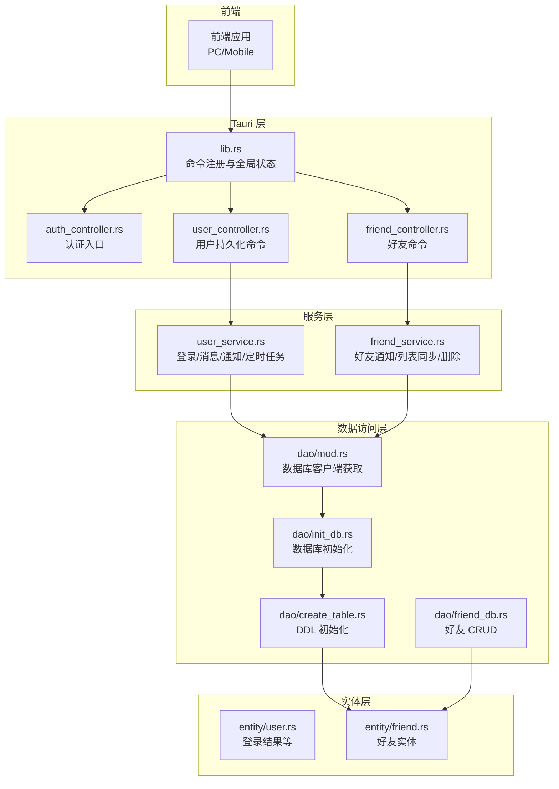
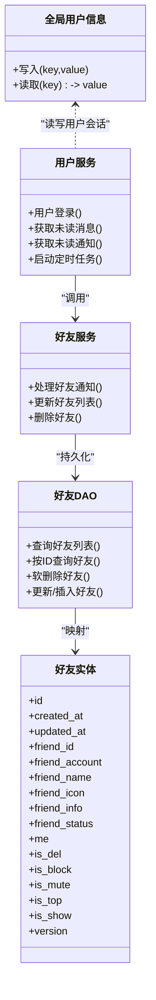
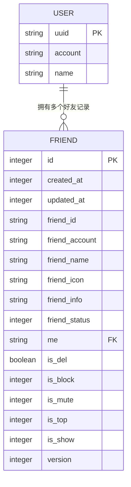
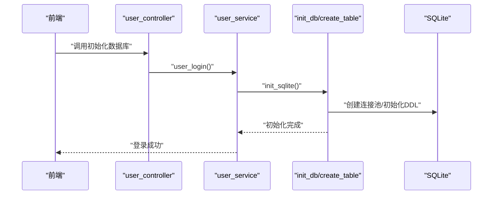
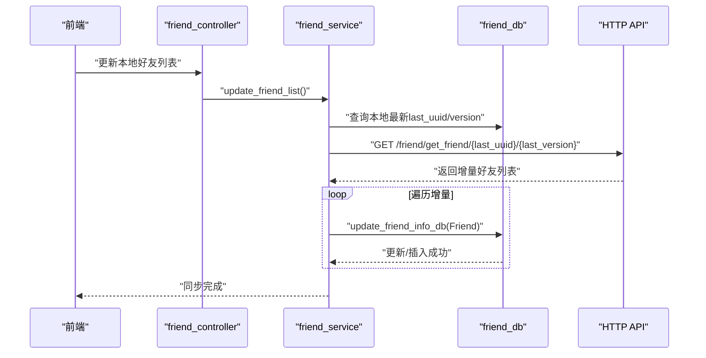
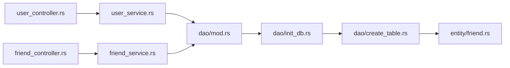

# 用户数据模型

<cite>
**本文引用的文件**
- [src-tauri/src/entity/user.rs](file://src-tauri/src/entity/user.rs)
- [src-tauri/src/entity/friend.rs](file://src-tauri/src/entity/friend.rs)
- [src-tauri/src/cmd/user_controller.rs](file://src-tauri/src/cmd/user_controller.rs)
- [src-tauri/src/cmd/friend_controller.rs](file://src-tauri/src/cmd/friend_controller.rs)
- [src-tauri/src/service/user_service.rs](file://src-tauri/src/service/user_service.rs)
- [src-tauri/src/service/friend_service.rs](file://src-tauri/src/service/friend_service.rs)
- [src-tauri/src/dao/mod.rs](file://src-tauri/src/dao/mod.rs)
- [src-tauri/src/dao/friend_db.rs](file://src-tauri/src/dao/friend_db.rs)
- [src-tauri/src/dao/init_db.rs](file://src-tauri/src/dao/init_db.rs)
- [src-tauri/src/dao/create_table.rs](file://src-tauri/src/dao/create_table.rs)
- [src-tauri/src/utils/global_static_str.rs](file://src-tauri/src/utils/global_static_str.rs)
- [src-tauri/src/lib.rs](file://src-tauri/src/lib.rs)
- [src-tauri/Cargo.toml](file://src-tauri/Cargo.toml)
</cite>

## 目录

1. [简介](#简介)
2. [项目结构](#项目结构)
3. [核心组件](#核心组件)
4. [架构总览](#架构总览)
5. [详细组件分析](#详细组件分析)
6. [依赖分析](#依赖分析)
7. [性能考虑](#性能考虑)
8. [故障排查指南](#故障排查指南)
9. [结论](#结论)
10. [附录](#附录)

## 简介

本文件围绕用户数据模型进行系统化梳理，重点覆盖以下方面：

- 用户信息表（User）的字段定义、数据验证与隐私保护机制
- 好友关系表（Friend）的设计理念、关系状态管理与社交拓扑
- 用户认证数据、权限管理与安全约束
- 用户数据生命周期管理、隐私控制与数据迁移策略
- 用户数据模型图与关系映射
- 实时同步策略与在线状态相关设计要点

说明：当前代码库中未发现“用户在线状态表”的独立实体或 DAO 实现；在线状态相关能力通过全局用户信息字典与 QUIC 通信通道实现，详见后续章节。

## 项目结构

后端采用 Rust + Tauri 架构，数据层以 SQLite 为主，结合 SQLx 进行 ORM 映射与查询。用户数据模型主要分布在 entity、dao、service、cmd 四个层次，并通过 lib.rs 中的命令注册暴露给前端调用。

图表来源

- [src-tauri/src/lib.rs:117-163](file://src-tauri/src/lib.rs#L117-L163)
- [src-tauri/src/cmd/user_controller.rs:1-17](file://src-tauri/src/cmd/user_controller.rs#L1-17)
- [src-tauri/src/cmd/friend_controller.rs:1-41](file://src-tauri/src/cmd/friend_controller.rs#L1-L41)
- [src-tauri/src/service/user_service.rs:1-284](file://src-tauri/src/service/user_service.rs#L1-L284)
- [src-tauri/src/service/friend_service.rs:1-120](file://src-tauri/src/service/friend_service.rs#L1-L120)
- [src-tauri/src/dao/mod.rs:1-39](file://src-tauri/src/dao/mod.rs#L1-L39)
- [src-tauri/src/dao/init_db.rs:1-75](file://src-tauri/src/dao/init_db.rs#L1-L75)
- [src-tauri/src/dao/create_table.rs:1-55](file://src-tauri/src/dao/create_table.rs#L1-L55)
- [src-tauri/src/dao/friend_db.rs:1-93](file://src-tauri/src/dao/friend_db.rs#L1-L93)
- [src-tauri/src/entity/user.rs:1-9](file://src-tauri/src/entity/user.rs#L1-L9)
- [src-tauri/src/entity/friend.rs:1-63](file://src-tauri/src/entity/friend.rs#L1-L63)

章节来源

- [src-tauri/src/lib.rs:117-163](file://src-tauri/src/lib.rs#L117-L163)
- [src-tauri/src/dao/mod.rs:18-39](file://src-tauri/src/dao/mod.rs#L18-L39)

## 核心组件

- 用户信息与认证
  - 全局用户信息字典：通过全局 RWLock HashMap 存储用户会话键值对，如 uuid、account 等，供服务层与命令层共享。
  - 登录流程：服务层在登录时初始化数据库、拉取好友列表、未读消息与通知，并启动 QUIC 客户端与定时任务。
  - 认证入口：通过 auth_controller 的 sign_in/logout/clear_user_info 等命令完成登录态维护。
- 好友关系模型
  - 实体 Friend：包含好友标识、账号、昵称、头像、状态、屏蔽/免打扰/置顶/显示等布尔位与版本号等字段。
  - DAO 层：提供好友列表查询、按 ID 查询、软删除（is_del/is_show）、更新/插入等操作。
  - 服务层：处理好友通知、拉取远端好友列表并合并本地、删除好友（软删除 + 隐藏会话）。
- 数据库与表初始化
  - 初始化流程：根据应用路径与当前账户动态生成数据库文件路径，创建目录与文件，建立连接池并初始化 DDL。
  - 表初始化：统一调用 create_table.rs 中的 init_user_ddl/init_common_ddl/init_private_ddl，确保 Friend、聊天记录、会话、通知等表存在。

章节来源

- [src-tauri/src/lib.rs:61-75](file://src-tauri/src/lib.rs#L61-L75)
- [src-tauri/src/service/user_service.rs:27-53](file://src-tauri/src/service/user_service.rs#L27-L53)
- [src-tauri/src/entity/friend.rs:7-25](file://src-tauri/src/entity/friend.rs#L7-L25)
- [src-tauri/src/dao/friend_db.rs:7-92](file://src-tauri/src/dao/friend_db.rs#L7-L92)
- [src-tauri/src/dao/create_table.rs:26-41](file://src-tauri/src/dao/create_table.rs#L26-L41)
- [src-tauri/src/dao/init_db.rs:17-74](file://src-tauri/src/dao/init_db.rs#L17-L74)

## 架构总览

下图展示用户数据模型在各层之间的交互关系与职责划分。

图表来源

- [src-tauri/src/lib.rs:61-75](file://src-tauri/src/lib.rs#L61-L75)
- [src-tauri/src/service/user_service.rs:27-53](file://src-tauri/src/service/user_service.rs#L27-L53)
- [src-tauri/src/service/friend_service.rs:60-119](file://src-tauri/src/service/friend_service.rs#L60-L119)
- [src-tauri/src/dao/friend_db.rs:7-92](file://src-tauri/src/dao/friend_db.rs#L7-L92)
- [src-tauri/src/entity/friend.rs:7-25](file://src-tauri/src/entity/friend.rs#L7-L25)

## 详细组件分析

### 用户信息表（User）设计

- 字段定义与用途
  - 登录结果封装：提供 code、data、message 字段，便于前端统一处理登录响应。
  - 全局用户信息字典：存储用户会话关键字段（如 uuid、account），作为跨模块共享的状态载体。
- 数据验证与隐私保护
  - 会话键值对仅在内存中存取，避免明文落盘；敏感字段不在实体中直接暴露。
  - 数据库层面未见专用 User 表，用户标识通过全局字典与远端接口交互获取。
- 生命周期管理
  - 登录时初始化数据库与全局状态；登出时清理用户信息字典与相关定时任务。

章节来源

- [src-tauri/src/entity/user.rs:3-8](file://src-tauri/src/entity/user.rs#L3-L8)
- [src-tauri/src/lib.rs:61-75](file://src-tauri/src/lib.rs#L61-L75)
- [src-tauri/src/service/user_service.rs:27-53](file://src-tauri/src/service/user_service.rs#L27-L53)

### 好友关系表（Friend）设计

- 设计理念
  - 以“我”为中心的社交拓扑：每条记录绑定 me 字段，表示该记录属于哪个用户。
  - 关系状态管理：通过 friend_status、is_block、is_mute、is_top、is_show、is_del 等布尔位与整型状态位表达关系状态与展示偏好。
  - 版本控制：version 字段用于增量同步，避免全量拉取。
- 字段定义与复杂度
  - 主键自增 id；时间戳 created_at/updated_at；唯一索引 (friend_id, me) 保证同一用户下好友唯一。
  - 查询复杂度：按 me 查询好友列表为 O(n) 扫描；按 (me, friend_id) 查询为 O(1) 唯一命中。
- 关系状态管理与社交拓扑
  - 展示控制：is_show 控制是否在前端展示；is_del 控制逻辑删除；is_block 控制屏蔽；is_mute 控制免打扰。
  - 增量同步：服务层基于 last_uuid 与 last_version 从远端拉取增量好友变更，合并本地状态。

图表来源

- [src-tauri/src/entity/friend.rs:7-25](file://src-tauri/src/entity/friend.rs#L7-L25)

章节来源

- [src-tauri/src/entity/friend.rs:27-62](file://src-tauri/src/entity/friend.rs#L27-L62)
- [src-tauri/src/dao/friend_db.rs:7-92](file://src-tauri/src/dao/friend_db.rs#L7-L92)
- [src-tauri/src/service/friend_service.rs:60-119](file://src-tauri/src/service/friend_service.rs#L60-L119)

### 用户认证数据、权限管理与安全约束

- 认证数据
  - 全局用户信息字典：存储用户标识与会话参数，供服务层与命令层使用。
  - 登录流程：初始化数据库、拉取好友列表与未读消息、启动 QUIC 与定时任务。
- 权限与安全
  - 本地数据隔离：不同用户的数据目录按账户名分隔，避免交叉污染。
  - 传输安全：通过 QUIC/TLS 通道与远端交互，请求使用 HTTPS 地址。
  - 会话校验：定时任务通过 schedule_key 校验，防止并发任务冲突。

章节来源

- [src-tauri/src/service/user_service.rs:27-53](file://src-tauri/src/service/user_service.rs#L27-L53)
- [src-tauri/src/dao/init_db.rs:43-74](file://src-tauri/src/dao/init_db.rs#L43-L74)
- [src-tauri/src/utils/global_static_str.rs:10](file://src-tauri/src/utils/global_static_str.rs#L10)

### 用户在线状态表设计与实时同步策略

- 设计目的
  - 当前代码库未发现独立的“在线状态表”。在线状态通过全局用户信息字典与 QUIC 通道实现，用于标识用户会话与消息投递。
- 状态更新机制
  - 登录成功后启动 QUIC 客户端，负责消息收发与状态上报；定时任务负责已读回执与未发送消息重试。
- 实时同步策略
  - 好友列表采用增量同步：基于 last_uuid 与 last_version 拉取远端变更。
  - 未读消息与通知在登录后一次性拉取并聚合到会话表。

章节来源

- [src-tauri/src/service/user_service.rs:27-53](file://src-tauri/src/service/user_service.rs#L27-L53)
- [src-tauri/src/service/friend_service.rs:74-119](file://src-tauri/src/service/friend_service.rs#L74-L119)

### 数据库初始化与表结构

- 初始化流程
  - 动态计算数据库文件路径（应用根路径/dbData/{account}/user.db），创建目录与文件，建立 SQLite 连接池。
  - 统一初始化 DDL：Friend、ChatRecord、ChatSession、SystemNotification、ChatRecordSend/Ack/Read 等表。
- 表结构要点
  - Friend 表含唯一索引 (friend_id, me)，保证同一用户下好友唯一。
  - 时间戳字段用于排序与增量同步；version 字段用于远端变更检测。

图表来源

- [src-tauri/src/service/user_service.rs:27-53](file://src-tauri/src/service/user_service.rs#L27-L53)
- [src-tauri/src/dao/init_db.rs:17-41](file://src-tauri/src/dao/init_db.rs#L17-L41)
- [src-tauri/src/dao/create_table.rs:26-41](file://src-tauri/src/dao/create_table.rs#L26-L41)

章节来源

- [src-tauri/src/dao/init_db.rs:17-74](file://src-tauri/src/dao/init_db.rs#L17-L74)
- [src-tauri/src/dao/create_table.rs:26-41](file://src-tauri/src/dao/create_table.rs#L26-L41)

### 好友列表同步与删除流程

- 增量同步
  - 服务层先查询本地最新更新时间与版本，构造请求参数向远端拉取增量数据，逐条转换为 Friend 实体并更新/插入数据库。
- 删除好友
  - 远端删除成功后，本地执行软删除（设置 is_del=1、is_show=0），并隐藏对应会话。

图表来源

- [src-tauri/src/cmd/friend_controller.rs:28-33](file://src-tauri/src/cmd/friend_controller.rs#L28-L33)
- [src-tauri/src/service/friend_service.rs:60-119](file://src-tauri/src/service/friend_service.rs#L60-L119)
- [src-tauri/src/dao/friend_db.rs:48-92](file://src-tauri/src/dao/friend_db.rs#L48-L92)

章节来源

- [src-tauri/src/cmd/friend_controller.rs:6-40](file://src-tauri/src/cmd/friend_controller.rs#L6-L40)
- [src-tauri/src/service/friend_service.rs:39-57](file://src-tauri/src/service/friend_service.rs#L39-L57)
- [src-tauri/src/dao/friend_db.rs:32-45](file://src-tauri/src/dao/friend_db.rs#L32-L45)

### 用户数据生命周期管理与隐私控制

- 生命周期
  - 登录：初始化数据库与全局状态，拉取好友与未读消息，启动 QUIC 与定时任务。
  - 运行期：定时任务处理未发送消息与已读回执；服务层处理好友通知与列表同步。
  - 登出：清理用户信息字典与相关任务（由 logout/clear_user_info 命令配合实现）。
- 隐私控制
  - 本地数据隔离：按账户名分目录存储数据库文件，避免跨用户数据泄露。
  - 内存态会话：用户标识与会话参数仅在内存中存取，不落盘明文。
- 数据迁移策略
  - 表结构演进：通过 create_table.rs 的 create_table/update_table/drop_table 接口扩展（当前 Friend 的 update_table 为空实现，预留扩展点）。
  - 增量同步：好友列表采用 last_uuid 与 last_version 增量拉取，降低带宽与存储压力。

章节来源

- [src-tauri/src/service/user_service.rs:27-53](file://src-tauri/src/service/user_service.rs#L27-L53)
- [src-tauri/src/dao/init_db.rs:43-74](file://src-tauri/src/dao/init_db.rs#L43-L74)
- [src-tauri/src/dao/create_table.rs:55](file://src-tauri/src/dao/create_table.rs#L55)
- [src-tauri/src/entity/friend.rs:55-62](file://src-tauri/src/entity/friend.rs#L55-L62)

## 依赖分析

- 组件耦合
  - cmd 层仅负责命令编排与参数传递，业务逻辑集中在 service 层；dao 层专注数据持久化；entity 层提供结构化数据模型。
- 外部依赖
  - SQLx：SQLite 连接池与 ORM 映射
  - rusqlite/sqlcipher：数据库引擎与加密支持
  - reqwest/rustls：HTTPS 请求与 TLS 传输
  - tokio：异步运行时与定时任务
  - uuid/chrono：唯一标识与时间戳

图表来源

- [src-tauri/src/cmd/user_controller.rs:1-17](file://src-tauri/src/cmd/user_controller.rs#L1-L17)
- [src-tauri/src/cmd/friend_controller.rs:1-41](file://src-tauri/src/cmd/friend_controller.rs#L1-L41)
- [src-tauri/src/service/user_service.rs:1-284](file://src-tauri/src/service/user_service.rs#L1-L284)
- [src-tauri/src/service/friend_service.rs:1-120](file://src-tauri/src/service/friend_service.rs#L1-L120)
- [src-tauri/src/dao/mod.rs:1-39](file://src-tauri/src/dao/mod.rs#L1-L39)
- [src-tauri/src/dao/init_db.rs:1-75](file://src-tauri/src/dao/init_db.rs#L1-L75)
- [src-tauri/src/dao/create_table.rs:1-55](file://src-tauri/src/dao/create_table.rs#L1-L55)
- [src-tauri/src/entity/friend.rs:1-63](file://src-tauri/src/entity/friend.rs#L1-L63)

章节来源

- [src-tauri/src/lib.rs:24-75](file://src-tauri/src/lib.rs#L24-L75)
- [src-tauri/Cargo.toml:24-62](file://src-tauri/Cargo.toml#L24-L62)

## 性能考虑

- 连接池与并发
  - SQLite 连接池最大连接数限制为 5，适合桌面端低并发场景；若需提升吞吐，可评估调整连接数与查询批量化。
- 查询优化
  - 好友列表查询按 me 过滤，建议在 me 上建立索引以加速扫描（当前 Friend 表未显式建索引，但 UNIQUE 索引覆盖 (friend_id, me)）。
- 异步与定时任务
  - 未发送消息与已读回执通过定时任务周期性处理，建议将任务间隔与超时时间参数化，便于调优。
- 传输效率
  - 好友列表采用增量同步，减少远端压力；消息与通知在登录后批量拉取，避免频繁请求。

## 故障排查指南

- 数据库初始化失败
  - 检查应用路径与账户目录是否可写；确认数据库文件创建成功；查看初始化 DDL 是否执行。
- 好友列表不同步
  - 核对本地 last_uuid 与 last_version 是否正确；检查远端接口返回格式；确认 update_friend_info_db 是否成功插入或更新。
- 登录后无未读消息
  - 检查 HTTP 返回码与 body 结构；确认消息序列化与会话聚合逻辑是否执行。
- 在线状态异常
  - 确认 QUIC 客户端已启动且地址解析正常；检查定时任务 schedule_key 是否一致。

章节来源

- [src-tauri/src/dao/init_db.rs:17-41](file://src-tauri/src/dao/init_db.rs#L17-L41)
- [src-tauri/src/service/friend_service.rs:74-119](file://src-tauri/src/service/friend_service.rs#L74-L119)
- [src-tauri/src/service/user_service.rs:70-139](file://src-tauri/src/service/user_service.rs#L70-L139)

## 结论

本用户数据模型以 Friend 表为核心，围绕“我”的社交拓扑构建关系状态与展示偏好；通过全局用户信息字典与 QUIC 通道实现会话与实时能力；数据库初始化与 DDL 管理清晰，具备良好的扩展性。当前未发现独立的“在线状态表”，在线状态通过全局会话与 QUIC 通道实现。建议后续在 Friend 表上补充索引、参数化定时任务间隔，并完善 User 表以承载更多用户元数据。

## 附录

- 关键常量与路径
  - 应用路径、数据库文件名、默认图片、平台标识等常量集中于全局静态字符串模块。
- 命令注册
  - 所有命令在 lib.rs 中集中注册，便于前端统一调用。

章节来源

- [src-tauri/src/utils/global_static_str.rs:28-59](file://src-tauri/src/utils/global_static_str.rs#L28-L59)
- [src-tauri/src/lib.rs:117-163](file://src-tauri/src/lib.rs#L117-L163)
