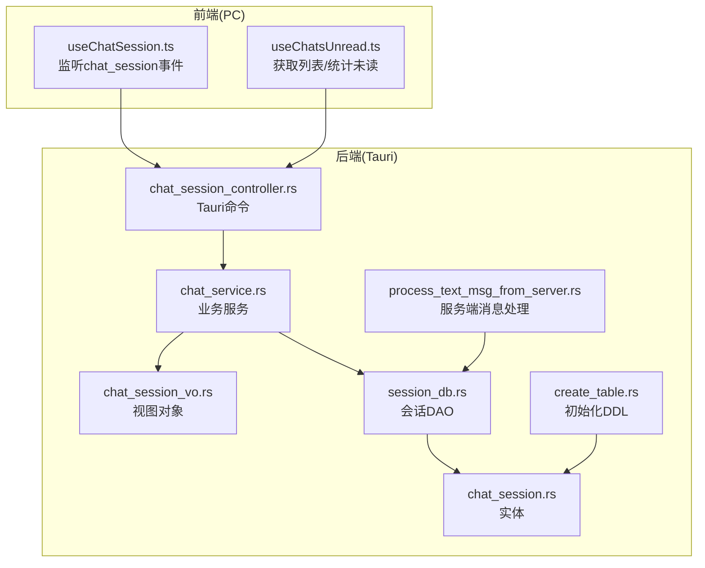
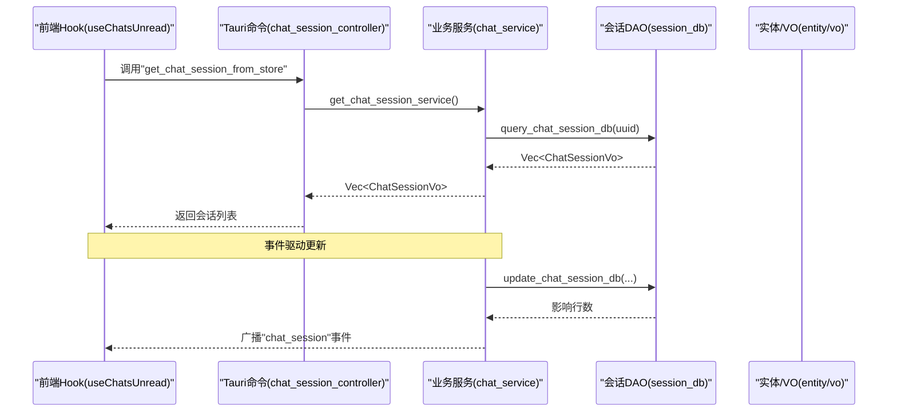
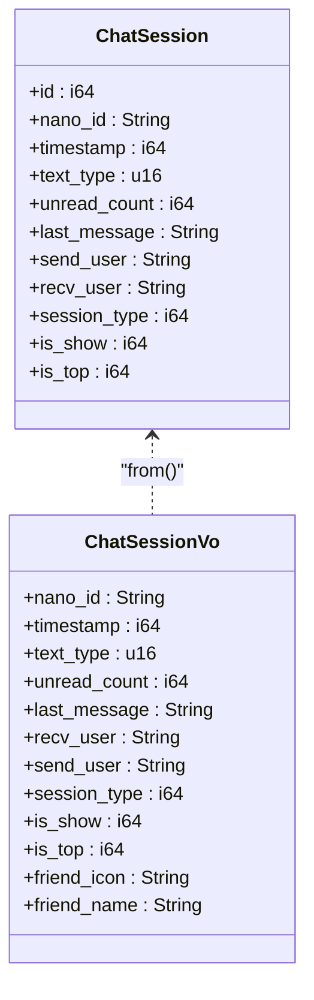
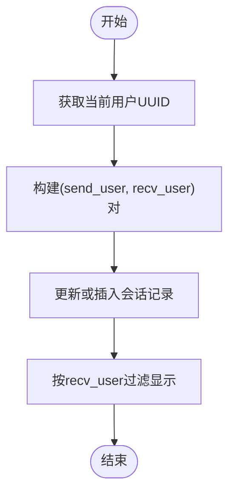
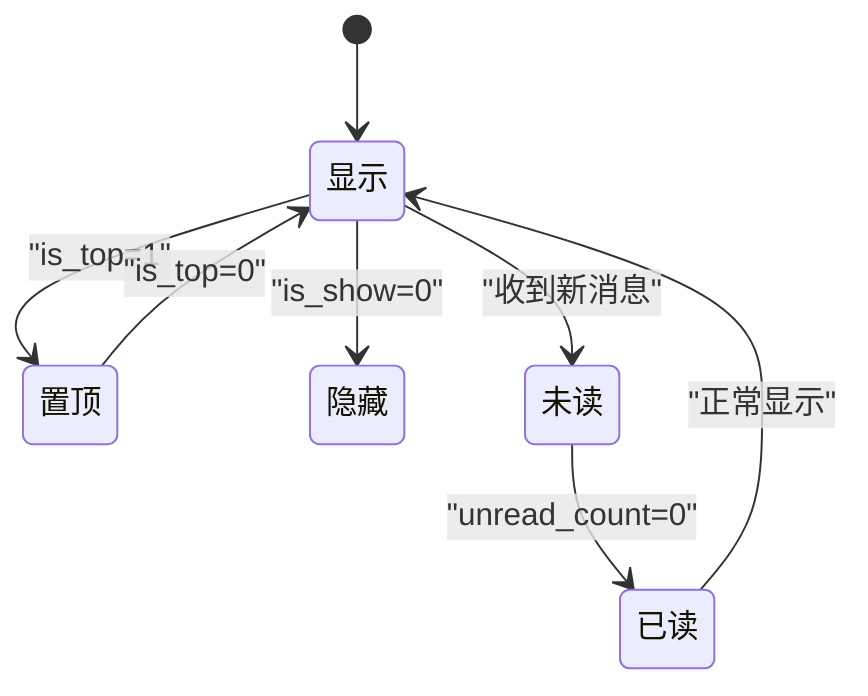
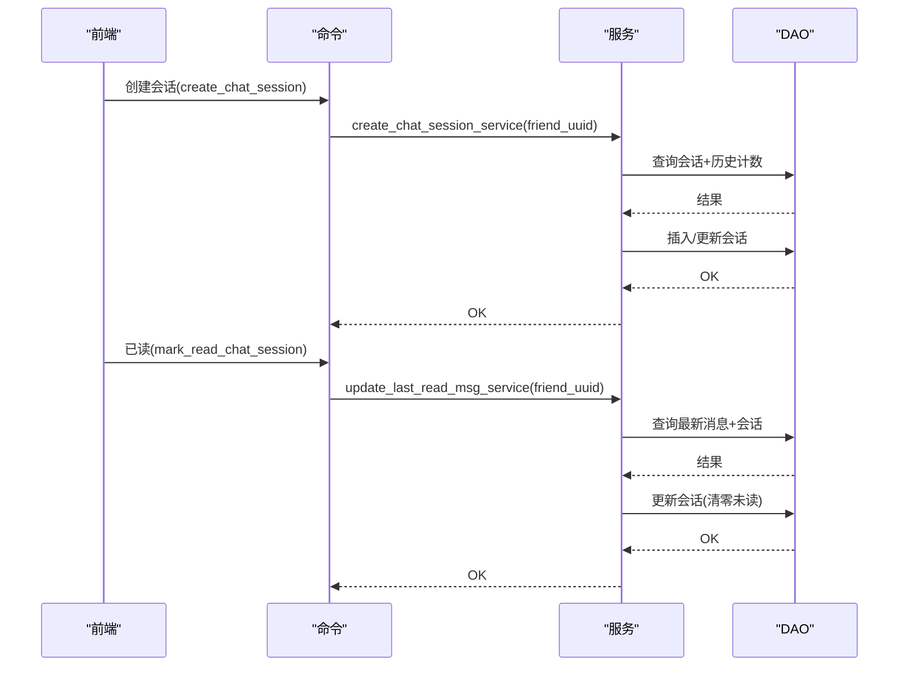
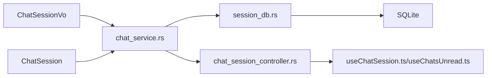

# 会话信息实体

<cite>
**本文引用的文件**
- [chat_session.rs](file://src-tauri/src/entity/chat_session.rs)
- [chat_session_vo.rs](file://src-tauri/src/vo/chat_session_vo.rs)
- [session_db.rs](file://src-tauri/src/dao/session_db.rs)
- [chat_session_controller.rs](file://src-tauri/src/cmd/chat_session_controller.rs)
- [chat_service.rs](file://src-tauri/src/service/chat_service.rs)
- [create_table.rs](file://src-tauri/src/dao/create_table.rs)
- [process_text_msg_from_server.rs](file://src-tauri/src/quic_service/center_service/process_text_msg_from_server.rs)
- [useChatSession.ts](file://apps/pc/src/hooks/useChatSession.ts)
- [useChatsUnread.ts](file://apps/pc/src/hooks/useChatsUnread.ts)
- [message_types.rs](file://src-tauri/src/utils/message_types.rs)
- [uuid_utils.rs](file://src-tauri/src/utils/uuid_utils.rs)
- [friend.rs](file://src-tauri/src/entity/friend.rs)
</cite>

## 目录
1. [简介](#简介)
2. [项目结构](#项目结构)
3. [核心组件](#核心组件)
4. [架构总览](#架构总览)
5. [详细组件分析](#详细组件分析)
6. [依赖分析](#依赖分析)
7. [性能考量](#性能考量)
8. [故障排查指南](#故障排查指南)
9. [结论](#结论)
10. [附录](#附录)

## 简介
本文件围绕“会话信息实体”展开，系统性梳理 ChatSession 数据模型的设计思路、业务价值与运行机制，覆盖会话标识符生成与唯一性、成员关系存储与校验、状态管理（活跃、静默、置顶、显示/隐藏）、配置项与未读计数策略、生命周期管理（创建、更新、查询、销毁），以及会话列表获取、最近消息提取与未读统计的实现要点，并给出持久化与一致性保障方案。

## 项目结构
会话相关能力由 Rust 后端与前端 Hook 协同实现：
- 后端实体与DAO层：定义 ChatSession 实体、会话VO、会话DAO、服务层逻辑与数据库初始化
- 前端Hook：监听会话事件、拉取会话列表、计算未读总数
- 控制器与服务：暴露Tauri命令，封装业务流程

图表来源
- [chat_session_controller.rs:1-24](file://src-tauri/src/cmd/chat_session_controller.rs#L1-L24)
- [chat_service.rs:68-72](file://src-tauri/src/service/chat_service.rs#L68-L72)
- [session_db.rs:75-87](file://src-tauri/src/dao/session_db.rs#L75-L87)
- [chat_session.rs:8-21](file://src-tauri/src/entity/chat_session.rs#L8-L21)
- [chat_session_vo.rs:6-20](file://src-tauri/src/vo/chat_session_vo.rs#L6-L20)
- [create_table.rs:26-41](file://src-tauri/src/dao/create_table.rs#L26-L41)
- [process_text_msg_from_server.rs:189-200](file://src-tauri/src/quic_service/center_service/process_text_msg_from_server.rs#L189-L200)

章节来源
- [chat_session_controller.rs:1-24](file://src-tauri/src/cmd/chat_session_controller.rs#L1-L24)
- [chat_service.rs:68-72](file://src-tauri/src/service/chat_service.rs#L68-L72)
- [session_db.rs:75-87](file://src-tauri/src/dao/session_db.rs#L75-L87)
- [chat_session.rs:8-21](file://src-tauri/src/entity/chat_session.rs#L8-L21)
- [chat_session_vo.rs:6-20](file://src-tauri/src/vo/chat_session_vo.rs#L6-L20)
- [create_table.rs:26-41](file://src-tauri/src/dao/create_table.rs#L26-L41)
- [process_text_msg_from_server.rs:189-200](file://src-tauri/src/quic_service/center_service/process_text_msg_from_server.rs#L189-L200)

## 核心组件
- ChatSession 实体：承载会话关键字段，包括会话标识、时间戳、消息类型、未读计数、最后一条消息、双方用户、会话类型、显示/置顶标记等
- ChatSessionVo 视图对象：用于对外展示的会话信息，包含好友头像与名称等扩展字段
- 会话DAO：负责会话的增删改查、批量查询、显示/隐藏控制
- 服务层：封装创建、更新、已读同步、会话列表获取等业务流程
- 控制器：暴露Tauri命令，桥接前端调用与后端服务
- 初始化模块：统一创建会话表及关联表

章节来源
- [chat_session.rs:8-21](file://src-tauri/src/entity/chat_session.rs#L8-L21)
- [chat_session_vo.rs:6-20](file://src-tauri/src/vo/chat_session_vo.rs#L6-L20)
- [session_db.rs:9-48](file://src-tauri/src/dao/session_db.rs#L9-L48)
- [chat_service.rs:68-72](file://src-tauri/src/service/chat_service.rs#L68-L72)
- [create_table.rs:26-41](file://src-tauri/src/dao/create_table.rs#L26-L41)

## 架构总览
会话数据流自下而上分为四层：数据访问层（DAO）→ 业务服务层（Service）→ 控制器层（Command）→ 前端Hook。消息从服务端到达后，经处理更新会话并广播事件；前端通过事件与命令获取最新会话状态。

图表来源
- [chat_session_controller.rs:20-23](file://src-tauri/src/cmd/chat_session_controller.rs#L20-L23)
- [chat_service.rs:68-72](file://src-tauri/src/service/chat_service.rs#L68-L72)
- [session_db.rs:75-87](file://src-tauri/src/dao/session_db.rs#L75-L87)

## 详细组件分析

### ChatSession 数据模型与设计思路
- 字段设计
  - 会话标识：nano_id（字符串，作为消息链唯一标识）
  - 时间戳：timestamp（毫秒级，用于排序与过期判定）
  - 文本类型：text_type（消息类型枚举，区分文本/图片/文件/P2P/WebRTC等）
  - 未读计数：unread_count（累计未读消息数）
  - 最后一条消息：last_message（最近消息内容摘要）
  - 成员关系：send_user/recv_user（双方用户标识）
  - 会话类型：session_type（1-单聊，2-群聊，3-系统，4-公众号）
  - 显示/置顶：is_show/is_top（控制UI呈现与优先级）
- 设计价值
  - 以“用户对”为维度聚合会话，避免重复与冲突
  - 通过 text_type 与 last_message 提供快速渲染所需信息
  - 未读计数集中维护，便于前端统计与提醒

图表来源
- [chat_session.rs:8-21](file://src-tauri/src/entity/chat_session.rs#L8-L21)
- [chat_session_vo.rs:6-20](file://src-tauri/src/vo/chat_session_vo.rs#L6-L20)

章节来源
- [chat_session.rs:8-21](file://src-tauri/src/entity/chat_session.rs#L8-L21)
- [chat_session_vo.rs:6-20](file://src-tauri/src/vo/chat_session_vo.rs#L6-L20)

### 会话标识符生成策略与唯一性保证
- 生成策略
  - 创建新会话时，使用短ID生成器分配 nano_id
  - 服务端下行消息时，同样以消息ID更新会话的 nano_id，确保与消息链一致
- 唯一性保证
  - 表级约束：UNIQUE(send_user, recv_user) 保证“用户对”唯一
  - 消息链唯一性：服务端消息携带唯一ID，与会话 nano_id 同步，避免跨会话混淆
- 业务意义
  - 保证会话与消息链强绑定，便于后续消息回溯与一致性校验

章节来源
- [chat_service.rs:243-278](file://src-tauri/src/service/chat_service.rs#L243-L278)
- [process_text_msg_from_server.rs:174-182](file://src-tauri/src/quic_service/center_service/process_text_msg_from_server.rs#L174-L182)
- [chat_session.rs:44-56](file://src-tauri/src/entity/chat_session.rs#L44-L56)

### 会话成员关系存储与验证机制
- 存储方式
  - 以 send_user 与 recv_user 组合作为主键维度，配合表级唯一约束
  - 查询时通过“我”与对方的组合匹配，自动屏蔽非本人视角的会话
- 验证机制
  - DAO 层在更新/插入时，基于“我”的身份动态映射 send_user/recv_user
  - 前端 Hook 仅接收与自身 recv_user 匹配的事件，避免越权渲染
- 友谊校验
  - 会话列表联结 friend 表，仅展示未拉黑的好友会话

图表来源
- [session_db.rs:9-48](file://src-tauri/src/dao/session_db.rs#L9-L48)
- [session_db.rs:75-87](file://src-tauri/src/dao/session_db.rs#L75-L87)
- [useChatSession.ts:16-35](file://apps/pc/src/hooks/useChatSession.ts#L16-L35)

章节来源
- [session_db.rs:9-48](file://src-tauri/src/dao/session_db.rs#L9-L48)
- [session_db.rs:75-87](file://src-tauri/src/dao/session_db.rs#L75-L87)
- [useChatSession.ts:16-35](file://apps/pc/src/hooks/useChatSession.ts#L16-L35)
- [friend.rs:28-48](file://src-tauri/src/entity/friend.rs#L28-L48)

### 会话状态管理（活跃、静默、置顶、显示/隐藏）
- 状态字段
  - is_show：是否显示（0隐藏，1显示）
  - is_top：是否置顶（0否，1是）
  - unread_count：未读计数（累加或清零）
  - session_type：会话类型（单聊/群聊/系统/公众号）
- 状态机设计
  - 静默/活跃：由 unread_count 与 last_message 驱动
  - 显示/隐藏：通过 hide_chat_session_db 将 is_show 置0
  - 置顶：is_top=1 时在列表中优先展示
- 转换规则
  - 新消息到达：若消息链不同则增加 unread_count 或更新 last_message
  - 已读操作：将 unread_count 清零并同步至本地
  - 隐藏会话：将 is_show 置0，前端不再展示

图表来源
- [chat_service.rs:104-115](file://src-tauri/src/service/chat_service.rs#L104-L115)
- [session_db.rs:106-116](file://src-tauri/src/dao/session_db.rs#L106-L116)

章节来源
- [chat_service.rs:104-115](file://src-tauri/src/service/chat_service.rs#L104-L115)
- [session_db.rs:106-116](file://src-tauri/src/dao/session_db.rs#L106-L116)

### 会话配置选项、消息历史长度限制与清理策略
- 配置选项
  - session_type：会话类型（单聊/群聊/系统/公众号）
  - is_show/is_top：显示与置顶
  - text_type：消息类型，影响渲染与处理分支
- 历史长度与清理
  - 代码未见显式“历史条数上限”字段或自动清理逻辑
  - 建议在业务侧通过分页查询与服务端归档策略控制历史规模
- 未读计数
  - 采用累加策略，已读时清零
  - 前端 Hook 自动汇总 totalUnreadCount

章节来源
- [chat_session.rs:18-21](file://src-tauri/src/entity/chat_session.rs#L18-L21)
- [chat_service.rs:180-240](file://src-tauri/src/service/chat_service.rs#L180-L240)
- [useChatsUnread.ts:11-23](file://apps/pc/src/hooks/useChatsUnread.ts#L11-L23)

### 生命周期管理（创建、更新、查询、销毁）
- 创建
  - 若存在会话则恢复显示；否则创建新会话，初始 unread_count 为与对方的历史消息数
- 更新
  - 服务端下行消息触发：若消息链不同则增加未读或更新 last_message
  - 已读操作：清零未读并同步本地
- 查询
  - 按 recv_user 过滤显示，联结 friend 表补充好友信息
- 销毁/隐藏
  - 通过 hide_chat_session_db 将 is_show 置0，达到“隐藏”效果

图表来源
- [chat_session_controller.rs:14-17](file://src-tauri/src/cmd/chat_session_controller.rs#L14-L17)
- [chat_service.rs:243-278](file://src-tauri/src/service/chat_service.rs#L243-L278)
- [chat_service.rs:127-178](file://src-tauri/src/service/chat_service.rs#L127-L178)

章节来源
- [chat_session_controller.rs:14-17](file://src-tauri/src/cmd/chat_session_controller.rs#L14-L17)
- [chat_service.rs:243-278](file://src-tauri/src/service/chat_service.rs#L243-L278)
- [chat_service.rs:127-178](file://src-tauri/src/service/chat_service.rs#L127-L178)

### 会话列表获取、最近消息提取与未读统计
- 会话列表
  - 通过 get_chat_session_from_store 调用 get_chat_session_service，按 recv_user 过滤并联结 friend 表
- 最近消息
  - 服务端下行消息时，以最新消息ID更新会话 nano_id 与 last_message
- 未读统计
  - 前端 Hook 订阅 chat_session 事件，按类型累加 unread_count，形成 totalUnreadCount

章节来源
- [chat_session_controller.rs:20-23](file://src-tauri/src/cmd/chat_session_controller.rs#L20-L23)
- [chat_service.rs:68-72](file://src-tauri/src/service/chat_service.rs#L68-L72)
- [process_text_msg_from_server.rs:189-200](file://src-tauri/src/quic_service/center_service/process_text_msg_from_server.rs#L189-L200)
- [useChatsUnread.ts:53-92](file://apps/pc/src/hooks/useChatsUnread.ts#L53-L92)

### 持久化策略与数据一致性
- 持久化
  - 使用 SQLite 存储，会话表与消息表、ACK表协同工作
  - 初始化时统一创建会话表与相关表
- 一致性
  - 通过 UNIQUE(send_user, recv_user) 保证“用户对”唯一
  - 服务端消息携带唯一ID，与会话 nano_id 同步，避免跨会话污染
  - 事件广播确保前端与后端状态一致

章节来源
- [create_table.rs:26-41](file://src-tauri/src/dao/create_table.rs#L26-L41)
- [chat_session.rs:44-56](file://src-tauri/src/entity/chat_session.rs#L44-L56)
- [process_text_msg_from_server.rs:174-182](file://src-tauri/src/quic_service/center_service/process_text_msg_from_server.rs#L174-L182)

## 依赖分析
- 组件耦合
  - ChatSession 与 ChatSessionVo 通过 from() 方法互转，降低前后端耦合
  - DAO 依赖实体与VO，服务层依赖DAO与工具类
- 外部依赖
  - SQLx 用于数据库访问
  - nanoid 用于生成会话标识
  - Tauri 事件系统用于前后端通信

图表来源
- [chat_session_vo.rs:22-39](file://src-tauri/src/vo/chat_session_vo.rs#L22-L39)
- [chat_service.rs:68-72](file://src-tauri/src/service/chat_service.rs#L68-L72)
- [session_db.rs:75-87](file://src-tauri/src/dao/session_db.rs#L75-L87)
- [chat_session_controller.rs:1-24](file://src-tauri/src/cmd/chat_session_controller.rs#L1-L24)
- [useChatSession.ts:1-49](file://apps/pc/src/hooks/useChatSession.ts#L1-L49)
- [useChatsUnread.ts:1-107](file://apps/pc/src/hooks/useChatsUnread.ts#L1-L107)

章节来源
- [chat_session_vo.rs:22-39](file://src-tauri/src/vo/chat_session_vo.rs#L22-L39)
- [chat_service.rs:68-72](file://src-tauri/src/service/chat_service.rs#L68-L72)
- [session_db.rs:75-87](file://src-tauri/src/dao/session_db.rs#L75-L87)
- [chat_session_controller.rs:1-24](file://src-tauri/src/cmd/chat_session_controller.rs#L1-L24)
- [useChatSession.ts:1-49](file://apps/pc/src/hooks/useChatSession.ts#L1-L49)
- [useChatsUnread.ts:1-107](file://apps/pc/src/hooks/useChatsUnread.ts#L1-L107)

## 性能考量
- 查询优化
  - 会话列表按 recv_user 过滤，建议在 recv_user 上建立索引（如需）
- 写入优化
  - 更新/插入采用条件判断，减少不必要的写放大
- 事件驱动
  - 通过事件推送替代轮询，降低前端压力
- 建议
  - 对高频字段（如 unread_count、timestamp）建立索引
  - 在服务端批量处理消息时，合并更新以减少事务次数

## 故障排查指南
- 无法显示会话
  - 检查 friend 表中 is_block 是否为0，以及会话 is_show 是否为1
  - 确认 recv_user 与当前用户一致
- 未读计数异常
  - 核对服务端下行消息是否更新了 nano_id 与 last_message
  - 确认前端事件监听是否正确过滤 recv_user
- 重复会话
  - 检查 UNIQUE(send_user, recv_user) 是否被违反
  - 核对 DAO 中 send_user/recv_user 映射逻辑

章节来源
- [session_db.rs:75-87](file://src-tauri/src/dao/session_db.rs#L75-L87)
- [session_db.rs:106-116](file://src-tauri/src/dao/session_db.rs#L106-L116)
- [useChatSession.ts:16-35](file://apps/pc/src/hooks/useChatSession.ts#L16-L35)

## 结论
ChatSession 数据模型以“用户对”为核心，结合消息链唯一标识与未读计数，实现了高效、可追踪的会话管理。通过DAO与服务层的清晰职责划分、事件驱动的前后端协作，以及表级唯一约束与消息链同步，系统在功能完整性与一致性方面具备良好基础。建议在后续迭代中补充历史长度限制与自动清理策略，并完善索引与批处理优化以提升性能。

## 附录
- 消息类型参考：文本、图片、文件、P2P/WebRTC、系统消息等
- UUID校验工具：提供通用UUID格式校验

章节来源
- [message_types.rs:1-108](file://src-tauri/src/utils/message_types.rs#L1-L108)
- [uuid_utils.rs:3-5](file://src-tauri/src/utils/uuid_utils.rs#L3-L5)