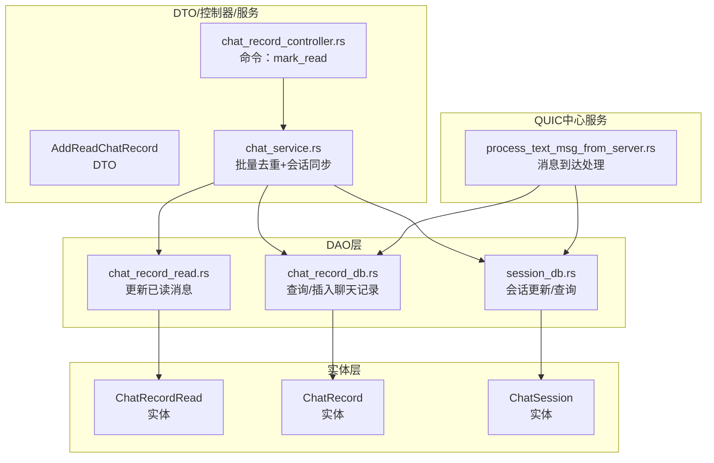
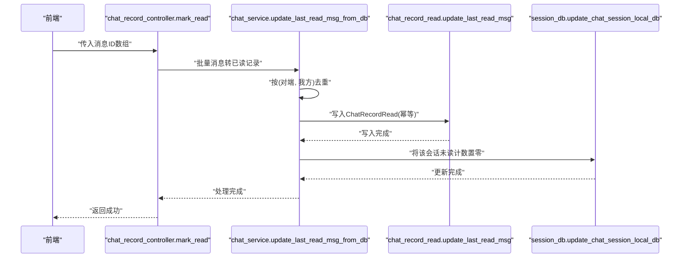
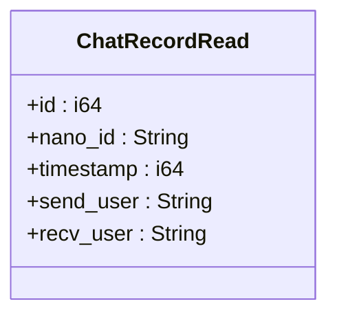
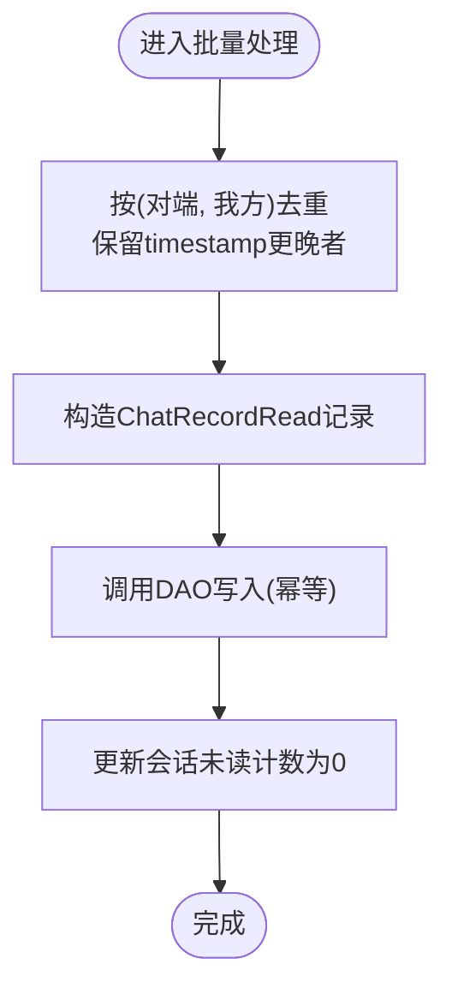
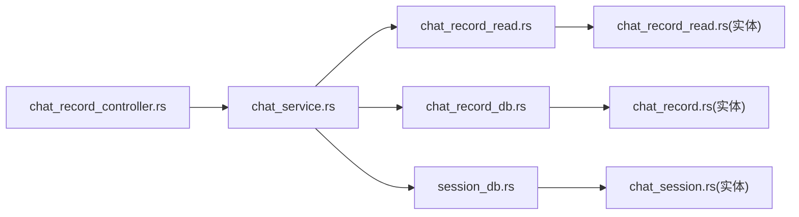

# 已读状态实体

<cite>
**本文引用的文件**
- [chat_record_read 实体](file://src-tauri/src/entity/chat_record_read.rs)
- [已读DAO：更新已读消息](file://src-tauri/src/dao/chat_record_read.rs)
- [新增已读DTO](file://src-tauri/src/dto/add_read_chat_record.rs)
- [聊天记录控制器：标记已读](file://src-tauri/src/cmd/chat_record_controller.rs)
- [聊天服务：批量更新已读与会话同步](file://src-tauri/src/service/chat_service.rs)
- [聊天记录DAO：查询与插入](file://src-tauri/src/dao/chat_record_db.rs)
- [会话DAO：会话更新与查询](file://src-tauri/src/dao/session_db.rs)
- [聊天记录实体](file://src-tauri/src/entity/chat_record.rs)
- [聊天会话实体](file://src-tauri/src/entity/chat_session.rs)
- [从服务器处理文本消息流程](file://src-tauri/src/quic_service/center_service/process_text_msg_from_server.rs)
</cite>

## 目录

1. [简介](#简介)
2. [项目结构](#项目结构)
3. [核心组件](#核心组件)
4. [架构总览](#架构总览)
5. [详细组件分析](#详细组件分析)
6. [依赖分析](#依赖分析)
7. [性能考虑](#性能考虑)
8. [故障排查指南](#故障排查指南)
9. [结论](#结论)
10. [附录](#附录)

## 简介

本文围绕 ChatRecordRead 数据模型与已读状态追踪体系，系统性阐述以下主题：

- 已读状态的数据结构与持久化机制
- 用户标识与时间戳记录策略
- 已读回执的触发时机、传播范围与状态同步
- 已读状态与消息 ID 的关联关系、批量标记与查询接口
- 增量更新、历史清理与性能优化建议
- 已读状态统计、群聊已读率计算与消息追踪的实现思路
- 网络异常下的容错与最终一致性保障

## 项目结构

已读状态相关代码主要分布在以下层次：

- 实体层：定义 ChatRecordRead 结构及表结构
- DAO 层：封装已读状态的增删改查与幂等更新
- DTO 层：对外暴露的新增已读参数结构
- 控制器层：提供命令入口（如“标记已读”）
- 服务层：聚合业务逻辑（批量去重、会话同步、清空未读）
- 会话与聊天记录 DAO：支撑查询、插入与会话更新
- QUIC 中心服务：消息到达后的会话与未读计数处理

图表来源

- [chat_record_read 实体:1-41](file://src-tauri/src/entity/chat_record_read.rs#L1-L41)
- [已读 DAO：更新已读消息:1-25](file://src-tauri/src/dao/chat_record_read.rs#L1-L25)
- [新增已读 DTO:1-10](file://src-tauri/src/dto/add_read_chat_record.rs#L1-L10)
- [聊天记录控制器：标记已读:1-80](file://src-tauri/src/cmd/chat_record_controller.rs#L1-L80)
- [聊天服务：批量更新已读与会话同步:1-582](file://src-tauri/src/service/chat_service.rs#L1-L582)
- [聊天记录 DAO：查询与插入:1-106](file://src-tauri/src/dao/chat_record_db.rs#L1-L106)
- [会话 DAO：会话更新与查询:1-117](file://src-tauri/src/dao/session_db.rs#L1-L117)
- [从服务器处理文本消息流程:1-200](file://src-tauri/src/quic_service/center_service/process_text_msg_from_server.rs#L1-L200)

章节来源

- [chat_record_read 实体:1-41](file://src-tauri/src/entity/chat_record_read.rs#L1-L41)
- [已读 DAO：更新已读消息:1-25](file://src-tauri/src/dao/chat_record_read.rs#L1-L25)
- [聊天记录控制器：标记已读:1-80](file://src-tauri/src/cmd/chat_record_controller.rs#L1-L80)
- [聊天服务：批量更新已读与会话同步:1-582](file://src-tauri/src/service/chat_service.rs#L1-L582)
- [聊天记录 DAO：查询与插入:1-106](file://src-tauri/src/dao/chat_record_db.rs#L1-L106)
- [会话 DAO：会话更新与查询:1-117](file://src-tauri/src/dao/session_db.rs#L1-L117)
- [从服务器处理文本消息流程:1-200](file://src-tauri/src/quic_service/center_service/process_text_msg_from_server.rs#L1-L200)

## 核心组件

- ChatRecordRead 实体：承载“某用户对某个对话的已读位置”，包含 nano_id（消息 ID）、时间戳、发送方与接收方标识。
- 已读 DAO：提供幂等更新（先尝试更新，若无变更则插入），确保同一发送方-接收方组合唯一。
- DTO：AddReadChatRecord 作为外部输入载体，便于统一参数校验与序列化。
- 控制器命令：mark_read 将前端传入的若干消息 ID 转换为已读记录并提交服务层处理。
- 服务层：批量去重、构造已读记录、调用 DAO 写入，并同步会话未读计数为 0。

章节来源

- [chat_record_read 实体:7-14](file://src-tauri/src/entity/chat_record_read.rs#L7-L14)
- [已读 DAO：更新已读消息:5-24](file://src-tauri/src/dao/chat_record_read.rs#L5-L24)
- [新增已读 DTO:3-9](file://src-tauri/src/dto/add_read_chat_record.rs#L3-L9)
- [聊天记录控制器：标记已读:46-58](file://src-tauri/src/cmd/chat_record_controller.rs#L46-L58)
- [聊天服务：批量更新已读与会话同步:180-240](file://src-tauri/src/service/chat_service.rs#L180-L240)

## 架构总览

已读状态在系统中的流转路径如下：

- 前端触发“标记已读”命令，携带若干消息 ID
- 控制器查询对应消息详情，交由服务层进行去重与构造
- 服务层将每条消息映射为 ChatRecordRead 记录并写入数据库
- 同步更新会话记录，将该会话未读计数置零并推送前端

图表来源

- [聊天记录控制器：标记已读:46-58](file://src-tauri/src/cmd/chat_record_controller.rs#L46-L58)
- [聊天服务：批量更新已读与会话同步:180-240](file://src-tauri/src/service/chat_service.rs#L180-L240)
- [已读 DAO：更新已读消息:5-24](file://src-tauri/src/dao/chat_record_read.rs#L5-L24)
- [会话 DAO：会话更新与查询:50-72](file://src-tauri/src/dao/session_db.rs#L50-L72)

## 详细组件分析

### ChatRecordRead 数据模型

- 字段说明
  - id：自增主键
  - nano_id：消息 ID（与聊天记录表中的 nano_id 关联）
  - timestamp：时间戳（用于去重与增量查询）
  - send_user：发送方
  - recv_user：接收方
- 表约束
  - 唯一索引：(send_user, recv_user)，保证每对用户仅有一条“已读位置”
- 存储机制
  - 通过 DAO 的幂等更新逻辑，避免重复写入；若无匹配记录则插入新记录

图表来源

- [chat_record_read 实体:7-14](file://src-tauri/src/entity/chat_record_read.rs#L7-L14)

章节来源

- [chat_record_read 实体:7-14](file://src-tauri/src/entity/chat_record_read.rs#L7-L14)
- [已读 DAO：更新已读消息:5-24](file://src-tauri/src/dao/chat_record_read.rs#L5-L24)

### 已读 DAO：幂等更新与表结构

- 幂等更新策略
  - 先尝试 UPDATE，若受影响行数为 0，则执行 INSERT
  - 以 (send_user, recv_user) 作为唯一键，确保并发安全
- 表结构要点
  - 主键自增
  - nano_id、timestamp、send_user、recv_user 字段
  - 唯一约束：(send_user, recv_user)

章节来源

- [已读 DAO：更新已读消息:5-24](file://src-tauri/src/dao/chat_record_read.rs#L5-L24)
- [chat_record_read 实体:16-31](file://src-tauri/src/entity/chat_record_read.rs#L16-L31)

### 新增已读 DTO：参数标准化

- 作用：对外暴露的新增已读参数结构，便于统一校验与序列化
- 字段：nano_id、timestamp、send_user、recv_user

章节来源

- [新增已读 DTO:3-9](file://src-tauri/src/dto/add_read_chat_record.rs#L3-L9)

### 控制器命令：mark_read 的调用链

- 输入：消息 ID 数组
- 流程：
  - 查询每条消息详情（需具备访问权限）
  - 调用服务层进行批量去重与构造
  - 写入已读记录并同步会话未读计数

章节来源

- [聊天记录控制器：标记已读:46-58](file://src-tauri/src/cmd/chat_record_controller.rs#L46-L58)

### 服务层：批量去重与会话同步

- 去重策略
  - 以 (对端用户, 我方用户) 为键，按 timestamp 取较新的消息
- 已读记录构造
  - 将消息映射为 ChatRecordRead，其中 recv_user 固定为“我方”，send_user 为“对端”
- 会话同步
  - 将该会话未读计数置零，并向前端推送事件

图表来源

- [聊天服务：批量更新已读与会话同步:180-240](file://src-tauri/src/service/chat_service.rs#L180-L240)

章节来源

- [聊天服务：批量更新已读与会话同步:180-240](file://src-tauri/src/service/chat_service.rs#L180-L240)

### 与消息 ID 的关联与查询

- 关联关系
  - ChatRecordRead.nano_id 对应 ChatRecord.nano_id，二者通过消息 ID 关联
- 查询接口
  - 通过 DAO 提供的查询函数可按 recv_user 与时间戳范围查询增量已读记录
  - 聊天记录 DAO 提供按 ID 查询与分页查询能力

章节来源

- [聊天记录 DAO：查询与插入:57-85](file://src-tauri/src/dao/chat_record_db.rs#L57-L85)
- [聊天记录实体:8-17](file://src-tauri/src/entity/chat_record.rs#L8-L17)

### 会话与未读计数同步

- 当某会话的已读位置推进时，服务层会将该会话未读计数置零，并通过事件推送前端
- 会话 DAO 提供本地更新与数据库更新两种方式，满足不同场景

章节来源

- [聊天服务：批量更新已读与会话同步:224-238](file://src-tauri/src/service/chat_service.rs#L224-L238)
- [会话 DAO：会话更新与查询:50-72](file://src-tauri/src/dao/session_db.rs#L50-L72)

### 消息到达与未读计数处理（参考）

- 当消息到达时，若当前会话处于激活状态，则未读计数置零并清空
- 否则增加未读计数并更新会话

章节来源

- [从服务器处理文本消息流程:128-186](file://src-tauri/src/quic_service/center_service/process_text_msg_from_server.rs#L128-L186)

## 依赖分析

- 组件耦合
  - 控制器依赖服务层；服务层依赖 DAO 与会话 DAO；DAO 依赖实体与数据库
- 关键依赖链
  - mark_read → update_last_read_msg_from_db → update_last_read_msg → ChatRecordRead 写入
  - 会话同步依赖 session_db.update_chat_session_local_db
- 外部依赖
  - SQLx 进行数据库操作
  - Tauri 事件系统用于向前端推送

图表来源

- [聊天记录控制器：标记已读:1-80](file://src-tauri/src/cmd/chat_record_controller.rs#L1-L80)
- [聊天服务：批量更新已读与会话同步:1-582](file://src-tauri/src/service/chat_service.rs#L1-L582)
- [已读 DAO：更新已读消息:1-25](file://src-tauri/src/dao/chat_record_read.rs#L1-L25)
- [聊天记录 DAO：查询与插入:1-106](file://src-tauri/src/dao/chat_record_db.rs#L1-L106)
- [会话 DAO：会话更新与查询:1-117](file://src-tauri/src/dao/session_db.rs#L1-L117)
- [chat_record_read 实体:1-41](file://src-tauri/src/entity/chat_record_read.rs#L1-L41)
- [聊天记录实体:1-61](file://src-tauri/src/entity/chat_record.rs#L1-L61)
- [聊天会话实体:1-72](file://src-tauri/src/entity/chat_session.rs#L1-L72)

## 性能考虑

- 幂等更新减少冲突写入成本
- 唯一索引 (send_user, recv_user) 降低重复写入风险
- 批量去重使用 HashMap，时间复杂度 O(n)
- 建议
  - 在高频场景下，可考虑批量事务提交以减少往返
  - 对会话更新采用本地更新（update_chat_session_local_db）降低前端抖动
  - 增量查询基于时间戳，避免全量扫描

## 故障排查指南

- 幂等更新未生效
  - 检查唯一键是否正确（send_user 与 recv_user 组合）
  - 确认 UPDATE 影响行数为 0 时是否成功执行 INSERT
- 会话未读计数异常
  - 确认服务层在写入已读后是否调用本地更新
  - 检查前端事件订阅是否正常
- 消息 ID 不匹配
  - 确认 ChatRecordRead.nano_id 与 ChatRecord.nano_id 是否一致
  - 核对查询消息详情的权限与条件

章节来源

- [已读 DAO：更新已读消息:5-24](file://src-tauri/src/dao/chat_record_read.rs#L5-L24)
- [聊天服务：批量更新已读与会话同步:224-238](file://src-tauri/src/service/chat_service.rs#L224-L238)
- [聊天记录 DAO：查询与插入:25-40](file://src-tauri/src/dao/chat_record_db.rs#L25-L40)

## 结论

ChatRecordRead 作为已读状态的核心实体，通过幂等更新与唯一键约束实现了高并发下的稳定性。配合服务层的批量去重与会话同步，系统能够在消息到达、用户标记已读等多场景下保持未读计数的一致性。结合增量查询与本地更新策略，可在保证用户体验的同时兼顾性能与可靠性。

## 附录

### 已读状态统计与群聊已读率计算（实现思路）

- 已读状态统计
  - 基于时间戳增量查询已读记录，统计近 X 小时内的已读次数分布
- 群聊已读率
  - 假设群成员集合为 M，消息发送时间为 T
  - 计算在 T 时间点前已读该消息的成员数 R
  - 已读率 = R / |M| × 100%
- 消息追踪
  - 以消息 ID 为索引，记录各成员的已读时间戳，形成“已读时间线”

说明：以上为概念性实现思路，具体实现需结合业务需求扩展 DAO 查询与统计模块。

### 网络异常与最终一致性

- 容错策略
  - 本地缓存未读计数与会话状态，消息到达时优先本地更新
  - 异常恢复后通过增量查询补齐缺失的已读记录
- 最终一致性
  - 通过幂等更新与会话本地更新，确保在异常后重启或重连时仍能收敛至一致状态
