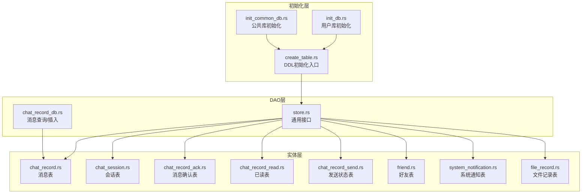
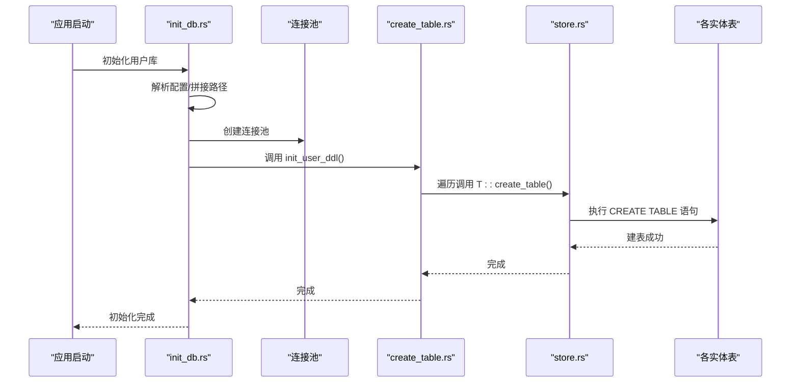
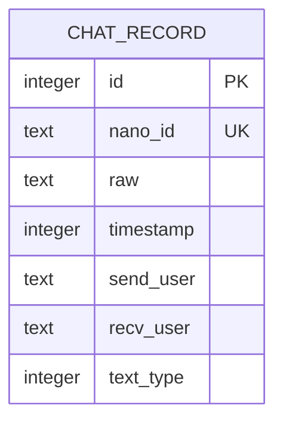
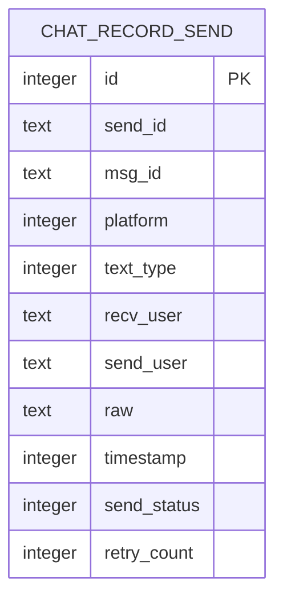
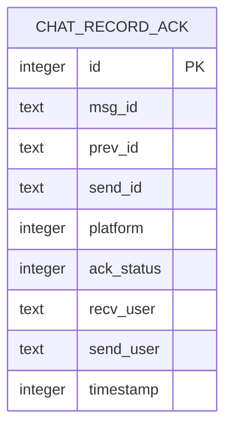
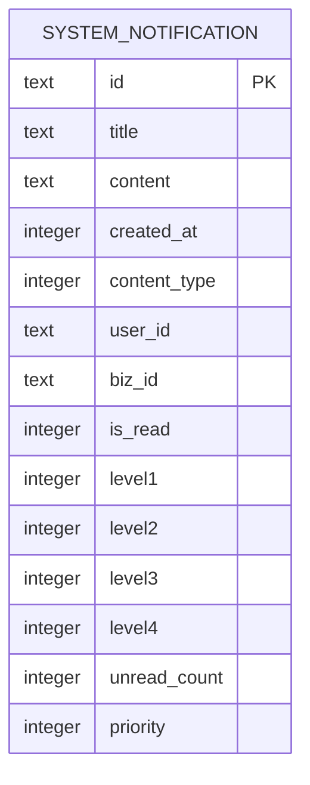
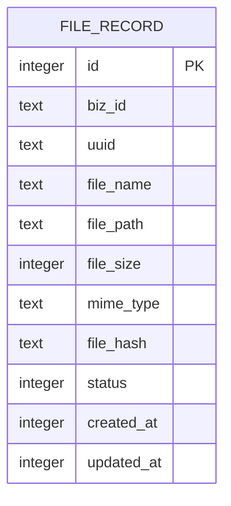
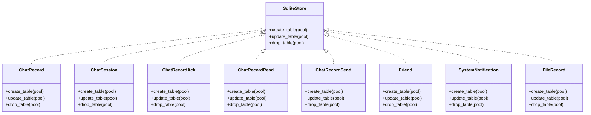

# 数据完整性与约束

<cite>
**本文引用的文件**
- [create_table.rs](file://src-tauri/src/dao/create_table.rs)
- [store.rs](file://src-tauri/src/dao/store.rs)
- [init_db.rs](file://src-tauri/src/dao/init_db.rs)
- [init_common_db.rs](file://src-tauri/src/dao/init_common_db.rs)
- [chat_record.rs](file://src-tauri/src/entity/chat_record.rs)
- [chat_session.rs](file://src-tauri/src/entity/chat_session.rs)
- [chat_record_ack.rs](file://src-tauri/src/entity/chat_record_ack.rs)
- [chat_record_read.rs](file://src-tauri/src/entity/chat_record_read.rs)
- [chat_record_send.rs](file://src-tauri/src/entity/chat_record_send.rs)
- [friend.rs](file://src-tauri/src/entity/friend.rs)
- [system_notification.rs](file://src-tauri/src/entity/system_notification.rs)
- [file_record.rs](file://src-tauri/src/entity/file_record.rs)
- [chat_record_db.rs](file://src-tauri/src/dao/chat_record_db.rs)
</cite>

## 目录

1. 引言
2. 项目结构
3. 核心组件
4. 架构总览
5. 详细组件分析
6. 依赖关系分析
7. 性能考虑
8. 故障排查指南
9. 结论
10. 附录

## 引言

本文件聚焦于聊天数据模型的“数据完整性与约束”，系统化阐述以下方面：

- 外键约束的设计原则、级联操作与引用完整性的现状与建议
- 唯一性约束（如 nano_id）、非空约束与检查约束的应用场景与实现
- 索引策略（主键索引、复合索引、全文索引）对查询性能的影响与优化
- 事务处理、并发控制与死锁预防机制
- 数据迁移策略、版本兼容性与向后兼容性保障
- 数据备份、恢复、完整性校验与修复机制
- 数据清理策略、存储空间管理与性能监控方案

## 项目结构

本项目采用 Rust + Tauri + SQLite 的桌面端架构，数据库层通过 sqlx 进行访问，采用“实体-DAO-初始化”三层组织方式：

- 实体层：定义数据模型与建表逻辑
- DAO 层：封装 SQL 查询与写入
- 初始化层：负责数据库连接池建立与表结构初始化



图表来源

- [init_db.rs:17-41](file://src-tauri/src/dao/init_db.rs#L17-L41)
- [init_common_db.rs:13-37](file://src-tauri/src/dao/init_common_db.rs#L13-L37)
- [create_table.rs:14-54](file://src-tauri/src/dao/create_table.rs#L14-L54)
- [store.rs:3-21](file://src-tauri/src/dao/store.rs#L3-L21)
- [chat_record.rs:19-44](file://src-tauri/src/entity/chat_record.rs#L19-L44)
- [chat_session.rs:41-71](file://src-tauri/src/entity/chat_session.rs#L41-L71)
- [chat_record_ack.rs:20-47](file://src-tauri/src/entity/chat_record_ack.rs#L20-L47)
- [chat_record_read.rs:16-40](file://src-tauri/src/entity/chat_record_read.rs#L16-L40)
- [chat_record_send.rs:22-51](file://src-tauri/src/entity/chat_record_send.rs#L22-L51)
- [friend.rs:27-62](file://src-tauri/src/entity/friend.rs#L27-L62)
- [system_notification.rs:116-161](file://src-tauri/src/entity/system_notification.rs#L116-L161)
- [file_record.rs:36-82](file://src-tauri/src/entity/file_record.rs#L36-L82)
- [chat_record_db.rs:1-106](file://src-tauri/src/dao/chat_record_db.rs#L1-L106)

章节来源

- [init_db.rs:17-75](file://src-tauri/src/dao/init_db.rs#L17-L75)
- [init_common_db.rs:13-49](file://src-tauri/src/dao/init_common_db.rs#L13-L49)
- [create_table.rs:14-54](file://src-tauri/src/dao/create_table.rs#L14-L54)
- [store.rs:3-21](file://src-tauri/src/dao/store.rs#L3-L21)

## 核心组件

- 数据库连接池与初始化
  - 用户库与公共库分别初始化，使用独立连接池，避免跨库耦合
  - 初始化流程：构建数据库路径 → 创建连接池 → 注册全局连接池 → 调用 DDL 初始化
- 表结构与约束
  - 消息表、会话表、确认表、已读表、发送表、好友表、系统通知表、文件记录表均通过实体实现统一的建表接口
  - 约束包括：主键、非空、唯一、默认值等
- 查询与写入
  - DAO 提供分页查询、按 ID 查询、按类型过滤、插入等常用操作
  - 查询语句严格绑定参数，避免注入风险

章节来源

- [init_db.rs:17-41](file://src-tauri/src/dao/init_db.rs#L17-L41)
- [init_common_db.rs:13-37](file://src-tauri/src/dao/init_common_db.rs#L13-L37)
- [chat_record.rs:19-44](file://src-tauri/src/entity/chat_record.rs#L19-L44)
- [chat_session.rs:41-71](file://src-tauri/src/entity/chat_session.rs#L41-L71)
- [chat_record_db.rs:7-106](file://src-tauri/src/dao/chat_record_db.rs#L7-L106)

## 架构总览

下图展示从初始化到建表、再到数据访问的整体流程。



图表来源

- [init_db.rs:17-41](file://src-tauri/src/dao/init_db.rs#L17-L41)
- [create_table.rs:26-41](file://src-tauri/src/dao/create_table.rs#L26-L41)
- [store.rs:12-20](file://src-tauri/src/dao/store.rs#L12-L20)
- [chat_record.rs:19-44](file://src-tauri/src/entity/chat_record.rs#L19-L44)

## 详细组件分析

### 消息表（chat_record）

- 设计要点
  - 主键：自增整型 id
  - 唯一性：nano_id 非空唯一，作为消息的外部标识
  - 非空字段：raw、timestamp、send_user、recv_user、text_type（默认 0）
  - 查询特性：支持按双方用户组合查询、按类型过滤、按时间排序分页
- 约束与一致性
  - 通过唯一性约束确保消息 ID 的全局唯一性
  - 通过非空约束保证消息内容与时间戳的完整性
- 查询模式
  - 分页查询、按 ID 查询、按类型过滤、统计对话条数等



图表来源

- [chat_record.rs:8-44](file://src-tauri/src/entity/chat_record.rs#L8-L44)

章节来源

- [chat_record.rs:8-61](file://src-tauri/src/entity/chat_record.rs#L8-L61)
- [chat_record_db.rs:7-106](file://src-tauri/src/dao/chat_record_db.rs#L7-L106)

### 会话表（chat_session）

- 设计要点
  - 主键：自增整型 id
  - 唯一性：(send_user, recv_user) 组合唯一，避免重复会话
  - 非空字段：timestamp、send_user、recv_user、text_type、unread_count、last_message、is_show、is_top、session_type
  - 默认值：多处字段设置默认值，保证新记录的一致性
- 约束与一致性
  - 组合唯一性约束确保单聊会话的唯一性
  - 非空与默认值约束减少空值带来的歧义

```mermaid
erDiagram
CHAT_SESSION {
integer id PK
text nano_id
integer timestamp
text send_user
text recv_user
integer text_type
integer unread_count
text last_message
integer is_show
integer is_top
integer session_type
}
"CHAT_SESSION" ||--|| "唯一约束: (send_user, recv_user)"
```

图表来源

- [chat_session.rs:8-57](file://src-tauri/src/entity/chat_session.rs#L8-L57)

章节来源

- [chat_session.rs:8-72](file://src-tauri/src/entity/chat_session.rs#L8-L72)

### 已读表（chat_record_read）

- 设计要点
  - 主键：自增整型 id
  - 唯一性：(send_user, recv_user) 组合唯一，表示某用户对另一用户的已读状态
  - 非空字段：nano_id、timestamp、send_user、recv_user
- 约束与一致性
  - 组合唯一性确保每对用户只保留一条已读记录

```mermaid
erDiagram
CHAT_RECORD_READ {
integer id PK
text nano_id
integer timestamp
text send_user
text recv_user
}
"CHAT_RECORD_READ" ||--|| "唯一约束: (send_user, recv_user)"
```

图表来源

- [chat_record_read.rs:7-26](file://src-tauri/src/entity/chat_record_read.rs#L7-L26)

章节来源

- [chat_record_read.rs:7-41](file://src-tauri/src/entity/chat_record_read.rs#L7-L41)

### 发送状态表（chat_record_send）

- 设计要点
  - 主键：自增整型 id
  - 非空字段：send_id、msg_id、platform、text_type、recv_user、send_user、raw、timestamp、send_status、retry_count
  - 默认值：text_type、send_status、retry_count 设置默认值
- 约束与一致性
  - 非空与默认值约束保证发送状态记录的可追踪性



图表来源

- [chat_record_send.rs:7-37](file://src-tauri/src/entity/chat_record_send.rs#L7-L37)

章节来源

- [chat_record_send.rs:7-52](file://src-tauri/src/entity/chat_record_send.rs#L7-L52)

### 确认表（chat_record_ack）

- 设计要点
  - 主键：自增整型 id
  - 非空字段：msg_id、prev_id、send_id、platform、ack_status、recv_user、send_user、timestamp
- 约束与一致性
  - 通过非空约束保证确认记录的完整性



图表来源

- [chat_record_ack.rs:7-33](file://src-tauri/src/entity/chat_record_ack.rs#L7-L33)

章节来源

- [chat_record_ack.rs:7-48](file://src-tauri/src/entity/chat_record_ack.rs#L7-L48)

### 好友表（friend）

- 设计要点
  - 主键：自增整型 id
  - 唯一性：(friend_id, me) 组合唯一，确保用户与好友关系唯一
  - 非空字段：friend_id、friend_account、friend_name、friend_icon、friend_info、me、version
  - 默认值：多处字段设置默认值
- 约束与一致性
  - 组合唯一性确保好友关系的唯一性

```mermaid
erDiagram
FRIEND {
integer id PK
integer created_at
integer updated_at
text friend_id
text friend_account
text friend_name
text friend_icon
text friend_info
integer friend_status
text me
integer is_del
integer is_block
integer is_mute
integer is_top
integer is_show
integer version
}
"FRIEND" ||--|| "唯一约束: (friend_id, me)"
```

图表来源

- [friend.rs:7-48](file://src-tauri/src/entity/friend.rs#L7-L48)

章节来源

- [friend.rs:7-63](file://src-tauri/src/entity/friend.rs#L7-L63)

### 系统通知表（system_notification）

- 设计要点
  - 主键：id 文本类型
  - 非空字段：title、content、created_at、content_type、user_id、level1、level2、level3、level4、priority
  - 默认值：priority 默认 0
- 索引策略
  - 在初始化时创建复合索引：(user_id, created_at) 与 is_read 单列索引，提升查询效率
- 约束与一致性
  - 主键与非空约束保证记录唯一性与完整性；索引优化查询性能



图表来源

- [system_notification.rs:10-134](file://src-tauri/src/entity/system_notification.rs#L10-L134)

章节来源

- [system_notification.rs:116-161](file://src-tauri/src/entity/system_notification.rs#L116-L161)

### 文件记录表（file_record）

- 设计要点
  - 主键：自增整型 id
  - 字段覆盖业务 ID、UUID、文件名、路径、大小、MIME、哈希、状态、时间戳等
- 约束与一致性
  - 通过状态字段与查询条件配合，实现文件生命周期管理



图表来源

- [file_record.rs:10-52](file://src-tauri/src/entity/file_record.rs#L10-L52)

章节来源

- [file_record.rs:36-83](file://src-tauri/src/entity/file_record.rs#L36-L83)

### 外键约束与引用完整性

- 现状
  - 当前建表语句未显式声明外键约束
  - 通过业务层约束与唯一性约束保障引用完整性
- 建议
  - 对存在“引用关系”的字段（如会话与消息、好友与会话）在建表时添加外键约束，并明确 ON DELETE/ON UPDATE 行为
  - 在业务层增加外键存在性校验，防止悬挂引用

章节来源

- [chat_record.rs:19-44](file://src-tauri/src/entity/chat_record.rs#L19-L44)
- [chat_session.rs:41-71](file://src-tauri/src/entity/chat_session.rs#L41-L71)
- [friend.rs:27-62](file://src-tauri/src/entity/friend.rs#L27-L62)

### 唯一性约束与非空约束

- 唯一性
  - 消息表：nano_id 唯一
  - 会话表：(send_user, recv_user) 唯一
  - 已读表：(send_user, recv_user) 唯一
  - 好友表：(friend_id, me) 唯一
- 非空与默认值
  - 多表对关键字段设置非空与默认值，降低空值风险
- 检查约束
  - 当前未使用检查约束；可通过触发器或业务层校验实现

章节来源

- [chat_record.rs:24](file://src-tauri/src/entity/chat_record.rs#L24)
- [chat_session.rs:56](file://src-tauri/src/entity/chat_session.rs#L56)
- [chat_record_read.rs:25](file://src-tauri/src/entity/chat_record_read.rs#L25)
- [friend.rs:47](file://src-tauri/src/entity/friend.rs#L47)

### 索引策略与查询优化

- 已有索引
  - 系统通知表：(user_id, created_at) 复合索引、is_read 单列索引
- 建议索引
  - 消息表：按 (send_user, recv_user, timestamp) 复合索引，支持高效分页与范围查询
  - 会话表：按 (send_user, recv_user) 复合索引，匹配唯一性查询
  - 已读表：按 (send_user, recv_user) 复合索引
  - 发送状态表：按 (send_user, recv_user, timestamp) 复合索引
  - 系统通知表：按 user_id、is_read、created_at 建立复合索引以优化筛选与排序
- 全文索引
  - SQLite 不支持原生全文索引；可通过 FTS5 或业务层分词实现

章节来源

- [system_notification.rs:142-156](file://src-tauri/src/entity/system_notification.rs#L142-L156)
- [chat_record_db.rs:7-23](file://src-tauri/src/dao/chat_record_db.rs#L7-L23)

### 事务处理、并发控制与死锁预防

- 事务处理
  - 当前 DAO 层以单条 SQL 执行为主；对于多步写入（如插入消息与更新会话），应使用事务包裹
- 并发控制
  - 使用连接池并发访问；SQLite 在 WAL 模式下具备较好并发能力
- 死锁预防
  - 统一写入顺序（如先消息后会话），避免循环依赖
  - 合理设置超时与重试策略

章节来源

- [init_db.rs:22-32](file://src-tauri/src/dao/init_db.rs#L22-L32)
- [chat_record_db.rs:42-55](file://src-tauri/src/dao/chat_record_db.rs#L42-L55)

### 数据迁移、版本兼容与向后兼容

- 版本字段
  - 好友表包含 version 字段，可用于迁移标记
- 迁移策略
  - 新增字段：使用 ALTER TABLE 添加默认值，避免破坏现有记录
  - 修改约束：先添加新约束，再回填数据，最后启用约束
  - 删除字段：先迁移至新表，再删除旧表
- 向后兼容
  - 保持主键与关键字段不变，新增字段可选
  - 通过默认值与可空字段保证旧版本数据可用

章节来源

- [friend.rs:24](file://src-tauri/src/entity/friend.rs#L24)
- [store.rs:6-9](file://src-tauri/src/dao/store.rs#L6-L9)

### 备份、恢复、完整性校验与修复

- 备份与恢复
  - SQLite 文件即数据库；可直接复制 .db 文件进行备份
  - 恢复时需停止写入，替换文件后重启服务
- 完整性校验
  - 使用 PRAGMA integrity_check 或在线备份工具进行校验
- 修复
  - 对于损坏的数据库，可尝试 VACUUM 或重建表结构

章节来源

- [init_db.rs:68-74](file://src-tauri/src/dao/init_db.rs#L68-L74)

### 数据清理、存储管理与性能监控

- 清理策略
  - 消息表：按时间窗口清理历史消息；结合会话表统计活跃度
  - 已读表：定期清理过期记录
  - 文件记录表：按状态与时间清理临时文件
- 存储管理
  - 监控数据库文件大小，设定阈值告警
  - 使用 WAL 模式与定期 VACUUM 降低文件膨胀
- 性能监控
  - 记录慢查询日志，识别热点查询
  - 监控连接池使用率与等待队列长度

章节来源

- [file_record.rs:70-82](file://src-tauri/src/entity/file_record.rs#L70-L82)
- [chat_record_db.rs:74-85](file://src-tauri/src/dao/chat_record_db.rs#L74-L85)

## 依赖关系分析



图表来源

- [store.rs:3-21](file://src-tauri/src/dao/store.rs#L3-L21)
- [chat_record.rs:19-44](file://src-tauri/src/entity/chat_record.rs#L19-L44)
- [chat_session.rs:41-71](file://src-tauri/src/entity/chat_session.rs#L41-L71)
- [chat_record_ack.rs:20-47](file://src-tauri/src/entity/chat_record_ack.rs#L20-L47)
- [chat_record_read.rs:16-40](file://src-tauri/src/entity/chat_record_read.rs#L16-L40)
- [chat_record_send.rs:22-51](file://src-tauri/src/entity/chat_record_send.rs#L22-L51)
- [friend.rs:27-62](file://src-tauri/src/entity/friend.rs#L27-L62)
- [system_notification.rs:116-161](file://src-tauri/src/entity/system_notification.rs#L116-L161)
- [file_record.rs:36-82](file://src-tauri/src/entity/file_record.rs#L36-L82)

## 性能考虑

- 查询路径
  - 消息分页与按类型过滤：建议在 (send_user, recv_user, timestamp) 建立复合索引
  - 会话唯一查询：(send_user, recv_user) 复合索引
  - 系统通知：(user_id, created_at) 与 is_read 单列索引已存在
- 写入路径
  - 批量写入建议使用事务包裹，减少 WAL 切换开销
- 存储模式
  - 使用 WAL 模式提升并发读取性能
  - 定期执行 VACUUM 或在线备份，避免文件膨胀

章节来源

- [chat_record_db.rs:7-23](file://src-tauri/src/dao/chat_record_db.rs#L7-L23)
- [system_notification.rs:142-156](file://src-tauri/src/entity/system_notification.rs#L142-L156)

## 故障排查指南

- 常见问题
  - 唯一性冲突：检查 nano_id、(send_user, recv_user)、(friend_id, me) 是否重复
  - 查询性能差：确认是否命中复合索引；必要时调整索引或查询条件
  - 写入阻塞：检查事务是否过长、连接池是否饱和
- 诊断步骤
  - 查看慢查询日志与执行计划
  - 使用 PRAGMA wal_checkpoint 强制检查点
  - 备份后进行完整性校验

章节来源

- [chat_record.rs:24](file://src-tauri/src/entity/chat_record.rs#L24)
- [chat_session.rs:56](file://src-tauri/src/entity/chat_session.rs#L56)
- [friend.rs:47](file://src-tauri/src/entity/friend.rs#L47)

## 结论

本项目通过统一的建表接口与严格的约束设计，实现了消息、会话、好友、系统通知等核心数据模型的完整性与一致性。建议后续补充外键约束、检查约束与更完善的索引策略，并在多步写入场景引入事务，以进一步提升数据可靠性与查询性能。

## 附录

- 关键查询路径参考
  - 分页查询与按 ID 查询：[chat_record_db.rs:7-40](file://src-tauri/src/dao/chat_record_db.rs#L7-L40)
  - 按类型过滤与统计：[chat_record_db.rs:87-106](file://src-tauri/src/dao/chat_record_db.rs#L87-L106)
- 建表入口参考
  - 用户库初始化：[init_db.rs:17-41](file://src-tauri/src/dao/init_db.rs#L17-L41)
  - 公共库初始化：[init_common_db.rs:13-37](file://src-tauri/src/dao/init_common_db.rs#L13-L37)
  - DDL 初始化入口：[create_table.rs:26-41](file://src-tauri/src/dao/create_table.rs#L26-L41)
