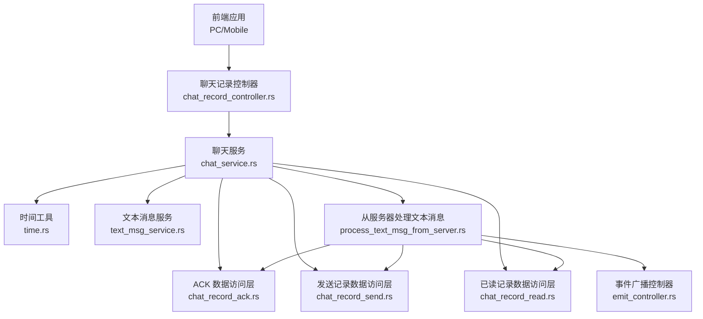
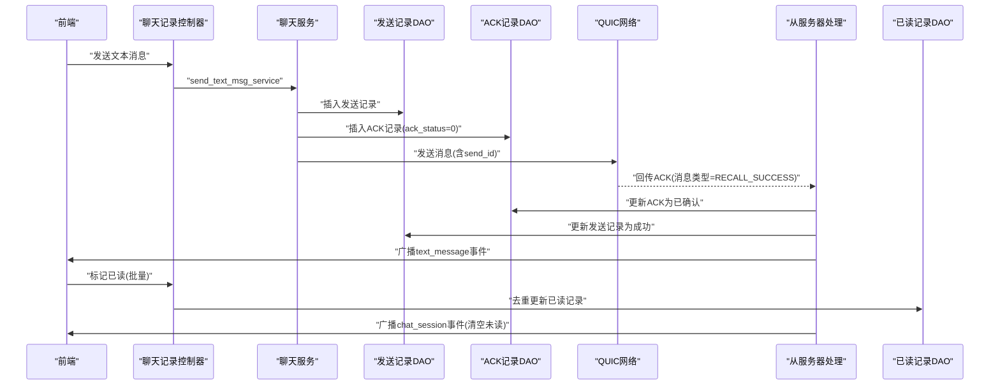
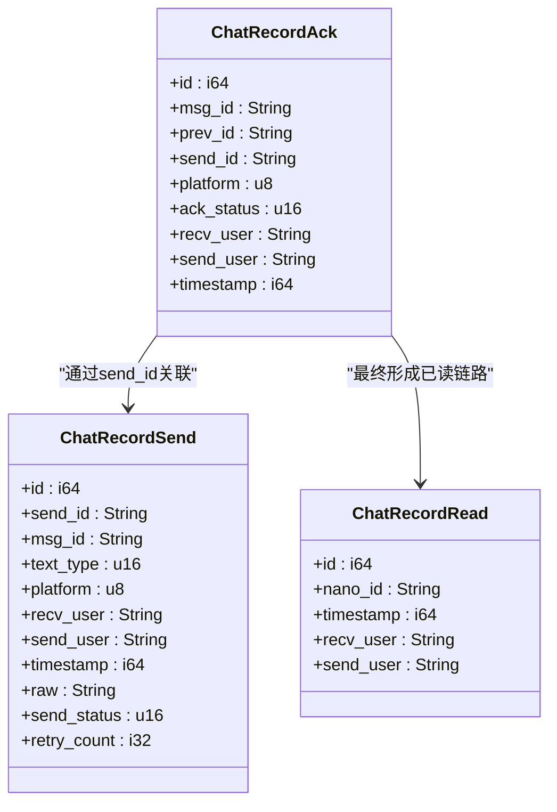
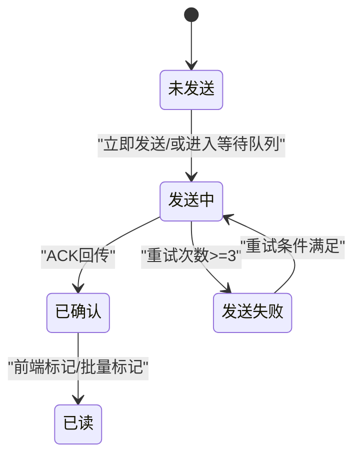
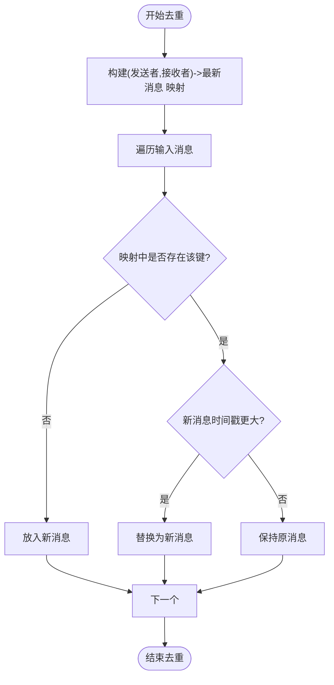
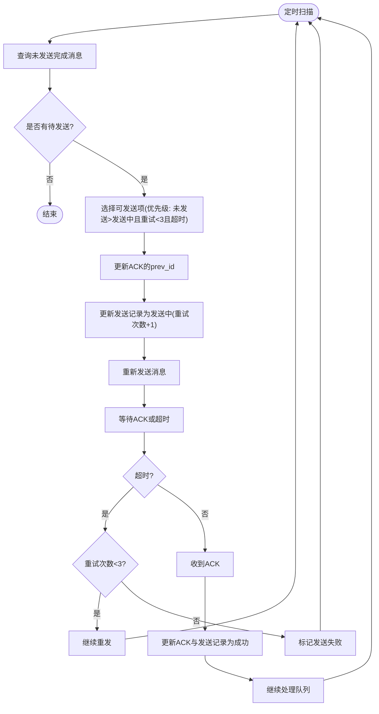
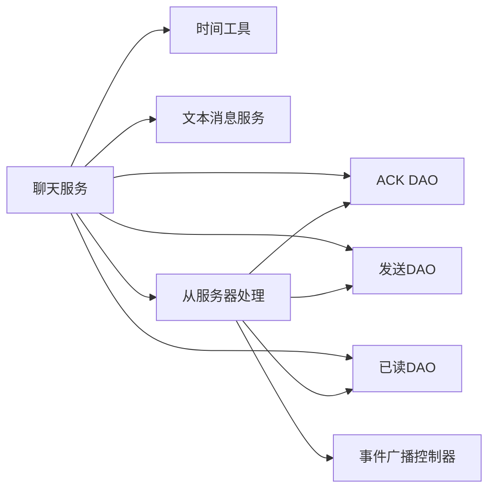

# 确认状态实体

<cite>
**本文引用的文件**
- [chat_record_ack 实体](file://src-tauri/src/entity/chat_record_ack.rs)
- [chat_record_ack 数据访问层](file://src-tauri/src/dao/chat_record_ack.rs)
- [chat_record_send 实体](file://src-tauri/src/entity/chat_record_send.rs)
- [chat_record_send 数据访问层](file://src-tauri/src/dao/chat_record_send.rs)
- [chat_record_read 实体](file://src-tauri/src/entity/chat_record_read.rs)
- [chat_record_read 数据访问层](file://src-tauri/src/dao/chat_record_read.rs)
- [聊天服务](file://src-tauri/src/service/chat_service.rs)
- [聊天记录控制器](file://src-tauri/src/cmd/chat_record_controller.rs)
- [文本消息服务](file://src-tauri/src/quic_service/center_service/text_msg_service.rs)
- [从服务器处理文本消息](file://src-tauri/src/quic_service/center_service/process_text_msg_from_server.rs)
- [时间工具](file://src-tauri/src/utils/time.rs)
- [事件广播控制器](file://src-tauri/src/emit_app/emit_controller.rs)
</cite>

## 目录
1. [引言](#引言)
2. [项目结构](#项目结构)
3. [核心组件](#核心组件)
4. [架构总览](#架构总览)
5. [详细组件分析](#详细组件分析)
6. [依赖关系分析](#依赖关系分析)
7. [性能考量](#性能考量)
8. [故障排查指南](#故障排查指南)
9. [结论](#结论)
10. [附录](#附录)

## 引言
本文件围绕 ChatRecordAck 确认状态实体，系统性阐述消息确认机制在发送、送达、已读三个层级上的设计与实现，覆盖状态流转、存储格式、权限校验、时间戳管理、广播与冲突处理、去重策略、查询与统计、异常处理、重传触发条件、确认超时与网络恢复检测，以及分布式环境下的一致性与可靠性保障。

## 项目结构
本项目采用前后端分离的桌面应用架构，Rust 后端通过 Tauri 暴露命令接口，前端通过 IPC 与后端交互；消息通过 QUIC 传输，确认机制由本地 SQLite 表与服务层逻辑共同实现。

**图表来源**
- [聊天记录控制器:1-80](file://src-tauri/src/cmd/chat_record_controller.rs#L1-L80)
- [聊天服务:1-582](file://src-tauri/src/service/chat_service.rs#L1-L582)
- [chat_record_ack 数据访问层:1-77](file://src-tauri/src/dao/chat_record_ack.rs#L1-L77)
- [chat_record_send 数据访问层:1-104](file://src-tauri/src/dao/chat_record_send.rs#L1-L104)
- [chat_record_read 数据访问层:1-25](file://src-tauri/src/dao/chat_record_read.rs#L1-L25)
- [文本消息服务:1-135](file://src-tauri/src/quic_service/center_service/text_msg_service.rs#L1-L135)
- [从服务器处理文本消息:1-387](file://src-tauri/src/quic_service/center_service/process_text_msg_from_server.rs#L1-L387)
- [事件广播控制器:1-65](file://src-tauri/src/emit_app/emit_controller.rs#L1-L65)

**章节来源**
- [聊天记录控制器:1-80](file://src-tauri/src/cmd/chat_record_controller.rs#L1-L80)
- [聊天服务:1-582](file://src-tauri/src/service/chat_service.rs#L1-L582)

## 核心组件
- ChatRecordAck：本地确认状态实体，记录每条发送消息的确认进展（未确认/已确认）、关联 send_id、prev_id、平台、接收/发送用户、时间戳等。
- ChatRecordSend：本地发送记录实体，记录消息发送状态（未发送/发送中/发送失败/发送成功）、重试次数、原始内容、时间戳等。
- ChatRecordRead：已读记录实体，按“发送用户-接收用户”维度维护最新已读 nano_id 与时间戳，具备唯一约束以避免重复写入。
- 文本消息服务：负责消息打包、CRC 校验、头部拼装与解析。
- 从服务器处理文本消息：负责消息分发、ACK 处理、会话更新、事件广播与后续重试调度。

**章节来源**
- [chat_record_ack 实体:1-48](file://src-tauri/src/entity/chat_record_ack.rs#L1-L48)
- [chat_record_send 实体:1-52](file://src-tauri/src/entity/chat_record_send.rs#L1-L52)
- [chat_record_read 实体:1-41](file://src-tauri/src/entity/chat_record_read.rs#L1-L41)

## 架构总览
确认状态机制贯穿“发送—传输—确认—已读”的全链路，核心要点如下：
- 发送阶段：生成 ChatRecordSend 记录与 ChatRecordAck 记录，设置 ack_status=0，并在需要时进入等待队列或立即发送。
- 传输阶段：通过 QUIC 文本消息服务打包发送，携带 send_id 以便服务端回传 ACK。
- 确认阶段：服务端返回 MSG_TYPE_RECALL_SUCCESS 类型消息，后端解析并更新 ACK 与发送记录，同时触发后续待发送消息的处理。
- 已读阶段：前端标记已读或批量标记，后端去重后更新 ChatRecordRead，并广播会话变更。

**图表来源**
- [聊天记录控制器:16-37](file://src-tauri/src/cmd/chat_record_controller.rs#L16-L37)
- [聊天服务:280-374](file://src-tauri/src/service/chat_service.rs#L280-L374)
- [chat_record_ack 数据访问层:4-62](file://src-tauri/src/dao/chat_record_ack.rs#L4-L62)
- [chat_record_send 数据访问层:4-57](file://src-tauri/src/dao/chat_record_send.rs#L4-L57)
- [从服务器处理文本消息:99-259](file://src-tauri/src/quic_service/center_service/process_text_msg_from_server.rs#L99-L259)
- [chat_record_read 数据访问层:4-24](file://src-tauri/src/dao/chat_record_read.rs#L4-L24)

## 详细组件分析

### ChatRecordAck 设计与实现
- 结构字段
  - msg_id：服务端分配的消息 ID（ACK 回传后填充）
  - prev_id：上一条消息的 msg_id，用于链式确认
  - send_id：本地发送标识，与发送记录关联
  - platform：平台标识
  - ack_status：确认状态（0 未确认，1 已确认）
  - recv_user/send_user：接收方与发送方用户标识
  - timestamp：消息时间戳
- 存储建表
  - 自增主键 id
  - 唯一性与默认值：ack_status 默认 0
  - 关联字段：msg_id、prev_id、send_id、recv_user、send_user
- 生命周期
  - 插入：发送前创建，ack_status=0
  - 更新：ACK 回传后更新 ack_status=1，并填充 msg_id
  - 查询：按 send_id 或 send_id+recv_user 查询

**图表来源**
- [chat_record_ack 实体:7-18](file://src-tauri/src/entity/chat_record_ack.rs#L7-L18)
- [chat_record_send 实体:7-20](file://src-tauri/src/entity/chat_record_send.rs#L7-L20)
- [chat_record_read 实体:7-14](file://src-tauri/src/entity/chat_record_read.rs#L7-L14)

**章节来源**
- [chat_record_ack 实体:1-48](file://src-tauri/src/entity/chat_record_ack.rs#L1-L48)
- [chat_record_ack 数据访问层:4-77](file://src-tauri/src/dao/chat_record_ack.rs#L4-L77)

### 确认层级与状态流转
- 发送层（ChatRecordSend）
  - send_status=0：等待队列（未发送）
  - send_status=1：发送中（可重试）
  - send_status=2：发送失败（超过重试阈值）
  - send_status=3：发送成功（ACK 回传）
- 送达层（ChatRecordAck）
  - ack_status=0：未确认
  - ack_status=1：已确认（服务端回传）
- 已读层（ChatRecordRead）
  - 维护每对用户间的最新已读 nano_id 与时间戳，UNIQUE 约束确保幂等

**图表来源**
- [chat_record_send 实体:16-19](file://src-tauri/src/entity/chat_record_send.rs#L16-L19)
- [chat_record_ack 实体:14-14](file://src-tauri/src/entity/chat_record_ack.rs#L14-L14)
- [chat_record_read 实体:10-10](file://src-tauri/src/entity/chat_record_read.rs#L10-L10)

**章节来源**
- [chat_record_send 实体:1-52](file://src-tauri/src/entity/chat_record_send.rs#L1-L52)
- [chat_record_read 实体:1-41](file://src-tauri/src/entity/chat_record_read.rs#L1-L41)

### 存储格式与权限校验
- 存储格式
  - SQLite 表结构：各实体均实现 SqliteStore trait，提供 create_table/update_table/drop_table
  - ChatRecordAck：包含 msg_id、prev_id、send_id、platform、ack_status、recv_user、send_user、timestamp
  - ChatRecordSend：包含 send_id、msg_id、text_type、platform、recv_user、send_user、raw、timestamp、send_status、retry_count
  - ChatRecordRead：UNIQUE(send_user, recv_user)，避免重复更新
- 权限校验
  - 发送与查询均基于 send_user/recv_user 进行过滤，确保仅操作本人相关记录
  - 控制器层通过 get_user_info 获取当前用户 UUID，避免越权

**章节来源**
- [chat_record_ack 实体:20-47](file://src-tauri/src/entity/chat_record_ack.rs#L20-L47)
- [chat_record_send 实体:22-51](file://src-tauri/src/entity/chat_record_send.rs#L22-L51)
- [chat_record_read 实体:16-40](file://src-tauri/src/entity/chat_record_read.rs#L16-L40)
- [聊天记录控制器:46-58](file://src-tauri/src/cmd/chat_record_controller.rs#L46-L58)

### 时间戳管理
- 生成策略：统一使用 get_now_time_stamp_as_millis 获取毫秒级时间戳
- 用途：
  - ChatRecordSend.timestamp：用于超时与重试判定
  - ChatRecordRead.timestamp：用于去重比较
  - ChatRecordAck.timestamp：用于日志与排序

**章节来源**
- [时间工具:6-25](file://src-tauri/src/utils/time.rs#L6-L25)
- [聊天服务:282-315](file://src-tauri/src/service/chat_service.rs#L282-L315)
- [从服务器处理文本消息:226-229](file://src-tauri/src/quic_service/center_service/process_text_msg_from_server.rs#L226-L229)

### 广播机制、冲突处理与去重策略
- 广播机制
  - 文本消息到达：向前端广播 "text_message"
  - 会话更新：向前端广播 "chat_session"（包含 unread_count=0）
  - 通知消息：向前端广播 "listen_notify_msg"
- 冲突处理
  - 已读去重：按 (发送者, 接收者) 为键，保留时间戳更大的消息，避免重复更新
  - ACK 去重：ACK 回传后更新 ACK 与发送记录，确保一致性
- 去重策略
  - 已读去重：HashMap 按键去重，时间戳优先
  - 会话去重：若会话已存在且未读计数为 0，不再重复处理

**图表来源**
- [聊天服务:185-240](file://src-tauri/src/service/chat_service.rs#L185-L240)

**章节来源**
- [聊天服务:180-240](file://src-tauri/src/service/chat_service.rs#L180-L240)
- [从服务器处理文本消息:239-258](file://src-tauri/src/quic_service/center_service/process_text_msg_from_server.rs#L239-L258)
- [事件广播控制器:60-64](file://src-tauri/src/emit_app/emit_controller.rs#L60-L64)

### 确认状态查询、统计与异常处理
- 查询
  - 按 send_id 查询 ACK 记录
  - 按 send_id+recv_user 查询发送记录
  - 按 nano_id 查询聊天记录（用于标记已读）
- 统计
  - 会话未读计数：通过 clear_chat_session 将 unread_count 归零
  - 已读统计：按用户维度维护最新已读位置
- 异常处理
  - DAO 层统一返回 Result，上层通过 map_err 转换为字符串错误
  - 控制器层对锁获取超时进行明确提示
  - 服务层对网络与解析异常进行日志记录与错误传播

**章节来源**
- [chat_record_ack 数据访问层:21-46](file://src-tauri/src/dao/chat_record_ack.rs#L21-L46)
- [chat_record_send 数据访问层:59-103](file://src-tauri/src/dao/chat_record_send.rs#L59-L103)
- [聊天记录控制器:16-79](file://src-tauri/src/cmd/chat_record_controller.rs#L16-L79)
- [聊天服务:103-115](file://src-tauri/src/service/chat_service.rs#L103-L115)

### 重传触发条件、确认超时与网络恢复检测
- 重传触发条件
  - 存在未发送完成的消息（send_status ∈ {0,1}）
  - 当前接收用户无更早的“发送中”消息
  - 对于 send_status=1 的消息，重试次数小于 3 且距离上次发送时间超过 8 秒
- 确认超时
  - ChatRecordSend.timestamp 用于计算“超过 1 分钟未确认”的失败判定（注释说明）
- 网络恢复检测
  - 定时任务扫描待发送队列，自动重发
  - ACK 回传后，异步执行 process_no_send_success_msg，继续处理队列中的消息

**图表来源**
- [聊天服务:398-491](file://src-tauri/src/service/chat_service.rs#L398-L491)
- [chat_record_send 数据访问层:39-57](file://src-tauri/src/dao/chat_record_send.rs#L39-L57)

**章节来源**
- [聊天服务:398-491](file://src-tauri/src/service/chat_service.rs#L398-L491)
- [chat_record_send 数据访问层:25-57](file://src-tauri/src/dao/chat_record_send.rs#L25-L57)

### 分布式一致性与可靠性保障
- 本地一致性
  - SQLite 事务：所有更新操作在单个连接池上执行，保证原子性
  - 唯一约束：ChatRecordRead 的 UNIQUE 确保幂等
- 远程一致性
  - 通过 send_id 关联本地 ACK 与服务端消息 ID，ACK 回传后双端同步
  - 事件广播确保前端与后端状态一致
- 可靠性
  - 重试机制：最大 3 次重试，超时阈值 8 秒
  - 超时失败：超过重试上限标记失败，避免无限占用队列
  - 锁保护：消息发送与队列处理使用全局锁，避免并发冲突

**章节来源**
- [chat_record_read 实体:16-26](file://src-tauri/src/entity/chat_record_read.rs#L16-L26)
- [聊天服务:560-581](file://src-tauri/src/service/chat_service.rs#L560-L581)
- [从服务器处理文本消息:226-238](file://src-tauri/src/quic_service/center_service/process_text_msg_from_server.rs#L226-L238)

## 依赖关系分析
- 组件耦合
  - 聊天服务依赖 DAO 层与时间工具，向上暴露命令接口
  - 文本消息服务与从服务器处理模块分别负责编码与解码、ACK 处理
  - 事件广播控制器负责将后端状态推送到前端
- 外部依赖
  - SQLx：SQLite ORM
  - Tauri：IPC 与事件广播
  - Tokio：异步运行时与锁

**图表来源**
- [聊天服务:14-41](file://src-tauri/src/service/chat_service.rs#L14-L41)
- [从服务器处理文本消息:11-32](file://src-tauri/src/quic_service/center_service/process_text_msg_from_server.rs#L11-L32)
- [事件广播控制器:1-7](file://src-tauri/src/emit_app/emit_controller.rs#L1-L7)

**章节来源**
- [聊天服务:1-582](file://src-tauri/src/service/chat_service.rs#L1-L582)
- [从服务器处理文本消息:1-387](file://src-tauri/src/quic_service/center_service/process_text_msg_from_server.rs#L1-L387)

## 性能考量
- 数据库访问
  - 批量查询与去重减少 IO 次数
  - 唯一约束避免重复写入
- 异步与锁
  - 全局锁保护关键路径，避免竞态
  - 异步任务处理队列与 ACK 回传，降低阻塞
- 网络效率
  - QUIC 复用连接，减少握手开销
  - CRC 校验与粘包处理提升稳定性

## 故障排查指南
- 常见问题
  - 锁获取超时：检查 GLOBAL_MSG_SEND_LOCK 是否被长时间持有
  - ACK 未回传：检查网络连通性与服务端处理流程
  - 已读未生效：确认去重逻辑是否正确保留最新消息
- 日志定位
  - 服务端处理：process_ack_type、process_text_type、process_msg
  - 客户端发送：send_text_msg_service、process_no_send_success_msg
- 快速修复
  - 重启应用以清理异常状态
  - 清理本地数据库相关表后重试

**章节来源**
- [聊天记录控制器:18-36](file://src-tauri/src/cmd/chat_record_controller.rs#L18-L36)
- [聊天服务:398-491](file://src-tauri/src/service/chat_service.rs#L398-L491)
- [从服务器处理文本消息:202-259](file://src-tauri/src/quic_service/center_service/process_text_msg_from_server.rs#L202-L259)

## 结论
ChatRecordAck 在本项目中承担了消息确认状态的本地持久化与流转控制职责，配合 ChatRecordSend 与 ChatRecordRead 构成完整的“发送—送达—已读”三层确认体系。通过严格的权限校验、去重策略、广播机制与重试超时控制，系统在复杂网络环境下实现了高可靠的消息确认与一致性保障。

## 附录
- 关键实现路径参考
  - [发送文本消息:280-374](file://src-tauri/src/service/chat_service.rs#L280-L374)
  - [ACK 回传处理:202-259](file://src-tauri/src/quic_service/center_service/process_text_msg_from_server.rs#L202-L259)
  - [重试与队列处理:398-491](file://src-tauri/src/service/chat_service.rs#L398-L491)
  - [已读去重与广播:180-240](file://src-tauri/src/service/chat_service.rs#L180-L240)