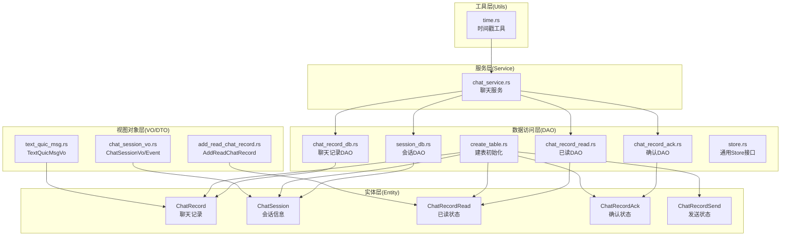
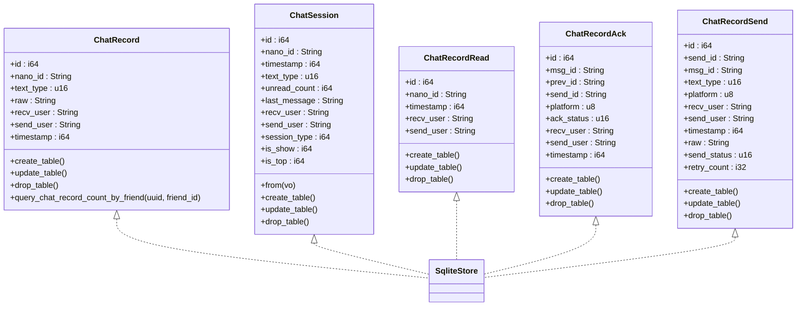
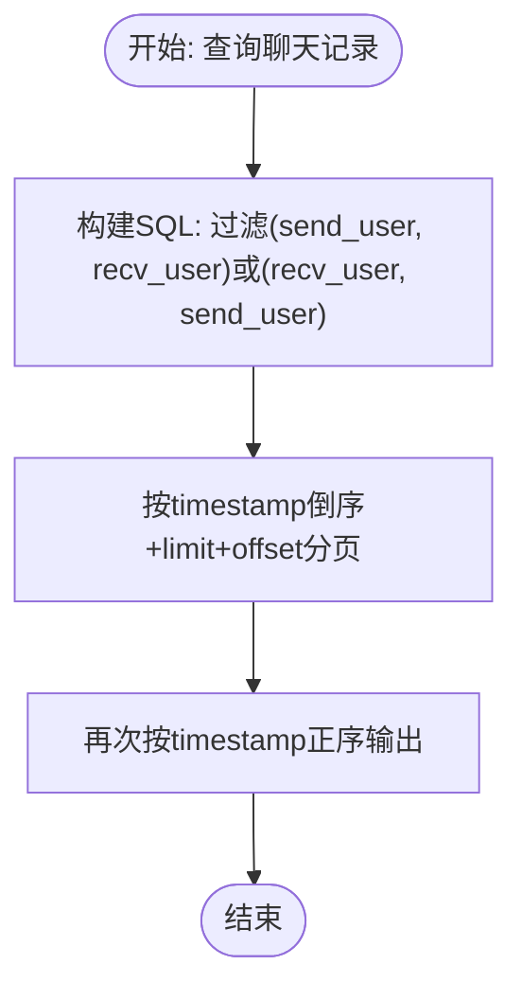
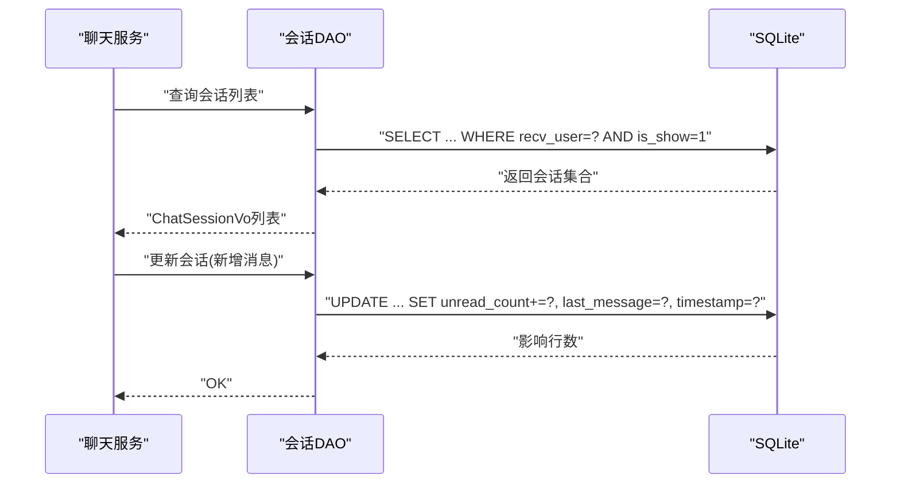
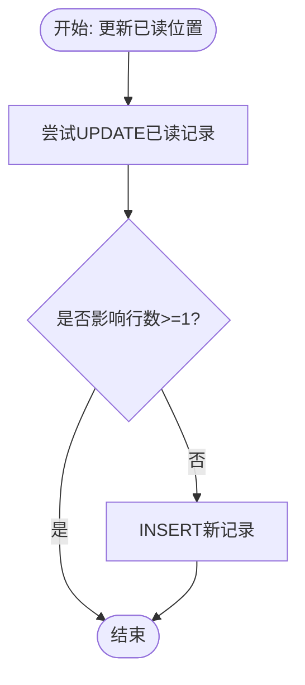
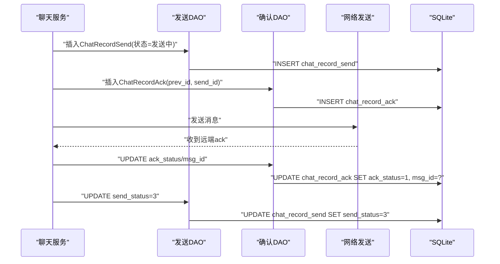
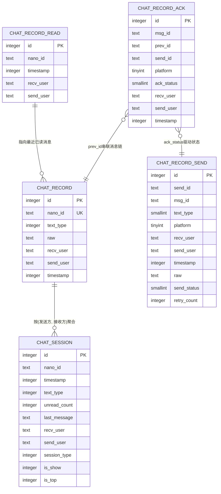
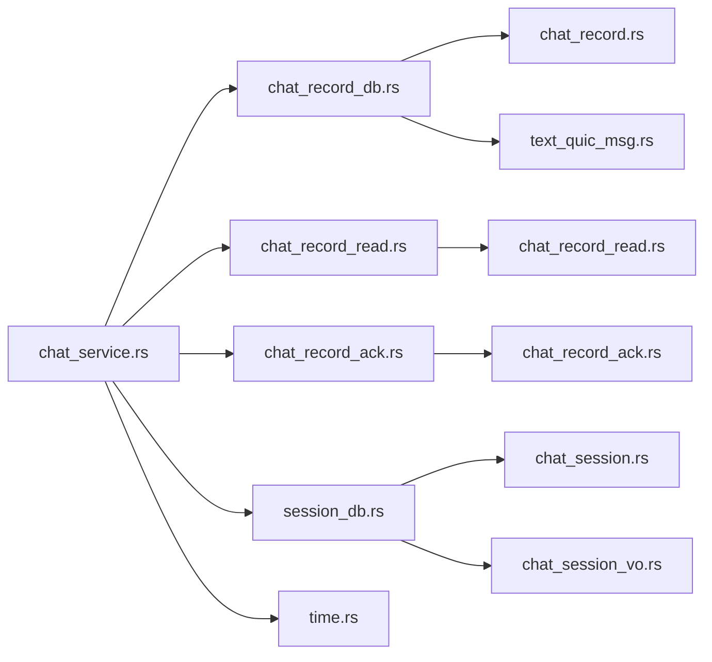

# 聊天数据模型

<cite>
**本文引用的文件**
- [chat_record.rs](file://src-tauri/src/entity/chat_record.rs)
- [chat_session.rs](file://src-tauri/src/entity/chat_session.rs)
- [chat_record_read.rs](file://src-tauri/src/entity/chat_record_read.rs)
- [chat_record_ack.rs](file://src-tauri/src/entity/chat_record_ack.rs)
- [chat_record_send.rs](file://src-tauri/src/entity/chat_record_send.rs)
- [chat_record_db.rs](file://src-tauri/src/dao/chat_record_db.rs)
- [chat_record_read.rs](file://src-tauri/src/dao/chat_record_read.rs)
- [chat_record_ack.rs](file://src-tauri/src/dao/chat_record_ack.rs)
- [session_db.rs](file://src-tauri/src/dao/session_db.rs)
- [create_table.rs](file://src-tauri/src/dao/create_table.rs)
- [store.rs](file://src-tauri/src/dao/store.rs)
- [chat_service.rs](file://src-tauri/src/service/chat_service.rs)
- [text_quic_msg.rs](file://src-tauri/src/vo/text_quic_msg.rs)
- [chat_session_vo.rs](file://src-tauri/src/vo/chat_session_vo.rs)
- [add_read_chat_record.rs](file://src-tauri/src/dto/add_read_chat_record.rs)
- [time.rs](file://src-tauri/src/utils/time.rs)
</cite>

## 目录
1. [简介](#简介)
2. [项目结构](#项目结构)
3. [核心组件](#核心组件)
4. [架构总览](#架构总览)
5. [详细组件分析](#详细组件分析)
6. [依赖分析](#依赖分析)
7. [性能考虑](#性能考虑)
8. [故障排查指南](#故障排查指南)
9. [结论](#结论)
10. [附录](#附录)

## 简介
本文件系统性梳理即时通讯应用的聊天数据模型，围绕以下核心表展开：聊天记录表（ChatRecord）、会话信息表（ChatSession）、消息已读状态表（ChatRecordRead）、消息确认状态表（ChatRecordAck），以及消息发送状态表（ChatRecordSend）。文档从数据结构设计、字段与类型选择、业务规则、关系映射、索引与约束、生命周期管理、状态同步与一致性保障等方面进行深入解析，并提供可视化图表帮助理解。

## 项目结构
聊天数据模型相关代码主要分布在如下层次：
- 实体层（Entity）：定义数据模型与建表逻辑
- 数据访问层（DAO）：封装SQL查询与写入
- 视图对象层（VO/DTO）：跨模块传递的数据载体
- 服务层（Service）：编排业务流程，协调DAO与实体
- 工具层（Utils）：通用工具函数（如时间戳）

**图表来源**
- [chat_record.rs:8-44](file://src-tauri/src/entity/chat_record.rs#L8-L44)
- [chat_session.rs:8-71](file://src-tauri/src/entity/chat_session.rs#L8-L71)
- [chat_record_read.rs:7-40](file://src-tauri/src/entity/chat_record_read.rs#L7-L40)
- [chat_record_ack.rs:7-47](file://src-tauri/src/entity/chat_record_ack.rs#L7-L47)
- [chat_record_send.rs:7-51](file://src-tauri/src/entity/chat_record_send.rs#L7-L51)
- [chat_record_db.rs:7-105](file://src-tauri/src/dao/chat_record_db.rs#L7-L105)
- [chat_record_read.rs:4-24](file://src-tauri/src/dao/chat_record_read.rs#L4-L24)
- [chat_record_ack.rs:4-76](file://src-tauri/src/dao/chat_record_ack.rs#L4-L76)
- [session_db.rs:8-116](file://src-tauri/src/dao/session_db.rs#L8-L116)
- [create_table.rs:14-54](file://src-tauri/src/dao/create_table.rs#L14-L54)
- [store.rs:3-20](file://src-tauri/src/dao/store.rs#L3-L20)
- [chat_service.rs:14-41](file://src-tauri/src/service/chat_service.rs#L14-L41)
- [text_quic_msg.rs:7-46](file://src-tauri/src/vo/text_quic_msg.rs#L7-L46)
- [chat_session_vo.rs:6-45](file://src-tauri/src/vo/chat_session_vo.rs#L6-L45)
- [add_read_chat_record.rs:3-9](file://src-tauri/src/dto/add_read_chat_record.rs#L3-L9)
- [time.rs:6-25](file://src-tauri/src/utils/time.rs#L6-L25)

**章节来源**
- [chat_record.rs:1-61](file://src-tauri/src/entity/chat_record.rs#L1-L61)
- [chat_session.rs:1-72](file://src-tauri/src/entity/chat_session.rs#L1-L72)
- [chat_record_read.rs:1-41](file://src-tauri/src/entity/chat_record_read.rs#L1-L41)
- [chat_record_ack.rs:1-48](file://src-tauri/src/entity/chat_record_ack.rs#L1-L48)
- [chat_record_send.rs:1-52](file://src-tauri/src/entity/chat_record_send.rs#L1-L52)
- [chat_record_db.rs:1-106](file://src-tauri/src/dao/chat_record_db.rs#L1-L106)
- [chat_record_read.rs:1-25](file://src-tauri/src/dao/chat_record_read.rs#L1-L25)
- [chat_record_ack.rs:1-77](file://src-tauri/src/dao/chat_record_ack.rs#L1-L77)
- [session_db.rs:1-117](file://src-tauri/src/dao/session_db.rs#L1-L117)
- [create_table.rs:1-55](file://src-tauri/src/dao/create_table.rs#L1-L55)
- [store.rs:1-21](file://src-tauri/src/dao/store.rs#L1-L21)
- [chat_service.rs:1-582](file://src-tauri/src/service/chat_service.rs#L1-L582)
- [text_quic_msg.rs:1-47](file://src-tauri/src/vo/text_quic_msg.rs#L1-L47)
- [chat_session_vo.rs:1-46](file://src-tauri/src/vo/chat_session_vo.rs#L1-L46)
- [add_read_chat_record.rs:1-10](file://src-tauri/src/dto/add_read_chat_record.rs#L1-L10)
- [time.rs:1-26](file://src-tauri/src/utils/time.rs#L1-L26)

## 核心组件
本节聚焦四大核心数据表及其职责边界与协作方式：
- 聊天记录表（ChatRecord）：持久化消息正文、发送方、接收方、时间戳与消息类型
- 会话信息表（ChatSession）：维护最近消息摘要、未读计数、置顶与显示状态
- 消息已读状态表（ChatRecordRead）：记录用户对特定对话的“已读至”位置
- 消息确认状态表（ChatRecordAck）：记录消息发送确认链路（含prev_id、ack状态）
- 消息发送状态表（ChatRecordSend）：本地发送队列与重试控制

**章节来源**
- [chat_record.rs:8-44](file://src-tauri/src/entity/chat_record.rs#L8-L44)
- [chat_session.rs:8-71](file://src-tauri/src/entity/chat_session.rs#L8-L71)
- [chat_record_read.rs:7-40](file://src-tauri/src/entity/chat_record_read.rs#L7-L40)
- [chat_record_ack.rs:7-47](file://src-tauri/src/entity/chat_record_ack.rs#L7-L47)
- [chat_record_send.rs:7-51](file://src-tauri/src/entity/chat_record_send.rs#L7-L51)

## 架构总览
下图展示聊天数据模型的类关系与交互：

**图表来源**
- [chat_record.rs:8-60](file://src-tauri/src/entity/chat_record.rs#L8-L60)
- [chat_session.rs:8-71](file://src-tauri/src/entity/chat_session.rs#L8-L71)
- [chat_record_read.rs:7-40](file://src-tauri/src/entity/chat_record_read.rs#L7-L40)
- [chat_record_ack.rs:7-47](file://src-tauri/src/entity/chat_record_ack.rs#L7-L47)
- [chat_record_send.rs:7-51](file://src-tauri/src/entity/chat_record_send.rs#L7-L51)
- [store.rs:3-20](file://src-tauri/src/dao/store.rs#L3-L20)

## 详细组件分析

### 聊天记录表（ChatRecord）
- 字段与类型
  - 主键与标识：自增主键与唯一nano_id
  - 文本与类型：原始文本raw与text_type（0: 原生文本；1: JSON文本等）
  - 双向关联：send_user与recv_user
  - 时间戳：timestamp
- 业务规则
  - 记录双方之间的双向聊天历史
  - 支持按消息类型过滤与分页查询
  - 提供按好友统计聊天条数的辅助方法
- 关系与索引
  - 建表时未显式声明索引，但查询使用了多条件过滤与排序，建议在(发送方, 接收方)与timestamp上建立复合索引以提升分页与排序性能
- 典型查询
  - 分页查询双方聊天记录
  - 按消息类型分页查询
  - 统计与好友的聊天总数

**图表来源**
- [chat_record_db.rs:8-23](file://src-tauri/src/dao/chat_record_db.rs#L8-L23)

**章节来源**
- [chat_record.rs:8-44](file://src-tauri/src/entity/chat_record.rs#L8-L44)
- [chat_record_db.rs:8-23](file://src-tauri/src/dao/chat_record_db.rs#L8-L23)
- [chat_record_db.rs:74-84](file://src-tauri/src/dao/chat_record_db.rs#L74-L84)
- [chat_record_db.rs:88-105](file://src-tauri/src/dao/chat_record_db.rs#L88-L105)

### 会话信息表（ChatSession）
- 字段与类型
  - 会话标识：nano_id
  - 最新消息摘要：text_type、last_message、timestamp
  - 未读计数：unread_count
  - 显示与置顶：is_show、is_top
  - 会话类型：session_type（单聊、群聊、系统、公众号）
  - 双向用户：send_user与recv_user
- 业务规则
  - 唯一约束：(send_user, recv_user)确保每对用户仅有一条会话记录
  - 会话创建：基于聊天记录数量初始化未读计数
  - 会话更新：新增消息时累加未读计数并更新最新消息摘要
  - 本地清空：将未读计数归零并同步前端事件
- 关系与索引
  - 建表包含UNIQUE(send_user, recv_user)，建议同时在recv_user与is_show上建立索引以加速会话列表查询

**图表来源**
- [session_db.rs:75-86](file://src-tauri/src/dao/session_db.rs#L75-L86)
- [session_db.rs:17-47](file://src-tauri/src/dao/session_db.rs#L17-L47)

**章节来源**
- [chat_session.rs:8-71](file://src-tauri/src/entity/chat_session.rs#L8-L71)
- [session_db.rs:8-116](file://src-tauri/src/dao/session_db.rs#L8-L116)
- [chat_service.rs:67-72](file://src-tauri/src/service/chat_service.rs#L67-L72)
- [chat_service.rs:103-115](file://src-tauri/src/service/chat_service.rs#L103-L115)

### 消息已读状态表（ChatRecordRead）
- 设计目的
  - 记录用户对特定对话“已读至”的nano_id与时间戳，用于前端展示与后续增量同步
- 结构与约束
  - 唯一约束：(send_user, recv_user)确保每个用户对每个对话仅有一条已读记录
- 写入策略
  - 若存在则更新，否则插入；保证幂等性

**图表来源**
- [chat_record_read.rs:4-24](file://src-tauri/src/dao/chat_record_read.rs#L4-L24)

**章节来源**
- [chat_record_read.rs:7-40](file://src-tauri/src/entity/chat_record_read.rs#L7-L40)
- [chat_record_read.rs:4-24](file://src-tauri/src/dao/chat_record_read.rs#L4-L24)

### 消息确认状态表（ChatRecordAck）与发送状态表（ChatRecordSend）
- ChatRecordAck
  - 记录消息发送确认链路：msg_id（远端确认）、prev_id（前一消息）、ack_status（0: 未确认, 1: 已确认）
  - 与ChatRecordSend配合实现可靠投递与重试
- ChatRecordSend
  - 本地发送队列：send_id（本地生成）、msg_id（远端确认）、send_status（0: 未发送, 1: 发送中, 2: 发送失败, 3: 发送成功）、retry_count
  - 通过prev_id串联消息顺序，确保链路正确性

**图表来源**
- [chat_record_ack.rs:4-76](file://src-tauri/src/dao/chat_record_ack.rs#L4-L76)
- [chat_record_send.rs:7-51](file://src-tauri/src/entity/chat_record_send.rs#L7-L51)
- [chat_record_ack.rs:7-47](file://src-tauri/src/entity/chat_record_ack.rs#L7-L47)
- [chat_service.rs:280-374](file://src-tauri/src/service/chat_service.rs#L280-L374)

**章节来源**
- [chat_record_ack.rs:7-47](file://src-tauri/src/entity/chat_record_ack.rs#L7-L47)
- [chat_record_ack.rs:4-76](file://src-tauri/src/dao/chat_record_ack.rs#L4-L76)
- [chat_record_send.rs:7-51](file://src-tauri/src/entity/chat_record_send.rs#L7-L51)
- [chat_service.rs:280-374](file://src-tauri/src/service/chat_service.rs#L280-L374)
- [chat_service.rs:398-491](file://src-tauri/src/service/chat_service.rs#L398-L491)

### 数据模型图与ER关系图
- 数据模型图（字段与类型）
  - ChatRecord：id, nano_id, text_type, raw, recv_user, send_user, timestamp
  - ChatSession：id, nano_id, timestamp, text_type, unread_count, last_message, recv_user, send_user, session_type, is_show, is_top
  - ChatRecordRead：id, nano_id, timestamp, recv_user, send_user
  - ChatRecordAck：id, msg_id, prev_id, send_id, platform, ack_status, recv_user, send_user, timestamp
  - ChatRecordSend：id, send_id, msg_id, text_type, platform, recv_user, send_user, timestamp, raw, send_status, retry_count

- ER关系图
  - ChatRecord与ChatSession：通过(发送方, 接收方)关联，会话作为聊天历史的聚合视图
  - ChatRecordRead：(send_user, recv_user)唯一，指向最近已读消息
  - ChatRecordAck/ChatRecordSend：通过send_id/prev_id形成消息链路，ack_status驱动状态机

**图表来源**
- [chat_record.rs:8-17](file://src-tauri/src/entity/chat_record.rs#L8-L17)
- [chat_session.rs:8-21](file://src-tauri/src/entity/chat_session.rs#L8-L21)
- [chat_record_read.rs:7-14](file://src-tauri/src/entity/chat_record_read.rs#L7-L14)
- [chat_record_ack.rs:7-18](file://src-tauri/src/entity/chat_record_ack.rs#L7-L18)
- [chat_record_send.rs:7-20](file://src-tauri/src/entity/chat_record_send.rs#L7-L20)

## 依赖分析
- 组件耦合
  - 服务层（chat_service.rs）依赖多个DAO，DAO依赖实体与工具层
  - 实体实现SqliteStore接口，统一建表/更新/删除流程
- 外部依赖
  - SQLx用于异步数据库操作
  - 日志库用于运行期调试与错误追踪

**图表来源**
- [chat_service.rs:14-41](file://src-tauri/src/service/chat_service.rs#L14-L41)
- [chat_record_db.rs:1-106](file://src-tauri/src/dao/chat_record_db.rs#L1-L106)
- [chat_record_read.rs:1-25](file://src-tauri/src/dao/chat_record_read.rs#L1-L25)
- [chat_record_ack.rs:1-77](file://src-tauri/src/dao/chat_record_ack.rs#L1-L77)
- [session_db.rs:1-117](file://src-tauri/src/dao/session_db.rs#L1-L117)
- [chat_record.rs:1-61](file://src-tauri/src/entity/chat_record.rs#L1-L61)
- [chat_session.rs:1-72](file://src-tauri/src/entity/chat_session.rs#L1-L72)
- [chat_record_read.rs:1-41](file://src-tauri/src/entity/chat_record_read.rs#L1-L41)
- [chat_record_ack.rs:1-48](file://src-tauri/src/entity/chat_record_ack.rs#L1-L48)
- [text_quic_msg.rs:1-47](file://src-tauri/src/vo/text_quic_msg.rs#L1-L47)
- [chat_session_vo.rs:1-46](file://src-tauri/src/vo/chat_session_vo.rs#L1-L46)
- [time.rs:1-26](file://src-tauri/src/utils/time.rs#L1-L26)

**章节来源**
- [chat_service.rs:1-582](file://src-tauri/src/service/chat_service.rs#L1-L582)
- [store.rs:1-21](file://src-tauri/src/dao/store.rs#L1-L21)
- [create_table.rs:1-55](file://src-tauri/src/dao/create_table.rs#L1-L55)

## 性能考虑
- 索引优化建议
  - ChatRecord：在(send_user, recv_user, timestamp)上建立复合索引，以优化分页与排序
  - ChatRecord：在nano_id上建立索引，提升按ID查询性能
  - ChatSession：在(recv_user, is_show)上建立索引，加速会话列表查询
  - ChatRecordRead：在(send_user, recv_user)上保持唯一索引即可
- 查询模式
  - 分页查询采用两层子查询先降序再升序，避免大偏移导致的性能问题
- 写入策略
  - 已读更新采用“先更新后插入”，保证幂等性；建议在高并发场景下引入事务包裹
- 重试与超时
  - 发送状态表retry_count与超时阈值（如8秒）共同控制重试节奏，避免无限重试

[本节为通用性能指导，无需具体文件引用]

## 故障排查指南
- 会话未显示或未更新
  - 检查ChatSession的is_show与recv_user过滤条件
  - 确认会话更新逻辑是否正确累加未读计数并更新last_message
- 已读不同步
  - 核对ChatRecordRead的唯一键与更新/插入逻辑
  - 确保服务层在清理会话时触发前端事件
- 消息未确认
  - 检查ChatRecordAck的ack_status与msg_id更新路径
  - 核对ChatRecordSend的send_status与retry_count变化
- 数据库初始化
  - 确认create_table.rs中的建表顺序与init_sqlite流程
  - 检查SqliteStore接口的create/update/drop三阶段执行

**章节来源**
- [session_db.rs:75-116](file://src-tauri/src/dao/session_db.rs#L75-L116)
- [chat_record_read.rs:4-24](file://src-tauri/src/dao/chat_record_read.rs#L4-L24)
- [chat_record_ack.rs:48-76](file://src-tauri/src/dao/chat_record_ack.rs#L48-L76)
- [create_table.rs:26-54](file://src-tauri/src/dao/create_table.rs#L26-L54)
- [store.rs:12-20](file://src-tauri/src/dao/store.rs#L12-L20)

## 结论
该聊天数据模型以简洁的五张表覆盖了消息存储、会话聚合、已读与确认链路、发送队列与重试等关键能力。通过明确的唯一约束与建模边界，实现了消息生命周期的清晰管理与状态同步。建议在生产环境中补充索引与事务控制，进一步提升查询与写入性能与一致性。

## 附录
- 关键流程路径
  - 分页查询聊天记录：[chat_record_db.rs:8-23](file://src-tauri/src/dao/chat_record_db.rs#L8-L23)
  - 会话列表与更新：[session_db.rs:75-116](file://src-tauri/src/dao/session_db.rs#L75-L116)
  - 已读更新：[chat_record_read.rs:4-24](file://src-tauri/src/dao/chat_record_read.rs#L4-L24)
  - 确认与发送状态：[chat_record_ack.rs:4-76](file://src-tauri/src/dao/chat_record_ack.rs#L4-L76)、[chat_record_send.rs:7-51](file://src-tauri/src/entity/chat_record_send.rs#L7-L51)
  - 服务编排：[chat_service.rs:117-374](file://src-tauri/src/service/chat_service.rs#L117-L374)