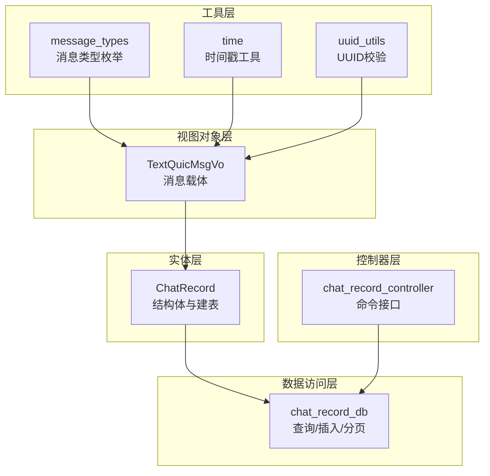
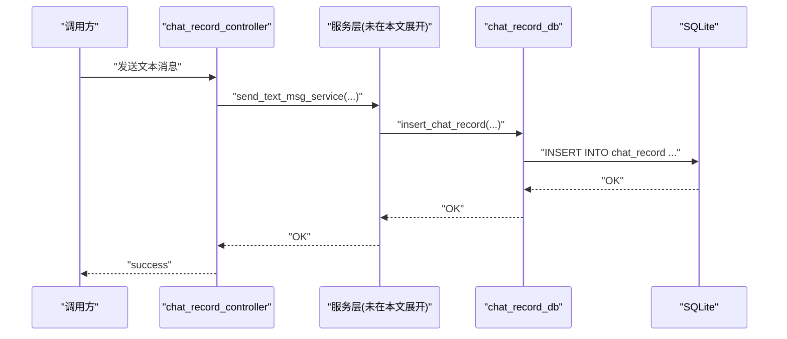
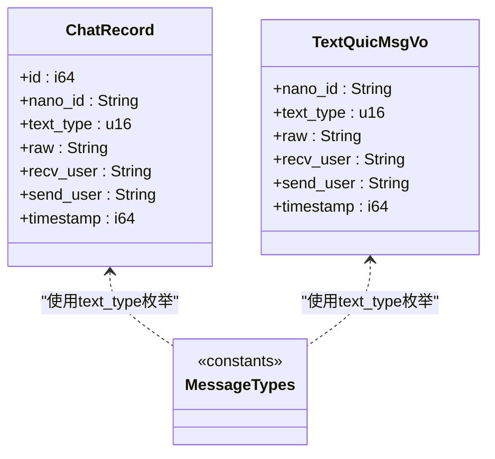
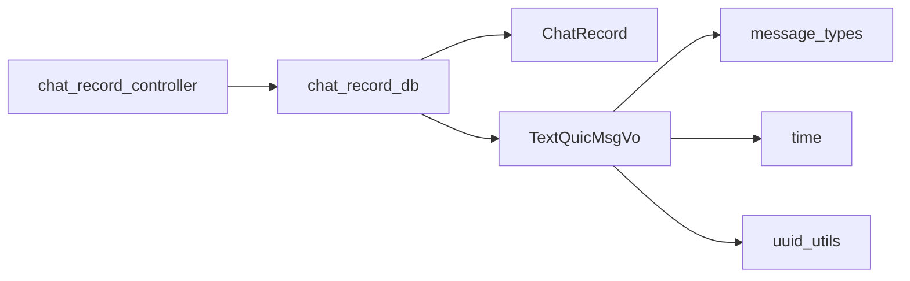

# 聊天记录实体

<cite>
**本文引用的文件**
- [chat_record.rs](file://src-tauri/src/entity/chat_record.rs)
- [message_types.rs](file://src-tauri/src/utils/message_types.rs)
- [chat_record_db.rs](file://src-tauri/src/dao/chat_record_db.rs)
- [create_table.rs](file://src-tauri/src/dao/create_table.rs)
- [time.rs](file://src-tauri/src/utils/time.rs)
- [chat_record_controller.rs](file://src-tauri/src/cmd/chat_record_controller.rs)
- [text_quic_msg.rs](file://src-tauri/src/vo/text_quic_msg.rs)
- [uuid_utils.rs](file://src-tauri/src/utils/uuid_utils.rs)
</cite>

## 目录

1. [简介](#简介)
2. [项目结构](#项目结构)
3. [核心组件](#核心组件)
4. [架构总览](#架构总览)
5. [详细组件分析](#详细组件分析)
6. [依赖关系分析](#依赖关系分析)
7. [性能考量](#性能考量)
8. [故障排查指南](#故障排查指南)
9. [结论](#结论)
10. [附录](#附录)

## 简介

本文件围绕聊天记录实体 ChatRecord 的设计与实现进行系统性说明，重点覆盖：

- ChatRecord 结构体的设计理念与字段语义
- nano_id 唯一标识符的作用与生成机制
- text_type 消息类型的分类体系与枚举值
- raw 字段的数据存储格式与序列化策略
- recv_user 与 send_user 用户标识方式
- timestamp 时间戳的精度与时区处理
- SQL 表结构定义、字段约束与索引设计
- 查询统计方法的使用示例与性能优化建议

## 项目结构

与聊天记录实体直接相关的模块分布如下：

- 实体层：ChatRecord 定义与建表逻辑
- 数据访问层：聊天记录的增删查改与分页查询
- 控制器层：对外暴露的命令接口
- 工具层：消息类型常量、时间戳生成、UUID 辅助
- 视图对象层：TextQuicMsgVo 作为消息传输载体

**图表来源**

- [chat_record.rs:8-44](file://src-tauri/src/entity/chat_record.rs#L8-L44)
- [chat_record_db.rs:1-106](file://src-tauri/src/dao/chat_record_db.rs#L1-L106)
- [chat_record_controller.rs:1-80](file://src-tauri/src/cmd/chat_record_controller.rs#L1-L80)
- [message_types.rs:1-108](file://src-tauri/src/utils/message_types.rs#L1-L108)
- [time.rs:1-26](file://src-tauri/src/utils/time.rs#L1-L26)
- [text_quic_msg.rs:1-47](file://src-tauri/src/vo/text_quic_msg.rs#L1-L47)
- [uuid_utils.rs:1-6](file://src-tauri/src/utils/uuid_utils.rs#L1-L6)

**章节来源**

- [chat_record.rs:1-61](file://src-tauri/src/entity/chat_record.rs#L1-L61)
- [chat_record_db.rs:1-106](file://src-tauri/src/dao/chat_record_db.rs#L1-L106)
- [chat_record_controller.rs:1-80](file://src-tauri/src/cmd/chat_record_controller.rs#L1-L80)
- [message_types.rs:1-108](file://src-tauri/src/utils/message_types.rs#L1-L108)
- [time.rs:1-26](file://src-tauri/src/utils/time.rs#L1-L26)
- [text_quic_msg.rs:1-47](file://src-tauri/src/vo/text_quic_msg.rs#L1-L47)
- [uuid_utils.rs:1-6](file://src-tauri/src/utils/uuid_utils.rs#L1-L6)

## 核心组件

- ChatRecord：聊天记录的核心实体，承载消息的元数据与内容
- TextQuicMsgVo：消息传输载体，与 ChatRecord 字段一一对应
- DAO 层：封装对 chat_record 表的查询与写入
- 控制器层：对外暴露命令接口，如发送消息、按类型查询等
- 工具层：消息类型常量、时间戳生成、UUID 校验

**章节来源**

- [chat_record.rs:8-17](file://src-tauri/src/entity/chat_record.rs#L8-L17)
- [text_quic_msg.rs:7-15](file://src-tauri/src/vo/text_quic_msg.rs#L7-L15)
- [chat_record_db.rs:1-106](file://src-tauri/src/dao/chat_record_db.rs#L1-L106)
- [chat_record_controller.rs:1-80](file://src-tauri/src/cmd/chat_record_controller.rs#L1-L80)
- [message_types.rs:1-108](file://src-tauri/src/utils/message_types.rs#L1-L108)
- [time.rs:1-26](file://src-tauri/src/utils/time.rs#L1-L26)
- [uuid_utils.rs:1-6](file://src-tauri/src/utils/uuid_utils.rs#L1-L6)

## 架构总览

下图展示了从控制器到实体、DAO 与数据库的整体交互流程。

**图表来源**

- [chat_record_controller.rs:16-37](file://src-tauri/src/cmd/chat_record_controller.rs#L16-L37)
- [chat_record_db.rs:42-55](file://src-tauri/src/dao/chat_record_db.rs#L42-L55)

**章节来源**

- [chat_record_controller.rs:1-80](file://src-tauri/src/cmd/chat_record_controller.rs#L1-L80)
- [chat_record_db.rs:1-106](file://src-tauri/src/dao/chat_record_db.rs#L1-L106)

## 详细组件分析

### ChatRecord 结构体与字段语义

- id：自增主键，用于内部排序与范围查询
- nano_id：消息唯一标识符，采用字符串形式，数据库中设置唯一约束
- text_type：消息类型，u16 类型，取值由消息类型常量定义
- raw：消息原始内容，以字符串形式存储，通常为 JSON 或纯文本
- recv_user：接收用户标识，字符串形式
- send_user：发送用户标识，字符串形式
- timestamp：消息时间戳，i64 类型，单位为毫秒

字段约束与索引设计（基于建表语句）：

- 主键：id（自增）
- 唯一约束：nano_id
- 非空约束：raw、timestamp、send_user、recv_user、text_type
- 默认值：text_type 默认为 0

注意：当前建表未显式创建索引。建议根据高频查询维度添加索引以提升性能。

**章节来源**

- [chat_record.rs:8-17](file://src-tauri/src/entity/chat_record.rs#L8-L17)
- [chat_record.rs:19-44](file://src-tauri/src/entity/chat_record.rs#L19-L44)

### nano_id 唯一标识符的作用与生成机制

- 作用：作为消息的外部可见唯一标识，便于跨模块引用与幂等处理
- 存储：字符串类型，数据库中设置唯一约束，避免重复
- 生成机制：仓库中未发现专门的 nano_id 生成器代码；建议在业务层统一生成并校验唯一性，可结合 UUID 工具函数进行格式校验

**章节来源**

- [chat_record.rs:11-11](file://src-tauri/src/entity/chat_record.rs#L11-L11)
- [uuid_utils.rs:1-6](file://src-tauri/src/utils/uuid_utils.rs#L1-L6)

### text_type 消息类型分类体系与枚举值

消息类型按范围划分：

- 基础消息类型（1-99）：普通文本、图片、文件等
- P2P 相关消息类型（100-199）：P2P 连接、视频通话、音视频数据等
- 系统控制消息类型（200-299）：心跳、回执、服务端/客户端标识等
- 通知与系统消息（≥1000）

关键枚举值（部分列举）：

- 文本消息：1
- 图片消息：2
- 文件消息：3
- JSON 消息：88
- P2P 文本消息：8
- P2P 视频通话邀请/接受/拒绝/结束：12-15
- 心跳消息：99
- WebRTC 信令：100
- 消息回执（成功/失败）：201-202
- 系统消息：10001

建议：在业务层统一维护 text_type 的映射与校验，避免魔法数字。

**章节来源**

- [message_types.rs:1-108](file://src-tauri/src/utils/message_types.rs#L1-L108)

### raw 字段的数据存储格式与序列化策略

- 存储格式：字符串（TEXT），适用于 JSON、纯文本等
- 序列化策略：TextQuicMsgVo 提供 FromRow 反序列化支持；在 VO 层将字节序列转换为 UTF-8 字符串
- 建议：对于复杂结构，优先使用 JSON；确保编码一致性（UTF-8）

**章节来源**

- [chat_record.rs:13-13](file://src-tauri/src/entity/chat_record.rs#L13-L13)
- [text_quic_msg.rs:18-28](file://src-tauri/src/vo/text_quic_msg.rs#L18-L28)

### recv_user 与 send_user 用户标识方式

- 形式：字符串，建议使用 UUID 格式
- 校验：可通过 UUID 工具函数进行格式校验
- 业务约定：双方用户通过 send_user 与 recv_user 明确消息方向

**章节来源**

- [chat_record.rs:14-15](file://src-tauri/src/entity/chat_record.rs#L14-L15)
- [uuid_utils.rs:1-6](file://src-tauri/src/utils/uuid_utils.rs#L1-L6)

### timestamp 时间戳的精度与时区处理

- 精度：毫秒级（i64）
- 生成：通过时间工具函数获取当前时间戳（毫秒）
- 时区：建议统一使用 UTC，前端渲染时再按本地时区转换显示

**章节来源**

- [chat_record.rs:16-16](file://src-tauri/src/entity/chat_record.rs#L16-L16)
- [time.rs:6-25](file://src-tauri/src/utils/time.rs#L6-L25)

### SQL 表结构定义、字段约束与索引设计

建表语句要点：

- 字段与类型：id（INTEGER）、nano_id（TEXT，UNIQUE）、raw（TEXT，NOT NULL）、timestamp（INTEGER，NOT NULL）、send_user（TEXT，NOT NULL）、recv_user（TEXT，NOT NULL）、text_type（INTEGER，NOT NULL，默认 0）
- 约束：主键、唯一、非空、默认值
- 索引：当前未创建索引

建议索引（按查询频率）：

- (send_user, recv_user, timestamp)：用于对话历史分页与最近消息查询
- (timestamp)：用于按时间范围检索
- (text_type)：用于按消息类型分页

**章节来源**

- [chat_record.rs:20-35](file://src-tauri/src/entity/chat_record.rs#L20-L35)

### 查询统计方法与使用示例

- 统计某用户与其好友之间的聊天条数：query_chat_record_count_by_friend
- 分页查询：query_chat_record_from_db（按时间倒序分页）
- 按消息类型分页：query_chat_record_by_type_from_db
- 最新消息：query_last_chat_record
- 按 ID 查询：query_chat_record_by_id_from_db

使用示例（步骤说明）：

- 统计条数：传入当前用户 UUID 与好友 UUID，返回整数计数
- 分页查询：传入双方 UUID、limit、offset，返回消息列表（按时间升序）
- 按类型查询：传入双方 UUID、text_type、limit、offset，返回指定类型的消息列表
- 最新消息：传入双方 UUID，返回 Option，表示是否存在最新消息
- 按 ID 查询：传入 nano_id 与当前用户 UUID，返回单条消息

性能优化建议：

- 为 (send_user, recv_user, timestamp) 添加复合索引
- 限制分页深度与单页大小，避免大偏移
- 使用覆盖索引减少回表（如仅需 raw、timestamp 等字段）

**章节来源**

- [chat_record.rs:46-59](file://src-tauri/src/entity/chat_record.rs#L46-L59)
- [chat_record_db.rs:7-23](file://src-tauri/src/dao/chat_record_db.rs#L7-L23)
- [chat_record_db.rs:87-105](file://src-tauri/src/dao/chat_record_db.rs#L87-L105)
- [chat_record_db.rs:73-85](file://src-tauri/src/dao/chat_record_db.rs#L73-L85)
- [chat_record_db.rs:25-40](file://src-tauri/src/dao/chat_record_db.rs#L25-L40)

### 数据模型类图

**图表来源**

- [chat_record.rs:8-17](file://src-tauri/src/entity/chat_record.rs#L8-L17)
- [text_quic_msg.rs:7-15](file://src-tauri/src/vo/text_quic_msg.rs#L7-L15)
- [message_types.rs:1-108](file://src-tauri/src/utils/message_types.rs#L1-L108)

## 依赖关系分析

- ChatRecord 依赖 DAO 层进行建表与 CRUD
- DAO 层依赖 SQLite 连接池与 SQLX
- 控制器层依赖服务层与 DAO 层
- 工具层提供消息类型常量、时间戳与 UUID 校验

**图表来源**

- [chat_record_controller.rs:1-80](file://src-tauri/src/cmd/chat_record_controller.rs#L1-L80)
- [chat_record_db.rs:1-106](file://src-tauri/src/dao/chat_record_db.rs#L1-L106)
- [chat_record.rs:1-61](file://src-tauri/src/entity/chat_record.rs#L1-L61)
- [text_quic_msg.rs:1-47](file://src-tauri/src/vo/text_quic_msg.rs#L1-L47)
- [message_types.rs:1-108](file://src-tauri/src/utils/message_types.rs#L1-L108)
- [time.rs:1-26](file://src-tauri/src/utils/time.rs#L1-L26)
- [uuid_utils.rs:1-6](file://src-tauri/src/utils/uuid_utils.rs#L1-L6)

**章节来源**

- [chat_record_controller.rs:1-80](file://src-tauri/src/cmd/chat_record_controller.rs#L1-L80)
- [chat_record_db.rs:1-106](file://src-tauri/src/dao/chat_record_db.rs#L1-L106)
- [chat_record.rs:1-61](file://src-tauri/src/entity/chat_record.rs#L1-L61)
- [text_quic_msg.rs:1-47](file://src-tauri/src/vo/text_quic_msg.rs#L1-L47)
- [message_types.rs:1-108](file://src-tauri/src/utils/message_types.rs#L1-L108)
- [time.rs:1-26](file://src-tauri/src/utils/time.rs#L1-L26)
- [uuid_utils.rs:1-6](file://src-tauri/src/utils/uuid_utils.rs#L1-L6)

## 性能考量

- 索引优化：为 (send_user, recv_user, timestamp)、timestamp、text_type 建立索引
- 分页策略：限制每页数量，避免超大 offset；必要时使用“游标式”分页
- 写入并发：通过全局锁保证消息写入顺序，但需控制锁持有时间
- 编码一致性：raw 字段统一 UTF-8，避免解码异常
- 数据压缩：对大体量 JSON 可考虑压缩存储与懒加载

[本节为通用性能建议，不直接分析具体文件]

## 故障排查指南

- nano_id 冲突：检查唯一约束冲突，确保生成器幂等且唯一
- UUID 格式错误：使用 UUID 工具函数进行格式校验
- 时间戳异常：确认时间工具函数返回毫秒，避免时区混用
- 查询结果为空：核对双方用户标识是否正确，确认索引是否生效
- 锁超时：检查消息发送锁竞争情况，必要时调整超时阈值

**章节来源**

- [chat_record.rs:24-24](file://src-tauri/src/entity/chat_record.rs#L24-L24)
- [uuid_utils.rs:1-6](file://src-tauri/src/utils/uuid_utils.rs#L1-L6)
- [time.rs:6-25](file://src-tauri/src/utils/time.rs#L6-L25)
- [chat_record_controller.rs:19-36](file://src-tauri/src/cmd/chat_record_controller.rs#L19-L36)

## 结论

ChatRecord 作为聊天记录的核心实体，通过清晰的字段语义与完善的建表约束，支撑了消息的存储、查询与统计。配合消息类型常量、时间戳工具与 UUID 校验，能够满足多场景的消息管理需求。建议后续完善索引设计与分页策略，进一步提升查询性能与用户体验。

[本节为总结性内容，不直接分析具体文件]

## 附录

### SQL 建表语句与建议索引

- 建表语句：见 ChatRecord 的建表实现
- 建议索引：
  - idx_conversation_time：(send_user, recv_user, timestamp)
  - idx_timestamp：(timestamp)
  - idx_text_type：(text_type)

**章节来源**

- [chat_record.rs:20-35](file://src-tauri/src/entity/chat_record.rs#L20-L35)

### 消息类型枚举值一览（节选）

- 文本：1
- 图片：2
- 文件：3
- JSON：88
- P2P 文本：8
- P2P 视频通话邀请/接受/拒绝/结束：12-15
- 心跳：99
- WebRTC 信令：100
- 回执：201-202
- 系统消息：10001

**章节来源**

- [message_types.rs:1-108](file://src-tauri/src/utils/message_types.rs#L1-L108)
