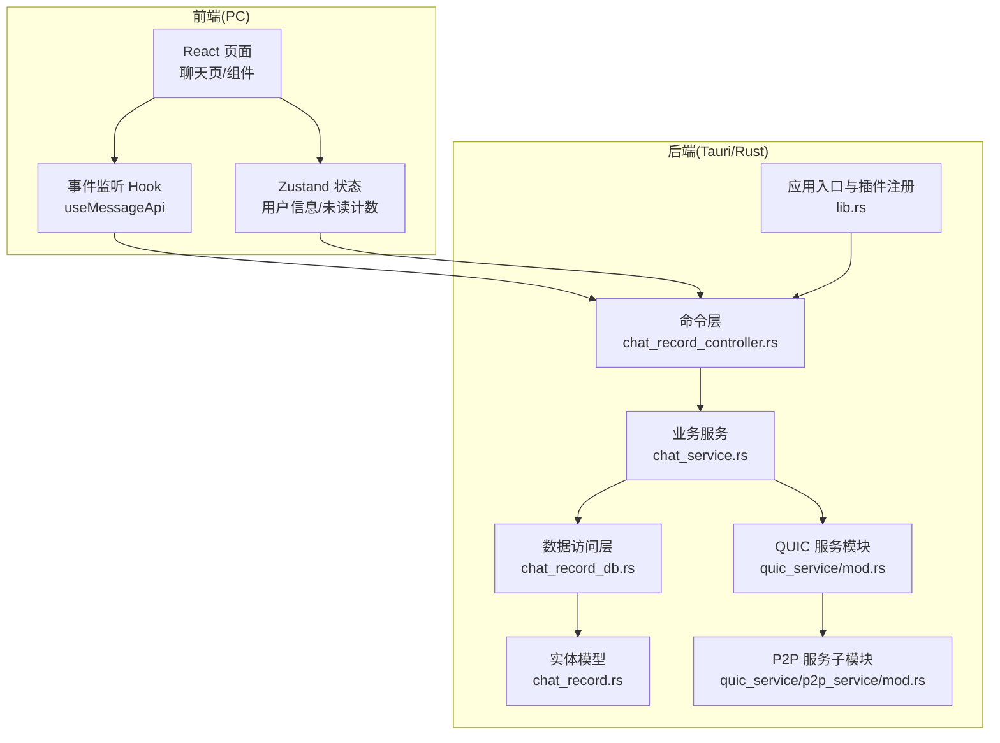
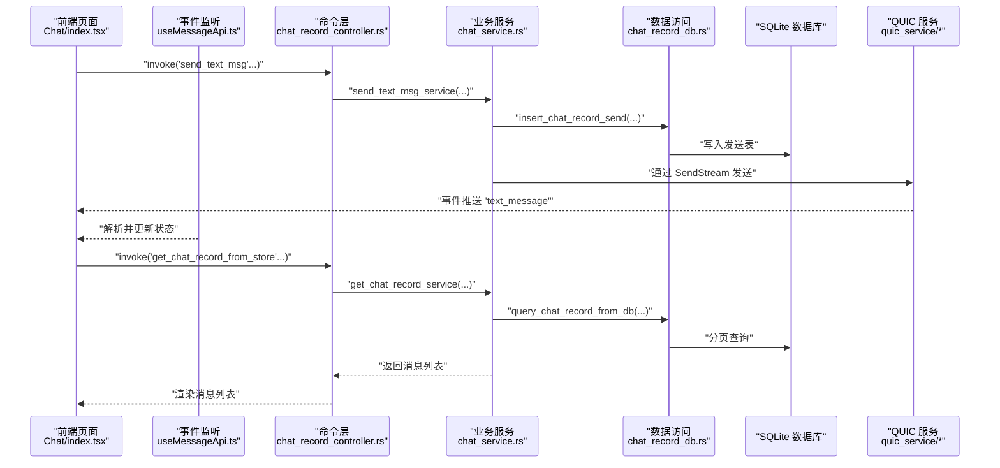
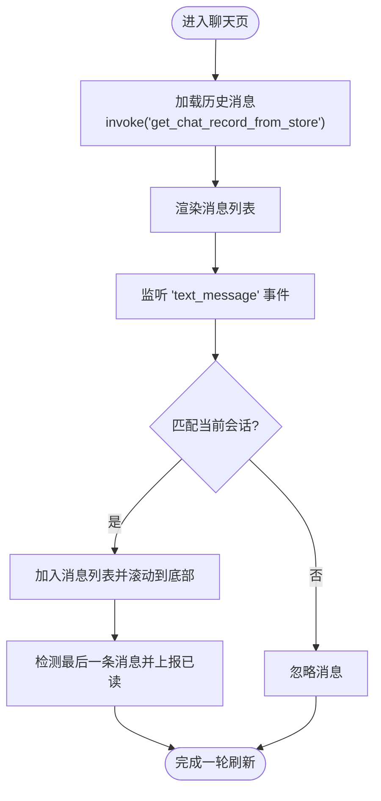
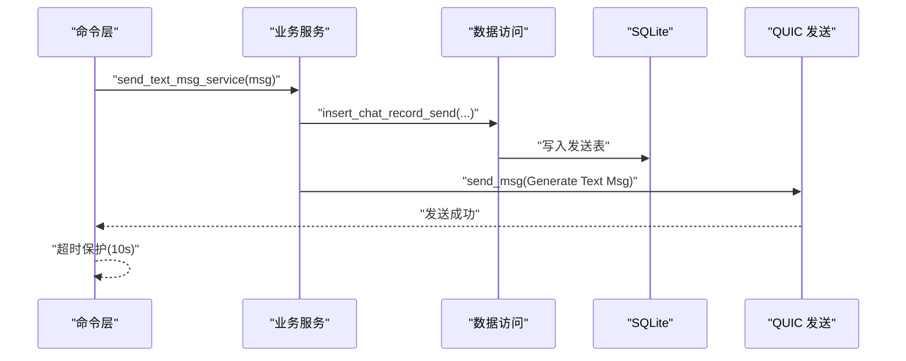
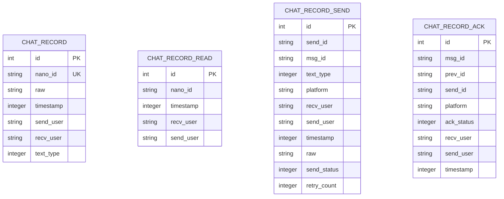
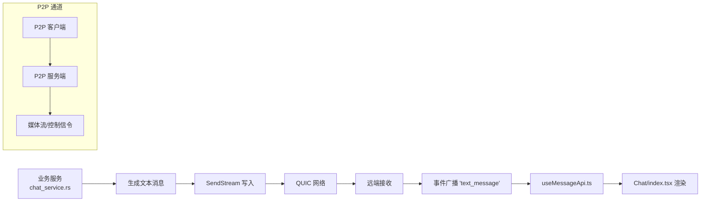
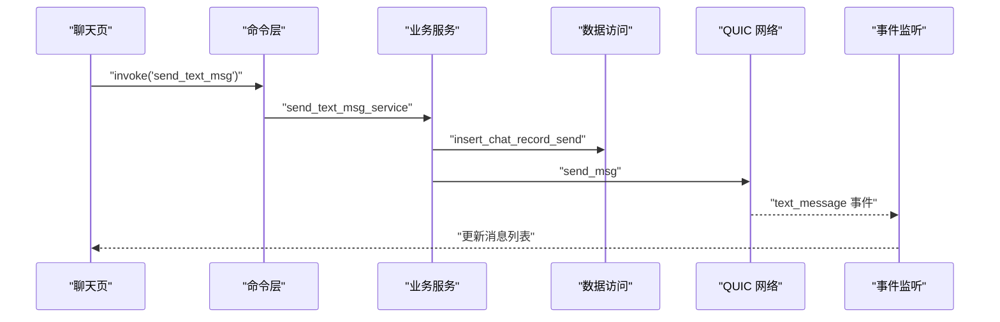
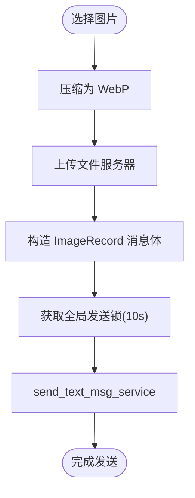
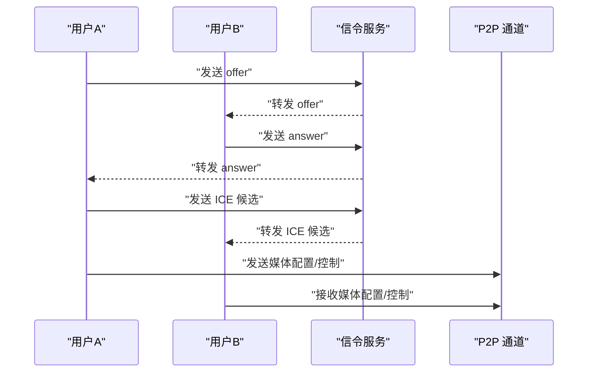
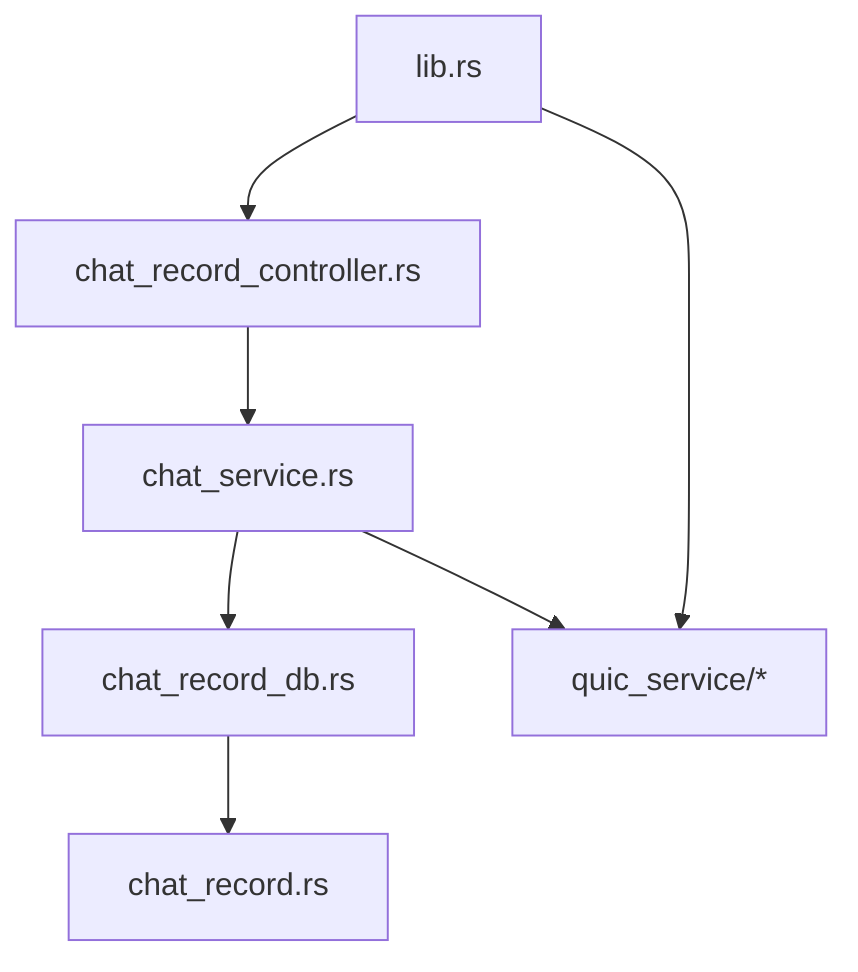

# 数据流设计

<cite>
**本文引用的文件**
- [src-tauri/src/main.rs](file://src-tauri/src/main.rs)
- [src-tauri/src/lib.rs](file://src-tauri/src/lib.rs)
- [src-tauri/src/service/chat_service.rs](file://src-tauri/src/service/chat_service.rs)
- [src-tauri/src/cmd/chat_record_controller.rs](file://src-tauri/src/cmd/chat_record_controller.rs)
- [src-tauri/src/dao/chat_record_db.rs](file://src-tauri/src/dao/chat_record_db.rs)
- [src-tauri/src/entity/chat_record.rs](file://src-tauri/src/entity/chat_record.rs)
- [src-tauri/src/quic_service/mod.rs](file://src-tauri/src/quic_service/mod.rs)
- [src-tauri/src/quic_service/p2p_service/mod.rs](file://src-tauri/src/quic_service/p2p_service/mod.rs)
- [apps/pc/src/store/store.ts](file://apps/pc/src/store/store.ts)
- [apps/pc/src/hooks/useMessageApi.ts](file://apps/pc/src/hooks/useMessageApi.ts)
- [apps/pc/src/pages/Home/Chats/Chat/index.tsx](file://apps/pc/src/pages/Home/Chats/Chat/index.tsx)
</cite>

## 目录

1. [引言](#引言)
2. [项目结构](#项目结构)
3. [核心组件](#核心组件)
4. [架构总览](#架构总览)
5. [详细组件分析](#详细组件分析)
6. [依赖关系分析](#依赖关系分析)
7. [性能考量](#性能考量)
8. [故障排查指南](#故障排查指南)
9. [结论](#结论)
10. [附录](#附录)

## 引言

本文件面向 Rust Tauri Umi 即时通讯应用，系统性阐述数据流设计与实现机制。重点覆盖从用户界面到后端服务再到数据库的完整数据路径，包括消息发送、接收、存储与同步；解释前端状态管理、事件驱动架构与异步数据处理；并结合 QUIC 协议与 WebRTC 数据通道，给出典型业务场景（聊天消息、文件传输、音视频通话）的数据流示例。

## 项目结构

该工程采用“前端（Umi + React）+ 后端（Tauri + Rust）”双端架构：

- 前端负责 UI、状态管理与事件监听，通过 Tauri invoke 调用后端命令。
- 后端负责业务逻辑、数据库访问、网络通信（QUIC/WebRTC）、全局状态与插件集成。
- 数据库采用 SQLite，通过 sqlx 访问私有与公共数据库池。

图表来源

- [src-tauri/src/lib.rs:91-166](file://src-tauri/src/lib.rs#L91-L166)
- [src-tauri/src/cmd/chat_record_controller.rs:16-79](file://src-tauri/src/cmd/chat_record_controller.rs#L16-L79)
- [src-tauri/src/service/chat_service.rs:67-101](file://src-tauri/src/service/chat_service.rs#L67-L101)
- [src-tauri/src/dao/chat_record_db.rs:7-23](file://src-tauri/src/dao/chat_record_db.rs#L7-L23)
- [src-tauri/src/entity/chat_record.rs:8-17](file://src-tauri/src/entity/chat_record.rs#L8-L17)
- [src-tauri/src/quic_service/mod.rs:1-7](file://src-tauri/src/quic_service/mod.rs#L1-L7)
- [src-tauri/src/quic_service/p2p_service/mod.rs:1-4](file://src-tauri/src/quic_service/p2p_service/mod.rs#L1-L4)

章节来源

- [src-tauri/src/main.rs:4-7](file://src-tauri/src/main.rs#L4-L7)
- [src-tauri/src/lib.rs:91-166](file://src-tauri/src/lib.rs#L91-L166)

## 核心组件

- 应用入口与插件注册：初始化托盘、全局句柄、SQLite 连接池、全局 QUIC 连接与配置、事件发射器。
- 命令层：将前端 invoke 映射到具体业务函数，统一错误处理与超时控制。
- 业务服务：封装消息发送、接收、存储、已读标记、会话管理等核心逻辑。
- 数据访问层：基于 sqlx 的 SQLite 访问，提供分页查询、插入、统计等。
- 实体模型：定义消息、会话、文件等数据结构及建表逻辑。
- QUIC 服务：提供文本消息、媒体消息、P2P 流等传输能力。
- 前端状态与事件：Zustand 管理用户与未读计数；事件监听 Hook 接收后端推送。

章节来源

- [src-tauri/src/lib.rs:57-75](file://src-tauri/src/lib.rs#L57-L75)
- [src-tauri/src/cmd/chat_record_controller.rs:16-79](file://src-tauri/src/cmd/chat_record_controller.rs#L16-L79)
- [src-tauri/src/service/chat_service.rs:67-101](file://src-tauri/src/service/chat_service.rs#L67-L101)
- [src-tauri/src/dao/chat_record_db.rs:7-23](file://src-tauri/src/dao/chat_record_db.rs#L7-L23)
- [src-tauri/src/entity/chat_record.rs:8-17](file://src-tauri/src/entity/chat_record.rs#L8-L17)
- [apps/pc/src/store/store.ts:9-32](file://apps/pc/src/store/store.ts#L9-L32)

## 架构总览

下图展示从 UI 到后端再到数据库的总体数据流，以及后端内部的模块交互。

图表来源

- [apps/pc/src/pages/Home/Chats/Chat/index.tsx:141-230](file://apps/pc/src/pages/Home/Chats/Chat/index.tsx#L141-L230)
- [apps/pc/src/hooks/useMessageApi.ts:10-39](file://apps/pc/src/hooks/useMessageApi.ts#L10-L39)
- [src-tauri/src/cmd/chat_record_controller.rs:16-79](file://src-tauri/src/cmd/chat_record_controller.rs#L16-L79)
- [src-tauri/src/service/chat_service.rs:280-374](file://src-tauri/src/service/chat_service.rs#L280-L374)
- [src-tauri/src/dao/chat_record_db.rs:7-23](file://src-tauri/src/dao/chat_record_db.rs#L7-L23)

## 详细组件分析

### 前端状态管理与事件驱动

- Zustand 状态：集中管理用户信息、未读计数、视频配置、登录态等，提供原子更新方法。
- 事件监听 Hook：订阅后端推送的 text_message 事件，按会话过滤并更新 UI。
- 聊天页：分页加载历史消息、滚动加载、已读上报、新消息高亮与自动滚动。

图表来源

- [apps/pc/src/store/store.ts:9-32](file://apps/pc/src/store/store.ts#L9-L32)
- [apps/pc/src/hooks/useMessageApi.ts:10-39](file://apps/pc/src/hooks/useMessageApi.ts#L10-L39)
- [apps/pc/src/pages/Home/Chats/Chat/index.tsx:141-230](file://apps/pc/src/pages/Home/Chats/Chat/index.tsx#L141-L230)

章节来源

- [apps/pc/src/store/store.ts:9-32](file://apps/pc/src/store/store.ts#L9-L32)
- [apps/pc/src/hooks/useMessageApi.ts:10-39](file://apps/pc/src/hooks/useMessageApi.ts#L10-L39)
- [apps/pc/src/pages/Home/Chats/Chat/index.tsx:141-230](file://apps/pc/src/pages/Home/Chats/Chat/index.tsx#L141-L230)

### 命令层与业务服务

- 命令层：对前端暴露的 invoke 方法进行统一封装，包含超时保护与错误转换。
- 业务服务：负责消息发送前的状态准备、ACK 关联、数据库持久化、会话更新与事件广播。

图表来源

- [src-tauri/src/cmd/chat_record_controller.rs:16-37](file://src-tauri/src/cmd/chat_record_controller.rs#L16-L37)
- [src-tauri/src/service/chat_service.rs:280-374](file://src-tauri/src/service/chat_service.rs#L280-L374)
- [src-tauri/src/dao/chat_record_db.rs:42-55](file://src-tauri/src/dao/chat_record_db.rs#L42-L55)

章节来源

- [src-tauri/src/cmd/chat_record_controller.rs:16-37](file://src-tauri/src/cmd/chat_record_controller.rs#L16-L37)
- [src-tauri/src/service/chat_service.rs:280-374](file://src-tauri/src/service/chat_service.rs#L280-L374)

### 数据访问层与实体模型

- 实体模型：定义消息字段与建表语句，支持唯一索引与基本查询。
- 数据访问：提供分页查询、按 ID 查询、插入、统计等常用操作。

图表来源

- [src-tauri/src/entity/chat_record.rs:8-17](file://src-tauri/src/entity/chat_record.rs#L8-L17)
- [src-tauri/src/dao/chat_record_db.rs:7-23](file://src-tauri/src/dao/chat_record_db.rs#L7-L23)

章节来源

- [src-tauri/src/entity/chat_record.rs:8-17](file://src-tauri/src/entity/chat_record.rs#L8-L17)
- [src-tauri/src/dao/chat_record_db.rs:7-23](file://src-tauri/src/dao/chat_record_db.rs#L7-L23)

### QUIC 协议与 WebRTC 数据通道

- QUIC 文本消息：业务服务生成文本消息并写入 SendStream，实现低开销可靠传输。
- P2P 流服务：提供 P2P QUIC 客户端与服务端、媒体流与控制信令通道。
- 全局状态：维护 QUIC 服务器列表、用户映射、发送器映射、全局锁与配置。

图表来源

- [src-tauri/src/service/chat_service.rs:117-124](file://src-tauri/src/service/chat_service.rs#L117-L124)
- [src-tauri/src/quic_service/mod.rs:1-7](file://src-tauri/src/quic_service/mod.rs#L1-L7)
- [src-tauri/src/quic_service/p2p_service/mod.rs:1-4](file://src-tauri/src/quic_service/p2p_service/mod.rs#L1-L4)

章节来源

- [src-tauri/src/service/chat_service.rs:117-124](file://src-tauri/src/service/chat_service.rs#L117-L124)
- [src-tauri/src/quic_service/mod.rs:1-7](file://src-tauri/src/quic_service/mod.rs#L1-L7)
- [src-tauri/src/quic_service/p2p_service/mod.rs:1-4](file://src-tauri/src/quic_service/p2p_service/mod.rs#L1-L4)

### 典型业务场景数据流

#### 场景一：聊天消息发送与接收

- 发送：前端构造消息对象，调用命令层发送；业务服务插入发送表并写入 QUIC 发送流；远端接收后触发事件广播。
- 接收：前端 Hook 监听事件，按会话过滤并更新消息列表；滚动到底部并高亮新消息。
- 存储：消息落库，支持分页查询与按类型筛选。

图表来源

- [apps/pc/src/pages/Home/Chats/Chat/index.tsx:141-230](file://apps/pc/src/pages/Home/Chats/Chat/index.tsx#L141-L230)
- [src-tauri/src/cmd/chat_record_controller.rs:16-37](file://src-tauri/src/cmd/chat_record_controller.rs#L16-L37)
- [src-tauri/src/service/chat_service.rs:280-374](file://src-tauri/src/service/chat_service.rs#L280-L374)
- [src-tauri/src/dao/chat_record_db.rs:42-55](file://src-tauri/src/dao/chat_record_db.rs#L42-L55)

#### 场景二：文件传输

- 压缩与上传：业务服务先将图片压缩为 WebP，再上传至文件服务器，获得业务 ID。
- 组装消息：构造图片消息体，调用文本消息发送流程。
- 锁保护：使用全局消息发送锁，避免并发导致的顺序错乱。

图表来源

- [src-tauri/src/service/chat_service.rs:517-581](file://src-tauri/src/service/chat_service.rs#L517-L581)
- [src-tauri/src/cmd/chat_record_controller.rs:39-43](file://src-tauri/src/cmd/chat_record_controller.rs#L39-L43)

#### 场景三：音视频通话（WebRTC）

- WebRTC 信令：通过文本消息通道交换信令（offer/answer/ice），建立点对点连接。
- 媒体通道：建立独立的媒体数据通道，承载音视频帧与控制指令。
- P2P 控制：通过 P2P 控制消息协调媒体参数与状态。

图表来源

- [src-tauri/src/service/chat_service.rs:376-396](file://src-tauri/src/service/chat_service.rs#L376-L396)
- [src-tauri/src/quic_service/p2p_service/mod.rs:1-4](file://src-tauri/src/quic_service/p2p_service/mod.rs#L1-L4)

## 依赖关系分析

- 模块耦合：命令层仅依赖业务服务接口，业务服务依赖 DAO 与实体模型，DAO 依赖数据库客户端。
- 全局状态：应用句柄、SQLite 连接池、QUIC 连接与配置通过静态变量共享，降低重复初始化成本。
- 事件广播：业务服务通过事件发射器向前端推送会话与消息事件，前端以 Hook 订阅。

图表来源

- [src-tauri/src/lib.rs:91-166](file://src-tauri/src/lib.rs#L91-L166)
- [src-tauri/src/cmd/chat_record_controller.rs:1-14](file://src-tauri/src/cmd/chat_record_controller.rs#L1-L14)
- [src-tauri/src/service/chat_service.rs:1-41](file://src-tauri/src/service/chat_service.rs#L1-L41)
- [src-tauri/src/dao/chat_record_db.rs:1-5](file://src-tauri/src/dao/chat_record_db.rs#L1-L5)
- [src-tauri/src/entity/chat_record.rs:1-6](file://src-tauri/src/entity/chat_record.rs#L1-L6)
- [src-tauri/src/quic_service/mod.rs:1-7](file://src-tauri/src/quic_service/mod.rs#L1-L7)

章节来源

- [src-tauri/src/lib.rs:91-166](file://src-tauri/src/lib.rs#L91-L166)
- [src-tauri/src/cmd/chat_record_controller.rs:1-14](file://src-tauri/src/cmd/chat_record_controller.rs#L1-L14)
- [src-tauri/src/service/chat_service.rs:1-41](file://src-tauri/src/service/chat_service.rs#L1-L41)
- [src-tauri/src/dao/chat_record_db.rs:1-5](file://src-tauri/src/dao/chat_record_db.rs#L1-L5)
- [src-tauri/src/entity/chat_record.rs:1-6](file://src-tauri/src/entity/chat_record.rs#L1-L6)
- [src-tauri/src/quic_service/mod.rs:1-7](file://src-tauri/src/quic_service/mod.rs#L1-L7)

## 性能考量

- 并发控制：全局消息发送锁确保消息顺序一致性，避免数据库与网络竞争。
- 超时保护：命令层对长时间占用锁的操作设置超时，防止阻塞。
- 分页查询：数据库查询采用分页与排序，减少单次负载。
- 缓存与事件：前端通过事件驱动更新 UI，避免轮询带来的额外开销。

## 故障排查指南

- 发送超时：若出现“获取锁超时”，检查业务服务是否长时间持有锁或网络阻塞。
- 事件未到达：确认事件监听 Hook 是否正确订阅、会话过滤条件是否匹配。
- 数据不一致：核对 ACK 关联与发送状态更新逻辑，确保消息重试与去重策略生效。
- 文件上传失败：检查压缩与上传流程日志，确认响应码与业务 ID 返回。

章节来源

- [src-tauri/src/cmd/chat_record_controller.rs:18-37](file://src-tauri/src/cmd/chat_record_controller.rs#L18-L37)
- [apps/pc/src/hooks/useMessageApi.ts:10-39](file://apps/pc/src/hooks/useMessageApi.ts#L10-L39)
- [src-tauri/src/service/chat_service.rs:398-491](file://src-tauri/src/service/chat_service.rs#L398-L491)

## 结论

本设计以命令层为边界、业务服务为核心、DAO 为数据通道，结合前端事件驱动与状态管理，形成清晰、可扩展的数据流闭环。QUIC 提供低延迟可靠传输，WebRTC 支持多媒体场景，SQLite 保障本地持久化与离线体验。通过全局锁与超时保护，系统在并发与可靠性之间取得平衡。

## 附录

- 关键实现位置参考：
  - 应用入口与插件注册：[lib.rs:91-166](file://src-tauri/src/lib.rs#L91-L166)
  - 命令层发送文本消息：[chat_record_controller.rs:16-37](file://src-tauri/src/cmd/chat_record_controller.rs#L16-L37)
  - 业务服务发送文本消息：[chat_service.rs:280-374](file://src-tauri/src/service/chat_service.rs#L280-L374)
  - 数据访问层分页查询：[chat_record_db.rs:7-23](file://src-tauri/src/dao/chat_record_db.rs#L7-L23)
  - 实体模型建表：[chat_record.rs:19-44](file://src-tauri/src/entity/chat_record.rs#L19-L44)
  - QUIC 服务模块：[quic_service/mod.rs:1-7](file://src-tauri/src/quic_service/mod.rs#L1-L7)
  - P2P 服务模块：[quic_service/p2p_service/mod.rs:1-4](file://src-tauri/src/quic_service/p2p_service/mod.rs#L1-L4)
  - 前端状态与事件：[store.ts:9-32](file://apps/pc/src/store/store.ts#L9-L32)、[useMessageApi.ts:10-39](file://apps/pc/src/hooks/useMessageApi.ts#L10-L39)、[Chat/index.tsx:141-230](file://apps/pc/src/pages/Home/Chats/Chat/index.tsx#L141-L230)
