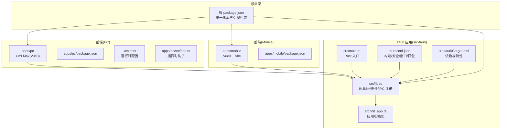
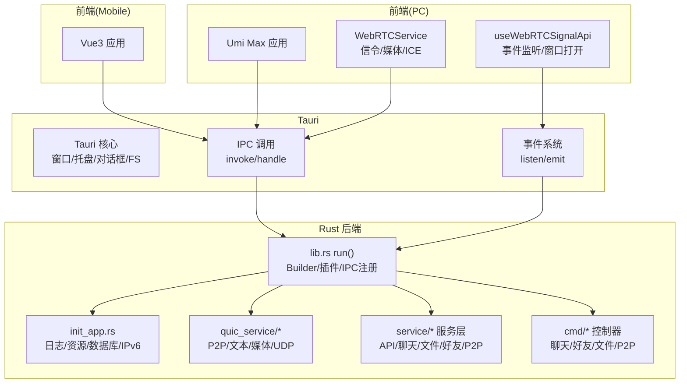
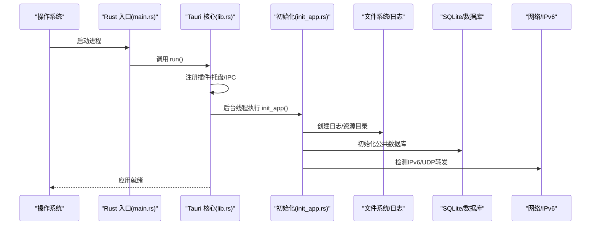
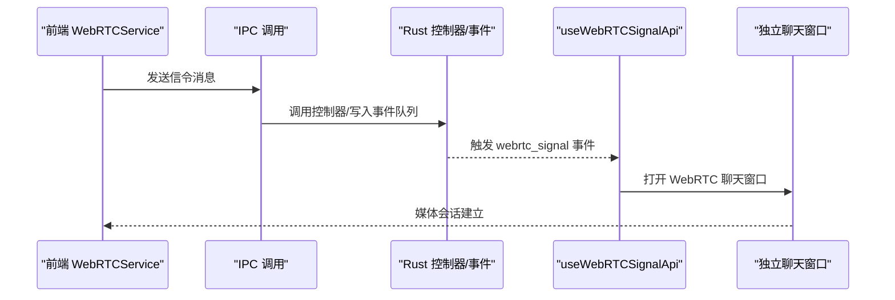
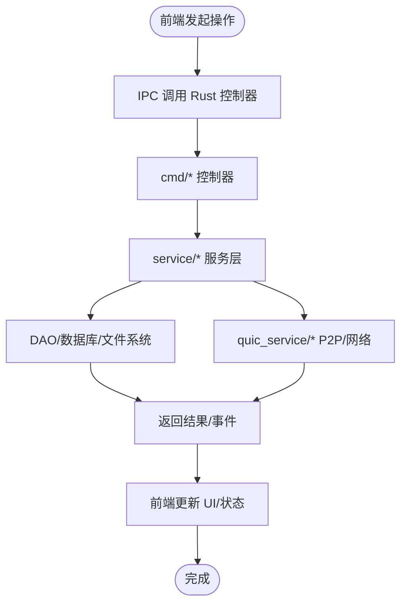
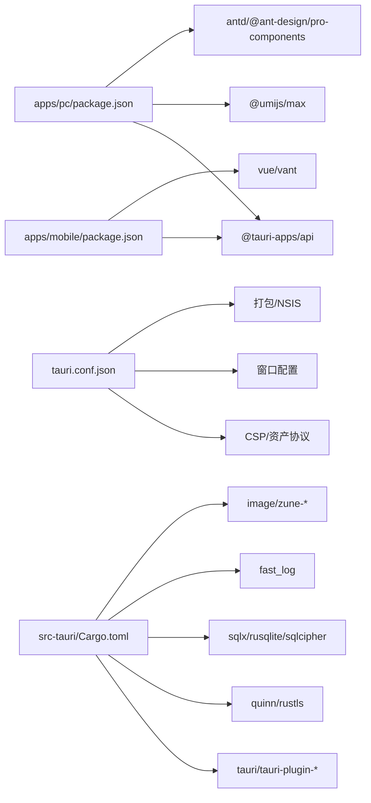

# 整体架构

<cite>
**本文引用的文件**
- [Cargo.toml](file://src-tauri/Cargo.toml)
- [tauri.conf.json](file://src-tauri/tauri.conf.json)
- [package.json](file://package.json)
- [apps/pc/package.json](file://apps/pc/package.json)
- [apps/mobile/package.json](file://apps/mobile/package.json)
- [src/main.rs](file://src-tauri/src/main.rs)
- [src/lib.rs](file://src-tauri/src/lib.rs)
- [src/init_app.rs](file://src-tauri/src/init_app.rs)
- [src/cmd/mod.rs](file://src-tauri/src/cmd/mod.rs)
- [src/service/mod.rs](file://src-tauri/src/service/mod.rs)
- [src/quic_service/mod.rs](file://src-tauri/src/quic_service/mod.rs)
- [apps/pc/.umirc.ts](file://apps/pc/.umirc.ts)
- [apps/pc/src/app.ts](file://apps/pc/src/app.ts)
- [apps/pc/src/services/webrtcService/index.ts](file://apps/pc/src/services/webrtcService/index.ts)
- [apps/pc/src/hooks/useWebRTCSignalApi.ts](file://apps/pc/src/hooks/useWebRTCSignalApi.ts)
</cite>

## 目录
1. [引言](#引言)
2. [项目结构](#项目结构)
3. [核心组件](#核心组件)
4. [架构总览](#架构总览)
5. [详细组件分析](#详细组件分析)
6. [依赖分析](#依赖分析)
7. [性能考量](#性能考量)
8. [故障排查指南](#故障排查指南)
9. [结论](#结论)
10. [附录](#附录)

## 引言
本项目采用“Rust + Tauri + Vue3”的混合架构，构建一款即时通讯应用。前端以 Umi Max（Vue3 + React 组件生态）为主，通过 Tauri 桥接 Rust 后端能力，实现跨平台桌面与移动端部署。系统强调前后端分离与模块化，通过 IPC 调用 Rust 模块完成网络、存储、加密、P2P/WebRTC 等核心功能；同时利用 Tauri 的窗口、托盘、对话框、文件系统等原生能力，提供接近原生的用户体验。

## 项目结构
项目采用 monorepo 结构，根目录通过脚本统一编排 PC 与 Mobile 应用以及服务/类型包的构建；Tauri 应用位于 src-tauri，PC 端前端位于 apps/pc，移动端前端位于 apps/mobile。Tauri 配置文件集中于 tauri.conf.json，Rust 二进制入口在 src/main.rs，应用初始化逻辑在 src/lib.rs 与 src/init_app.rs 中。

图表来源
- [package.json:1-30](file://package.json#L1-L30)
- [apps/pc/package.json:1-45](file://apps/pc/package.json#L1-L45)
- [apps/mobile/package.json:1-37](file://apps/mobile/package.json#L1-L37)
- [src-tauri/src/main.rs:1-8](file://src-tauri/src/main.rs#L1-L8)
- [src-tauri/src/lib.rs:1-167](file://src-tauri/src/lib.rs#L1-L167)
- [src-tauri/src/init_app.rs:1-186](file://src-tauri/src/init_app.rs#L1-L186)
- [src-tauri/tauri.conf.json:1-58](file://src-tauri/tauri.conf.json#L1-L58)
- [src-tauri/Cargo.toml:1-62](file://src-tauri/Cargo.toml#L1-L62)

章节来源
- [package.json:1-30](file://package.json#L1-L30)
- [apps/pc/package.json:1-45](file://apps/pc/package.json#L1-L45)
- [apps/mobile/package.json:1-37](file://apps/mobile/package.json#L1-L37)
- [src-tauri/src/main.rs:1-8](file://src-tauri/src/main.rs#L1-L8)
- [src-tauri/src/lib.rs:1-167](file://src-tauri/src/lib.rs#L1-L167)
- [src-tauri/src/init_app.rs:1-186](file://src-tauri/src/init_app.rs#L1-L186)
- [src-tauri/tauri.conf.json:1-58](file://src-tauri/tauri.conf.json#L1-L58)
- [src-tauri/Cargo.toml:1-62](file://src-tauri/Cargo.toml#L1-L62)

## 核心组件
- Rust 后端与 Tauri 桥接
  - 入口与运行时：Rust 主程序入口负责初始化 Tokio 运行时并调用应用运行函数；应用运行函数通过 Tauri Builder 注册插件、托盘、全局状态、IPC 调用处理函数，并启动应用。
  - 初始化流程：应用启动时在后台线程执行初始化，创建日志、资源目录、SQLite 数据库、IPv6 UDP 转发检测等；在移动平台复制资源到可访问目录。
- 前端(PC)
  - Umi Max 配置：启用国际化、路由、模型、请求等插件；PC 端通过 Tauri CLI 与 Rust 交互。
  - 运行时钩子：提供 onRouteChange 与 getInitialState 等运行时配置，便于全局状态与路由守卫集成。
- 前端(Mobile)
  - Vue3 + Vite，通过 @tauri-apps/api 与 Rust 通信。
- WebRTC 服务
  - 前端提供 WebRTCService，封装 RTCPeerConnection 生命周期、信令交换、DataChannel、媒体轨道、NAT3 穿透优化与 ICE 重启策略。
  - 信令桥接：通过 Tauri 事件监听与 IPC 调用，将 WebRTC 信令转发至 Rust 层或打开独立聊天窗口承载媒体流。

章节来源
- [src-tauri/src/main.rs:1-8](file://src-tauri/src/main.rs#L1-L8)
- [src-tauri/src/lib.rs:1-167](file://src-tauri/src/lib.rs#L1-L167)
- [src-tauri/src/init_app.rs:1-186](file://src-tauri/src/init_app.rs#L1-L186)
- [apps/pc/.umirc.ts:1-22](file://apps/pc/.umirc.ts#L1-L22)
- [apps/pc/src/app.ts:1-23](file://apps/pc/src/app.ts#L1-L23)
- [apps/pc/src/services/webrtcService/index.ts:1-800](file://apps/pc/src/services/webrtcService/index.ts#L1-L800)
- [apps/pc/src/hooks/useWebRTCSignalApi.ts:1-100](file://apps/pc/src/hooks/useWebRTCSignalApi.ts#L1-L100)

## 架构总览
系统采用“前端(Umi/Vue3)+Tauri桥接+Rust后端”的分层架构。前端负责 UI 与业务交互，Tauri 负责窗口、托盘、对话框、文件系统、协议与安全策略，Rust 负责高性能网络、存储、加密与 P2P/WebRTC 能力。IPC 作为前后端交互的核心通道，配合事件总线实现松耦合。

图表来源
- [src-tauri/src/lib.rs:1-167](file://src-tauri/src/lib.rs#L1-L167)
- [src-tauri/src/init_app.rs:1-186](file://src-tauri/src/init_app.rs#L1-L186)
- [src-tauri/src/cmd/mod.rs:1-10](file://src-tauri/src/cmd/mod.rs#L1-L10)
- [src-tauri/src/service/mod.rs:1-7](file://src-tauri/src/service/mod.rs#L1-L7)
- [src-tauri/src/quic_service/mod.rs:1-7](file://src-tauri/src/quic_service/mod.rs#L1-L7)
- [apps/pc/src/services/webrtcService/index.ts:1-800](file://apps/pc/src/services/webrtcService/index.ts#L1-L800)
- [apps/pc/src/hooks/useWebRTCSignalApi.ts:1-100](file://apps/pc/src/hooks/useWebRTCSignalApi.ts#L1-L100)

## 详细组件分析

### 应用启动与初始化流程
- 启动顺序
  - Rust 入口加载 Tokio 运行时，调用应用运行函数。
  - Tauri Builder 注册插件（对话框、文件系统、系统打开器）、托盘、全局状态与 IPC 处理函数。
  - 在后台线程执行初始化：创建日志、资源目录、SQLite 数据库、IPv6 UDP 转发检测；在移动平台复制资源到可访问目录。
- 前端联动
  - PC 端通过 Tauri CLI 与 Rust 交互；运行时钩子提供路由与全局状态初始化入口。

图表来源
- [src-tauri/src/main.rs:1-8](file://src-tauri/src/main.rs#L1-L8)
- [src-tauri/src/lib.rs:1-167](file://src-tauri/src/lib.rs#L1-L167)
- [src-tauri/src/init_app.rs:1-186](file://src-tauri/src/init_app.rs#L1-L186)

章节来源
- [src-tauri/src/main.rs:1-8](file://src-tauri/src/main.rs#L1-L8)
- [src-tauri/src/lib.rs:1-167](file://src-tauri/src/lib.rs#L1-L167)
- [src-tauri/src/init_app.rs:1-186](file://src-tauri/src/init_app.rs#L1-L186)

### IPC 与事件桥接（WebRTC 信令）
- 前端 WebRTCService 负责信令组装与发送，通过 IPC 调用 Rust 控制器或事件系统。
- useWebRTCSignalApi 监听来自 Rust 的 webrtc_signal 事件，解析信令消息并打开独立聊天窗口承载媒体流。
- 该机制实现了“前端信令 + Rust 事件/IPC”的解耦，便于扩展与维护。

图表来源
- [apps/pc/src/services/webrtcService/index.ts:1-800](file://apps/pc/src/services/webrtcService/index.ts#L1-L800)
- [apps/pc/src/hooks/useWebRTCSignalApi.ts:1-100](file://apps/pc/src/hooks/useWebRTCSignalApi.ts#L1-L100)

章节来源
- [apps/pc/src/services/webrtcService/index.ts:1-800](file://apps/pc/src/services/webrtcService/index.ts#L1-L800)
- [apps/pc/src/hooks/useWebRTCSignalApi.ts:1-100](file://apps/pc/src/hooks/useWebRTCSignalApi.ts#L1-L100)

### 数据流与控制流（聊天/文件/P2P）
- 控制器层(cmd)：封装 HTTP 请求、聊天记录、会话、好友、文件、通知、P2P 等操作，统一通过 generate_handler 注册到 IPC。
- 服务层(service)：封装业务逻辑，复用 DAO 与实体模型。
- QUIC 服务(quic_service)：提供 P2P 文本/媒体/UDP 转发、中心服务、安全/危险配置等能力。
- 前端通过 @tauri-apps/api.invoke 调用 Rust 控制器，实现前后端解耦。

图表来源
- [src-tauri/src/lib.rs:117-163](file://src-tauri/src/lib.rs#L117-L163)
- [src-tauri/src/cmd/mod.rs:1-10](file://src-tauri/src/cmd/mod.rs#L1-L10)
- [src-tauri/src/service/mod.rs:1-7](file://src-tauri/src/service/mod.rs#L1-L7)
- [src-tauri/src/quic_service/mod.rs:1-7](file://src-tauri/src/quic_service/mod.rs#L1-L7)

章节来源
- [src-tauri/src/lib.rs:117-163](file://src-tauri/src/lib.rs#L117-L163)
- [src-tauri/src/cmd/mod.rs:1-10](file://src-tauri/src/cmd/mod.rs#L1-L10)
- [src-tauri/src/service/mod.rs:1-7](file://src-tauri/src/service/mod.rs#L1-L7)
- [src-tauri/src/quic_service/mod.rs:1-7](file://src-tauri/src/quic_service/mod.rs#L1-L7)

## 依赖分析
- 技术栈与特性
  - Rust: Tauri 2、Tokio、SQLx(rusqlite + sqlcipher)、QUIC(rustls)、日志(fast_log)、并发(dashmap)、图像(zune-webp 等)。
  - 前端(PC): Umi Max、Ant Design、Dva/Zustand、React 组件生态。
  - 前端(Mobile): Vue3、Vite、Vant。
  - Tauri: 插件(Dialog、FS、Opener)、安全策略(CSP、资产协议)、窗口与打包。
- 依赖关系可视化

图表来源
- [apps/pc/package.json:1-45](file://apps/pc/package.json#L1-L45)
- [apps/mobile/package.json:1-37](file://apps/mobile/package.json#L1-L37)
- [src-tauri/tauri.conf.json:1-58](file://src-tauri/tauri.conf.json#L1-L58)
- [src-tauri/Cargo.toml:1-62](file://src-tauri/Cargo.toml#L1-L62)

章节来源
- [apps/pc/package.json:1-45](file://apps/pc/package.json#L1-L45)
- [apps/mobile/package.json:1-37](file://apps/mobile/package.json#L1-L37)
- [src-tauri/tauri.conf.json:1-58](file://src-tauri/tauri.conf.json#L1-L58)
- [src-tauri/Cargo.toml:1-62](file://src-tauri/Cargo.toml#L1-L62)

## 性能考量
- Rust 层
  - 使用 Tokio 全栈异步，QUIC 与 rustls 提升网络性能与安全性；dashmap 提供高并发读写；rusqlite + sqlcipher 保障本地存储安全与性能。
  - 日志采用异步滚动切分，降低 IO 压力。
- 前端层
  - Umi Max 构建优化、最小化 IIFE、按需加载；Vue3 + Vite 移动端构建提升开发体验。
- 网络与媒体
  - WebRTC NAT3 穿透优化：大量 STUN、多端口探测、候选池、ICE 重启与超时策略，适配复杂网络环境。

## 故障排查指南
- 启动失败
  - 检查 Rust 初始化日志与资源复制流程；确认 SQLite 初始化与 IPv6 检测输出。
- IPC 调用异常
  - 核对 generate_handler 注册列表与前端 invoke 名称一致性；检查 Tauri 插件是否正确加载。
- WebRTC 连接问题
  - 查看 ICE 候选统计与状态变化日志；确认 STUN 列表可用性与 TURN 策略；检查 ICE 重启与超时配置。
- 资源访问问题（移动端）
  - 确认资源复制到可访问目录的逻辑与路径；检查资产协议与 CSP 配置。

章节来源
- [src-tauri/src/init_app.rs:1-186](file://src-tauri/src/init_app.rs#L1-L186)
- [src-tauri/src/lib.rs:117-163](file://src-tauri/src/lib.rs#L117-L163)
- [apps/pc/src/services/webrtcService/index.ts:1-800](file://apps/pc/src/services/webrtcService/index.ts#L1-L800)

## 结论
本项目以 Tauri 为桥梁，将 Rust 的高性能与安全性与前端的快速迭代能力结合，形成稳定的即时通讯应用架构。通过 IPC 与事件系统实现前后端解耦，通过模块化组织 Rust 侧的控制器、服务与 QUIC 能力，满足跨平台、低延迟与强安全需求。架构具备良好的扩展性与演进空间，适合持续迭代与功能拓展。

## 附录
- 系统边界
  - 前端：PC/Mobile 应用，负责 UI、交互与业务编排。
  - Tauri：负责窗口、托盘、对话框、文件系统、协议与安全策略。
  - Rust：负责网络、存储、加密、P2P/WebRTC、全局状态与任务调度。
- 技术选型理由
  - Tauri 相较 Electron：更小体积、更低内存占用、更好的跨平台原生集成。
  - Vue3/Umi：生态成熟、开发效率高、组件化程度高。
  - Rust：系统级语言，保证网络与存储性能与安全。
- 架构演进建议
  - 引入统一错误码与响应模型，增强前后端契约稳定性。
  - 增加可观测性（埋点/指标/追踪），完善日志与告警。
  - 持续优化 WebRTC NAT3 穿透参数与候选策略，适配更多网络场景。