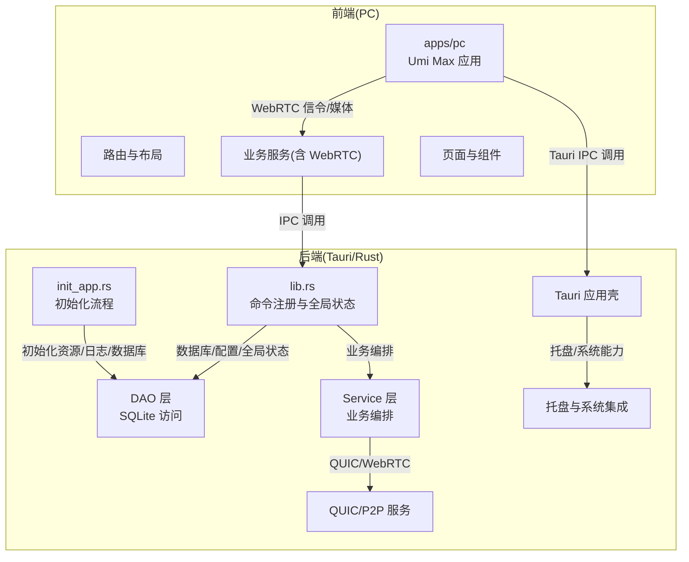
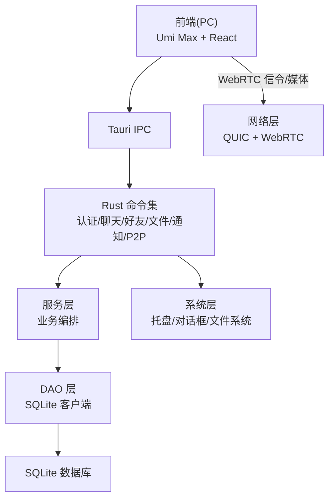
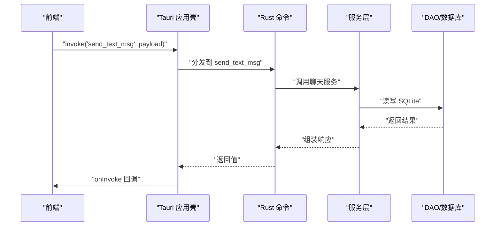
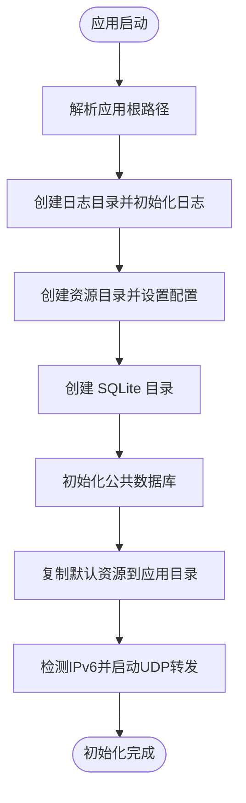
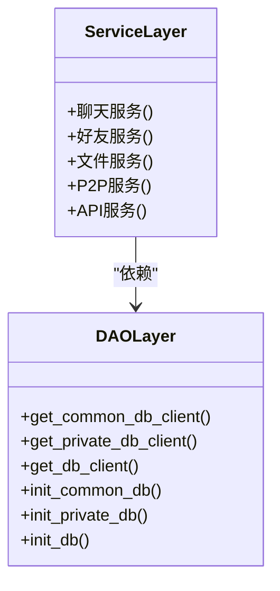
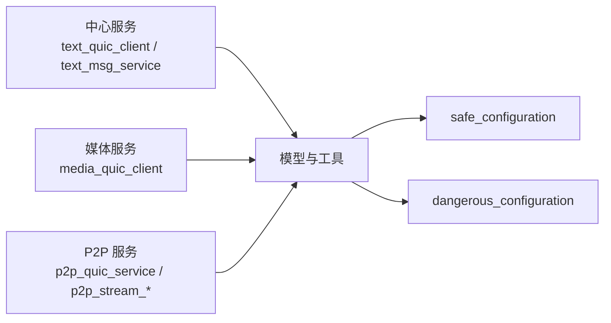
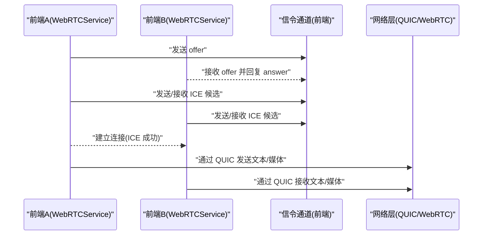
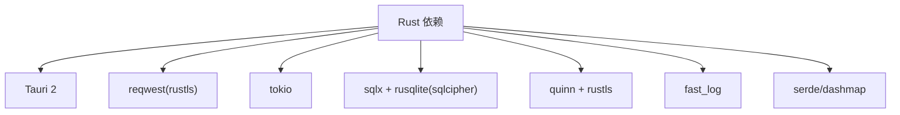
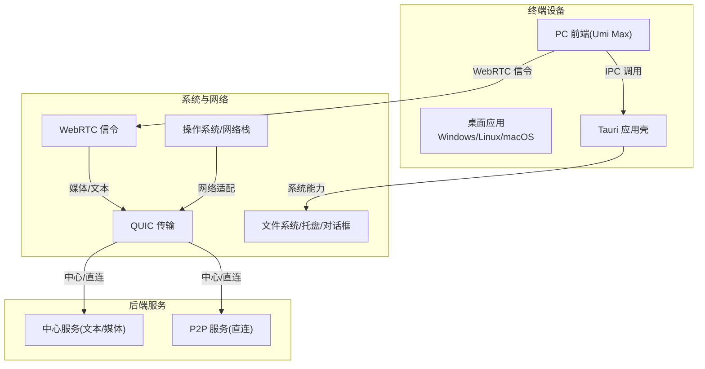

# 架构设计

<cite>
**本文引用的文件**
- [Cargo.toml](file://src-tauri/Cargo.toml)
- [tauri.conf.json](file://src-tauri/tauri.conf.json)
- [main.rs](file://src-tauri/src/main.rs)
- [lib.rs](file://src-tauri/src/lib.rs)
- [init_app.rs](file://src-tauri/src/init_app.rs)
- [cmd/mod.rs](file://src-tauri/src/cmd/mod.rs)
- [service/mod.rs](file://src-tauri/src/service/mod.rs)
- [dao/mod.rs](file://src-tauri/src/dao/mod.rs)
- [quic_service/mod.rs](file://src-tauri/src/quic_service/mod.rs)
- [package.json（PC 应用）](file://apps/pc/package.json)
- [package.json（根工作区）](file://package.json)
- [.umirc.ts（PC 应用）](file://apps/pc/.umirc.ts)
- [app.ts（PC 应用运行时配置）](file://apps/pc/src/app.ts)
- [webrtcService/index.ts](file://apps/pc/src/services/webrtcService/index.ts)
</cite>

## 目录

1. [引言](#引言)
2. [项目结构](#项目结构)
3. [核心组件](#核心组件)
4. [架构总览](#架构总览)
5. [详细组件分析](#详细组件分析)
6. [依赖分析](#依赖分析)
7. [性能考量](#性能考量)
8. [故障排查指南](#故障排查指南)
9. [结论](#结论)
10. [附录](#附录)

## 引言

本文件面向架构师与高级开发者，系统化阐述 Rust Tauri Umi 即时通讯应用的整体架构设计。该应用采用“前后端分离 + 桌面原生集成”的混合架构：前端基于 Umi Max（React 生态）构建 PC 端界面；后端以 Rust + Tauri 为核心，提供系统能力、本地数据库、网络服务与桌面托盘等；QUIC 作为 P2P 媒体与文本通道的底层传输协议，结合 WebRTC 的信令通道，实现低延迟、高鲁棒性的即时通讯体验。

## 项目结构

项目采用多包工作区组织，主要目录与职责如下：

- apps/pc：Umi Max 前端应用，提供聊天、联系人、设置等界面与交互逻辑。
- apps/mobile：移动端 Vue 应用（本架构文档聚焦 PC 端）。
- src-tauri：Rust 后端与 Tauri 集成层，包含命令导出、服务层、DAO 层、QUIC/P2P 服务、初始化流程与托盘等。
- packages/services、packages/types：跨应用共享的服务与类型定义。
- 根 package.json：统一脚本与工作区管理。

图表来源

- [lib.rs:91-166](file://src-tauri/src/lib.rs#L91-L166)
- [init_app.rs:19-91](file://src-tauri/src/init_app.rs#L19-L91)
- [tauri.conf.json:1-58](file://src-tauri/tauri.conf.json#L1-L58)

章节来源

- [package.json（根工作区）:1-30](file://package.json#L1-L30)
- [package.json（PC 应用）:1-45](file://apps/pc/package.json#L1-L45)
- [.umirc.ts（PC 应用）:1-22](file://apps/pc/.umirc.ts#L1-L22)

## 核心组件

- Tauri 应用壳与 IPC：负责窗口、托盘、系统对话框、文件系统插件以及将前端调用桥接到 Rust 命令。
- Rust 命令与全局状态：集中注册业务命令（认证、聊天、好友、文件、通知、P2P 等），维护全局配置、数据库连接池、QUIC 连接表、P2P 发送器等。
- 初始化流程：应用启动时创建日志、资源目录、SQLite 数据库，复制默认资源，检测 IPv6 支持并启动 UDP 转发。
- 服务层：封装业务逻辑，协调 DAO 与网络服务。
- DAO 层：抽象数据库客户端获取与表初始化，提供公共/私有/用户数据库访问。
- QUIC/P2P 服务：提供中心文本服务、P2P 流服务、UDP 工具与安全/危险配置。
- 前端 WebRTC 服务：封装信令、ICE 候选、DataChannel、媒体轨道、NAT3 穿透优化与 ICE 重启策略。

章节来源

- [lib.rs:1-167](file://src-tauri/src/lib.rs#L1-L167)
- [init_app.rs:1-186](file://src-tauri/src/init_app.rs#L1-L186)
- [dao/mod.rs:1-39](file://src-tauri/src/dao/mod.rs#L1-L39)
- [quic_service/mod.rs:1-7](file://src-tauri/src/quic_service/mod.rs#L1-L7)
- [webrtcService/index.ts:1-800](file://apps/pc/src/services/webrtcService/index.ts#L1-L800)

## 架构总览

系统拓扑分为三层：前端 UI 层、后端服务层、系统与网络层。前端通过 Tauri IPC 与 Rust 命令交互；业务逻辑在 Rust 服务层编排；数据持久化使用 SQLite；网络层采用 QUIC 与 WebRTC，其中 WebRTC 仅用于信令交换，实际媒体与文本通过 QUIC 实现。

图表来源

- [lib.rs:117-163](file://src-tauri/src/lib.rs#L117-L163)
- [tauri.conf.json:12-40](file://src-tauri/tauri.conf.json#L12-L40)
- [webrtcService/index.ts:1-800](file://apps/pc/src/services/webrtcService/index.ts#L1-L800)

## 详细组件分析

### 组件一：Tauri 应用壳与 IPC

- 初始化阶段设置全局 AppHandle、托盘、资源路径与日志；异步执行应用初始化。
- 注册大量命令，覆盖认证、聊天、好友、文件、通知、P2P 等业务场景。
- 通过插件启用对话框、文件系统与系统打开器能力。

图表来源

- [lib.rs:91-166](file://src-tauri/src/lib.rs#L91-L166)
- [cmd/mod.rs:1-10](file://src-tauri/src/cmd/mod.rs#L1-L10)

章节来源

- [lib.rs:91-166](file://src-tauri/src/lib.rs#L91-L166)
- [tauri.conf.json:12-40](file://src-tauri/tauri.conf.json#L12-L40)

### 组件二：应用初始化流程

- 解析并设置应用根路径、日志路径、资源目录与 SQLite 目录。
- 初始化公共数据库，复制默认资源至可访问目录（移动端打包场景）。
- 检测 IPv6 支持并启动 UDP 转发，保障 P2P/媒体传输可用性。

图表来源

- [init_app.rs:19-91](file://src-tauri/src/init_app.rs#L19-L91)

章节来源

- [init_app.rs:1-186](file://src-tauri/src/init_app.rs#L1-L186)

### 组件三：服务层与 DAO 层

- 服务层：聚合业务逻辑，协调数据库与网络服务。
- DAO 层：提供公共/私有/用户数据库客户端获取方法，封装表初始化与通用 CRUD。

图表来源

- [service/mod.rs:1-7](file://src-tauri/src/service/mod.rs#L1-L7)
- [dao/mod.rs:1-39](file://src-tauri/src/dao/mod.rs#L1-L39)

章节来源

- [service/mod.rs:1-7](file://src-tauri/src/service/mod.rs#L1-L7)
- [dao/mod.rs:1-39](file://src-tauri/src/dao/mod.rs#L1-L39)

### 组件四：QUIC/P2P 服务

- 中心文本服务与媒体客户端：负责与中心节点的文本消息与媒体数据传输。
- P2P 流服务：提供 P2P 流式传输、UDP 端口转发与 QUIC 客户端/服务端。
- 安全/危险配置：支持安全与危险模式下的 TLS/证书配置。
- 模块化组织：按中心服务、P2P 服务、模型与工具拆分。

图表来源

- [quic_service/mod.rs:1-7](file://src-tauri/src/quic_service/mod.rs#L1-L7)

章节来源

- [quic_service/mod.rs:1-7](file://src-tauri/src/quic_service/mod.rs#L1-L7)

### 组件五：前端 WebRTC 服务与 NAT3 穿透

- 优化的 STUN 服务器池、保留 host/srflx 候选、禁用 relay，提升 NAT3 穿透成功率。
- ICE 重启与超时策略：在连接失败/断开时自动重启，避免长时间无响应。
- DataChannel 与媒体轨道：统一管理消息回调、远程媒体流回调与本地/远端轨道开关。

图表来源

- [webrtcService/index.ts:1-800](file://apps/pc/src/services/webrtcService/index.ts#L1-L800)

章节来源

- [webrtcService/index.ts:1-800](file://apps/pc/src/services/webrtcService/index.ts#L1-L800)

## 依赖分析

- Rust 依赖：Tauri 2、reqwest(rustls)、tokio、sqlx(rusqlite+sqlcipher)、quinn、rustls、fast_log、serde、dashmap、image/webp/zune 等。
- 前端依赖：@umijs/max、@tauri-apps/api、@workspace/services、@workspace/types、antd、react-markdown、zustand 等。
- 构建与打包：Tauri CLI、NSIS 安装器钩子、PC 前端构建脚本。

图表来源

- [Cargo.toml:24-62](file://src-tauri/Cargo.toml#L24-L62)

章节来源

- [Cargo.toml:1-62](file://src-tauri/Cargo.toml#L1-L62)
- [package.json（PC 应用）:18-42](file://apps/pc/package.json#L18-L42)
- [package.json（根工作区）:4-14](file://package.json#L4-L14)

## 性能考量

- 启动与并发：Tokio 全栈运行时、异步日志、全局并发容器（DashMap）与互斥锁（Mutex）保障高并发场景稳定性。
- 数据库：SQLite 连接池复用，按需初始化公共/私有/用户数据库，减少 IO 开销。
- 网络：QUIC 提供多路复用与更低握手延迟；WebRTC 仅用于信令，媒体与文本走 QUIC，降低协议栈复杂度。
- 前端：Umi Max 构建优化（最小化 IIFE）、按需加载与组件拆分，降低首屏与交互延迟。
- 资源与缓存：应用启动时复制默认资源到可访问目录，避免运行时 IO；日志按日滚动与保留策略控制磁盘占用。

## 故障排查指南

- 初始化失败：检查日志目录创建、资源复制与 SQLite 初始化是否成功；确认 IPv6 支持与 UDP 转发是否可用。
- IPC 调用异常：核对命令注册列表与前端 invoke 名称一致；查看 Tauri 控制台错误堆栈。
- 数据库连接：确认连接池初始化与数据库文件路径；检查权限与磁盘空间。
- WebRTC 连接失败：关注 ICE 候选收集与状态变化日志；必要时调整 STUN 服务器或启用 ICE 重启策略。
- 托盘/系统能力：确认 Tauri 插件启用与 CSP 配置允许相应协议与作用域。

章节来源

- [init_app.rs:19-91](file://src-tauri/src/init_app.rs#L19-L91)
- [lib.rs:91-166](file://src-tauri/src/lib.rs#L91-L166)
- [webrtcService/index.ts:557-738](file://apps/pc/src/services/webrtcService/index.ts#L557-L738)

## 结论

该架构以 Tauri 为载体，将 Rust 的高性能与安全性与前端的交互体验有机结合。通过模块化设计与清晰的组件边界，实现了可扩展、可维护的即时通讯系统。QUIC 与 WebRTC 的合理分工，既满足了低延迟传输需求，又简化了信令与媒体的协同。建议持续关注网络适配（NAT3/NAT1）、数据库性能与前端构建体积，以进一步提升用户体验与可运维性。

## 附录

### 技术决策权衡

- 选择 Tauri 而非 Electron：更小的应用体积、更低的内存占用、更好的原生系统集成能力（托盘、系统对话框、文件系统）。
- QUIC 相较传统 TCP/UDP：更低的握手延迟、内置加密、多路复用，适合高并发与多媒体场景；WebRTC 仅承担信令，媒体与文本通过 QUIC，降低复杂度。
- NAT3 穿透优化：保留 host/srflx 候选、禁用 relay、ICE 重启与超时策略，显著提升在复杂网络环境下的连通性。

### 部署架构图

图表来源

- [tauri.conf.json:12-40](file://src-tauri/tauri.conf.json#L12-L40)
- [webrtcService/index.ts:1-800](file://apps/pc/src/services/webrtcService/index.ts#L1-L800)
- [quic_service/mod.rs:1-7](file://src-tauri/src/quic_service/mod.rs#L1-L7)
