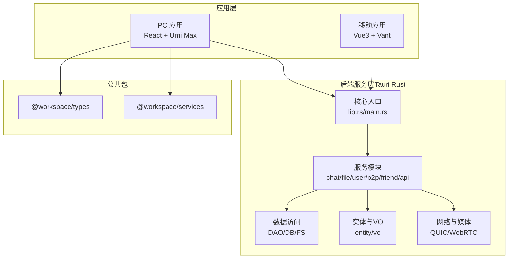
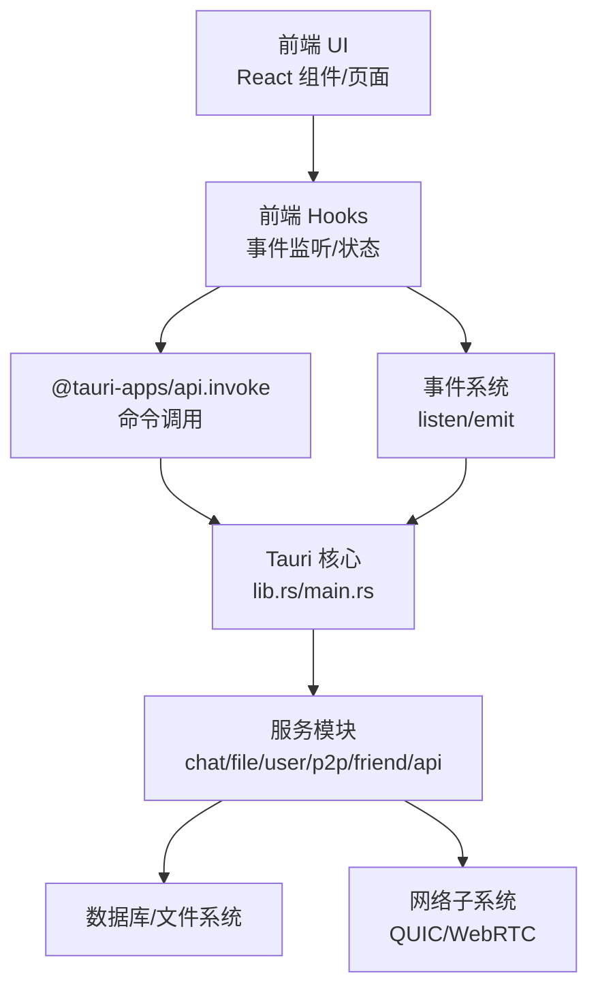
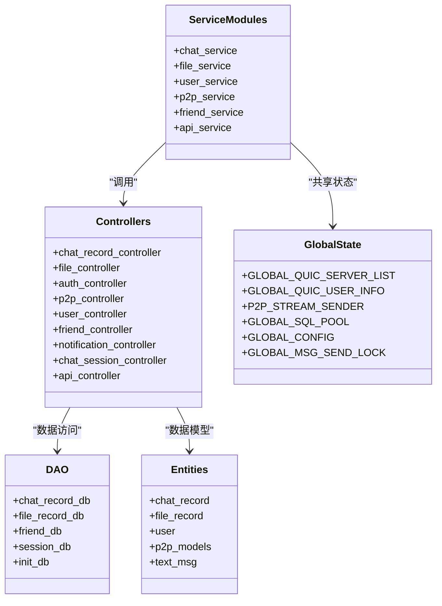
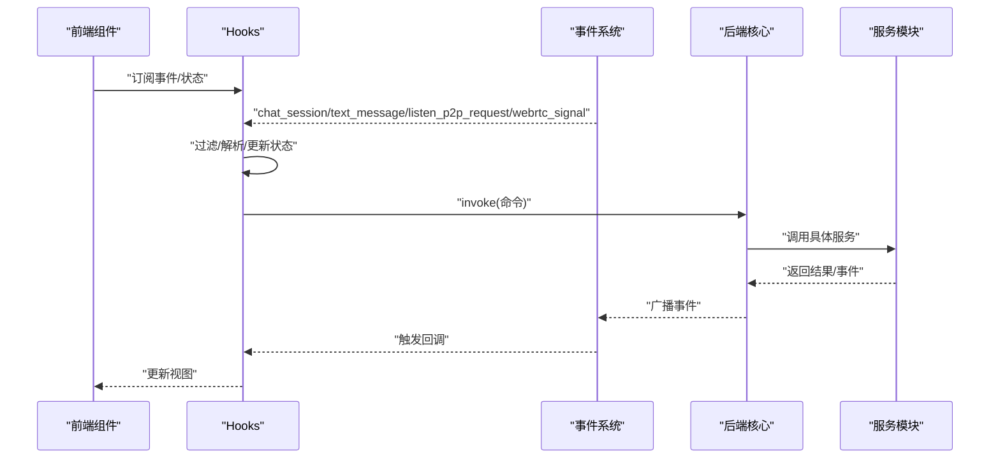
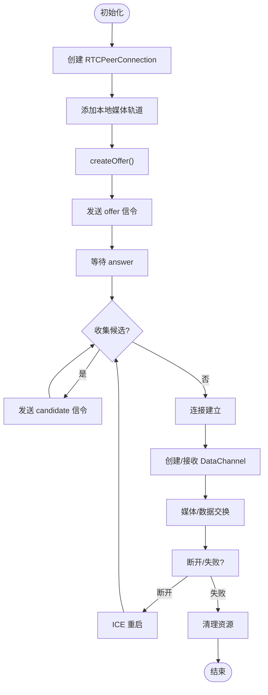
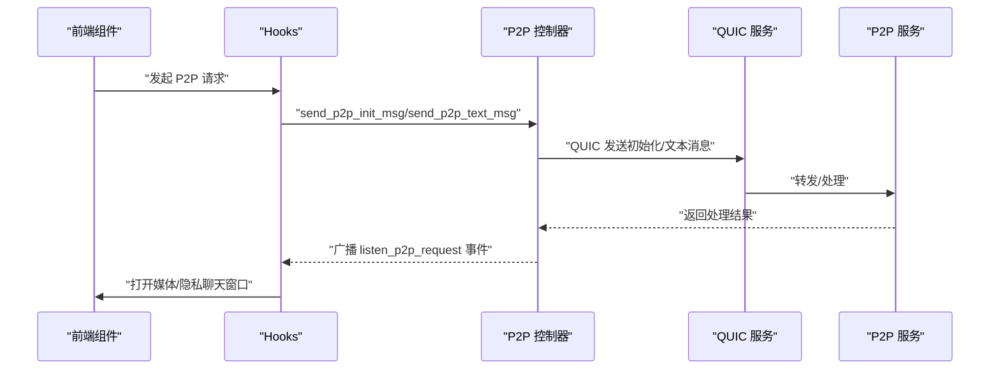
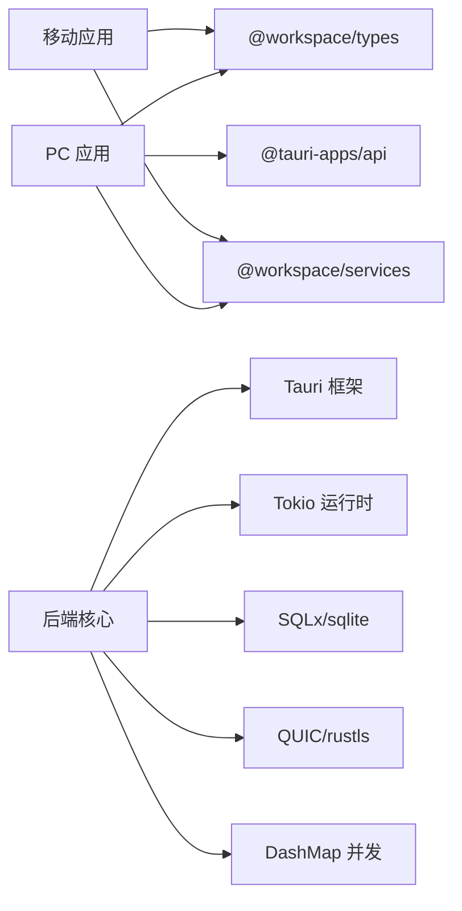

# 模块设计

<cite>
**本文引用的文件**
- [apps/pc/package.json](file://apps/pc/package.json)
- [apps/mobile/package.json](file://apps/mobile/package.json)
- [src-tauri/Cargo.toml](file://src-tauri/Cargo.toml)
- [src-tauri/src/lib.rs](file://src-tauri/src/lib.rs)
- [src-tauri/src/main.rs](file://src-tauri/src/main.rs)
- [src-tauri/src/service/mod.rs](file://src-tauri/src/service/mod.rs)
- [apps/pc/src/hooks/index.ts](file://apps/pc/src/hooks/index.ts)
- [apps/pc/src/hooks/useChatSession.ts](file://apps/pc/src/hooks/useChatSession.ts)
- [apps/pc/src/hooks/useMessageApi.ts](file://apps/pc/src/hooks/useMessageApi.ts)
- [apps/pc/src/hooks/useP2pMessageApi.ts](file://apps/pc/src/hooks/useP2pMessageApi.ts)
- [apps/pc/src/hooks/useWebRTCSignalApi.ts](file://apps/pc/src/hooks/useWebRTCSignalApi.ts)
- [apps/pc/src/services/webrtcService/index.ts](file://apps/pc/src/services/webrtcService/index.ts)
</cite>

## 目录
1. [引言](#引言)
2. [项目结构](#项目结构)
3. [核心组件](#核心组件)
4. [架构总览](#架构总览)
5. [详细组件分析](#详细组件分析)
6. [依赖分析](#依赖分析)
7. [性能考量](#性能考量)
8. [故障排查指南](#故障排查指南)
9. [结论](#结论)
10. [附录](#附录)

## 引言
本设计文档面向 Rust Tauri Umi 即时通讯应用，系统化阐述其模块化架构设计。后端以 Rust Tauri 为核心，提供聊天、文件、用户、P2P 等服务；前端采用 React + TypeScript + Umi Max，通过 Hooks 封装与后端通信，实现事件监听、消息分发与窗口调度。文档重点说明模块边界、职责分离、接口契约与通信协议，给出模块交互与依赖关系图，总结模块化带来的可维护性、可测试性与可扩展性优势。

## 项目结构
该仓库采用多包工作区布局：
- 应用层
  - PC 应用：React + Umi Max，负责 UI、事件监听与窗口调度
  - 移动应用：Vue3 + Vant，负责移动端界面与基础能力
- 后端服务层（Tauri Rust）
  - 核心入口：lib.rs 注册命令与全局状态
  - 服务模块：chat_service、file_service、user_service、p2p_service、friend_service、api_service
  - 数据访问：DAO 层（数据库、文件系统）
  - 实体与 VO：实体模型、传输对象
  - QUIC/WebRTC：P2P 与媒体通道
- 公共依赖
  - 类型与服务包：@workspace/types、@workspace/services
  - Tauri 插件：dialog、fs、opener 等

图表来源
- [apps/pc/package.json:18-31](file://apps/pc/package.json#L18-L31)
- [apps/mobile/package.json:16-24](file://apps/mobile/package.json#L16-L24)
- [src-tauri/src/lib.rs:12-54](file://src-tauri/src/lib.rs#L12-L54)
- [src-tauri/src/service/mod.rs:1-7](file://src-tauri/src/service/mod.rs#L1-L7)

章节来源
- [apps/pc/package.json:1-45](file://apps/pc/package.json#L1-L45)
- [apps/mobile/package.json:1-37](file://apps/mobile/package.json#L1-L37)
- [src-tauri/src/lib.rs:1-167](file://src-tauri/src/lib.rs#L1-L167)
- [src-tauri/src/service/mod.rs:1-7](file://src-tauri/src/service/mod.rs#L1-L7)

## 核心组件
- 后端服务模块划分
  - 聊天服务：会话与消息持久化、消息读取标记、消息类型处理
  - 文件服务：本地文件与业务文件的读取、上传、压缩转码
  - 用户服务：登录、登出、用户信息缓存与查询
  - P2P 服务：P2P 初始化、UDP/QUIC 信令、音视频配置与帧传输
  - 好友服务：好友列表、好友信息、本地好友缓存
  - API 服务：HTTP 请求封装、表单上传、压缩图片等通用能力
- 前端组件模块组织
  - 页面与布局：Home、Contacts、Settings、PrivacyChat、WebRTCChat 等
  - 组件库：Button、DevAssistant、LeftAside、TopBar、ToolButtons、Media 等
  - Hooks：useChatSession、useMessageApi、useP2pMessageApi、useWebRTCSignalApi、useWindowDrag 等
  - 服务层：webrtcService（WebRTC 连接、信令、媒体流管理）
- 模块边界与职责
  - 后端：以服务模块为边界，DAO 负责数据访问，实体/VO 定义数据契约
  - 前端：页面/组件与 Hooks 解耦，通过事件与 invoke 与后端交互
  - 通信：Tauri invoke + 事件广播；WebRTC 与 QUIC 作为独立网络子系统

章节来源
- [src-tauri/src/service/mod.rs:1-7](file://src-tauri/src/service/mod.rs#L1-L7)
- [apps/pc/src/hooks/index.ts:1-6](file://apps/pc/src/hooks/index.ts#L1-L6)
- [apps/pc/src/services/webrtcService/index.ts:1-800](file://apps/pc/src/services/webrtcService/index.ts#L1-L800)

## 架构总览
后端通过 Tauri Builder 注册命令与插件，统一初始化数据库、托盘与全局状态；前端通过 @tauri-apps/api 的 invoke 与事件监听与后端交互。WebRTC 与 QUIC 分别承载实时信令与媒体通道，形成“应用层 UI + 服务层 Rust + 网络层 QUIC/WebRTC”的三层架构。

图表来源
- [src-tauri/src/lib.rs:91-166](file://src-tauri/src/lib.rs#L91-L166)
- [apps/pc/src/hooks/useChatSession.ts:1-49](file://apps/pc/src/hooks/useChatSession.ts#L1-L49)
- [apps/pc/src/hooks/useMessageApi.ts:1-45](file://apps/pc/src/hooks/useMessageApi.ts#L1-L45)
- [apps/pc/src/hooks/useP2pMessageApi.ts:1-114](file://apps/pc/src/hooks/useP2pMessageApi.ts#L1-L114)
- [apps/pc/src/hooks/useWebRTCSignalApi.ts:1-100](file://apps/pc/src/hooks/useWebRTCSignalApi.ts#L1-L100)

## 详细组件分析

### 后端服务模块（Rust Tauri）
- 模块组织
  - service/mod.rs 汇总导出 chat/file/user/p2p/friend/api 服务模块
  - cmd/* 控制器注册为 Tauri 命令，lib.rs 中集中 generate_handler
  - entity/vo 定义数据模型与传输对象
  - dao/* 提供数据库与文件系统访问
- 关键职责
  - 聊天服务：会话创建、消息持久化、消息读取标记、消息类型处理
  - 文件服务：本地文件读取、业务文件查询、多文件上传、图片压缩
  - 用户服务：登录、登出、用户信息缓存
  - P2P 服务：P2P 初始化、UDP/QUIC 信令、音视频配置与帧传输
  - 好友服务：好友列表、好友信息、本地好友缓存
  - API 服务：HTTP 请求、表单上传、压缩图片
- 全局状态与并发
  - lib.rs 定义全局共享状态（QUIC 连接、用户映射、SQL 连接池、全局配置、消息发送锁）

图表来源
- [src-tauri/src/service/mod.rs:1-7](file://src-tauri/src/service/mod.rs#L1-L7)
- [src-tauri/src/lib.rs:26-54](file://src-tauri/src/lib.rs#L26-L54)

章节来源
- [src-tauri/src/service/mod.rs:1-7](file://src-tauri/src/service/mod.rs#L1-L7)
- [src-tauri/src/lib.rs:12-75](file://src-tauri/src/lib.rs#L12-L75)

### 前端 Hooks 封装机制
- useChatSession：监听 chat_session 事件，按 recv_uuid 过滤并更新会话状态
- useMessageApi：监听 text_message 事件，按 recv_uuid 与 send_uuid 过滤消息
- useP2pMessageApi：监听 listen_p2p_request 事件，解析 P2P 初始化/同意/拒绝消息并打开对应窗口
- useWebRTCSignalApi：监听 webrtc_signal 事件，解析 offer 并打开 WebRTC 聊天窗口
- 作用
  - 将事件监听与 UI 状态解耦
  - 通过 store/state 管理跨组件状态
  - 通过窗口打开函数实现轻量级路由式导航

图表来源
- [apps/pc/src/hooks/useChatSession.ts:1-49](file://apps/pc/src/hooks/useChatSession.ts#L1-L49)
- [apps/pc/src/hooks/useMessageApi.ts:1-45](file://apps/pc/src/hooks/useMessageApi.ts#L1-L45)
- [apps/pc/src/hooks/useP2pMessageApi.ts:1-114](file://apps/pc/src/hooks/useP2pMessageApi.ts#L1-L114)
- [apps/pc/src/hooks/useWebRTCSignalApi.ts:1-100](file://apps/pc/src/hooks/useWebRTCSignalApi.ts#L1-L100)
- [src-tauri/src/lib.rs:117-163](file://src-tauri/src/lib.rs#L117-L163)

章节来源
- [apps/pc/src/hooks/index.ts:1-6](file://apps/pc/src/hooks/index.ts#L1-L6)
- [apps/pc/src/hooks/useChatSession.ts:1-49](file://apps/pc/src/hooks/useChatSession.ts#L1-L49)
- [apps/pc/src/hooks/useMessageApi.ts:1-45](file://apps/pc/src/hooks/useMessageApi.ts#L1-L45)
- [apps/pc/src/hooks/useP2pMessageApi.ts:1-114](file://apps/pc/src/hooks/useP2pMessageApi.ts#L1-L114)
- [apps/pc/src/hooks/useWebRTCSignalApi.ts:1-100](file://apps/pc/src/hooks/useWebRTCSignalApi.ts#L1-L100)

### WebRTC 服务（前端）
- 职责
  - 管理 RTCPeerConnection 生命周期（创建、关闭）
  - 处理 WebRTC 信令交换（offer/answer/candidate）
  - 创建与管理 RTCDataChannel 数据通道
  - 处理信令消息收发与事件回调
  - 提供连接状态查询与媒体流控制
- 关键流程
  - 发起方：createOffer → sendSignal(offer) → handleAnswer → handleCandidate → 建立连接
  - 响应方：handleOffer → sendSignal(answer) → handleCandidate → 建立连接
- NAT3 穿透优化
  - 大量 STUN 服务器、多端口探测、候选池、ICE 重启、超时配置、不过滤 host 候选

图表来源
- [apps/pc/src/services/webrtcService/index.ts:131-800](file://apps/pc/src/services/webrtcService/index.ts#L131-L800)

章节来源
- [apps/pc/src/services/webrtcService/index.ts:1-800](file://apps/pc/src/services/webrtcService/index.ts#L1-L800)

### P2P 与 QUIC 通信协议
- QUIC 服务
  - 文本消息与媒体流通过 QUIC 客户端/服务端模块处理
  - 全局共享状态维护 QUIC 连接与发送器映射
- P2P 控制器
  - 提供 P2P 初始化、UDP/QUIC 信令、音视频配置与帧传输命令
- 前端协作
  - Hooks 监听 P2P 事件，打开媒体处理窗口或隐私聊天窗口

图表来源
- [src-tauri/src/lib.rs:45-50](file://src-tauri/src/lib.rs#L45-L50)
- [apps/pc/src/hooks/useP2pMessageApi.ts:65-82](file://apps/pc/src/hooks/useP2pMessageApi.ts#L65-L82)

章节来源
- [src-tauri/src/lib.rs:45-50](file://src-tauri/src/lib.rs#L45-L50)
- [apps/pc/src/hooks/useP2pMessageApi.ts:1-114](file://apps/pc/src/hooks/useP2pMessageApi.ts#L1-L114)

## 依赖分析
- 应用层依赖
  - PC 应用依赖 @workspace/types 与 @workspace/services，以及 @tauri-apps/api
  - 移动应用依赖 @workspace/types 与 @workspace/services
- 后端依赖
  - Tauri、tokio、sqlx、quinn、rustls、dashmap、image 等
  - 通过 Cargo.toml 管理版本与特性（如 sqlite、bundled-sqlcipher）
- 模块间耦合
  - 前端通过事件与 invoke 与后端松耦合
  - 服务模块内部通过 DAO/实体/VO 形成清晰边界
  - QUIC/WebRTC 作为独立网络子系统，通过控制器暴露命令

图表来源
- [apps/pc/package.json:18-31](file://apps/pc/package.json#L18-L31)
- [apps/mobile/package.json:16-24](file://apps/mobile/package.json#L16-L24)
- [src-tauri/Cargo.toml:24-62](file://src-tauri/Cargo.toml#L24-L62)

章节来源
- [apps/pc/package.json:1-45](file://apps/pc/package.json#L1-L45)
- [apps/mobile/package.json:1-37](file://apps/mobile/package.json#L1-L37)
- [src-tauri/Cargo.toml:1-62](file://src-tauri/Cargo.toml#L1-L62)

## 性能考量
- 并发与锁
  - 全局消息发送锁与并发容器（DashMap、Arc<RwLock>）保障线程安全
- 数据库与 IO
  - SQLite 连接池与加密（bundled-sqlcipher）提升安全性与吞吐
- 网络优化
  - QUIC 低时延与 WebRTC NAT3 穿透优化（大量 STUN、候选池、ICE 重启）
- 前端渲染
  - Hooks 将事件监听与状态更新局部化，减少不必要的重渲染

## 故障排查指南
- 事件未触发
  - 检查事件名称是否一致（chat_session、text_message、listen_p2p_request、webrtc_signal）
  - 确认过滤条件（recv_uuid/send_uuid）是否正确
- WebRTC 连接失败
  - 查看 ICE 候选统计与状态变化回调
  - 确认 STUN 服务器可用性与候选池大小
  - 检查 ICE 超时与重启策略
- P2P 通信异常
  - 核对 P2P 初始化消息与窗口打开逻辑
  - 检查 QUIC 服务端/客户端状态与发送器映射
- 数据库问题
  - 核对连接池初始化与表结构创建
  - 检查加密配置与权限

章节来源
- [apps/pc/src/hooks/useChatSession.ts:16-35](file://apps/pc/src/hooks/useChatSession.ts#L16-L35)
- [apps/pc/src/hooks/useMessageApi.ts:17-31](file://apps/pc/src/hooks/useMessageApi.ts#L17-L31)
- [apps/pc/src/hooks/useP2pMessageApi.ts:89-101](file://apps/pc/src/hooks/useP2pMessageApi.ts#L89-L101)
- [apps/pc/src/hooks/useWebRTCSignalApi.ts:62-84](file://apps/pc/src/hooks/useWebRTCSignalApi.ts#L62-L84)
- [apps/pc/src/services/webrtcService/index.ts:557-587](file://apps/pc/src/services/webrtcService/index.ts#L557-L587)

## 结论
该模块化设计以 Rust Tauri 为核心，结合前端 Hooks 与事件系统，实现了清晰的职责分离与高内聚低耦合。后端服务模块边界明确，前端通过统一的通信协议与后端交互；QUIC/WebRTC 独立运行，保证实时通信性能与稳定性。模块化架构显著提升了可维护性、可测试性与可扩展性，便于未来引入更多服务与功能。

## 附录
- 入口与初始化
  - 后端入口：main.rs 启动 tokio 主循环，调用 app_lib::run
  - 应用初始化：lib.rs 在 setup 中初始化托盘、全局状态与数据库
- 命令注册
  - lib.rs 通过 generate_handler 注册全部控制器命令，统一暴露给前端

章节来源
- [src-tauri/src/main.rs:1-8](file://src-tauri/src/main.rs#L1-L8)
- [src-tauri/src/lib.rs:77-115](file://src-tauri/src/lib.rs#L77-L115)
- [src-tauri/src/lib.rs:117-163](file://src-tauri/src/lib.rs#L117-L163)